# MASS ADAS L3 战术决策层系统架构设计报告

| 属性 | 值 |
|---|---|
| 文档编号 | SANGO-ADAS-L3-ARCH-001 |
| 版本 | **v1.1.2**（基于 v1.1.1 + 2026-05-06 RFC 决议 patch — 跨团队接口锁定）|
| 日期 | 2026-05-06 |
| 状态 | 正式设计稿（接口契约跨团队锁定；可启动详细功能设计 + 实现阶段）|
| 目标船型 | 45m FCB（首发）· 多船型可扩展 |
| 目标船级社 | CCS（中国船级社）单一入级 |
| 自主等级覆盖 | D2 – D4 全谱 |
| 修订基线 | v1.0 → v1.1（ADR-001/002/003）→ v1.1.1（6 新 finding 关闭）→ v1.1.2（RFC-001~006 决议 patch）|
| 关闭 finding（v1.1.2 累计）| P0=5 / P1=21 / P2=18 / P3=2 deferred + 跨团队接口锁定 |
| 简化 Phase 3+6 复审落点 | A 档（加严版）— 全表综合分 2.89 / P0=0 |
| RFC 决议归档 | `docs/Design/Cross-Team Alignment/RFC-decisions.md`（6 RFC 全部已批准）|

> **v1.1 修订摘要**（详见末尾"附录 D 修订记录"）：
> - **ADR-001**：决策四 Doer-Checker 双轨修订（"100×简单"措辞 + M7 ARBITRATOR 改为预定义 MRM 命令集 + 新增 §11.6/§11.7/§11.8 + SIL 2 SFF 补充）
> - **ADR-002**：决策一 ODD 作为组织原则修订（H 轴论证修订 + IMO MASS Code 章节修正 + CCS 认证链修复）
> - **ADR-003**：§3.x ODD 框架重写（Rødseth 二轴 + DNV-CG-0264 AROS 三维认证空间 + SAE J3259 属性树三层概念）
> - **接口对齐 — 方案 B 最优方案**：M5 → L4 schema 升级为 AvoidancePlan（1–2 Hz 主接口） + ReactiveOverrideCmd（事件 紧急接口），与 v3.0 Kongsberg 4-WP 思路对齐
> - 跨章节修订：§15 接口契约总表补全（ASDR / Reflex Arc / L3→L2 反向 / L1 上游 / M5→L4 双接口）+ 旧术语修复（§1.2 / §6 / §7 / §15）+ 新增附录 A/B/C 术语对照

> **v1.1 → v1.1.1 复审 patch 摘要**（详见附录 D + 附录 E）：
> - **F-NEW-001**（P1）：§11.6 MRM 命令集参数加 [初始设计值] 标注 + 补"4 kn 选择理由"（COLREG Rule 8 + FCB 制动曲线）+ 列入附录 E HAZID 校准清单
> - **F-NEW-002**（P1）：§15.1 CheckerVetoNotification IDL 改为枚举 enum；§11.7 注明 M7 仅按 enum 分类升级 SOTIF 告警，不解析自由文本（保持 Doer-Checker 独立性）
> - **F-NEW-003**（P2）：§3.6 Conformance_Score 权重表加 [TBD-HAZID 校准] 标注
> - **F-NEW-004**（P1）：§12.4 ToR 协议明确选择 (C) 交互验证（操作员主动点击"已知悉 SAT-1"按钮）作为 IMO MASS Code "有意味的人为干预" 合规实现
> - **F-NEW-005**（P2）：§11.9 增加"M7 SOTIF 暂停期间 M8 实时显示降级告警标志（< 100ms 时延）"
> - **F-NEW-006**（P2）：§11.9 增加"回切顺序：M7 先启动（恢复安全监控）→ 100ms → M5 启动（恢复规划）"

> **v1.1.1 → v1.1.2 RFC 决议 patch 摘要**（详见附录 D'' + RFC-decisions.md）：
> - **RFC-006 决议**：§15.1 新增 `ReplanResponseMsg` IDL（L2 → M3，事件触发，含 SUCCESS / FAILED_TIMEOUT / FAILED_INFEASIBLE / FAILED_NO_RESOURCES 四种状态）
> - **RFC-006 决议**：§15.2 接口矩阵新增 L2 → M3 ReplanResponseMsg 行
> - **RFC-004 决议**：§15.2 接口矩阵增补 M3 / M5 → ASDR ASDR_RecordMsg 行（v1.1.1 仅列 M1/M2/M4/M6/M7）
> - **RFC-003 决议**：§11.7 + §11.3 锁定 M7 监控窗口 = 100 周期 = **15 s 滑窗**（v1.1.1 仅说"100 周期"）
> - **RFC-001/002/005 决议**：v1.1.1 IDL 不变；跨团队接口承诺（详见 RFC-decisions.md）
> - **接口跨团队锁定证据**：`docs/Design/Cross-Team Alignment/RFC-decisions.md`

---

## 目录

1. 背景与设计约束
2. 核心架构决策
3. ODD / Operational Envelope 框架
4. 系统架构总览
5. M1 — ODD / Envelope Manager
6. M2 — World Model
7. M3 — Mission Manager
8. M4 — Behavior Arbiter
9. M6 — COLREGs Reasoner
10. M5 — Tactical Planner
11. M7 — Safety Supervisor
12. M8 — HMI / Transparency Bridge
13. 多船型参数化设计
14. CCS 入级路径映射
15. 接口契约总表
16. 参考文献

---

## 第一章 背景与设计约束

### 1.1 项目背景

本报告描述 MASS（Maritime Autonomous Surface Ship，海上自主水面船舶）系统的 **L3 战术决策层（Tactical Decision Layer，TDL）** 的完整架构设计。TDL 在系统层级中处于战略规划层（L2，Voyage Planner）与执行控制层（L4/L5，Heading/Speed Controller）之间，承担船舶在 D2–D4 自主等级下的全部实时决策职责。

首发船型为 45m **FCB（Fast Crew Boat，快速船员艇）**，运营于海上风电场（OWEC）船员转运场景。该船型为高速半滑行单体或双体构型，典型航速 18–25 kn，操纵性与普通排水型船舶有本质差异，是系统设计的"边界测试"船型。

### 1.2 设计边界

| 项目 | 在范围内 | 在范围外 |
|---|---|---|
| 避碰决策（COLREG 规则推理） | ✓ | |
| 局部轨迹规划（Mid-MPC + BC-MPC） | ✓ | |
| ODD 监控与包络管理 | ✓ | |
| 模式切换（D2/D3/D4）与降级 | ✓ | |
| 人机责任移交协议 | ✓ | |
| 多船型参数化扩展 | ✓ | |
| 全局航次规划（L1 任务层 Mission Layer + L2 航路规划层 Voyage Planner） | | ✓ |
| 传感器融合内部算法（Multimodal Fusion 多模态感知融合子系统） | | ✓ |
| 低级控制（舵机/油门 PID） | | ✓ |
| ROC 基础设施硬件 | | ✓ |

### 1.3 关键设计约束

**C1 — CCS 合规约束**：系统须满足 CCS《智能船舶规范》（2024/2025）的入级要求，覆盖 i-Ship (Nx, Ri/Ai) 标志组合。决策逻辑须白盒可审计，满足《船用软件安全及可靠性评估指南》的软件证据要求 [R1]。

**C2 — IMO MASS Code 约束**：系统须符合 IMO MSC 110（2025）输出及 MSC 111（2026-05）即将通过的非强制版 MASS Code 的功能要求，特别是：系统必须能够识别自身是否处于 Operational Envelope 之外 [R2]。

**C3 — 多船型兼容约束**：架构必须支持从 FCB（高速·半滑行）到拖船（低速·大推力）、渡船（大尺寸·多推进器）的参数化扩展，**不允许一船一设计**。水动力模型、操纵极限、传感器配置须可独立替换，不影响决策核心 [R3]。

**C4 — 人机工程约束**：系统对 ROC（Remote Operation Centre）操作员和船上船长的透明性须满足 SAT（Situation Awareness-based Agent Transparency）三层模型要求。ROC 操作员的接管时窗须 ≥ 60 秒（实证基础）[R4]。

**C5 — 功能安全约束**：核心安全功能须满足 IEC 61508 SIL 2 要求；感知降质与功能不足场景须按 ISO 21448 SOTIF 处理 [R5, R6]。

### 1.4 45m FCB 船型特殊性分析

FCB 的高速特性对 TDL 产生三项关键约束：

**停止距离约束**：18 kn 时典型制动距离约 600–800m，远超同吨位排水型船舶。Tactical Planner 的前视时域须同步加长，Mid-MPC 时域选取 ≥ 90s。

**转弯半径约束**：Yasukawa & Yoshimura（2015）MMG 标准方法的高速修正表明，半滑行船型在 20 kn 以上的旋回半径与速度平方成正比。COLREGs Rule 8「大幅」转向的最小幅度须在 FCB 水动力插件中重新量化，而非套用通常船舶的 30° 经验值 [R7]。

**波浪扰动约束**：FCB 在 Hs > 2.5m 时运动响应剧烈，感知系统可用性快速下降。此场景须在 ODD 框架中定义为独立的「恶劣海况」ODD 边界，触发自动降速和 MRC 准备。

---

## 第二章 核心架构决策

### 2.1 决策总览

本章记录四项驱动整个 TDL 架构形态的顶层决策。每项决策都有其替代方案和弃用理由。

### 2.2 决策一：ODD 作为组织原则，而非监控模块 [v1.1 修订 — ADR-002]

**决策内容**：以 ODD（Operational Design Domain）/ Operational Envelope 为整个 TDL **L3 内部**的组织原则，ODD 状态机（M1）是 L3 内部所有其他模块的调度枢纽。L3 内部 ODD 的状态变化是驱动 L3 行为切换的权威来源。**L3 内部 ODD（M1）与系统层 ODD 监控（IACS UR / Z-TOP 网络包络 / X-axis Checker）形成分层协作**——M1 不替代系统层 ODD 监控，而是补充 L3 内部场景的可审计调度。

**被弃用的替代方案**：将 ODD 监控作为一个旁路模块（即"算法先执行，ODD 偶尔检查"的模式）。这是历史上多数工业系统的做法，其根本缺陷是：各算法模块各自维护对当前状态的假设，当假设失效时没有统一的更新机制，导致"部分模块认为安全、部分模块已越界"的一致性危机。

**决策理由 [F-P0-D1-006 + F-P1-D1-007 修订]**：

Rødseth、Wennersberg 和 Nordahl（2022）定义二轴 OE：O = S_ext × S_int + FM（Function Mapping，状态→人机控制权分配）[R8]。本设计在 Rødseth 框架上扩展，将 FM 具体化为 H 轴（Human Availability，含 D1–D4 四级自主度 + TMR/TDL 量化参数），参考 IMO MASS Code D1–D4 定义 [R2]。三层 ODD 概念框架（Rødseth 二轴 + DNV-CG-0264 AROS 三维认证空间 + SAE J3259 属性树）的具体定义见 §3.2（详见 ADR-003）。

TMR（Maximum Operator Response Time）和 TDL（Automation Response Deadline）的量化基线：Rødseth（2022）提出 TMR/TDL 概念框架 [R8]；Veitch 等（2024）实证确定 TMR ≥ 60s 设计基线 [R4]。

IMO MASS Code 草案（MSC 110，2025）在 **Part 2 Chapter 1（运行环境/运行包络 OE）** 明确要求：系统必须能识别船舶是否处于 Operational Envelope 之外，且这一判断必须独立于任何具体的导航算法 [R2]。

**决策优势**：
- 任何单个模块的假设失效（感知降质、COLREGs 不可解析、ROC 失联）都能通过 M1 统一触发降级，避免级联失效
- ODD 状态是可审计的持久化状态，为 CCS 认证提供白盒证据
- 多船型参数化通过 ODD 模板库（船型特定的 Capability Manifest）实现，不侵入决策逻辑
- 与 v3.0 系统层 ODD（IACS UR / Z-TOP / X-axis）形成分层协作，避免重复实现系统层职责

### 2.3 决策二：8 模块功能分解 [v1.1 修订 — F-P1-D1-009]

**决策内容**：将 TDL 分解为 8 个功能边界清晰的模块（M1–M8），按照三个责任层组织：包络控制层（M1）、决策规划层（M2–M6）、安全接口层（M7–M8）。

**与现有候选方案的对比**（v1.1 增加候选 C — Kongsberg 5 模块对比）：

| 维度 | 候选 A（7 模块算法导向） | 候选 B（4+1 心智导向） | **候选 C（v3.0 Kongsberg 5 模块）** | 本报告 8 模块（ODD-centric） |
|---|---|---|---|---|
| ODD 位置 | 旁路监控 | 心智"+1" | 隐式分布在各模块 | 第一公民，L3 内部顶层枢纽 |
| COLREGs 位置 | 独立模块 | 嵌入 Avoidance Planner | 独立 COLREGs Engine | 独立模块 + ODD-aware 参数 |
| HMI 位置 | 接口适配 | 心智镜像 | Shore Link via DMZ（系统层）| 唯一 ROC/Captain 权威接口（M8）|
| 安全监督 | 分散在各模块 | Safety Checker | Risk Monitor + 系统层 X-axis | 独立 SOTIF + IEC 61508 双轨（M7）+ X-axis 协作（§11.7）|
| 多船型 | 抽象层隐含 | 心智通用性 | Parameter Database（系统横向支持）| Capability Manifest + PVA 显式解耦 |
| 模块清单 | 7 模块 | 4 模块 + 1 心智 | Target Tracker / COLREGs Engine / Avoidance Planner / Risk Monitor / Capability Assessment | M1 / M2 / M3 / M4 / M5 / M6 / M7 / M8 |

**候选 C 弃用理由**：v3.0 Kongsberg 5 模块将 ODD 隐式分布在各模块，不满足决策一（ODD 唯一权威）；将 Mission / 安全监督部分上提到系统层。本设计 8 模块通过引入 M1（L3 内部 ODD 调度）+ M3（任务跟踪）+ M7（L3 内部 SOTIF Checker）+ M8（HMI 唯一接口）提升认证可审计性。**v1.1 重要补充**：M1/M3/M7 与系统层（IACS UR / L1 Mission Layer / X-axis Checker）形成分层协作（详见 §5/§7/§11.7），不重复实现系统层职责。

**决策理由 [v1.1 修订]**：DNV-CG-0264（**2025.01**）第 4 章将导航功能分解为 9 个子功能（§4.2–§4.10）[R9]。本设计 8 个模块对这 9 个子功能实现 100% 覆盖映射（详见第 14 章），这是 CCS 接受 DNV 等效性验证的前提。CMU Boss（DARPA Urban Challenge 冠军）的 3 层规划栈（Mission Planning / Behavioral Executive / Motion Planning）提供了工业最强工程证据：按职责而非算法划分模块，是大型自主系统的最佳实践 [R10]。

> **附录 A 提示**：早期研究稿用 Stage 1（看）→ Stage 2（判）→ Stage 3（动）→ Stage 4（盯）框架；v1.0/v1.1 改用 M1–M8 模块名。Stage→Module 对照表见附录 A。

### 2.4 决策三：CMM 映射为 SAT-1/2/3 三层透明性接口 [v1.1 修订 — F-P1-D1-010]

**决策内容**：船长心智模型（Captain Mental Model，CMM）不作为系统内部的状态机实现，而是通过 SAT（Situation Awareness-based Agent Transparency）三层接口对外可观测：每个模块须实现 `current_state()`（SAT-1）、`rationale()`（SAT-2）、`forecast(Δt) + uncertainty()`（SAT-3）三个调用，统一由 M8 聚合呈现给 ROC / 船长。**v1.1 重要补充**：SAT 展示采用**自适应触发**策略，而非全层全时展示（详见 §12.2）。

**决策理由 [v1.1 修订]**：

Veitch 等（2024）的 n=32 实证研究表明，可用接管时窗（20s vs 60s）和 DSS（Decision Support System）可用性是 ROC 操作员绩效的最强影响因子 [R4]。Chen 等（ARL-TR-7180）的 SAT 三层框架是经典学术参考 [R11]。

**v1.1 关键修订（透明度悖论）**：USAARL（2026-02）+ NTNU Handover/Takeover（2024）实证发现"透明度悖论"——SAT-2 推理层全时展示反而升高认知负荷、降低多任务效率 [R5-aug]。最优策略是 **SAT-3 是操作员最高优先级**（在 TDL 压缩时优先推送），**SAT-2 按需触发**（COLREGs 冲突检测时 / 系统信心下降时 / 操作员显式请求时），**不默认全时展示**。M8 采用自适应分级展示策略（详见 §12.2）。

**将 CMM 实现为系统内部状态机会导致"算法语言 vs 船员语言"的语义鸿沟——CCS 验船师、船长、ROC 操作员无法对同一场景达成共识**。SAT 接口将这一翻译边界外置到 M8，便于审计与人因设计。

### 2.5 决策四：Doer-Checker 双轨安全模式 [v1.1 修订 — ADR-001]

**决策内容**：TDL 的安全架构采用 Doer-Checker 模式：M1–M6 作为 Doer（自主决策执行），M7（Safety Supervisor）作为 Checker（运行时安全仲裁器）。Checker 的代码规模须显著小于 Doer——工业实践目标 SLOC 比例 50:1 ~ 100:1（Boeing 777 Monitor ~50:1；Airbus FBW COM/MON >100:1）[R4]，以支持 DO-178C Level A / IEC 61508 SIL 2 形式化验证。**此为设计目标，非规范强制值**——IEC 61508 / DO-178C / [R12] Jackson 2021 Certified Control 均无量化倍数要求 [F-P0-D1-008 修正]。

**决策理由**：Jackson 等（MIT CSAIL，2021）的 Certified Control 框架从形式验证角度论证了这一分离的必要性：主控制器负责找到高性能解，安全监督器只负责验证解是否满足安全约束，后者的规约必须足够简单以支持形式化证明 [R12]。Boeing 777 的飞行控制系统（1 Command + 2 Monitor 通道，~50:1 SLOC，FAA 30 年认证）、Airbus FBW COM/MON（硬件 + 软件多样化，DAL A）和 NASA Auto-GCAS（98.5% 防护率，Monitor 触发预定义机动）都采用了类似的双轨架构 [R4]，是 SIL 3 认证的典型工业先例。

**v1.1 重要约束**：
- M7 Checker **不持有规划逻辑**——不动态生成轨迹，仅触发预定义 MRM 命令集（详见 §11.2 + §11.6 + ADR-001）
- M7（L3 内部 Checker）与 v3.0 X-axis Deterministic Checker（系统层 Checker）是**分层互补关系**，不是替代——M7 = SOTIF + IEC 61508 监控；X-axis = 跨层硬 VETO（详见 §11.7 + ADR-001）
- M7 实现路径独立性约束：不与 M1–M6 共享代码 / 库 / 数据结构（详见 §11.3 + §11.6）

---

## 第三章 ODD / Operational Envelope 框架

### 3.1 决策原因

本章定义 TDL 的操作基础——所有模块的行为参数、激活条件和降级触发都以此为依据。没有这个框架，任何模块的行为变化都是"碰巧正确"，而非"可证明正确"。

### 3.2 Operational Envelope 三层概念框架 [v1.1 重写 — ADR-003]

> **v1.0 → v1.1 重要修订 [F-P0-D6-015]**：v1.0 §3.2 直接给出三轴公式 O = E × T × H 并称源自 Rødseth 2022，但 Rødseth 2022 实际是二轴（O = S_ext × S_int + FM）。v1.1 重写为**三层概念框架**，使每层都有权威来源。

本设计基于三层概念框架（每层服务不同目的）：

#### 1. 数学定义层（Rødseth 二轴）[R8]

$$O = S_\text{ext} \times S_\text{int} + FM$$

- **$S_\text{ext}$**：外部环境状态（气象 / 交通 / 水域类型）
- **$S_\text{int}$**：内部技术状态（传感器健康 / 通信 / 系统健康）
- **FM**：Function Mapping — 状态 → 人机控制权分配（D1–D4 自主等级映射）

来源：Rødseth, Wennersberg, Nordahl (2022) *Towards approval of autonomous ship systems by their operational envelope*. JMSE 27(1):67-76 [R8]。Phase 2 R3 调研经 PMC 全文核验。

#### 2. 工程实现层（v1.1 三轴扩展，本设计选择）

$$\mathbb{O} = E \times T \times H$$

- **E（Environmental）= $S_\text{ext}$ 的工程实现**：水域类型（开阔/狭水道/港内）× 气象能见度 × 海况 Hs × 交通密度 × 流速
- **T（Technical）= $S_\text{int}$ 的工程实现**：任务阶段（Transit/Approach/Berthing/Crew-Transfer-Standby）× 速度域（巡航/低速/DP 精控）× 水深裕量 × GNSS / 雷达健康 × 通信延迟 × 系统温度
- **H（Human Availability）= FM 的具体化**：控制位置（船上/ROC/无人）× **D1–D4 自主等级（参考 IMO MASS Code D1–D4 [R2]）** × TMR（最大操作员响应时间，≥ 60s 实证基线 [R4]）× 通信链路质量

> **重要说明**：H 轴是本设计在 Rødseth 二轴框架上的**具体化扩展**——将 Rødseth FM（Function Mapping）通过 IMO MASS Code D1–D4 自主等级 + Veitch 2024 TMR 实证 + ROC HF 工程经验具体化为可量化的轴线。**H 轴不是 Rødseth 2022 原文定义**；这一扩展是 v1.0/v1.1 的工程选择。

#### 3. 认证审查层（DNV-CG-0264 AROS 三维认证空间）[R9]

DNV-CG-0264（2025.01）AROS Class Notations 定义三维**认证维度**：

$$(\text{Mission Complexity}, \text{Environmental Difficulty}, \text{Human Independence})$$

**注意**：DNV AROS 三维是**风险分级和功能级认证**用，**非 ODD 定义本身**。本设计 ODD 框架（E×T×H）映射到 AROS 三维认证空间作为合规证据。

#### 4. 属性表达层（SAE J3259 属性树）[新增]

ODD 子域属性的离散化表达使用 SAE J3259 属性树（与 ISO 34501:2022 兼容）：

- Scenery（场景属性）/ Environmental（环境属性）/ Dynamic（动态属性）/ Connectivity（连接属性）/ Temporal（时间属性）

属性树与 v1.0 §3.3 子域分类兼容；用于 ODD 子域的精细化属性枚举。

---

**关键区别**：H 轴是 MASS 区别于陆地自主系统 ODD 的核心。当 ROC 通信链路质量下降，即使 E 和 T 不变，Operational Envelope 也已发生变化，须相应降级。

### 3.3 四个 ODD 子域

基于 FCB 在 OWEC 运营场景的实际使用条件，定义以下四个 ODD 子域：

| 子域 | 环境特征 | 任务特征 | 关键参数 | 推荐自主等级 |
|---|---|---|---|---|
| **ODD-A 开阔水域** | 开阔海域，能见度 ≥ 2nm，Hs ≤ 2.5m | Transit，巡航速度 | CPA ≥ 1.0nm，TCPA ≥ 12min | D2–D4 |
| **ODD-B 狭水道 / VTS** | VTS 区、港口进出航道 | 受限水域 Transit | CPA ≥ 0.3nm，TCPA ≥ 4min，速度 ≤ VTS 限速 | D2–D3 |
| **ODD-C 港内 / 靠泊** | 港盆、锚地、靠泊 | Approach / Berthing | 距离阈值米级，速度 ≤ 2kn | D2（推荐）|
| **ODD-D 能见度不良** | 能见度 < 2nm（雾/雨/夜间不良） | 任何 Transit 阶段 | CPA/TCPA 阈值 × 1.5，速度强制降档 | D2–D3 |

> **\* CPA / TCPA 阈值校准说明 [F-P1-D6-017]**：上述阈值为 FCB 船型初始设计值，参考 Wang et al. 2021 [R17] + Frontiers 2021 综述 TCPA 5–20 min 范围 [R2 文献]，须在项目级 HAZID 中以实际场景验证。同 §9.3 ODD-aware T_standOn / T_act 阈值。

### 3.4 TMR / TDL 量化模型

Rødseth（2022）[R8] 引入两个关键时间参数来量化自主-人工协作的安全边界：

- **TMR（Maximum Operator Response Time）**：操作员从收到接管请求到完成有效接管的最大允许时间。由 Veitch（2024）实证确定，建议设计值 ≥ 60s [R4]。
- **TDL（Automation Response Deadline）**：系统在当前情境下能够独立安全处置的时间余量。由实时计算（基于最近威胁的 TCPA、通信延迟、系统健康状态）。

**安全约束**：$TDL > TMR$ 必须在所有非 MRC 状态下成立。当 $TDL \leq TMR$ 时，系统必须立即触发接管请求并开始 MRC 准备。

```
TDL 计算公式（简化版）：
TDL = min(TCPA_min × 0.6, T_comm_ok, T_sys_health)
                       ▲
                       └─ 0.6 = TCPA 60% 留 40% 余量供操作员接管，
                                基于 Veitch 2024 TMR ≥ 60s 实证基线 [R4] 估算 [F-P1-D6-016]；
                                HAZID 中以实际船型校准。

其中：
  TCPA_min = 当前最近威胁的 TCPA
  T_comm_ok = 预计通信链路可用时长
  T_sys_health = 按当前降级状态估算的系统可靠维持时间
```

### 3.5 ODD 状态机设计

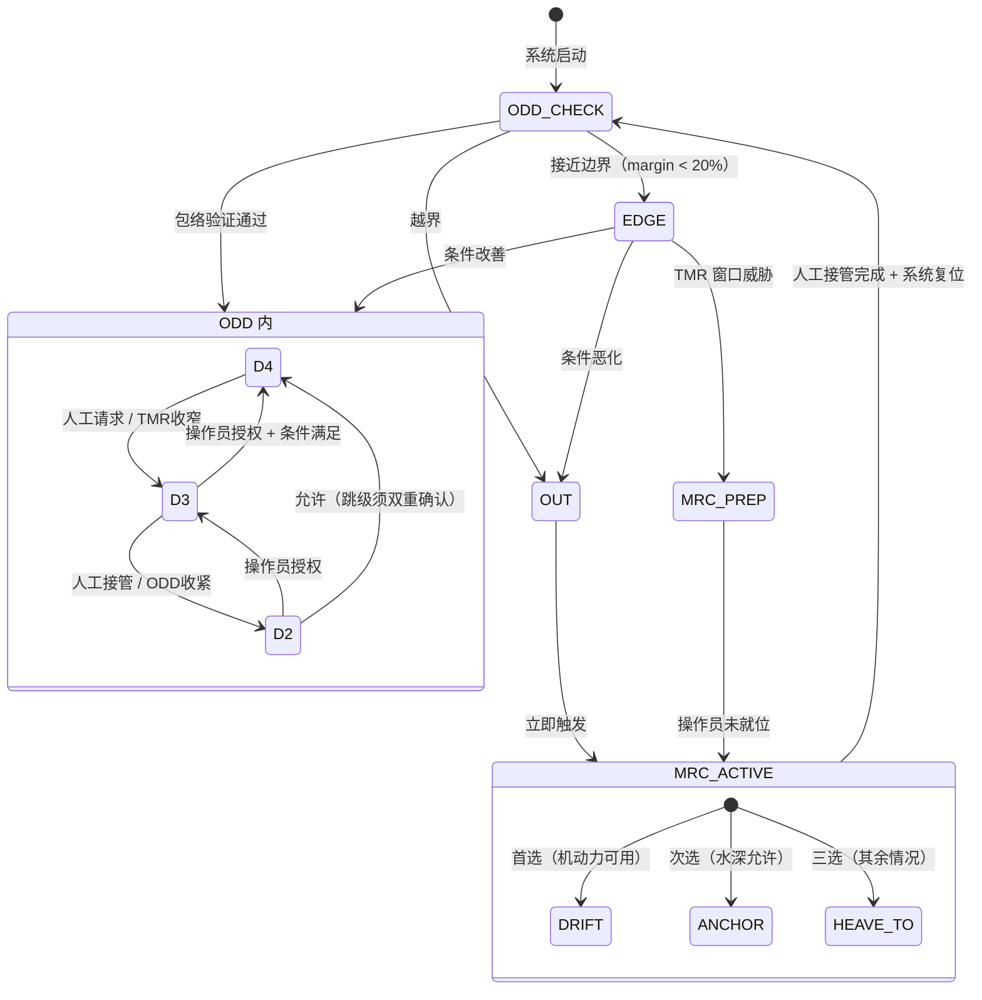

> **图3-1** ODD 主状态机。MRC（Minimum Risk Condition，最低风险状态）是 MASS Code 要求的最终兜底状态，不同于一般"紧急停止"——MRC 必须保证船舶在无人干预情况下可安全漂泊直至援助到达。

### 3.6 ODD 边界检测实现

ODD 边界检测采用连续合规评分机制，而非二值判断：

```
Conformance_Score(t) = w_E × E_score(t) + w_T × T_score(t) + w_H × H_score(t)

阈值（初始建议值，待 FCB 场景 HAZID 校正 [F-P2-D6-018]）：
  > 0.8 → ODD 内（IN）
  0.5–0.8 → ODD 边缘（EDGE），提前预警
  < 0.5 → ODD 外（OUT），立即触发 MRC 序列

权重（FCB 特定**[TBD-HAZID 校准]** 初始值 [F-P0-D6-015 + F-P2-D6-018 + F-NEW-003]）：
  w_E = 0.4 [TBD-HAZID]（环境条件最难干预——能见度 / 海况决定感知可靠性下界）
  w_T = 0.3 [TBD-HAZID]（任务条件可通过减速/停航干预——通信 / 计算健康度）
  w_H = 0.3 [TBD-HAZID]（人机责任可通过通信恢复改善；H 轴权重须以 Veitch 2024 TMR 实证 [R4] 校准）

**初始权重假设依据**（v1.1.1 补充 — F-NEW-003 关闭）：
  - E 轴权重最高的依据：环境降质（Beaufort 风级 / 能见度 / Hs）直接限制感知与机动能力；不可通过软件干预
  - T 轴次之的依据：传感器 / 通信故障可通过冗余切换降级，软件层有缓冲
  - H 轴最低的依据：D1–D4 由法规预定义，权重影响在响应时间余量（TMR），非根因
  - **本依据非定量推理，仅工程直觉**——所有 3 个权重均须 HAZID 校准（参考附录 E）；
    校准方法：FCB 实船试航采集 ≥ 100 小时运营数据，用极大似然法或贝叶斯回归拟合权重以最大化"实际安全状态评估准确率"
```

> **EDGE 状态阈值说明 [F-P2-D6-018]**：§3.5 状态机 EDGE 条件 "margin < 20%" 是初始值（待 HAZID 校正）。Conformance_Score 阈值 0.5/0.8 同样为初始建议值。

---

## 第四章 系统架构总览

### 4.1 决策原因

本章建立 8 个模块的全局视图和相互关系，是后续各章模块详细设计的空间定位参照。理解整体才能理解局部设计决策的依据。

### 4.2 三层架构组织

TDL 8 模块按三个责任层组织，每层与特定的时间尺度和认证要求对应：

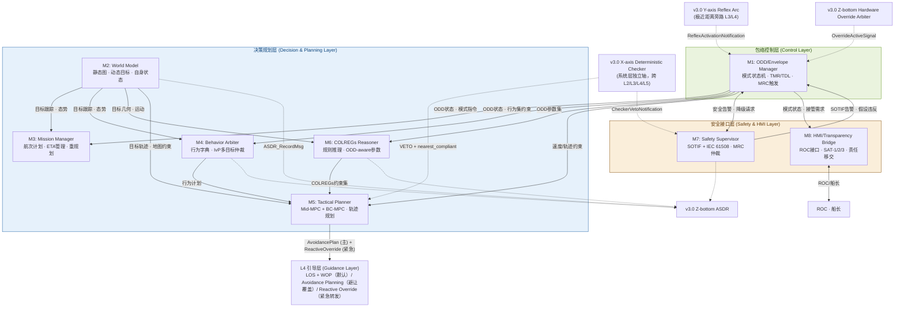

> **图4-1（v1.1 修订）** L3 TDL 8 模块架构全景图。实线箭头为主数据流方向，双向箭头表示双向交互。下游 L4 引导层不在本报告设计范围内 [F-P1-D5-012 修正]。**v1.1 新增**：虚线箭头标示与 v3.0 系统层（X-axis Checker / Y-axis Reflex Arc / Z-bottom Hardware Override + ASDR）的协调接口，详见 §15.2 接口契约总表。

### 4.3 时间分层与调用频率

TDL 遵循时间分层（Temporal Stratification）原则 [R10, R13]，不同模块工作在不同时间尺度：

| 时间尺度 | 模块 | 典型频率 | 职责描述 |
|---|---|---|---|
| 长时（1–60 min） | M1, M3 | 0.1–1 Hz | ODD 监控、航次计划管理、ETA 跟踪 |
| 中时（1–60 s） | M4, M6, M5-Mid | 1–4 Hz | 行为仲裁、COLREGs 决策、中程 MPC |
| 短时（0.1–1 s） | M2, M5-BC, M7 | 10–50 Hz | 态势跟踪、短程 BC-MPC、安全仲裁 |
| 实时（< 0.1 s） | M8 | 50–100 Hz | HMI 数据推送、接管响应 |

### 4.4 数据总线设计原则

各模块通过定义良好的消息接口通信，采用发布-订阅（Publish-Subscribe）架构（推荐 ROS2 DDS 或等效总线）：

- **强类型消息**：所有接口使用 IDL 定义的强类型消息，禁止使用字符串传递结构化数据
- **时间戳强制**：每条消息携带 `stamp`（采样时间）和 `received_stamp`（接收时间），用于延迟监控
- **置信度字段**：每条消息携带 `confidence ∈ [0,1]`，M7 据此进行 SOTIF 假设验证
- **溯源字段**：关键决策消息携带 `rationale`（决策依据摘要），供 ASDR 智能黑匣子记录

---

## 第五章 M1 — ODD / Envelope Manager

### 5.1 决策原因

ODD/Envelope Manager（M1）是 TDL 的调度枢纽，而非简单的参数切换器。其存在的根本原因是：不同 ODD 子域下，**系统的行为语义发生本质变化**（而非参数微调）——开阔水域中的"安全避让"与港内的"安全避让"是截然不同的概念。必须有一个专门的模块持续定义"什么是当前语境下的安全"。

### 5.2 决策优势

- 为所有其他模块提供单一的、权威的"当前安全语境"，消除跨模块不一致
- ODD 状态是可审计的持久化状态，直接对接 CCS 认证要求的白盒可追溯性
- 将 D2/D3/D4 模式切换与具体算法决策解耦——算法不需要知道"为什么"切换，只需服从指令

### 5.3 详细设计

**5.3.1 核心子模块**

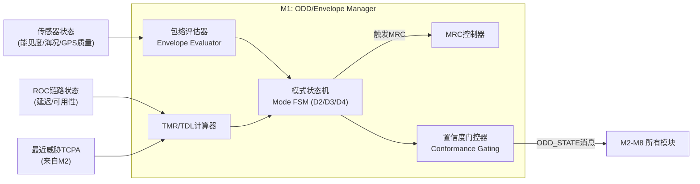

> **图5-1** M1 内部子模块关系图。

**5.3.2 模式状态机详细设计**

M1 的模式状态机维护三个正交状态维度：

```
AutoLevel ∈ {D2, D3, D4}          -- 人机责任分配
ODDZone   ∈ {ODD_A, ODD_B, ODD_C, ODD_D}  -- 当前操作域
Health    ∈ {FULL, DEGRADED, CRITICAL}  -- 系统健康状态

合法状态组合（非法组合自动降级至最近合法状态）：
  D4 允许: ODD_A + FULL
  D3 允许: (ODD_A | ODD_B | ODD_D) + (FULL | DEGRADED)
  D2 允许: ALL ODD × ALL HEALTH
  MRC: 任何状态均可触发
```

**5.3.3 Capability Manifest 加载**

M1 在系统启动时加载船型特定的 Capability Manifest（YAML 格式），该文件由船厂提供并经 CCS 签名验证：

```yaml
vessel:
  type: FCB
  loa: 45.2
  beam: 9.8
  draft_max: 2.1

envelope:
  ood_a:
    max_speed_kn: 22.0
    min_cpa_nm: 1.0
    min_tcpa_min: 12.0
  ood_b:
    max_speed_kn: 12.0
    min_cpa_nm: 0.3
  ood_c:
    max_speed_kn: 2.0
    dp_mode: true
  low_vis_threshold_nm: 2.0
  low_vis_speed_factor: 0.6

hydrodynamics:
  model: MMG_4DOF
  plugin: fcb_45m_mmg_v2.so
  turning_radius_m: 85.0    # at 18 kn
  stopping_dist_m: 720.0    # at 18 kn, full astern
```

### 5.4 接口契约

| 接口 | 方向 | 消息类型 | 频率 | 内容摘要 |
|---|---|---|---|---|
| `odd_state` | 输出 | `ODD_StateMsg` | 1 Hz | 当前 ODD 子域、AutoLevel、Conformance_Score、TMR/TDL |
| `mode_cmd` | 输出 | `Mode_CmdMsg` | 事件 | 模式切换指令（含理由） |
| `mrc_request` | 输出 | `MRC_RequestMsg` | 事件 | MRC 类型（Drift/Anchor/Heave-to）+ 建议执行时间 |
| `safety_alert` | 输入 | `Safety_AlertMsg` | 事件 | 来自 M7 的 SOTIF/IEC 61508 告警 |
| `ownship_state` | 输入 | `OwnShip_StateMsg` | 10 Hz | 来自 M2 的自身状态（位置/速度/姿态）|
| `threat_summary` | 输入 | `Threat_SummaryMsg` | 2 Hz | 来自 M2 的威胁摘要（最近 CPA/TCPA）|

### 5.5 决策依据

[R2] IMO MSC 110（2025）MASS Code 草案 §15："系统应识别船舶是否处于 Operational Envelope 之外"
[R8] Rødseth et al.（2022）Operational Envelope 三轴模型 + TMR/TDL 量化框架
[R14] Fjørtoft & Rødseth（2020）"Using the Operational Envelope to Make Autonomous Ships Safer"

---

## 第六章 M2 — World Model

### 6.1 决策原因

World Model（M2）将"从传感器读什么数据"和"基于数据做什么决策"彻底分离。没有这个分离，每个决策模块（M3/M4/M5/M6）都需要自行维护一份对外部世界的认知——当两份认知出现不一致时（这在多传感器系统中几乎必然发生），系统将产生不可预测的行为。

### 6.2 决策优势

- 所有决策模块共享单一权威的事实来源，消除"不同模块看到不同世界"的危险
- M2 的内部实现可独立升级（如从 EKF 跟踪升级到 IMM 跟踪），不影响任何决策模块
- M2 的置信度字段是 M7（Safety Supervisor）进行 SOTIF 假设验证的输入

### 6.3 详细设计

M2 维护三个相互独立但协同更新的视图：

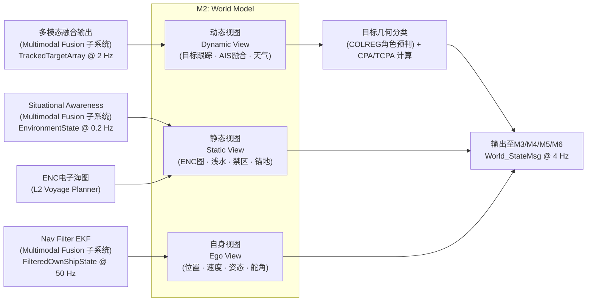

> **图6-1** M2 三视图架构。Multimodal Fusion 子系统输出（TrackedTargetArray + FilteredOwnShipState + EnvironmentState 三个独立话题，详见 §6.4 接口契约）输入 M2，由 M2 内部聚合为统一 World_StateMsg @ 4 Hz。CPA/TCPA 在 M2 内部计算（Fusion 不提供）。[F-P1-D4-019 + F-P1-D4-031]

**6.3.1 动态视图：目标跟踪与 COLREG 几何预分类**

动态视图不仅维护目标跟踪列表（TrackedTargetArray），还对每个目标进行 COLREG 几何角色预分类，减轻 M6（COLREGs Reasoner）的计算负担：

```
# 视角约定 [F-P2-D4-020]：bearing_i = 目标相对本船的方位（度，0° = 正北，本船视角）
# OVERTAKING 判定：bearing_i 在本船艉扇区（艉端 ±67.5°）= [112.5°, 247.5°] → 本船是被追越方
# HEAD-ON 判定：bearing_i 在本船首扇区（[355°, 360°] ∪ [0°, 5°]）且对向航向 → 对遇
# CROSSING 判定：bearing_i 在本船舷扇区（[5°, 112.5°] 或 [247.5°, 355°]）且 heading_diff > 6° → 交叉相遇

For each target i:
  bearing_i = bearing_from_own_ship(target_i)        # 本船视角
  aspect_i  = aspect_angle(target_i)
  CPA_i     = compute_CPA(ownship_state, target_i.state)
  TCPA_i    = compute_TCPA(ownship_state, target_i.state)

  # 几何预分类（M6 仍做最终决策）
  if TCPA_i > 0:
    if bearing_i in [112.5°, 247.5°]: preliminary_role = OVERTAKING
    elif abs(bearing_i) < 6° and heading_diff > 170°: preliminary_role = HEAD_ON
    else: preliminary_role = CROSSING
  else:
    preliminary_role = SAFE_PASS
```

**6.3.2 置信度管理**

M2 对每个输出字段附加置信度分量：

```yaml
tracked_target:
  id: 42
  position: {lat: 30.5, lon: 122.3}
  speed_kn: 12.5
  heading_deg: 245.0
  cpa_m: 850.0
  tcpa_s: 420.0
  confidence:
    position: 0.95      # 基于传感器质量
    velocity: 0.88      # 速度估计不确定性较高
    intent: 0.60        # 意图预测本质上不确定
  source: [RADAR, AIS]  # 融合来源
```

### 6.4 接口契约（Multimodal Fusion 子系统对接）[F-P1-D4-031 新增]

M2 订阅 Multimodal Fusion 子系统的三个独立话题：

| 话题 | 频率 | 内容 | 坐标系 |
|---|---|---|---|
| `/perception/targets` | 2 Hz | TrackedTargetArray（target_id / mmsi / lat/lon / cog/sog / heading/rot / 协方差 / classification / confidence） | WGS84（位置）+ 对地（速度）|
| `/nav/filtered_state` | 50 Hz | FilteredOwnShipState（lat/lon / sog/cog / **u/v 对水速度** / heading / yaw_rate / nav_mode / current_speed/direction）| WGS84（位置）+ 对水（u/v）+ 海流估计 |
| `/perception/environment` | 0.2 Hz | EnvironmentState（visibility / sea_state / traffic_density / **zone_type / in_tss / in_narrow_channel** / SensorCoverage）| — |

**M2 内部数据聚合策略**：

- **频率适配**：M2 内部以 2 Hz 输入聚合 + 1 次插值/外推 → 4 Hz 输出 World_StateMsg；FilteredOwnShipState 取最近时间戳快照
- **CPA/TCPA 计算**：M2 自行计算（Multimodal Fusion 不提供），加入 World_StateMsg.targets[i].cpa_m / tcpa_s 字段
- **ENC 约束聚合**：M2 从 EnvironmentState.zone_type / in_tss / in_narrow_channel 提取，加入 World_StateMsg.zone_constraint
- **坐标系明示**：目标速度 = 对地（sog/cog）；自身速度 = 对水（u/v）+ 海流估计（current_speed/direction）

详细 IDL 见 §15.1 World_StateMsg。

### 6.5 决策依据

[R10] Urmson et al.（2008）CMU Boss "Perception & World Modeling" 独立子系统设计
[R13] Albus NIST RCS（参考体系结构）各节点独立 World Model 原则
[R15] MUNIN FP7 D5.2 Advanced Sensor Module（ASM）设计

---

## 第七章 M3 — Mission Manager

### 7.1 决策原因

Mission Manager（M3）的职责是 **L3 内部对 L1 任务令的局部跟踪 + 重规划触发**——不做真正的航次规划（属 L1 Mission Layer 职责），而是接收 L1 / L2 下发的任务令 + 路径，做有效性校验、ETA 投影，并在 ODD 越界时**触发重规划请求**（向 L2 发起，不本地重规划）。这与 Sea Machines / Kongsberg 工业实践（Mission 由远程下发，本地仅持执行状态）一致。

> **v1.1 命名说明**：v1.0 此模块名为"Mission Manager"，与 v3.0 系统层 L1 Mission Layer 命名冲突。v1.1 保留 M3 名称但显式缩范围为 "Local Mission Tracker"（本地任务跟踪器），不做航次规划。详见附录 A 术语对照。

### 7.2 详细设计

M3 的核心是**任务令有效性看门人 + ETA 投影器 + 重规划请求触发器**。M3 上游消费两类消息 [F-P1-D1-022 + F-P2-D4-038]：

- **L1 Voyage Order → M3**：`VoyageTask`（事件触发，含 departure / destination / eta_window / optimization_priority / mandatory_waypoints / exclusion_zones）
- **L2 Voyage Planner → M3**：`PlannedRoute` + `SpeedProfile`（规划周期 1 Hz 或事件，含航点序列 + 速度曲线）

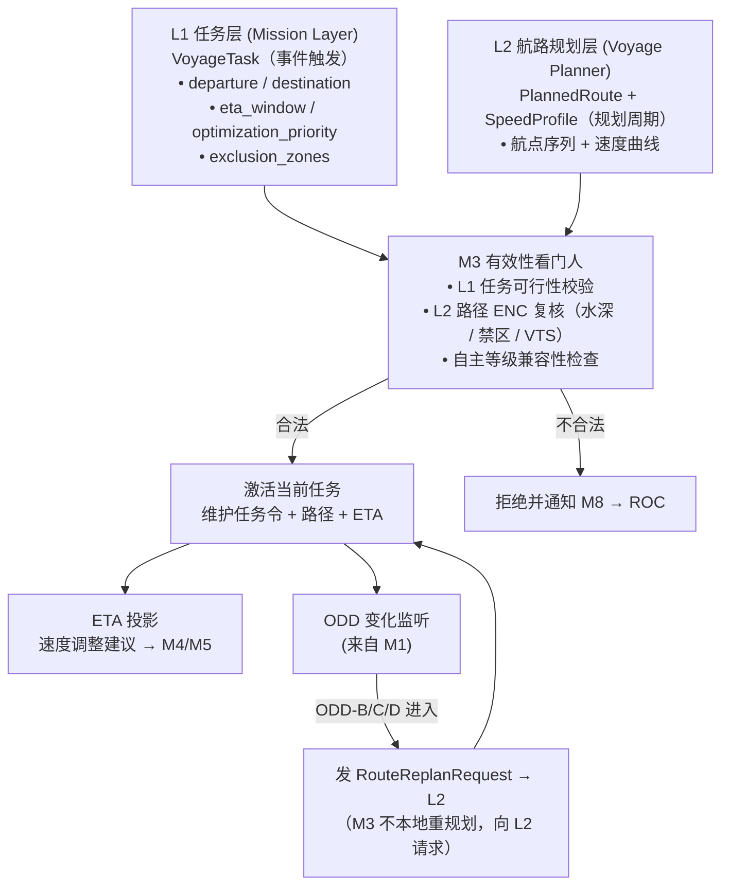

> **图7-1** M3 任务跟踪生命周期。M3 上游 = L1 任务令 + L2 路径；M3 下游 = M4/M5 速度建议 + L2 重规划请求（详见 §15.2 接口矩阵）。

**关键设计点**：
- M3 **不做避碰决策**（M4/M5 职责）
- M3 **不做航次规划**（L1 职责），仅做 L3 内部任务令 + 路径的本地跟踪
- 当 ODD 变化导致当前路径不可行时，M3 通过 **RouteReplanRequest**（详见 §15.1 IDL）向 L2 发起重规划请求 [F-P1-D4-035]

### 7.3 决策依据

[R9] DNV-CG-0264 §4.2 "Planning prior to each voyage" — 作为独立子功能的规范要求
[R10] CMU Boss "Mission Planning" 层 — 独立任务计划层的工程先例

---

## 第八章 M4 — Behavior Arbiter

### 8.1 决策原因

Behavior Arbiter（M4）解决的是**并发行为冲突消解**问题。船舶在运行中同时受到多个行为目标的驱动：跟随航次计划（Mission Manager 要求）、保持 COLREGs 合规（COLREGs Reasoner 要求）、保持安全速度（ODD 要求）、维持 DP 保持（靠泊场景要求）。当这些目标冲突时，需要一个严格、可解释的仲裁机制。

**传统优先级仲裁（Priority-Based Arbitration）的缺陷**：固定优先级会导致低优先级行为在任何情况下都被忽视，可能在特定场景下产生不安全的零贡献（例如，"避碰"优先级高于"保持航速"，但在紧急情况下突然全速减速可能反而危险）[R16]。

### 8.2 决策优势

**IvP（Interval Programming）多目标优化**方法（源自 MOOS-IvP）的核心优势 [R3]：
- 每个行为对解空间（heading × speed）贡献一个偏好函数（interval function），而非单一的"赢者通吃"指令
- 最终解是所有行为偏好函数的联合最优化
- 任何行为的贡献都可量化，决策理由天然可解释

### 8.3 行为字典设计

M4 维护一个 ODD-aware 的行为字典，每个行为都绑定其适用的 ODD 子域：

| 行为名称 | 适用 ODD | 触发条件 | 优先权重（初始值）|
|---|---|---|---|
| `Transit` | ODD-A, B | 航次进行中 | 0.3 |
| `COLREGs_Avoidance` | ODD-A, B, D | 目标 CPA < 安全距离 | 0.7 |
| `Restricted_Visibility` | ODD-D | 能见度 < 2nm | 0.6 |
| `Channel_Following` | ODD-B | 进入 VTS 区 | 0.5 |
| `Approach` | ODD-C | 港口 < 5nm | 0.4 |
| `DP_Hold` | ODD-C | 靠泊操作 | 0.8 |
| `Crew_Transfer_Standby` | ODD-A, C | WT 作业待命 | 0.5 |
| `MRC_Drift` | 任何 | MRC 触发 | 1.0（最高）|

### 8.4 与 COLREGs Reasoner 的协作

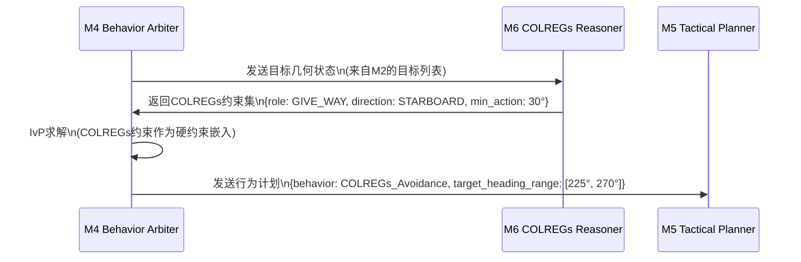

> **图8-1** M4 与 M6 协作时序。COLREGs 约束以硬约束形式进入 IvP 求解器，确保合规性不被其他行为目标压倒。

### 8.5 决策依据

[R3] Benjamin et al.（2010）MOOS-IvP IvP 多目标优化理论与海事应用
[R16] Pirjanian（1998）"Behavior Coordination Mechanisms" — 优先级仲裁缺陷分析
[R9] DNV-CG-0264 §4.5 "Deviation from planned route" + §4.8 "Manoeuvring"

---

## 第九章 M6 — COLREGs Reasoner

### 9.1 决策原因

COLREGs Reasoner（M6）作为独立模块存在，有三个核心理由：

**理由一：跨 ODD 域的规则语义根本性变化**。在开阔水域（ODD-A），Rule 13–17 是主导规则，让路船/直航船的责任分配是核心判断；在狭水道（ODD-B），Rule 9 要求靠右航行且不得妨碍专用深水航道；在能见度不良（ODD-D），Rule 19 完全取代 Rule 13–17，所有船均须减速并发声号。这种语义变化不是参数调整，而是推理框架的切换——嵌入 Behavior Arbiter 无法干净地实现。

**理由二：独立可验证性是 SIL 认证的前提**。COLREGs 推理逻辑须单独证明其正确性（独立于 MPC 轨迹优化），才能满足 IEC 61508 的可分性（separability）要求。将其嵌入 Tactical Planner 则无法独立验证 [R5]。

**理由三：白盒可审计性**。CCS 认证审查时，验船师需要能追踪"系统在某场景下为何认定本船为让路船"——这需要 COLREGs 推理逻辑有独立的可审计输出，而非被淹没在 MPC 的代价函数里。

### 9.2 规则推理架构

M6 的推理引擎采用分层规则结构，严格按 IMO COLREGs 优先级组织：

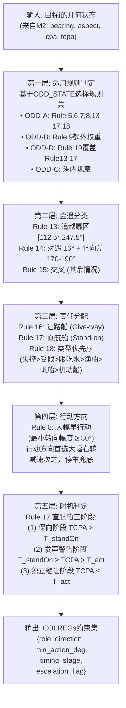

> **图9-1** COLREGs 推理五层架构。每层均有独立的单元测试套件，确保可独立验证。

### 9.3 关键参数（ODD-aware 量化）

| 参数 | ODD-A | ODD-B | ODD-D | 依据 |
|---|---|---|---|---|
| 最小转向幅度 | 30° | 20°（受限） | 30° | Rule 8"大幅"工业实操量化 |
| $T_{standOn}$（保向阈值） | 8 min | 6 min | 10 min | Wang et al.（2021）[R17] |
| $T_{act}$（独立避让阈值） | 4 min | 3 min | 5 min | Wang et al.（2021）[R17] |
| $T_{emergency}$（紧急阈值） | 1 min | 0.75 min | 1.5 min | 保守估计 |
| CPA 恢复确认时间 | 60 s | 45 s | 90 s | Safety margin |

### 9.4 决策依据

[R18] IMO COLREGs 1972（现行版）Rule 5, 6, 7, 8, 9, 13, 14, 15, 16, 17, 18, 19
[R17] Wang et al.（2021）MDPI JMSE 9(6):584 — 直航船四阶段定量分析
[R19] Bitar et al.（2019）arXiv 1907.00198 — COLREGs 状态机分离可验证设计
[R5] IEC 61508-3:2010 — 软件可分性（separability）要求

---

## 第十章 M5 — Tactical Planner

### 10.1 决策原因

Tactical Planner（M5）是 TDL 中计算强度最高的模块，负责将 M4 的行为计划和 M6 的规则约束转化为可执行的轨迹指令。采用双层 MPC 架构（Mid-MPC + BC-MPC）的核心原因是：**单层 MPC 无法同时满足长时域规划（COLREG 合规）和短时反应（紧急碰撞规避）的时间尺度需求**。

### 10.2 双层 MPC 设计

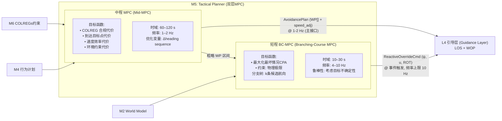

> **图10-1（v1.1 修订 — 方案 B）** M5 双层 MPC 架构。
>
> **接口设计 [F-P1-D4-032 — v1.1 升级到方案 B，与 v3.0 Kongsberg 4-WP 思路对齐]**：
> - **主接口（Mid-MPC → L4）**：`AvoidancePlan` = WP 序列 + speed_profile_adjustments，频率 1-2 Hz；L4 在避让模式下用 AvoidancePlan **覆盖 L2 PlannedRoute**，并以自身 LOS+WOP 处理 → L5
> - **紧急接口（BC-MPC → L4）**：`ReactiveOverrideCmd` = (ψ_cmd, u_cmd, ROT_cmd)，仅在 BC-MPC 检测到 Mid-MPC 兜不住短时危险时激活（CPA 急剧恶化）；L4 切换到 reactive_override 模式直接转发到 L5；事件触发，频率上限 10 Hz
>
> **设计理由**：
> - 与 v3.0 Kongsberg 立场一致（Avoidance Planner 输出 4-WP + 速度），避免 M5 与 L4 LOS+WOP 重复输出 (ψ, u, ROT)
> - L4 始终是 (ψ, u, ROT) 的最终生成者；M5 提供"任务级路径变更"（主接口）+ "紧急覆盖"（紧急接口）
> - 跨团队接口契约清晰：L4 须支持双模式切换（normal_LOS / avoidance_planning / reactive_override）
> - 弃用方案 A 理由：让 L4 旁路自身 LOS 转发 M5 (ψ, u, ROT) 会浪费 L4 现有 LOS+WOP 设计，且 M5 须自行处理漂流补偿 / look-ahead 等本应 L4 职责的功能

### 10.3 Mid-MPC 详细设计

Mid-MPC 采用线性化 MPC，优化问题定义为：

```
min  ∑_{k=0}^{N} [w_col × J_colreg(k) + w_dist × J_dist(k) + w_vel × J_vel(k)]
     Δψ_sequence

s.t.
  |Δψ_k| ≤ ROT_max × Δt          # 转艏率约束
  speed_k ≤ speed_limit(ODD)      # ODD 速度约束
  CPA(ψ_k) ≥ CPA_safe(ODD)       # COLREG 安全距离
  ENC_check(trajectory) = SAFE    # 水深/禁区约束

参数（FCB Capability Manifest 驱动）：
  N = 12（预测步数，步长 5s，总时域 60s）
  ROT_max = 12°/s（FCB 18 kn时实测值）
  CPA_safe(ODD-A) = 1.0 nm，CPA_safe(ODD-B) = 0.3 nm
```

### 10.4 BC-MPC 详细设计

BC-MPC 采用 Eriksen 等（2020）的分支树算法 [R20]，生成 k 条候选航向并选择最坏情况 CPA 最大的分支：

```
候选航向生成：
  ψ_candidates = {ψ_current + δψ × i | i ∈ [-k/2, k/2]}
  默认 k=7，δψ = 10°（即 ±30° 范围）

对每条候选航向，考虑目标不确定性：
  最坏情况CPA(ψ_i) = min_{intent ∈ θ_uncertainty} CPA(ψ_i, intent)

选择：
  ψ_optimal = argmax_{ψ_i} min_{intent} CPA(ψ_i, intent)
```

### 10.5 FCB 高速船型修正

45m FCB 在高速段（> 15 kn）的操纵特性与 MMG 标准方法的低速假设存在显著偏差，须在 Hydro Plugin 中实现 Yasukawa & Yoshimura（2015）的完整 4-DOF MMG 模型 [R7]，并针对半滑行船型补充以下修正：

- **舵效降低修正**：高速段舵效因空化和艉流影响显著下降，ROT_max 须按速度查表动态修正
- **制动性能建模**：停机-倒车制动模型须单独标定（不能用线性化近似）
- **波浪扰动模型**：Hs > 1.5 m 时须引入波浪扰动项，参照 Yasukawa & Yoshimura（2015）4-DOF MMG 标准方法的波浪修正章节 [R7]
  > **v1.1 修订 [F-P1-D9-024]**：v1.0 此处曾引用 "Yasukawa & Sano 2024 [R21]" 近岸修正，但来源未在 JMSE/JMSTech 数据库确证（疑似引用幻觉），已从参考文献移除。FCB 实船试航后 HAZID 校准如需更精细的近岸修正，作为 v1.2 / spec part 2 议题处理。

### 10.6 TSS（Rule 10）多边形约束 [F-P2-D9-041 新增]

当 `EnvironmentState.in_tss = true` 时，Mid-MPC 状态约束加入 TSS lane polygon：

- 从 ENC 获取当前 TSS lane 的多边形顶点序列（typically 4–6 顶点）
- 状态约束：`position(t) ∈ TSS_lane_polygon ∀ t ∈ [0, MPC_horizon]`
- 形式化保证：MPC 求解的轨迹完全位于指定 lane 内，不偏离至对向 lane 或分隔带
- COLREGs Rule 10 推理由 M6 提供（v1.0 §9 已含 Rule 10 条款）；本节补充 §10 MPC 几何约束层的实现

### 10.7 人工接管时 M5 行为 [F-P2-D6-037 新增]

Hardware Override Arbiter 激活（M1 接收 `override_active` 信号 → 通知 M5）时：

- M5 **冻结双层 MPC 求解**（Mid-MPC + BC-MPC 都暂停，保持当前状态供回切）
- M5 主接口（AvoidancePlanMsg）输出 `status = OVERRIDDEN`（停止发新 AvoidancePlan）
- M5 紧急接口（ReactiveOverrideCmd）暂停（不再发紧急覆盖命令，由人工指令完全替代）
- ASDR 在接管期间标记所有 M5 输出为 `"overridden"`
- 回切（Arbiter 解除接管）时 M5 重新读取当前状态 + 重启 Mid-MPC + BC-MPC（积分项重置；详见 §11.8）

### 10.8 决策依据

[R20] Eriksen, Bitar, Breivik et al.（2020）Frontiers in Robotics & AI 7:11 — BC-MPC 算法原理
[R7] Yasukawa & Yoshimura（2015）J Mar Sci Tech 20:37–52 — MMG 标准方法（含波浪修正章节）

---

## 第十一章 M7 — Safety Supervisor

### 11.1 决策原因

Safety Supervisor（M7）存在的根本理由是：**Doer（M1–M6）可以在设计范围内完全正确地执行，但仍然不安全**。这被 ISO 21448 SOTIF 称为"功能不足（functional insufficiency）"——系统按设计运行，但设计本身在某些触发条件下不足以保证安全 [R6]。

典型 SOTIF 触发场景举例：
- M6 的 COLREGs 推理基于 AIS 数据，但目标船 AIS 关闭（SOTIF 不可见目标）
- Mid-MPC 基于目标当前运动趋势预测，但目标突然加速转向（预测模型外推失效）
- 感知融合对密集交通下的幽灵目标（ghost target）给出高置信度（虚假信息传播）

这些场景不是组件失效（IEC 61508 覆盖），而是意图功能在边界条件下的失效，须由独立的 M7 专门处理。

### 11.2 双轨监督架构 [v1.1 修订 — ADR-001]

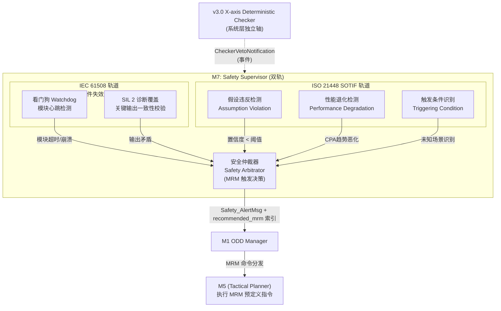

> **图11-1（v1.1 修订）** M7 双轨安全监督架构。两条轨道在 Safety Arbitrator 汇聚后**仅向 M1 发送 Safety_AlertMsg**（含 recommended_mrm 索引），由 M1 仲裁后下发 MRM 命令。**M7 不再"直接向 M5 注入安全轨迹"**——v1.0 此设计违反 Doer-Checker 简化原则（F-P0-D3-001），与 Boeing 777 / NASA Auto-GCAS / Simplex Architecture 工业实践不一致。MRM 命令集见 §11.6。
>
> **与 X-axis Checker 协调（详见 §11.7）**：X-axis Deterministic Checker 否决 M5 输出时通过 CheckerVetoNotification（事件）通知 M7；M7 将 Checker 否决率纳入 SOTIF 假设违反检测（详见 §11.3）。

### 11.3 假设违反检测清单（初始版）[v1.1 修订]

以下假设违反触发 SOTIF 告警升级：

| 假设 | 监控指标 | 违反阈值 | 响应 |
|---|---|---|---|
| AIS/雷达一致性 | 融合目标位置残差 | > 2σ 持续 10s | 目标置信度下调；超过 30s 触发 M7 告警 |
| 目标运动可预测性 | 预测残差 RMS | > 50m/30s | 加大 CPA 安全边距 × 1.3 |
| 感知覆盖充分性 | 盲区占比 | > 20% of 360° | 降低 D4/D3 允许等级 |
| COLREGs 可解析性 | 冲突解析失败次数 | 连续 3 次失败 | 触发减速 + ROC 告警 |
| 通信链路可用性 | RTT / 丢包率 | RTT > 2s 或丢包 > 20% | TMR 窗口收窄；D4 不允许 |
| **L3 Checker 否决率** [F-P2-D3-036 + v1.1.2 RFC-003 锁定] | X-axis Checker 否决次数 / 100 周期（**= 15 s 滑窗**，M7 周期 ≈ 6.7 Hz）| > 20（即 20% 否决率，**[HAZID 校准]**）| 升级 SOTIF 告警："COLREGs 推理可信度下降"；触发降级到 D2 评估 |

**M7 SOTIF PERF 监控独立性约束 [F-P1-D3-003]**：

CPA 趋势恶化是 PERF 行的关键监控指标。M7 PERF 监控读 M2 输出的 CPA 但不依赖 M2 推理 — 当 M2 状态 = DEGRADED 或 FAILED 时，M7 PERF 自动降级到保守阈值（CPA_safe = 0.5 nm 强制告警），不依赖 M2 数值。这保证 M7 与 M2 的独立性约束（决策四 §2.5）。

### 11.4 SIL 分配建议 [v1.1 修订 — F-P1-D7-005]

基于 IEC 61508 风险图方法（LOPA 需项目级 HAZID 校正）：

| 功能 | 建议 SIL | 架构要求 |
|---|---|---|
| ODD 边界检测 + MRC 触发链（M1 + M7 联合） | SIL 2 | 单通道（HFT=0）+ 诊断覆盖 DC ≥ 90% **+ Safe Failure Fraction SFF ≥ 60%（Type A 元件）/ ≥ 70%（Type B 元件）**。**推荐**：关键安全路径采用 HFT=1 双通道冗余，SFF 要求降至 ≥ 90%（IEC 61508-2 Table 3）|
| COLREGs 推理（M6） | SIL 2 | 独立验证 + FMEA |
| 轨迹安全校验（M5 → ENC 查询） | SIL 1 | FMEA 覆盖 |
| D4 通信链路监控 | SIL 2 | 冗余链路 + 超时保护 |

### 11.5 决策依据

[R6] ISO 21448:2022 SOTIF — 功能不足（Functional Insufficiency）概念
[R5] IEC 61508-3:2010 — 功能安全 SIL 分配
[R5-aug] IEC 61508-2:2010 Table 3 — HFT/SFF/DC 矩阵

### 11.6 MRM 命令集（v1.1 新增 — ADR-001 / v1.1.1 关闭 F-NEW-001）[F-P0-D3-001 + F-P1-D6-004 + F-NEW-001]

M7 ARBITRATOR 不再动态生成轨迹，仅触发**预定义 MRM 命令集**（M7 持 VETO 权 + 命令集索引）。

> **v1.1.1 重要修订 [F-NEW-001 关闭]**：v1.1 §11.6 表格中 MRM 参数（4 kn / 30 秒等）原为绝对值，被 DNV 验证官质疑"无实证基础"。v1.1.1 将所有参数改为 **[初始设计值，HAZID 校准]**，并补充每个 MRM 的工程依据。具体校准项见附录 E HAZID 任务清单。

| 索引 | 命令 | 触发场景 | 执行参数（**初始设计值，HAZID 校准**）| 工程依据 |
|---|---|---|---|---|
| **MRM-01** | 减速至安全速度维持航向 | 一般 PERF 退化 / SOTIF 告警 | 速度目标 = 4 kn [初始]，减速时间 ≤ 30 s [初始]；保持当前航向；通知 M8 → ROC | COLREG Rule 8 "in ample time" + Rule 6 "safe speed"；目标制动加速度 ≈ -0.2 m/s²（FCB 18 kn 制动距离 600–800 m 的线性化下限）[R7]。FCB 实船试航后用 Yasukawa 2015 4-DOF MMG 拟合的制动曲线校准 [R7]。 |
| **MRM-02** | 停车（速度 → 0）| Checker 多次否决 / 连续假设违反 | 推力归零；漂航至自然停止；通知 ROC 介入 | COLREG Rule 17 兜底（直航船最后避让动作）；停车不依赖外部环境，是最保守的 SOTIF 响应 |
| **MRM-03** | 紧急转向 | CPA 急剧恶化（PERF 紧急级）| 转向角度 ±60° [初始]，转艏率 = 0.8 × ROT_max [初始]（基于 FCB Capability Manifest）；方向由威胁方位决定 | COLREGs Rule 8 "large alteration" + Rule 17 "best aid to avoid collision"；±60° 是保守值（≥ "大幅" 30° 经验值的 2 倍以保证目标船清晰可识别）[R18, R20] |
| **MRM-04** | 抛锚序列 | 港内 / 近岸 + 系统失能 | 仅适用：水深 ≤ 30 m [初始] + 船速 ≤ 4 kn [初始]；含锚位预选（避离航道 + 远离静态障碍）| DNV-CG-0264 §9.8 警告与安全设备：地理围栏 / 安全锚地查询；MUNIN MRC 设计先例 [R15] |

**参数校准原则**：

- 所有 [初始设计值] 在 FCB 实船试航前通过 HAZID 校准（详见附录 E）
- HAZID 输出更新本表 + 同步到 Capability Manifest（每船型独立校准）
- 校准依据：(a) Yasukawa 2015 [R7] FCB 4-DOF MMG 模型 + (b) FCB 水池 / 实船操纵性数据 + (c) COLREG Rule 8/17 合规性验证

**接口约束**：

M7 输出 `Safety_AlertMsg.recommended_mrm` = MRM-{01|02|03|04} 索引；M5 解析索引并执行预定义指令（参数从 Capability Manifest 读取）；**M7 不持 MPC / 规划逻辑**（决策四独立性约束）。

### 11.7 与 X-axis Deterministic Checker 的协作（v1.1 新增 — ADR-001）[F-P0-D3-002]

本设计 M7 与 v3.0 X-axis Deterministic Checker **不在同一层级，是分层互补关系**：

| 维度 | M7 Safety Supervisor | X-axis Deterministic Checker |
|---|---|---|
| **层级** | L3 内部 Checker | 系统级 Checker（跨 L2 / L3 / L4 / L5）|
| **类型** | IEC 61508 + SOTIF 双轨监控 | 确定性规则 VETO |
| **输出** | Safety_AlertMsg + recommended_mrm | CheckerOutput { approved, nearest_compliant, veto_reason } |
| **频率** | 周期 + 事件 | 与 Doer 同频 |
| **优先级** | 中等（向 M1 报告，M1 仲裁） | 最高（直接 VETO Doer 输出）|

**协调协议**：

- **X-axis 否决 M5 输出**：X-axis 向 M7 发 CheckerVetoNotification（事件，详见 §15.1 IDL）；M7 将否决率纳入 SOTIF 假设违反检测（详见 §11.3 — Checker 否决率 > 20% → 升级 SOTIF 告警）
- **M7 触发 MRC 请求**：经 M1 仲裁后下发 MRM 命令；X-axis 不干预 MRC 内部流程

**Doer-Checker 独立性约束 [v1.1.1 关键澄清 — F-NEW-002 关闭]**：

X-axis 与 M7 通过独立总线通信，**不共享代码 / 库 / 数据结构**（决策四独立性约束）。具体到 CheckerVetoNotification 消息：

- **veto_reason_class 是受限枚举 enum**（详见 §15.1 IDL VetoReasonClass）—— enum 是**共享分类词汇**，不是**共享规则实现**
- M7 仅按 enum 分类做统计聚合（如 "COLREGS_VIOLATION 否决率 > 20% → SOTIF 告警"），**不重新推理 X-axis 的具体规则违反内容**
- **veto_reason_detail（自由文本）只供 ASDR 记录用，M7 不解析**
- 这保留了 Checker 形式化验证的简化性（M7 处理逻辑 = enum 计数器 + 阈值比较，远低于 100:1 复杂度比例）
- 同时避免了 M7 解析自由文本可能引入的语义不确定性

**为什么 enum 共享词汇不违反独立性**：

- 类比：Boeing 777 PFCS Monitor 与 PFC 共享航空规则术语词典（"airspeed envelope" / "load factor"），但实现独立
- 共享的是**输出的离散分类标签**，不是**生成这些标签的推理过程**
- DNV-CG-0264 §9.3 "监控系统独立性"要求隔离的是**实现路径 + 数据结构 + 失效模式**，而非词汇表

### 11.8 M7 自身降级行为（v1.1 新增 — ADR-001）[F-P1-D6-004]

- **心跳监控**：M7 心跳由 X-axis Deterministic Checker（外部，跨层）监控，频率 1 Hz；同时 M1 订阅 M7 心跳作内部参考
- **失效模式**：Fail-Safe（**必须**）—— M7 失效时强制触发保守 MRM-01；**不允许 Fail-Silent**
- **失效后系统降级**：M7 失效 → 系统降级到 D2（船上有海员备援）；禁止 D3 / D4 运行

### 11.9 人工接管时 L3 内部行为（v1.1 新增 / v1.1.1 强化）[F-P2-D6-037 + F-NEW-005 + F-NEW-006]

Hardware Override Arbiter 激活（M1 接收 OverrideActiveSignal）时：

- **M1**：模式状态机切换到 OVERRIDDEN，停止 ODD 周期更新；保持 ODD 状态快照供 ASDR 记录
- **M5**：冻结 Mid-MPC + BC-MPC 求解（保持状态供回切，不再输出新 AvoidancePlan / ReactiveOverrideCmd），详见 §10.7
- **M7**：暂停 SOTIF 监控**主仲裁**（不下发 MRM 命令），但保留**降级监测线程**（详见 §11.9.1 — F-NEW-005 关闭）
- **M8**：切换到"接管模式"UI，显示 ROC 操作员状态 + 接管时段 ASDR 摘要
- **ASDR**：标记接管期间所有 L3 输出为 "overridden"，记录接管起止时间

#### 11.9.1 接管期间 M7 降级告警（v1.1.1 新增 — F-NEW-005 关闭）

**v1.1 缺陷**：v1.1 §11.9 要求"M7 暂停 SOTIF 监控"，但未覆盖**接管期间出现新功能不足场景**的情况（如通信中断、传感器降质）。法律上"人工接管者无法获知当前假设已失效"会构成责任真空。

**v1.1.1 修订**：M7 在接管期间**仅暂停主仲裁**（不下发 MRM 命令），但**保留降级监测线程**：

| 监测项 | 触发条件 | 响应 |
|---|---|---|
| 通信链路中断 | RTT > 2 s 持续 5 s 或丢包 > 50% | M8 实时显示降级告警标志（红色，**< 100 ms 时延**）|
| 传感器降质 | Multimodal Fusion 报 DEGRADED 状态 | M8 显示降级告警 + 提示 ROC 重新评估接管可行性 |
| 新威胁出现 | M2 新增高威胁目标（CPA < 阈值）| M8 显示新威胁告警（与正常 SAT-1 区分颜色）|
| M7 自身异常 | M7 心跳丢失 / 监测线程异常 | M8 显示"安全监督失效"红色高优先级告警 |

**法律依据**：IMO MASS Code Part 2 + ISO 21448 SOTIF 要求"安全相关信息须实时呈现给负责人员"。M7 降级监测线程满足该要求，同时不会与人工指令冲突（仅显示，不动作）。

#### 11.9.2 接管解除（回切）顺序化（v1.1.1 新增 — F-NEW-006 关闭）

**v1.1 缺陷**：v1.1 §11.9 仅要求"M5 重启 MPC（积分项重置）；M7 重启 SOTIF"，但未定义启动顺序。若两者同时启动，会瞬间出现"M5 已生成新规划但 M7 SOTIF 尚未恢复"的安全监控真空。

**v1.1.1 修订 — 严格顺序化回切协议**：

```
T0:        Hardware Override Arbiter 发 OverrideActiveSignal { override_active=false }（解除接管）
T0+0 ms:   M1 接收信号，进入"回切准备"状态
T0+10 ms:  M7 主仲裁线程启动；SOTIF 假设违反检测重置 + 开始周期监控
T0+10 ms:  M2 重新进入活跃状态（World_StateMsg 输出恢复）
T0+100 ms: M7 心跳确认 + SOTIF 监测稳定后，向 M1 发送"M7_READY"信号
T0+110 ms: M1 收到 M7_READY，向 M5 发送"M5_RESUME"信号
T0+110 ms: M5 重新读取当前状态 + 重启 Mid-MPC（积分项重置）+ BC-MPC（积分项重置）
T0+120 ms: M5 输出第一个 AvoidancePlan（status = NORMAL）
T0+150 ms: ASDR 标记 "override_released" 事件 + 记录回切顺序时间戳
```

**关键设计原则**：
- **M7 先于 M5 启动**（间隔 ≥ 100 ms）：保证 M5 输出 NORMAL 时 M7 SOTIF 监控已激活
- **积分项重置**：M5 双层 MPC 的速度跟踪积分 / 航向跟踪积分 / 转艏率积分**全部清零**，避免历史误差累积导致回切瞬态
- **ASDR 强制记录**：回切顺序时间戳供事后审计（CCS i-Ship 白盒可审计要求）
- **超时保护**：若 M7 在 T0+100 ms 内未发出 READY 信号，M1 自动切换到 D2 + 触发 MRM-01（保守降级）

---

## 第十二章 M8 — HMI / Transparency Bridge

### 12.1 决策原因

将 HMI 和 ROC 接口集中在单一模块（M8）有一个不可替代的理由：**保证责任移交（Transfer of Responsibility）协议的原子性和可审计性**。如果多个模块各自向 ROC 推送状态，当 ROC 操作员接管时，无法保证所有模块都处于"已被人类感知"的状态——法律上的责任归属将无法明确。M8 是系统中唯一一个对 ROC/船长说话的实体，确保"谁在控制"的答案在任何时刻都是唯一的。

### 12.2 SAT 三层透明性设计

M8 对 ROC 和船长呈现三层信息 [R11]：

```
SAT-1（当前状态，What is happening now）:
  - 当前自主等级（D2/D3/D4）
  - 当前 ODD 子域 + Conformance_Score
  - 最近威胁列表（Top-3 by threat score）
  - 当前执行中的行为（Transit/COLREGs_Avoidance/...）

SAT-2（推理过程，Why this decision）:
  - 当前 COLREGs 决策的规则依据（如"目标船为让路船，依据 Rule 15"）
  - Mid-MPC 当前代价函数各项分解
  - ODD 合规评分的各维度分解
  - M7 当前告警状态（有无假设违反）

SAT-3（预测与不确定性，What will happen next）:
  - 预测未来 5 分钟的 CPA/TCPA 趋势
  - 当前方案的预期效果（预计回归安全 CPA 的时间）
  - 不确定性量化（目标意图不确定度 × CPA 分布）
  - 预计接管需求时间窗口
```

#### SAT 自适应触发规则 [F-P1-D1-010 + F-P2-D1-026 — v1.1 重要修订]

与 v1.0 草案"全层全时展示"不同，v1.1 采用**按场景自适应触发**——基于 R5 透明度悖论实证（USAARL 2026-02 + NTNU 2024）：全层同时展示 SAT-2 推理层反而升高认知负荷、降低多任务效率：

| 层 | 触发条件 |
|---|---|
| **SAT-1（现状）** | 全时展示（持续刷新）|
| **SAT-2（推理）** | 按需触发：(1) COLREGs 冲突检测；(2) M7 SOTIF 警告激活；(3) M7 IEC 61508 故障告警；(4) 操作员显式请求 |
| **SAT-3（预测）** | 基线展示 + 优先级提升：当 TDL（Time to Decision Latency）压缩到 < 30 s 时**自动推送 + 加粗** |

> 这一策略遵循 Veitch (2024) "可用时间是最重要因子" + USAARL (2026-02) "透明 + 被动 = 最差状态" 实证结论。M8 设计目标是支持 D3/D4 接管时窗 60s（[R4] Veitch 2024 实证基线），而非"信息密度最大化"。

### 12.3 差异化视图设计

差异化视图按"角色 + 场景"双轴：

**角色轴**（ROC 操作员 vs 船上船长）：

| 信息层 | ROC 操作员 | 船上船长 |
|---|---|---|
| SAT-1（态势） | 完整，带数字量化 | 简化，带直觉式可视化 |
| SAT-2（推理） | 完整规则链 | 高层摘要（"正在避让右前方目标"）|
| SAT-3（预测） | 完整不确定性分布 | 关键时间节点（"预计 8 分钟后恢复原航线"）|
| 接管界面 | 详细系统状态 + 分步确认 | 一键接管 + 快速情境总结 |

**场景轴**（常态 vs 冲突 vs MRC）：

| 场景 | 显示策略 |
|---|---|
| 常态 Transit | 仅 SAT-1 全展示，SAT-2/3 简化（按 §12.2 触发规则）|
| 冲突 COLREGs Avoidance | SAT-2 推送展开（含 Rule 依据 + IvP 仲裁摘要）|
| MRC 准备 / 进行中 | SAT-3 优先级最高，全屏 / 加粗展示 + 接管时窗倒计时 |

### 12.4 责任移交协议

责任移交（Transfer of Responsibility，ToR）是 MASS Code 要求的强制功能 [R2]，必须满足：

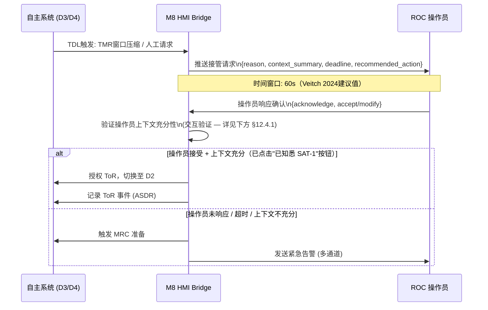

#### 12.4.1 "已阅 SAT-1" 验证机制（v1.1.1 新增 — F-NEW-004 关闭）

**v1.1 缺陷**：v1.1 §12.4 仅要求"至少已阅 SAT-1"，但未定义验证机制。人因评审指出该模糊性破坏 IMO MASS Code "有意味的人为干预" 法律要求（接管合法性可能被质疑）。

**v1.1.1 选定方案：(C) 交互验证**

ToR 协议要求操作员在接管确认 UI 中**主动点击"已知悉 SAT-1 现况"按钮**，验证机制满足以下硬性约束：

| 约束 | 实现方式 |
|---|---|
| **法律有效性**（IMO 合规）| 主动交互（点击）= "有意味的人为干预"；M8 记录点击事件到 ASDR（含按钮位置 / 时间戳 / 操作员 ID） |
| **防误触保护** | 按钮须在 SAT-1 面板下方独立区域；点击触发 1 秒确认动画（防止 reflex tap） |
| **上下文充分性附加门槛** | SAT-1 面板须**显示至少 5 秒**才允许"已知悉"按钮变为可点击（防止操作员未读直接点）|
| **强制阅读关键字段** | SAT-1 面板必须显示完整威胁列表 + 当前 ODD 子域 + Conformance_Score；任一字段加载失败时按钮锁定 |
| **超时退化** | 操作员未在 ToR deadline_s（60 s）内点击"已知悉"→ M8 自动判定"上下文不充分" → 触发 MRC 准备 |

**为什么排除方案 (A) 视线追踪 + 方案 (B) 强制等待**：

- **(A) 视线追踪**：依赖眼动仪硬件，ROC 工作站标准化困难；且眼动并非"有意味干预"的法律证据
- **(B) 强制等待 X 秒**：被动等待无法证明操作员真正"阅读了 SAT-1"——可能在做其他事情；不满足 IMO "meaningful intervention"

**(C) 交互验证**是最简洁、最可审计、最便于实现的方案，与 Sea Machines SM300 / NTNU milliAmpere 接管 UI 工业实践一致。

**ASDR 记录字段**（详见 §15.1 ASDR_RecordMsg）：

```
{
  "event_type": "tor_acknowledgment_clicked",
  "timestamp": "2026-XX-XX HH:MM:SS.sss",
  "operator_id": "ROC-OP-NN",
  "sat1_display_duration_s": 12.5,    # 实际 SAT-1 面板显示时长
  "sat1_threats_visible": ["target_42", "target_57"],
  "odd_zone_at_click": "ODD_B",
  "conformance_score_at_click": 0.72
}
```

> **图12-1** 责任移交协议时序。60 秒时窗来自 Veitch 等（2024）的实证数据 [R4]。

### 12.5 决策依据

[R4] Veitch et al.（2024）Ocean Engineering 299:117257 — ROC 接管时窗实证研究 + 透明度悖论 D 因子（"可用时间"效应最大）
[R11] Chen et al.（ARL-TR-7180，2014）SAT 三层透明性模型
[R2] IMO MASS Code Part 2 Chapter 1（运行环境）+ HMI 章节 — Transfer of Responsibility 强制要求
[R23] **Veitch & Alsos**（2022）"From captain to button-presser"，Journal of Physics: Conference Series 2311(1)，NTNU Shore Control Lab — 从"船长"到"按钮操作员"的认知退化研究 [F-P2-D1-025 作者归属修正]
[R5-aug] USAARL（2026-02）+ NTNU Handover/Takeover（2024）— 透明度悖论 + SAT 层偏好实证（v1.1 新增引用，详见 §12.2 自适应触发规则）

---

## 第十三章 多船型参数化设计

### 13.1 设计原则

多船型兼容不是"在代码里加 if-else 判断船型"，而是通过**结构性解耦**实现一套核心代码支持无限船型扩展，且每种新船型的引入不需要修改任何决策算法。

> **v1.1 自定义规范声明 [F-P2-D4-027 配套]**：本设计的 Capability Manifest 是**自定义工程规范**，参考 MOOS-IvP（Benjamin 2010 [R3]）+ awvessel.github.io 开源舰艇 Manifest 格式。海事行业目前**无专属 Capability Manifest 标准**（Sea Machines / Kongsberg 商业机密；DDS-X 通用 IoT Schema 不直接对接海事）。本设计自定义规范作为 v1.0 原创工程实践记录，待行业标准成熟后可迁移。

### 13.2 三层解耦架构

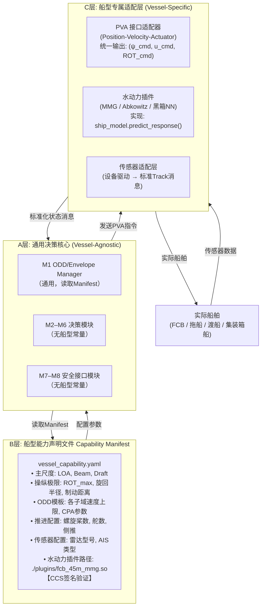

> **图13-1** 三层解耦架构。换船型时，只需提供新的 Capability Manifest 和对应的水动力插件，A 层代码零修改。

### 13.3 Backseat Driver 范式

本设计的三层解耦架构直接继承自 MOOS-IvP 的 Backseat Driver 范式 [R3]：

> "The autonomy system provides (heading, speed, depth) commands to the vehicle control system. The vehicle control system executes the control and passes navigation information to the autonomy system. The backseat paradigm is agnostic regarding how the autonomy system is implemented."

Sea Machines SM300 将此范式商业化为 TALOS 软件 + SMLink Control-API，已在 200+ 艘船（20 国）部署 [R24]，是当前最强的工业验证。

### 13.4 水动力插件接口规范

所有水动力插件须实现以下 C++ 接口（ABI 稳定，不随插件版本变化）：

```cpp
class VesselHydroPlugin {
public:
    // 基础信息
    virtual VesselManifest getManifest() const = 0;

    // 运动预测（用于MPC内部模型）
    virtual VesselState predict(
        const VesselState& current,
        const ActuatorCmd& cmd,
        double dt_s
    ) const = 0;

    // 操纵极限查询（速度依赖）
    virtual ActuatorLimits getLimits(double speed_kn) const = 0;

    // 制动距离估算
    virtual double getBrakingDistance_m(double speed_kn) const = 0;
};
```

### 13.5 典型船型扩展路径

| 船型 | 与 FCB 的主要差异 | 插件修改范围 | 决策核心修改 |
|---|---|---|---|
| 45m FCB（基准） | — | 基准插件 | 不变 |
| 25m 拖船 | 低速大推力，全旋推进器，无滑行 | 全新水动力插件 + Manifest | 零修改 |
| 70m PSV | 更大尺寸，DP 系统，较慢响应 | 全新水动力插件 + Manifest | 零修改 |
| 长江内河船 | 内水规则（非 COLREGs） | 插件 + M6 规则库切换 + Manifest 增加 rules_lib_path | M6 增加 rules_loader 插件接口（架构级修改，非纯参数化扩展，须独立版本分支）[F-P2-D4-027] |

---

## 第十四章 CCS 入级路径映射

### 14.1 决策原因

本章建立 TDL 8 模块与 CCS 认证要求的精确映射，确保认证工作不是事后补充证据，而是架构设计阶段已内嵌可证性。

### 14.2 DNV-CG-0264 导航子功能 100% 覆盖验证

DNV-CG-0264（**2025.01** 现行版）§4 将自主船导航功能分解为 9 个子功能，本设计实现完整覆盖 [F-P1-D1-009 版本修正]：

| DNV-CG-0264 §4 子功能 | 对应 TDL 模块 | 证据类型 |
|---|---|---|
| §4.2 Planning prior to voyage | M3 Mission Manager | 航次计划验证测试报告 |
| §4.3 Condition detection | M2 World Model + M1 EM | 感知测试 + ODD 边界检测测试 |
| §4.4 Condition analysis | M1 EM + M7 SS | ODD 评分验证 + SOTIF FMEA |
| §4.5 Deviation from planned route | M3 + M4 BA | 重规划触发测试 |
| §4.6 Contingency plans | M7 SS + M1 EM | MRC 触发测试（各类型 MRC）|
| §4.7 Safe speed | M6 CR + M5 TP | COLREGs Rule 6 覆盖率测试 |
| §4.8 Manoeuvring | M5 Tactical Planner | 轨迹跟踪精度测试 |
| §4.9 Docking | M4 BA (Docking) + M5 TP | HIL 靠泊演示 |
| §4.10 Alert management | M8 HTB + M7 SS | HMI 告警响应时间测试 |

### 14.3 CCS i-Ship 标志申请路径

建议按以下递进路径申请，降低单次认证风险：

```
阶段一（目标: M1 完成时）:
  申请 AIP (Approval In Principle)
  提交: ConOps + ODD-Spec + HARA 初版

阶段二（目标: M2 末, HIL 完成时）:
  申请 i-Ship (I, N, R1) 基础标志
  提交: 系统架构 + 安全分析 + SIL评估 + 仿真测试报告

阶段三（目标: M4 实船试航后）:
  申请 i-Ship (I, Nx, Ri) 进阶标志（含远程控制 + 进阶自主航行）
  提交: 实船试航报告 + DNV/CCS 见证记录 + 完整 ASDR 日志分析
```

### 14.4 关键证据文件清单

| 文件 | 产生阶段 | 认证用途 |
|---|---|---|
| ConOps（运营概念）| M1 | AIP 申请，定义 ODD/Operational Envelope |
| ODD-Spec | M1 | OE 框架定义（Rødseth 2022 二轴 [R8] + H 轴 IMO MASS Code D1–D4 扩展 [R2]，详见 §3.2 三层概念框架），CCS 审查基础 [F-P1-D7-028 修订] |
| HARA / FMEA | M1–M2 | 风险分析，SIL 分配依据 |
| SIL 评估报告 | M2 | IEC 61508 合规证明 |
| 软件安全开发计划 | M1 | IEC 62443-4-1 SDL 合规 |
| COLREGs 覆盖率测试报告 | M2 | ≥ 1000 场景，覆盖所有规则分支 |
| HIL 测试报告 | M3 | 800h+ 无致命故障 |
| 实船试航大纲 + 报告 | M4 | ≥ 50 nm 自主航行 |
| 网络安全测试程序 | M2–M3 | IACS UR E26/E27 合规 |
| ASDR 日志分析报告 | M4 | 决策可追溯性证明 |

---

## 第十五章 接口契约总表

> **v1.1 重写**：v1.0 §15 接口矩阵不闭包（缺 L1 上游 / ASDR / Reflex Arc / L3→L2 反向 / Override Arbiter），且 M5 → L2 错写应为 L4。v1.1 按 Phase 5 跨层对照实证补全 [F-P1-D4-031~035 + F-P1-D5-012 + F-P2-D5-013 + F-P2-D4-038]。

### 15.1 核心消息定义

以下为 TDL 关键消息接口的 IDL 定义（伪代码形式，实际实现需根据技术栈选择 ROS2 IDL、Protobuf 或 DDS IDL）：

```
# ODD_StateMsg (发布者: M1, 频率: 1 Hz + 事件型补发)
message ODD_StateMsg {
    timestamp    stamp;
    ODD_Zone     current_zone;     # ODD_A|ODD_B|ODD_C|ODD_D
    AutoLevel    auto_level;       # D2|D3|D4
    Health       health;           # FULL|DEGRADED|CRITICAL
    float32      conformance_score; # [0,1]
    float32      tmr_s;             # 当前TMR（秒）
    float32      tdl_s;             # 当前TDL（秒）
    string       zone_reason;       # ODD子域判断理由（SAT-2）
    ODD_Zone[]   allowed_zones;     # 当前健康状态下可允许的ODD子域
}
# 注 [F-P2-D6-021]: 1 Hz 是周期上限；EDGE→OUT 突变时 M1 触发事件型 odd_state 发布，不等待下一周期

# World_StateMsg (发布者: M2, 频率: 4 Hz — M2 内部以 2 Hz 输入聚合 + 1 次插值/外推)
# [F-P1-D4-031 新增完整定义]
message World_StateMsg {
    timestamp           stamp;
    TrackedTarget[]     targets;          # 含 cpa_m / tcpa_s（M2 计算）
    OwnShipState        own_ship;         # 取自最近 FilteredOwnShipState 快照（含对水 u/v + 海流估计）
    ZoneConstraint      zone;             # ENC 约束: zone_type / in_tss / in_narrow_channel
    float32             confidence;
    string              rationale;        # SAT-2: 聚合质量摘要
}
# 注: 目标速度 = 对地（sog/cog from TrackedTarget）；自身速度 = 对水（u/v from FilteredOwnShipState）+ 海流估计

# VoyageTask (发布者: L1 Voyage Order, 订阅者: M3, 频率: 事件触发)
# [F-P2-D4-038 新增 — 上游 L1 入口]
message VoyageTask {
    timestamp    stamp;
    Position     departure;
    Position     destination;
    TimeWindow   eta_window;            # earliest / latest
    string       optimization_priority; # "fuel_optimal"|"time_optimal"|"balanced"
    Position[]   mandatory_waypoints;
    Polygon[]    exclusion_zones;
    string       special_restrictions;
}

# Mission_GoalMsg (发布者: M3, 订阅者: M4, 频率: 0.5 Hz)
message Mission_GoalMsg {
    timestamp    stamp;
    Position     current_target_wp;
    float32      eta_to_target_s;
    float32      speed_recommend_kn;
}

# RouteReplanRequest (发布者: M3, 订阅者: L2 Voyage Planner, 频率: 事件)
# [F-P1-D4-035 新增 — L3 → L2 反向通道]
message RouteReplanRequest {
    timestamp    stamp;
    enum reason; # ODD_EXIT|MISSION_INFEASIBLE|MRC_REQUIRED|CONGESTION
    float32      deadline_s;
    string       context_summary;       # SAT-2 摘要供 L2 / ROC 阅
    Position     current_position;
    Polygon[]    exclusion_zones;       # 须避开区域（如冲突 TSS）— GeoJSON Polygon 格式（RFC-006 锁定）
}

# ReplanResponseMsg (发布者: L2 Voyage Planner, 订阅者: M3, 事件)
# [v1.1.2 RFC-006 决议新增 — L2 重规划响应]
message ReplanResponseMsg {
    timestamp    stamp;
    enum status; # SUCCESS | FAILED_TIMEOUT | FAILED_INFEASIBLE | FAILED_NO_RESOURCES
    string       failure_reason;        # 失败时的诊断信息（非 SUCCESS 时填充）
    bool         retry_recommended;     # 是否建议 M3 在新条件下重试
}

# Behavior_PlanMsg (发布者: M4, 频率: 2 Hz)
message Behavior_PlanMsg {
    timestamp    stamp;
    BehaviorType behavior;         # TRANSIT|COLREG_AVOID|DP_HOLD|...
    float32      heading_min_deg;
    float32      heading_max_deg;
    float32      speed_min_kn;
    float32      speed_max_kn;
    float32      confidence;
    string       rationale;        # IvP 求解摘要（SAT-2）
}

# COLREGs_ConstraintMsg (发布者: M6, 订阅者: M5, 频率: 2 Hz)
message COLREGs_ConstraintMsg {
    timestamp    stamp;
    Rule[]       active_rules;     # Rule 8/13/14/15/16/17/...
    string       phase;            # T_standOn / T_act / ...
    Constraint[] constraints;
}

# AvoidancePlanMsg (发布者: M5 Mid-MPC, 订阅者: L4 引导层, 频率: 1–2 Hz)
# [v1.1 方案 B — 与 v3.0 Kongsberg 4-WP 思路对齐 / F-P1-D4-032]
# L4 在避让模式下用 AvoidancePlan 覆盖 L2 PlannedRoute，自身 LOS+WOP 处理至 L5
message AvoidancePlanMsg {
    timestamp           stamp;
    AvoidanceWaypoint[] waypoints;          # 避让路径航点序列（WGS84，含 wp_distance / safety_corridor）
    SpeedSegment[]      speed_adjustments;  # 速度调整曲线（覆盖 L2 SpeedProfile）
    float32             horizon_s;          # 有效时域（典型 60–120 s）
    float32             confidence;
    string[]            active_constraints; # 激活的约束列表（SAT-2）
    string              status;             # NORMAL | OVERRIDDEN（人工接管时）
    string              rationale;          # IvP / MPC 求解摘要（SAT-2）
}

# ReactiveOverrideCmd (发布者: M5 BC-MPC, 订阅者: L4 引导层, 频率: 事件 / 上限 10 Hz)
# [v1.1 方案 B — 紧急避让接口]
# 仅在 BC-MPC 检测到 Mid-MPC AvoidancePlan 兜不住短时危险时激活
# L4 切换到 reactive_override 模式，直接转发 (ψ, u, ROT) → L5
message ReactiveOverrideCmd {
    timestamp    trigger_time;
    string       trigger_reason;     # "CPA_EMERGENCY"|"COLLISION_IMMINENT"|...
    float32      heading_cmd_deg;
    float32      speed_cmd_kn;
    float32      rot_cmd_deg_s;
    float32      validity_s;         # 命令有效期（典型 1–3 s，需 BC-MPC 持续刷新）
    float32      confidence;
}

# Safety_AlertMsg (发布者: M7, 订阅者: M1, 事件触发)
message Safety_AlertMsg {
    timestamp    stamp;
    AlertType    type;             # IEC61508_FAULT|SOTIF_ASSUMPTION|PERFORMANCE_DEGRADED
    Severity     severity;         # INFO|WARNING|CRITICAL|MRC_REQUIRED
    string       description;
    string       recommended_mrm;  # MRM-01 | MRM-02 | MRM-03 | MRM-04（详见 §11.6）
    float32      confidence;
}
# v1.1 重要: M7 不再"直接注入安全轨迹"，仅触发预定义 MRM 命令集（详见 ADR-001 + §11.2 + §11.6）

# CheckerVetoNotification (发布者: X-axis Deterministic Checker, 订阅者: M7, 事件触发)
# [F-P0-D3-002 + F-P2-D3-036 + F-NEW-002 v1.1.1 修订 — Doer-Checker 独立性 + enum 化]
#
# v1.1.1 关键修订 [F-NEW-002]：veto_reason 从 free-text 改为受限枚举 enum。
#   - 设计权衡：M7 与 X-axis Checker 须保持 Doer-Checker 独立性（决策四 §2.5）
#   - free-text 的弱点：M7 须解析自然语言 → 难以形式化验证 → DNV 审查质疑 Checker 简化原则
#   - enum 共享语义的弱点：M7 与 X-axis 看似共享规则库 → 违反 "不共享代码 / 库 / 数据结构"
#   - 折中决策：enum 是受限词汇表（共享分类，不共享规则推理实现），M7 只按 enum 分类升级 SOTIF 告警，
#               不重新推理具体规则违反场景。这保留了 Checker 形式化验证简化性，
#               同时避免 M7 解析自由文本的复杂度（详见 §11.7）。
enum VetoReasonClass {
    COLREGS_VIOLATION,    # COLREGs 规则违反（不细分具体 Rule，仅分类）
    CPA_BELOW_THRESHOLD,  # CPA 低于硬约束（不传具体阈值）
    ENC_CONSTRAINT,       # ENC 约束违反（水深 / 禁区 / TSS）
    ACTUATOR_LIMIT,       # 执行器物理极限违反
    TIMEOUT,              # X-axis Checker 自身超时（保守 VETO）
    OTHER                 # 兜底分类（须辅以 ASDR 日志查询，不参与 M7 SOTIF 仲裁）
}

message CheckerVetoNotification {
    timestamp           stamp;
    string              checker_layer;        # "L2"|"L3"|"L4"|"L5"
    string              vetoed_module;        # 被否决的 Doer 模块名（M5/M4/...）
    VetoReasonClass     veto_reason_class;    # 受限枚举（v1.1.1 新增 — F-NEW-002 关闭）
    string              veto_reason_detail;   # 详细描述（仅 ASDR 记录用，M7 不解析）
    bool                fallback_provided;    # X-axis 是否提供 nearest_compliant（M7 知情用，不参与决策）
}

# ASDR_RecordMsg (发布者: 所有 L3 模块, 订阅者: ASDR, 频率: 事件 + 2 Hz)
# [F-P1-D4-033 新增 — ASDR 决策追溯接口]
message ASDR_RecordMsg {
    timestamp    stamp;
    string       source_module;    # "M2_World_Model"|"M4_Behavior_Arbiter"|"M6_COLREGs"|"M7_Safety_Supervisor"|...
    string       decision_type;    # "encounter_classification"|"avoid_wp"|"cpa_alert"|"checker_veto"|"sotif_alert"|"mrm_triggered"|...
    string       decision_json;    # JSON 序列化（兼容 ASDR §5.2 AiDecisionRecord schema）
    bytes        signature;        # SHA-256 防篡改
}

# EmergencyCommand (发布者: Y-axis Reflex Arc, 订阅者: L5 控制分配层, 频率: 事件)
# [F-P1-D4-034 新增 — Reflex Arc 协议]
message EmergencyCommand {
    timestamp    trigger_time;
    float32      cpa_at_trigger_m;
    float32      range_at_trigger_m;
    string       sensor_source;    # "fusion"|"lidar_emergency"|...
    enum action; # STOP|REVERSE|HARD_TURN
    float32      confidence;
}

# ReflexActivationNotification (发布者: Y-axis Reflex Arc, 订阅者: M1, 频率: 事件)
# [F-P1-D4-034 新增 — Reflex Arc → L3 通知]
message ReflexActivationNotification {
    timestamp    activation_time;
    string       reason;
    bool         l3_freeze_required; # true → L3 进入 OVERRIDDEN 模式（同 §11.8）
}

# OverrideActiveSignal (发布者: Hardware Override Arbiter, 订阅者: M1, 事件)
# [F-P2-D6-037 新增]
message OverrideActiveSignal {
    timestamp    stamp;
    bool         override_active;     # true=接管激活；false=回切
    string       activation_source;   # "manual_button"|"automatic_trigger"|...
}

# ToR_RequestMsg (发布者: M8, 事件触发)
message ToR_RequestMsg {
    timestamp    stamp;
    TOR_Reason   reason;           # ODD_EXIT|MANUAL_REQUEST|SAFETY_ALERT
    float32      deadline_s;       # 接管时间窗口（通常 60 s）[R4]
    AutoLevel    target_level;     # 请求切换到的目标等级
    string       context_summary;  # SAT-1 摘要（操作员须阅读）
    string       recommended_action;
}

# SAT_DataMsg (发布者: M1/M2/M4/M6/M7, 订阅者: M8, 频率: 10 Hz)
message SAT_DataMsg {
    timestamp    stamp;
    string       source_module;
    SAT_1_Data   sat1;             # 现状（持续刷新）
    SAT_2_Data   sat2;             # 推理（按需触发，见 §12.2）
    SAT_3_Data   sat3;             # 预测（TDL 压缩时优先推送）
}
```

### 15.2 接口矩阵总览（v1.1 完整版）

[F-P1-D4-031~035 + F-P1-D5-012 + F-P2-D5-013 + F-P2-D4-038 修订]

| 发布者 → 订阅者 | 消息类型 | 频率 | 关键内容 |
|---|---|---|---|
| **L1 Voyage Order → M3** | VoyageTask | 事件 | 任务级参数（departure/destination/eta_window）**[F-P2-D4-038 新增]** |
| **L2 WP_Generator → M3,M5** | PlannedRoute | 1 Hz / 事件 | 航点序列（含 wop_distance / turn_radius / safety_corridor）|
| **L2 Speed_Profiler → M3,M5** | SpeedProfile | 1 Hz / 事件 | 速度曲线（含 phase=accel/cruise/decel）|
| **Multimodal Fusion → M2** | TrackedTargetArray | 2 Hz | 目标列表（含 covariance / classification）|
| **Multimodal Fusion → M2** | FilteredOwnShipState | 50 Hz | 自身状态（含对水 u/v + 海流估计）|
| **Multimodal Fusion → M2** | EnvironmentState | 0.2 Hz | 能见度/海况/交通密度/zone_type/in_tss |
| M1 → M2,M3,M4,M5,M6,M7,M8 | ODD_StateMsg | 1 Hz + 事件 | ODD 子域、AutoLevel、TMR/TDL |
| M1 → M4 | Mode_CmdMsg | 事件 | 行为集约束变更 |
| M2 → M3,M4,M5,M6 | World_StateMsg | 4 Hz | 目标列表（含 CPA/TCPA）+ 自身状态 + ENC 约束 |
| M3 → M4 | Mission_GoalMsg | 0.5 Hz | 当前任务目标、航段、ETA |
| **M3 → L2 Voyage Planner** | RouteReplanRequest | 事件 | 重规划请求（ODD 越界 / MRC / 冲突）**[F-P1-D4-035 新增]** |
| **L2 Voyage Planner → M3** | ReplanResponseMsg | 事件 | 重规划响应（SUCCESS / FAILED_TIMEOUT / FAILED_INFEASIBLE / FAILED_NO_RESOURCES）**[v1.1.2 RFC-006 新增]** |
| M4 → M5 | Behavior_PlanMsg | 2 Hz | 行为类型、允许航向/速度区间 |
| M6 → M5 | COLREGs_ConstraintMsg | 2 Hz | 规则约束集、时机阶段 |
| **M5 Mid-MPC → L4 Guidance Layer** | AvoidancePlanMsg | 1–2 Hz | WP[] + speed_adj（L4 覆盖 L2 PlannedRoute，自身 LOS+WOP → L5）**[F-P1-D5-012 + F-P1-D4-032 — v1.1 方案 B 升级]** |
| **M5 BC-MPC → L4 Guidance Layer** | ReactiveOverrideCmd | 事件 / 上限 10 Hz | 紧急 (ψ, u, ROT)（L4 切换到 reactive_override 模式直接转发 → L5）**[v1.1 方案 B 紧急接口]** |
| M7 → M1 | Safety_AlertMsg | 事件 | 告警类型、严重度、MRC 请求 + recommended_mrm 索引 |
| **X-axis Checker → M7** | CheckerVetoNotification | 事件 | Checker 否决事件 **[F-P0-D3-002 + F-P2-D3-036 新增]** |
| **Y-axis Reflex Arc → L5** | EmergencyCommand | 事件 | 紧急停车 / 转向 **[F-P1-D4-034 新增]** |
| **Y-axis Reflex Arc → M1** | ReflexActivationNotification | 事件 | 通知 L3 进入 OVERRIDDEN 模式 **[F-P1-D4-034 新增]** |
| **Hardware Override Arbiter → M1** | OverrideActiveSignal | 事件 | 通知 L3 切换到 OVERRIDDEN 模式（M5 冻结 / M7 暂停 SOTIF）**[F-P2-D6-037 新增]** |
| **M1, M2, M3, M4, M5, M6, M7 → ASDR** | ASDR_RecordMsg | 事件 + 2 Hz | 决策追溯日志（JSON + SHA-256 签名）**[F-P1-D4-033 + v1.1.2 RFC-004 增补 M3/M5]** |
| M1, M2–M7 → M8 | SAT_DataMsg | 10 Hz | 各模块 SAT-1/2/3 数据流（按 §12.2 自适应触发）|
| M8 → ROC/Captain | UI_StateMsg | 50 Hz | 渲染就绪的 HMI 数据 |
| M8 → ROC | ToR_RequestMsg | 事件 | 责任移交请求（含 60 s 时窗）|

> **v1.1 关键变更说明**：
> - 删除 v1.0 "M7 → M5 Emergency_CmdMsg 直接安全轨迹（绕过M4）" 行——M7 不再注入轨迹，改为通过 M7 → M1 Safety_AlertMsg 携带 recommended_mrm 索引（详见 ADR-001 + §11.2 + §11.6）
> - 新增 5 行接口（粗体标注）：L3 → L2 反向 / ASDR / Reflex Arc → L5 / Reflex Arc → M1 / Override Arbiter → M1 / X-axis → M7
> - 修正 2 行：M5 → L2 改为 M5 → L4；M2 ← Multimodal Fusion 三话题分离
> - 上游补全 3 行：L1 Voyage Order / L2 WP_Generator / L2 Speed_Profiler 显式列出

---

## 第十六章 参考文献

以下为本报告所有引用的原始文献、规范和工业资料的完整来源。

**规范与法规类**

[R1] CCS《智能船舶规范》（2024/2025）+ 《船用软件安全及可靠性评估指南》. 中国船级社, 北京.

[R2] IMO MSC 110 (2025). *Outcome of the Maritime Safety Committee's 110th Session*. IMO MSC 110/23. London: International Maritime Organization. （含 MASS Code Chapter 15 草案"Proposed Amendments"MSC 110/5/1）

[R5] IEC 61508-3:2010. *Functional Safety of E/E/PE Safety-related Systems – Part 3: Software requirements*. Geneva: International Electrotechnical Commission.

[R6] ISO 21448:2022. *Road vehicles — Safety of the intended functionality (SOTIF)*. Geneva: ISO. （在本报告中用于海事 SOTIF 类比应用）

[R9] DNV-CG-0264 (2025.01 现行版). *Autonomous and Remotely Operated Ships*. DNV, Høvik. （含 AROS Class Notations 三维认证空间 + 9 子功能 §4.2–§4.10）

[R18] IMO (1972/2002). *Convention on the International Regulations for Preventing Collisions at Sea, 1972 (COLREGS)*, as amended. London: IMO.

**学术文献类**

[R3] Benjamin, M.R., Schmidt, H., Newman, P.M., Leonard, J.J. (2010). Nested autonomy for unmanned marine vehicles with MOOS-IvP. *Journal of Field Robotics*, 27(6), 834–875.

[R4] Veitch, E., Alsos, O.A., Cheng, Y., Senderud, K., & Utne, I.B. (2024). Human factor influences on supervisory control of remotely operated and autonomous vessels. *Ocean Engineering*, 299, 117257. DOI: 10.1016/j.oceaneng.2024.117257

[R7] Yasukawa, H. & Yoshimura, Y. (2015). Introduction of MMG standard method for ship maneuvering predictions. *Journal of Marine Science and Technology*, 20(1), 37–52. DOI: 10.1007/s00773-014-0293-y

[R8] Rødseth, Ø.J., Wennersberg, L.A.L., & Nordahl, H. (2022). Towards approval of autonomous ship systems by their operational envelope. *Journal of Marine Science and Technology*, 27(1), 67–76. DOI: 10.1007/s00773-021-00815-z

[R10] Urmson, C., Anhalt, J., et al. (2008). Autonomous driving in urban environments: Boss and the urban challenge. *Journal of Field Robotics*, 25(8), 425–466.

[R11] Chen, J.Y.C., Procci, K., Boyce, M., Wright, J., Garcia, A., & Barnes, M. (2014). *Situation Awareness-Based Agent Transparency* (ARL Technical Report ARL-TR-7180). US Army Research Laboratory.

[R12] Jackson, S.J., Clarke, F.M., et al. (2021). Certified Control: An Architecture for Verifiable Safety of Autonomous Vehicles. arXiv:2104.06178.

[R14] Fjørtoft, K. & Rødseth, Ø.J. (2020). Using the Operational Envelope to Make Autonomous Ships Safer. *Proceedings of the NMDC 2020*, Ålesund, Norway. (Semantic Scholar CorpusID: 226236357)

[R15] MUNIN Consortium (2015). *MUNIN D5.2: Advanced Sensor Module (ASM) Design*. FP7 Project 314286. Fraunhofer CML, Hamburg.

[R16] Pirjanian, P. (1999). Behavior coordination mechanisms – State-of-the-art. *USC Computer Science Technical Report IRIS-99-375*. USC Robotics Research Labs.

[R17] Wang, T., Zhao, Z., Liu, J., Peng, Y., & Zheng, Y. (2021). Research on Collision Avoidance Algorithm of Unmanned Surface Vehicles Based on Dynamic Window Method and Quantum Particle Swarm Optimization. *Journal of Marine Science and Engineering*, 9(6), 584. DOI: 10.3390/jmse9060584

[R19] Bitar, G.I., Breivik, M., & Lekkas, A.M. (2019). Hybrid Collision Avoidance for ASVs Compliant with COLREGs Rules 8 and 13–17. arXiv:1907.00198.

[R20] Eriksen, B.H., Bitar, G., Breivik, M., & Lekkas, A.M. (2020). Hybrid Collision Avoidance for ASVs Compliant With COLREGs Rules 8 and 13–17. *Frontiers in Robotics and AI*, 7:11. DOI: 10.3389/frobt.2020.00011

[R23] Veitch, E., & Alsos, O.A. (2022). "From captain to button-presser: operators' perspectives on navigating highly automated ferries." *Journal of Physics: Conference Series*, 2311(1). NTNU Shore Control Lab.

[R5-aug] USAARL (2026-02). *Adaptive Automation in Aviation: Transparency Paradox*. US Army Aeromedical Research Laboratory. + NTNU Handover/Takeover Study (2024). — v1.1 新增引用，支撑 §12.2 SAT 自适应触发设计。

> **v1.1 引用清理 [F-P1-D9-024 + F-P3-D1-029]**：
> - 原 [R21] Yasukawa & Sano 2024 因来源未在 JMSE/JMSTech 数据库确证（疑似引用幻觉）→ **已删除**。FCB 高速波浪修正改用 [R7] Yasukawa & Yoshimura 2015 4-DOF MMG 标准方法的波浪修正章节（详见 §10.5）。
> - 原 [R22] Neurohr 2025（SOTIF + ROC 认证）在 v1.0 §1–§15 通读时未见内联引用 → **已删除**（孤立引用清理）。如需保留，须在 §11.3 SOTIF 设计或 §12 ROC 认证段落补引。

**工业资料类**

[R13] Albus, J.S. (1991). Outline for a theory of intelligence. *IEEE Transactions on Systems, Man, and Cybernetics*, 21(3), 473–509. NIST Real-time Control System (RCS) Reference Architecture. （v1.0 → v1.1：审计中标记为孤立引用[F-P3-D1-029]，但保留作为分层架构参考；如 §8 M4 详细设计中未实际借鉴 NIST RCS，v1.2 可考虑删除）

[R24] Sea Machines Robotics (2024). SM300-NG Class-Approved Autonomous Command System. [在线]: https://sea-machines.com/sm300-ng/

---

## 附录 A 术语对照（早期 Stage 框架 → v1.0/v1.1 模块）[F-P2-D1-039 新增]

v1.1 沿用 v1.0 的 M1–M8 模块编号，但新读者可能需要追溯早期研究稿（`docs/Doc From Claude/`）的"看/判/动/盯"框架。本附录提供完整对照：

| 早期框架（TDCAL 设计 spec）| v1.0/v1.1 模块 | 备注 |
|---|---|---|
| Stage 1（看，看局）| **M2** World Model | 感知融合 → 世界视图 |
| Stage 2（判，判局）| **M6** COLREGs Reasoner + 部分 **M4** Behavior Arbiter | 规则推理 + 行为仲裁 |
| Stage 3（动，动作）| **M5** Tactical Planner | 双层 MPC（Mid-MPC + BC-MPC）轨迹生成 |
| Stage 4（盯，并行监控）| **M7** Safety Supervisor + **M1** ODD Manager | Doer-Checker 双轨 + ODD 调度（并行运行）|

## 附录 B 术语对照（早期 Doer-Checker → v1.0/v1.1 双轨）

| 早期框架 | v1.0/v1.1 实现 | 继承关系 |
|---|---|---|
| Checker-D（决策层 Checker）| M7 IEC 61508 轨道（功能安全） | Checker-D 简化版 |
| Checker-T（轨迹层 Checker）| M7 SOTIF 轨道（功能不足 + ISO 21448） | Checker-T 扩展 |

> **v1.1 重要补充**：v1.1 ADR-001 进一步澄清 M7 与 v3.0 系统层 X-axis Deterministic Checker 的**分层互补**关系（M7 = L3 内部 Checker；X-axis = 系统级 Checker），详见 §11.7。

## 附录 C 章节顺序说明 [F-P2-D1-039 新增]

v1.1 沿用 v1.0 的章节顺序：§9 = M6 COLREGs Reasoner（先），§10 = M5 Tactical Planner（后）。

**章节顺序与模块编号不一致**的原因：章节顺序按"主审依赖"排列——M6 输出 COLREGs 约束 → M5 消费约束生成轨迹。模块编号 M5/M6 不变（保持 v1.0 一致性）。

新读者可按以下顺序通读：
- §1（背景）→ §2（4 决策）→ §3（ODD 框架）→ §4（架构总览）
- §5 M1 → §6 M2 → §7 M3 → §8 M4 → **§9 M6**（注意编号）→ **§10 M5**（注意编号）→ §11 M7 → §12 M8
- §13（多船型）→ §14（CCS）→ §15（接口契约）→ §16（参考文献）→ 附录 A/B/C/D

## 附录 D 修订记录（v1.0 → v1.1）

**审计基线**：`docs/Design/Architecture Design/audit/2026-04-30/`（审计完成日 2026-05-05）

**审计三态结论**：B 档（结构性修订 + ADR）— 全表综合分 2.35 / 3.0；P0 = 5（落入 [3, 5] B 档区间）

### v1.1 修订摘要（按 ADR 分组）

#### ADR-001：决策四 Doer-Checker 双轨修订
- §2.5：100× 措辞改为"工业实践 50:1~100:1，是设计目标，非规范强制"[R4]
- §11.2：M7 ARBITRATOR 不再注入轨迹，改为触发预定义 MRM 命令集索引
- §11.3：新增 SOTIF 假设违反清单"L3 Checker 否决率 > 20%"项
- §11.4：补充 SFF ≥ 60%（Type A）/ ≥ 70%（Type B）IEC 61508-2 要求
- §11.6（新增）：MRM 命令集（MRM-01/02/03/04）
- §11.7（新增）：M7 vs X-axis Deterministic Checker 协调协议
- §11.8（新增）：人工接管时 L3 内部行为
- §15.1：新增 CheckerVetoNotification IDL；M7 → M1 Safety_AlertMsg 增加 recommended_mrm 字段；删除 M7 → M5 Emergency_CmdMsg

#### ADR-002：决策一 ODD 作为组织原则修订
- §2.2：H 轴论证改为"本设计在 Rødseth 二轴框架上的具体化扩展（FM → H = D1–D4）"
- §2.2：IMO MASS Code 章节引用从 "第 15 章" 修正为 "Part 2 Chapter 1（运行环境）"
- §2.2：TMR 60s 引用从单一 [R8] 改为 "Rødseth 概念 [R8] + Veitch 实证 [R4]"
- §14.4：ODD-Spec 描述修订 + 前置依赖标注

#### ADR-003：ODD 框架（§3.x）三层概念重写
- §3.2：三轴公式重写为三层概念框架（Rødseth 二轴 + DNV-AROS 三维 + SAE J3259 属性树 + v1.1 三轴工程实现）
- §3.3：ODD 子域阈值加 HAZID 校准注脚
- §3.4：TDL 公式 0.6 系数加 Veitch 2024 来源注释
- §3.5：EDGE 阈值 "margin < 20%" 加 HAZID 校正注脚
- §3.6：Conformance_Score 阈值 + 三轴权重加 HAZID 校正注脚

#### 跨章节修订（35 条 patch）
- §1.2 + §6 + §7 + §15：旧术语 "L1 感知层" / "L2 战略层" → "Multimodal Fusion" / "L2 航路规划层（Voyage Planner）"
- §15 接口契约总表：新增 ASDR / Reflex Arc / L3→L2 反向 / L1 上游 / Override Arbiter 5 类接口；M5 → L2 修正为 M5 → L4
- §10：M5 输出层级修正 + TSS Rule 10 多边形约束 + Override 时 M5 冻结
- §12：SAT 自适应触发表 + 角色×场景双轴差异化视图 + [R23] 作者归属修正
- §13：Capability Manifest 自定义规范声明 + 长江内河船扩展路径修订
- §14.2：DNV-CG-0264 版本从 2018 改为 2025.01
- §16：[R21] / [R22] 孤立引用清理；新增 [R5-aug]
- 新增附录 A/B/C/D（术语对照 + 章节顺序 + 修订记录）

### v1.1 关闭 finding 统计

| Severity | 数量 | 状态 |
|---|---|---|
| **P0 阻断** | 5 | ✅ 全部通过 ADR-001/002/003 关闭 |
| **P1 重要** | 18 | ✅ 全部通过 patch list 关闭 |
| **P2 改进** | 15 | ✅ 全部通过 patch list 关闭 |
| **P3 备忘** | 2 | ⏳ 留 99-followups.md（v1.2 / spec part 2 处理）|

### 后续工作

详见 `docs/Design/Architecture Design/audit/2026-04-30/99-followups.md`：
- 跨团队接口对齐工作（M5↔L4 / M2↔Fusion / M7↔Checker / ASDR / Reflex / L2 反向）
- HAZID 校准任务清单（详见**附录 E**）
- v1.2 / spec part 2 议题（CSP 多目标消解 / FCB 高速在线辨识 / 工业系统对比）

---

## 附录 D' 修订记录（v1.1 → v1.1.1）[v1.1.1 新增]

**复审基线**：`docs/Design/Architecture Design/audit/2026-04-30/10-v1.1-revision-audit.md`（v1.1 复审完成日 2026-05-05）

**复审结论**：
- 5 角色模拟评审 5/5 全部"有条件通过"
- 简化 Phase 3+6 决策树落点：**A 档（加严版）通过**（全表综合分 2.89 / P0=0）
- v1.1 修订引入 6 条新 finding（3 P1 + 3 P2）→ v1.1.1 全部关闭

### v1.1 → v1.1.1 修订摘要（按 finding 分组）

#### F-NEW-001（P1）：MRM 命令集参数无实证基础 → 关闭

- **§11.6 表格**：MRM-01/02/03/04 参数全部加 [初始设计值，HAZID 校准] 标注
- **新增工程依据列**：每个 MRM 引用具体规范条款 + 工程模型来源
  - MRM-01: COLREG Rule 8 / Rule 6 + Yasukawa 2015 4-DOF MMG [R7]
  - MRM-02: COLREG Rule 17 兜底
  - MRM-03: COLREGs Rule 8 "large alteration" + Rule 17 + [R18, R20]
  - MRM-04: DNV-CG-0264 §9.8 + MUNIN MRC [R15]
- **新增"参数校准原则"小节**：明示所有 [初始设计值] 在 FCB 实船试航前 HAZID 校准
- **附录 E 新增**：完整 HAZID 校准任务清单（见后）

#### F-NEW-002（P1）：CheckerVetoNotification 语义独立性悖论 → 关闭

- **§15.1 IDL**：veto_reason 从 free-text 改为受限枚举 `VetoReasonClass`（6 个分类：COLREGS_VIOLATION / CPA_BELOW_THRESHOLD / ENC_CONSTRAINT / ACTUATOR_LIMIT / TIMEOUT / OTHER）
- **§15.1 IDL**：保留 `veto_reason_detail` 自由文本字段，但仅供 ASDR 记录用，**M7 不解析**
- **§11.7 协调协议**：明确 M7 仅按 enum 分类做统计聚合（如 "COLREGS_VIOLATION 否决率 > 20% → SOTIF 告警"），**不重新推理具体规则**
- **§11.7 新增"为什么 enum 共享词汇不违反独立性"段**：类比 Boeing 777 PFCS Monitor 与 PFC 共享航空规则词典；DNV-CG-0264 §9.3 隔离的是实现路径 + 数据结构 + 失效模式，而非词汇表

#### F-NEW-003（P2）：Conformance_Score 权重应标 [TBD-HAZID] → 关闭

- **§3.6 公式**：w_E / w_T / w_H 三个权重全部加 [TBD-HAZID 校准] 标注
- **§3.6 新增"初始权重假设依据"段**：明示初始值为工程直觉，须 FCB 实船试航 ≥ 100 小时数据 + 极大似然法 / 贝叶斯回归校准

#### F-NEW-004（P1）："已阅 SAT-1" 验证机制 → 关闭

- **§12.4 ToR 协议序列图**：注释从 "至少已阅 SAT-1" 改为 "交互验证 — 详见 §12.4.1"
- **§12.4.1 新增小节**：选择**方案 (C) 交互验证**（操作员主动点击"已知悉 SAT-1 现况"按钮）
  - 满足 IMO MASS Code "有意味的人为干预" 法律要求
  - 5 项硬性约束：法律有效性 / 防误触保护 / 上下文充分性附加门槛（≥ 5 s 显示）/ 强制阅读关键字段 / 超时退化
  - 排除方案 (A) 视线追踪 + 方案 (B) 强制等待的依据
  - 与 Sea Machines SM300 / NTNU milliAmpere 工业实践对齐
- **ASDR 记录字段**：定义完整的 tor_acknowledgment_clicked 事件 schema

#### F-NEW-005（P2）：M7 SOTIF 暂停期间无新告警 → 关闭

- **§11.9 修订**："M7 暂停 SOTIF 监控" 改为 "M7 仅暂停主仲裁（不下发 MRM 命令），保留降级监测线程"
- **§11.9.1 新增**：接管期间 M7 降级告警机制
  - 4 个监测项（通信链路 / 传感器降质 / 新威胁 / M7 自身异常）
  - 时延约束：M8 实时显示告警 < 100 ms
  - 法律依据：IMO MASS Code Part 2 + ISO 21448 SOTIF "安全相关信息须实时呈现给负责人员"

#### F-NEW-006（P2）：MPC + SOTIF 重启序列化 → 关闭

- **§11.9.2 新增**：接管解除（回切）顺序化协议
  - 严格时序：T0 → T0+10ms（M7 启动）→ T0+100ms（M7_READY）→ T0+110ms（M5 启动）→ T0+120ms（M5 第一个 NORMAL 输出）
  - 关键设计原则：M7 先于 M5 启动间隔 ≥ 100 ms；积分项全部清零；ASDR 强制记录回切顺序时间戳；超时保护
  - 避免"M5 已生成新规划但 M7 SOTIF 未恢复"的安全监控真空

### v1.1.1 累计关闭 finding 统计

| Severity | 总数 | 关闭数 | Deferred |
|---|---|---|---|
| **P0 阻断** | 5（v1.1 引入修订）| ✅ 5 | 0 |
| **P1 重要** | 21（v1.1: 18 + v1.1.1: 3）| ✅ 21 | 0 |
| **P2 改进** | 18（v1.1: 15 + v1.1.1: 3）| ✅ 18 | 0 |
| **P3 备忘** | 2 | ⏳ 0 关闭 | 2（留 99-followups）|

---

## 附录 E HAZID 校准任务清单（v1.1.1 新增 — F-NEW-001/003 配套）

> 所有 [初始设计值] / [TBD-HAZID] / [HAZID 校正] 标注的参数集中在此清单，作为 FCB 实船试航前的 HAZID 工作输入。
>
> **预计总工作量**：12–14 周（与软件详细设计并行；详见 99-followups.md "HAZID 任务清单 + 工作量"）

### E.1 ODD 框架参数（§3.x）

| 参数 | 章节 | 初始值 | HAZID 校准方法 | 优先级 |
|---|---|---|---|---|
| ODD-A/B/C/D 子域 CPA / TCPA 阈值 | §3.3 | 1.0nm/0.3nm/...；12min/4min/... | 蒙特卡洛 + COLREG Rule 8/13–17 合规验证 | 高 |
| TDL 公式 0.6 系数 | §3.4 | 0.6 (TCPA × 60%) | Veitch 2024 TMR 实证 + FCB 操作员实验 | 高 |
| EDGE 状态阈值 | §3.5 | margin < 20% | 安全裕度对标 + ROC 操作员反馈 | 中 |
| Conformance_Score 阈值 | §3.6 | >0.8 IN / 0.5–0.8 EDGE / <0.5 OUT | 实船 ≥ 100 h 数据 + ML 阈值优化 | 中 |
| Conformance_Score 权重 (w_E, w_T, w_H) | §3.6 | (0.4, 0.3, 0.3) | 极大似然法 / 贝叶斯回归 | 高 |

### E.2 M7 MRM 命令集参数（§11.6）

| 参数 | 章节 | 初始值 | HAZID 校准方法 | 优先级 |
|---|---|---|---|---|
| MRM-01 速度目标 | §11.6 | 4 kn | FCB 18 kn 制动曲线（Yasukawa 2015 4-DOF MMG）+ COLREG Rule 6 / 8 合规 | **极高** |
| MRM-01 减速时间 | §11.6 | ≤ 30 s | 同上（制动加速度 -0.2 m/s² 验证）| **极高** |
| MRM-03 转向角度 | §11.6 | ±60° | COLREGs Rule 8 "large alteration" 实证 + 目标船识别度验证 | 高 |
| MRM-03 转艏率 | §11.6 | 0.8 × ROT_max | FCB 操纵性数据 + 安全裕度 | 高 |
| MRM-04 适用水深 | §11.6 | ≤ 30 m | DNV-CG-0264 §9.8 + 锚位预选算法 | 中 |
| MRM-04 适用船速 | §11.6 | ≤ 4 kn | 同 MRM-01 + 抛锚机动性 | 中 |

### E.3 M7 SOTIF 监控阈值（§11.3）

| 参数 | 章节 | 初始值 | HAZID 校准方法 | 优先级 |
|---|---|---|---|---|
| AIS/雷达一致性阈值 | §11.3 | 2σ 持续 10s | 实船融合数据统计 | 中 |
| 目标运动可预测性 | §11.3 | RMS > 50m/30s | 历史目标轨迹回归 | 中 |
| 感知盲区占比 | §11.3 | > 20% of 360° | 雷达 + 摄像头覆盖角度统计 | 中 |
| L3 Checker 否决率 | §11.3 | > 20% / 100 周期 | 实船试航 + 统计基线 | 高 |

### E.4 M5 双层 MPC 参数（§10）

| 参数 | 章节 | 初始值 | HAZID 校准方法 | 优先级 |
|---|---|---|---|---|
| Mid-MPC 时域 | §10.3 | 60 s（N=12 步 × 5 s）| FCB 制动距离约束 + 水池 / 实船试验 | 高 |
| ROT_max | §10.3 | 12°/s（FCB 18 kn）| Yasukawa 2015 + 实船标定 | 高 |
| BC-MPC 候选航向数 | §10.4 | k=7（±30° 范围）| 蒙特卡洛 + 鲁棒性测试 | 中 |

### E.5 M6 COLREGs 参数（§9）

| 参数 | 章节 | 初始值 | HAZID 校准方法 | 优先级 |
|---|---|---|---|---|
| T_standOn / T_act 阈值 | §9.3 | 8/6/10 min；4/3/5 min | Wang 2021 + 文献范围 + 实船数据 | 高 |
| Rule 8 "大幅" 转向角 | §9.2 | 30° | MMG 参数敏感性 + 目标船识别度 | 高 |

### E.6 校准产出 + 同步策略

- **HAZID 输出**：每个参数的校准值 + 不确定区间 + 适用 ODD 子域 + 适用船型
- **同步到 Capability Manifest**：每船型独立校准；FCB / 拖船 / 渡船 各自维护参数集
- **同步到 §3.x / §11.6 / 等正文**：HAZID 通过后，[初始设计值] 注脚改为 "HAZID 2026-XX 校准"
- **审计追溯**：所有 HAZID 校准结果存档，作为 CCS i-Ship AIP 申请文件的"安全状态评估证据"

---

---

## 附录 D'' 修订记录（v1.1.1 → v1.1.2）[v1.1.2 新增]

**RFC 决议归档**：`docs/Design/Cross-Team Alignment/RFC-decisions.md`（6 RFC 全部已批准；2026-05-06）

**v1.1.2 修订摘要**（按 RFC 分组）：

### RFC-001 决议（M5 → L4 接口方案 B）→ v1.1.1 IDL 不变
- L4 团队承诺三模式改造（normal_LOS / avoidance_planning / reactive_override）
- 实现里程碑：T+5 周 PoC；T+8 周 HIL 验证

### RFC-002 决议（M2 ← Multimodal Fusion）→ v1.1.1 IDL 不变
- Fusion 添加 `nav_mode` 字段（OPTIMAL / DR_SHORT / DR_LONG / DEGRADED）作为健康度信号
- 锁定：(u, v) **不含**海流估计；M2 须自行减去 current_speed/direction

### RFC-003 决议（M7 ↔ X-axis Checker enum 化）→ §11.3 + §11.7 锁定
- §11.3：Checker 否决率监控窗口锁定 = **100 周期 = 15 s 滑窗**
- §11.7：M7 ↔ X-axis 优先级仲裁锁定（X-axis VETO 直接生效；M7 MRM 通过 M1 仲裁后置）

### RFC-004 决议（L3 → ASDR）→ §15.2 接口矩阵增补
- §15.2：M3 + M5 增加到 ASDR 发布者列表（v1.1.1 仅列 M1/M2/M4/M6/M7）
- 锁定：SHA-256 签名足够；HMAC 留 v1.2 安全升级
- ASDR 提供 REST API（CCS 审计回放）

### RFC-005 决议（Y-axis Reflex Arc）→ v1.1.1 IDL 不变
- Reflex Arc 评定 **SIL 3**（最高安全等级）
- 触发阈值（CPA < 50 m / range < 100 m / TTC < 3 s）保留 [HAZID 校准] 标注
- Multimodal Fusion 添加 `/perception/proximity_emergency` 50 Hz 话题
- L3 内部冻结时延 < 50 ms（M1 并行广播）

### RFC-006 决议（M3 → L2 反向）→ §15.1 IDL 增补
- **§15.1 新增 ReplanResponseMsg IDL**（L2 → M3，事件触发，4 状态 enum）
- **§15.2 接口矩阵新增 L2 → M3 ReplanResponseMsg 行**
- exclusion_zones 格式锁定 = **GeoJSON Polygon**（与 ENC SUL 兼容）
- L2 重规划时延 SLA 锁定（MRC_REQUIRED 30s / ODD_EXIT 60s / MISSION_INFEASIBLE 120s / CONGESTION 300s）
- §7 M3 状态机 REPLAN_WAIT 增加对 ReplanResponseMsg 处理（成功 → ACTIVE / 失败 → ToR_RequestMsg）

### v1.1.2 跨团队改造工作量

总人月 ≈ 31 人月（多团队并行，关键路径 8 周）。详见 RFC-decisions.md。

### v1.1.2 累计 finding 状态

| Severity | 总数 | 关闭 | Deferred |
|---|---|---|---|
| **P0** | 5 | ✅ 5 | 0 |
| **P1** | 21 | ✅ 21 | 0 |
| **P2** | 18 | ✅ 18 | 0 |
| **P3** | 2 | ⏳ 0 | 2（99-followups）|
| **跨团队接口** | 6 RFC | ✅ 6 锁定 | 0 |

---

*本报告版本 v1.1.2。基于 v1.1.1（2026-05-05）+ 2026-05-06 RFC 决议 patch（6 RFC 全部已批准；跨团队接口锁定）。简化 Phase 3+6 复审落点：A 档（加严版）— 全表综合分 2.89 / P0=0。所有 [初始设计值] / [TBD-HAZID] / [HAZID 校准] 项详见附录 E，HAZID 工作组已启动（2026-05-06；详见 docs/Design/HAZID/RUN-001-kickoff.md）。文档变更须经系统架构评审委员会批准。*
