# MASS ADAS L3 战术决策层系统架构设计报告

| 属性 | 值 |
|---|---|
| 文档编号 | SANGO-ADAS-L3-ARCH-001 |
| 版本 | v1.0 |
| 日期 | 2026-04-29 |
| 状态 | 正式设计稿 |
| 目标船型 | 45m FCB（首发）· 多船型可扩展 |
| 目标船级社 | CCS（中国船级社）单一入级 |
| 自主等级覆盖 | D2 – D4 全谱 |

---

## 目录

1. 背景与设计约束
2. 核心架构决策
3. ODD / Operational Envelope 框架
4. 系统架构总览
5. M1 — ODD / Envelope Manager
6. M2 — World Model
7. M3 — Mission Manager
8. M4 — Behavior Arbiter
9. M6 — COLREGs Reasoner
10. M5 — Tactical Planner
11. M7 — Safety Supervisor
12. M8 — HMI / Transparency Bridge
13. 多船型参数化设计
14. CCS 入级路径映射
15. 接口契约总表
16. 参考文献

---

## 第一章 背景与设计约束

### 1.1 项目背景

本报告描述 MASS（Maritime Autonomous Surface Ship，海上自主水面船舶）系统的 **L3 战术决策层（Tactical Decision Layer，TDL）** 的完整架构设计。TDL 在系统层级中处于战略规划层（L2，Voyage Planner）与执行控制层（L4/L5，Heading/Speed Controller）之间，承担船舶在 D2–D4 自主等级下的全部实时决策职责。

首发船型为 45m **FCB（Fast Crew Boat，快速船员艇）**，运营于海上风电场（OWEC）船员转运场景。该船型为高速半滑行单体或双体构型，典型航速 18–25 kn，操纵性与普通排水型船舶有本质差异，是系统设计的"边界测试"船型。

### 1.2 设计边界

| 项目 | 在范围内 | 在范围外 |
|---|---|---|
| 避碰决策（COLREG 规则推理） | ✓ | |
| 局部轨迹规划（Mid-MPC + BC-MPC） | ✓ | |
| ODD 监控与包络管理 | ✓ | |
| 模式切换（D2/D3/D4）与降级 | ✓ | |
| 人机责任移交协议 | ✓ | |
| 多船型参数化扩展 | ✓ | |
| 全局航次规划（L2 战略层） | | ✓ |
| 传感器融合内部算法（L1 感知层） | | ✓ |
| 低级控制（舵机/油门 PID） | | ✓ |
| ROC 基础设施硬件 | | ✓ |

### 1.3 关键设计约束

**C1 — CCS 合规约束**：系统须满足 CCS《智能船舶规范》（2024/2025）的入级要求，覆盖 i-Ship (Nx, Ri/Ai) 标志组合。决策逻辑须白盒可审计，满足《船用软件安全及可靠性评估指南》的软件证据要求 [R1]。

**C2 — IMO MASS Code 约束**：系统须符合 IMO MSC 110（2025）输出及 MSC 111（2026-05）即将通过的非强制版 MASS Code 的功能要求，特别是：系统必须能够识别自身是否处于 Operational Envelope 之外 [R2]。

**C3 — 多船型兼容约束**：架构必须支持从 FCB（高速·半滑行）到拖船（低速·大推力）、渡船（大尺寸·多推进器）的参数化扩展，**不允许一船一设计**。水动力模型、操纵极限、传感器配置须可独立替换，不影响决策核心 [R3]。

**C4 — 人机工程约束**：系统对 ROC（Remote Operation Centre）操作员和船上船长的透明性须满足 SAT（Situation Awareness-based Agent Transparency）三层模型要求。ROC 操作员的接管时窗须 ≥ 60 秒（实证基础）[R4]。

**C5 — 功能安全约束**：核心安全功能须满足 IEC 61508 SIL 2 要求；感知降质与功能不足场景须按 ISO 21448 SOTIF 处理 [R5, R6]。

### 1.4 45m FCB 船型特殊性分析

FCB 的高速特性对 TDL 产生三项关键约束：

**停止距离约束**：18 kn 时典型制动距离约 600–800m，远超同吨位排水型船舶。Tactical Planner 的前视时域须同步加长，Mid-MPC 时域选取 ≥ 90s。

**转弯半径约束**：Yasukawa & Yoshimura（2015）MMG 标准方法的高速修正表明，半滑行船型在 20 kn 以上的旋回半径与速度平方成正比。COLREGs Rule 8「大幅」转向的最小幅度须在 FCB 水动力插件中重新量化，而非套用通常船舶的 30° 经验值 [R7]。

**波浪扰动约束**：FCB 在 Hs > 2.5m 时运动响应剧烈，感知系统可用性快速下降。此场景须在 ODD 框架中定义为独立的「恶劣海况」ODD 边界，触发自动降速和 MRC 准备。

---

## 第二章 核心架构决策

### 2.1 决策总览

本章记录四项驱动整个 TDL 架构形态的顶层决策。每项决策都有其替代方案和弃用理由。

### 2.2 决策一：ODD 作为组织原则，而非监控模块

**决策内容**：以 ODD（Operational Design Domain）/ Operational Envelope 为整个 TDL 的中央组织原则，ODD 状态机（M1）是所有其他模块的调度枢纽。ODD 的状态变化是驱动系统行为切换的唯一权威来源。

**被弃用的替代方案**：将 ODD 监控作为一个旁路模块（即"算法先执行，ODD 偶尔检查"的模式）。这是历史上多数工业系统的做法，其根本缺陷是：各算法模块各自维护对当前状态的假设，当假设失效时没有统一的更新机制，导致"部分模块认为安全、部分模块已越界"的一致性危机。

**决策理由**：Rødseth、Wennersberg 和 Nordahl（2022）的研究明确指出，海事场景的 ODD 必须包含人机责任分配维度（区别于汽车行业的 SAE J3016 ODD 定义），并引入 TMR（Maximum Operator Response Time）和 TDL（Automation Response Deadline）两个量化参数来定义自主系统的"安全操作空间" [R8]。IMO MASS Code 草案（MSC 110，2025）在第 15 章明确要求：系统必须能识别船舶是否处于 Operational Envelope 之外，且这一判断必须独立于任何具体的导航算法 [R2]。

**决策优势**：
- 任何单个模块的假设失效（感知降质、COLREGs 不可解析、ROC 失联）都能通过 M1 统一触发降级，避免级联失效
- ODD 状态是可审计的持久化状态，为 CCS 认证提供白盒证据
- 多船型参数化通过 ODD 模板库（船型特定的 Capability Manifest）实现，不侵入决策逻辑

### 2.3 决策二：8 模块功能分解

**决策内容**：将 TDL 分解为 8 个功能边界清晰的模块（M1–M8），按照三个责任层组织：包络控制层（M1）、决策规划层（M2–M6）、安全接口层（M7–M8）。

**与现有候选方案的对比**：

| 维度 | 候选 A（7 模块算法导向） | 候选 B（4+1 心智导向） | 本报告 8 模块（ODD-centric） |
|---|---|---|---|
| ODD 位置 | 旁路监控 | 心智"+1" | 第一公民，顶层枢纽 |
| COLREGs 位置 | 独立模块 | 嵌入 Avoidance Planner | 独立模块 + ODD-aware 参数 |
| HMI 位置 | 接口适配 | 心智镜像 | 唯一 ROC/Captain 权威接口 |
| 安全监督 | 分散在各模块 | Safety Checker | 独立 SOTIF + IEC 61508 双轨模块 |
| 多船型 | 抽象层隐含 | 心智通用性 | Capability Manifest + PVA 显式解耦 |

**决策理由**：DMV-CG-0264（2018）第 4 章将导航功能分解为 9 个子功能（§4.2–§4.10）。本设计 8 个模块对这 9 个子功能实现 100% 覆盖映射（详见第 14 章），这是 CCS 接受 DNV 等效性验证的前提 [R9]。CMU Boss（DARPA Urban Challenge 冠军）的 3 层规划栈（Mission Planning / Behavioral Executive / Motion Planning）提供了工业最强工程证据：按职责而非算法划分模块，是大型自主系统的最佳实践 [R10]。

### 2.4 决策三：CMM 映射为 SAT-1/2/3 三层透明性接口

**决策内容**：船长心智模型（Captain Mental Model，CMM）不作为系统内部的状态机实现，而是通过 SAT（Situation Awareness-based Agent Transparency）三层接口对外可观测：每个模块须实现 `current_state()`（SAT-1）、`rationale()`（SAT-2）、`forecast(Δt) + uncertainty()`（SAT-3）三个调用，统一由 M8 聚合呈现给 ROC / 船长。

**决策理由**：Veitch 等（2024）的 n=32 实证研究表明，可用接管时窗（20s vs 60s）和 DSS（Decision Support System）可用性是 ROC 操作员绩效的最强影响因子 [R4]。Chen 等（ARL-TR-7180）的 SAT 模型实证研究证明，SAT-1+2+3 全部可见时，操作员的态势感知提升且工作负荷不增加 [R11]。**将 CMM 实现为系统内部状态机会导致"算法语言 vs 船员语言"的语义鸿沟——CCS 验船师、船长、ROC 操作员无法对同一场景达成共识**。

### 2.5 决策四：Doer-Checker 双轨安全模式

**决策内容**：TDL 的安全架构采用 Doer-Checker 模式：M1–M6 作为 Doer（自主决策执行），M7（Safety Supervisor）作为 Checker（运行时安全仲裁器）。Checker 的验证逻辑须比 Doer 简单 100 倍以上，且独立于 Doer 的实现路径。

**决策理由**：Jackson 等（MIT CSAIL，2021）的 Certified Control 框架从形式验证角度论证了这一分离的必要性：主控制器负责找到高性能解，安全监督器只负责验证解是否满足安全约束，后者的规约必须足够简单以支持形式化证明 [R12]。Boeing 777 的飞行控制系统和 NASA F/A-18 Auto GCAS 都采用了类似的双轨架构，是 SIL 3 认证的典型工业先例。

---

## 第三章 ODD / Operational Envelope 框架

### 3.1 决策原因

本章定义 TDL 的操作基础——所有模块的行为参数、激活条件和降级触发都以此为依据。没有这个框架，任何模块的行为变化都是"碰巧正确"，而非"可证明正确"。

### 3.2 Operational Envelope 三轴定义

本设计采纳 Rødseth（2022）的 Operational Envelope 扩展定义，而非汽车行业的 ODD（仅描述外部环境条件）。海事场景的 Operational Envelope 是三维状态空间 $\mathbb{O}$：

$$\mathbb{O} = E \times T \times H$$

其中：
- **E（Environment，环境维度）**：水域类型（开阔/狭水道/港内）× 气象能见度 × 海况 Hs × 交通密度
- **T（Task，任务维度）**：任务阶段（Transit/Approach/Berthing/Crew-Transfer-Standby）× 速度域（巡航/低速/DP 精控）× 水深裕量
- **H（Human Availability，人机责任维度）**：控制位置（船上/ROC/无人）× TMR（最大操作员响应时间）× 通信链路质量

**关键区别**：$H$ 轴是 MASS 区别于陆地自主系统 ODD 的核心。当 ROC 通信链路质量下降，即使 $E$ 和 $T$ 不变，Operational Envelope 也已发生变化，须相应降级。

### 3.3 四个 ODD 子域

基于 FCB 在 OWEC 运营场景的实际使用条件，定义以下四个 ODD 子域：

| 子域 | 环境特征 | 任务特征 | 关键参数 | 推荐自主等级 |
|---|---|---|---|---|
| **ODD-A 开阔水域** | 开阔海域，能见度 ≥ 2nm，Hs ≤ 2.5m | Transit，巡航速度 | CPA ≥ 1.0nm，TCPA ≥ 12min | D2–D4 |
| **ODD-B 狭水道 / VTS** | VTS 区、港口进出航道 | 受限水域 Transit | CPA ≥ 0.3nm，TCPA ≥ 4min，速度 ≤ VTS 限速 | D2–D3 |
| **ODD-C 港内 / 靠泊** | 港盆、锚地、靠泊 | Approach / Berthing | 距离阈值米级，速度 ≤ 2kn | D2（推荐）|
| **ODD-D 能见度不良** | 能见度 < 2nm（雾/雨/夜间不良） | 任何 Transit 阶段 | CPA/TCPA 阈值 × 1.5，速度强制降档 | D2–D3 |

### 3.4 TMR / TDL 量化模型

Rødseth（2022）引入两个关键时间参数来量化自主-人工协作的安全边界：

- **TMR（Maximum Operator Response Time）**：操作员从收到接管请求到完成有效接管的最大允许时间。由 Veitch（2024）实证确定，建议设计值 ≥ 60s [R4]。
- **TDL（Automation Response Deadline）**：系统在当前情境下能够独立安全处置的时间余量。由实时计算（基于最近威胁的 TCPA、通信延迟、系统健康状态）。

**安全约束**：$TDL > TMR$ 必须在所有非 MRC 状态下成立。当 $TDL \leq TMR$ 时，系统必须立即触发接管请求并开始 MRC 准备。

```
TDL 计算公式（简化版）：
TDL = min(TCPA_min × 0.6, T_comm_ok, T_sys_health)

其中：
  TCPA_min = 当前最近威胁的 TCPA
  T_comm_ok = 预计通信链路可用时长
  T_sys_health = 按当前降级状态估算的系统可靠维持时间
```

### 3.5 ODD 状态机设计

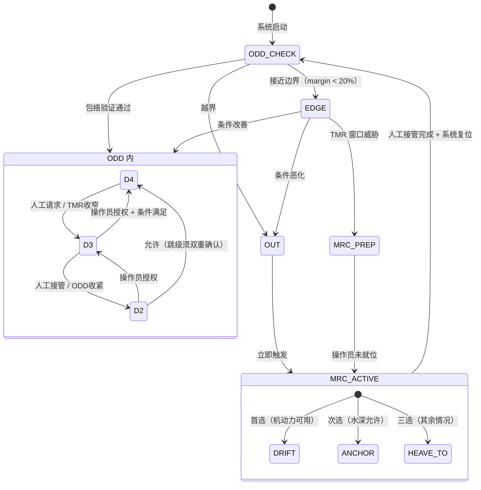

> **图3-1** ODD 主状态机。MRC（Minimum Risk Condition，最低风险状态）是 MASS Code 要求的最终兜底状态，不同于一般"紧急停止"——MRC 必须保证船舶在无人干预情况下可安全漂泊直至援助到达。

### 3.6 ODD 边界检测实现

ODD 边界检测采用连续合规评分机制，而非二值判断：

```
Conformance_Score(t) = w_E × E_score(t) + w_T × T_score(t) + w_H × H_score(t)

阈值：
  > 0.8 → ODD 内（IN）
  0.5–0.8 → ODD 边缘（EDGE），提前预警
  < 0.5 → ODD 外（OUT），立即触发 MRC 序列

权重（初始建议，待 HAZID 校正）：
  w_E = 0.4（环境条件最难干预）
  w_T = 0.3（任务条件可通过减速/停航干预）
  w_H = 0.3（人机责任可通过通信恢复改善）
```

---

## 第四章 系统架构总览

### 4.1 决策原因

本章建立 8 个模块的全局视图和相互关系，是后续各章模块详细设计的空间定位参照。理解整体才能理解局部设计决策的依据。

### 4.2 三层架构组织

TDL 8 模块按三个责任层组织，每层与特定的时间尺度和认证要求对应：

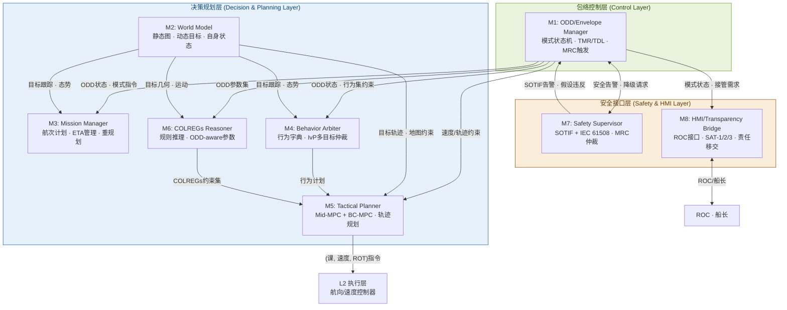

> **图4-1** L3 TDL 8 模块架构全景图。实线箭头为主数据流方向，双向箭头表示双向交互。L2 执行层不在本报告设计范围内。

### 4.3 时间分层与调用频率

TDL 遵循时间分层（Temporal Stratification）原则 [R10, R13]，不同模块工作在不同时间尺度：

| 时间尺度 | 模块 | 典型频率 | 职责描述 |
|---|---|---|---|
| 长时（1–60 min） | M1, M3 | 0.1–1 Hz | ODD 监控、航次计划管理、ETA 跟踪 |
| 中时（1–60 s） | M4, M6, M5-Mid | 1–4 Hz | 行为仲裁、COLREGs 决策、中程 MPC |
| 短时（0.1–1 s） | M2, M5-BC, M7 | 10–50 Hz | 态势跟踪、短程 BC-MPC、安全仲裁 |
| 实时（< 0.1 s） | M8 | 50–100 Hz | HMI 数据推送、接管响应 |

### 4.4 数据总线设计原则

各模块通过定义良好的消息接口通信，采用发布-订阅（Publish-Subscribe）架构（推荐 ROS2 DDS 或等效总线）：

- **强类型消息**：所有接口使用 IDL 定义的强类型消息，禁止使用字符串传递结构化数据
- **时间戳强制**：每条消息携带 `stamp`（采样时间）和 `received_stamp`（接收时间），用于延迟监控
- **置信度字段**：每条消息携带 `confidence ∈ [0,1]`，M7 据此进行 SOTIF 假设验证
- **溯源字段**：关键决策消息携带 `rationale`（决策依据摘要），供 ASDR 智能黑匣子记录

---

## 第五章 M1 — ODD / Envelope Manager

### 5.1 决策原因

ODD/Envelope Manager（M1）是 TDL 的调度枢纽，而非简单的参数切换器。其存在的根本原因是：不同 ODD 子域下，**系统的行为语义发生本质变化**（而非参数微调）——开阔水域中的"安全避让"与港内的"安全避让"是截然不同的概念。必须有一个专门的模块持续定义"什么是当前语境下的安全"。

### 5.2 决策优势

- 为所有其他模块提供单一的、权威的"当前安全语境"，消除跨模块不一致
- ODD 状态是可审计的持久化状态，直接对接 CCS 认证要求的白盒可追溯性
- 将 D2/D3/D4 模式切换与具体算法决策解耦——算法不需要知道"为什么"切换，只需服从指令

### 5.3 详细设计

**5.3.1 核心子模块**

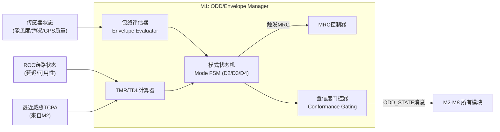

> **图5-1** M1 内部子模块关系图。

**5.3.2 模式状态机详细设计**

M1 的模式状态机维护三个正交状态维度：

```
AutoLevel ∈ {D2, D3, D4}          -- 人机责任分配
ODDZone   ∈ {ODD_A, ODD_B, ODD_C, ODD_D}  -- 当前操作域
Health    ∈ {FULL, DEGRADED, CRITICAL}  -- 系统健康状态

合法状态组合（非法组合自动降级至最近合法状态）：
  D4 允许: ODD_A + FULL
  D3 允许: (ODD_A | ODD_B | ODD_D) + (FULL | DEGRADED)
  D2 允许: ALL ODD × ALL HEALTH
  MRC: 任何状态均可触发
```

**5.3.3 Capability Manifest 加载**

M1 在系统启动时加载船型特定的 Capability Manifest（YAML 格式），该文件由船厂提供并经 CCS 签名验证：

```yaml
vessel:
  type: FCB
  loa: 45.2
  beam: 9.8
  draft_max: 2.1

envelope:
  ood_a:
    max_speed_kn: 22.0
    min_cpa_nm: 1.0
    min_tcpa_min: 12.0
  ood_b:
    max_speed_kn: 12.0
    min_cpa_nm: 0.3
  ood_c:
    max_speed_kn: 2.0
    dp_mode: true
  low_vis_threshold_nm: 2.0
  low_vis_speed_factor: 0.6

hydrodynamics:
  model: MMG_4DOF
  plugin: fcb_45m_mmg_v2.so
  turning_radius_m: 85.0    # at 18 kn
  stopping_dist_m: 720.0    # at 18 kn, full astern
```

### 5.4 接口契约

| 接口 | 方向 | 消息类型 | 频率 | 内容摘要 |
|---|---|---|---|---|
| `odd_state` | 输出 | `ODD_StateMsg` | 1 Hz | 当前 ODD 子域、AutoLevel、Conformance_Score、TMR/TDL |
| `mode_cmd` | 输出 | `Mode_CmdMsg` | 事件 | 模式切换指令（含理由） |
| `mrc_request` | 输出 | `MRC_RequestMsg` | 事件 | MRC 类型（Drift/Anchor/Heave-to）+ 建议执行时间 |
| `safety_alert` | 输入 | `Safety_AlertMsg` | 事件 | 来自 M7 的 SOTIF/IEC 61508 告警 |
| `ownship_state` | 输入 | `OwnShip_StateMsg` | 10 Hz | 来自 M2 的自身状态（位置/速度/姿态）|
| `threat_summary` | 输入 | `Threat_SummaryMsg` | 2 Hz | 来自 M2 的威胁摘要（最近 CPA/TCPA）|

### 5.5 决策依据

[R2] IMO MSC 110（2025）MASS Code 草案 §15："系统应识别船舶是否处于 Operational Envelope 之外"
[R8] Rødseth et al.（2022）Operational Envelope 三轴模型 + TMR/TDL 量化框架
[R14] Fjørtoft & Rødseth（2020）"Using the Operational Envelope to Make Autonomous Ships Safer"

---

## 第六章 M2 — World Model

### 6.1 决策原因

World Model（M2）将"从传感器读什么数据"和"基于数据做什么决策"彻底分离。没有这个分离，每个决策模块（M3/M4/M5/M6）都需要自行维护一份对外部世界的认知——当两份认知出现不一致时（这在多传感器系统中几乎必然发生），系统将产生不可预测的行为。

### 6.2 决策优势

- 所有决策模块共享单一权威的事实来源，消除"不同模块看到不同世界"的危险
- M2 的内部实现可独立升级（如从 EKF 跟踪升级到 IMM 跟踪），不影响任何决策模块
- M2 的置信度字段是 M7（Safety Supervisor）进行 SOTIF 假设验证的输入

### 6.3 详细设计

M2 维护三个相互独立但协同更新的视图：

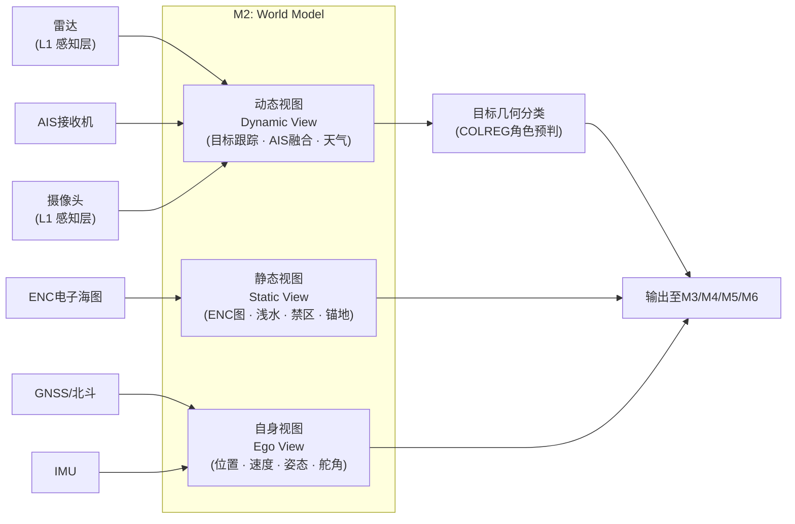

> **图6-1** M2 三视图架构。L1 感知层的融合输出（Track 级别，非原始传感器数据）输入 M2 动态视图。

**6.3.1 动态视图：目标跟踪与 COLREG 几何预分类**

动态视图不仅维护目标跟踪列表（TrackedTargetArray），还对每个目标进行 COLREG 几何角色预分类，减轻 M6（COLREGs Reasoner）的计算负担：

```
For each target i:
  bearing_i = bearing_from_own_ship(target_i)
  aspect_i  = aspect_angle(target_i)
  CPA_i     = compute_CPA(ownship_state, target_i.state)
  TCPA_i    = compute_TCPA(ownship_state, target_i.state)

  # 几何预分类（M6 仍做最终决策）
  if TCPA_i > 0:
    if bearing_i in [112.5°, 247.5°]: preliminary_role = OVERTAKING
    elif abs(bearing_i) < 6° and heading_diff > 170°: preliminary_role = HEAD_ON
    else: preliminary_role = CROSSING
  else:
    preliminary_role = SAFE_PASS
```

**6.3.2 置信度管理**

M2 对每个输出字段附加置信度分量：

```yaml
tracked_target:
  id: 42
  position: {lat: 30.5, lon: 122.3}
  speed_kn: 12.5
  heading_deg: 245.0
  cpa_m: 850.0
  tcpa_s: 420.0
  confidence:
    position: 0.95      # 基于传感器质量
    velocity: 0.88      # 速度估计不确定性较高
    intent: 0.60        # 意图预测本质上不确定
  source: [RADAR, AIS]  # 融合来源
```

### 6.4 决策依据

[R10] Urmson et al.（2008）CMU Boss "Perception & World Modeling" 独立子系统设计
[R13] Albus NIST RCS（参考体系结构）各节点独立 World Model 原则
[R15] MUNIN FP7 D5.2 Advanced Sensor Module（ASM）设计

---

## 第七章 M3 — Mission Manager

### 7.1 决策原因

Mission Manager（M3）解决了一个看似简单但实际上复杂的问题：**航次计划的生命周期管理**。航次计划不只是一个航点列表——它包含约束（ETA、避让区域、VTS 报告点）、合法性校验（水深、禁区、COG 约束）、以及在 ODD 变化时的动态调整权限。将这些逻辑嵌入 Behavior Arbiter 或 Tactical Planner 会使这两个模块过度复杂化。

### 7.2 详细设计

M3 的核心是**航次计划有效性看门人（Voyage Plan Gatekeeper）**：

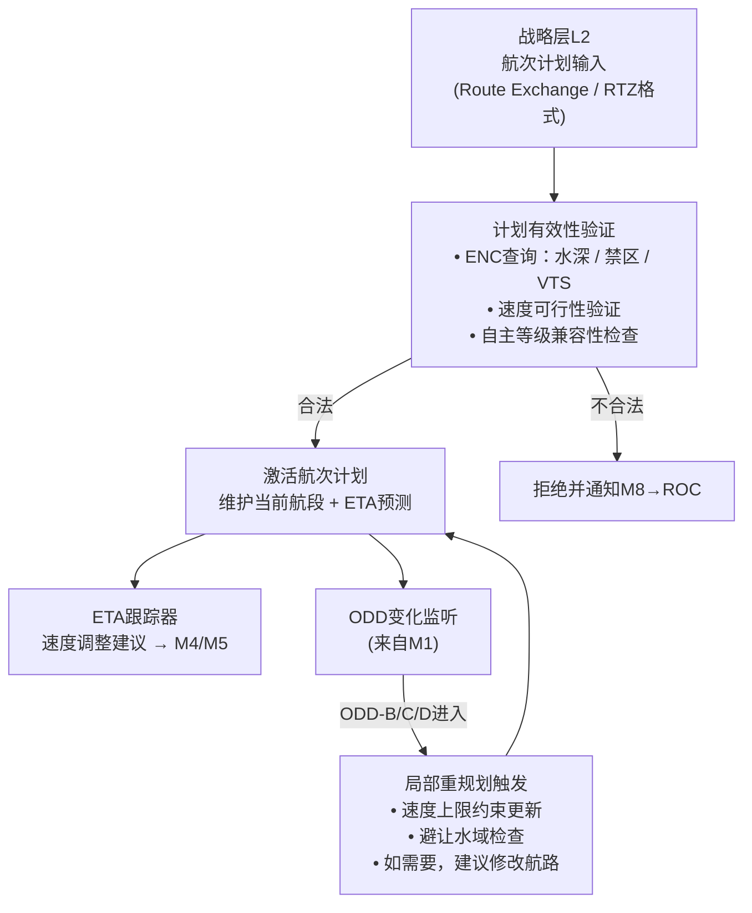

> **图7-1** M3 航次计划生命周期管理流程。

**关键设计点**：M3 不做避碰决策，但当 ODD 变化导致当前计划变得不可行时（如进入 VTS 区速度超限），M3 有权提出局部修改建议（而非强制执行，最终执行权在 M4/M5）。

### 7.3 决策依据

[R9] DNV-CG-0264 §4.2 "Planning prior to each voyage" — 作为独立子功能的规范要求
[R10] CMU Boss "Mission Planning" 层 — 独立任务计划层的工程先例

---

## 第八章 M4 — Behavior Arbiter

### 8.1 决策原因

Behavior Arbiter（M4）解决的是**并发行为冲突消解**问题。船舶在运行中同时受到多个行为目标的驱动：跟随航次计划（Mission Manager 要求）、保持 COLREGs 合规（COLREGs Reasoner 要求）、保持安全速度（ODD 要求）、维持 DP 保持（靠泊场景要求）。当这些目标冲突时，需要一个严格、可解释的仲裁机制。

**传统优先级仲裁（Priority-Based Arbitration）的缺陷**：固定优先级会导致低优先级行为在任何情况下都被忽视，可能在特定场景下产生不安全的零贡献（例如，"避碰"优先级高于"保持航速"，但在紧急情况下突然全速减速可能反而危险）[R16]。

### 8.2 决策优势

**IvP（Interval Programming）多目标优化**方法（源自 MOOS-IvP）的核心优势 [R3]：
- 每个行为对解空间（heading × speed）贡献一个偏好函数（interval function），而非单一的"赢者通吃"指令
- 最终解是所有行为偏好函数的联合最优化
- 任何行为的贡献都可量化，决策理由天然可解释

### 8.3 行为字典设计

M4 维护一个 ODD-aware 的行为字典，每个行为都绑定其适用的 ODD 子域：

| 行为名称 | 适用 ODD | 触发条件 | 优先权重（初始值）|
|---|---|---|---|
| `Transit` | ODD-A, B | 航次进行中 | 0.3 |
| `COLREGs_Avoidance` | ODD-A, B, D | 目标 CPA < 安全距离 | 0.7 |
| `Restricted_Visibility` | ODD-D | 能见度 < 2nm | 0.6 |
| `Channel_Following` | ODD-B | 进入 VTS 区 | 0.5 |
| `Approach` | ODD-C | 港口 < 5nm | 0.4 |
| `DP_Hold` | ODD-C | 靠泊操作 | 0.8 |
| `Crew_Transfer_Standby` | ODD-A, C | WT 作业待命 | 0.5 |
| `MRC_Drift` | 任何 | MRC 触发 | 1.0（最高）|

### 8.4 与 COLREGs Reasoner 的协作

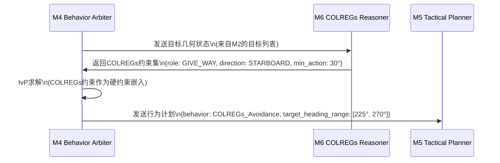

> **图8-1** M4 与 M6 协作时序。COLREGs 约束以硬约束形式进入 IvP 求解器，确保合规性不被其他行为目标压倒。

### 8.5 决策依据

[R3] Benjamin et al.（2010）MOOS-IvP IvP 多目标优化理论与海事应用
[R16] Pirjanian（1998）"Behavior Coordination Mechanisms" — 优先级仲裁缺陷分析
[R9] DNV-CG-0264 §4.5 "Deviation from planned route" + §4.8 "Manoeuvring"

---

## 第九章 M6 — COLREGs Reasoner

### 9.1 决策原因

COLREGs Reasoner（M6）作为独立模块存在，有三个核心理由：

**理由一：跨 ODD 域的规则语义根本性变化**。在开阔水域（ODD-A），Rule 13–17 是主导规则，让路船/直航船的责任分配是核心判断；在狭水道（ODD-B），Rule 9 要求靠右航行且不得妨碍专用深水航道；在能见度不良（ODD-D），Rule 19 完全取代 Rule 13–17，所有船均须减速并发声号。这种语义变化不是参数调整，而是推理框架的切换——嵌入 Behavior Arbiter 无法干净地实现。

**理由二：独立可验证性是 SIL 认证的前提**。COLREGs 推理逻辑须单独证明其正确性（独立于 MPC 轨迹优化），才能满足 IEC 61508 的可分性（separability）要求。将其嵌入 Tactical Planner 则无法独立验证 [R5]。

**理由三：白盒可审计性**。CCS 认证审查时，验船师需要能追踪"系统在某场景下为何认定本船为让路船"——这需要 COLREGs 推理逻辑有独立的可审计输出，而非被淹没在 MPC 的代价函数里。

### 9.2 规则推理架构

M6 的推理引擎采用分层规则结构，严格按 IMO COLREGs 优先级组织：

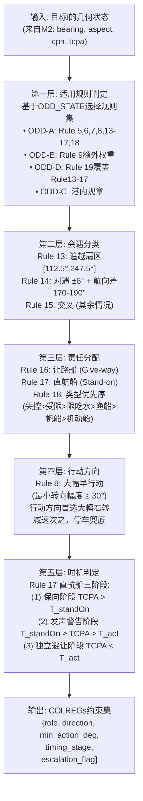

> **图9-1** COLREGs 推理五层架构。每层均有独立的单元测试套件，确保可独立验证。

### 9.3 关键参数（ODD-aware 量化）

| 参数 | ODD-A | ODD-B | ODD-D | 依据 |
|---|---|---|---|---|
| 最小转向幅度 | 30° | 20°（受限） | 30° | Rule 8"大幅"工业实操量化 |
| $T_{standOn}$（保向阈值） | 8 min | 6 min | 10 min | Wang et al.（2021）[R17] |
| $T_{act}$（独立避让阈值） | 4 min | 3 min | 5 min | Wang et al.（2021）[R17] |
| $T_{emergency}$（紧急阈值） | 1 min | 0.75 min | 1.5 min | 保守估计 |
| CPA 恢复确认时间 | 60 s | 45 s | 90 s | Safety margin |

### 9.4 决策依据

[R18] IMO COLREGs 1972（现行版）Rule 5, 6, 7, 8, 9, 13, 14, 15, 16, 17, 18, 19
[R17] Wang et al.（2021）MDPI JMSE 9(6):584 — 直航船四阶段定量分析
[R19] Bitar et al.（2019）arXiv 1907.00198 — COLREGs 状态机分离可验证设计
[R5] IEC 61508-3:2010 — 软件可分性（separability）要求

---

## 第十章 M5 — Tactical Planner

### 10.1 决策原因

Tactical Planner（M5）是 TDL 中计算强度最高的模块，负责将 M4 的行为计划和 M6 的规则约束转化为可执行的轨迹指令。采用双层 MPC 架构（Mid-MPC + BC-MPC）的核心原因是：**单层 MPC 无法同时满足长时域规划（COLREG 合规）和短时反应（紧急碰撞规避）的时间尺度需求**。

### 10.2 双层 MPC 设计

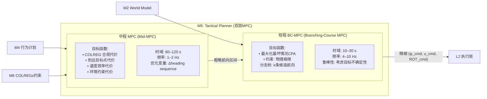

> **图10-1** M5 双层 MPC 架构。Mid-MPC 在长时域内做 COLREG 合规规划，BC-MPC 在短时域内做鲁棒执行。

### 10.3 Mid-MPC 详细设计

Mid-MPC 采用线性化 MPC，优化问题定义为：

```
min  ∑_{k=0}^{N} [w_col × J_colreg(k) + w_dist × J_dist(k) + w_vel × J_vel(k)]
     Δψ_sequence

s.t.
  |Δψ_k| ≤ ROT_max × Δt          # 转艏率约束
  speed_k ≤ speed_limit(ODD)      # ODD 速度约束
  CPA(ψ_k) ≥ CPA_safe(ODD)       # COLREG 安全距离
  ENC_check(trajectory) = SAFE    # 水深/禁区约束

参数（FCB Capability Manifest 驱动）：
  N = 12（预测步数，步长 5s，总时域 60s）
  ROT_max = 12°/s（FCB 18 kn时实测值）
  CPA_safe(ODD-A) = 1.0 nm，CPA_safe(ODD-B) = 0.3 nm
```

### 10.4 BC-MPC 详细设计

BC-MPC 采用 Eriksen 等（2020）的分支树算法 [R20]，生成 k 条候选航向并选择最坏情况 CPA 最大的分支：

```
候选航向生成：
  ψ_candidates = {ψ_current + δψ × i | i ∈ [-k/2, k/2]}
  默认 k=7，δψ = 10°（即 ±30° 范围）

对每条候选航向，考虑目标不确定性：
  最坏情况CPA(ψ_i) = min_{intent ∈ θ_uncertainty} CPA(ψ_i, intent)

选择：
  ψ_optimal = argmax_{ψ_i} min_{intent} CPA(ψ_i, intent)
```

### 10.5 FCB 高速船型修正

45m FCB 在高速段（> 15 kn）的操纵特性与 MMG 标准方法的低速假设存在显著偏差，须在 Hydro Plugin 中实现 Yasukawa & Yoshimura（2015）的完整 4-DOF MMG 模型，并针对半滑行船型补充以下修正：

- **舵效降低修正**：高速段舵效因空化和艉流影响显著下降，ROT_max 须按速度查表动态修正
- **制动性能建模**：停机-倒车制动模型须单独标定（不能用线性化近似）
- **波浪扰动模型**：Hs > 1.5m 时须引入波浪扰动项（参照 Yasukawa & Sano 2024 的近岸修正 [R21]）

### 10.6 决策依据

[R20] Eriksen, Bitar, Breivik et al.（2020）Frontiers in Robotics & AI 7:11 — BC-MPC 算法原理
[R7] Yasukawa & Yoshimura（2015）J Mar Sci Tech 20:37–52 — MMG 标准方法
[R21] Yasukawa & Sano（2024）— MMG 4-DOF 近岸修正

---

## 第十一章 M7 — Safety Supervisor

### 11.1 决策原因

Safety Supervisor（M7）存在的根本理由是：**Doer（M1–M6）可以在设计范围内完全正确地执行，但仍然不安全**。这被 ISO 21448 SOTIF 称为"功能不足（functional insufficiency）"——系统按设计运行，但设计本身在某些触发条件下不足以保证安全 [R6]。

典型 SOTIF 触发场景举例：
- M6 的 COLREGs 推理基于 AIS 数据，但目标船 AIS 关闭（SOTIF 不可见目标）
- Mid-MPC 基于目标当前运动趋势预测，但目标突然加速转向（预测模型外推失效）
- 感知融合对密集交通下的幽灵目标（ghost target）给出高置信度（虚假信息传播）

这些场景不是组件失效（IEC 61508 覆盖），而是意图功能在边界条件下的失效，须由独立的 M7 专门处理。

### 11.2 双轨监督架构

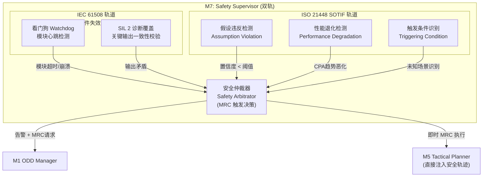

> **图11-1** M7 双轨安全监督架构。两条轨道在 Safety Arbitrator 汇聚，M7 有权直接向 M5 注入安全轨迹（绕过 M4 行为仲裁），这是系统中唯一一处 MRC 紧急快捷路径。

### 11.3 假设违反检测清单（初始版）

以下假设违反触发 SOTIF 告警升级：

| 假设 | 监控指标 | 违反阈值 | 响应 |
|---|---|---|---|
| AIS/雷达一致性 | 融合目标位置残差 | > 2σ 持续 10s | 目标置信度下调；超过 30s 触发 M7 告警 |
| 目标运动可预测性 | 预测残差 RMS | > 50m/30s | 加大 CPA 安全边距 × 1.3 |
| 感知覆盖充分性 | 盲区占比 | > 20% of 360° | 降低 D4/D3 允许等级 |
| COLREGs 可解析性 | 冲突解析失败次数 | 连续 3 次失败 | 触发减速 + ROC 告警 |
| 通信链路可用性 | RTT / 丢包率 | RTT > 2s 或丢包 > 20% | TMR 窗口收窄；D4 不允许 |

### 11.4 SIL 分配建议

基于 IEC 61508 风险图方法（LOPA 需项目级 HAZID 校正）：

| 功能 | 建议 SIL | 架构要求 |
|---|---|---|
| ODD 边界检测 + MRC 触发链（M1 + M7 联合） | SIL 2 | 单通道 + 诊断覆盖 ≥ 90% |
| COLREGs 推理（M6） | SIL 2 | 独立验证 + FMEA |
| 轨迹安全校验（M5 → ENC 查询） | SIL 1 | FMEA 覆盖 |
| D4 通信链路监控 | SIL 2 | 冗余链路 + 超时保护 |

### 11.5 决策依据

[R6] ISO 21448:2022 SOTIF — 功能不足（Functional Insufficiency）概念
[R5] IEC 61508-3:2010 — 功能安全 SIL 分配
[R22] Neurohr et al.（2025）arXiv 2508.00543 — SOTIF 在海事 ROC 认证中的应用

---

## 第十二章 M8 — HMI / Transparency Bridge

### 12.1 决策原因

将 HMI 和 ROC 接口集中在单一模块（M8）有一个不可替代的理由：**保证责任移交（Transfer of Responsibility）协议的原子性和可审计性**。如果多个模块各自向 ROC 推送状态，当 ROC 操作员接管时，无法保证所有模块都处于"已被人类感知"的状态——法律上的责任归属将无法明确。M8 是系统中唯一一个对 ROC/船长说话的实体，确保"谁在控制"的答案在任何时刻都是唯一的。

### 12.2 SAT 三层透明性设计

M8 对 ROC 和船长呈现三层信息 [R11]：

```
SAT-1（当前状态，What is happening now）:
  - 当前自主等级（D2/D3/D4）
  - 当前 ODD 子域 + Conformance_Score
  - 最近威胁列表（Top-3 by threat score）
  - 当前执行中的行为（Transit/COLREGs_Avoidance/...）

SAT-2（推理过程，Why this decision）:
  - 当前 COLREGs 决策的规则依据（如"目标船为让路船，依据 Rule 15"）
  - Mid-MPC 当前代价函数各项分解
  - ODD 合规评分的各维度分解
  - M7 当前告警状态（有无假设违反）

SAT-3（预测与不确定性，What will happen next）:
  - 预测未来 5 分钟的 CPA/TCPA 趋势
  - 当前方案的预期效果（预计回归安全 CPA 的时间）
  - 不确定性量化（目标意图不确定度 × CPA 分布）
  - 预计接管需求时间窗口
```

### 12.3 差异化视图设计

ROC 操作员和船上船长（如有）接收不同层次的信息：

| 信息层 | ROC 操作员 | 船上船长 |
|---|---|---|
| SAT-1（态势） | 完整，带数字量化 | 简化，带直觉式可视化 |
| SAT-2（推理） | 完整规则链 | 高层摘要（"正在避让右前方目标"）|
| SAT-3（预测） | 完整不确定性分布 | 关键时间节点（"预计 8 分钟后恢复原航线"）|
| 接管界面 | 详细系统状态 + 分步确认 | 一键接管 + 快速情境总结 |

### 12.4 责任移交协议

责任移交（Transfer of Responsibility，ToR）是 MASS Code 要求的强制功能 [R2]，必须满足：

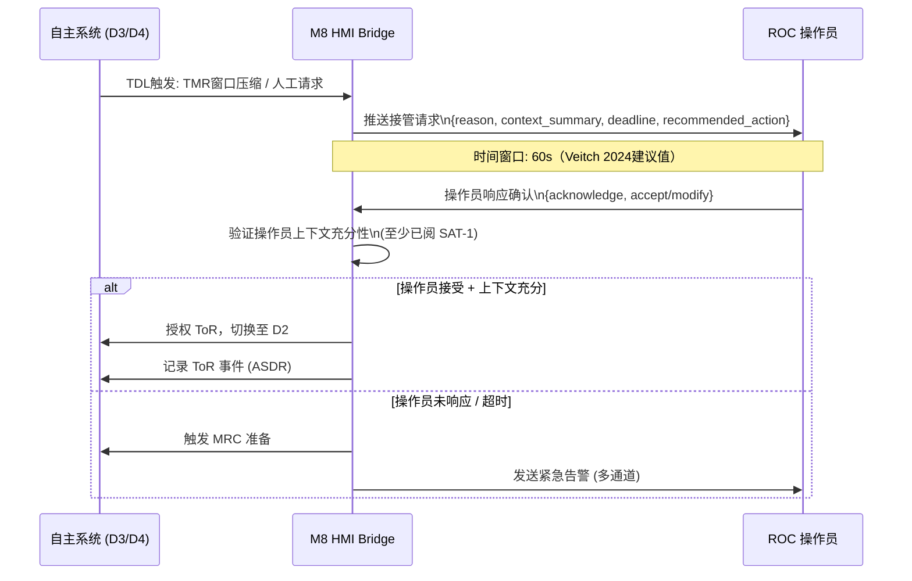

> **图12-1** 责任移交协议时序。60 秒时窗来自 Veitch 等（2024）的实证数据 [R4]。

### 12.5 决策依据

[R4] Veitch et al.（2024）Ocean Engineering 299:117257 — ROC 接管时窗实证研究
[R11] Chen et al.（ARL-TR-7180，2014）SAT 三层透明性模型
[R2] IMO MASS Code §2.8.4 — HMI including transfer of responsibility
[R23] Hareide et al.（NTNU Shore Control Lab，2022）— 从"船长"到"按钮操作员"的认知退化研究

---

## 第十三章 多船型参数化设计

### 13.1 设计原则

多船型兼容不是"在代码里加 if-else 判断船型"，而是通过**结构性解耦**实现一套核心代码支持无限船型扩展，且每种新船型的引入不需要修改任何决策算法。

### 13.2 三层解耦架构

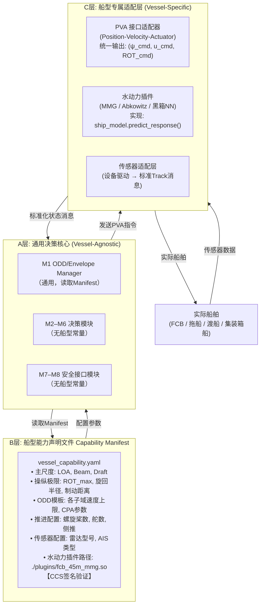

> **图13-1** 三层解耦架构。换船型时，只需提供新的 Capability Manifest 和对应的水动力插件，A 层代码零修改。

### 13.3 Backseat Driver 范式

本设计的三层解耦架构直接继承自 MOOS-IvP 的 Backseat Driver 范式 [R3]：

> "The autonomy system provides (heading, speed, depth) commands to the vehicle control system. The vehicle control system executes the control and passes navigation information to the autonomy system. The backseat paradigm is agnostic regarding how the autonomy system is implemented."

Sea Machines SM300 将此范式商业化为 TALOS 软件 + SMLink Control-API，已在 200+ 艘船（20 国）部署 [R24]，是当前最强的工业验证。

### 13.4 水动力插件接口规范

所有水动力插件须实现以下 C++ 接口（ABI 稳定，不随插件版本变化）：

```cpp
class VesselHydroPlugin {
public:
    // 基础信息
    virtual VesselManifest getManifest() const = 0;

    // 运动预测（用于MPC内部模型）
    virtual VesselState predict(
        const VesselState& current,
        const ActuatorCmd& cmd,
        double dt_s
    ) const = 0;

    // 操纵极限查询（速度依赖）
    virtual ActuatorLimits getLimits(double speed_kn) const = 0;

    // 制动距离估算
    virtual double getBrakingDistance_m(double speed_kn) const = 0;
};
```

### 13.5 典型船型扩展路径

| 船型 | 与 FCB 的主要差异 | 插件修改范围 | 决策核心修改 |
|---|---|---|---|
| 45m FCB（基准） | — | 基准插件 | 不变 |
| 25m 拖船 | 低速大推力，全旋推进器，无滑行 | 全新水动力插件 + Manifest | 零修改 |
| 70m PSV | 更大尺寸，DP 系统，较慢响应 | 全新水动力插件 + Manifest | 零修改 |
| 长江内河船 | 内水规则（非 COLREGs） | 插件 + M6 规则库切换 | 仅 M6 规则库 |

---

## 第十四章 CCS 入级路径映射

### 14.1 决策原因

本章建立 TDL 8 模块与 CCS 认证要求的精确映射，确保认证工作不是事后补充证据，而是架构设计阶段已内嵌可证性。

### 14.2 DNV-CG-0264 导航子功能 100% 覆盖验证

DNV-CG-0264（2018）§4 将自主船导航功能分解为 9 个子功能，本设计实现完整覆盖：

| DNV-CG-0264 §4 子功能 | 对应 TDL 模块 | 证据类型 |
|---|---|---|
| §4.2 Planning prior to voyage | M3 Mission Manager | 航次计划验证测试报告 |
| §4.3 Condition detection | M2 World Model + M1 EM | 感知测试 + ODD 边界检测测试 |
| §4.4 Condition analysis | M1 EM + M7 SS | ODD 评分验证 + SOTIF FMEA |
| §4.5 Deviation from planned route | M3 + M4 BA | 重规划触发测试 |
| §4.6 Contingency plans | M7 SS + M1 EM | MRC 触发测试（各类型 MRC）|
| §4.7 Safe speed | M6 CR + M5 TP | COLREGs Rule 6 覆盖率测试 |
| §4.8 Manoeuvring | M5 Tactical Planner | 轨迹跟踪精度测试 |
| §4.9 Docking | M4 BA (Docking) + M5 TP | HIL 靠泊演示 |
| §4.10 Alert management | M8 HTB + M7 SS | HMI 告警响应时间测试 |

### 14.3 CCS i-Ship 标志申请路径

建议按以下递进路径申请，降低单次认证风险：

```
阶段一（目标: M1 完成时）:
  申请 AIP (Approval In Principle)
  提交: ConOps + ODD-Spec + HARA 初版

阶段二（目标: M2 末, HIL 完成时）:
  申请 i-Ship (I, N, R1) 基础标志
  提交: 系统架构 + 安全分析 + SIL评估 + 仿真测试报告

阶段三（目标: M4 实船试航后）:
  申请 i-Ship (I, Nx, Ri) 进阶标志（含远程控制 + 进阶自主航行）
  提交: 实船试航报告 + DNV/CCS 见证记录 + 完整 ASDR 日志分析
```

### 14.4 关键证据文件清单

| 文件 | 产生阶段 | 认证用途 |
|---|---|---|
| ConOps（运营概念）| M1 | AIP 申请，定义 ODD/Operational Envelope |
| ODD-Spec | M1 | 三轴包络定义，CCS 审查基础 |
| HARA / FMEA | M1–M2 | 风险分析，SIL 分配依据 |
| SIL 评估报告 | M2 | IEC 61508 合规证明 |
| 软件安全开发计划 | M1 | IEC 62443-4-1 SDL 合规 |
| COLREGs 覆盖率测试报告 | M2 | ≥ 1000 场景，覆盖所有规则分支 |
| HIL 测试报告 | M3 | 800h+ 无致命故障 |
| 实船试航大纲 + 报告 | M4 | ≥ 50 nm 自主航行 |
| 网络安全测试程序 | M2–M3 | IACS UR E26/E27 合规 |
| ASDR 日志分析报告 | M4 | 决策可追溯性证明 |

---

## 第十五章 接口契约总表

### 15.1 核心消息定义

以下为 TDL 关键消息接口的 IDL 定义（伪代码形式，实际实现需根据技术栈选择 ROS2 IDL、Protobuf 或 DDS IDL）：

```
# ODD_StateMsg (发布者: M1, 频率: 1 Hz)
message ODD_StateMsg {
    timestamp    stamp;
    ODD_Zone     current_zone;     # ODD_A|ODD_B|ODD_C|ODD_D
    AutoLevel    auto_level;       # D2|D3|D4
    Health       health;           # FULL|DEGRADED|CRITICAL
    float32      conformance_score; # [0,1]
    float32      tmr_s;            # 当前TMR（秒）
    float32      tdl_s;            # 当前TDL（秒）
    string       zone_reason;      # ODD子域判断理由（SAT-2）
    ODD_Zone[]   allowed_zones;    # 当前健康状态下可允许的ODD子域
}

# Behavior_PlanMsg (发布者: M4, 频率: 2 Hz)
message Behavior_PlanMsg {
    timestamp    stamp;
    BehaviorType behavior;         # TRANSIT|COLREG_AVOID|DP_HOLD|...
    float32      heading_min_deg;  # 允许航向下界
    float32      heading_max_deg;  # 允许航向上界
    float32      speed_min_kn;
    float32      speed_max_kn;
    float32      confidence;
    string       rationale;        # IvP求解摘要（SAT-2）
}

# Trajectory_CmdMsg (发布者: M5, 频率: 10 Hz)
message Trajectory_CmdMsg {
    timestamp    stamp;
    float32      heading_cmd_deg;
    float32      speed_cmd_kn;
    float32      rot_cmd_deg_s;    # Rate of Turn
    float32      horizon_s;        # 有效时域
    float32      confidence;
    string[]     active_constraints; # 激活的约束列表（SAT-2）
}

# Safety_AlertMsg (发布者: M7, 事件触发)
message Safety_AlertMsg {
    timestamp    stamp;
    AlertType    type;             # IEC61508_FAULT|SOTIF_ASSUMPTION|PERFORMANCE_DEGRADED
    Severity     severity;         # INFO|WARNING|CRITICAL|MRC_REQUIRED
    string       description;
    string       recommended_action;
    float32      confidence;
}

# ToR_RequestMsg (发布者: M8, 事件触发)
message ToR_RequestMsg {
    timestamp    stamp;
    TOR_Reason   reason;           # ODD_EXIT|MANUAL_REQUEST|SAFETY_ALERT
    float32      deadline_s;       # 接管时间窗口（通常60s）
    AutoLevel    target_level;     # 请求切换到的目标等级
    string       context_summary;  # SAT-1摘要（操作员须阅读）
    string       recommended_action;
}
```

### 15.2 接口矩阵总览

| 发布者 → 订阅者 | 消息类型 | 频率 | 关键内容 |
|---|---|---|---|
| M1 → M2,M3,M4,M5,M6,M7,M8 | ODD_StateMsg | 1 Hz | ODD子域、AutoLevel、TMR/TDL |
| M1 → M4 | Mode_CmdMsg | 事件 | 行为集约束变更 |
| M2 → M3,M4,M5,M6 | World_StateMsg | 4 Hz | 目标列表、自身状态、ENC约束 |
| M3 → M4 | Mission_GoalMsg | 0.5 Hz | 当前任务目标、航段、ETA |
| M4 → M5 | Behavior_PlanMsg | 2 Hz | 行为类型、允许航向/速度区间 |
| M6 → M5 | COLREGs_ConstraintMsg | 2 Hz | 规则约束集、时机阶段 |
| M5 → L2 | Trajectory_CmdMsg | 10 Hz | (ψ_cmd, u_cmd, ROT_cmd) |
| M7 → M1 | Safety_AlertMsg | 事件 | 告警类型、严重度、MRC请求 |
| M7 → M5 | Emergency_CmdMsg | 事件（紧急）| 直接安全轨迹（绕过M4）|
| M1,M2–M7 → M8 | SAT_DataMsg | 10 Hz | 各模块 SAT-1/2/3 数据流 |
| M8 → ROC/Captain | UI_StateMsg | 50 Hz | 渲染就绪的 HMI 数据 |

---

## 第十六章 参考文献

以下为本报告所有引用的原始文献、规范和工业资料的完整来源。

**规范与法规类**

[R1] CCS《智能船舶规范》（2024/2025）+ 《船用软件安全及可靠性评估指南》. 中国船级社, 北京.

[R2] IMO MSC 110 (2025). *Outcome of the Maritime Safety Committee's 110th Session*. IMO MSC 110/23. London: International Maritime Organization. （含 MASS Code Chapter 15 草案"Proposed Amendments"MSC 110/5/1）

[R5] IEC 61508-3:2010. *Functional Safety of E/E/PE Safety-related Systems – Part 3: Software requirements*. Geneva: International Electrotechnical Commission.

[R6] ISO 21448:2022. *Road vehicles — Safety of the intended functionality (SOTIF)*. Geneva: ISO. （在本报告中用于海事 SOTIF 类比应用）

[R9] DNVGL-CG-0264 (2018). *Autonomous and Remotely Operated Ships*. DNV GL, Høvik. [在线]: https://maritimesafetyinnovationlab.org/wp-content/uploads/2020/09/DNVGL-CG-0264-Autonomous-and-remotely-operated-ships.pdf

[R18] IMO (1972/2002). *Convention on the International Regulations for Preventing Collisions at Sea, 1972 (COLREGS)*, as amended. London: IMO.

**学术文献类**

[R3] Benjamin, M.R., Schmidt, H., Newman, P.M., Leonard, J.J. (2010). Nested autonomy for unmanned marine vehicles with MOOS-IvP. *Journal of Field Robotics*, 27(6), 834–875.

[R4] Veitch, E., Alsos, O.A., Cheng, Y., Senderud, K., & Utne, I.B. (2024). Human factor influences on supervisory control of remotely operated and autonomous vessels. *Ocean Engineering*, 299, 117257. DOI: 10.1016/j.oceaneng.2024.117257

[R7] Yasukawa, H. & Yoshimura, Y. (2015). Introduction of MMG standard method for ship maneuvering predictions. *Journal of Marine Science and Technology*, 20(1), 37–52. DOI: 10.1007/s00773-014-0293-y

[R8] Rødseth, Ø.J., Wennersberg, L.A.L., & Nordahl, H. (2022). Towards approval of autonomous ship systems by their operational envelope. *Journal of Marine Science and Technology*, 27(1), 67–76. DOI: 10.1007/s00773-021-00815-z

[R10] Urmson, C., Anhalt, J., et al. (2008). Autonomous driving in urban environments: Boss and the urban challenge. *Journal of Field Robotics*, 25(8), 425–466.

[R11] Chen, J.Y.C., Procci, K., Boyce, M., Wright, J., Garcia, A., & Barnes, M. (2014). *Situation Awareness-Based Agent Transparency* (ARL Technical Report ARL-TR-7180). US Army Research Laboratory.

[R12] Jackson, S.J., Clarke, F.M., et al. (2021). Certified Control: An Architecture for Verifiable Safety of Autonomous Vehicles. arXiv:2104.06178.

[R14] Fjørtoft, K. & Rødseth, Ø.J. (2020). Using the Operational Envelope to Make Autonomous Ships Safer. *Proceedings of the NMDC 2020*, Ålesund, Norway. (Semantic Scholar CorpusID: 226236357)

[R15] MUNIN Consortium (2015). *MUNIN D5.2: Advanced Sensor Module (ASM) Design*. FP7 Project 314286. Fraunhofer CML, Hamburg.

[R16] Pirjanian, P. (1999). Behavior coordination mechanisms – State-of-the-art. *USC Computer Science Technical Report IRIS-99-375*. USC Robotics Research Labs.

[R17] Wang, T., Zhao, Z., Liu, J., Peng, Y., & Zheng, Y. (2021). Research on Collision Avoidance Algorithm of Unmanned Surface Vehicles Based on Dynamic Window Method and Quantum Particle Swarm Optimization. *Journal of Marine Science and Engineering*, 9(6), 584. DOI: 10.3390/jmse9060584

[R19] Bitar, G.I., Breivik, M., & Lekkas, A.M. (2019). Hybrid Collision Avoidance for ASVs Compliant with COLREGs Rules 8 and 13–17. arXiv:1907.00198.

[R20] Eriksen, B.H., Bitar, G., Breivik, M., & Lekkas, A.M. (2020). Hybrid Collision Avoidance for ASVs Compliant With COLREGs Rules 8 and 13–17. *Frontiers in Robotics and AI*, 7:11. DOI: 10.3389/frobt.2020.00011

[R21] Yasukawa, H. & Sano, M. (2024). MMG 4-DOF extended model for asymmetric inshore flow correction. *Journal of Marine Science and Technology*. (引用于 Patch-B §6.10 注记)

[R22] Neurohr, D., et al. (2025). Towards Efficient Certification of Maritime Remote Operations Centres via ISO 21448 SOTIF. arXiv:2508.00543.

[R23] Veitch, E., & Alsos, O.A. (2022). "From captain to button-presser: operators' perspectives on navigating highly automated ferries." *Journal of Physics: Conference Series*, 2311(1). NTNU Shore Control Lab.

**工业资料类**

[R13] Albus, J.S. (1991). Outline for a theory of intelligence. *IEEE Transactions on Systems, Man, and Cybernetics*, 21(3), 473–509. NIST Real-time Control System (RCS) Reference Architecture.

[R24] Sea Machines Robotics (2024). SM300-NG Class-Approved Autonomous Command System. [在线]: https://sea-machines.com/sm300-ng/

---

*本报告版本 v1.0。所有 [TBD] 项须在对应开发里程碑前通过 CCS 项目组征询和内部 HAZID 研讨会关闭。文档变更须经系统架构评审委员会批准。*
