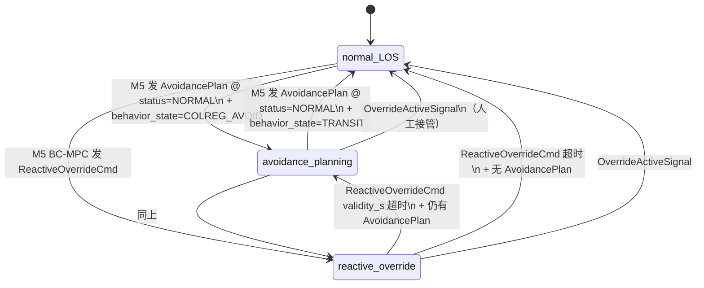

# RFC-001: M5 → L4 接口（方案 B AvoidancePlan + ReactiveOverrideCmd）

| 属性 | 值 |
|---|---|
| RFC 编号 | SANGO-ADAS-RFC-001 |
| 状态 | 草拟（待评审）|
| 阻塞优先级 | **高** — M5 详细设计启动的硬阻塞 |
| 责任团队 | L3 战术层 + L4 引导层 |
| 关联 finding | F-P1-D5-012 + F-P1-D4-032 + F-P1-D4-035 |
| 创建日期 | 2026-05-05 |

---

## 1. 背景

### 1.1 v1.1.1 中的相关章节

- §10.2 M5 双层 MPC 架构（图 10-1 修订后）
- §15.1 AvoidancePlanMsg + ReactiveOverrideCmd IDL（v1.1.1 完整定义）
- §15.2 接口矩阵第 14、15 行（M5 → L4 双接口）

### 1.2 当前设计假设

- v1.0 设计：M5 输出 `(ψ_cmd, u_cmd, ROT_cmd)` @ 10 Hz **直送 L2 / L4**
- v1.1.1 升级到**方案 B**（与 v3.0 Kongsberg 4-WP 思路对齐）：
  - **主接口** `AvoidancePlanMsg` @ 1–2 Hz：M5 Mid-MPC 输出 4-WP + speed_adjustments
  - **紧急接口** `ReactiveOverrideCmd` @ 事件 / 上限 10 Hz：M5 BC-MPC 输出 (ψ, u, ROT) 紧急覆盖
  - **L4 默认**用 LOS+WOP 跟踪 L2 PlannedRoute；避让模式下用 AvoidancePlan 覆盖 L2 PlannedRoute；紧急模式直接转发 ReactiveOverrideCmd

### 1.3 跨团队对齐的必要性

L4 当前设计（基于 `docs/Init From Zulip/MASS ADAS L4 Guidance Layer/`）已实现 LOS + WOP 自身闭环，输出 (ψ_cmd, u_cmd, ROT_cmd) → L5。**v1.1.1 方案 B 要求 L4 支持三种模式切换**：

1. **normal_LOS**：跟踪 L2 PlannedRoute（默认）
2. **avoidance_planning**：消费 M5 AvoidancePlan 覆盖 L2 PlannedRoute
3. **reactive_override**：直接转发 M5 ReactiveOverrideCmd（旁路自身 LOS）

须 L4 团队确认是否能支持 + 改造工作量。

---

## 2. 提议

### 2.1 接口 IDL（引用 v1.1.1 §15.1 — **不变**）

```
# AvoidancePlanMsg (M5 Mid-MPC → L4, 1–2 Hz)
message AvoidancePlanMsg {
    timestamp           stamp;
    AvoidanceWaypoint[] waypoints;          # 4-WP 序列（WGS84 + wp_distance + safety_corridor）
    SpeedSegment[]      speed_adjustments;  # 速度调整曲线（覆盖 L2 SpeedProfile）
    float32             horizon_s;          # 60–120 s
    float32             confidence;
    string[]            active_constraints;
    string              status;             # NORMAL | OVERRIDDEN
    string              rationale;          # IvP / MPC 求解摘要（SAT-2）
}

# ReactiveOverrideCmd (M5 BC-MPC → L4, 事件 / 上限 10 Hz)
message ReactiveOverrideCmd {
    timestamp    trigger_time;
    string       trigger_reason;     # "CPA_EMERGENCY"|"COLLISION_IMMINENT"|...
    float32      heading_cmd_deg;
    float32      speed_cmd_kn;
    float32      rot_cmd_deg_s;
    float32      validity_s;         # 1–3 s（须 BC-MPC 持续刷新）
    float32      confidence;
}
```

### 2.2 L4 三模式状态机（提议）



### 2.3 频率 / 时延 / 错误处理

| 项 | 主接口（AvoidancePlan）| 紧急接口（ReactiveOverride）|
|---|---|---|
| **频率** | 1–2 Hz（事件 + 周期）| 事件触发 / 上限 10 Hz |
| **时延** | M5 计算 < 500 ms；L4 切换 < 100 ms | M5 计算 < 100 ms；L4 切换 < 50 ms |
| **超时** | 3 s 未刷新 → L4 退化到 normal_LOS + 通知 M1 | validity_s 超时 → L4 退化到 avoidance_planning（如有）或 normal_LOS |
| **数据校验** | confidence > 0.5；waypoints 数量 ≤ 8；horizon_s ∈ [60, 120] | confidence > 0.7；validity_s ∈ [1, 3] |

---

## 3. 备选方案

### 3.1 方案 A（v1.0 原始 — 已弃用）

- **方案**：M5 输出 (ψ, u, ROT) @ 10 Hz；L4 在避让模式下旁路自身 LOS、转发 M5 指令
- **弃用理由**：
  - 浪费 L4 现有 LOS+WOP 设计
  - M5 须自行处理漂流补偿 / look-ahead 等本应 L4 职责的功能
  - 与 v3.0 Kongsberg 4-WP 思路不一致
  - DNV 验证官评审：架构重叠引发 L5 收到两套指令的潜在冲突（v1.1 复审时已弃用）

### 3.2 方案 C（极简 — 已弃用）

- **方案**：M5 直接输出 PlannedRoute 修订版给 L2，L2 重新规划后下发 L4
- **弃用理由**：
  - L2 重规划周期 1 Hz 或更低，无法应对密集场景实时避让
  - 与 v1.1.1 §3.4 TDL 时序约束不兼容

---

## 4. 风险登记

| 风险 | 概率 | 影响 | 缓解 |
|---|---|---|---|
| **L4 团队不接受三模式改造**（工作量过大）| 中 | 高（M5 详细设计阻塞）| 提供详细的 LOS+WOP 模式切换实现指导；如确实不可行，备选方案 A 保留 |
| L4 reactive_override 模式实时性不达标（< 50 ms 切换）| 低 | 中（紧急避让效果差）| 在 L4 → L5 链路保留旁路通道；FCB 实船 HIL 验证 |
| AvoidancePlan + LOS 跟踪精度不够 | 中 | 中（FCB 高速场景轨迹偏差）| 4-WP 间距合理化；LOS+WOP 转弯过渡参数同步校准 |
| ReactiveOverride 与 AvoidancePlan 切换瞬态 | 中 | 中（L5 收到指令突变）| L4 内部添加平滑过渡；validity_s 重叠期间 L4 优先 ReactiveOverride |

---

## 5. 决议项清单（须各团队确认）

| # | 决议项 | 预期答复方 |
|---|---|---|
| 1 | **L4 是否能支持三模式切换**（normal_LOS / avoidance_planning / reactive_override）？ | L4 团队 |
| 2 | **三模式切换的实时性能**（normal → avoidance < 100 ms；avoidance → reactive < 50 ms）是否可达？ | L4 团队 |
| 3 | **AvoidancePlanMsg IDL 字段** 是否完整？是否需要补充字段（如 `mode_hint` 显式指示 L4 切换）？ | L4 团队 |
| 4 | **ReactiveOverrideCmd validity_s** 1–3 s 是否合理？BC-MPC 周期是否可保证刷新？ | L3 团队（M5 设计师）|
| 5 | **超时退化协议**（M5 失联 → L4 退化到 normal_LOS）是否清晰？是否需补告警？ | L4 + L3（M1 设计师）|
| 6 | **L4 → L5 输出**：三模式下输出格式是否一致（仍是 ψ, u, ROT）？ | L4 + L5 |
| 7 | **L4 改造工作量预估**（人月 / 时间表）？ | L4 团队 |

---

## 6. 验收标准

跨团队对齐成功的判据：

- ✅ L4 团队书面承诺三模式支持 + 改造时间表
- ✅ AvoidancePlanMsg + ReactiveOverrideCmd IDL 锁定（如需修订，须 v1.1.2 patch）
- ✅ 实时性能基准（normal→avoidance < 100 ms / avoidance→reactive < 50 ms）通过 HIL 初步验证
- ✅ 超时退化协议在 L3 + L4 双方文档中一致
- ✅ FCB 项目计划纳入 L4 改造工作量

---

## 7. 时间表（建议）

| 里程碑 | 日期（相对周次）| 责任 |
|---|---|---|
| Kick-off 会议 | T+1 周 | PM 召集 |
| L4 评审 + 反馈 | T+1.5 周 | L4 团队 |
| 深度对齐会议 | T+2 周 | L3 + L4 |
| 决议签署 | T+2.5 周 | 双方架构师 |
| L4 改造 PoC | T+4–6 周 | L4 团队 |
| HIL 验证（实时性能）| T+8 周 | L3 + L4 |

---

## 8. 参与方

| 角色 | 团队 | 职责 |
|---|---|---|
| **架构师**（L3 主提议方）| L3 战术层 | 提议 + 设计依据 |
| **架构师**（L4）| L4 引导层 | 接受 / 反对 + 改造方案 |
| **PM** | 系统集成总师 | 协调 + 时间表 |
| **CCS 验船师**（咨询）| 外部 | 接口契约可审计性意见 |
| **HF 工程师**（咨询）| 内部 | 紧急接管模式与 §12.4 ToR 协议的交互 |

---

## 9. 参考

- **v1.1.1 锚点**：§10.2 图 10-1 / §15.1 AvoidancePlanMsg / §15.1 ReactiveOverrideCmd / §15.2 接口矩阵
- **v3.0 Kongsberg 基线**：CLAUDE.md §2（Avoidance Planner 4-WP 输出）
- **学术参考**：[R20] Eriksen 2020 BC-MPC + [R3] MOOS-IvP Backseat Driver
- **L4 现有设计**：`docs/Init From Zulip/MASS ADAS L4 Guidance Layer/MASS_ADAS_L4_WOP_Module_技术设计文档.md`
