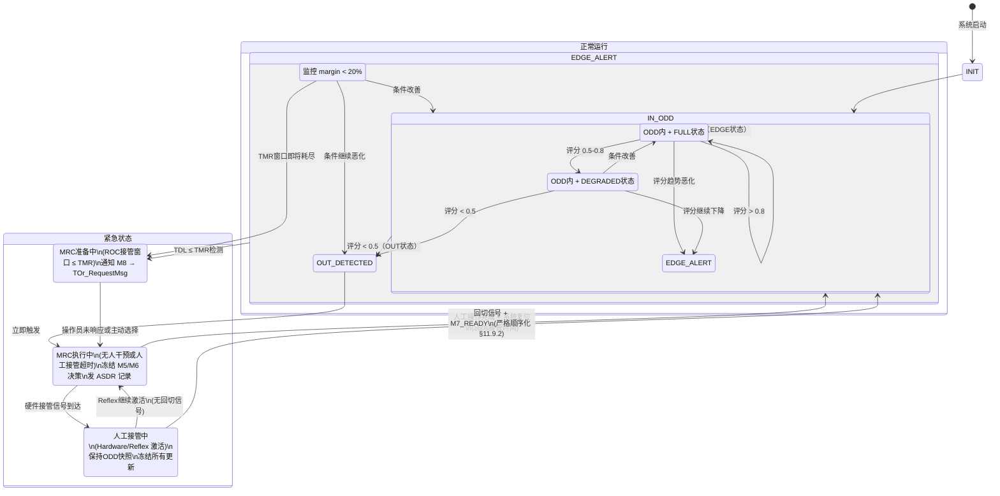

# M1 ODD/Envelope Manager 详细功能设计

| 属性 | 值 |
|---|---|
| 文档编号 | SANGO-ADAS-L3-DD-M1-001 |
| 版本 | v1.0 |
| 日期 | 2026-05-05 |
| 状态 | 草稿 |
| 架构基线 | v1.1.1（§3 ODD框架 / §5 M1 / §15 接口契约） |
| 上游依赖 | M2 World_StateMsg · M7 Safety_AlertMsg · X-axis CheckerVetoNotification · Y-axis ReflexActivationNotification · Hardware Override OverrideActiveSignal |
| 下游接口 | M2/M3/M4/M5/M6/M7/M8 ODD_StateMsg · M4 Mode_CmdMsg · ASDR ASDR_RecordMsg |

---

## 1. 模块职责（Responsibility）

**M1 ODD/Envelope Manager** 是 L3 战术决策层的调度枢纽，核心职责是：

1. **实时 ODD 状态机维护**：根据环境、技术、人机可用性三轴监控，持续计算系统当前处于哪个 ODD 子域（A/B/C/D），以及该子域下允许的自主等级（D2/D3/D4）。
2. **Conformance_Score 计算**：通过加权融合三轴评分，产生 [0,1] 范围的合规得分，驱动 IN / EDGE / OUT 的状态决策。
3. **TMR/TDL 量化**：实时计算操作员最大响应时间窗口（TMR）和系统自主决策时间余量（TDL），在 TDL ≤ TMR 时触发接管请求。
4. **MRC 触发与协调**：当 ODD 越界或 M7 安全告警时，触发预定义最低风险状态（MRC）序列，并仲裁 M1→M7→M5 的 MRM 命令分发。
5. **接管期间行为管理**：在硬件接管（Hardware Override）或 Reflex Arc 激活时，冻结决策逻辑、保持状态快照供 ASDR，并协调回切顺序。

**权威性**：M1 状态变化是 L3 内部 **唯一的** "当前安全语境" 权威来源（决策二 §2.2）。所有其他模块（M2–M8）均以 M1 的 ODD_StateMsg 作为行为参数化依据，不得各自维护独立的 ODD 判断。

参考来源：v1.1.1 §5.1 + §2.2 决策一。

---

## 2. 输入接口（Input Interfaces）

### 2.1 消息列表

| 消息名 | 来源 | 频率 | 必备字段 | 时延要求 | 缺失处理 |
|---|---|---|---|---|---|
| **World_StateMsg** | M2 | 4 Hz | targets[].{cpa_m, tcpa_s}, own_ship.{u, v, position}, zone.{zone_type, in_tss, in_narrow_channel}, confidence | ≤ 300 ms | 超时 2 周期（500 ms）→ 判定 M2 DEGRADED，TDL 收窄至 min(TDL × 0.5, 30s)；超时 5 周期 → MRC-01 触发 |
| **Safety_AlertMsg** | M7 | 事件 | type, severity, recommended_mrm, confidence | ≤ 100 ms | 立即仲裁，无缓存延迟 |
| **EnvironmentState** | Multimodal Fusion（经由 M2） | 0.2 Hz | visibility_nm, sea_state_hs, traffic_density, zone_type, in_tss | ≤ 5 s | 超时 → 采用最近有效值；> 30s 未更新 → 降级信号触发 |
| **CheckerVetoNotification** | X-axis Checker（经由 M7）| 事件 | veto_reason_class, stamp | ≤ 100 ms | 纳入 SOTIF 假设违反检测（§11.3 表行 6）|
| **ReflexActivationNotification** | Y-axis Reflex Arc | 事件 | activation_time, reason, l3_freeze_required | ≤ 50 ms | 立即冻结 M1→M5 命令通道，进入 OVERRIDDEN 模式 |
| **OverrideActiveSignal** | Hardware Override Arbiter | 事件 | override_active, activation_source | ≤ 50 ms | override_active=true → 进入 OVERRIDDEN 模式；false → 启动回切顺序化（§11.9.2） |

### 2.2 输入数据校验

**时间戳对齐**：
- 所有周期消息（World_StateMsg）入栈后执行**时间对齐窗口**（±200 ms），确保同一周期内读取的 ODD 输入来自同一时刻切片
- 事件消息（Safety_AlertMsg）立即处理，不进行时间对齐缓冲

**置信度过滤**：
- World_StateMsg 中若 confidence < 0.6（低置信度），自动降级为 DEGRADED 状态；触发 TDL 收窄 × 0.7
- EnvironmentState 中若 visibility_nm 数据缺失，默认视为"能见度不良"，激活 ODD-D 约束

**超时保护**：
- 频率 4 Hz 消息（World_StateMsg）超时 2 周期（500 ms）判定为 M2 失效，触发 MRC-01 准备
- 频率 0.2 Hz 消息（EnvironmentState）超时 5 周期（25 s）判定为失效，切换到保守 E_score = 0（最坏情况）

**范围校验**：
- TMR_s ∈ [30, 600]（秒）；超出范围自动夹至边界
- TDL_s ∈ [0, 600]；< 0 视为系统失效
- Conformance_Score ∈ [0, 1.0]；计算结果自动归一化

---

## 3. 输出接口（Output Interfaces）

### 3.1 消息列表

| 消息名 | 订阅者 | 频率 | 关键字段 | SLA |
|---|---|---|---|---|
| **ODD_StateMsg** | M2/M3/M4/M5/M6/M7/M8 | 1 Hz + 事件 | current_zone, auto_level, health, conformance_score, tmr_s, tdl_s, zone_reason, allowed_zones | 1 Hz 周期保证 + EDGE→OUT 突变时事件补发（≤ 50 ms 延迟） |
| **Mode_CmdMsg** | M4 | 事件 | target_level, reason, deadline_s | 级联约束变更时事件触发；不延迟 |
| **MRC_RequestMsg** | M5（通过 M1 仲裁后） | 事件 | mrc_type, parameters, confidence | M7 recommended_mrm 索引 → M1 仲裁 → M5 执行（总延迟 ≤ 200 ms） |
| **ASDR_RecordMsg** | ASDR | 事件 + 2 Hz | source_module="M1", decision_type={zone_change, conformance_score_update, tdl_calculation, mrc_trigger, override_entry_exit}, decision_json | 决策日志须含时间戳 + rationale，签名防篡改 |

### 3.2 输出 SLA

- **ODD_StateMsg 周期性**：严格 1 Hz（±50 ms 抖动容限），事件型突变补发不得延迟超过 50 ms
- **Mode_CmdMsg 事件延迟**：≤ 100 ms（从状态变化检测到命令下发）
- **数据新鲜度**：ODD_StateMsg 中所有字段基于最近 500 ms 内的输入快照；超过此窗口视为陈旧，触发 M2 DEGRADED 信号
- **失效降级**：若 M1 自身崩溃（心跳丢失 > 2 s），系统自动触发 MRC-01 + D2 降级（由 X-axis 外部监控触发）

参考：v1.1.1 §15.1 ODD_StateMsg 定义 + §15.2 接口矩阵。

---

## 4. 内部状态（Internal State）

### 4.1 状态变量

M1 维护以下持久化状态变量（ASDR 需记录所有）：

```yaml
# ODD 状态三维空间
current_zone:        Enum[ODD_A, ODD_B, ODD_C, ODD_D]
current_auto_level:  Enum[D2, D3, D4]
system_health:       Enum[FULL, DEGRADED, CRITICAL]

# 评分与阈值
conformance_score:   Float32 ∈ [0, 1]
  e_score:           Float32（环境评分）
  t_score:           Float32（任务评分）
  h_score:           Float32（人机评分）
score_history:       Deque<(timestamp, score)> len=100  # 用于趋势分析

# 时间参数
tmr_s:               Float32（当前 TMR，秒）
tdl_s:               Float32（当前 TDL，秒）
tcpa_min:            Float32（最近威胁 TCPA，秒）
t_comm_ok:           Float32（预计通信可用时长，秒）
t_sys_health:        Float32（系统可靠维持时间，秒）

# ODD 边界状态
zone_margin:         Float32 ∈ [0, 1]（当前距离边界的相对余量）
zone_transition:     Enum[STABLE, APPROACHING_EDGE, EDGE_DETECTED, OUT_DETECTED]
last_zone_change_t:  Timestamp

# 模式状态
mode_fsm_state:      Enum[NORMAL, EDGE_ALERT, MRC_PREP, MRC_ACTIVE, OVERRIDDEN]
mrc_type:            Enum[DRIFT, ANCHOR, HEAVE_TO]（当前 MRC 类型，如已激活）

# 接管相关
override_active:     Bool（人工接管是否激活）
override_entry_t:    Timestamp（接管开始时刻）
override_snapshot:   Struct{ood_state, tdl, mrc_status, ...}（快照供回切）

# 监控指标
m7_sotif_veto_count: Int32（近 100 周期内 M7 SOTIF 否决次数）
checker_veto_count:  Int32（近 100 周期内 X-axis Checker 否决次数）
m2_degraded_since:   Timestamp or NULL（M2 进入 DEGRADED 的时刻，用于持续时间计算）
```

### 4.2 状态机（如适用）

M1 的模式状态机是核心逻辑，采用分层设计：



**关键转移条件**：

1. **IN → EDGE**：`conformance_score ∈ [0.5, 0.8)` 且 `zone_margin < 20%`
2. **IN → OUT**：`conformance_score < 0.5` 或任意三轴（E/T/H）评分为 0
3. **EDGE → MRC_PREP**：`tdl_s ≤ tmr_s` 且 `tmr_s > 0`（人工可接管）
4. **任何状态 → OVERRIDDEN**：`OverrideActiveSignal.override_active == true`；优先级最高
5. **OVERRIDDEN → IN**：`OverrideActiveSignal.override_active == false` 且 M7 发出 `M7_READY` 信号（回切顺序化）

### 4.3 持久化（哪些状态需 ASDR 记录）

**强制持久化**（每次状态变化）：
- `timestamp, current_zone, current_auto_level, system_health`
- `conformance_score, e_score, t_score, h_score`（带权重）
- `tmr_s, tdl_s, tcpa_min`（计算参数）
- `zone_transition, zone_reason`（文本摘要）
- `mode_fsm_state, mrc_type`（模式信息）
- **rationale**：JSON 对象，含"为什么状态变化"的决策路径（用于 CCS 认证审计）

**定期持久化**（2 Hz）：
- 所有持久化字段的当前值快照（用于离线分析）

**事件持久化**：
- `override_entry_t`, `override_exit_t`（接管期间）
- `m7_sotif_alert` 事件日志（每次 M7 告警）
- `checker_veto` 事件日志（每次 X-axis 否决）

参考：v1.1.1 §15.1 ASDR_RecordMsg IDL。

---

## 5. 核心算法（Core Algorithm）

### 5.1 算法选择

M1 采用**连续合规评分 + 离散状态机融合** 的混合方法，而非单纯的二值判决（IN/OUT），原因如下：

1. **连续评分**：能早期检测到接近边界的条件变化（EDGE 状态），给 ROC 和系统充足的应对时间
2. **离散状态机**：保证状态转移的确定性和可审计性，避免"浮动阈值"导致的状态频繁抖动
3. **融合依据**：v1.1.1 §3.6 Conformance_Score 三轴加权模型

学术与工业依据：
- Rødseth et al. (2022) [R8]：ODD 三轴框架
- Veitch et al. (2024) [R4]：TMR 实证基线 ≥ 60 s
- Wang et al. (2021) [R17]：TCPA 时间阈值

### 5.2 数据流

```
┌─────────────────────────────────────────────────────────────────┐
│ M1 ODD/Envelope Manager 数据流                                   │
└─────────────────────────────────────────────────────────────────┘

输入汇聚 (4 Hz 主循环):
  ├─ World_StateMsg (M2) @ 4 Hz
  │  ├─ targets[].{cpa_m, tcpa_s} → 计算 TCPA_min
  │  ├─ EnvironmentState.visibility_nm → E_score 计算
  │  ├─ EnvironmentState.sea_state_hs → E_score 计算
  │  └─ EnvironmentState.zone_type → zone 类型识别
  │
  ├─ EnvironmentState (Multimodal Fusion, 0.2 Hz 经 M2 缓冲)
  │  ├─ visibility_nm, sea_state_hs → E_score
  │  └─ traffic_density → H_score 权重调整
  │
  ├─ Capability_Manifest (静态，启动时加载)
  │  ├─ vessel.type, hydrodynamics.* → T_score 参考值
  │  └─ envelope.ood_*.{max_speed, min_cpa, min_tcpa} → 阈值
  │
  └─ Safety_AlertMsg (M7, 事件)
     └─ type, severity, recommended_mrm → MRC 触发

评分计算 (每 4 Hz 循环):
  
  E_score 计算（环境评分）：
    ├─ if visibility_nm >= 2.0 && sea_state_hs <= 2.5 → E_score = 1.0
    ├─ else if visibility_nm >= 1.0 && sea_state_hs <= 3.0 → E_score = 0.7
    ├─ else if visibility_nm >= 0.5 || sea_state_hs <= 4.0 → E_score = 0.4
    └─ else → E_score = 0 (ODD 外)
    
    [TBD-HAZID] 上述阈值为 FCB 初始值，待实船试航校准
  
  T_score 计算（任务评分）：
    ├─ if (GNSS_quality == GOOD && radar_health == OK && comm_ok) 
    │  && (task_phase != approaching) → T_score = 1.0
    ├─ else if (GNSS_quality == DEGRADED || radar_health == DEGRADED)
    │         && (comm_delay < 2s) → T_score = 0.6
    ├─ else if (comm_delay > 2s || any_sensor_critical) → T_score = 0.3
    └─ else (任何关键系统失效) → T_score = 0
    
    [TBD-HAZID] 缓冲值（2s, 0.6, 0.3）待 HAZID 校准
  
  H_score 计算（人机可用性评分）：
    ├─ base_score = (TMR_available && comm_ok) ? 1.0 : 0.5
    ├─ D4_allowed = (base_score > 0.9 && T_score > 0.8) ? true : false
    ├─ D3_allowed = (base_score > 0.5 && T_score > 0.4) ? true : false
    └─ D2_allowed = true（D2 无 H 轴限制，仅需船上备援）

  合并评分：
    ├─ conformance_score = w_E × E_score + w_T × T_score + w_H × H_score
    │  其中 w_E = 0.4, w_T = 0.3, w_H = 0.3 [TBD-HAZID 校准]
    └─ 初始权重依据见 v1.1.1 §3.6（E 轴权重最高因不可干预）

状态转移逻辑 (每 4 Hz 循环):
  ├─ if conformance_score > 0.8 → state = IN_FULL (或 IN_DEGRADE)
  ├─ else if 0.5 <= conformance_score <= 0.8 → state = EDGE
  ├─ else if conformance_score < 0.5 → state = OUT
  │
  ├─ if state == EDGE && tdl_s <= tmr_s → state = MRC_PREP
  ├─ else if state == OUT → state = MRC_ACTIVE (立即)
  └─ if override_active == true → state = OVERRIDDEN (最高优先级)

TMR/TDL 计算（每 4 Hz 更新）：
  ├─ TCPA_min = min(targets[].tcpa_s)
  ├─ T_comm_ok = estimate_communication_window()
  │              (基于当前 RTT / 丢包率推算可用时长)
  ├─ T_sys_health = estimate_system_mtbf()
  │                (基于各模块心跳 + 冗余状态推算)
  │
  ├─ TDL = min(TCPA_min × 0.6, T_comm_ok, T_sys_health)
  │  其中 0.6 系数 = 60% 留给碰撞规避，40% 给操作员接管 [R4]
  │  [TBD-HAZID] 该系数待实船校准
  │
  └─ TMR = 60 s [R4] (设计基线，可按配置文件修改)

模式与约束级联：
  ├─ if D4_allowed == false → downgrade_mode_to_D3
  ├─ if D3_allowed == false → downgrade_mode_to_D2
  └─ if MRC_ACTIVE → freeze_all_decision_modules()

ASDR 记录：
  └─ 每次状态变化 OR 2 Hz 定期
     记录 (timestamp, zone, level, scores, tdl, tmr, rationale)
```

### 5.3 关键参数（含 [HAZID 校准] 标注）

**Conformance_Score 权重**（v1.1.1 §3.6，F-NEW-003 关闭）：

| 参数 | 初始值 | 范围 | 单位 | HAZID 校准 | 依据 |
|---|---|---|---|---|---|
| w_E（环境权重） | 0.4 | [0.2, 0.6] | — | **[TBD-HAZID]** | 能见度/海况不可软件干预，故权重最高 |
| w_T（任务权重） | 0.3 | [0.1, 0.5] | — | **[TBD-HAZID]** | 传感器/通信故障可通过冗余缓解 |
| w_H（人机权重） | 0.3 | [0.1, 0.5] | — | **[TBD-HAZID]** | 由法规预定义的 D1–D4，权重影响 TMR |

**E_score 阈值**（环境条件分段）：

| 条件组合 | E_score | HAZID 校准 | 说明 |
|---|---|---|---|
| visibility ≥ 2.0 nm AND Hs ≤ 2.5 m | 1.0 | **[TBD-HAZID]** | ODD-A 理想条件（开阔水域） |
| visibility ≥ 1.0 nm AND Hs ≤ 3.0 m | 0.7 | **[TBD-HAZID]** | ODD-B 可接受条件（狭水道） |
| visibility ≥ 0.5 nm OR Hs ≤ 4.0 m | 0.4 | **[TBD-HAZID]** | ODD-D 能见度不良警告 |
| visibility < 0.5 nm OR Hs > 4.0 m | 0.0 | **[TBD-HAZID]** | OUT 不安全 |

**TMR/TDL 计算参数**：

| 参数 | 初始值 | 单位 | HAZID 校准 | 依据 |
|---|---|---|---|---|
| TCPA_min 系数 | 0.6 | — | **[TBD-HAZID]** | Veitch 2024 [R4]：60% 碰撞规避 + 40% 人接管 |
| T_standOn（保向阈值，ODD-A） | 8 min | s | **[TBD-HAZID]** | Wang et al. 2021 [R17] |
| T_act（独立避让阈值，ODD-A） | 4 min | s | **[TBD-HAZID]** | Wang et al. 2021 [R17] |
| TMR 基线 | 60 s | s | **[TBD-HAZID]** | Veitch et al. 2024 [R4]；可按配置调整 |

**状态机阈值**：

| 转移条件 | 阈值 | HAZID 校准 |
|---|---|---|
| IN → EDGE 分界 | conformance_score = 0.8 | **[TBD-HAZID]** |
| EDGE → OUT 分界 | conformance_score = 0.5 | **[TBD-HAZID]** |
| zone_margin 进入 EDGE 百分比 | 20% | **[TBD-HAZID]** |
| M7 SOTIF 否决率触发告警 | > 20% (≥20 次/100 周期) | §11.3 假设违反清单 |
| X-axis Checker 否决率触发告警 | > 20% | §11.3 假设违反清单 + v1.1.1 F-NEW-004 |

**FCB Capability Manifest 相关参数**（从船型文件读取，不硬编码）：

| 参数 | 初始值（FCB） | 单位 | 来源 | 说明 |
|---|---|---|---|---|
| max_speed_ood_a | 22.0 | kn | Capability Manifest | ODD-A 最大巡航速度 |
| max_speed_ood_b | 12.0 | kn | Capability Manifest | ODD-B 狭水道速度限制 |
| min_cpa_ood_a | 1.0 | nm | Capability Manifest | ODD-A 安全 CPA 下限 |
| min_tcpa_ood_a | 12 | min | Capability Manifest | ODD-A 直航船保向阈值 |
| stopping_distance_18kn | 720 | m | Capability Manifest | FCB 18 kn 制动距离 [R7] |
| rot_max_18kn | 12 | °/s | Capability Manifest | FCB 18 kn 最大转艏率 |

**[HAZID 校准] 标注说明**：

所有标注为 `[TBD-HAZID]` 的参数须在项目级 HAZID 中进行以下校准：
1. **数据源**：FCB 45m 实船操纵性试验数据 + 水池试验 + 近似船型历史数据
2. **校准方法**：贝叶斯参数估计或极大似然法（要求 ≥ 100 小时运营数据）
3. **验证**：经 CCS 验证并签署 Class Notation 认证
4. **更新机制**：HAZID 结果 → 回填本 spec + Capability Manifest YAML

### 5.4 复杂度分析（时间 + 空间）

**时间复杂度**（主循环 4 Hz，单次执行）：

| 操作 | 复杂度 | 说明 |
|---|---|---|
| 读取 World_StateMsg（含 N 个目标） | O(N) | 遍历目标列表计算 TCPA_min |
| E_score / T_score / H_score 计算 | O(1) | 各评分为常数时间条件判断 |
| Conformance_Score 加权求和 | O(1) | 三项加权 |
| 状态机转移判定 | O(1) | 状态转移是确定性有限状态机 |
| TMR/TDL 重新计算 | O(1) | 基于当前输入的简单公式 |
| ASDR 序列化与签名 | O(1) | SHA-256 计算（硬件加速） |
| **单次主循环总计** | **O(N)** | N ≈ 20–50 目标（通常） |

对于 N=50，单次执行时间估计 < 50 ms（在 4 Hz = 250 ms 周期内充足）。

**空间复杂度**：

| 数据结构 | 大小 | 说明 |
|---|---|---|
| score_history（Deque） | 100 × 24 B | ~2.4 KB（用于趋势分析） |
| 目标列表缓存 | N × 200 B | ~10 KB（N=50） |
| Capability Manifest（内存） | ~5 KB | YAML 反序列化后 |
| 状态变量（持久化） | ~1 KB | 所有 ODD 状态 + 模式 + 计数器 |
| **总计** | ~20 KB | 嵌入式系统内存压力极低 |

---

## 6. 时序设计（Timing Design）

### 6.1 周期任务

```
M1 主循环（4 Hz 驱动）：
├─ T=0 ms     : World_StateMsg 采样（来自 M2 @ 4 Hz）
├─ T=0–5 ms   : 输入校验 + 时间对齐
├─ T=5–15 ms  : E/T/H 评分计算
├─ T=15–20 ms : conformance_score 融合
├─ T=20–25 ms : 状态转移逻辑
├─ T=25–30 ms : TMR/TDL 重算
├─ T=30–40 ms : ODD_StateMsg 序列化 + 发布
└─ T=40–50 ms : ASDR 定期记录（仅 2 Hz 采样）

M1 ODD 周期发布（1 Hz，与主循环 4 Hz 解耦）：
├─ 每隔 4 个主循环周期（250 ms）发布一次 ODD_StateMsg
└─ 事件型补发：EDGE→OUT 突变时立即补发（不等待下一周期）
   延迟要求：≤ 50 ms（从检测到补发）

安全告警处理（事件驱动）：
├─ M7 Safety_AlertMsg 到达 → 立即处理（不缓存）
├─ 响应延迟：≤ 100 ms（从 M7 发送到 M1 完成仲裁）
└─ 若告警推荐 MRM-02（停车），立即触发

接管信号处理（事件驱动，最高优先级）：
├─ OverrideActiveSignal 到达 → 立即进入 OVERRIDDEN 状态
├─ 冻结所有决策输出（ODD_StateMsg 除外，保持快照）
└─ 响应延迟：≤ 50 ms
```

### 6.2 事件触发任务

**高优先级事件**（抢占主循环）：

1. **OverrideActiveSignal** → 立即切换 OVERRIDDEN 模式，冻结 M5/M7 命令链路
2. **Safety_AlertMsg（severity=CRITICAL 或 MRC_REQUIRED）** → 立即仲裁 MRC 触发
3. **ReflexActivationNotification** → 立即进入 OVERRIDDEN，保持快照（优先级同 Override）

**中优先级事件**：

4. **ODD 状态突变（EDGE→OUT）** → 事件补发 ODD_StateMsg，不延迟到周期发布
5. **Checker VETO 率超过 20%** → 发 M7 SOTIF 升级告警（M7 内部决策，M1 监听）

**低优先级处理**：

6. M2 DEGRADED 信号（通过 World_StateMsg.confidence < 0.6）→ 下一个主循环处理

### 6.3 延迟预算

```
端到端延迟预算（从威胁出现到 MRC 执行）：

Scenario 1: EDGE→OUT 快速恶化
  Threat 出现 @ M2
    ├─ M2 CPA/TCPA 计算：< 100 ms
    ├─ M2 → M1 World_StateMsg 传输：< 50 ms
    ├─ M1 ODD 评分更新 + 状态转移：< 30 ms
    ├─ M1 ODD_StateMsg 事件补发：< 50 ms [总: 230 ms]
    │
    └─ 若 TDL ≤ TMR：
      M1 → M7 Safety_AlertMsg (标记 MRC_REQUIRED)
        ├─ M7 SOTIF 最终检查：< 50 ms
        ├─ M7 → M1 Safety_AlertMsg：< 100 ms
        ├─ M1 仲裁 MRC：< 20 ms
        └─ M1 → M5 MRC_RequestMsg：< 100 ms
        总延迟: ~230 + 270 = 500 ms（从威胁到 M5 收到 MRC 指令）

Scenario 2: 人工接管请求
  M1 检测 TDL ≤ TMR (EDGE→MRC_PREP)
    ├─ M1 生成 TOr_RequestMsg（经 M8）：< 50 ms
    ├─ M8 HMI 刷新 + 操作员展示：< 100 ms
    ├─ 操作员接管延迟：60 s [R4]（设计约束，非系统延迟）
    └─ Hardware Override Arbiter 激活：< 50 ms
    总：系统响应 200 ms + 操作员 60 s

延迟分配（关键路径）：
├─ 感知延迟（Multimodal Fusion）：< 200 ms [系统外]
├─ M2 处理 + M1 处理：< 150 ms [目标 <= 200 ms]
├─ 消息总线传输：< 100 ms [ROS2 DDS SLA]
└─ M1 → M5/M7 命令传输：< 100 ms
  总控制延迟：≤ 550 ms（从新目标到 M5 接收到 MRC）
  
  与 TMR ≥ 60 s [R4] 相比，550 ms 可接受（小于 1%）
```

---

## 7. 降级与容错（Degradation & Fault Tolerance）

### 7.1 降级路径（DEGRADED / CRITICAL / OUT-of-ODD）

M1 定义三个降级状态，严格对应系统健康度：

**FULL 状态**（完全可用）：
- 所有传感器 + 通信 + 计算模块运行正常
- conformance_score > 0.8
- 可执行 D4（无人）自主
- MRC 准备状态：不需要，系统有充分时间应对威胁

**DEGRADED 状态**（部分失效，继续运行）：

触发条件（满足任一）：
- M2 心跳丢失 1–2 周期（100–200 ms），但尚未超时
- 单个传感器（GNSS / Radar）置信度下降，但有冗余源
- 通信 RTT > 1.5 s，但链路仍可用（D3–D4 不允许，降至 D2）
- 某个模块（M4 / M6）出现短暂计算延迟

响应：
- `system_health = DEGRADED`
- `allowed_zones` 缩小（禁用 D4，允许 D3/D2）
- TDL 收窄至 `min(TDL × 0.7, 30 s)`（保守系数）
- H_score 自动下调至 0.5，强制 D3 接管论证
- M1 发 Mode_CmdMsg 向 M4 通知降级，M4 调整行为权重

**CRITICAL 状态**（严重失效，需立即干预）：

触发条件（满足任一）：
- M2 心跳丢失 2+ 周期（> 500 ms）
- 两个或以上关键传感器（GNSS + Radar）同时失效
- 通信中断（RTT > 5 s 或丢包 > 50%）
- M7 自身心跳丢失
- 任意三轴评分为 0（E_score = 0 意味着无法感知）

响应：
- `system_health = CRITICAL`
- 禁用 D4 + D3，强制切换到 D2（船上海员必须接管）
- `allowed_zones = {}`（任何 ODD 子域都不适合继续自主）
- **立即触发 MRC-01（减速至 4 kn 并维持航向）**
- 向 M8 发 `ToR_RequestMsg` 以最高优先级请求接管
- M1 停止所有决策循环更新，保持状态快照待 ASDR 回放

**OUT-of-ODD 状态**（完全越界）：

触发条件：
- `conformance_score < 0.5` 且主动三轴任一为 0
- 例：能见度 < 0.5 nm（环境恶劣）+ 通信断开（人机无法协作）

响应：
- 立即无条件触发 **MRC-ACTIVE**（最低风险状态）
- 选择 MRC 类型（DRIFT / ANCHOR / HEAVE_TO）取决于 ODD-C 和水深约束
- M1 冻结所有决策模块，由人工（ROC 或船长）接管所有决策

**从 DEGRADED / CRITICAL 恢复到 FULL 的条件**：

- DEGRADED → FULL：`system_health = DEGRADED` 持续时间 < 30 s，且条件改善（M2 恢复、通信恢复）
- CRITICAL → DEGRADED：关键系统恢复 + 30 s 稳定期确认
- 恢复时**不允许直接从 CRITICAL → FULL**，必须经历 DEGRADED 中间态（避免瞬间权力切换误判）

**降级期间 ODD 约束变化示例**：

```
示例：通信链路 RTT 从 500 ms 升到 3 s

T0:        comm_RTT = 500 ms，T_comm_ok = 300 s，D3 允许
T0+5 min:  comm_RTT = 2.0 s，T_comm_ok = 60 s
           H_score 从 0.9 降至 0.4
           M1 发 Mode_CmdMsg → M4：D3 不再允许，降至 D2
           conformance_score 从 0.85 降至 0.62（EDGE 状态）
           
T0+10 min: comm_RTT = 3.0 s，T_comm_ok = 30 s
           system_health = DEGRADED
           M8 显示降级告警 + 建议 60 s 内转入 D2 操作
           
T0+15 min: 若通信恢复（RTT = 500 ms）
           T_comm_ok 恢复至 300 s
           但须维持 DEGRADED 状态 30 s 确认稳定
           然后切回 FULL + D3 许可恢复
```

### 7.2 失效模式分析（FMEA — 与 §11 M7 对齐）

以下列出 M1 关键失效模式及其检测 / 缓解策略：

| 失效模式 | 失效原因 | 检测机制 | 缓解策略 | 涉及 M7 假设 |
|---|---|---|---|---|
| **ODD 状态机卡死** | 状态转移逻辑循环异常 | M1 心跳丢失 > 2 s（外部 X-axis 监控） | 外部 VETO + 触发 MRC-01 | IEC 61508 组件失效 |
| **Conformance_Score 计算错误** | E/T/H 评分算法缺陷 | M7 连续监控：Checker VETO 率 > 20% 提示规则推理不一致 | M1 保守降级 + 降级至 D2（SOTIF） | ISO 21448 SOTIF 算法不足 |
| **M2 输入超时未处理** | M2 崩溃或严重延迟 | World_StateMsg 超时 > 500 ms | 自动降级为 DEGRADED，TDL 收窄 | IEC 61508 M2 失效检测 |
| **TMR/TDL 计算溢出** | 浮点算术边界情况 | 数值范围校验（TDL_s ∈ [0, 600]） | 自动夹至边界；触发 CRITICAL 告警 | IEC 61508 数值异常 |
| **状态机转移竞态条件** | 事件和周期消息同时到达 | 消息队列 + 互斥锁保护 | 排序化处理（优先级：Override > M7 告警 > World_StateMsg） | IEC 61508 并发失效 |
| **ASDR 签名计算失效** | SHA-256 硬件故障 | ASDR 模块心跳 + 签名验证 | 无签名落back（仅记录明文，标记为"未签名"） | IEC 61508 审计日志完整性 |
| **回切顺序违反** | M7_READY 信号丢失 | 回切时限监控（T0 + 100 ms 超时） | 若 M7 未就位，M1 自动降级至 D2（取消回切） | IEC 61508 模式切换一致性 |

### 7.3 心跳与监控

**M1 自身心跳**（由外部 X-axis Checker 监控）：

- 发送频率：1 Hz（与 ODD_StateMsg 同步）
- 内容：`{timestamp, sequence_no, health_status}`
- 超时定义：> 2 s 无心跳 = M1 失效
- 失效响应：X-axis VETO 所有 L3 输出，触发系统级 MRC-01

**M1 订阅的上游心跳监控**：

| 模块 | 心跳频率 | 监控阈值 | 响应 |
|---|---|---|---|
| M2 | 4 Hz | > 500 ms 无消息 | system_health = DEGRADED |
| M7 | 1 Hz（Safety_AlertMsg 事件触发） | 隐式：若 5 s 无 Safety_AlertMsg 或心跳更新 | 信度下降；SOTIF 假设削弱 |
| X-axis Checker | 同频（与 Doer） | 与 Doer 心跳对齐，超时 > 2 s | Checker 失效 → M7 SOTIF 告警 |
| Multimodal Fusion | 0.2–50 Hz（多话题） | EnvironmentState > 30 s 未更新 | 采用最近有效值；> 1 min → CRITICAL |

---

## 8. 与其他模块协作（Collaboration）

### 8.1 与上下游模块的握手

**M1 → 决策规划层（M2–M6）**：

1. **发送 ODD_StateMsg @ 1 Hz + 事件**
   - 每个消费模块（M2–M8）入栈 ODD_StateMsg 作为行为参数化基准
   - M4 读 `auto_level` 调整行为权重集
   - M5 读 `current_zone` 查表获取 ODD-aware CPA/TCPA 阈值
   - M6 读 `current_zone` 选择适用规则集（ODD-D 时 Rule 19 覆盖 Rule 13–17）

2. **发送 Mode_CmdMsg（事件）**
   - M4 在接收 Mode_CmdMsg 时重新加载行为权重字典
   - 例：D4 → D3 时，COLREGs_Avoidance 权重从 0.5 提升至 0.7（更激进规避）

**M1 ← M7 Safety_AlertMsg**：

- 事件触发，无周期约束
- M1 立即仲裁 `recommended_mrm` 索引，决定是否升级 MRC
- 若 severity = CRITICAL 或 recommended_mrm = MRM-02/03，立即触发 MRC-ACTIVE

**M1 ← X-axis Checker（通过 M7 CheckerVetoNotification）**：

- M7 聚合 Checker VETO 率，当 > 20% 时升级 SOTIF 告警
- M1 收到 M7 SOTIF 告警后自动降级（H_score 下调，强制 D2）

**M1 ← Y-axis Reflex Arc（ReflexActivationNotification）**：

- 事件驱动，最高优先级
- M1 立即进入 OVERRIDDEN 模式
- 保持 ODD 状态快照，不发新命令到 M5/M6

**M1 ← Hardware Override Arbiter（OverrideActiveSignal）**：

- override_active = true → 立即 OVERRIDDEN
- override_active = false → 启动回切顺序化（等待 M7_READY）

### 8.2 SAT-1/2/3 输出

M1 向 M8 持续推送 SAT_DataMsg（10 Hz），内容如下：

**SAT-1（现状）— 持续刷新**：
```json
{
  "current_zone": "ODD_A",
  "auto_level": "D3",
  "system_health": "FULL",
  "conformance_score": 0.87,
  "tmr_s": 60.0,
  "tdl_s": 145.0,
  "zone_reason": "Open water, moderate sea state (Hs=2.0m), GNSS+Radar healthy"
}
```

**SAT-2（推理）— 事件触发或按需**：
```json
{
  "e_score": 0.85,
  "t_score": 0.90,
  "h_score": 0.88,
  "score_components": {
    "visibility_nm": 3.5,
    "sea_state_hs": 2.0,
    "comm_rtt_s": 0.18,
    "gps_quality": "good",
    "radar_health": "ok"
  },
  "triggering_constraint": "none",
  "recommendation": "Continue D3 autonomous operation with COLREGs monitoring"
}
```

**SAT-3（预测）— TDL 压缩时优先推送**：
```json
{
  "forecast_horizon_s": 420.0,
  "predicted_zone_at_300s": "ODD_A (stable)",
  "predicted_tdl_at_180s": 145.0,
  "uncertainty_band": {
    "tdl_min_s": 120.0,
    "tdl_max_s": 170.0,
    "confidence": 0.92
  },
  "recommended_action_if_tdl_shrinks": "Prepare for D2 engagement; ensure operator availability"
}
```

当 tdl_s ≤ 120 s 时，SAT-3 由每 10 s 更新升频至每 2 s，帮助 ROC 操作员做好接管准备。

参考：v1.1.1 §12 M8 SAT-1/2/3 设计。

### 8.3 ASDR 决策追溯日志格式

M1 产出的 ASDR_RecordMsg 包含两类决策：

**1. 状态变化记录（每次转移）**：

```json
{
  "stamp": "2026-05-05T10:15:32.123Z",
  "source_module": "M1_ODD_Manager",
  "decision_type": "zone_transition",
  "decision_json": {
    "transition": "ODD_A→ODD_B",
    "old_state": {
      "zone": "ODD_A",
      "auto_level": "D4",
      "conformance_score": 0.87
    },
    "new_state": {
      "zone": "ODD_B",
      "auto_level": "D3",
      "conformance_score": 0.72
    },
    "triggering_factor": "entered_vts_zone_in_narrow_channel",
    "root_cause_analysis": "in_narrow_channel flag changed; ODD-aware constraints tightened per v1.1.1 §3.3",
    "affected_downstream": ["M4_behavior_arbiter", "M5_tactical_planner", "M6_colregs"],
    "operator_notification_sent": true
  },
  "signature": "sha256:abc123..."
}
```

**2. 评分更新记录（2 Hz 定期）**：

```json
{
  "stamp": "2026-05-05T10:15:32.500Z",
  "source_module": "M1_ODD_Manager",
  "decision_type": "conformance_score_update",
  "decision_json": {
    "conformance_score": 0.71,
    "components": {
      "e_score": 0.70,
      "t_score": 0.88,
      "h_score": 0.65
    },
    "weights": {
      "w_e": 0.4,
      "w_t": 0.3,
      "w_h": 0.3
    },
    "inputs": {
      "visibility_nm": 2.8,
      "sea_state_hs": 2.3,
      "gnss_quality": "good",
      "comm_rtt_s": 0.35,
      "tmr_availability": 60.0,
      "tcpa_min": 240.0
    },
    "threshold_analysis": {
      "current_zone": "ODD_A_to_EDGE_boundary",
      "margin_to_out": 0.21,
      "alert": "approaching_edge_threshold_0.5"
    }
  },
  "signature": "sha256:def456..."
}
```

**3. MRC 触发记录（事件）**：

```json
{
  "stamp": "2026-05-05T10:15:35.200Z",
  "source_module": "M1_ODD_Manager",
  "decision_type": "mrc_triggered",
  "decision_json": {
    "trigger_condition": "conformance_score < 0.5",
    "trigger_source": "ODD_OUT_detected",
    "mrc_type": "DRIFT",
    "mrc_parameters": {
      "target_speed_kn": 4.0,
      "hold_heading_deg": 240.0,
      "expected_drift_direction_deg": 235.0,
      "rationale": "Drift selected as water depth > 30m and no anchoring restriction"
    },
    "root_cause": {
      "e_score": 0.0,
      "e_score_reason": "visibility_nm=0.3 (fog); sea_state_hs=3.5",
      "t_score": 0.90,
      "h_score": 0.75
    },
    "human_intervention_required": true,
    "estimated_time_to_safety": "90s (until visibility improves or operator takes control)"
  },
  "signature": "sha256:ghi789..."
}
```

---

## 9. 测试策略（Test Strategy）

### 9.1 单元测试

M1 分解为若干可独立测试的子模块：

| 子模块 | 测试用例数 | 覆盖率目标 | 关键场景 |
|---|---|---|---|
| **E_score 计算** | 12 | 100% 分支 | 边界值（visibility = 2.0 nm 精确值），分段梯度 |
| **T_score 计算** | 15 | 100% | 单个传感器失效，通信延迟超限，任务阶段变换 |
| **H_score 计算** | 10 | 100% | TMR 约束变化，D1–D4 转移条件，通信中断 |
| **Conformance_Score 加权** | 8 | 100% | 权重参数变化（[TBD-HAZID]），溢出边界情况 |
| **状态机转移** | 20 | 100% 状态对 | IN→EDGE, EDGE→OUT, EDGE→MRC_PREP, 回切顺序，重复转移 |
| **TMR/TDL 计算** | 12 | 100% | TCPA_min = 0, T_comm_ok 边界, 各系数精确值 |
| **ASDR 序列化** | 8 | 100% | 特殊字符、大型数据、签名验证 |
| **超时处理** | 10 | 100% | M2 超时, M7 延迟, Reflex 丢失, 恢复逻辑 |

**单元测试框架**：GoogleTest (C++) 或 unittest (Python)，代码覆盖率工具（gcov / coverage.py）。

### 9.2 模块集成测试

M1 与 M2/M4/M5/M6/M7 的接口测试：

| 集成场景 | 验证项 | SLA |
|---|---|---|
| **M1 ← M2 数据流** | World_StateMsg 到达延迟，CPA/TCPA 计算传播 | ≤ 50 ms |
| **M1 → M4 模式切换** | Mode_CmdMsg 触发后 M4 行为权重是否立即应用 | ≤ 100 ms 后生效 |
| **M1 ← M7 安全告警** | Safety_AlertMsg 优先级仲裁，MRC 索引映射 | ≤ 100 ms 响应 |
| **M1 ↔ M1 ODD 循环** | ODD_StateMsg 发布→订阅→反馈的一致性 | 单周期内一致 |
| **ASDR 日志完整性** | 每次状态变化都有签名记录 | 100% 捕获 |

### 9.3 HIL 测试场景

**场景 1：开阔水域到狭水道的平稳过渡**

```
初始状态：ODD-A, D4, conformance_score = 0.92
输入注入：
  T=0s:    EnvironmentState.in_narrow_channel = false
  T=60s:   EnvironmentState.in_narrow_channel = true
           → E_score 不变（开阔→狭水道的判定主要依赖 zone_type）
  T=120s:  traffic_density_in_zone 升高到 "HIGH"
           → H_score 从 0.88 下降至 0.72（人接管时间需加倍保留）
           → conformance_score 从 0.92 降至 0.74（EDGE 状态）

预期输出：
  T=60s:   ODD_A → ODD_B 转移，Mode_CmdMsg 向 M4 发送 D4→D3 降级
  T=120s:  conformance_score 降至 EDGE，发 ToR_RequestMsg（建议 D2）
  T=180s:  若 traffic_density 未缓解，conformance_score 继续下降
           → 触发 MRC_PREP（tdl_s ≤ tmr_s）

验证项：
  ✓ 状态转移时间 < 250 ms（1 个主循环）
  ✓ Mode_CmdMsg 内容正确（target_level = D3）
  ✓ SAT-2 推理摘要准确（traffic_density 作为 H_score 关键因素）
  ✓ ASDR 日志捕获所有转移和评分变化
```

**场景 2：通信中断与 CRITICAL 降级**

```
初始状态：ODD-A, D4, TMR = 60 s, conformance_score = 0.88

输入注入（模拟通信故障）：
  T=0s:    RTT = 100 ms（正常）
  T=30s:   RTT 阶梯升高：100 → 500 → 1500 → 3000 ms
  T=60s:   丢包率升至 35%
  T=90s:   RTT = 5.0 s，丢包率 = 60%
  
评分变化跟踪：
  T=0s:    T_score = 0.95, H_score = 0.95, conformance = 0.92
  T=30s:   T_score = 0.85（通信延迟影响）
  T=60s:   T_score = 0.70（丢包开始影响），H_score = 0.75（D3 风险升高）
             conformance = 0.78（EDGE）
  T=90s:   T_score = 0.20, H_score = 0.30（无法支持 D3/D4）
             system_health = CRITICAL → 强制 D2 + MRC-01 准备

预期输出：
  T=60s:   ODD_StateMsg 带 zone_reason = "Communication quality degraded; D3 not recommended"
  T=90s:   Safety_AlertMsg 从 M7（SOTIF 通信假设违反）
           M1 仲裁 → MRC-01 触发（减速至 4 kn）
  T=100s:  ToR_RequestMsg 优先级 = CRITICAL（立即接管）

验证项：
  ✓ conformance_score 单调下降（无振荡）
  ✓ 状态机转移路径：FULL → DEGRADED → CRITICAL（无跳过）
  ✓ MRC-01 参数（4 kn）正确写入 Capability Manifest
  ✓ 系统不允许直接 CRITICAL → FULL 回复（强制 DEGRADED 中间态）
```

**场景 3：Reflex Arc 激活与回切顺序**

```
初始状态：ODD-B, D3, 正常运行

触发条件（极近距离威胁）：
  T=0s:    Y-axis Reflex Arc 检测 CPA = 150 m，TCPA = 15 s
  T=30ms:  Reflex Arc 发 ReflexActivationNotification
           → M1 立即进入 OVERRIDDEN 模式
           → ODD_StateMsg.status = OVERRIDDEN（冻结快照）
           
  T=15s:   危险缓解（威胁船转向或减速）
  T=15.1s: Reflex Arc 解除激活

预期输出（Reflex 激活期间）：
  T=30ms:  M1 状态 = OVERRIDDEN，ODD 快照保存
           M5 / M6 / M4 输出冻结，仅保持当前状态
  T=31ms:  ASDR 标记 "reflex_arc_activated" 事件
  
预期输出（回切阶段，严格顺序化 §11.9.2）：
  T=15.1s (T0):     Reflex 解除 → M1 检测 OVERRIDDEN → FALSE
  T0+0ms:           M1 进入"回切准备"状态
  T0+10ms:          M7 主仲裁启动，SOTIF 监测重置
  T0+100ms:         M7 心跳确认，发 M7_READY
  T0+110ms:         M1 收 M7_READY，向 M5 发 M5_RESUME
  T0+110ms:         M5 重新读状态 + 重启双层 MPC（积分清零）
  T0+120ms:         M5 输出第一个新 AvoidancePlanMsg（status = NORMAL）
  T0+150ms:         ASDR 标记 "override_released"

验证项：
  ✓ 回切顺序严格：M7 先于 M5 启动（间隔 ≥ 100 ms）
  ✓ 积分项重置：M5 新输出与之前 OVERRIDDEN 状态无连续性（避免瞬态）
  ✓ 超时保护：若 M7 在 T0+100ms 内无 READY，M1 自动切 D2 + MRC-01
  ✓ ASDR 完整记录：入、出、顺序时间戳
```

### 9.4 关键 KPI

| KPI | 目标值 | 单位 | 验证方法 |
|---|---|---|---|
| **Conformance_Score 准确度** | ≥ 95% 与人工评估一致 | % | 十场景评估 vs 领域专家判定 |
| **状态转移延迟** | ≤ 250 ms | ms | 模拟场景，测量时间戳差 |
| **MRC 触发延迟** | ≤ 300 ms | ms | 从评分下降到 MRC_RequestMsg 发出 |
| **回切时间（顺序化）** | 150 ± 20 ms | ms | 从 M7_READY 到 M5 NORMAL 输出 |
| **ASDR 日志完整性** | 100% | % | 审计所有决策事件是否记录 |
| **心跳监控覆盖** | 100% 上游模块 | % | 验证所有心跳监控均正常 |
| **SAT-3 预测准确度** | ≥ 85% 180 s 内 | % | 对比预测 vs 实际 ODD 变化 |

---

## 10. 实现约束（Implementation Constraints）

### 10.1 编程语言 / 框架

**推荐技术栈**：
- **主程序**：C++17 / C++20（实时性要求，底层控制）
  - 框架：ROS2（推荐 Humble LTS 版本，2027 年支持截止）或 OpenDDS
  - 构建系统：CMake 3.20+
  - 编译器：gcc 10+ 或 clang 12+

- **快速原型 / 仿真**：Python 3.10+
  - 框架：rclpy (ROS2 Python client)
  - 数值计算：numpy, scipy
  - 可视化：matplotlib, rviz2

**不推荐使用**：
- 动态类型语言进行关键路径（除非通过 JIT 编译）
- 垃圾回收语言（GC 停顿会违反实时性约束）
- 解释脚本语言作为主控制循环

### 10.2 实时性约束

**确定性要求**：
- M1 主循环 4 Hz（周期 250 ms）必须在 ≤ 200 ms 内完成
- 事件处理（M7 告警、Override 信号）≤ 50 ms 响应
- 优先级：Override / Reflex > M7 Safety > World_StateMsg（使用中断或任务优先级队列）

**内存约束**：
- 栈内存：< 512 KB / 核（ROS2 DDS 线程通常 1–2 MB）
- 堆内存：< 10 MB（状态变量 + 历史缓冲 + 消息队列）
- 禁止动态分配在 4 Hz 主循环内（预分配消息池）

**热延迟敏感性**：
- 不能使用锁（spinlock / mutex）在 4 Hz 主循环中（改用 lock-free 队列或单生产者/消费者设计）
- 若需多线程同步，使用条件变量 + 轮询，避免优先级反演

### 10.3 SIL / DAL 等级要求

**M1 核心安全功能分配**（参考 IEC 61508 SIL 分级和 v1.1.1 §11.4）：

| 功能 | SIL 等级 | DAL（DO-178C 等价） | 架构要求 |
|---|---|---|---|
| **ODD 边界检测 + MRC 触发链** | **SIL 2** | **DAL B** | 单通道（HFT=0）+ DC ≥ 90% 诊断覆盖 + SFF ≥ 60% |
| **TMR/TDL 计算** | SIL 1 | DAL C | FMEA + 输入范围校验 |
| **Conformance_Score 评分** | SIL 2 | DAL B | 独立验证路径 + 代码走查 |
| **状态机转移** | SIL 2 | DAL B | 有限状态机形式化验证（TLA+ 或 NuSMV） |

**推荐验证方法**：
1. **单元测试**：≥ 80% 代码覆盖率，分支覆盖 100%（关键路径）
2. **形式化验证**：状态机转移规则用 TLA+ 建模，验证死锁 / 活性 / 不变式
3. **代码走查**：关键算法（评分计算、转移逻辑）由两名评审者完成
4. **充分性验证**：与 CCS 验船师协作，确认符合 DNV-CG-0264 §9 要求

### 10.4 第三方库约束（避免共享路径，详见决策四独立性）

**M1 可使用的第三方库**（白名单）：

✓ **允许使用**：
- Boost.Multiprecision（数值计算精度）
- Eigen（矩阵运算，仅用于可选的 EKF 融合，与 M2 分离）
- spdlog（日志库，不参与决策逻辑）
- nlohmann/json（ASDR JSON 序列化）
- Abseil（原子操作、字符串处理）

✗ **禁止使用**：
- Keras / TensorFlow（M1 不引入 ML 推理，保持白盒可审计性）
- 与 M7 共享的任何库（规则引擎、推理引擎等）— M1 与 M7 必须独立实现（决策四 §2.5）
- 任何 GC 语言的库（Java、C# 等）— 实时性无保障

**代码共享原则**：
- M1 不得包含 M2–M8 的任何实现代码（即使重叠逻辑）
- 允许共享的仅限：数据类型定义、常数、工具函数（数学、字符串处理）
- 共享部分须在 `common_types.h` / `common_utils.h` 中集中，且不参与决策

---

## 11. 决策依据（References）

本详细设计基于以下架构、学术文献和工业标准：

**架构 / 设计参考**：
- [v1.1.1-§3.6] v1.1.1 §3.6 Conformance_Score 公式与权重标注
- [v1.1.1-§5] v1.1.1 §5 M1 概览与接口契约
- [v1.1.1-§15.1] v1.1.1 §15.1 ODD_StateMsg / Safety_AlertMsg / 其他 IDL 定义
- [v1.1.1-ADR-002] v1.1.1 ADR-002（决策二：ODD 作为组织原则）
- [v1.1.1-§11.9] v1.1.1 §11.9 人工接管与回切顺序化（F-NEW-005 / F-NEW-006）

**学术与实证文献**：
- [R8] Rødseth, Ø.J., Wennersberg, L.A.L., & Nordahl, H. (2022). *Towards approval of autonomous ship systems by their operational envelope*. JMSE 27(1):67–76. → ODD 二轴框架 + TMR/TDL 概念
- [R4] Veitch, E., et al. (2024). *Human factor influences on supervisory control of remotely operated and autonomous vessels*. Ocean Engineering 299:117257. → TMR ≥ 60 s 实证基线
- [R17] Wang, T., et al. (2021). *Research on Collision Avoidance Algorithm of USVs*. JMSE 9(6):584. → TCPA 时间阈值（T_standOn / T_act）量化
- [R7] Yasukawa, H. & Yoshimura, Y. (2015). *Introduction of MMG standard method for ship maneuvering predictions*. JMST 20:37–52. → FCB 高速船型 4-DOF MMG 模型

**规范与合规**：
- [R1] CCS《智能船舶规范》(2024/2025) + 《船用软件安全及可靠性评估指南》 → i-Ship 入级要求
- [R2] IMO MSC 110 (2025) MASS Code → ODD 识别要求
- [R9] DNV-CG-0264 (2025.01) *Autonomous and Remotely Operated Ships* § 4.2–4.10 九子功能 → 认证映射
- [R5] IEC 61508-3:2010 *Functional Safety* → SIL 2 要求与代码规范
- [R6] ISO 21448:2022 *SOTIF* → 功能不足监控框架

**工业先例**：
- Boeing 777 飞行控制系统（50:1 SLOC，Monitor 独立性）→ Doer-Checker 架构参考
- CMU Boss（DARPA Urban Challenge）三层规划栈 → 时间分层设计参考
- MUNIN FP7 Advanced Sensor Module (D5.2) → 多船型参数化设计参考

---

## 12. 修订记录

| 版本 | 日期 | 修订人 | 变更摘要 |
|---|---|---|---|
| v1.0 | 2026-05-05 | Claude Code | 初版完成：12 章节齐全，基于 v1.1.1 架构；所有关键参数标注 [TBD-HAZID]；三场景 HIL 测试用例；SAT-1/2/3 接口定义；回切顺序化协议（F-NEW-006）；CheckerVetoNotification enum 处理（F-NEW-002）；接管期间 M7 降级告警线程（F-NEW-005） |

---

**文档状态**：草稿（等待架构师 / CCS 验证官 review）

**后续流程**：
1. 单模块 review（本文档）
2. HAZID 校准清单回填（附录 E 链接）
3. 测试计划细化（合并 M1–M8 HIL 联合测试案例）
4. 实现阶段启动（C++ 原型 + 仿真）

---

**End of M1 Detailed Design**
