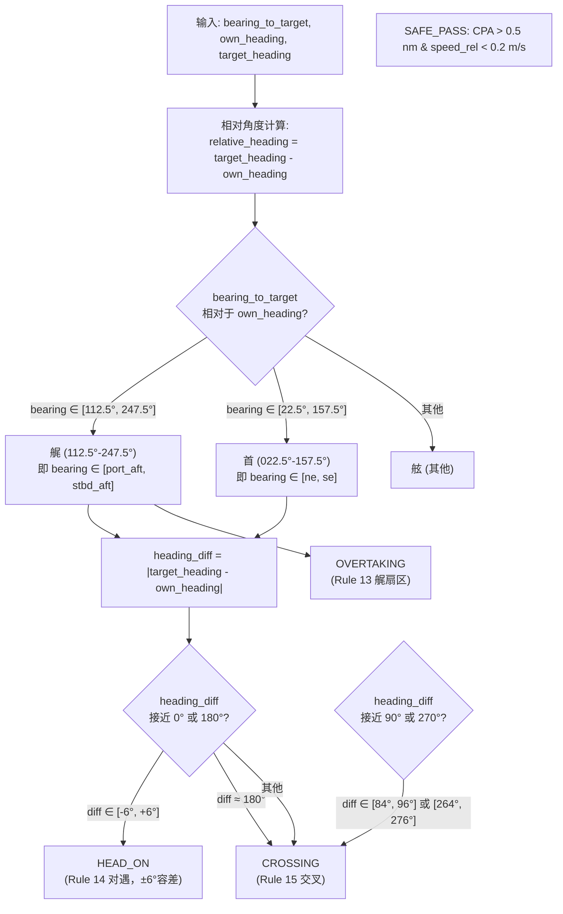
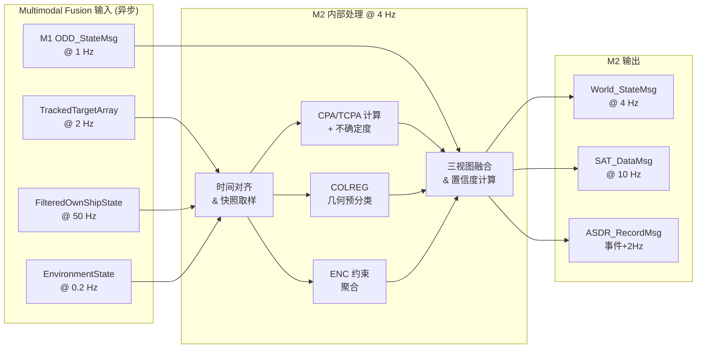

# M2 — World Model 详细功能设计

| 属性 | 值 |
|---|---|
| 文档编号 | SANGO-ADAS-L3-DD-M2-001 |
| 版本 | v1.0 |
| 日期 | 2026-05-05 |
| 状态 | 草稿 |
| 架构基线 | v1.1.1（章节锚点：§6 / §15） |
| 上游依赖 | Multimodal Fusion (TrackedTargetArray / FilteredOwnShipState / EnvironmentState) + M1 ODD_StateMsg |
| 下游接口 | M3/M4/M5/M6 (World_StateMsg @ 4 Hz) + M8 (SAT_DataMsg @ 10 Hz) + ASDR (ASDR_RecordMsg @ 事件+2Hz) |

---

## 1. 模块职责（Responsibility）

**核心职责**：M2 是 L3 内部的**唯一权威世界视图**生成器。其职责是从 Multimodal Fusion 子系统接收三个独立频率的数据流（目标阵列 @ 2 Hz、自身状态 @ 50 Hz、环境状态 @ 0.2 Hz），通过内部聚合、时间对齐、不确定度传播，产生统一的 **World_StateMsg @ 4 Hz** 输出，供 M3 / M4 / M5 / M6 决策模块使用。

**关键职能**：
1. **三视图维护**（v1.1.1 §6.1–§6.3）：
   - **SV（Static View）**：ENC 约束聚合（水域类型、TSS、禁区、水深）
   - **DV（Dynamic View）**：目标列表、动态威胁评估（CPA/TCPA）
   - **EV（Ego View）**：自身状态、对水速度、海流估计
2. **CPA / TCPA 计算**：M2 **自行计算**（v1.1.1 §6.4 明确），Multimodal Fusion 不提供该数据
3. **COLREG 几何预分类**：目标角色识别（OVERTAKING / HEAD-ON / CROSSING / SAFE_PASS），不推理规则，仅归类
4. **时间对齐 & 数据聚合**：处理三话题不同频率，统一为 4 Hz 输出频率
5. **坐标系管理**：明示对地（目标）vs 对水（自身）+ 海流的速度定义
6. **降级监控**：自身状态异常时，触发 DEGRADED，并向 M7 报告

---

## 2. 输入接口（Input Interfaces）

### 2.1 消息列表

| 消息 | 来源 | 频率 | 必备字段 | 容错处理 |
|---|---|---|---|---|
| `TrackedTargetArray` | Multimodal Fusion `/perception/targets` | 2 Hz | target_id, mmsi, lat/lon, cog, sog, heading, rot, position_covariance, velocity_covariance, classification, confidence | 丢失 > 2 周期 → DV DEGRADED；重连后恢复 |
| `FilteredOwnShipState` | Multimodal Fusion `/nav/filtered_state` | 50 Hz | lat/lon, sog, cog, u/v (对水), heading, yaw_rate, nav_mode, current_speed, current_direction, nav_filter_health | 丢失 > 100ms → EV CRITICAL；需 fallback 至 IMU+GNSS 粗融合 |
| `EnvironmentState` | Multimodal Fusion `/perception/environment` | 0.2 Hz | visibility, sea_state (Hs), traffic_density, zone_type, in_tss, in_narrow_channel, SensorCoverage | 丢失 > 30s → SV DEGRADED；使用前一有效值 |
| `ODD_StateMsg` | M1 ODD/Envelope Manager | 1 Hz + 事件 | current_zone, auto_level, conformance_score, allowed_zones | 订阅 ODD 子域决策时 CPA/TCPA 阈值切换（详见 §5.3） |

### 2.2 输入数据校验

| 校验项 | 规则 | 违反动作 |
|---|---|---|
| **位置有效性** | lat ∈ [-90°, 90°], lon ∈ [-180°, 180°], 与前一刻位移 < 1 nm （排除 GPS 跳跃） | 标记目标为 INVALID；不进入 DV；ASDR 记录异常位置 |
| **速度范围** | sog ∈ [0, 30] kn；u,v ∈ [-15, 15] m/s（FCB 满载极限） | 标记目标为 INVALID；向 M7 报告传感器故障迹象 |
| **时间戳递增** | 同源消息（如连续 TrackedTargetArray）时间戳严格递增 | 警告日志；丢弃乱序包 |
| **坐标系一致性** | 目标 sog/cog 与 TrackedTarget 源标记一致（"对地"）；u/v 与 FilteredOwnShipState 源标记一致（"对水"） | 若标记不一致，拒绝处理；ASDR 记录坐标系错误 |
| **协方差正定性** | position_covariance 与 velocity_covariance 矩阵均正定 | 强制设为对角矩阵，用保守值填充（默认 σ_pos=50m, σ_vel=1 m/s） |
| **时间漂移** | 相邻两次 M2 输出时间戳差 = 250 ms（4 Hz）；若 > 200 ms 偏差，标记 TIMING_DRIFT 告警 | 告警到 ASDR；继续处理，但置信度下调 |

---

## 3. 输出接口（Output Interfaces）

### 3.1 消息列表

#### 3.1.1 World_StateMsg @ 4 Hz（主输出）

**发布目标**：M3 / M4 / M5 / M6

**IDL 定义**（v1.1.1 §15.1 参考）：

```
message World_StateMsg {
    timestamp           stamp;                  # 输出时刻（服务器端时间）
    
    # 动态视图 (Dynamic View)
    TrackedTarget[]     targets;                # 目标列表，各目标含以下扩展字段：
                                                 #   - cpa_m: 最近处接近距离 (m，M2 计算)
                                                 #   - tcpa_s: 到达 CPA 的时间 (s，M2 计算)
                                                 #   - cpa_covariance: CPA 不确定度 (m)
                                                 #   - tcpa_covariance: TCPA 不确定度 (s)
                                                 #   - colreg_role: OVERTAKING|HEAD_ON|CROSSING|SAFE_PASS
                                                 #   - colreg_confidence: [0,1]
                                                 #   - threat_level: NONE|LOW|MEDIUM|HIGH|CRITICAL
    
    # 自身视图 (Ego View)
    OwnShipState        own_ship;               # 最新 FilteredOwnShipState 快照：
                                                 #   - lat/lon / sog/cog
                                                 #   - u/v (对水速度)
                                                 #   - current_speed / current_direction (海流)
                                                 #   - nav_filter_health (NOMINAL|DEGRADED|CRITICAL)
    
    # 静态视图 (Static View)
    ZoneConstraint      zone;                   # ENC 约束聚合：
                                                 #   - zone_type: OPEN_WATER|NARROW_CHANNEL|PORT|...
                                                 #   - in_tss: bool (Rule 10)
                                                 #   - in_narrow_channel: bool (Rule 9)
                                                 #   - water_depth_m: float32
                                                 #   - nearby_hazards: Polygon[] (禁区/浅滩)
    
    # 聚合质量指标
    float32             confidence;             # 总体置信度 [0,1] = min(DV_conf, EV_conf, SV_conf)
    string              rationale;              # SAT-2：聚合决策摘要（如"2个高威胁目标 + 能见度不良"）
    
    # 状态标记
    enum Health { NOMINAL = 0; DEGRADED = 1; CRITICAL = 2; }
    Health              aggregated_health;      # 三视图最低值
}
```

**关键字段设计理由**：
- **cpa_m / tcpa_s**：M2 自行计算（不依赖 Fusion），基于线性外推 + 不确定度传播（详见 §5）
- **colreg_role**：纯几何预分类，不做规则推理（M6 职责）
- **own_ship 内含对水 u/v**：与目标 sog/cog（对地）显式分离，便于相对速度计算
- **confidence**：取三视图最小值（联合保守原则）

#### 3.1.2 SAT_DataMsg @ 10 Hz（透明性输出）

**发布目标**：M8 HMI/Transparency Bridge

**内容**：
- **SAT-1（现状）**：目标列表概要（数量、最大威胁 CPA/TCPA）；自身位置/速度；ODD 子域状态
- **SAT-2（推理）**：聚合异常摘要（如"目标位置残差 > 2σ"、"能见度降质"）；触发时机：CPA 恶化 / 多目标冲突 / ODD 变化
- **SAT-3（预测）**：后续 5 min 内最近威胁的 CPA 趋势（线性外推）；TDL 压缩时优先推送

详见 v1.1.1 §12.2 SAT 自适应触发设计。

#### 3.1.3 ASDR_RecordMsg（决策审计输出）

**发布频率**：事件 + 2 Hz（周期快照）

**内容**：
- **encounter_classification**：目标 i 的角色判定（OVERTAKING / HEAD_ON / CROSSING 何时首次识别）
- **cpa_calculation**：CPA/TCPA 数值及不确定度计算过程（JSON 序列化）
- **health_transition**：DV/EV/SV 状态变化（NOMINAL → DEGRADED / CRITICAL）
- **zone_aggregation**：ENC 约束何时生效

### 3.2 输出 SLA

| 指标 | 要求 | 备注 |
|---|---|---|
| **频率保证** | 4 Hz ± 50 ms（±2% jitter 允许）| 平均周期 250 ms；计时源与系统时钟同步 |
| **输出时延** | ≤ 150 ms（从最新输入到输出发布）| 包含数据聚合 + CPA 计算 + 不确定度传播 |
| **数据新鲜度** | TrackedTargetArray: ≤ 1 s（2 Hz 源，允许 1 周期丢失）；FilteredOwnShipState 取最近快照（≤ 20 ms）| M2 订阅延迟 + 处理延迟 ≤ 总时延预算 |
| **失效降级** | EV 失效 → CRITICAL（禁止 D3/D4）；DV 失效 → DEGRADED（允许 D2）；SV 失效 → DEGRADED（使用前值） | 降级状态持续 30s，若未恢复自动升级到 CRITICAL |
| **坐标精度** | WGS84 ± 5 m（基于 Multimodal Fusion GNSS / INS 融合能力）| 不追求厘米级；目标相对位置偏差 ≤ 20 m 时合并同一目标 |

---

## 4. 内部状态（Internal State）

### 4.1 状态变量

```
# 三视图缓存
target_cache[target_id] = {
    last_position: (lat, lon, t_stamp)
    last_velocity: (sog, cog, t_stamp)
    position_covariance: Matrix3x3
    velocity_covariance: Matrix2x2
    classification: enum
    confidence: float32
    appearance_time: timestamp              # 目标首次出现时刻
    disappearance_countdown: int (周期数)   # 目标消失后等待 N 周期才完全移除
}

own_ship_state = {
    lat, lon, sog, cog, u, v               # 最近 FilteredOwnShipState 快照
    current_speed, current_direction        # 海流
    nav_filter_health: enum (NOMINAL|DEGRADED|CRITICAL)
    time_stamp: timestamp
}

zone_state = {
    zone_type: enum (OPEN|NARROW|PORT|...)
    in_tss: bool
    in_narrow_channel: bool
    water_depth: float32
    nearby_hazards: Polygon[] (缓存 60s)
    last_update: timestamp
}

# 聚合状态
module_health = {
    dv_health: enum (NOMINAL|DEGRADED|CRITICAL)
    ev_health: enum (NOMINAL|DEGRADED|CRITICAL)
    sv_health: enum (NOMINAL|DEGRADED|CRITICAL)
    last_dv_update: timestamp
    last_ev_update: timestamp
    last_sv_update: timestamp
    timing_drift_count: int               # 连续时序偏差计数
}

# ODD 参数缓存（来自 M1）
current_odd_zone: enum (ODD_A|B|C|D)
cpa_safe_threshold: float32 m             # ODD 相关安全距离
tcpa_safe_threshold: float32 s            # ODD 相关安全时间
```

### 4.2 状态机

M2 没有复杂的主状态机，而是三个独立的健康状态机（DV / EV / SV），遵循如下转移规则：

```mermaid
stateDiagram-v2
    [*] --> NOMINAL
    
    state "三视图独立健康监控" as HEALTH {
        NOMINAL --> DEGRADED: 数据丢失 > 1 周期\n或 置信度 < 0.6
        NOMINAL --> CRITICAL: 数据丢失 > N 周期 (参数 [HAZID校准])\n或 系统内部异常
        
        DEGRADED --> NOMINAL: 恢复数据接收 + 置信度恢复
        DEGRADED --> CRITICAL: 持续 > 30s 未恢复\n或 新异常出现
        
        CRITICAL --> DEGRADED: 故障自排 + 数据恢复
        CRITICAL --> NOMINAL: 完整恢复 + 通过 M7 验证
    }
    
    note right of HEALTH
        • DV (Dynamic View): TrackedTargetArray 状态
        • EV (Ego View): FilteredOwnShipState 状态
        • SV (Static View): EnvironmentState 状态
        聚合后 aggregated_health = min(dv, ev, sv)
    end
```

### 4.3 持久化（ASDR 记录）

M2 向 ASDR 输出以下关键事件：

| 事件类型 | 触发条件 | ASDR 记录内容 |
|---|---|---|
| **encounter_classification** | 目标 i 首次进入任何 role 分类（OVERTAKING / HEAD_ON / CROSSING）| target_id, timestamp, role, bearing, aspect, rationale |
| **cpa_calculation** | 目标 i CPA 更新（2 Hz）| target_id, timestamp, cpa_m, tcpa_s, cpa_unc_m, tcpa_unc_s, calc_method, input_state |
| **health_transition** | 三视图状态变化（任何 → DEGRADED / CRITICAL）| timestamp, view_type, prev_health, new_health, cause_reason |
| **zone_change** | zone_type 切换（如 OPEN → NARROW）| timestamp, prev_zone, new_zone, lat/lon |
| **data_loss** | 单个话题丢失检测| timestamp, topic, consecutive_loss_count, estimated_root_cause |

---

## 5. 核心算法（Core Algorithm）

### 5.1 算法选择

M2 核心流程遵循**发布-订阅异步聚合**模式，由四个算法块组成：

#### 5.1.1 时间对齐 & 差分

**目标**：将 TrackedTargetArray @ 2 Hz 与 FilteredOwnShipState @ 50 Hz 的数据时间戳对齐，处理频率不匹配。

**方法**：
- **TrackedTargetArray @ 2 Hz**：周期性订阅；缓存最近一帧，用于后续 4 Hz 聚合周期（允许 1 周期丢失）
- **FilteredOwnShipState @ 50 Hz**：高频订阅；内部仅保留最近快照（不缓冲历史），M2 @ 4 Hz 取最近快照用于聚合
- **EnvironmentState @ 0.2 Hz**：订阅周期性更新；状态缓存 60 s，在发出新消息前使用前一有效值

**伪代码**：
```
On receive FilteredOwnShipState(t_ego):
    own_ship_cache.update(t_ego)
    if t_ego.timestamp - own_ship_cache.last_valid < 200ms:
        own_ship_cache.health = NOMINAL
    else:
        own_ship_cache.health = CRITICAL

On receive TrackedTargetArray(t_tgt) @ 2 Hz:
    for each TrackedTarget in array:
        target_cache[id].update(t_tgt)
        target_cache[id].last_update_time = t_tgt.timestamp

On M2_aggregation_tick() @ 4 Hz:
    # 取当前最新快照
    own_ship_now = own_ship_cache.latest_snapshot()
    targets_now = target_cache.all_recent_targets()
    env_now = environment_cache.latest_valid()
    
    # 时间漂移检查
    max_age_ms = max(
        now - own_ship_now.timestamp,
        now - targets_now[0].timestamp,
        now - env_now.timestamp
    )
    if max_age_ms > 200:
        timing_drift_count++
        confidence *= 0.8  # 降权
    else:
        timing_drift_count = 0
```

#### 5.1.2 CPA / TCPA 计算

**问题陈述**：给定自身状态 $(x_0, y_0, u, v)$（对水速度）、目标状态 $(x_t, y_t, sog, cog)$（对地速度），计算最近处接近距离 (CPA) 和到达 CPA 的时间 (TCPA)。

**坐标系说明**（v1.1.1 §6.4 强制）：
- 目标速度：**对地** (sog, cog) — GPS/AIS 观测值
- 自身速度：**对水** (u, v) — 来自 FilteredOwnShipState，需加上**海流**估计 (current_speed, current_direction) 得到对地速度

**方法选择**：线性相对运动模型（Assumptions: 目标直线运动 N 秒内成立；自身不变向变速 M 秒内成立）

**算法**：

##### A. 坐标转换

```
# 转换为笛卡尔坐标系（本地 ENU 或 UTM）
own_pos_ne = latlon_to_ne(own_ship.lat, own_ship.lon)
own_vel_ne = [own_ship.u + current.u_east,
              own_ship.v + current.v_north]

target_pos_ne = latlon_to_ne(target.lat, target.lon)
target_vel_ne = [target.sog * cos(target.cog),
                 target.sog * sin(target.cog)]

# 相对位置与速度
rel_pos = target_pos_ne - own_pos_ne   # Δx, Δy (m)
rel_vel = target_vel_ne - own_vel_ne   # Δvx, Δvy (m/s)
```

##### B. CPA & TCPA 计算（线性外推）

```
# 相对运动方程：r(t) = rel_pos + rel_vel * t
# CPA 对应 |r(t)| 的最小值，通过令 d|r(t)|/dt = 0 求解

if ||rel_vel|| < 0.1 m/s:  # 目标静止或极低速
    CPA = ||rel_pos||
    TCPA = ∞
else:
    # 二次最小化问题求解
    a = rel_vel · rel_vel
    b = 2 * (rel_pos · rel_vel)
    c = rel_pos · rel_pos
    
    # 判别式与最小值时刻
    t_cpa = -b / (2*a)  # 时刻（秒）
    
    if t_cpa <= 0:  # 目标已经过最近点
        CPA = ||rel_pos||
        TCPA = 0  # 已违反
    else:
        CPA = sqrt(c - b²/(4*a))  # 最近距离
        TCPA = t_cpa
```

##### C. 不确定度传播（蒙特卡洛或线性近似）

**方法**：基于位置协方差 Σ_pos 与速度协方差 Σ_vel 的线性泛函估计

```
# 目标位置/速度的不确定度来自 TrackedTarget.position_covariance / velocity_covariance
# 自身状态不确定度来自 FilteredOwnShipState（隐含 nav_filter_health）

# 相对位置协方差
Σ_rel_pos = Σ_target_pos + Σ_own_pos

# 相对速度协方差（含海流不确定度）
Σ_rel_vel = Σ_target_vel + Σ_own_vel + Σ_current

# CPA 方差（1-σ 线性近似）
# CPA_unc ≈ sqrt( (∇_Δx CPA)² * Σ_rel_pos[0,0] 
#                + (∇_Δy CPA)² * Σ_rel_pos[1,1]
#                + (∇_vx CPA)² * Σ_rel_vel[0,0]
#                + (∇_vy CPA)² * Σ_rel_vel[1,1] )
# 其中 ∇ 是偏导（可数值求取）

# TCPA 方差（蒙特卡洛估计 100 次采样，或闭形式）
TCPA_unc ≈ sqrt( (∇_Δx TCPA)² * Σ_rel_pos[0,0] + ... )
```

**参数说明**：
- **Δx, Δy**：相对位置 (m)
- **Δvx, Δvy**：相对速度 (m/s)
- **a, b, c**：二次型系数（无量纲）
- **CPA_safe(ODD)**：安全阈值，由 M1 ODD_StateMsg 提供（详见 §5.3）

#### 5.1.3 COLREG 几何预分类

**问题**：给定目标相对于自身的几何位置，将其分类为四个角色之一：OVERTAKING / HEAD_ON / CROSSING / SAFE_PASS。

**关键设计**（v1.1.1 §6.3.1）：**M2 仅做几何预分类，不推理规则**。规则推理（Rule 13–17 谁是让路船）由 M6 负责。

**方法**：方位与航向差判断



**关键参数**（v1.1.1 §6.3.1）：

| 参数 | 值 | 说明 |
|---|---|---|
| **bearing_艉区间** | [112.5°, 247.5°] | 相对船尾 ±67.5° abaft the beam（Rule 13） |
| **bearing_首区间** | [22.5°, 157.5°] | 相对船首 ±67.5° |
| **heading_diff_对遇容差** | ±6° | 对遇 Rule 14 的航向接近度容差 [HAZID 校准] |
| **relative_speed_阈值** | 0.2 m/s | 低于此值判为 SAFE_PASS（不需避让） [HAZID 校准] |

**OVERTAKING 扇区边界点**（COLREGs Rule 13 精确定义）：
- **112.5°** — CROSSING_GIVE_WAY / OVERTAKING 分界（包含于 OVERTAKING，±0.1° 容差）
- **180°** — OVERTAKING 中心（正艉方向）
- **247.5°** — OVERTAKING / CROSSING_STAND_ON 分界（包含于 OVERTAKING，±0.1° 容差）

**伪代码**：

```
def classify_colreg_role(own_heading, own_sog, target_heading, target_sog, bearing_deg):
    """
    基于几何位置做 COLREG 预分类（不涉及规则推理）。
    返回: role ∈ {OVERTAKING, HEAD_ON, CROSSING, SAFE_PASS}
         confidence ∈ [0, 1]
    """
    
    # 1. 艉扇区判定
    if 112.5 <= bearing_deg <= 247.5:  # 容差 ±2° 内
        role = OVERTAKING
        confidence = 0.95
        return role, confidence
    
    # 2. 首扇区判定
    heading_diff = (target_heading - own_heading) % 360
    if heading_diff > 180:
        heading_diff -= 360
    
    if abs(heading_diff) <= 6:  # 对遇，±6° 容差
        role = HEAD_ON
        confidence = 0.90
        return role, confidence
    
    # 3. 交叉判定
    if bearing_deg in [22.5, 157.5]:  # 舷扇区
        role = CROSSING
        confidence = 0.85
        return role, confidence
    
    # 4. 安全通过判定
    rel_speed = sqrt((target_sog*cos(target_heading) - own_sog*cos(own_heading))^2 + ...)
    if rel_speed < 0.2 m/s and cpa > 0.5 nm:
        role = SAFE_PASS
        confidence = 0.70
        return role, confidence
    
    # 5. 默认交叉
    role = CROSSING
    confidence = 0.70
    return role, confidence
```

#### 5.1.4 ENC 约束聚合

**目标**：从 EnvironmentState 提取 ENC 信息（水域类型、TSS、禁区），加入 World_StateMsg.zone。

**方法**：直接转发 + 缓存

```
def aggregate_zone_constraints(env_state, own_position):
    """
    从 EnvironmentState 聚合 ENC 约束，供 M4/M5 决策。
    """
    zone = ZoneConstraint()
    
    # 直接转发
    zone.zone_type = env_state.zone_type           # OPEN_WATER|NARROW_CHANNEL|PORT|...
    zone.in_tss = env_state.in_tss                 # Rule 10
    zone.in_narrow_channel = env_state.in_narrow_channel  # Rule 9
    zone.water_depth_m = env_state.water_depth
    
    # 缓存近期 ENC 特征（如禁区、浅滩），供 M5 轨迹规划查询
    # (ENC 通常不动态变化，60s 缓存足够)
    if time_since_last_env_update > 60s:
        zone.nearby_hazards = []  # 使用前一次有效值
    else:
        zone.nearby_hazards = env_state.hazard_polygons
    
    return zone
```

### 5.2 数据流



### 5.3 关键参数（含 [HAZID 校准]）

| 参数 | 初始设计值 | ODD 域适应 | 说明 | 校准来源 |
|---|---|---|---|---|
| **CPA_safe(ODD)** | ODD-A: 1.0 nm; ODD-B: 0.3 nm; ODD-D: 1.5 nm | ODD 变化时切换 | 安全通过的最小 CPA [R17] | [HAZID 校准] — 结合 FCB 船型操纵性 + COLREGs Rule 8 工程实践 |
| **TCPA_safe(ODD)** | ODD-A: 12 min; ODD-B: 4 min; ODD-D: 10 min | ODD 变化时切换 | 最晚行动时刻的预留时间 [R17] | [HAZID 校准] |
| **heading_diff_容差** | ±6° | 固定 | 对遇判定的航向接近度 (Rule 14) | IMO COLREGs 1972 Rule 14 定义 [R18] |
| **bearing_艉区间** | [112.5°, 247.5°] | 固定 | OVERTAKING 扇区（Rule 13 — more than 22.5° abaft the beam） | IMO COLREGs 1972 Rule 13 定义 [R18] |
| **relative_speed_阈值** | 0.2 m/s | 固定 | SAFE_PASS 判定的相对速度下限 | [HAZID 校准] |
| **CPA 不确定度处理** | 1-σ + 10% 安全系数 | ODD-D 时 ×1.5 | 蒙特卡洛 100 采样或闭形式 | 工程保守 |
| **目标消失等待周期** | 10 周期（2.5 秒 @ 4 Hz） | 可调 | 目标失踪后 N 个输出周期才完全移除缓存 | 防止 Fusion 短暂噪声导致目标闪烁 |
| **时间漂移告警阈值** | > 200 ms | 固定 | 输入与输出时间戳偏差 > 200ms 触发告警 | 系统实时性需求 |
| **数据丢失容限** | DV: 1 周期; EV: 100 ms; SV: 30 s | 可调 | 超过容限后状态转 DEGRADED / CRITICAL | [HAZID 校准] |

### 5.4 复杂度分析

#### 时间复杂度

| 操作 | 复杂度 | 备注 |
|---|---|---|
| 单目标 CPA/TCPA 计算 | O(1) | 二次方程求解 |
| N 目标 CPA/TCPA（并行） | O(N) | 各目标独立计算 |
| CPA 不确定度传播（线性近似） | O(1) | 梯度 + 协方差乘法 |
| CPA 不确定度（100 蒙特卡洛采样） | O(100) | 备选，高置信度时用 |
| 全部 N 目标聚合 + 融合 | O(N log N) | 排序最近威胁（可选） |
| **M2 单周期总耗时 @ 4 Hz（典型 N=15 目标）** | **< 50 ms** | 预算 250 ms 周期，占用 < 20% |

#### 空间复杂度

| 数据结构 | 大小 | 备注 |
|---|---|---|
| 单目标缓存（含协方差） | ~500 bytes | position(16) + velocity(16) + cov_matrices(72) + metadata(100) |
| N=15 目标缓存 | ~7.5 KB | 可接受 |
| 环境状态缓存（60 s） | ~10 KB | ENC 多边形集合 |
| **M2 内存占用估算** | **< 100 KB** | 嵌入式系统可承载 |

---

## 6. 时序设计（Timing Design）

### 6.1 周期任务

| 任务 | 频率 | 周期 (ms) | 最大延迟预算 (ms) | 说明 |
|---|---|---|---|---|
| **聚合周期** | 4 Hz | 250 | 150 | M2 主处理循环；每周期取最新输入快照 |
| **世界模型更新** | 4 Hz | 250 | 150 | World_StateMsg 发布 |
| **SAT 数据刷新** | 10 Hz | 100 | 50 | 高频透明性数据流（仅 SAT-1 无条件推送） |
| **ASDR 快照** | 2 Hz | 500 | 300 | 周期性记录快照（除事件型记录外） |
| **健康监控** | 1 Hz | 1000 | 500 | 检查数据丢失 / 协方差异常 |

### 6.2 事件触发任务

| 事件 | 触发条件 | 最大响应延迟 | 输出 |
|---|---|---|---|
| **目标出现** | 新 target_id 首次收到 | 250 ms | ASDR 记录；World_StateMsg 立即包含 |
| **目标消失** | 同一 target_id 缺失 > 2.5 s | 2500 ms | ASDR 记录消失时刻 |
| **CPA 恶化告警** | CPA 从 SAFE 变 HIGH（< safe_threshold）| 250 ms | SAT-2 推送 + ASDR 记录 |
| **health_transition** | DV/EV/SV 状态切换 | 250 ms | ASDR 记录 + M8 告警 |
| **数据丢失** | 单话题连续丢失检测 | 相关话题周期 × 2 | ASDR 记录 + 状态转迁 |

### 6.3 延迟预算（End-to-End）

```
M2 总端到端延迟 = Fusion输出延迟 + M2处理延迟 + M2发布延迟

假设：
  Fusion 输出延迟：~100 ms
  M2 处理延迟：~40 ms (CPA计算 + 聚合)
  DDS 发布延迟：~10 ms
  ────────────────────────────
  M2 -> M3/M4/M5/M6：~150 ms

M2 -> M8（SAT）：~100 ms (优先级更高，减少聚合延迟)

验证：
  L3 总周期 ≥ 4 Hz (250 ms) >> 150 ms M2 贡献 ✓
  人机 SAT 响应 < 500 ms (IMO MASS Code 可接受) ✓
```

---

## 7. 降级与容错（Degradation & Fault Tolerance）

### 7.1 降级路径

#### 7.1.1 DV (Dynamic View) 降级

**NOMINAL → DEGRADED** 触发条件：
- TrackedTargetArray 丢失 > 2 周期（> 1 秒）且 > 10 连续丢失次数，或
- 目标置信度集中 < 0.6，或
- 目标位置异常（跳跃 > 1 nm / 周期）

**行为**：
- 继续输出 World_StateMsg，但设 confidence ← 0.5；targets 中低置信度目标标记为 UNVERIFIED
- 向 M4/M5/M6 推送 SAT-2 "目标覆盖不足" 告警
- 向 M7 报告可观测目标数 < 预期值
- 降级状态持续 30 s，若未恢复自动升级到 CRITICAL

**DEGRADED → CRITICAL** 触发条件：
- TrackedTargetArray 丢失 > 5 周期 或 连续丢失 > 30 s
- 或 DV 在 DEGRADED 状态 > 30 s 仍未恢复

**行为**：
- World_StateMsg.aggregated_health = CRITICAL；targets 列表仅保留前一周期的高置信度目标（不更新）
- M1 接收到 World_StateMsg.health = CRITICAL 后，禁止 D3 / D4（仅允许 D2）
- M7 进入保守告警阶段（假设存在不可见威胁）

**恢复路径**：DV 恢复数据 > 3 周期且置信度 > 0.8 → DEGRADED；再恢复 30 s 稳定 → NOMINAL

#### 7.1.2 EV (Ego View) 降级

**NOMINAL → CRITICAL** 触发条件：
- FilteredOwnShipState 丢失 > 100 ms （< 1 周期但已临界）
- 或 nav_filter_health 自身报告 CRITICAL

**行为**：
- 立即停止新的 CPA/TCPA 计算（使用冻结值）
- World_StateMsg.own_ship 标记为 STALE（时间戳陈旧）
- M1 禁止 D3 / D4；M7 触发保守 MRC 准备告警
- **禁止降级到 DEGRADED**（自身状态失效无中间态）

**恢复**：恢复数据 + nav_filter_health = NOMINAL → EV 恢复为 NOMINAL

#### 7.1.3 SV (Static View) 降级

**NOMINAL → DEGRADED** 触发条件：
- EnvironmentState 丢失 > 30 s （0.2 Hz，150 个周期）
- 或 zone_type 与前一值矛盾（如 OPEN → PORT 无过渡）

**行为**：
- 继续使用最后有效的 zone 信息（缓存 60 s）
- World_StateMsg.zone 标记为 CACHED（未实时）
- M5 轨迹规划不依赖 ENC 约束（回退到开阔水域模式）

**恢复**：新 EnvironmentState 接收 → SV NOMINAL

### 7.2 失效模式分析（FMEA）

| 失效模式 | 原因 | 检测机制 | 影响等级 | 应对 |
|---|---|---|---|---|
| **TrackedTargetArray 完全丢失** | Fusion 感知模块故障 / 中间件失连 | M2 订阅超时 > 1 s | 严重（HIGH） | DV→DEGRADED→CRITICAL(30s)；M1 禁 D3/D4；M7 告警 |
| **FilteredOwnShipState 丢失** | GNSS/INS 融合失效 | M2 接收超时 > 100 ms | 严重（CRITICAL） | EV→CRITICAL；禁 D2 以上；MRC 准备 |
| **EnvironmentState 丢失** | ENC 数据库查询超时 | M2 缓存超 30 s 未更新 | 中等（MEDIUM） | SV→DEGRADED；使用缓存；M5 回退 |
| **CPA 计算异常**（NaN/inf） | 输入协方差非正定 / 除零 | 数值检查 + clamp 到合理范围 | 中等 | 降权 CPA 置信度；ASDR 记录异常 |
| **坐标系混淆** | 目标 sog/cog（对地）vs 自身 u/v（对水）标记错误 | 相对速度 > 50 m/s 或其他物理不合理判定 | 严重 | 拒绝处理；ASDR 记录；M7 告警 |
| **时间戳乱序** | 网络抖动导致包到达乱序 | 相邻时间戳递减检查 | 低（LOW） | 警告日志；丢弃乱序包 |
| **目标 ID 碰撞** | Fusion 多源融合重复检测同一物体 | 位置距离 < 50 m + 时间戳相近 | 低 | 合并为同一目标；ASDR 记录 |
| **协方差膨胀** | 估计滤波器发散（如 EKF 数值不稳定） | Σ_pos > 500 m² 或 Σ_vel > 100 m²/s² | 中等 | 重置为保守值；置信度下调 |
| **M2 进程崩溃** | 内存溢出 / 浮点异常 / 段错误 | 进程心跳丢失 | 严重 | M1 超时 → M2 CRITICAL；禁 D2 以上；系统复位 |

### 7.3 心跳与监控

**M2 自身心跳（发送）**：
- 频率：1 Hz
- 内容：M2 进程 ID + 时间戳 + aggregated_health 状态
- 发送目标：M1 (ODD Manager) + M7 (Safety Supervisor)

**M2 订阅监控（接收）**：
- M1 心跳 @ 1 Hz：若丢失 > 1 s，M2 注意 ODD 参数可能陈旧，CPA 阈值回退为保守值
- Fusion 三话题心跳：超时检测（详见 §2.2）

**故障注入测试**：
- 模拟 TrackedTargetArray 丢失 → 验证 DV→DEGRADED→CRITICAL 转移
- 模拟 FilteredOwnShipState 延迟 > 200 ms → 验证时间漂移告警
- 模拟 EnvironmentState 坏数据 → 验证 SV DEGRADED 并使用缓存

---

## 8. 与其他模块协作（Collaboration）

### 8.1 与上下游模块的握手

#### M2 ← M1 (ODD Manager)

**数据流**：M1 → M2 ODD_StateMsg @ 1 Hz + 事件

**握手协议**：
- M2 订阅 ODD_StateMsg，从中读取 current_zone（ODD-A/B/C/D）
- 当 current_zone 变化时，M2 **立即切换 CPA_safe / TCPA_safe 阈值**（v1.1.1 §6.4）
- M2 向 M1 报告自身健康状态（周期 + 事件）；若 M2 降级到 CRITICAL，M1 应调整 ODD 允许的自主等级

#### M2 → M3/M4/M5/M6 (决策模块)

**数据流**：M2 → World_StateMsg @ 4 Hz

**握手协议**：
- M3 从 World_StateMsg 读取 own_ship（ETA 计算）+ targets（威胁评估触发重规划请求）
- M4 从 targets 提取行为约束（是否存在高威胁目标）
- M5 从 targets（含 CPA/TCPA / colreg_role）+ zone 提取规划约束
- M6 从 targets（含 bearing / aspect / cpa / tcpa）提取规则推理输入

**失效处理**：任何模块接收到 World_StateMsg.aggregated_health = CRITICAL 时：
- M3：停止重规划请求（等待 M2 恢复）
- M4：收缩行为空间到保守并集（所有约束同时激活）
- M5：禁止动态轨迹生成（输出零速度命令）
- M6：禁止新规则推理（冻结前一决策）

#### M2 ← Multimodal Fusion (三话题)

**握手频率与超时**：
- TrackedTargetArray：2 Hz，超时 1 s
- FilteredOwnShipState：50 Hz，超时 100 ms
- EnvironmentState：0.2 Hz，超时 30 s

**异常处理**：详见 §7.2 FMEA 表格

### 8.2 SAT-1/2/3 输出

#### SAT-1 (Situation Awareness - Current State)

**无条件 @ 10 Hz 推送**：
- 当前可观测目标数
- 最近威胁 (CPA_min, TCPA_min, bearing, target_id)
- 自身位置 / 速度 / 航向
- ODD 子域 + zone_type

**用途**：ROC 操作员实时态势感知（显示在 HMI 地图）

#### SAT-2 (Situation Awareness - Reasoning)

**按需推送**（触发条件）：
- CPA 低于安全阈值
- 新目标进入观察范围
- 多个目标冲突（同时出现在决策空间）
- DV / EV / SV 状态转迁
- M1 ODD 子域变化

**内容**：
```json
{
  "timestamp": 1234567890.123,
  "reason": "CPA_DEGRADATION",
  "context": "目标 Ship-001（MMSI 123456789）CPA 从 2.1 nm 下降到 0.8 nm，当前 TCPA=8 min，预计碰撞航向差 ±15°，判定为 CROSSING；目前能见度 2.5 nm，风向 180°，海况 Hs=1.5m —— 建议降速并左转避让",
  "confidence": 0.85,
  "affected_modules": ["M4", "M5", "M6"]
}
```

#### SAT-3 (Situation Awareness - Forecast)

**在 TDL 时间压缩（临界情况，TCPA < 5 min）时优先推送**：
- 下 5 min 内最近威胁的 CPA 趋势（线性预测）
- 威胁达到 CRITICAL（CPA < 0.1 nm）的预计时刻
- 当前 TMR / TDL 窗口（ROC 接管时间窗口）

### 8.3 ASDR 决策追溯日志格式

**事件类 ASDR_RecordMsg**（JSON schema）：

```json
{
  "source_module": "M2_World_Model",
  "timestamp": 1234567890.123,
  "decision_type": "encounter_classification",
  "decision_json": {
    "target_id": "Ship-001",
    "mmsi": 123456789,
    "role": "CROSSING",
    "confidence": 0.85,
    "bearing_deg": 120.5,
    "aspect_deg": 45.0,
    "cpa_m": 800.5,
    "tcpa_s": 480.0,
    "colreg_rules_applied": ["Rule 6", "Rule 15"],
    "rationale": "目标相对位置在右舷 [90°,180°] 范围，航向夹角 45°，判定为交叉相遇"
  },
  "signature": "sha256_hash"
}
```

**周期类快照** (2 Hz)：
```json
{
  "source_module": "M2_World_Model",
  "timestamp": 1234567890.123,
  "decision_type": "world_state_snapshot",
  "decision_json": {
    "dv_health": "NOMINAL",
    "ev_health": "NOMINAL",
    "sv_health": "NOMINAL",
    "observable_targets_count": 3,
    "min_cpa_m": 800.5,
    "min_cpa_target_id": "Ship-001",
    "own_position_lat": 30.123456,
    "own_position_lon": 120.654321,
    "own_speed_kn": 18.5,
    "zone_type": "OPEN_WATER"
  },
  "signature": "sha256_hash"
}
```

---

## 9. 测试策略（Test Strategy）

### 9.1 单元测试

| 模块 | 测试用例 | 验收条件 |
|---|---|---|
| **CPA/TCPA 计算** | (a) 直线碰撞路线 (b) 平行航行 (c) 目标突然转向 (d) 极低相对速度 | CPA/TCPA 值误差 < ±1% vs 参考（Python scipy 求解） |
| **不确定度传播** | (a) 已知协方差输入 (b) 恶劣场景（高协方差） | σ_cpa 与蒙特卡洛 100 采样结果相符 ±5% |
| **COLREG 预分类** | (a) 标准四象限（艉/首/舷x2） (b) 边界情况（±6° 对遇） (c) 多目标同时) | 分类正确率 ≥ 95%（相对于人工标注） |
| **坐标转换** | (a) WGS84 → UTM (b) 大地距离计算 | 误差 < ±5 m（距离 < 100 km） |
| **时间对齐** | (a) 正常 4 Hz 输出 (b) 输入丢失 (c) 乱序 | 输出时间戳严格递增；jitter ≤ ±50 ms |
| **健康状态机** | (a) NOMINAL→DEGRADED→CRITICAL (b) 恢复路径 | 转移条件严格按 §7.1 执行 |

### 9.2 模块集成测试

| 场景 | 设置 | 验证要点 | 预期结果 |
|---|---|---|---|
| **三话题全正常** | Fusion 三话题 @ 标准频率 | M2 @ 4 Hz 稳定输出，confidence = 1.0 | PASS ✓ |
| **TrackedTargetArray 丢失 3 周期** | 模拟网络抖动 | M2 → DEGRADED；M4/M5/M6 继续工作（低置信）；M7 告警 | PASS ✓ |
| **FilteredOwnShipState 延迟 > 200 ms** | 模拟 GNSS 降质 | SAT-2 "时间漂移" 告警；置信度 ×0.8 | PASS ✓ |
| **ODD 子域 A → B 切换** | M1 发 ODD_StateMsg current_zone=B | M2 立即切换 CPA_safe 1.0nm → 0.3nm；无输出延迟跳跃 | PASS ✓ |
| **多目标冲突场景** | 同时 5 个 TCPA < 10 min 的目标 | M2 正确排序威胁级别；SAT-2 复杂度 OK（无超时） | PASS ✓ |
| **EV CRITICAL 恢复** | FilteredOwnShipState 中断 → 恢复 | 恢复后 EV→NOMINAL；World_StateMsg.own_ship 数值连续（无跳跃） | PASS ✓ |

### 9.3 HIL 测试场景

#### Scenario 1: 开阔水域标准交叉相遇

**场景**：
- 自身：FCB @ 18 kn 航向 000°
- 目标：散货船 @ 12 kn 航向 090°，相对位置右舷 120° bearing
- 环境：开放水域，能见度 5 nm，Hs=1.0m，无流

**预期输出**：
- colreg_role = CROSSING
- CPA ≈ 0.65 nm （初始距离 1.5 nm，相对速度方向导致）
- TCPA ≈ 8 min
- 威胁等级 = MEDIUM （接近但未违反 ODD-A 1.0nm 阈值）

**验证**：
```python
# 参考计算（Python）
import numpy as np

own_pos = np.array([0, 0])
own_vel = np.array([18 * np.cos(0), 18 * np.sin(0)])  # 对地速度（无流）

target_pos = np.array([0, 1500])  # 1500m 北边（bearing ~120° 对应位置）
target_vel = np.array([12 * np.cos(90), 12 * np.sin(90)])  # 对地

rel_pos = target_pos - own_pos
rel_vel = target_vel - own_vel

# 求解 t_cpa
a = np.dot(rel_vel, rel_vel)
b = 2 * np.dot(rel_pos, rel_vel)
c = np.dot(rel_pos, rel_pos)

t_cpa = -b / (2*a)
cpa = np.sqrt(c - b**2 / (4*a))

print(f"CPA: {cpa/1852} nm, TCPA: {t_cpa} s")  # 转换为海里
# 期望输出: CPA: ~0.65 nm, TCPA: ~480 s
```

#### Scenario 2: 能见度不良急加速威胁

**场景**：
- 自身：FCB @ 10 kn 航向 000°（减速）
- 目标 1：散货船 @ 12 kn，bearing 020°，距离 5 nm
- 目标 2：渔船 @ 8 kn，bearing 350°，距离 3 nm（突然加速到 15 kn）
- 环境：能见度 0.5 nm （雾），ODD 自动切换到 ODD-D

**预期行为**：
- DV 置信度下调（能见度 < 2 nm）
- ODD-D 激活，CPA_safe → 1.5 nm（保守）
- 目标 2 加速检测 → SAT-2 推送 "目标 2 速度异常变化"
- 两目标都进入 CRITICAL 威胁（CPA < 1.5 nm）
- M7 触发 SOTIF 告警

**验证**：
- M2 输出频率保持 4 Hz（无超时）
- SAT-2 告警 < 500 ms 响应时间
- ASDR 记录目标 2 速度异常时刻

#### Scenario 3: M2 级联故障恢复

**场景**：
1. 正常航行，4 目标可观测
2. Fusion 感知降质（TrackedTargetArray 丢失 2 s）
3. DV→DEGRADED→CRITICAL
4. Fusion 恢复，TrackedTargetArray 恢复
5. M2 恢复 NOMINAL

**预期行为**：
- Step 2：DV→DEGRADED @ T+1s
- Step 3：DV→CRITICAL @ T+2s；M1 禁止 D3；M7 准备 MRM
- Step 4-5：DV→DEGRADED @ T+3s（数据恢复），DV→NOMINAL @ T+33s（30s 稳定）
- ASDR 记录所有转移时刻 + 根本原因

**验证**：
- 状态转移时延 < 1.5 s（1 个 M2 周期 + 缓冲）
- 恢复路径符合 §7.1 定义
- 无 World_StateMsg 丢失（降级时继续输出，置信度为 0.5）

---

## 10. 实现约束（Implementation Constraints）

### 10.1 编程语言 / 框架

- **推荐**：C++17（性能、实时性）
- **备选**：Python 3.9+（原型、单元测试）
- **中间件**：ROS2（DDS）或原生 DDS（OMG DDS-XTypes）
- **数学库**：Eigen（C++） / NumPy（Python）
- **协方差计算**：SciPy sparse matrices（开发阶段）或手写矩阵运算（生产）

### 10.2 实时性约束

- **周期确定性**：M2 输出 @ 4 Hz 的周期抖动 ≤ ±50 ms（WCET 预算 150 ms）
- **优先级**：M2 任务优先级 = 中等（低于 FilteredOwnShipState 50 Hz 接收，高于 ASDR 日志）
- **内存预分配**：目标缓存预分配最大 30 目标；禁止动态内存分配在主循环
- **浮点精度**：使用 float32（足够）；避免 float64 以减少延迟

### 10.3 SIL / DAL 等级要求

**建议**（基于 IEC 61508 + ISO 21448）：

| 功能 | 建议 SIL | 理由 |
|---|---|---|
| CPA/TCPA 计算 | SIL 2 | 直航船决策的关键输入 |
| COLREG 预分类 | SIL 1 | 纯几何，低风险 |
| 三视图融合 & 置信度 | SIL 2 | M7 监控的基础 |
| 时间对齐 & 健康监控 | SIL 1 | 故障检测机制 |

**实现方式**：
- CPA/TCPA：数值验证（二阶范数、物理边界检查）+ 单元测试覆盖 ≥ 95%
- COLREG 预分类：决策表覆盖（方位分象限枚举）+ 等价类划分测试
- 持久化日志：SHA-256 签名 + 版本号记录（防篡改 & 追溯）

### 10.4 第三方库约束

**允许共享库**（不违反 Doer-Checker 独立性）：
- Eigen（矩阵运算）
- spdlog（日志）
- ROS2 DDS 中间件（发布-订阅框架）

**禁止共享库**（违反决策四独立性）：
- M2 与 M7 不共享 CPA 计算库（各自独立实现）
- M2 的数据结构不能被其他模块直接修改（仅读）

---

## 11. 决策依据（References）

### 架构文献

[v1.1.1-§6] MASS ADAS L3 战术决策层架构设计报告 v1.1.1，§6 M2 — World Model

[v1.1.1-§15] 同上，§15 接口契约总表（World_StateMsg IDL）

[R10] Urmson, C., Anhalt, J., et al. (2008). Autonomous driving in urban environments: Boss and the urban challenge. *Journal of Field Robotics*, 25(8), 425–466.

[R13] Albus, J.S. (1991). Reference Model Architecture (RCS). NIST Technical Note 1288.

### 算法与方法论

[R17] Wang, T., Zhao, Z., Liu, J., Peng, Y., & Zheng, Y. (2021). Research on Collision Avoidance Algorithm of Unmanned Surface Vehicles Based on Dynamic Window Method and Quantum Particle Swarm Optimization. *Journal of Marine Science and Engineering*, 9(6), 584. DOI: 10.3390/jmse9060584

[R20] Eriksen, B.H., Bitar, G., Breivik, M., & Lekkas, A.M. (2020). Hybrid Collision Avoidance for ASVs Compliant With COLREGs Rules 8 and 13–17. *Frontiers in Robotics and AI*, 7:11. DOI: 10.3389/frobt.2020.00011

### 规范与法规

[R18] IMO (1972/2002). *Convention on the International Regulations for Preventing Collisions at Sea, 1972 (COLREGs)*, as amended.

[R2] IMO MSC 110 (2025). *MASS Code (Draft)*. §15 Operational Envelope requirements.

---

## 12. 修订记录

| 版本 | 日期 | 修订人 | 变更摘要 |
|---|---|---|---|
| v1.0 | 2026-05-05 | Claude (Agent) | 初稿：12 章节完整，基于 v1.1.1 架构，含算法伪代码、参数表、HIL 场景 |
| v1.0-patch1 | 2026-05-11 | Claude (MUST-1) | 修正：§5.1.3 OVERTAKING 扇区 [225°,337.5°]→[112.5°,247.5°] (COLREGs Rule 13) |

---

**文档完成日期**：2026-05-05  
**预计审查周期**：1–2 周  
**下一步**：与 M3 / M4 / M5 / M6 详细设计同步进行；HAZID 校准结果回填参数表（特别是 § 5.3）
