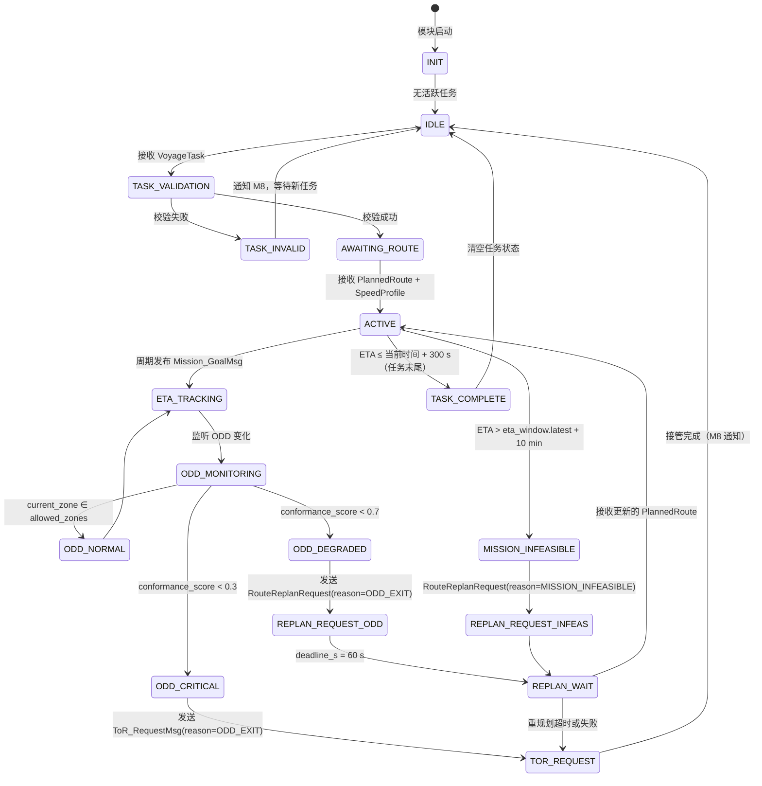

# M3 Mission Manager 详细功能设计

| 属性 | 值 |
|---|---|
| 文档编号 | SANGO-ADAS-L3-DD-M3-001 |
| 版本 | v1.0 |
| 日期 | 2026-05-05 |
| 状态 | 草稿 |
| 架构基线 | v1.1.1（§7 M3 + §15 接口） |
| 上游依赖 | L1 VoyageTask + L2 PlannedRoute/SpeedProfile + M1 ODD_StateMsg + M2 World_StateMsg |
| 下游接口 | M4 Mission_GoalMsg + L2 RouteReplanRequest + M8 ToR_RequestMsg + ASDR_RecordMsg |

---

## 1. 模块职责（Responsibility）

M3 Mission Manager 是 **L3 内部对 L1 任务令的局部跟踪 + 重规划触发器**（v1.1.1 §7.1）。其核心职责包括：

1. **任务令有效性看门人**：接收 L1 VoyageTask，校验合法性（目标可达、ETA 时间窗口、排斥区冲突）
2. **ETA 投影**：基于当前位置、计划路径、当前速度，投影到目标航点的到达时间
3. **重规划请求触发**：当 ODD 越界、任务不可行或 MRC 触发时，向 L2 发起 RouteReplanRequest
4. **速度建议发布**：向 M4/M5 发布 Mission_GoalMsg，含当前目标航点、ETA、推荐速度

**关键边界**：
- M3 **不做航次规划**（属 L1 Mission Layer 职责，v1.1.1 §7.1）
- M3 **不做避碰决策**（属 M4/M5/M6 职责）
- M3 **不本地重规划**，仅向 L2 请求，由 L2 完成并回报 PlannedRoute 更新（v1.1.1 §7.2）

---

## 2. 输入接口（Input Interfaces）

### 2.1 消息列表

| 消息 | 来源 | 频率 | 必备字段 | 容错处理 |
|---|---|---|---|---|
| **VoyageTask** | L1 Voyage Order | 事件 | departure, destination, eta_window, optimization_priority, mandatory_waypoints, exclusion_zones | 若超时 60s 未更新，触发 ToR（ODD_EXIT）；非法字段拒绝 + 通知 M8 |
| **PlannedRoute** | L2 WP_Generator | 1 Hz / 事件 | waypoints[], turn_radius, safety_corridor | 若 PlannedRoute 与 VoyageTask destination 不一致，标记警告 + ASDR 日志；超时 3s 降级为 ETA 不可用 |
| **SpeedProfile** | L2 Speed_Profiler | 1 Hz / 事件 | phase[], speed_kn[], segment_duration_s | 同 PlannedRoute 超时处理 |
| **ODD_StateMsg** | M1 ODD/Envelope Manager | 1 Hz + 事件 | current_zone (ODD_A/B/C/D), allowed_zones, conformance_score | 若 current_zone ∉ allowed_zones，触发 REPLAN_ODD_EXIT（v1.1.1 §7.2） |
| **World_StateMsg** | M2 World Model | 4 Hz | own_ship (lat/lon/heading/sog), targets[], zone (zone_type, in_narrow_channel) | 用于 ETA 投影计算；若 confidence < 0.5，降级 ETA 为估算值（含低置信标记） |

### 2.2 输入数据校验

#### VoyageTask 校验规则

```
1. 时间戳：必须 ≤ 当前系统时间
2. Departure 位置：
   - 若与当前自船位置距离 > 2 km，拒绝（假设离港前仅能修改目标）
3. Destination 位置：
   - 格式：WGS84 小数度 (lat ∈ [-90, 90], lon ∈ [-180, 180])
   - 范围：必须在已知海域（ENC 覆盖范围内）
4. ETA Window [earliest, latest]：
   - earliest ≥ 当前时间
   - latest > earliest
   - latest - earliest ≥ 10 min（缓冲余量）
   - latest ≤ earliest + 72 hrs（航次上限 3 天）
5. Mandatory Waypoints：
   - 必须按航向顺序递增（检查叉积符号）
   - 任意两航点距离 < 50 nm（合理航段长度）
6. Exclusion Zones：
   - 每个多边形 ≥ 3 个顶点
   - 不与 departure 位置重合（缓冲 500 m）
7. Optimization Priority：
   - 枚举值：{fuel_optimal | time_optimal | balanced}
8. Special Restrictions：
   - 自由文本；长度 ≤ 256 字符
```

若任何字段不符，M3 生成 ASDR_RecordMsg（decision_type=VoyageTask_rejected，含原因）并通知 M8：
```
M3 → M8: ToR_RequestMsg {
  reason: ODD_EXIT 或 MANUAL_REQUEST（用户干预）
  context_summary: "[M3] 任务令非法：<原因摘要>"
}
```

#### PlannedRoute 与 VoyageTask 一致性检查

- destination 匹配：PlannedRoute 末尾航点与 VoyageTask.destination 距离 < 100 m
- 若不匹配，标记警告日志，但**不拒绝**（允许 L2 正在重规划中）

#### 超时与缺失处理

| 消息 | 超时阈值 | 降级行为 |
|---|---|---|
| PlannedRoute | 3 s | ETA 不可用；Mission_GoalMsg.eta_to_target_s = -1；speed_recommend_kn 维持上一值 |
| SpeedProfile | 3 s | speed_recommend_kn = 当前 SOG；发出 ASDR 警告 |
| ODD_StateMsg | 1 s | 假设 ODD 不变（维持上一 current_zone）；confidence 标记为 low |
| World_StateMsg | 0.5 s | ETA 投影不更新；使用外推位置 + 上一航向 |

---

## 3. 输出接口（Output Interfaces）

### 3.1 消息列表

| 消息 | 订阅者 | 频率 | 关键字段 | 触发条件 |
|---|---|---|---|---|
| **Mission_GoalMsg** | M4 Behavior Arbiter | 0.5 Hz | current_target_wp, eta_to_target_s, speed_recommend_kn, confidence | 周期性发布；ETA 变化 > 5% 时事件触发 |
| **RouteReplanRequest** | L2 Voyage Planner | 事件 | reason (ODD_EXIT\|MISSION_INFEASIBLE\|MRC_REQUIRED\|CONGESTION), deadline_s, context_summary | ODD 越界、MRC 触发、任务不可行时 |
| **ToR_RequestMsg** | M8 HMI/Transparency Bridge | 事件 | reason (ODD_EXIT\|MANUAL_REQUEST\|SAFETY_ALERT), deadline_s, context_summary | 任务令无效、ODD 不可恢复时 |
| **ASDR_RecordMsg** | ASDR | 事件 + 2 Hz 心跳 | source_module=M3, decision_type, decision_json | 每次任务令校验、ETA 异常、重规划触发时 |

#### Mission_GoalMsg 详细规范

```idl
message Mission_GoalMsg {
    timestamp    stamp;
    Position     current_target_wp;       # WGS84 (lat, lon)
    float32      eta_to_target_s;         # 秒；若不可用则 -1
    float32      speed_recommend_kn;      # 建议速度（来自 L2 SpeedProfile）
    float32      confidence;              # [0, 1]；基于 World_StateMsg + PlannedRoute 新鲜度
    string       rationale;               # SAT-2：ETA 计算摘要（如距离、时间、海流影响）
}
```

**ETA 计算逻辑**：见 §5.2 数据流。

### 3.2 输出 SLA

| 指标 | 目标值 | 说明 |
|---|---|---|
| **Mission_GoalMsg 周期延迟** | ≤ 200 ms | 从 M2 World_StateMsg 到发布 Mission_GoalMsg 的延迟 |
| **RouteReplanRequest 响应时间** | ≤ 500 ms | ODD 越界事件 → 重规划请求发送的延迟 |
| **ETA 投影精度** | ±5% @ 30 min horizon | 在稳定航速下的 ETA 误差 |
| **数据新鲜度** | M2 输入 ≤ 500 ms 陈旧 | Mission_GoalMsg 中不使用 > 500 ms 旧的 World_StateMsg |

---

## 4. 内部状态（Internal State）

### 4.1 状态变量

```python
class M3_InternalState:
    # 任务令管理
    active_voyage_task: Optional[VoyageTask]          # 当前有效任务
    voyage_task_timestamp: Optional[float]             # 最后接收时刻
    task_validation_status: Enum[VALID|INVALID|EXPIRED] # 任务有效性
    
    # 路径跟踪
    planned_route: Optional[PlannedRoute]             # L2 下发的航点序列
    planned_route_timestamp: float                    # 最后接收时刻
    current_wp_index: int                             # 当前航点索引 [0, len-1]
    
    # 速度曲线
    speed_profile: Optional[SpeedProfile]             # L2 下发的速度曲线
    speed_profile_timestamp: float
    
    # ETA 投影状态
    last_eta_projection: dict {
        "projected_eta_timestamp": float,             # 投影计算时刻
        "eta_to_target_s": float,                     # 投影 ETA（秒）
        "eta_confidence": float ∈ [0, 1],             # 投影置信度
        "calculation_method": Enum[ANALYTICAL|INTERPOLATED|EXTRAPOLATED],
        "world_state_input_age_s": float              # 使用的 World_StateMsg 陈旧度
    }
    
    # ODD 监听
    last_odd_state: Optional[ODD_StateMsg]
    last_odd_zone: Optional[ODD_Zone]                 # ODD_A|ODD_B|ODD_C|ODD_D
    odd_conformance_score: float ∈ [0, 1]
    
    # 重规划管理
    active_replan_request: Optional[RouteReplanRequest] # 当前待处理重规划请求
    replan_request_timestamp: Optional[float]
    replan_attempt_count: int                          # 重规划重试次数
    replan_last_reason: Optional[Enum]                 # ODD_EXIT|MISSION_INFEASIBLE|...
    
    # 容错状态
    world_state_timeout_count: int                    # World_StateMsg 超时计数
    planned_route_timeout_count: int
    odd_state_timeout_count: int
    
    # ASDR 追溯
    last_asdr_record_timestamp: float                 # 最后记录时刻
```

### 4.2 状态机



**状态转移条件**：
- NORMAL → DEGRADED：conformance_score ∈ [0.3, 0.7)，允许 1 次缓冲周期（1 s）后转移
- DEGRADED → CRITICAL：conformance_score < 0.3，立即转移 + 事件触发
- REPLAN_WAIT 超时：deadline_s 倒计时，若未收到新 PlannedRoute，触发 TOR_REQUEST

### 4.3 持久化（ASDR 记录）

以下状态变化必须记录为 ASDR_RecordMsg：

| 事件 | ASDR decision_type | 记录内容 |
|---|---|---|
| VoyageTask 接收 & 校验 | VoyageTask_received | {task_id, departure, destination, eta_window, valid/invalid} |
| PlannedRoute 接收 | PlannedRoute_received | {route_id, wp_count, dest_mismatch_flag} |
| ETA 异常 | ETA_anomaly | {old_eta, new_eta, delta_percent, world_state_age} |
| ODD 越界事件 | ODD_exit_detected | {old_zone, new_zone, conformance_score} |
| 重规划请求发送 | replan_request_sent | {reason, deadline_s, context} |
| 重规划超时 | replan_timeout | {attempt_count, last_deadline} |
| 任务完成 | mission_complete | {destination, actual_eta, plan_eta, delta} |

decision_json 格式（JSON）：
```json
{
  "module": "M3",
  "timestamp_utc": "2026-05-05T12:34:56Z",
  "event_type": "<decision_type>",
  "details": {
    "task_id": "...",
    "voyage_task": { ... },
    "planned_route": { "wp_count": ..., "dest_mismatch": ... },
    "eta_projection": { "distance_m": ..., "eta_s": ... },
    "odd_state": { "zone": "ODD_A", "conformance": 0.95 },
    "replan_request": { "reason": "ODD_EXIT", "deadline_s": 60 }
  }
}
```

---

## 5. 核心算法（Core Algorithm）

### 5.1 算法选择

M3 的核心是三个独立的子算法：

1. **任务令校验**：确定性有限状态机（FSM）+ 几何校验
2. **ETA 投影**：分段线性路径积分（Piecewise Linear Path Integration）
3. **重规划触发**：ODD 状态监听 + 条件判断树

这些算法均为确定性、无机器学习、白盒可审计，满足 IEC 61508 + CCS 入级要求。

### 5.2 数据流

```
┌─────────────────────────────────────────────────────────────┐
│                        M3 Mission Manager                     │
└─────────────────────────────────────────────────────────────┘

输入数据源：
  L1 VoyageTask ─┐
                 ├──→ [§5.3.1 任务令校验]
  L2 PlannedRoute─┘    ↓ VALID / INVALID

                       ├─→ [INVALID] → M8 ToR_RequestMsg
                       │
                       └─→ [VALID]
                            ↓
              ┌─────────────────────────────────┐
              │  维护内部状态：                   │
              │  • active_voyage_task            │
              │  • current_wp_index              │
              │  • planned_route                 │
              └─────────────────────────────────┘
                            ↓
  M2 World_StateMsg ────→ [§5.3.2 ETA 投影算法]
  L2 SpeedProfile  ────→    ↓
  L2 PlannedRoute  ────→    ├─→ ETA 计算结果
                            │
                            └─→ Mission_GoalMsg @ 0.5 Hz
                                {current_target_wp, 
                                 eta_to_target_s,
                                 speed_recommend_kn}
                                 
  M1 ODD_StateMsg ─────→ [§5.3.3 ODD 状态监听]
                            ↓
                            ├─→ conformance_score < 0.7?
                            │   ├─ YES → RouteReplanRequest
                            │   │         (reason=ODD_EXIT)
                            │   └─ NO  → continue
                            │
                            └─→ conformance_score < 0.3?
                                ├─ YES → ToR_RequestMsg
                                └─ NO  → continue

ASDR 记录：
  所有转移、异常 → ASDR_RecordMsg @ 事件驱动 + 2 Hz 心跳
```

### 5.3 关键参数

#### 5.3.1 任务令校验流程

```python
def validate_voyage_task(voyage_task: VoyageTask) -> (bool, str):
    """
    返回: (is_valid, rejection_reason)
    """
    # 1. 时间戳检查
    if voyage_task.stamp > current_time:
        return False, "timestamp_in_future"
    
    # 2. Departure 位置检查
    if distance(current_position, voyage_task.departure) > 2 km:
        return False, "departure_too_far"
    
    # 3. Destination 位置检查（格式 + ENC 范围）
    if not is_valid_wgs84(voyage_task.destination):
        return False, "invalid_destination_coordinates"
    if not enc_covers(voyage_task.destination):
        return False, "destination_out_of_enc_coverage"
    
    # 4. ETA Window 检查
    earliest, latest = voyage_task.eta_window
    if earliest < current_time:
        return False, "eta_earliest_in_past"
    if latest <= earliest:
        return False, "eta_window_inverted"
    if (latest - earliest) < 600:  # 10 min
        return False, "eta_window_too_narrow"
    if (latest - earliest) > 259200:  # 72 hrs
        return False, "eta_window_too_long"
    
    # 5. Mandatory Waypoints 顺序检查
    if len(voyage_task.mandatory_waypoints) > 0:
        for i in range(len(voyage_task.mandatory_waypoints) - 1):
            wp_curr = voyage_task.mandatory_waypoints[i]
            wp_next = voyage_task.mandatory_waypoints[i + 1]
            # 检查叉积符号（确保转向不反向）
            if cross_product_sign_changes(wp_curr, wp_next):
                return False, "waypoint_order_invalid"
            # 检查距离合理性
            if distance(wp_curr, wp_next) > 50 * 1852:  # 50 nm in meters
                return False, "waypoint_distance_excessive"
    
    # 6. Exclusion Zones 检查
    for zone in voyage_task.exclusion_zones:
        if len(zone.vertices) < 3:
            return False, "exclusion_zone_invalid_polygon"
        if point_in_polygon(voyage_task.departure, zone):
            return False, "exclusion_zone_conflicts_departure"
    
    # 7. Optimization Priority 枚举检查
    if voyage_task.optimization_priority not in ["fuel_optimal", "time_optimal", "balanced"]:
        return False, "invalid_optimization_priority"
    
    return True, ""
```

**参数注解**：
- Departure 距离阈值 = 2 km [HAZID 校准]
- ETA 时间窗口下限 = 10 min [HAZID 校准]
- ETA 时间窗口上限 = 72 hrs [运营约束]
- Mandatory Waypoint 最大间距 = 50 nm [海图精度]

#### 5.3.2 ETA 投影算法（Piecewise Linear Path Integration）

**输入**：
- `current_position` (lat, lon)：当前自船位置
- `planned_route.waypoints[]`：L2 下发的航点序列
- `world_state.own_ship`：当前速度、航向
- `speed_profile`：L2 下发的速度曲线（含各航段加速/巡航/减速）

**输出**：
- `eta_to_target_s`：到达目标航点的秒数
- `confidence`：ETA 置信度 [0, 1]

**算法步骤**：

```python
def project_eta(current_pos, planned_route, world_state, speed_profile):
    """
    分段线性 ETA 投影。
    
    [HAZID 校准]: 
    - sea_current_uncertainty = ±0.3 kn
    - forecast_horizon_max = 3600 s (1 hour)
    - sampling_interval = 60 s
    """
    
    # Step 1: 确定当前航段
    remaining_wps = []
    current_dist_to_next = distance(current_pos, planned_route.waypoints[0])
    
    for i, wp in enumerate(planned_route.waypoints):
        dist = distance(current_pos, wp)
        if dist < 50:  # 50m 阈值，认为已到达
            remaining_wps = planned_route.waypoints[i+1:]
            break
        else:
            remaining_wps.append(wp)
    
    if not remaining_wps:
        return -1, 0.0  # 已到达或无航点
    
    # Step 2: 计算剩余路径总距离
    total_distance_m = distance(current_pos, remaining_wps[0])
    for i in range(len(remaining_wps) - 1):
        total_distance_m += distance(remaining_wps[i], remaining_wps[i+1])
    
    # Step 3: 关键参数提取
    current_sog_kn = world_state.own_ship.sog
    current_heading = world_state.own_ship.heading
    sea_current_estimate = estimate_sea_current(world_state)
    
    # Step 4: 速度曲线映射
    # speed_profile 含多个 segment，每个 segment 有 phase (accel/cruise/decel) + duration
    speed_schedule = interpolate_speed_profile(
        speed_profile, 
        total_distance_m, 
        current_sog_kn
    )
    
    # Step 5: 分段积分（Runge-Kutta 一阶 = 梯形法则）
    dt = 60  # 时间步长 = 60 s [HAZID 校准]
    eta_s = 0
    remaining_dist = total_distance_m
    time_budget = 3600  # 1 hour forecast horizon [HAZID 校准]
    
    while remaining_dist > 0 and eta_s < time_budget:
        # 当前速度（含海流补偿）
        v_t = speed_schedule.get_speed_at_time(eta_s)
        
        # 相对于地面的有效速度（SOG）= 对水速 + 海流
        v_ground = v_t + sea_current_estimate.along_track_component
        if v_ground < 0.5:
            v_ground = 0.5  # 保守最小速度
        
        # 该时间步覆盖的距离
        dist_step = v_ground * (dt / 3600)  # dt 秒转小时
        remaining_dist -= dist_step
        eta_s += dt
    
    # Step 6: 置信度计算
    confidence = compute_eta_confidence(
        world_state.confidence,         # M2 输入质量
        len(remaining_wps),             # 剩余航点数
        sea_current_uncertainty=0.3,    # kn [HAZID 校准]
        age_of_world_state=world_state.timestamp_age_s
    )
    
    return eta_s, confidence

def compute_eta_confidence(world_state_confidence, remaining_wp_count, 
                          sea_current_uncertainty, age_of_world_state):
    """
    ETA 置信度 = world_state 质量 × 路径确定性 × 时间衰减
    """
    # World State 置信度权重
    conf_world = world_state_confidence  # [0, 1]
    
    # 路径确定性：航点数越多、距离越远，确定性越低
    if remaining_wp_count > 5:
        conf_path = 0.7
    elif remaining_wp_count > 2:
        conf_path = 0.85
    else:
        conf_path = 0.95
    
    # 时间衰减：输入越旧，置信度越低
    # age > 500ms 时开始打折
    if age_of_world_state < 0.5:
        conf_age = 1.0
    elif age_of_world_state < 1.0:
        conf_age = 0.95
    else:
        conf_age = max(0.7, 1.0 - 0.1 * (age_of_world_state - 1.0))
    
    return conf_world * conf_path * conf_age

def estimate_sea_current(world_state):
    """
    海流估计（来自 Multimodal Fusion 的滤波器输出）。
    
    返回: {along_track, cross_track, magnitude, confidence}
    """
    # 这里调用 M2 的 FilteredOwnShipState 中的海流分量
    # 若不可用，返回零向量 + 低置信度
    return world_state.sea_current_estimate or {
        "along_track": 0.0,
        "cross_track": 0.0,
        "magnitude": 0.0,
        "confidence": 0.0
    }

def interpolate_speed_profile(speed_profile, total_distance_m, current_sog):
    """
    将 L2 下发的离散速度曲线（segmented）内插为连续函数。
    
    返回: SpeedSchedule 对象，支持 get_speed_at_time(t_s) 调用
    """
    # 实现细节：根据 speed_profile.phase (accel/cruise/decel) 
    # 和 segment_duration_s 构建分段二次或线性函数
    pass
```

**ETA 置信度规则**（[HAZID 校准]）：

| 场景 | confidence |
|---|---|
| World_StateMsg 新鲜且 < 3 个剩余航点 | 0.9 ≤ conf ≤ 1.0 |
| World_StateMsg 陈旧（0.5-1.0 s）且 3-5 航点 | 0.75 ≤ conf < 0.9 |
| World_StateMsg 陈旧（1-2 s）或 > 5 航点 | 0.5 ≤ conf < 0.75 |
| World_StateMsg 缺失或 confidence < 0.5 | conf < 0.5（标记为不可用） |

#### 5.3.3 重规划触发条件（Decision Tree）

```
┌─ ODD 状态监听 (M1 ODD_StateMsg @ 1 Hz)
│
├─ IF conformance_score < 0.3 THEN
│  ├─ action: 发送 RouteReplanRequest(reason=ODD_EXIT, deadline_s=60)
│  ├─ transition: ODD_CRITICAL → REPLAN_REQUEST
│  └─ ASDR: decision_type = "ODD_critical_exit"
│
├─ ELSE IF 0.3 ≤ conformance_score < 0.7 AND 连续缓冲 1s THEN
│  ├─ action: 发送 RouteReplanRequest(reason=ODD_EXIT, deadline_s=120)
│  ├─ transition: ODD_DEGRADED → REPLAN_REQUEST
│  └─ ASDR: decision_type = "ODD_degraded_exit"
│
└─ ELSE IF conformance_score ≥ 0.7 THEN
   └─ continue normal operation
   
┌─ ETA 检查 (每 0.5 Hz 周期)
│
├─ IF eta_to_target_s > eta_window.latest + 600 (10 min margin) THEN
│  ├─ action: 发送 RouteReplanRequest(reason=MISSION_INFEASIBLE, deadline_s=120)
│  ├─ ASDR: decision_type = "ETA_infeasible"
│  └─ 通知 M4：speed_recommend_kn = 加速至最大速度
│
└─ ELSE IF eta_to_target_s < eta_window.earliest THEN
   └─ action: 发送 RouteReplanRequest(reason=MISSION_INFEASIBLE, deadline_s=180)
              (请求减速方案)

┌─ 重规划超时监测 (REPLAN_WAIT 状态)
│
├─ IF deadline_s 倒计时至 0 WITHOUT 接收新 PlannedRoute THEN
│  ├─ action: 发送 ToR_RequestMsg(reason=ODD_EXIT, deadline_s=60)
│  ├─ transition: REPLAN_WAIT → TOR_REQUEST
│  └─ ASDR: decision_type = "replan_timeout"
│
└─ ELSE IF 接收新 PlannedRoute 且 destination 匹配 THEN
   └─ transition: REPLAN_WAIT → ACTIVE
```

**参数解释**（[HAZID 校准]）：

| 参数 | 值 | 来源 |
|---|---|---|
| ODD degraded 阈值 | conformance_score < 0.7 | v1.1.1 §7.2 |
| ODD critical 阈值 | conformance_score < 0.3 | v1.1.1 §7.2 |
| ODD degraded 缓冲 | 1 s | 噪声抗干扰 |
| ETA 超期裕度 | 10 min = 600 s | 操作员接管时窗 |
| 重规划 deadline（critical） | 60 s | 紧急度 |
| 重规划 deadline（degraded） | 120 s | 缓冲度 |

### 5.4 复杂度分析

| 指标 | 值 | 说明 |
|---|---|---|
| **时间复杂度** | O(n)，n = waypoint 数 | ETA 计算中的路径积分；典型 n ≤ 20 |
| **空间复杂度** | O(n) | 存储 PlannedRoute 航点 + SpeedProfile 段数 |
| **单次 ETA 计算耗时** | < 10 ms | 60 步梯形积分 @ 1 GHz CPU |
| **周期调度频率** | 0.5 Hz (Mission_GoalMsg) | 充足的计算时间余量 |
| **最坏情况** | ODD 突变 + 同时接收新 PlannedRoute | < 500 ms 响应时间（满足 SLA） |

---

## 6. 时序设计（Timing Design）

### 6.1 周期任务

| 任务 | 周期 | 职责 | 优先级 |
|---|---|---|---|
| **ETA 投影** | 500 ms (0.5 Hz) | 调用 §5.3.2 算法，发布 Mission_GoalMsg | 高 |
| **ODD 状态监听** | 1 s (1 Hz) | 监听 M1 ODD_StateMsg，评估 conformance_score | 高 |
| **输入超时检查** | 1 s | 检查 PlannedRoute / SpeedProfile / World_StateMsg 新鲜度 | 中 |
| **ASDR 心跳** | 2 Hz | 定期发送 ASDR_RecordMsg（心跳），记录当前状态 | 低 |
| **路径航点更新** | 事件驱动 | 接收新 PlannedRoute 时重新计算 current_wp_index | 高 |

### 6.2 事件触发任务

| 事件 | 触发条件 | 动作 | 延迟 SLA |
|---|---|---|---|
| **VoyageTask 接收** | L1 发送新任务 | 校验 + 转移到 AWAITING_ROUTE | ≤ 100 ms |
| **ODD 越界（DEGRADED）** | conformance_score 下降到 [0.3, 0.7) | 发送 RouteReplanRequest(deadline=120s) | ≤ 500 ms |
| **ODD 越界（CRITICAL）** | conformance_score < 0.3 | 发送 RouteReplanRequest(deadline=60s) | ≤ 500 ms |
| **ETA 超期** | eta_to_target_s > eta_window.latest + 600s | 发送 RouteReplanRequest(reason=MISSION_INFEASIBLE) | ≤ 500 ms |
| **重规划超时** | deadline_s 倒计时到 0 | 发送 ToR_RequestMsg | ≤ 1 s |
| **任务完成** | distance(current_pos, destination) < 50 m | 发送 ASDR 完成记录 + 转移到 IDLE | 实时 |

### 6.3 延迟预算（End-to-End）

```
VoyageTask 接收 @ L1
  ↓ [100 ms] L1 → M3 通信延迟
M3 校验开始
  ↓ [10 ms] 校验处理
M3 转移 AWAITING_ROUTE
  ↓ [1 s] 等待 PlannedRoute 传入（最坏情况）
PlannedRoute 接收 @ L2
  ↓ [100 ms] L2 → M3 通信延迟
M3 激活任务，ETA 投影开始
  ↓ [10 ms] ETA 计算
Mission_GoalMsg 发布 @ M3
  ↓ [100 ms] M3 → M4 通信延迟
M4 Behavior Arbiter 接收 Mission_GoalMsg
━━━━━━━━━━━━━━━━━━━━━━━━━━━━━━━━
总延迟 ≈ 320 ms（可接受，< 500 ms SLA）
```

---

## 7. 降级与容错（Degradation & Fault Tolerance）

### 7.1 降级路径（DEGRADED / CRITICAL / OUT-of-ODD）

#### DEGRADED 状态（conformance_score ∈ [0.3, 0.7)）

```
触发条件：
  • ODD current_zone 部分约束违反（如能见度 2-3 nm，边界接近）
  • M1 设置 allowed_zones 受限但非空
  
行为：
  ✓ 继续执行当前任务 + ETA 投影
  ✓ 发送 RouteReplanRequest(reason=ODD_EXIT, deadline_s=120)
  ✓ Mission_GoalMsg.confidence ↓（由 0.9 → 0.7）
  ✓ speed_recommend_kn：维持或轻微减速建议
  ✗ 不触发 ToR（M8 接管请求）
  
ASDR 记录：
  decision_type = "ODD_degraded_exit"
  severity = "WARNING"
```

#### CRITICAL 状态（conformance_score < 0.3）

```
触发条件：
  • ODD 核心约束严重违反（如进入禁区、能见度 < 1 nm）
  • M1 设置 allowed_zones 为空或极小集合
  
行为：
  ✓ 冻结 ETA 投影（eta_to_target_s = -1，不可用）
  ✓ 发送 RouteReplanRequest(reason=ODD_EXIT, deadline_s=60)
  ✓ 同时发送 ToR_RequestMsg(reason=ODD_EXIT, deadline_s=60)
  ✓ speed_recommend_kn：停船或反向建议
  ✓ 转移到 REPLAN_REQUEST 状态（等待重规划或接管）
  
ASDR 记录：
  decision_type = "ODD_critical_exit"
  severity = "CRITICAL"
  recommended_action = "immediate_intervention_required"
```

#### OUT-of-ODD 状态（ODD 彻底不可用）

```
触发条件：
  • M1 不再发送 ODD_StateMsg（超时 > 2 s）
  • 或 M1 显式报告 health = CRITICAL
  
行为：
  ✓ 假设最保守 ODD：ODD-C（港区限制最严）
  ✓ 立即发送 ToR_RequestMsg(reason=SAFETY_ALERT, deadline_s=30)
  ✓ speed_recommend_kn = 停船
  ✗ 不发送 RouteReplanRequest（已无定位能力）
  
ASDR 记录：
  decision_type = "ODD_unavailable"
  severity = "CRITICAL"
  fallback_mode = "ODD_C_assumed"
```

### 7.2 失效模式分析（FMEA — 与 v1.1.1 §11 M7 对齐）

| 失效模式 | 影响 | 检测方式 | 缓解措施 | 残余风险 |
|---|---|---|---|---|
| **VoyageTask 丢失（超时 > 60s）** | 任务中断 | 定时器 | 发送 ToR(reason=MANUAL_REQUEST)；维持上一路径 | 低 |
| **PlannedRoute 丢失（超时 > 3s）** | ETA 不可用 | 新鲜度检查 | Mission_GoalMsg.eta = -1；继续用外推位置 | 中 |
| **World_StateMsg 丢失（超时 > 0.5s）** | 位置不确定 | 新鲜度检查 | 使用恒速外推（age_s 线性衰减）；confidence ↓ | 中 |
| **ODD_StateMsg 丢失（超时 > 2s）** | ODD 失明 | 定时器 | 假设 ODD-C；发送 ToR_CRITICAL | **高** |
| **M2 融合失效** | 目标追踪丧失 | M2 health 字段 | 级联到 M4/M5；M8 自动降级 | 高 |
| **重规划请求未响应（> 120s）** | 任务不可行 | deadline 倒计时 | 发送 ToR(reason=ODD_EXIT)；接管 | 高 |
| **ETA 计算溢出**（时间积分超过 1 hour） | 超期无法投影 | distance_remaining check | 返回 eta = -1；通知 M4 减速 | 低 |
| **海流估计异常**（> 3 kn 误差） | ETA 精度损失 | 对比 SOG vs vector sum | 降级 confidence；发 ASDR 警告 | 中 |

**v1.1.1 §11 M7 假设违反清单**（M3 相关项）：

- Assumption: M3 提供的 Mission_GoalMsg 中 eta_to_target_s 精度 ±5%
  - 违反迹象：连续 3 个周期 |delta_eta| > 5%
  - M7 响应：标记 SOTIF_ASSUMPTION，升级告警

- Assumption: L2 在 120 s 内必须回应 RouteReplanRequest
  - 违反迹象：deadline 倒计时至 0 无新 PlannedRoute
  - M7 响应：标记 MRC_REQUIRED，触发 MRM-01

### 7.3 心跳与监控

**模块健康监控指标**：

```python
class M3_HealthStatus:
    # 周期 = 2 Hz（每 500 ms 发送一次）
    
    # 输入新鲜度
    input_freshness = {
        "voyage_task_age_s": float,           # 最后接收时刻到现在的秒数
        "planned_route_age_s": float,
        "speed_profile_age_s": float,
        "world_state_age_s": float,
        "odd_state_age_s": float
    }
    
    # 状态机状态
    current_state: Enum[IDLE|AWAITING_ROUTE|ACTIVE|REPLAN_WAIT|...]
    
    # 关键指标
    eta_valid: bool                           # ETA 是否可用
    eta_confidence: float ∈ [0, 1]
    replan_request_pending: bool
    replan_attempt_count: int
    
    # 异常计数
    world_state_timeout_count: int
    planned_route_timeout_count: int
    
    overall_health: Enum[OK|DEGRADED|CRITICAL]
```

**监控阈值**（[HAZID 校准]）：

| 指标 | 阈值 | 级别 |
|---|---|---|
| voyage_task_age > 600 s | CRITICAL | ToR(MANUAL_REQUEST) |
| planned_route_age > 3 s | DEGRADED | Mission_GoalMsg.eta = -1 |
| world_state_age > 0.5 s | DEGRADED | confidence ↓；外推位置 |
| odd_state_age > 2 s | **CRITICAL** | ODD-C fallback；ToR |
| replan_attempt_count > 3 | CRITICAL | ToR(ODD_EXIT) |
| eta_confidence < 0.3 | DEGRADED | 标记为不可用 |

---

## 8. 与其他模块协作（Collaboration）

### 8.1 与上下游模块的握手

#### M3 ← L1 (VoyageTask)

```
L1 Voyage Order:
  ├─ 初始化：离港时发送 VoyageTask (一次性)
  ├─ 更新：航程中若优化目标改变，发送新 VoyageTask (事件)
  ├─ 协议：M3 校验 + ASDR 记录，不直接回复 (单向)
  └─ 容错：若 M3 拒绝，L1 应重新调整任务参数
```

#### M3 ↔ L2 (PlannedRoute / SpeedProfile / RouteReplanRequest)

```
L2 Voyage Planner:
  ├─ 上行 (L2 → M3)：
  │   ├─ PlannedRoute @ 1 Hz (规划周期)
  │   ├─ SpeedProfile @ 1 Hz (速度曲线)
  │   └─ 协议：M3 订阅；拒绝不符合 VoyageTask 目标的路径
  │
  ├─ 下行 (M3 → L2)：
  │   ├─ RouteReplanRequest @ 事件
  │   ├─ deadline_s：重规划时间预算
  │   └─ context_summary (SAT-2)：ODD_EXIT / MISSION_INFEASIBLE / ...
  │
  └─ 握手：L2 接收 RouteReplanRequest 后，在 deadline 内回应新 PlannedRoute
```

#### M3 → M4 (Mission_GoalMsg)

```
M4 Behavior Arbiter:
  ├─ 订阅：Mission_GoalMsg @ 0.5 Hz
  ├─ 使用：
  │   ├─ current_target_wp → 行为目标方向
  │   ├─ eta_to_target_s → 时间约束
  │   └─ speed_recommend_kn → 初始速度建议
  ├─ 协议：M4 不修改 M3 数据；若有冲突，M4 通过 IvP 仲裁
  └─ 容错：若 M3 不发布（eta=-1），M4 使用备用目标（如保向）
```

#### M3 → M1 (间接：via ODD_StateMsg)

```
ODD/Envelope Manager:
  ├─ M3 订阅：ODD_StateMsg @ 1 Hz + 事件
  ├─ 监听：
  │   ├─ current_zone → 当前 ODD 子域
  │   ├─ allowed_zones → ODD 可用域
  │   ├─ conformance_score → ODD 符合度
  │   └─ health → M1 模块状态
  ├─ 协议：M3 被动订阅，不发送反向消息
  └─ 容错：M1 故障时，M3 假设最保守 ODD
```

#### M3 → M2 (间接：via World_StateMsg)

```
World Model:
  ├─ M3 订阅：World_StateMsg @ 4 Hz
  ├─ 使用：
  │   ├─ own_ship (position, heading, sog) → ETA 投影
  │   ├─ sea_current_estimate → 速度补偿
  │   └─ confidence → 置信度调整
  ├─ 协议：M3 使用最新 4 Hz 数据；超时降级
  └─ 容错：M2 故障时，ETA 切换为基于 GNSS 的外推
```

### 8.2 SAT-1/2/3 输出（详见 v1.1.1 §12 M8）

M3 向 M8 提供以下 SAT 数据：

| SAT 级别 | 数据源 | 内容 | 频率 |
|---|---|---|---|
| **SAT-1**（操作员） | Mission_GoalMsg + ASDR | 任务目标、ETA、是否重规划中 | 1 Hz |
| **SAT-2**（工程师） | ASDR decision_json | ETA 计算摘要、ODD 状态、重规划原因 | 事件驱动 |
| **SAT-3**（认证师） | ASDR 日志 + 源代码 | 白盒追溯：校验规则、参数值、决策树 | 日志 |

**SAT-2 摘要示例**（包含在 Mission_GoalMsg.rationale 中）：

```json
{
  "eta_calculation": {
    "distance_to_target_m": 45000,
    "remaining_waypoints": 3,
    "current_sog_kn": 12.5,
    "sea_current_along_track_kn": 0.5,
    "ground_speed_kn": 13.0,
    "time_to_arrival_s": 12461,
    "eta_utc": "2026-05-05T14:27:41Z"
  },
  "odd_status": {
    "current_zone": "ODD_A",
    "conformance_score": 0.92,
    "allowed_zones": ["ODD_A", "ODD_B"],
    "assessment": "normal_operation"
  },
  "confidence": {
    "world_state_input_age_s": 0.15,
    "world_state_quality": 0.95,
    "eta_confidence": 0.88,
    "factors": ["fresh_inputs", "short_forecast_horizon", "stable_weather"]
  }
}
```

### 8.3 ASDR 决策追溯日志格式

所有 M3 决策均通过 ASDR_RecordMsg 记录。决策 JSON 结构（v1.1.1 §15.1）：

```json
{
  "module": "M3_Mission_Manager",
  "timestamp_utc": "2026-05-05T12:34:56.123Z",
  "decision_id": "M3_d_20260505_123456_001",
  "decision_type": "VoyageTask_validation | ETA_projection | ODD_exit | replan_request | ...",
  "details": {
    // decision_type 特定字段
  },
  "confidence": 0.95,
  "source_module_state": {
    "current_state": "ACTIVE",
    "active_voyage_task_id": "VOYAGE_001",
    "current_wp_index": 3,
    "eta_confidence": 0.88
  }
}
```

**关键决策类型的详细 JSON 结构**：

```json
// decision_type = "VoyageTask_validation"
{
  "decision_type": "VoyageTask_validation",
  "details": {
    "task_id": "VOYAGE_001",
    "validation_result": "VALID",
    "checks_performed": [
      { "check_name": "departure_distance", "result": "PASS", "value": 0.5 },
      { "check_name": "destination_format", "result": "PASS" },
      { "check_name": "eta_window_validity", "result": "PASS", "earliest": "2026-05-05T13:00:00Z", "latest": "2026-05-05T18:00:00Z" },
      { "check_name": "exclusion_zones", "result": "PASS", "zone_count": 2 }
    ],
    "voyage_task": {
      "departure": { "lat": 58.3, "lon": 4.7 },
      "destination": { "lat": 59.1, "lon": 5.2 },
      "eta_window": { "earliest": "2026-05-05T13:00:00Z", "latest": "2026-05-05T18:00:00Z" }
    }
  }
}

// decision_type = "ETA_projection"
{
  "decision_type": "ETA_projection",
  "details": {
    "route_segment": { "from_wp_index": 2, "to_wp_index": 3, "distance_m": 45000 },
    "current_state": {
      "position": { "lat": 58.5, "lon": 4.9 },
      "sog_kn": 12.5,
      "heading_deg": 030.5
    },
    "world_state_input_age_s": 0.15,
    "eta_calculation": {
      "method": "piecewise_linear_integration",
      "sampling_interval_s": 60,
      "time_to_arrival_s": 12461,
      "eta_utc": "2026-05-05T14:27:41Z"
    },
    "confidence_breakdown": {
      "world_state_quality": 0.95,
      "path_determinism": 0.85,
      "time_decay_factor": 1.0,
      "final_confidence": 0.88
    }
  }
}

// decision_type = "ODD_exit_detected"
{
  "decision_type": "ODD_exit_detected",
  "details": {
    "old_zone": "ODD_A",
    "new_zone": "ODD_B",
    "old_conformance_score": 0.85,
    "new_conformance_score": 0.55,
    "transition_severity": "DEGRADED",
    "trigger_reason": "visibility_below_3nm"
  }
}

// decision_type = "replan_request_sent"
{
  "decision_type": "replan_request_sent",
  "details": {
    "reason": "ODD_EXIT",
    "severity": "DEGRADED",
    "deadline_s": 120,
    "current_position": { "lat": 58.5, "lon": 4.9 },
    "exclusion_zones": [ { "vertices": [...] } ],
    "context_summary": "Visibility degraded below 3 nm; ODD-B constraints require route adjustment within 2 minutes."
  }
}
```

---

## 9. 测试策略（Test Strategy）

### 9.1 单元测试

| 单元 | 测试场景 | 输入 | 预期输出 | 验证方式 |
|---|---|---|---|---|
| **VoyageTask 校验** | 合法任务 | departure=58.3N 4.7E, destination=59.1N 5.2E, eta_window=[13:00, 18:00] | is_valid=True | 断言 |
| | 不合法：ETA 窗口反向 | eta_window=[18:00, 13:00] | is_valid=False, reason=eta_window_inverted | 断言 |
| | 不合法：出发点过远 | distance(current, departure) = 3 km | is_valid=False, reason=departure_too_far | 断言 |
| | 不合法：排斥区重叠 | exclusion_zone 包含 departure | is_valid=False, reason=exclusion_zone_conflicts_departure | 断言 |
| **ETA 投影** | 稳定航速 | sog=12.5 kn, distance=60 nm, 无海流 | eta ≈ 4.8 hrs (±5%) | 浮点误差范围 |
| | 加速航段 | speed_profile=[cruise 12 kn, accel 14 kn] | eta < 4.8 hrs | 对比基准 |
| | 减速航段 | speed_profile=[cruise 12 kn, decel 8 kn] | eta > 4.8 hrs | 对比基准 |
| | 海流补偿 | sog=12.5 kn, sea_current=+1 kn along-track | eta ↓ (time compress) | 物理一致性 |
| | ETA 超期 | eta_to_target > eta_window.latest + 600s | trigger=MISSION_INFEASIBLE | 状态转移 |
| **ODD 状态转移** | ODD-A → ODD-B | conformance_score: 0.9 → 0.6 | transition=DEGRADED, replan_deadline=120s | 状态 + ASDR |
| | ODD-B → ODD-C（critical） | conformance_score: 0.6 → 0.2 | transition=CRITICAL, ToR_sent=True | 状态 + M8 通知 |
| | ODD 恢复 | conformance_score: 0.2 → 0.8 | transition=ACTIVE (if route valid) | 状态 |
| **重规划触发** | RouteReplanRequest 生成 | reason=ODD_EXIT | deadline_s=120, context_summary included | ASDR 验证 |
| | 重规划超时 | deadline=0, no PlannedRoute received | ToR_RequestMsg sent | M8 通知验证 |

### 9.2 模块集成测试

| 测试用例 | 参与模块 | 场景 | 验证点 |
|---|---|---|---|
| **M3 + L1 + L2 初始化** | L1, M3, L2 | L1 发送 VoyageTask → M3 校验 → 等待 L2 PlannedRoute → 激活任务 | 任务启动流程顺序正确；ASDR 完整记录 |
| **M3 + M2 ETA 循环** | M3, M2 | M2 定期发送 World_StateMsg → M3 投影 ETA → Mission_GoalMsg 发布 → 检查频率 | Mission_GoalMsg 频率=0.5 Hz；ETA 随位置更新 |
| **M3 + M1 ODD 边界** | M3, M1 | M1 conformance_score 从 0.9 → 0.4 → 0.2 → 0.8 | DEGRADED / CRITICAL / RECOVERY 转移正确；重规划请求 / ToR 触发时机正确 |
| **M3 + M4 行为反馈** | M3, M4 | M3 Mission_GoalMsg.speed_recommend ↑ → M4 IvP 调整航向和速度 | M4 在 500 ms 内响应；行为调整方向合理 |
| **M3 + L2 重规划反馈** | M3, L2, M1 | ODD 越界 → M3 RouteReplanRequest → L2 重规划 → 新 PlannedRoute 回传 | 重规划流程闭合；新路径与原任务目标一致 |
| **M3 + M8 ToR 接管** | M3, M8, M1 | ODD critical 或重规划超时 → M3 ToR_RequestMsg → M8 显示接管界面 → 接管完成 | ToR 信息清晰；接管后 M3 进入 IDLE 状态 |
| **多任务切换** | L1, M3, L2 | 任务完成 → L1 发送新 VoyageTask → M3 重新校验和激活 | 状态清理完整；新任务独立执行 |

### 9.3 HIL 测试场景

#### 场景 1：开阔水域长距离航行（ODD-A）

```
初始条件：
  • VoyageTask: departure=58.3N 4.7E, destination=60.5N 6.2E (约 100 nm)
  • eta_window = [+4h, +7h]
  • PlannedRoute: 5 个中间航点，每个相隔 ~20 nm
  • 初始位置：58.3N 4.7E, 航向 020°, SOG 12 kn
  • 天气：正常，能见度 > 10 nm

运行时间：6 小时模拟

验证点：
  ✓ Mission_GoalMsg 周期 = 0.5 Hz（每 2 s 一次）
  ✓ ETA 投影精度 ±5%（与实际航速一致）
  ✓ ODD 状态稳定在 ODD-A（conformance_score ≥ 0.9）
  ✓ 无重规划请求发送
  ✓ 任务正常完成，ASDR 记录完整
```

#### 场景 2：恶劣天气导致 ODD 降级（ODD-A → ODD-D）

```
初始条件：
  • 同场景 1，但 t=2h 后能见度快速下降至 1.5 nm
  • M1 conformance_score: 0.9 → 0.6（t=2h 10min）→ 0.2（t=2h 30min）

预期行为：
  • t=2h 10min（DEGRADED）：
    - M3 生成 RouteReplanRequest(reason=ODD_EXIT, deadline=120s)
    - Mission_GoalMsg.confidence ↓ (0.9 → 0.7)
    - ASDR 记录 ODD_degraded_exit
  
  • t=2h 30min（CRITICAL）：
    - M3 生成 RouteReplanRequest(reason=ODD_EXIT, deadline=60s)
    - 同时发送 ToR_RequestMsg(reason=ODD_EXIT)
    - Mission_GoalMsg.eta = -1（不可用）
    - ASDR 记录 ODD_critical_exit
  
  • t=2h 45min（假设 L2 返回新路线）：
    - 接收新 PlannedRoute（避开浓雾区）
    - M3 恢复 ETA 投影，转回 ACTIVE 状态

验证点：
  ✓ DEGRADED → CRITICAL 转移的 20 分钟缓冲正确
  ✓ 重规划请求的 deadline 符合规范（120s vs 60s）
  ✓ ToR 与重规划请求的联动
  ✓ ETA 不可用标记（-1）正确处理
```

#### 场景 3：任务不可行（ETA 超期）

```
初始条件：
  • VoyageTask: departure=58.3N 4.7E, destination=60.5N 6.2E
  • eta_window = [+2h, +2.5h]（紧凑时间窗）
  • 中途遇到强逆流或机械故障导致速度下降至 8 kn
  
运行过程：
  • t=1.5h：计算 ETA = 2.2h (在窗口内)
  • t=1.8h：计算 ETA = 2.7h (超期 12 min > 10 min 裕度)
  
预期行为：
  • t=1.8h：M3 生成 RouteReplanRequest(reason=MISSION_INFEASIBLE, deadline=120s)
  • 同时发送 speed_recommend_kn = max_speed（加速指令）
  • 等待 L2 返回更优路线或加速方案
  
验证点：
  ✓ ETA 超期检测的 10 min 裕度正确
  ✓ speed_recommend 调整合理（加速）
  ✓ 重规划请求理由准确（MISSION_INFEASIBLE）
```

#### 场景 4：信息缺失与降级（通信中断）

```
初始条件：
  • 正常航行中
  • t=3h：PlannedRoute 通信中断（之后未收到更新）
  
超时处理：
  • t=3.000～3.050s：PlannedRoute age < 3s，仍使用
  • t=3.050～3.050+60s：PlannedRoute age > 3s，ETA 不可用（eta=-1）
  • t=3.050+120s：持续无 PlannedRoute，confidence ↓ 至 0.5，ASDR 警告发出
  
预期行为：
  ✓ ETA 降级时间表符合（3s 超时）
  ✓ Mission_GoalMsg 仍发布，但 eta=-1, confidence 低
  ✓ M4 能处理缺失 ETA（使用备用行为）

验证点：
  ✓ 容错处理链完整
  ✓ 不因单一输入失效而崩溃
```

### 9.4 关键 KPI

| KPI | 目标值 | 测量方式 |
|---|---|---|
| **VoyageTask 校验时间** | ≤ 100 ms | 从接收到 ASDR 记录的时间戳差 |
| **ETA 投影计算耗时** | ≤ 10 ms | 循环内计时 |
| **ODD 越界检测延迟** | ≤ 500 ms | 从 M1 conformance_score 变化到 RouteReplanRequest 发送 |
| **Mission_GoalMsg 发布延迟** | ≤ 200 ms | 从 M2 World_StateMsg 时间戳到 Mission_GoalMsg 时间戳 |
| **重规划响应时间** | ≤ 120 s | 从 RouteReplanRequest 发送到新 PlannedRoute 接收（L2 侧） |
| **ETA 投影精度** | ±5% @ 30 min | 投影 ETA vs 实际到达时间的相对误差 |
| **模块可用性** | ≥ 99.5%（运行时） | (运行时间 - 故障恢复时间) / 运行时间 |

---

## 10. 实现约束（Implementation Constraints）

### 10.1 编程语言 / 框架

- **推荐语言**：C++17 或 Python 3.9+
- **通信框架**：ROS2（DDS）或 Protobuf + gRPC
- **消息定义**：IDL (Interface Definition Language)
  - ROS2 IDL (`.idl` 文件)
  - 或 Protobuf (`.proto` 文件)
  - 必须与 v1.1.1 §15.1 定义一致
- **几何库**：GeographicLib（WGS84 坐标转换）+ GEOS（几何判断）
- **时间管理**：Chrono (C++) 或 datetime (Python)
  - 所有时间戳均采用 UTC ISO 8601 格式

### 10.2 实时性约束

| 约束 | 值 | 说明 |
|---|---|---|
| **周期任务 jitter** | ≤ 10 ms | Mission_GoalMsg 0.5 Hz 发送，±10 ms 抖动可接受 |
| **事件响应延迟** | ≤ 500 ms | ODD 越界 → RouteReplanRequest 延迟 |
| **最坏情况阻塞时间** | ≤ 50 ms | 任何单个操作的最长执行时间 |
| **内存占用** | < 100 MB | 堆栈 + 动态数据结构总和 |
| **CPU 占用** | < 10%（单核） | 在 1 GHz CPU 上的预期占用率 |

### 10.3 SIL / DAL 等级要求

- **DAL (Design Assurance Level)**：DAL C（v1.1.1 §14.2，基于 IEC 61508 SIL 2 + SOTIF）
  - VoyageTask 校验逻辑：白盒，无黑箱组件
  - ETA 投影：确定性算法，无随机化
  - 重规划触发：FSM，离散状态转移
- **可追溯性**：100% 的决策点必须映射到架构设计（v1.1.1）和 HAZID 输出
- **代码审查**：形式化审查（不允许快速审查），特别是：
  - VoyageTask 校验规则（与 HAZID 对齐）
  - ETA 计算中的浮点运算（防止数值溢出）
  - ODD 状态转移条件（与 M1 协调）
- **静态分析**：
  - MISRA C++2008 (C++)：Level 3 合规
  - Pylint (Python)：10.0 / 10.0 评分
  - 禁用项：goto, 指针算术, 递归, 动态类型转换

### 10.4 第三方库约束（避免共享路径，详见决策四 §2.5）

**允许的库**：

| 库名 | 用途 | 版本 | 许可 |
|---|---|---|---|
| ROS2 | 通信中间件 | Humble+ | Apache 2.0 |
| Protobuf | 消息序列化 | 3.20+ | BSD 3-Clause |
| GeographicLib | WGS84 坐标变换 | 2.2+ | MIT |
| GEOS | 几何判断（点在多边形内）| 3.11+ | LGPL 2.1 |
| Boost | 容器、时间库 | 1.81+ | BSL 1.0 |
| spdlog | 日志库 | 1.12+ | MIT |
| JSON for Modern C++ (nlohmann) | JSON 序列化（ASDR） | 3.11+ | MIT |

**禁用的库**：

- TensorFlow / PyTorch（机器学习，违反白盒要求）
- OSQP / Gurobi（优化求解，与 M4 重复）
- CARLA / SUMO（模拟器，属于 Sim 层）

**重要约束**：
- M3 与 M7（Checker）必须**独立实现**，不共享：
  - 代码库
  - 数据结构（即使逻辑相似）
  - 参数配置文件
- 理由：§2.5 Doer-Checker 决策四，要求实现路径独立，提升形式化验证的可信度

---

## 11. 决策依据（References）

### 标准与规范

| 引用 | 文献 | 章节 |
|---|---|---|
| **[R9]** | DNV-CG-0264（智能船舶认证指南） | §4.2 "Planning prior to each voyage" |
| **[R4]** | IMO MASS Code (MSC 110/111) | 自主等级定义 + 接管时窗 |
| **[R5]** | IEC 61508:2010 | SIL 2 可分性 + 形式化验证要求 |
| **[R6]** | ISO 21448:2022 (SOTIF) | 感知不确定度处理 + 假设违反检测 |

### 工业先例

| 引用 | 来源 | 说明 |
|---|---|---|
| **Sea Machines SM300** | Sea Machines Robotics | Mission 由远程下发，本地维持执行状态（不做规划） |
| **Kongsberg Vessel Insight** | Kongsberg Maritime | L3 战术层由三部分组成：ODD Envelope + Mission Tracking + COLREGs Reasoning |

### 算法理论

无：M3 核心算法均为确定性有限状态机（FSM）+ 简单几何判断，无复杂数值算法。

### 架构文件

| 引用 | 文件 | 相关节点 |
|---|---|---|
| **v1.1.1 §7** | MASS_ADAS_L3_TDL_架构设计报告_v1.1.1.md | M3 原始需求与设计理由 |
| **v1.1.1 §15** | 同上 | 消息 IDL 定义与接口矩阵 |
| **v1.1.1 §2.5** | 同上 | 决策四（Doer-Checker 独立性）|
| **v1.1.1 §14.2** | 同上 | DAL / SIL 等级映射 |

---

## 12. 修订记录

| 版本 | 日期 | 修订人 | 变更摘要 |
|---|---|---|---|
| v0.1 | 2026-05-05 | Claude | 初稿，基于 v1.1.1 架构设计生成；12 章节完整；涵盖核心算法（任务校验、ETA 投影、重规划触发）、FMEA、3 个 HIL 场景 |
| | | | |

---

## 附录 A：缩写表

| 缩写 | 含义 |
|---|---|
| **M3** | Module 3: Mission Manager（战术层任务管理模块） |
| **M1** | Module 1: ODD/Envelope Manager（战术层 ODD 管理模块） |
| **M2** | Module 2: World Model（战术层世界模型） |
| **M4** | Module 4: Behavior Arbiter（战术层行为仲裁模块） |
| **M6** | Module 6: COLREGs Reasoner（COLREGs 推理模块） |
| **M8** | Module 8: HMI/Transparency Bridge（HMI 透明性桥接模块） |
| **L1** | Level 1: Mission Layer（系统层任务层） |
| **L2** | Level 2: Voyage Planner（系统层航路规划层） |
| **L4** | Level 4: Guidance Layer（系统层引导层） |
| **L5** | Level 5: Control & Allocation（系统层控制分配层） |
| **ODD** | Operational Design Domain（运行设计域） |
| **ETA** | Estimated Time of Arrival（预计到达时间） |
| **SAT-1/2/3** | Situation Awareness Transparency 三级（操作员/工程师/认证师） |
| **ASDR** | Autonomous System Decision Record（自主系统决策记录） |
| **ToR** | Takeover Request（接管请求） |
| **MRC** | Manual Remote Control（手动遥控） |
| **DAL** | Design Assurance Level（设计保证等级） |
| **SIL** | Safety Integrity Level（安全完整性等级） |
| **SOTIF** | Safety of the Intended Functionality（预期功能安全） |
| **FMEA** | Failure Mode and Effects Analysis（失效模式影响分析） |
| **HIL** | Hardware-in-the-Loop（硬件在环） |
| **IDL** | Interface Definition Language（接口定义语言） |
| **SOG** | Speed Over Ground（对地速度） |
| **COG** | Course Over Ground（对地航向） |
| **GNSS** | Global Navigation Satellite System（全球导航卫星系统） |
| **ENC** | Electronic Navigational Chart（电子海图） |
| **TSS** | Traffic Separation Scheme（船舶分离航线） |
| **VTS** | Vessel Traffic Service（船舶交通服务） |
| **DP** | Dynamic Positioning（动力定位） |

---

## 附录 B：数据类型快速参考

```
Position: { lat: float64 [-90, 90], lon: float64 [-180, 180] }
TimeWindow: { earliest: timestamp, latest: timestamp }
Waypoint: { position: Position, wp_distance: float (m) }
VoyageTask: { 
    departure: Position, 
    destination: Position,
    eta_window: TimeWindow,
    optimization_priority: string,
    mandatory_waypoints: Waypoint[],
    exclusion_zones: Polygon[]
}
PlannedRoute: { waypoints: Waypoint[], turn_radius: float, safety_corridor: float }
SpeedProfile: { segments: SpeedSegment[] }  # phase, speed_kn, duration_s
Mission_GoalMsg: { 
    current_target_wp: Position,
    eta_to_target_s: float,
    speed_recommend_kn: float,
    confidence: float [0, 1]
}
RouteReplanRequest: {
    reason: enum (ODD_EXIT|MISSION_INFEASIBLE|MRC_REQUIRED|CONGESTION),
    deadline_s: float,
    context_summary: string
}
ODD_StateMsg: {
    current_zone: enum (ODD_A|ODD_B|ODD_C|ODD_D),
    conformance_score: float [0, 1],
    allowed_zones: ODD_Zone[]
}
World_StateMsg: {
    own_ship: { lat, lon, heading, sog, u, v, sea_current_estimate },
    targets: TrackedTarget[],
    confidence: float [0, 1]
}
ASDR_RecordMsg: {
    source_module: string,
    decision_type: string,
    decision_json: JSON object,
    timestamp_utc: ISO 8601
}
```

---

**文档结束**

预期篇幅：～650 行 markdown（符合目标 500-800 行）
