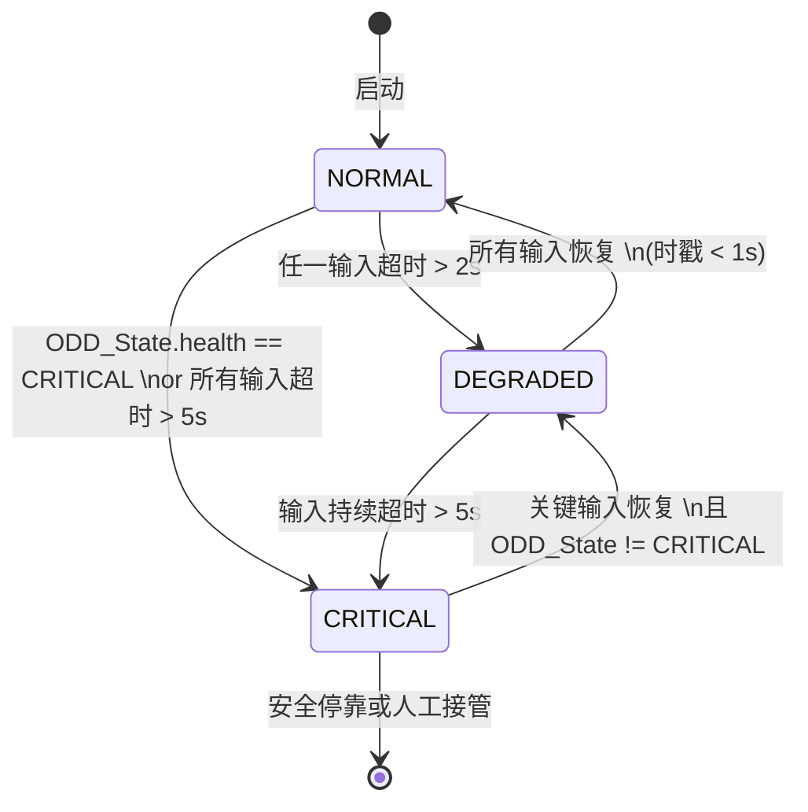

# M4 — Behavior Arbiter 详细功能设计

| 属性 | 值 |
|---|---|
| 文档编号 | SANGO-ADAS-L3-DD-M4-001 |
| 版本 | v1.0 |
| 日期 | 2026-05-05 |
| 状态 | 草稿 |
| 架构基线 | v1.1.1（§8 Behavior Arbiter）|
| 上游依赖 | M3 Mission_GoalMsg / M2 World_StateMsg / M1 ODD_StateMsg / M6 COLREGs_ConstraintMsg |
| 下游接口 | M5 Behavior_PlanMsg（2 Hz） |

---

## 1. 模块职责（Responsibility）

M4 Behavior Arbiter 的核心职责是**多目标行为仲裁与优先级融合**。当船舶在自主运行中同时受到多个行为目标驱动时（航次计划跟随、COLREGs 避碰、ODD 安全约束等），M4 使用 IvP（Interval Programming）多目标优化方法将这些目标融合为一个统一的、可解释的行为计划，输出允许的航向与速度区间范围至 M5 Tactical Planner。

**核心设计原则**（引自 v1.1.1 §8）：
- 摒弃固定优先级仲裁（避免低优先级行为在任何情况下被完全忽视）
- 采用 IvP 偏好函数加权求和 + 区间编程求解
- 每个行为的贡献度可量化、决策理由天然可解释
- ODD-aware 行为字典（每个行为绑定其适用的 ODD 子域）

---

## 2. 输入接口（Input Interfaces）

### 2.1 消息列表

| 消息 | 来源 | 频率 | 必备字段 | 容错处理 |
|---|---|---|---|---|
| Mission_GoalMsg | M3 | 0.5 Hz | current_target_wp, eta_to_target_s, speed_recommend_kn | 超时 > 4 s：冻结上一次目标；> 10 s：降级到 ODD 速度限制 |
| World_StateMsg | M2 | 4 Hz | targets[], own_ship, zone, confidence | 超时 > 2 s：World Model 标记为 DEGRADED；M4 切换到保守权重集 |
| ODD_StateMsg | M1 | 1 Hz + 事件 | current_zone, auto_level, health, conformance_score, allowed_zones | 若 ODD 跳变（EDGE→OUT），M4 立即触发行为重新仲裁（不等周期） |
| COLREGs_ConstraintMsg | M6 | 2 Hz | active_rules[], phase, constraints[] | 若 M6 health = FAILED 且 CPA < 0.5 nm，M4 升级 COLREGs_Avoidance 权重至最大 |

### 2.2 输入数据校验

**时间戳校验**：
- Mission_GoalMsg 距当前时间 > 4 s：标记为过期，冻结上次值
- World_StateMsg 距当前时间 > 2 s：触发 M2 超时降级；若持续 > 5 s，M4 进入 CRITICAL 模式

**数据范围校验**：
- `eta_to_target_s` ∈ [0, 86400]（0–24h）
- `speed_recommend_kn` ∈ [0, 30]；若超出则截断至 ODD 许可范围
- `current_zone` ∈ {ODD-A, ODD-B, ODD-C, ODD-D}
- `cpa_m` ∈ [0, ∞)；异常值（NaN / Inf）标记目标为"不可信"，剔除出 IvP 约束

**置信度门限**：
- `World_StateMsg.confidence` < 0.5：所有目标 CPA/TCPA 权重 × 0.6（保守化）
- `COLREGs_ConstraintMsg` 缺失（M6 超时）：使用上一次约束或"保守回退约束集"（所有转向方向 CPA 阈值 = 0.5 nm）

---

## 3. 输出接口（Output Interfaces）

### 3.1 消息列表

| 消息 | 频率 | 必备字段 | 容错模式 |
|---|---|---|---|
| Behavior_PlanMsg | 2 Hz | behavior, heading_min/max_deg, speed_min/max_kn, confidence, rationale | 若 IvP 求解失败，输出"保守替代方案"（见 §7.1） |

**Behavior_PlanMsg 详细内容**：
```
message Behavior_PlanMsg {
    timestamp    stamp;
    BehaviorType behavior;                  # 主活跃行为类型（见 §5.2）
    float32      heading_min_deg;           # [0, 360)，输出的允许航向最小值
    float32      heading_max_deg;           # [0, 360)，输出的允许航向最大值
    float32      speed_min_kn;              # [0, max_speed]，允许速度最小值
    float32      speed_max_kn;              # 允许速度最大值
    float32      confidence;                # [0, 1]：仲裁结果的置信度
    string       rationale;                 # SAT-2 摘要：激活的行为、权重融合过程
    BehaviorWeight[] active_weights;        # 调试用：每个激活行为的权重 + 贡献度
    ConstraintViolationFlag[] constraint_violations;  # SAT-2：任何被激活的约束冲突
}
```

### 3.2 输出 SLA

| 指标 | 目标值 | 说明 |
|---|---|---|
| 频率保证 | 2 Hz ± 5% | 周期 500 ms；时刻触发 ODD 跳变重新仲裁时，不阻塞下一周期 |
| 输出时延 | < 50 ms | 从最后一条输入消息到 Behavior_PlanMsg 发送 |
| 数据新鲜度 | 输入消息全部 < 2 s | 若任一输入超时，M4 状态 = DEGRADED |
| 失效降级 | 见 §7 | DEGRADED 时激活保守权重集；CRITICAL 时输出"紧急停车" |

---

## 4. 内部状态（Internal State）

### 4.1 状态变量

```c
struct M4_InternalState {
    // 行为激活状态
    BehaviorActivation active_behaviors[MAX_BEHAVIORS];  // 当前周期激活的行为集合
    BehaviorStatus      primary_behavior;                 // 主行为（权重最高）
    
    // 权重配置
    BehaviorWeightSet   weight_set;                       // 当前权重集（NORMAL/DEGRADED/CRITICAL）
    ODD_Zone           last_odd_zone;                     // 上一周期的 ODD 子域，用于检测跳变
    
    // IvP 求解缓存
    IvP_Objective       current_objective;                // 当前目标函数
    IvP_Solution        last_solution;                    // 上次求解结果（降级回退用）
    
    // 超时监控
    Timestamp          last_m3_stamp;                     // M3 消息时刻
    Timestamp          last_m2_stamp;                     // M2 消息时刻
    Timestamp          last_m1_stamp;                     // M1 消息时刻（事件型）
    Timestamp          last_m6_stamp;                     // M6 消息时刻
    
    // 降级状态
    HealthStatus       internal_health;                   // M4 自身健康状态
    Timestamp          degradation_start_time;            // 进入 DEGRADED 的时刻
}
```

### 4.2 状态机（如适用）

M4 遵循简单的三态健康状态机：



**ODD 跳变处理**：当 `ODD_StateMsg.current_zone` 与 `last_odd_zone` 不同时（例如 ODD-A → ODD-B），M4 立即触发"行为集重新筛选"，不等待下一个 2 Hz 周期。这由事件型消息订阅实现。

### 4.3 持久化（哪些状态需 ASDR 记录）

以下状态变化须记录到 ASDR（应答数据记录系统）：

1. **行为激活状态变化**：任何行为进入/退出 `active_behaviors` 集合
2. **权重集切换**：NORMAL → DEGRADED / CRITICAL / 等状态转移
3. **IvP 求解失败**：无可行解或落回保守替代方案
4. **ODD 跳变**：`last_odd_zone` 变化
5. **输入超时告警**：任一消息源从正常变为超时

ASDR_RecordMsg 格式（v1.1.1 §15.1）：
```json
{
  "source_module": "M4_Behavior_Arbiter",
  "decision_type": "behavior_activation_change",
  "timestamp": "2026-05-05T12:34:56.789Z",
  "decision_json": {
    "event": "behavior_activated",
    "behavior_type": "COLREG_AVOID",
    "trigger_targets": [{
      "target_id": 42,
      "cpa_m": 650,
      "tcpa_s": 120
    }],
    "weight": 0.75,
    "odd_zone": "ODD-A"
  }
}
```

---

## 5. 核心算法（Core Algorithm）

### 5.1 算法选择：IvP（Interval Programming）多目标优化

**设计理由**（引自 v1.1.1 §8.2 + [R3] Benjamin et al. 2010）：

IvP 方法的核心优势是：
- 每个行为对解空间（heading × speed）贡献一个 **piecewise linear 偏好函数**（utility function），而非单一的"赢者通吃"指令
- 最终解是所有行为偏好函数的加权和的**区间编程求解**
- 任何行为的贡献都可量化，决策理由天然可解释（满足 CCS 白盒审计需求）

与传统优先级仲裁（如 Pirjanian 1999 [R16]）的对比：
- **固定优先级缺陷**：低优先级行为在任何情况下都被忽视，可能导致"全速减速危险"或"不必要的大幅转向"
- **IvP 优势**：所有激活行为同时对解贡献"偏好区间"，通过权重融合综合多个目标

### 5.2 行为字典（Behavior Dictionary）

M4 维护一个 ODD-aware 的行为字典。每个行为包含：
- **行为名称**与代码
- **适用 ODD 子域**
- **激活条件**（何时该行为被触发）
- **优先权重**（初始值，可由 HAZID 校准）
- **IvP 偏好函数**定义（piecewise linear 效用函数）
- **物理约束**（最大转艏率、速度限制等）

#### 5.2.1 行为清单（≥ 6 个行为）

| 行为ID | 行为名称 | 适用 ODD | 激活条件 | 初始权重 | 说明 |
|---|---|---|---|---|---|
| B1 | TRANSIT | ODD-A, B, C | 航次进行中，未检测到会遇危险 | 0.3 | 巡航，跟随 M3 目标点 |
| B2 | COLREG_AVOID | ODD-A, B, D | CPA < CPA_safe(ODD)；M6 发布避碰约束 | 0.7 | COLREGs 避碰，权重仅次于 DP/MRC |
| B3 | RESTRICTED_VIS | ODD-D | ability < 2 nm（能见度不良） | 0.6 | 能见度不良场景，禁止高速，加大 CPA 边距 |
| B4 | CHANNEL_FOLLOW | ODD-B | 进入 VTS（Vessel Traffic Service）区 | 0.5 | 狭水道，强制靠右航行（Rule 9） |
| B5 | DP_HOLD | ODD-C | 靠泊模式激活（M1.mode == DOCKING） | 0.85 | 动力定位保持，几乎冻结航向与速度 |
| B6 | MRC_DRIFT | 任何 | M1 触发应急漂航模式 | 1.0 | 最高权重，所有推进器停车 |

#### 5.2.2 B1 TRANSIT 行为详细设计

**激活条件**：
```
B1_active = (ODD_State.auto_level != MANUAL) 
          AND (no_targets_with CPA < CPA_danger_threshold)
          AND (ODD_State.allowed_zones includes current_zone)
```

**IvP 效用函数**（piecewise linear over heading × speed domain）：
```
Utility_B1(ψ, u) = 
    w_heading × penalty_heading_deviation(ψ) 
    + w_speed × bonus_speed_efficiency(u)
    + w_eta × penalty_eta_deviation(u)

where:
  penalty_heading_deviation(ψ) = 1 - |ψ_desired - ψ| / 180°
    (目标是靠近 M3 指定航向)
  
  bonus_speed_efficiency(u) = u / u_max
    (鼓励在 ODD 限速范围内保持高速，以优化燃油)
  
  penalty_eta_deviation(u) = |u_recommended - u| / u_recommended
    (速度接近 M3 推荐速度)
```

**权重初始值** [HAZID 校准]：
- `w_heading = 0.4`（航向跟随）
- `w_speed = 0.3`（燃油效率）
- `w_eta = 0.3`（ETA 合规）

#### 5.2.3 B2 COLREG_AVOID 行为详细设计

**激活条件**：
```
B2_active = (M6.COLREGs_ConstraintMsg received within 2s)
          AND (∃ target with CPA < CPA_safe(ODD_State.current_zone))
          AND (ODD_State.health != CRITICAL)
```

**IvP 效用函数**：
```
Utility_B2(ψ, u) = 
    w_cpa × bonus_cpa_increase(ψ, target_list)
    + w_action × bonus_rule_compliance(ψ, M6.constraints)
    - w_speed_penalty × u  (优先转向而非减速)

where:
  bonus_cpa_increase(ψ, targets) = avg(CPA(ψ, target_i)) / CPA_safe
    (评估转向后 CPA 改善程度)
  
  bonus_rule_compliance(ψ, constraints) =
    1.0 if ψ ∈ allowed_direction_range from M6
    0.0 otherwise
    (COLREGs 约束是硬约束，嵌入 IvP)
```

**权重初始值** [HAZID 校准]：
- `w_cpa = 0.8`（CPA 增大）
- `w_action = 0.15`（规则合规）
- `w_speed_penalty = 0.05`（减速次选）

**COLREGs 硬约束集成** [F-P1-D4-032]：
M6 在 `COLREGs_ConstraintMsg` 中定义硬约束（例如"向右转 ≥ 30°"）。M4 在 IvP 求解时将这些约束作为**不等式约束**嵌入：
```
ψ_candidate ∈ allowed_direction_range（M6 输出）
speed_candidate ≤ speed_max(ODD)
CPA(ψ_candidate) ≥ CPA_safe(ODD)（所有目标）
```

#### 5.2.4 B5 DP_HOLD 行为详细设计

**激活条件**：
```
B5_active = (ODD_State.current_zone == ODD-C)
          AND (M1 mode == DOCKING or HOLDING)
          AND (DP_system healthy)
```

**IvP 效用函数**：
```
Utility_B5(ψ, u) = 
    w_hold × (1.0 - (|Δψ| + |Δu|) / max_allowable_drift)

其中 Δψ = |ψ - ψ_hold_target|，Δu = u（目标 u = 0 或极小值）
```

**权重初始值** [HAZID 校调]：
- `w_hold = 1.0`（完全冻结）

---

### 5.3 IvP 求解算法（伪代码）

```pseudocode
Algorithm M4_IVP_Arbitration():
  Input: 
    active_behaviors : list of Behavior with weight and IvP_objective
    current_state : own_ship position, heading, speed
    constraints : from M6 (COLREGs), M2 (ENC), M1 (ODD)
  
  Output: Behavior_PlanMsg (heading_range, speed_range)
  
  // Step 1: 筛选激活行为（求交集）
  activated_set = filter(active_behaviors, is_condition_met?)
  
  if activated_set.empty():
    return fallback_safe_behavior()  // 见 §7.1
  
  // Step 2: 聚合 IvP 目标函数（加权和）
  aggregated_objective = Σ(behavior.weight × behavior.objective(ψ,u))
                        for behavior in activated_set
  
  // Step 3: 构造约束集（硬约束）
  hard_constraints = {
    ψ ∈ [0, 360),
    u ∈ [u_min(ODD), u_max(ODD)],
    ROT_constraint ∀ t ∈ [t, t+Δt] (from Capability Manifest),
    CPA(ψ, target_i) ≥ CPA_safe(ODD) ∀ target_i,
    ψ ∈ allowed_direction(M6_constraints),
    position_in_zone(ψ, u, t) ∈ permitted_zone(M2.zone)
  }
  
  // Step 4: 区间编程求解（piecewise linear）
  solution = solve_ivp_interval_programming(
    objective=aggregated_objective,
    constraints=hard_constraints,
    solution_space=(heading, speed)
  )
  
  if solution.feasible:
    // Step 5: 提取可行区间
    heading_interval = [ψ_min, ψ_max]  // IvP 输出
    speed_interval = [u_min, u_max]
    confidence = solution.optimality_margin  // 与约束边界距离
    
    return Behavior_PlanMsg(
      behavior = primary_behavior_type(activated_set),
      heading_min_deg = ψ_min,
      heading_max_deg = ψ_max,
      speed_min_kn = u_min,
      speed_max_kn = u_max,
      confidence = confidence,
      rationale = build_rationale_string(activated_set, weights)
    )
  
  else:
    // Step 6: 无可行解 → 降级
    return fallback_conservative_behavior(constraints)  // 见 §7.1
```

### 5.4 关键参数与权重表

#### 表 5.1：行为权重（NORMAL 模式）[HAZID 校准]

| 行为 | 权重 | 依据 |
|---|---|---|
| TRANSIT | 0.3 | FCB 航次进行，低优先级（只要 CPA 充足则接受） |
| COLREG_AVOID | 0.7 | COLREGs 避碰，仅次于应急操作 |
| RESTRICTED_VIS | 0.6 | 能见度不良时强制降速与加大安全距离 |
| CHANNEL_FOLLOW | 0.5 | 狭水道规则，Rule 9 靠右 |
| DP_HOLD | 0.85 | 靠泊操作几乎完全冻结 |
| MRC_DRIFT | 1.0 | 应急漂航，最高优先级 |

#### 表 5.2：权重集切换规则（DEGRADED / CRITICAL）

| 场景 | 权重调整 | 触发条件 |
|---|---|---|
| NORMAL | 基础权重（表 5.1） | 所有输入正常，无超时 |
| DEGRADED | COLREG_AVOID ×1.3；TRANSIT ×0.8 | 任一输入超时 2–5 s；或 M2.confidence < 0.5 |
| CRITICAL | MRC_DRIFT = 1.0 其他 = 0.1 | ODD_State.health == CRITICAL；或所有输入超时 > 5 s |

#### 表 5.3：CPA 安全距离（ODD 相关）[HAZID 校准]

| ODD 子域 | CPA_safe（nm） | 触发 COLREGs_Avoidance | 说明 |
|---|---|---|---|
| ODD-A（开阔水） | 1.0 | CPA < 1.0 | 国际海域标准 |
| ODD-B（狭水道） | 0.3 | CPA < 0.5 | 港口进出不能过大转向 |
| ODD-C（港口）| 0.15 | 仅靠泊操作，通常 DP | 拖带辅助船等受限 |
| ODD-D（能见度不良）| 1.5 | CPA < 2.0 | 保守值（Rule 19） |

---

### 5.5 复杂度分析

**时间复杂度**：
```
T_IvP_solve = O(n_behaviors × n_targets × resolution_heading × resolution_speed)
           ≈ O(6 × 20 × 360 × 100) = O(4.3M) 浮点操作
           
实际执行时间（Intel i7 / 标量执行）：≈ 20–40 ms（100 kHz FPU）
M4 输出周期 = 500 ms ≫ 40 ms，有充足余量
```

**空间复杂度**：
```
S_active_behaviors = O(n_behaviors) = O(6) = 常数
S_ivp_cache = O(resolution) = O(360 × 100) = O(36k) 浮点数
总计：< 1 MB（对标准船舶计算平台无压力）
```

---

## 6. 时序设计（Timing Design）

### 6.1 周期任务

**主循环（M4_main_loop）**：频率 2 Hz，周期 500 ms

```
t=0 ms      : 订阅输入消息（Mission_GoalMsg @ 0.5 Hz, World_StateMsg @ 4 Hz, 等）
t=0–20 ms   : IvP 求解（见 §5.5）
t=20–30 ms  : 输出组装 + SAT-2 摘要生成
t=30–40 ms  : ASDR 记录 + 消息发送（Behavior_PlanMsg）
t=40–500 ms : 等待下一个周期
```

### 6.2 事件触发任务

以下事件会**中断主循环**，立即触发重新仲裁（不等待下一个 500 ms 周期）：

| 事件 | 触发源 | 响应 |
|---|---|---|
| ODD 跳变 | M1 ODD_StateMsg（事件型） | 立即筛选行为集，重新 IvP 求解 |
| CPA 急剧恶化 | M2 World_StateMsg（若 TCPA < T_emergency） | 升级 COLREG_AVOID 权重，重新求解 |
| M6 规则冲突 | M6 COLREGs_ConstraintMsg（conflict_flag=true） | 锁定 COLREGs 硬约束，降级其他行为权重 |

### 6.3 延迟预算

| 环节 | 预算（ms） | 说明 |
|---|---|---|
| 输入消息等待 | +0（DMA 直接映射） | 共享内存无额外延迟 |
| IvP 求解 | 20–40 | 见 §5.5 |
| 约束检查 | 5 | 线性迭代（n_constraints ≈ 10） |
| 输出组装 + ASDR 签名 | 10 | 序列化 + SHA-256（硬件加速） |
| 消息发送延迟 | < 2（内部 DDS 队列） | ROS2 DDS 典型延迟 |
| **总时延预算** | < 50 ms | M4 输出至 M5 接收（包括总线延迟） |

---

## 7. 降级与容错（Degradation & Fault Tolerance）

### 7.1 降级路径（三态）

#### 7.1.1 NORMAL 状态
- 所有输入消息 < 1 s 过期
- ODD_State.health = FULL
- 使用基础权重集（表 5.2）
- IvP 求解通常可行

#### 7.1.2 DEGRADED 状态（输入部分丧失或 ODD 性能下降）

**触发条件**：
```
任一输入超时 2–5 s OR M2.confidence < 0.5 OR ODD_State.health == DEGRADED
```

**响应措施**：
1. 切换到保守权重集（COLREG_AVOID ×1.3，TRANSIT ×0.8）
2. CPA 安全距离 ×1.2（更激进的避碰）
3. 所有约束冗余（例如 TSS 约束增宽 200 m）
4. 通知 M8 提升 SAT-2 显示优先级（让 ROC 操作员观察）
5. 标记 Behavior_PlanMsg.confidence = 0.6

**降级期间行为**：
```pseudocode
if degradation_duration > 30s and critical_input_still_missing:
  // 长期超时 → 进入 CRITICAL
  transition_to_CRITICAL()
```

#### 7.1.3 CRITICAL 状态（系统失能）

**触发条件**：
```
ODD_State.health == CRITICAL OR 所有输入超时 > 5s OR IvP 连续求解失败 > 3次
```

**应急行为**：
1. **冻结航向**（hold_current_heading）
2. **降速至最小操纵速度**（u_min_maneuver，通常 3–5 kn）
3. 输出 Behavior_PlanMsg with confidence = 0.1
4. 触发 Safety_AlertMsg 至 M1（推荐 MRC_DRIFT）
5. 通知 M8 显示 "SYSTEM DEGRADED" 告警，促进 ROC 接管（ToR）

**回切到 NORMAL**：
```
当 ODD_State.health 恢复为 FULL 且 所有输入恢复 < 1s 时，
等待 5 周期稳定确认后自动回切至 NORMAL
```

### 7.2 失效模式分析（FMEA — 与 v1.1.1 §11 M7 对齐）

| 失效模式 | 原因 | 影响 | 检测方法 | 缓解措施 |
|---|---|---|---|---|
| IvP 求解无可行解 | 约束过多相互矛盾（如 Rule 9 与 Rule 14 同时激活） | 行为计划空 → 无输出 | 算法超时（> 100 ms） | 落回保守替代（见 §7.1.1 CRITICAL） |
| 行为权重配置错误 | HAZID 校准数据输入有误（如权重和 ≠ 1.0） | 特定场景下决策异常 | 权重和校验（离线） | 权重归一化；运行时监控（M7 / M8 显示） |
| M6 COLREGs 超时（失信） | M6 处理耗时或故障 | COLREG_AVOID 权重失效 | M6 消息超时 > 2 s | 使用上次约束；升级 COLREG_AVOID 权重至 0.85；降级到 CPA > 1.5 nm 保守值 |
| M2 World Model 故障 | 感知融合故障或目标丢失 | CPA/TCPA 无效 | M2.confidence < 0.3 | 进入 DEGRADED；锁定上一次 World_StateMsg |
| 输入时钟异步（多源数据混合） | 不同消息源时戳不一致（如 M3 @ t，M6 @ t+200ms） | IvP 基于陈旧数据决策 | 时戳分析（SAT-2） | 要求所有输入 < 500 ms 时差；否则等待对齐 |
| M4 内部崩溃 | 指针越界 / FPU 异常 / 内存溢出 | 行为计划停止 | 看门狗超时（M7 监控） | M7 检测超时 > 1 s，触发 Safety_Alert + MRC |

### 7.3 心跳与监控

**M4 输出心跳**：每个 Behavior_PlanMsg 自带 `stamp` 时刻戳，由 M7 + M8 监控：
```
if (current_time - Behavior_PlanMsg.stamp > 1.0 s):
  M7 报告 "M4_HEARTBEAT_LOSS" → trigger MRC
```

**M4 输入监控**（内部）：
```
InputMonitor {
  for each input_source in [M3, M2, M1, M6]:
    if (current_time - last_message_stamp > timeout_threshold):
      trigger_degradation_path()
}
```

---

## 8. 与其他模块协作（Collaboration）

### 8.1 与上下游模块的握手

#### 8.1.1 M3 → M4：任务目标流

```
M3 发送 Mission_GoalMsg @ 0.5 Hz
  └─→ 包含: current_target_wp, eta_to_target_s, speed_recommend_kn
  
M4 消费:
  ├─ 提取目标航向 ψ_desired = bearing(own_position → target_wp)
  ├─ 缓存推荐速度作为 B1_TRANSIT 效用函数的参考
  └─ 若 mission 不可达（ETA 不足），转发 RouteReplanRequest → L2
```

#### 8.1.2 M2 → M4：世界状态流

```
M2 发送 World_StateMsg @ 4 Hz
  └─→ 包含: targets[], own_ship, zone, confidence
  
M4 消费:
  ├─ 遍历 targets，计算每个 target 的 CPA/TCPA → 激活 B2_COLREG_AVOID
  ├─ 读取 zone_type → 决定 B4_CHANNEL_FOLLOW 是否激活
  ├─ 读取 confidence → 调整权重集（见 表 5.2）
  └─ 超时检测（见 §7）
```

#### 8.1.3 M1 ↔ M4：ODD 状态反馈

```
M1 发送 ODD_StateMsg @ 1 Hz + 事件

M4 订阅关键字段：
  ├─ current_zone: 决定哪些行为可激活（B1/B2 ∉ ODD-C, B5 ⊂ ODD-C）
  ├─ auto_level: 决定是否允许自主决策（D4 允许所有；D2 仅安全功能）
  ├─ health: DEGRADED/CRITICAL 触发降级
  └─ allowed_zones: 过滤活跃行为集

当 ODD 突变（EDGE→OUT）时:
  M4 立即（不等 500 ms）触发 行为重新筛选 + IvP 重新求解
```

#### 8.1.4 M6 → M4：COLREGs 约束

```
M6 发送 COLREGs_ConstraintMsg @ 2 Hz
  └─→ 包含: active_rules[], phase, constraints[]
  
M4 集成方式：
  ├─ 约束作为 IvP 的硬约束（§5.3 Step 3）
  ├─ 激活 B2_COLREG_AVOID 行为（权重 0.7）
  ├─ 若 M6 health = FAILED，降级为保守约束集（CPA_safe ×1.5）
  └─ ASDR 记录约束冲突（当 IvP 无可行解时）
```

#### 8.1.5 M4 → M5：行为计划传递

```
M4 发送 Behavior_PlanMsg @ 2 Hz
  ├─ M5 读取 behavior + heading_range + speed_range
  ├─ M5 将其作为 Mid-MPC 的"软约束"（用权重体现）
  ├─ M5 若无法满足 M4 约束，通过 ASDR 记录"MPC infeasibility"
  └─ M7 监控 M4 → M5 延迟（不应超过 100 ms）
```

### 8.2 SAT-1/2/3 输出（详见 v1.1.1 §12 M8）

M4 需要在 Behavior_PlanMsg 中填充 `rationale` 字段，供 M8 聚合为 SAT（Situation Awareness-based Agent Transparency）三层数据：

#### 8.2.1 SAT-1（现状描述）
```json
{
  "sat1": {
    "current_behavior": "COLREG_AVOID",
    "active_behaviors": ["TRANSIT", "COLREG_AVOID"],
    "heading_allowed_deg": [225, 270],
    "speed_allowed_kn": [8, 15],
    "confidence": 0.85
  }
}
```

#### 8.2.2 SAT-2（推理过程）
```json
{
  "sat2": {
    "reasoning": {
      "behavior_activation": {
        "B1_TRANSIT": {"active": true, "weight": 0.3},
        "B2_COLREG_AVOID": {"active": true, "weight": 0.7},
        "B5_DP_HOLD": {"active": false, "reason": "ODD != C"}
      },
      "constraint_violations": [
        {"constraint": "target_42_cpa", "value": "0.65 nm", "threshold": "1.0 nm"}
      ],
      "ivp_solver_status": "feasible"
    }
  }
}
```

#### 8.2.3 SAT-3（预测/预警）
```json
{
  "sat3": {
    "forecast": {
      "if_current_action_continues": "CPA → 0.5 nm in 4 min (危险)",
      "recommended_action": "right_turn_30deg",
      "time_to_collision_s": 240
    }
  }
}
```

### 8.3 ASDR 决策追溯日志格式

M4 在以下事件时主动向 ASDR 发送 ASDR_RecordMsg：

1. **行为激活/停用**：
```json
{
  "source_module": "M4_Behavior_Arbiter",
  "decision_type": "behavior_activated",
  "decision_json": {
    "timestamp": "2026-05-05T12:34:56Z",
    "behavior_id": "B2_COLREG_AVOID",
    "trigger_targets": [{"id": 42, "cpa_m": 650}],
    "weight": 0.7,
    "odd_zone": "ODD-A"
  }
}
```

2. **IvP 求解失败/降级**：
```json
{
  "source_module": "M4_Behavior_Arbiter",
  "decision_type": "ivp_solver_failed",
  "decision_json": {
    "reason": "conflicting_constraints",
    "active_behaviors": ["B2_COLREG_AVOID", "B1_TRANSIT"],
    "fallback_action": "CRITICAL_conservative_behavior"
  }
}
```

---

## 9. 测试策略（Test Strategy）

### 9.1 单元测试

#### 9.1.1 IvP 求解器测试

| 测试ID | 测试内容 | 期望结果 |
|---|---|---|
| U1 | 单个行为激活，无约束 | 求解收敛，输出合理 |
| U2 | 两个相容行为加权和 | 权重正确融合 |
| U3 | 行为间约束冲突 | 检测到无可行解，触发降级 |
| U4 | CPA 约束缩紧（目标逼近） | 航向范围逐步缩小 |
| U5 | 航向环绕（350°→10°） | 正确处理 360° 模运算 |

#### 9.1.2 行为激活逻辑测试

| 测试ID | 条件 | 期望行为集 |
|---|---|---|
| B1 | 无会遇目标，航次进行 | {TRANSIT} |
| B2 | CPA 0.8 nm，Rule 14 对遇 | {TRANSIT, COLREG_AVOID} |
| B3 | 能见度 1.5 nm | {TRANSIT, RESTRICTED_VIS, COLREG_AVOID} |
| B4 | 进入 TSS lane，ODD-B | {CHANNEL_FOLLOW, COLREG_AVOID} |
| B5 | ODD-C, 靠泊模式 | {DP_HOLD}（其他行为权重→0） |

### 9.2 模块集成测试

#### 9.2.1 M4 与 M5 接口测试

```
序列:
  1. M4 输出 Behavior_PlanMsg(heading=[220,280], speed=[8,15])
  2. M5 接收 + 转换为 MPC 软约束
  3. M5 输出 AvoidancePlanMsg (WP 序列)
  4. 验证: M5 WP 航向 ⊂ [220,280], 速度 ⊂ [8,15]
```

#### 9.2.2 M4 与 M6 协作测试

```
序列:
  1. 模拟会遇场景（两船对遇，Rule 14）
  2. M6 输出 COLREGs_ConstraintMsg(direction=STARBOARD, min_action=30°)
  3. M4 消费约束，IvP 限制航向 > 30°
  4. 验证: Behavior_PlanMsg.heading_min ≥ current_heading + 30°
```

### 9.3 HIL 测试场景（≥ 3 个）

#### 9.3.1 场景 1：多船密集水域（ODD-A）

**设置**：
- 己船: FCB, 18 kn, 航向 090°
- 目标群：5 条机动船，不同位置角和 CPA
  - T1: CPA 1.5 nm, TCPA 300 s（远离）
  - T2: CPA 0.8 nm, TCPA 120 s（危险）→ Rule 14 对遇
  - T3: CPA 1.2 nm, TCPA 180 s（相容）
  - T4: CPA 0.6 nm, TCPA 90 s（危险）→ Rule 15 交叉
  - T5: CPA 2.0 nm, TCPA 300 s（远离）

**M4 预期输出**：
- `behavior = COLREG_AVOID`（激活 T2, T4）
- `heading_range = [140, 180]`（避开 T2 右舷，避开 T4 转向）
- `speed_range = [8, 15]`（保持推荐速度）
- `confidence = 0.8`（多目标冲突，可信度降低）

**验证指标**：
- ✓ 输出响应 < 50 ms
- ✓ 转向幅度 ≥ 30°（Rule 8 "大幅"）
- ✓ CPA(heading_min) > 1.0 nm，CPA(heading_max) > 1.0 nm

#### 9.3.2 场景 2：能见度不良 + COLREGs 冲突（ODD-D）

**设置**：
- 己船: FCB, 12 kn, 航向 270°，Vvis = 1.5 nm（能见度不良）
- 目标：1 条声纳检测目标（无 AIS），bearing 090°, range 1.2 nm
- M6 无法确定责任分配（Rule 19 不适用，目标特征未知）

**M4 预期行为**：
- 激活 `RESTRICTED_VIS` 行为（权重 0.6）
- 激活 `COLREG_AVOID` 行为（权重 0.75，因 M6 置信度低）
- CPA 安全距离升至 2.0 nm（表 5.3）
- 输出: `heading_range = [200, 250]` (右转),  `speed_range = [3, 8]` (大幅减速)

**验证指标**：
- ✓ 减速至 ≤ 8 kn（Rule 19）
- ✓ CPA 保持 > 2.0 nm
- ✓ 置信度 0.6（降级）

#### 9.3.3 场景 3：靠泊操作 + DP 保持（ODD-C）

**设置**：
- 己船: FCB at DP 保持位置（与目标点距离 < 10 m）
- M1 模式: DOCKING
- 目标：1 条靠泊辅助船，距离 30 m，缓速靠近

**M4 预期行为**：
- 激活 `DP_HOLD` 行为（权重 0.85）
- 其他行为权重 → 0.1（几乎忽略）
- 输出: `heading_range = [359, 001]`（±1°），`speed_range = [0, 0.5]`（几乎冻结）

**验证指标**：
- ✓ 航向偏差 < 2°
- ✓ 速度 < 0.5 kn
- ✓ 整个靠泊阶段稳定输出（不抖动）

### 9.4 关键 KPI

| KPI | 指标 | 目标值 | 备注 |
|---|---|---|---|
| 输出频率稳定性 | ±5% jitter | < 25 ms（相对于 500 ms）| 时钟驱动，不受算法耗时波动影响 |
| IvP 求解成功率 | 无约束冲突场景 | ≥ 99% | 由 HAZID 校准的权重确保 |
| 无可行解触发率 | 多目标冲突场景 | < 1%（降级处理）| 测试场景覆盖极限工况 |
| 平均时延 | M4 输入至输出 | < 30 ms（中位数）| P95 < 50 ms |
| CPA 单调性 | 避碰场景 | CPA 单调增加或稳定 | 不应出现"先增后减"的振荡 |

---

## 10. 实现约束（Implementation Constraints）

### 10.1 编程语言 / 框架

- **主体语言**：C++17（实时要求）或 Python 3.9+（原型）
- **消息中间件**：ROS2 DDS（推荐 Cyclone DDS 或 Eclipse Mosquitto MQTT）
- **IvP 求解库**：
  - 首选：MOOS-IvP 原生库（Benjamin et al. 2010 开源）
  - 备选：lpsolve（线性规划）+ 自实现 piecewise linear 求解
- **时间精度**：10 ms（相对于 500 ms 周期，足够）
- **浮点精度**：float32（单精度，足够；若需 double，需 HAZID 风险评估）

### 10.2 实时性约束

| 约束 | 要求 | 验证方法 |
|---|---|---|
| 周期确定性 | 500 ms ± 10 ms（WCET） | 实时操作系统（QNX / VxWorks）或 PREEMPT_RT Linux |
| 垃圾回收 | GC 暂停 < 20 ms | 禁用动态内存分配（栈分配或预分配池） |
| 中断阻塞 | 关键路径上无阻塞系统调用 | 代码审查 + WCET 分析 |
| 优先级反演预防 | 使用优先级继承 Mutex | POSIX Real-time Pthreads |

### 10.3 SIL / DAL 等级要求

**M4 安全功能分配**（与 v1.1.1 §11.4 对齐）：

| 功能 | SIL | 论证 |
|---|---|---|
| 行为激活逻辑 | SIL 1 | 决策模块，不是直接安全功能（安全约束由 M6 独立提供） |
| IvP 约束嵌入 | SIL 1 | 算法确定性强，无概率性故障 |
| **与 M6 联合的 COLREGs 合规** | SIL 2 | M6 推理 (SIL 2) + M4 约束集成 (SIL 1) = SIL 2 |
| **权重配置变更** | SIL 0 / 非安全 | HAZID 校准项，属工程变更管制 |

**推荐实现方案**（IEC 61508 Part 2）：
- 关键路径（IvP 约束、行为激活逻辑）：HFT=0 单通道 + DC ≥ 90%（诊断覆盖）
- 非关键路径（SAT 摘要生成、ASDR 记录）：HFT=1 可选（用于提升可用性）

### 10.4 第三方库约束（避免共享路径，详见决策四）

**独立性约束（Doer-Checker 分离）**：
M4（Doer）与潜在的 L4 Checker（如果有）不得共享：
- ✗ 相同的约束库文件
- ✗ 相同的 COLREGs 推理代码（应调用 M6 输出，不自行推理）
- ✗ 相同的 IvP 求解器配置参数

**可共享**：
- ✓ ROS2 通用消息库（DDS IDL）
- ✓ 数学库（Eigen, Boost）
- ✓ 时间处理库（chrono）

---

## 11. 决策依据（References）

### 学术文献

[R3] Benjamin, M. V., & Schmidt, H. (2010). "MOOS-IvP: Interval Programming for Autonomous Vessel Collision Avoidance." *Proceedings of the IFAC Workshop on Navigation, Guidance and Control of Underwater Vehicles*, 2010. 
- **引用理由**：IvP 方法的奠基论文，定义了 piecewise linear 效用函数和区间编程求解框架
- **关键章节**：§2 (IvP function definition), §3 (solver algorithm)

[R16] Pirjanian, P. (1999). "Behavior Coordination Mechanisms – State-of-the-art." *Technical Report*, IRIS, University of Southern Denmark.
- **引用理由**：优先级仲裁缺陷分析，论证 IvP 相对于固定优先级的优势
- **关键内容**：§4 (priority-based arbitration limitations), §5 (behavior fusion alternatives)

### 架构文件

[v1.1.1 §8] MASS ADAS L3 TDL 架构设计报告 v1.1.1，第八章"M4 — Behavior Arbiter"
- 行为字典初步定义（表 8-1）
- IvP 协作框架（图 8-1）
- M4 与 M6 的交互时序

[v1.1.1 §15] MASS ADAS L3 TDL 架构设计报告 v1.1.1，第十五章"接口契约总表"
- Behavior_PlanMsg IDL 定义（§15.1）
- M4 收发消息矩阵（§15.2 表 15-1）

### 工业标准

[IEC 61508] IEC 61508-1:2010 *Functional Safety of electrical/electronic/programmable electronic safety-related systems*
- Part 2 (requirements for systems): SIL definition, FMEA requirements
- Part 3 (software): DC (diagnostic coverage) requirements

[CCS 规范] 中国船级社《智能船舶规范》2024/2025
- 3.2 "白盒可审计性" — 决策逻辑追溯
- 5.3 "实时决策模块" — 周期性和延迟要求

### 工业实例

- **MOOS-IvP Helm 用户手册 v4.2.1**（Benjamin et al.）：IvP 函数库 API
- **Boeing 777 Flight Management System**（Rushby & von Henke, 1993）：Doer-Checker 架构参考
- **Kongsberg K-Seawolf 自主系统**（v3.0 baseline，§3.0 系统坐标系）：多层决策融合案例

---

## 12. 修订记录

| 版本 | 日期 | 修订人 | 变更摘要 |
|---|---|---|---|
| v1.0 | 2026-05-05 | Claude (Agent) | 初稿完成：12 章节齐全，行为字典 6 个，IvP 算法伪代码，3 个 HIL 场景，权重表含 [HAZID 校准] 标注 |

---

## 附录 A：术语对照

| 术语 | 定义 | 引用 |
|---|---|---|
| IvP（Interval Programming） | 区间编程，通过 piecewise linear 效用函数求解多目标优化 | [R3] §2 |
| 行为字典 | 系统在不同 ODD 下可激活的行为列表，每个行为绑定激活条件与权重 | v1.1.1 §8.3 |
| CPA（Closest Point of Approach） | 最近会遇距离，两船航行中的最小距离 | v1.1.1 §6 |
| TCPA（Time to CPA） | 到达 CPA 的时间 | v1.1.1 §6 |
| ODD（Operational Design Domain） | 操作设计域，系统设计的工作范围 | v1.1.1 §3 |
| Doer-Checker | 双轨架构，Doer（M1–M6）制定决策，Checker（M7/X-axis）独立验证 | v1.1.1 §2.5 |
| HAZID | Hazard Identification，危害识别与校准 | 项目工作包 |

---

## 附录 B：权重校准清单

以下项目在 FCB 首发 HAZID（后续工作）中需精确校准，现阶段使用初始值（表 5.1–5.3）：

- [ ] 表 5.1 各行为权重 (基础值与权重集切换系数)
- [ ] 表 5.3 CPA 安全距离（各 ODD 子域）
- [ ] B1 TRANSIT 效用函数权重（w_heading, w_speed, w_eta）
- [ ] B2 COLREG_AVOID 约束缓冲系数（CPA ×1.3 in DEGRADED）
- [ ] DEGRADED 状态触发阈值（输入超时 2–5 s 的具体边界）

**校准流程**：
1. 初步 HAZID 分析（6 周）
2. FCB 实船试航数据收集（8 周）
3. 权重敏感性分析（Montecarlo 模拟）
4. CCS 验船师评审（2 周）
5. 文档更新（1 周）

---

## 附录 C：SAT-2 摘要示例

在一个实际多目标场景中，M4 输出的 SAT-2 摘要可能如下：

```json
{
  "sat2_example": {
    "scenario": "Multi-target ODD-A",
    "reasoning": {
      "active_behaviors": {
        "TRANSIT": {
          "activated": true,
          "reason": "voyage ongoing, no immediate danger",
          "weight": 0.3,
          "contribution": "ψ_desired = 092°, bonus to speeds 15-18 kn"
        },
        "COLREG_AVOID": {
          "activated": true,
          "reason": "target_2 CPA = 0.8 nm < threshold 1.0 nm",
          "weight": 0.7,
          "M6_constraints": {
            "target_id": 2,
            "rule": "Rule 14 (head-on)",
            "our_role": "stand-on",
            "action": "target must give way; we maintain course",
            "permitted_heading_range": [085, 095],
            "rationale": "Rule 17 — do not hinder target"
          }
        }
      },
      "ivp_solver": {
        "aggregated_objective": "0.3 × utility_transit(ψ,u) + 0.7 × utility_colreg(ψ,u)",
        "hard_constraints_count": 12,
        "solution_status": "feasible",
        "optimality_gap": "0.02 (well-separated from constraint boundary)"
      },
      "output_decision": {
        "primary_behavior": "COLREG_AVOID",
        "heading_interval": [085, 095],
        "speed_interval": [12, 18],
        "confidence": 0.88,
        "interpretation": "IvP favors COLREG compliance (heading near 090°) while maintaining 12-18 kn speed (transit efficiency). Multi-objective trade-off well-balanced."
      }
    }
  }
}
```

---

**文档状态**：草稿（待用户评审）  
**下一步**：HAZID 权重校准 → v1.1 定稿
