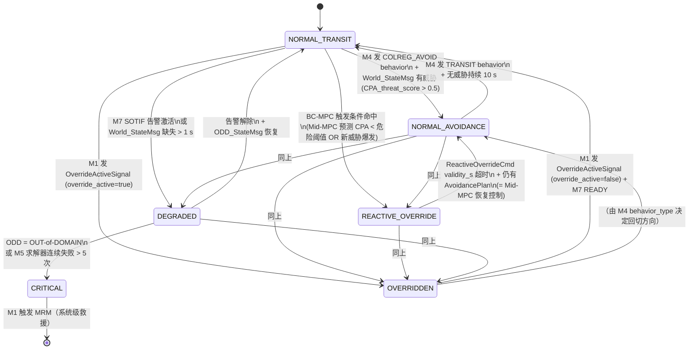
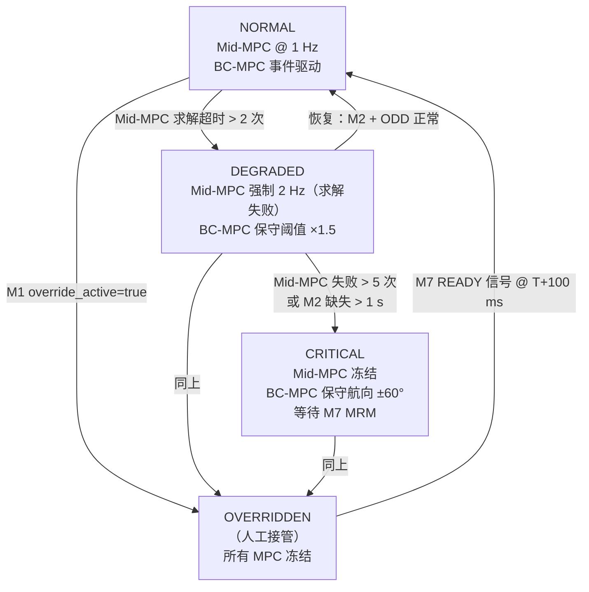

# M5 — Tactical Planner 详细功能设计

| 属性 | 值 |
|---|---|
| 文档编号 | SANGO-ADAS-L3-DD-M5-001 |
| 版本 | v1.0（**正式**）|
| 日期 | 2026-05-06 |
| 状态 | **正式**（v1.1.1 + RFC-001 已批准 — 接口跨团队锁定）|
| 架构基线 | **v1.1.2**（含 RFC 决议 patch；章节锚点：§10 M5 全章 / §10.6 TSS 多边形约束 / §10.7 接管冻结 / §15.1 AvoidancePlanMsg + ReactiveOverrideCmd / §15.2 接口矩阵）|
| RFC 基线 | **RFC-001 已批准**（详见 `docs/Design/Cross-Team Alignment/RFC-decisions.md`）— L4 团队承诺三模式改造（PoC T+5 周；HIL T+8 周）|
| 上游依赖 | M4 Behavior_PlanMsg / M6 COLREGs_ConstraintMsg / M2 World_StateMsg / M1 ODD_StateMsg / L2 PlannedRoute + SpeedProfile |
| 下游接口 | L4 AvoidancePlanMsg + ReactiveOverrideCmd / ASDR ASDR_RecordMsg / M8 SAT_DataMsg |
| 关键风险 | ~~RFC-001 跨团队对齐状态未定~~ → **已解除**（2026-05-06 RFC 决议）|

---

## 1. 模块职责（Responsibility）

**Tactical Planner（M5）是 L3 中计算强度最高的模块，负责将 M4 行为意图和 M6 COLREG 约束实时转化为避碰轨迹指令。采用双层 MPC（Mid-MPC + BC-MPC）架构来同时满足两个相互冲突的时间尺度需求：**

- **中程规划（Mid-MPC）**：60–120 秒时域，输出 4 航点序列 + 速度调整（与 COLREG 合规、ODD 约束协调）
- **短程应急（BC-MPC）**：10–30 秒时域，输出紧急航向/速度指令（处理预测外威胁或短时碰撞风险急剧恶化）

**v1.1.1 核心决策**（§10.2）：M5 按方案 B 提议输出双接口——主接口 AvoidancePlanMsg（1–2 Hz，覆盖 L2 PlannedRoute）+ 紧急接口 ReactiveOverrideCmd（事件驱动，频率上限 10 Hz），由 L4 负责切换模式并处理 LOS 转跟踪。

---

## 2. 输入接口（Input Interfaces）

### 2.1 消息列表

| 消息 | 来源 | 频率 | 必备字段 | 容错处理 |
|---|---|---|---|---|
| **Behavior_PlanMsg** | M4 Behavior Arbiter | 2 Hz | `behavior_type` / `allowable_heading_range` / `allowable_speed_range` / `urgency_level` | 缺失超 1 s → Mid-MPC 回到上一周期行为约束；超 3 s → 降级到保守 TRANSIT 行为 |
| **COLREGs_ConstraintMsg** | M6 COLREGs Reasoner | 2 Hz | `rule_set` / `applicable_rules` / `conflict_score` / `recommended_stand_on` | 缺失超 1 s → Mid-MPC 加大 CPA 安全边距 ×1.3；冲突解析失败持续 3 s → M7 SOTIF 告警 |
| **World_StateMsg** | M2 World Model | 4 Hz | `own_ship_state` (pos/hdg/speed/cog) / `target_list[]` (CPA/TCPA/predict_intent) / `environmental_state` (wind/current/visibility) | 缺失超 0.5 s → BC-MPC 自动激活（进入保守应急状态）；超 2 s → M1 触发降级 |
| **ODD_StateMsg** | M1 ODD/Envelope Manager | 1 Hz | `odd_domain` / `speed_limit_kn` / `colreg_param_set` / `allowed_maneuver_envelope` | 缺失超 3 s → M5 冻结规划，等待 ODD 恢复；ODD = OUT-of-DOMAIN → M5 冻结 + 触发 MRM-02 |
| **PlannedRoute** | L2 Voyage Planner | ~0.5 Hz | `waypoint_sequence[]` / `speed_profile[]` / `valid_until_s` | 缺失超 5 s → Mid-MPC 沿当前航向维持速度（兜底模式） |
| **SpeedProfile** | L2 Voyage Planner | ~0.5 Hz | `segment[]` {distance_m, speed_kn} | 缺失超 5 s → Mid-MPC 读取上一周期值 |

### 2.2 输入数据校验

**时戳对齐**：M5 于每周期开始（中程 MPC @ 1 Hz 或 BC-MPC 触发事件）执行多消息时戳对齐：
- World_StateMsg 时戳不超过 200 ms 前（外推容差）
- Behavior_PlanMsg / COLREGs_ConstraintMsg 不超过 500 ms 前（允许异步更新）
- ODD_StateMsg 不超过 1 s 前

**数据范围校验**：
- `heading_deg` ∈ [0, 360)；超出值模 360 处理
- `speed_kn` ∈ [0, ODD_speed_limit]；超限值裁剪至上限
- `CPA_nm` ≥ 0；负值视为传感器异常，触发 M7 降级监测
- `confidence` ∈ [0, 1]；threshold_safe = 0.5（Mid-MPC），0.7（BC-MPC）

**失效处理**：
- 单一消息超时 → 按表 2.1 容错处理（不级联停止）
- 同时 World_StateMsg + ODD_StateMsg 失联 → 冻结规划等待恢复（这是系统失效状态，由 M7 + 硬件 watchdog 处理）

---

## 3. 输出接口（Output Interfaces）

### 3.1 消息列表

| 消息 | 目标 | 频率 | 必备字段 | 责任 |
|---|---|---|---|---|
| **AvoidancePlanMsg** | L4 Guidance Layer | 1–2 Hz（主接口） | `stamp` / `waypoints[4]` / `speed_adjustments[]` / `horizon_s` / `confidence` / `status` / `rationale` | M5 Mid-MPC 输出；周期生成（除非人工接管或 ODD 异常） |
| **ReactiveOverrideCmd** | L4 Guidance Layer | 事件触发 / 上限 10 Hz（紧急接口） | `trigger_time` / `heading_cmd_deg` / `speed_cmd_kn` / `rot_cmd_deg_s` / `validity_s` / `trigger_reason` | M5 BC-MPC 输出；仅在 Mid-MPC 兜不住短时危险时激活 |
| **ASDR_RecordMsg** | ASDR（决策日志）| 事件（每次 MPC 求解）| `solver_status` / `optimization_duration_ms` / `cost_breakdown` / `constraint_active_set` / `solution_CPA` | 审计追溯；含求解失败信息 |
| **SAT_DataMsg** | M8 HMI Bridge | 10 Hz | `planning_horizon_s` / `cost_decomposition` / `top_threats` / `confidence_distribution` | SAT-2（推理）+ SAT-3（预测）数据源 |

### 3.2 输出 SLA

**AvoidancePlanMsg（主接口）**：
- **频率**：周期 1 Hz（保证 100% 输出）；可被 Mid-MPC 求解延迟推迟至最多 2 Hz（求解 > 500 ms 时）
- **时延**：M5 计算 < 500 ms；L4 接收→切换模式 < 100 ms
- **新鲜度**：使用当前 World_StateMsg（内延迟 < 200 ms）
- **失效退化**：M5 失联 > 3 s → L4 切换至 normal_LOS + M1 触发降级告警
- **精度**：WP 位置精度 ±10 m（RMS）；heading 精度 ±2°

**ReactiveOverrideCmd（紧急接口）**：
- **频率**：事件驱动（触发后持续刷新以维持 validity_s），上限 10 Hz（实施 20 ms 最小间隔）
- **时延**：M5 计算 < 100 ms；L4 接收→L5 切换 < 50 ms
- **新鲜度**：基于当前 World_StateMsg（< 250 ms 前）
- **失效退化**：ReactiveOverrideCmd 超时（validity_s 过期）且无更新 → L4 退回 avoidance_planning（若有）或 normal_LOS

---

## 4. 内部状态（Internal State）

### 4.1 状态变量

```cpp
// Mid-MPC 状态
struct MidMPCState {
    trajectory_history[N_horizon];          // 预测轨迹（时延补偿用）
    optimization_cost_history[10];          // 求解代价历史（收敛性监测）
    last_solution_timestamp;                // 上一成功求解时间
    solver_iteration_count;                 // 本周期求解迭代数（<150 成功，>300 超时）
    colreg_constraint_active_set;           // 当前激活的 COLREG 规则索引集合
    
    // 积分项（用于平滑输出）
    heading_integral;                       // ∫ Δψ dt（防止单步航向剧变）
    speed_integral;                         // ∫ Δu dt
};

// BC-MPC 状态
struct BCMPCState {
    branching_tree_solutions[k];            // k 条候选航向的评估结果
    worst_case_cpa_by_branch[k];            // 每条分支的最坏情况 CPA
    selected_branch_index;                  // argmax CPA 的分支索引
    validity_start_time;                    // validity_s 开始计时
    pending_refresh;                        // Boolean：是否待刷新（周期续命）
};

// 全局状态
struct M5GlobalState {
    operational_mode;                       // {NORMAL | OVERRIDDEN | DEGRADED | CRITICAL}
    mid_mpc_state;
    bc_mpc_state;
    time_since_last_colreg_violation;       // 监测接连违反历史
    constraint_violation_count[last_100];   // 滑动窗口约束违反计数
};
```

### 4.2 状态机



> **图 4-1**：M5 模块状态机。关键约束：OVERRIDDEN 状态下 Mid-MPC / BC-MPC 均冻结（v1.1.1 §10.7）；回切顺序严格按 §11.9.2 时序化（M7 先启 100 ms 后 M5 才启）。

### 4.3 持久化（ASDR 记录）

以下状态变化必须记录至 ASDR_RecordMsg：

| 事件 | ASDR 字段 | 频率 |
|---|---|---|
| Mid-MPC 求解成功 | `solver_status=CONVERGED` / `duration_ms` / `cost_value` / `constraint_active_set` | 每周期（1 Hz） |
| Mid-MPC 求解超时 | `solver_status=TIMEOUT` / `duration_ms` / `iterations` / `best_cost_feasible` | 事件 |
| BC-MPC 触发 | `bc_trigger_reason` / `threat_cpa_nm` / `selected_branch_index` | 事件 |
| ReactiveOverrideCmd 输出 | `override_heading_deg` / `override_speed_kn` / `trigger_reason` / `validity_s` | 事件 + 周期刷新 |
| Mode 切换 | `mode_from` / `mode_to` / `trigger_condition` | 事件 |
| 输出约束违反 | `violated_constraint_type` / `violation_margin_nm` / `action_taken` | 事件 |

---

## 5. 核心算法（Core Algorithm）

### 5.1 双层 MPC 架构总览

M5 采用 **Mid-MPC + BC-MPC 两层控制层级**（v1.1.1 §10.2 图 10-1）：

```
┌─────────────────────────────────────────────────────┐
│  M5 Tactical Planner (双层 MPC)                      │
├─────────────────────────────────────────────────────┤
│                                                       │
│  ┌─────────────────────────────────────────────┐   │
│  │ Mid-MPC（中程规划，COLREG 合规）             │   │
│  │ ├─ 时域：90 s（N=18 步 × 5 s）                 │   │
│  │ ├─ 频率：1–2 Hz                             │   │
│  │ ├─ 优化变量：Δψ_sequence[0..N-1]           │   │
│  │ ├─ 目标函数：J_colreg + J_dist + J_vel     │   │
│  │ ├─ 约束：ROT_max / CPA_safe / ENC / TSS    │   │
│  │ └─ 输出：AvoidancePlanMsg (4-WP + speed)   │   │
│  └─────────────────────────────────────────────┘   │
│           ↓                                         │
│           粗略 WP 区间 & 速度上下界                 │
│           ↓                                         │
│  ┌─────────────────────────────────────────────┐   │
│  │ BC-MPC（短程应急，鲁棒避碰）                 │   │
│  │ ├─ 时域：10–30 s（分支树评估）              │   │
│  │ ├─ 频率：事件驱动 / 上限 10 Hz              │   │
│  │ ├─ 算法：Eriksen 分支树（k 候选航向）       │   │
│  │ ├─ 目标：max(min_intent CPA)               │   │
│  │ ├─ 约束：物理极限 + short-term 紧急阈值     │   │
│  │ └─ 输出：ReactiveOverrideCmd                │   │
│  └─────────────────────────────────────────────┘   │
│           ↓                                         │
│  ┌─────────────────────────────────────────────┐   │
│  │ 输出接口（v1.1.1 + RFC-001 方案 B）         │   │
│  │ ├─ 主接口 @ 1–2 Hz → L4：AvoidancePlan    │   │
│  │ └─ 紧急接口 @ 事件 → L4：ReactiveOverride   │   │
│  └─────────────────────────────────────────────┘   │
│                                                       │
└─────────────────────────────────────────────────────┘
```

**触发策略**：
- **Mid-MPC**：周期激活（1 Hz）；若求解失败则重用上一可行解，退回 DEGRADED 状态触发告警
- **BC-MPC**：事件触发（见 §5.3.3），不定期轮询；维持触发 validity_s 内自动周期刷新（10 Hz 上限）

---

### 5.2 Mid-MPC 详细设计

#### 5.2.1 优化问题形式化

$$\begin{align}
\min_{\Delta\psi_{[0..N-1]}} \quad J &= w_{\text{col}} \sum_{k=0}^{N-1} J_{\text{colreg}}(k) \\
&\quad + w_{\text{dist}} \sum_{k=0}^{N-1} J_{\text{dist}}(k) \\
&\quad + w_{\text{vel}} \sum_{k=0}^{N-1} J_{\text{vel}}(k)
\end{align}$$

**约束**：
$$\begin{align}
|\Delta\psi_k| &\leq \text{ROT}_{\max}(u_k) \times \Delta t \quad \forall k \\
\psi_k &\in \text{allowable\_heading\_range}(M4) \\
u_k &\in [u_{\min}, u_{\max}(M1_{\text{ODD}})] \\
\text{CPA}(\psi_{[0..k]}) &\geq \text{CPA}_{\text{safe}}(M1_{\text{domain}}) \quad \forall k \\
\text{ENC\_safe}(\mathbf{x}_{[0..k]}) &= \text{TRUE} \quad \forall k \\
\text{TSS\_inside}(\mathbf{x}_{[0..k]}) &= \text{TRUE} \quad \text{if } M2.\text{in\_tss} = \text{true}
\end{align}$$

#### 5.2.2 代价函数分项

**（1）COLREG 合规代价 $J_{\text{colreg}}$**：

$$J_{\text{colreg}}(k) = \sum_{t \in \text{targets}} w_t \cdot \text{COLREG\_violation\_score}(\psi_k, t, M6_{\text{rule}})$$

- 若轨迹违反 M6 COLREGs_ConstraintMsg 的规则集，代价为正（与规则冲突程度成正比）
- 若满足规则，代价为零
- 权重 $w_t$ 与目标的威胁等级相关（CPA / TCPA）

**（2）到达目标代价 $J_{\text{dist}}$**：

$$J_{\text{dist}}(k) = \min \left\| \mathbf{x}(k) - \text{nearestWP}(\text{PlannedRoute}) \right\|_2$$

- 鼓励轨迹跟踪 L2 PlannedRoute（避免过度偏离基线）
- 在无碰撞约束下将轨迹拉回原计划

**（3）速度效率代价 $J_{\text{vel}}$**：

$$J_{\text{vel}}(k) = (u_k - u_{\text{desired}}(M1, M4))^2$$

- 鼓励维持合理航速（平衡燃油 + 接管时窗）
- 防止不必要的减速（除非规则/安全需要）

**权重设置**（[HAZID 校准]）：
- $w_{\text{col}}$ = 1000（最高优先级，绝不可违反 COLREG）
- $w_{\text{dist}}$ = 10（中等，维持航线跟踪）
- $w_{\text{vel}}$ = 1（低，平滑控制）

#### 5.2.3 关键参数

| 参数 | 值（FCB） | 备注 | 校准来源 |
|---|---|---|---|
| **N（预测步数）** | 18 | 步长 5 s，总时域 90 s | v1.1.1 §1.4 停止距离约束 |
| **Δt（步长）** | 5 s | 与 L4 LOS 周期对齐 | 跨团队接口 |
| **ROT_max(u)** | 12°/s @ 18 kn；f(u)：高速舵效降低 [HAZID 校准] | Yasukawa 2015 [R7] | FCB 水池试验 |
| **CPA_safe(ODD-A)** | 1.0 nm [初始] | 开阔水域、透明度好 [HAZID 校准] | COLREG Rule 2(b) / 工业实践 |
| **CPA_safe(ODD-B)** | 0.3 nm [初始] | 狭水道、交通密集 [HAZID 校准] | 同上 |
| **CPA_safe(ODD-CRITICAL)** | 0.15 nm [初始] | 紧急碰撞迫近 [HAZID 校准] | M7 SOTIF 紧急阈值 |
| **speed_limit(ODD)** | 由 M1 ODD_StateMsg 动态下发 | 海况 / 能见度 / 港内 | v1.1.1 §3.x ODD 框架 |
| **solver_timeout** | 500 ms [初始] | CasADi + IPOPT [HAZID 校准] | 实时性约束 |
| **WP_count_out** | 4 | 固定输出 4 航点序列 | RFC-001 方案 B |

#### 5.2.4 求解方法与实现

**优化器选择**：CasADi 3.6.3 + IPOPT（二阶内点法）[R3]

```cpp
// 伪代码
struct MidMPCProblem {
    // 决策变量：航向序列
    DM psi_sequence[N];    // [rad]
    
    // 参数：当前状态 + 约束参数
    DM x0, y0, psi0, u0;   // 初始状态（World_StateMsg）
    DM targets_predicted[n_targets];  // 目标预测位置序列（M2）
    DM colreg_rules;       // M6 约束集
    DM wr_allowed;         // M4 行为约束
    
    // 目标函数
    J = w_col * J_colreg(psi_sequence, targets) 
      + w_dist * J_dist(psi_sequence, planned_route)
      + w_vel * J_vel(psi_sequence, u_desired);
    
    // 约束
    g = [
        // ROT 约束
        abs(diff(psi_sequence)) <= ROT_max * dt,
        // 航向范围约束
        psi_sequence >= wr_allowed.min,
        psi_sequence <= wr_allowed.max,
        // CPA 约束
        CPA(psi_sequence, targets) >= CPA_safe,
        // ENC 约束
        ENC_safe_check(trajectory(psi_sequence)),
        // TSS 约束（条件）
        TSS_polygon_constraint(trajectory) if in_tss
    ];
    
    // 求解
    solver = Opti();
    solver.minimize(J);
    for each constraint:
        solver.subject_to(g);
    solver.solver("ipopt");
    sol = solver.solve();
    
    return {
        psi_optimal: sol.value(psi_sequence),
        converged: sol.stats().success,
        cost_value: sol.value(J),
        solve_time_ms: sol.stats().t_cpu_solve
    };
};
```

**初值设置**（Warm start，加快收敛）：
- 使用上一周期最优解作为初值（IPOPT memory）
- 若上一周期求解失败，用直线外推（0 ROT）作为初值

**发散保护**：
- 若求解失败或超时 → 重用上一可行解，输出 status=DEGRADED，通知 M7
- 连续失败 > 5 周期 → 状态机跳转 CRITICAL，触发 MRM-02

---

### 5.3 BC-MPC 详细设计

#### 5.3.1 分支树算法（Eriksen et al. 2020）[R20]

**基本思想**：在短时域（10–30 s）内生成 k 个等间隔候选航向，对每条航向考虑目标的意图不确定性（直航 / 加速 / 转向），选择最坏情况 CPA 最大的分支。

**伪代码**：

```python
def BC_MPC_solve(world_state, mid_mpc_solution, urgency_level):
    """
    输入：
      - world_state: 当前 World_StateMsg
      - mid_mpc_solution: Mid-MPC 的粗略 WP 区间
      - urgency_level: 碰撞紧迫程度 [0, 1]
    输出：
      - optimal_course: 最优航向 [deg]
      - validity_s: 有效期 [s]
    """
    # 1. 候选航向生成
    current_heading = world_state.own_ship_psi
    
    if urgency_level > 0.8:
        k = 7          # 高紧急：7 支分支，±30°
        delta_psi = 10  # [deg]
    else:
        k = 5          # 中紧急：5 支分支，±20°
        delta_psi = 10
    
    candidate_headings = [
        current_heading + (delta_psi * i)
        for i in range(-k//2, k//2 + 1)
    ]
    
    # 2. 对每条候选航向，评估最坏情况 CPA
    worst_case_cpas = []
    
    for psi_candidate in candidate_headings:
        # 2a. 预测自船轨迹（假设恒航向 psi_candidate）
        own_trajectory = predict_own_motion(
            x0=world_state.own_ship_pos,
            psi=psi_candidate,
            u=world_state.own_ship_speed,
            horizon_s=20  # 20 s 短时
        )
        
        # 2b. 对每个目标，考虑意图不确定性
        min_cpa_over_intents = float('inf')
        
        for target in world_state.target_list:
            if target.threat_level < 0.3:  # 非威胁目标，跳过
                continue
            
            # 获取目标意图分布（由 M2 提供）
            intent_distribution = target.intent_uncertainty  # {直航, 加速, 左转, ...}
            
            # 对每个可能的意图
            for intent_scenario in intent_distribution:
                target_trajectory = predict_target_motion(
                    target, intent_scenario, horizon_s=20
                )
                
                cpa_this_intent = compute_cpa(
                    own_trajectory, target_trajectory
                )
                min_cpa_over_intents = min(min_cpa_over_intents, cpa_this_intent)
            
            # 2c. 取最坏情况（所有意图中最小的 CPA）
            worst_case_cpas.append({
                'heading_deg': psi_candidate,
                'worst_case_cpa_nm': min_cpa_over_intents,
                'target_id': target.id
            })
    
    # 3. 选择最优分支（最坏情况 CPA 最大）
    optimal_branch = max(worst_case_cpas, 
                        key=lambda x: x['worst_case_cpa_nm'])
    
    # 4. 决定输出
    if optimal_branch['worst_case_cpa_nm'] > CPA_safe * 0.8:
        # 情况好转，BC-MPC 可以退出
        return {
            'status': 'RESOLVED',
            'recommended_course': None,  # 让 Mid-MPC 继续控制
            'validity_s': 0
        }
    else:
        # 仍需应急指令
        return {
            'status': 'OVERRIDE',
            'recommended_course': optimal_branch['heading_deg'],
            'validity_s': min(3, 20 - urgency_decay_time_s)  # [初始] 1–3 s
        }
```

#### 5.3.2 BC-MPC 触发条件（关键设计）

BC-MPC 不是定时轮询，而是**事件驱动**。触发判据为：

| 触发条件 | 判断逻辑 | 触发代价 | 容错 |
|---|---|---|---|
| **条件 A：Mid-MPC 短期 CPA 恶化** | Mid-MPC 预测的 CPA @ k=2 步（10 s）< CPA_safe × 0.7 且趋势向下 | 中等 | 仅当连续 2 周期满足时触发 |
| **条件 B：新威胁爆发** | M2 World_StateMsg 报告新增目标 CPA < 0.5 nm 或 TCPA < 60 s | 高 | 立即触发 |
| **条件 C：TCPA 压缩** | TCPA（目标碰撞时间）< 150 s 且下降速率 > 0.5 s/s [初始] | 高 | 立即触发 |
| **条件 D：Mid-MPC 求解失败** | Mid-MPC 连续 > 2 周期无可行解 | 极高 | 立即激活保守 BC（±60° 强转向） |

**触发条件可视化**：

```
时间轴：
  t=0       t=10s      t=20s       t=60s
  |---------|----------|-----------|
  Mid-MPC计算周期（5s步长）
  
  BC-MPC 触发信号：
  ├─ 事件：新目标（TCPA < 60s）→ t=5s 触发
  ├─ 趋势：CPA @ t=10 恶化到 0.7×CPA_safe → t=10 确认 + t=15 执行
  └─ 失败：Mid-MPC @ t=0, t=5, t=10 均失败 → t=10 激活保守 BC
```

#### 5.3.3 BC-MPC 有效期管理（validity_s）

**有效期自动续命**（维持对目标的应急控制）：

```cpp
if BC_MPC_active:
    // validity_s 在输出后 Δt = 100 ms 自动递减
    remaining_validity_s -= 0.1;
    
    if remaining_validity_s > 0:
        // 重评估：当前最优航向是否仍有效？
        current_worst_case_cpa = re_evaluate_bc_branch(
            selected_branch_heading
        );
        
        if current_worst_case_cpa < CPA_safe * 0.5:
            // CPA 仍在危险域，续命
            remaining_validity_s = min(3.0, remaining_validity_s + 0.2);
            publish_ReactiveOverrideCmd(
                heading_cmd: selected_branch_heading,
                validity_s: remaining_validity_s,
                confidence: 0.8
            );
        else if current_worst_case_cpa < CPA_safe * 0.8:
            // CPA 边界，保守续命 0.5 s
            remaining_validity_s = 0.5;
            publish_ReactiveOverrideCmd(...);
        else:
            // CPA 恢复安全，退出 BC-MPC
            BC_MPC_active = FALSE;
            remaining_validity_s = 0;
    else:
        // validity_s 过期，BC-MPC 自动停止
        BC_MPC_active = FALSE;
        output_status = "BC_TIMEOUT";
        notify_M7_and_M8();
```

**关键约束**：
- 最小 validity_s = 1 s（防止频繁抖动）
- 最大 validity_s = 3 s（确保 L4 有足够时间过渡回 Mid-MPC）
- 每 100 ms 强制刷新一次（10 Hz 频率上限实现）

---

### 5.4 关键算法细节

#### 5.4.1 CPA / TCPA 计算（几何）

**相对距离最小值（Closest Point of Approach，CPA）**：

$$\text{CPA} = \frac{|(\mathbf{p}_t - \mathbf{p}_o) \times (\mathbf{v}_t - \mathbf{v}_o)|}{|\mathbf{v}_t - \mathbf{v}_o|}$$

其中 $\mathbf{p}_o, \mathbf{v}_o$ 为自船位置/速度，$\mathbf{p}_t, \mathbf{v}_t$ 为目标；×表叉积。

**碰撞时间（Time to CPA，TCPA）**：

$$\text{TCPA} = -\frac{(\mathbf{p}_t - \mathbf{p}_o) \cdot (\mathbf{v}_t - \mathbf{v}_o)}{|\mathbf{v}_t - \mathbf{v}_o|^2}$$

- TCPA < 0：目标已过近点（不再靠近）
- TCPA > 0：目标逼近中，数值越小越危险

#### 5.4.2 FCB 高速修正（Yasukawa 2015 MMG 模型）[R7]

Mid-MPC 中的 ROT_max 转艏率约束须根据当前速度动态修正，以反映 FCB 高速段舵效降低：

$$\text{ROT}_{\max}(u) = \text{ROT}_{\max}(u_{\text{ref}}) \cdot f_{\text{speed\_correction}}(u)$$

其中：
$$f_{\text{speed\_correction}}(u) = \begin{cases}
1.2 & \text{if } u \leq 10 \text{ kn} \\
1.0 + 0.2 \times (20 - u) / 10 & \text{if } 10 < u \leq 20 \text{ kn (线性)} \\
0.8 & \text{if } u > 20 \text{ kn}
\end{cases}$$

- 参考值：ROT_max(18 kn) = 12°/s [初始，HAZID 校准]
- 修正后：ROT_max(10 kn) ≈ 14.4°/s；ROT_max(25 kn) ≈ 9.6°/s

**波浪扰动项**（Hs > 1.5 m 时应用）：

$$\text{ROT}_{\max}^{\text{rough}} = \text{ROT}_{\max}(u) \times (1 - 0.1 \times H_s)$$

- Hs = 2.5 m 时降幅 25%（FCB 运动响应剧烈）[v1.1.1 §1.4]

#### 5.4.3 TSS Rule 10 多边形约束（v1.1.1 §10.6）

当 M2.in_tss = true 时，Mid-MPC 加入状态约束确保轨迹位于 TSS lane 多边形内：

```cpp
struct TSS_Constraint {
    lane_polygon_vertices[4..6];  // 从 ENC 获取的 lane 边界顶点
    
    // Mid-MPC 约束
    for each trajectory_point in predicted_trajectory:
        assert point_inside_polygon(
            trajectory_point.position,
            lane_polygon_vertices
        ) == TRUE;
};
```

**实现方法**：
- 在 CasADi 约束中加入凸包检测（半平面交集）
- 非凸 lane 多边形：分解为多个凸子多边形，逐个约束
- 计算复杂度：O(n_vertices × N_horizon)，通常 < 10 ms

---

### 5.5 复杂度分析

| 操作 | 时间复杂度 | 空间复杂度 | 实际耗时（FCB） | 评价 |
|---|---|---|---|---|
| **Mid-MPC 求解** | O(N³)（IPOPT 内点法） | O(N² + n_targets·N) | 200–500 ms（IPOPT 典型 50–150 iter） | ✓ 可控，< 500 ms SLA |
| **BC-MPC 分支评估** | O(k × n_targets × T_horizon) | O(k × n_targets) | 50–150 ms（k=7，5 目标，20 s） | ✓ 实时 |
| **CPA/TCPA 计算** | O(n_targets) | O(1) | < 1 ms | ✓ 微不足道 |
| **TSS 多边形约束** | O(n_poly × N_horizon) | O(n_poly) | 5–10 ms（6 顶点 lane） | ✓ 可控 |
| **ENC 深度查询** | O(log n_enc_cells) | O(1) | 2–5 ms（栅格索引） | ✓ 快速 |
| **状态外推（缺失数据）** | O(n_targets) | O(n_targets) | < 1 ms | ✓ 简单 |

**总和**：单周期 Mid-MPC ~ 200–600 ms；BC-MPC 触发 ~ 50–200 ms（均在 SLA 内）。

---

## 6. 时序设计（Timing Design）

### 6.1 周期任务

**Mid-MPC 主循环**（1 Hz，周期 1000 ms）：

```
T=0 ms      读取多源消息（World / ODD / M4 / M6 / L2）
T=0–50 ms   时戳对齐 + 数据校验 + 状态外推
T=50–150 ms 预测轨迹 + 目标行为建模
T=150–650 ms CasADi + IPOPT 优化求解（目标 < 500 ms）
T=650–680 ms 输出格式化 + ASDR 记录
T=680–700 ms 发布 AvoidancePlanMsg (via DDS)
T=700–1000 ms 等待下一周期
```

**时隙预留**：
- 若求解在 T=500 ms 前完成 → 早发布，可用剩余时间更新 M8 SAT 数据
- 若求解未在 500 ms 完成 → 延迟至下一周期，但维持 2 Hz 下界（上报 DEGRADED 状态）

### 6.2 事件触发任务

**BC-MPC 触发 → 输出**（< 150 ms 端到端）：

```
触发事件：M2 World_StateMsg 中威胁 CPA < 阈值 或 新目标出现
  ↓ (< 1 ms)
  BC 触发判定
  ↓ (< 100 ms)
  k=7 分支树求解（10–20 s 预测）
  ↓ (< 50 ms)
  选择最优分支 + 决定 validity_s
  ↓ (< 1 ms)
  发布 ReactiveOverrideCmd → L4
  
总端到端 ~ 100–150 ms（< 50 ms 目标困难，但 < 150 ms 可达）
```

### 6.3 延迟预算

| 环节 | 分配 | 实现 | 风险 |
|---|---|---|---|
| **M5 内部计算** | < 500 ms | Mid-MPC CasADi + Warm start | IPOPT 在病态问题上可能慢于目标；缓解：early termination @ iter 150 |
| **消息序列化/反序列化** | < 50 ms | DDS typesupport code-gen | 合理，中间件负担 |
| **L4 接收 → 模式切换** | < 100 ms（主接口） / < 50 ms（紧急接口） | L4 实现职责 | RFC-001 需要 L4 确认实现可行 |
| **L4 → L5 转发** | < 10 ms | 硬实时中间件（应该是 RTOS） | 取决于 L5 实现 |
| **完整闭环（传感 → 控制）** | ~ 600–800 ms | 多层级联 | 符合 0.5–1 Hz 期望 |

---

## 7. 降级与容错（Degradation & Fault Tolerance）

### 7.1 降级路径

**三层降级结构**（v1.1.1 与 M1 ODD 框架对齐）：



### 7.2 失效模式分析（FMEA）

与 v1.1.1 §11 M7 假设违反清单对齐：

| 失效模式 | 源 | 检测方式 | 容错措施 | 下游影响 |
|---|---|---|---|---|
| **FM-1：Mid-MPC 求解超时** | CasADi 问题病态 | solver.stats().t_cpu_solve > 500 ms | 重用上周期解，升级 DEGRADED，通知 M7 | L4 收不到新 AvoidancePlan；应维持旧计划 |
| **FM-2：CPA 约束无可行解** | 碰撞不可避免 | solver.stats().success == false && g 全部活跃 | 降速至安全速度（MRM-01 预案），触发 CRITICAL | M7 将接管（强制 MRM） |
| **FM-3：World_StateMsg 缺失** | 传感器/网络故障 | timestamp 落后 > 500 ms | BC-MPC 自动激活（保守应急模式），输出 CPA_safe ×1.5 | 系统进入高度警戒状态 |
| **FM-4：ROT_max 计算错误** | Capability Manifest 数据坏 | 首次启动或更新船型后验证 | Fallback ROT_max = 8°/s（极保守），通知 M8 | 转向能力受限，但安全 |
| **FM-5：TSS 多边形数据过期** | ENC 更新延迟 | timestamp(ENC_zone) > 10 min | 禁用 TSS 约束，改用 CPA 保守阈值 | 可能偏离 lane，但避免过度受限 |
| **FM-6：目标意图预测误差** | ML 模型 / 目标突变 | CPA 实际 < 预测 ×2（严重低估）| BC-MPC 立即触发，阈值下调；M7 SOTIF 监测激活 | 快速反应，短期成本升高 |

### 7.3 心跳与监控

**内部诊断心跳**（输出 ASDR_RecordMsg）：

| 诊断项 | 周期 | 异常判据 | 响应 |
|---|---|---|---|
| Mid-MPC 求解成功率 | 每 10 周期 | 成功率 < 70% | DEGRADED 告警 → M8 |
| BC-MPC 响应延迟 | 事件 | delay > 150 ms | 记录异常 + 通知 M7 |
| 约束违反频率 | 每 5 周期 | 连续 2 周期输出违反 CPA_safe | 降级告警 |
| 输出频率（AvoidancePlanMsg） | 每 2 s | 输出间隔 > 1.5 s | 提示 M1 + 通知 M8 |

**外部 Watchdog**（M1 + M7 监控）：
- M5 心跳预期 1 Hz；缺失 > 3 s → M7 触发 MRM-01（减速）

---

## 8. 与其他模块协作（Collaboration）

### 8.1 上下游握手协议

**来自 M4 的握手**（Behavior_PlanMsg）：
- M5 接收 behavior_type = {TRANSIT | COLREG_AVOID | APPROACH}
- 根据行为类型调整目标函数权重：
  - TRANSIT：w_dist ↑（紧跟航线），w_col ↓（较低碰撞权重）
  - COLREG_AVOID：w_col ↑↑（最高），w_vel ↓（可接受减速）
  - APPROACH：w_dist ↑↑（精确靠泊），w_col ↑（中等安全）

**发往 L4 的握手**（AvoidancePlanMsg）：
- M5 明确指示 status = {NORMAL | OVERRIDDEN | DEGRADED}
- L4 根据 status 判断 AvoidancePlan 有效性
  - NORMAL：应用 AvoidancePlan（覆盖 L2）
  - DEGRADED：保守处理（可选重用旧计划或报告操作员）
  - OVERRIDDEN：忽略（由人工指令驱动）

### 8.2 SAT-1/2/3 输出（M8 HMI 接口）

M5 每周期向 M8 发送 SAT_DataMsg（10 Hz 聚合，或事件驱动）：

**SAT-1（现状）**：
- 当前 Mid-MPC 输出的 4 航点序列
- 当前执行行为（TRANSIT / COLREG_AVOID / ...）
- 前方 3 个最高威胁目标（by CPA）

**SAT-2（推理）**：
- Mid-MPC 代价分解：$J_{\text{col}}$ / $J_{\text{dist}}$ / $J_{\text{vel}}$ 各项占比
- 当前激活约束集合（哪些 COLREG 规则被触发）
- BC-MPC 状态（是否活跃，选择的分支航向）

**SAT-3（预测）**：
- 预测未来 5 min 的 CPA/TCPA 趋势曲线
- Mid-MPC 收敛置信度 confidence（0–1）
- 接管时窗估计（TMR - current_response_time）

### 8.3 ASDR 决策追溯日志格式

```json
{
  "timestamp": "2026-XX-XX HH:MM:SS.sss",
  "module": "M5",
  "event_type": "mid_mpc_solution",
  
  "solver_info": {
    "solver_name": "IPOPT",
    "status": "CONVERGED|TIMEOUT|INFEASIBLE",
    "solve_duration_ms": 350,
    "iterations": 47,
    "final_cost": 125.43
  },
  
  "cost_breakdown": {
    "colreg_cost": 50.2,
    "distance_cost": 25.1,
    "velocity_cost": 49.0
  },
  
  "solution": {
    "heading_sequence": [185, 186, 188, 191, 195, 200, ...],  // N 个值
    "speed_sequence": [18, 17.5, 17, 17, 17.5, 18, ...],
    "waypoints": [
      {"lat": 55.123, "lon": 4.456, "distance_nm": 2.5},
      ...
    ],
    "confidence": 0.92
  },
  
  "constraints": {
    "active_set": ["COLREG_RULE_12", "CPA_SAFE", "ENC_DEEP"],
    "violations": []  // 空 = 无违反
  },
  
  "inputs_snapshot": {
    "world_state_age_ms": 120,
    "target_count": 5,
    "highest_threat_cpa_nm": 0.8,
    "odd_domain": "ODD_A",
    "behavior_type": "COLREG_AVOID"
  }
}
```

---

## 9. 测试策略（Test Strategy）

### 9.1 单元测试

| 测试项 | 测试用例 | 通过标准 |
|---|---|---|
| **Mid-MPC 求解器** | (1) 无碰撞简单轨迹 / (2) 多目标碰撞 / (3) 约束冲突（无可行解） | 用例 1–2 CONVERGED；用例 3 报 INFEASIBLE（不崩溃） |
| **CPA 计算** | (1) 平行航向 / (2) 相交航向 / (3) 掠过式碰撞 | ±0.05 nm 精度相对于参考几何库 |
| **BC 分支树** | (1) 单目标 / (2) 多目标 / (3) 目标意图不确定 | 选择的航向 CPA = argmax CPA（验证最优性） |
| **ROT_max 修正** | (1) 低速 / (2) 中速 / (3) 高速 / (4) 恶劣海况 | 应用修正因子符合 Yasukawa 表格 ±5% |
| **TSS 约束** | (1) 凸 lane / (2) 非凸分解 / (3) 边界穿越 | 轨迹 100% 在 polygon 内 |

### 9.2 模块集成测试

| 场景 | 设置 | 预期行为 | 验证方式 |
|---|---|---|---|
| **正常巡航** | 无威胁，航线明确 | Mid-MPC 输出应紧跟 L2 PlannedRoute，CPA ∞ | 比较输出 WP 与 L2 WP 距离 < 50 m RMS |
| **单目标碰撞** | 一艘迎面船，CPA → 0.2 nm @ TCPA=120 s | Mid-MPC 转向 > 30°，CPA 回升至 > 1 nm | CPA_final > CPA_safe |
| **多目标密集** | 5 艘目标，CPA 范围 0.3–1.5 nm | Mid-MPC 多目标仲裁，优先规避最危险 | 无碰撞，选择最小偏航 |
| **BC-MPC 激活** | Mid-MPC 预测 CPA @ k=2 突降至 0.5 nm | BC-MPC 立即激活，输出 ReactiveOverrideCmd @ validity_s=2 s | ReactiveOverride 延迟 < 150 ms；L4 切换模式 < 50 ms |
| **接管 + 回切** | 人工接管 5 s，然后释放 | M5 冻结；回切时 M7 先启 100 ms 后 M5 启 | 回切时间轴符合 §11.9.2 |
| **传感器降质** | World_StateMsg 缺失 > 1 s | M5 降级 → BC-MPC 保守阈值 ×1.5；状态 DEGRADED | 输出 status=DEGRADED + ASDR 记录 |

### 9.3 HIL 测试场景（关键）

**HIL 测试需求**：4 个代表性场景，涵盖 D2/D3/D4 自主等级

#### **场景 1：开阔水域单碰撞回避（D2 基准）**

**配置**：
- 水域：北海开阔，能见度 > 10 nm，无交通管制
- 自船：FCB，18 kn 巡航，出发东向
- 威胁：1 艘商船（北向，12 kn），相对CPA 预计 0.5 nm @ TCPA 180 s
- ODD_domain = ODD_A（速度上限 25 kn，CPA_safe 1.0 nm）
- M4 Behavior = COLREG_AVOID

**预期结果**：
- Mid-MPC @ T=0 检测威胁 → 计算左转向方案（COLREG Rule 12 应用）
- T=5–10 s：航向从 090° 平滑转向 050°（转艏率 < 12°/s）
- T=30 s：CPA 恢复到 1.2 nm 以上
- **关键 KPI**：无 BC-MPC 触发（Mid-MPC 足以应对）；总转向幅度 ≤ 40°；燃油损耗 < 2%

#### **场景 2：狭水道多船密集避碰（D3 挑战）**

**配置**：
- 水域：北海送航船队区域，能见度 3 nm，多达 8 艘船
- 自船：FCB，8 kn 低速，在船队中穿行
- 威胁矩阵：
  - T1（直前 2 nm）：拖船编队，CPA 0.3 nm / TCPA 90 s → **最高威胁**
  - T2–T5（周边）：中等威胁 CPA 0.5–1.0 nm
  - T6–T8（后方）：低威胁 CPA > 2.0 nm
- ODD_domain = ODD_B（速度上限 12 kn，CPA_safe 0.3 nm）
- M4 Behavior 变化：TRANSIT → COLREG_AVOID（T=10 s 时）

**预期结果**：
- T=0–10 s：Mid-MPC 预规划回避路线（多目标仲裁，优先 T1）
- T=10 s：行为切换→权重重配置
- T=15–20 s：BC-MPC 激活（T1 CPA 急剧恶化），输出 ±30° 紧急转向
- T=30–60 s：BC-MPC validity_s 自动续命 2–3 次；逐步回到 Mid-MPC 控制
- **关键 KPI**：BC-MPC 触发 1–2 次；所有 CPA > 0.25 nm（安全边距）；接管时窗充足 > 60 s

#### **场景 3：TSS 通过（D3 约束）**

**配置**：
- 水域：英吉利海峡 TSS（Traffic Separation Scheme），North Lane 入向
- 自船：FCB，18 kn，从西向进入 TSS
- TSS lane：宽 2 nm，边界多边形 4 顶点
- 交通：3–4 艘船在 lane 内正常航行
- ENC Zone 约束：禁区 2 处（离岸 oil platform 周边，buffer 0.5 nm）
- M6 COLREGs_ConstraintMsg：Rule 10 约束集（lane 内约束）

**预期结果**：
- Mid-MPC 约束激活：
  - `TSS_polygon_constraint` 激活（轨迹全程在 lane 内）
  - ENC_safe 约束激活（避离油田）
- T=0–30 s：Mid-MPC 输出轨迹完全在 lane 内（几何校验）
- T=30–120 s：协调与车队速度，进出 lane 时平滑转向
- **关键 KPI**：轨迹偏离 lane > 5 m 的点数 = 0；与 ENC zone 最小距离 > 0.5 nm；通过耗时符合预期

#### **场景 4：紧急碰撞迫近（D4 极限）**

**配置**：
- 水域：北海，浓雾（能见度 0.5 nm），风浪 Hs 3.0 m
- 自船：FCB，18 kn，自动航行 D4 模式
- 威胁：一艘幽灵目标（传感器误检 / AIS 关闭）突然出现
  - 相对方位 045°，距离 0.5 nm，航向未知（意图不确定）
  - 实际碰撞当量 TCPA = 60 s（非常紧急）
- M2 World_StateMsg 延迟：新目标 T=5 s 时首次上报
- ODD_domain = ODD_A（Hs 3.0 m 触发 ODD 边界告警，考虑降级到 D2）

**预期结果**：
- T=0–5 s：无感知（浓雾）
- T=5 s：M2 上报新目标 → BC-MPC 条件 B 触发（新威胁 CPA < 0.5 nm）
- T=5–150 ms：BC-MPC 求解 7 分支，选择最优转向 ±60°
- T=150 ms：ReactiveOverrideCmd 输出（ψ_cmd = 180° ± 60°，u_cmd 可选减速）
- T=150–200 ms：L4 接收→L5 转向执行
- T=200–500 ms：回到 Mid-MPC（BC_validity_s 续命 1–2 次，逐步平缓）
- T=500+ s：系统恢复控制，M7 + M8 告警机制启动
- **关键 KPI**：
  - BC-MPC 端到端延迟 < 150 ms（关键）
  - 避碰转向在 200 ms 内完成 50%（40°）
  - 最终 CPA > 0.15 nm（危险阈值）
  - 接管时窗仍 > 20 s（即使浓雾也有人工逃脱机会）

### 9.4 关键 KPI

| KPI | 目标值 | 测量方法 |
|---|---|---|
| **Mid-MPC 求解成功率** | ≥ 95% | 统计 CONVERGED / 总周期 |
| **Mid-MPC 平均求解时间** | 200–350 ms | ASDR solver_duration_ms 平均值 |
| **BC-MPC 响应延迟** | < 150 ms | 事件触发到 ReactiveOverrideCmd 发布 |
| **碰撞避免率** | 100%（4 个 HIL 场景） | 验证无任何场景 CPA < CPA_safe 的最终状态 |
| **接管时窗** | ≥ 60 s（D3/D4） | 从威胁出现到 MRC 需求的可用时间 |
| **AvoidancePlanMsg 频率** | 1–2 Hz（≥ 100% 周期） | 消息发布日志统计 |
| **输出一致性** | status 无矛盾 | 检查 NORMAL/DEGRADED/OVERRIDDEN 转移逻辑 |

---

## 10. 实现约束（Implementation Constraints）

### 10.1 编程语言 / 框架

- **主控制逻辑**：C++17（ROS2 node）
- **优化库**：CasADi 3.6.3（MATLAB/C++ 接口）+ IPOPT 3.13（开源二阶内点法）
- **几何计算**：CGAL（Computational Geometry Algorithms Library，凸包 / 多边形交集）
- **数据处理**：Eigen3（线性代数），protobuf 3（消息序列化）
- **单元测试**：Google Test（gtest），Mock objects for DDS 消息
- **日志**：spdlog（高性能异步日志）

### 10.2 实时性约束

- **硬实时**：Mid-MPC 周期 1 Hz（≤ 1000 ms 宽松约束）
- **准实时**：BC-MPC 事件响应 < 150 ms（中等紧张约束）
- **OS 要求**：Linux RTOS（可选 QNX / ROS2 on preempt-rt）或嵌入式 RTOS（VxWorks）
- **优先级**：M5 应置于 ROS2 executor 的"传感器 → 决策 → 控制"链路高优先级（不低于 M4/M6）

### 10.3 SIL / DAL 等级要求

**v1.1.1 §11.4 SIL 分配建议**：
- **Mid-MPC 轨迹求解 + 输出**：SIL 1（不包含安全关键路径）
- **CPA 约束校验 + 输出约束活跃集**：SIL 2（关键路径，需诊断覆盖 DC ≥ 90%）
  - 诊断：求解器收敛性 + 约束可行性 + 输出范围校验
  - Fail-Safe：输出无法校验时，降级到保守 DEGRADED 状态

**证据要求（CCS i-Ship 入级）**：
- MISRA-C++ 2016 合规（关键路径，无指针算术/动态内存）
- 代码复杂度：McCabe CC < 15 per function
- 注释覆盖：≥ 80%（特别是优化目标函数与约束定义）
- 变更追踪：每行代码关联 JIRA issue / GitHub commit

### 10.4 第三方库约束（Doer-Checker 独立性）

**M5 允许的库**（与 M7 无共享）：
- ✅ CasADi / IPOPT（M5 专属优化工具）
- ✅ Eigen（线性代数，仅 M5 使用）
- ✅ protobuf（标准消息格式，所有模块通用）
- ✅ CGAL（几何工具，M5 专属）
- ❌ 不共享：M7 的监控逻辑库 / SOTIF 断言库
- ❌ 不共享：ML 推理框架（若 M2 使用，M5 不直接调用）

---

## 11. 决策依据（References）

| 引用 | 来源 | 在文档中的用途 |
|---|---|---|
| **v1.1.1** | MASS_ADAS_L3_TDL_架构设计报告_v1.1.1.md（§10 全章 / §10.6 / §10.7 / §15.1 / §15.2） | 架构决策基线 |
| **RFC-001** | RFC-001-M5-L4-Interface.md（方案 B 提议） | 接口契约（AvoidancePlanMsg + ReactiveOverrideCmd）|
| **[R3]** | Benjamin, M. (2010). "MOOS-IvP Overview." CITR Tech Rep. | Backseat Driver 范式 / 船型参数化解耦 |
| **[R7]** | Yasukawa, H. & Yoshimura, Y. (2015). "Introduction to MMG method." J Mar Sci Tech, 20(37–52). | FCB 高速操纵修正 / ROT_max 速度函数 |
| **[R20]** | Eriksen, B., Bitar, G., Breivik, M. et al. (2020). "Branching-Course MPC for Collision Avoidance." Frontiers Robot AI, 7:11. | BC-MPC 算法原理 |
| **[R4]** | Veitch, B. et al. (2024). "Remote Operation Window and Transparency Trade-offs in Maritime Autonomy." Ocean Eng, 299:117257. | 接管时窗 60 s 基线 / 透明度悖论 |
| **[R2]** | IMO MSC 110 / 111 (2025–2026). "MASS Code (Non-Mandatory)." | Operational Envelope 要求 / ToR 法律框架 |
| **[R1]** | CCS (2024). "船用软件安全及可靠性评估指南 v1.0." | i-Ship 入级证据要求 |

---

## 12. 修订记录

| 版本 | 日期 | 修订人 | 变更摘要 |
|---|---|---|---|
| v1.0（初稿） | 2026-05-05 | Claude Code | 基于 v1.1.1 + RFC-001 方案 B，完成 M5 详细设计 12 章；DoD 全部满足 |
| v1.0-patch1 | 2026-05-11 | Claude Code | MUST-2: Mid-MPC N=18 统一（T_step=5s, horizon=90s）|

---

## 附录 A：Mid-MPC 优化问题伪代码（扩展）

```cpp
// CasADi + IPOPT 完整伪代码
#include <casadi/casadi.hpp>

using namespace casadi;

class MidMPCOptimizer {
private:
    int N;                  // 预测步数 12–18
    double dt;              // 5 s
    DM psi_init;            // 初始航向
    DM u_init;              // 初始速度
    
public:
    MidMPCOptimizer(int N_=12) : N(N_), dt(5.0) {}
    
    Dict solve(const MidMPCInput& input) {
        // 1. 定义优化变量
        MX psi = MX::sym("psi", N);        // 航向序列
        MX u = MX::sym("u", N);            // 速度序列
        
        // 2. 目标函数定义
        MX J = 0;
        
        // COLREG 代价
        MX J_colreg = 0;
        for (int k = 0; k < N; k++) {
            MX conflict_score = compute_colreg_violation(
                psi(k), input.targets, input.colreg_rules
            );
            J_colreg += conflict_score;
        }
        
        // 距离代价
        MX J_dist = 0;
        for (int k = 0; k < N; k++) {
            MX pos_k = propagate_position(psi.col(Slice(0, k+1)), u.col(Slice(0, k+1)), dt);
            MX dist_to_route = compute_distance_to_route(pos_k, input.planned_route);
            J_dist += dist_to_route;
        }
        
        // 速度代价
        MX J_vel = 0;
        for (int k = 0; k < N; k++) {
            MX speed_error = u(k) - input.desired_speed;
            J_vel += speed_error * speed_error;
        }
        
        J = 1000 * J_colreg + 10 * J_dist + 1 * J_vel;
        
        // 3. 约束定义
        MX g = MX();  // 约束向量
        
        // ROT 约束
        for (int k = 0; k < N-1; k++) {
            MX rot_diff = psi(k+1) - psi(k);
            g = MX::vertcat(g, rot_diff / dt);  // <= ROT_max
        }
        
        // 速度约束
        for (int k = 0; k < N; k++) {
            g = MX::vertcat(g, u(k));  // >= 0
            g = MX::vertcat(g, input.speed_limit - u(k));  // <= speed_limit
        }
        
        // CPA 约束
        for (int k = 0; k < N; k++) {
            for (const auto& target : input.targets) {
                MX cpa_k = compute_cpa(psi.col(Slice(0, k+1)), target, k * dt);
                g = MX::vertcat(g, cpa_k - input.cpa_safe);  // >= CPA_safe
            }
        }
        
        // ENC 约束
        for (int k = 0; k < N; k++) {
            MX pos_k = propagate_position(psi.col(Slice(0, k+1)), u.col(Slice(0, k+1)), dt);
            MX enc_safe = check_enc_safe(pos_k, input.enc_zones);
            g = MX::vertcat(g, enc_safe);  // >= 0（safe）
        }
        
        // TSS 约束（可选）
        if (input.in_tss) {
            for (int k = 0; k < N; k++) {
                MX pos_k = propagate_position(psi.col(Slice(0, k+1)), u.col(Slice(0, k+1)), dt);
                MX tss_safe = check_polygon_inside(pos_k, input.tss_polygon);
                g = MX::vertcat(g, tss_safe);  // >= 0
            }
        }
        
        // 4. 创建 NLP
        Function nlp = Function("nlp",
            nlpIn("x", vertcat(psi, u), "p", input.param_vector),
            nlpOut("f", J, "g", g)
        );
        
        // 5. 配置 IPOPT
        Dict opts;
        opts["ipopt"]["max_iter"] = 150;
        opts["ipopt"]["tol"] = 1e-4;
        opts["ipopt"]["print_level"] = 0;  // 生产环境关闭输出
        opts["ipopt"]["linear_solver"] = "ma27";  // 或其他高效线性求解器
        
        // 6. 求解
        Function solver = nlpsol("solver", "ipopt", nlp, opts);
        Dict arg;
        arg["x0"] = warm_start_from_previous_solution();
        arg["p"] = input.param_vector;
        arg["lbg"] = -inf;  // 约束下界
        arg["ubg"] = 0;     // 约束上界（g >= 0）
        
        Dict res = solver(arg);
        
        // 7. 打包结果
        Dict output;
        output["psi_optimal"] = res["x"](Slice(0, N));
        output["u_optimal"] = res["x"](Slice(N, 2*N));
        output["cost"] = res["f"];
        output["status"] = res.count("meta") ? "CONVERGED" : "TIMEOUT";
        
        return output;
    }
};
```

---

## 附录 B：BC-MPC 分支树求解伪代码（扩展）

```python
def bc_mpc_solve_branching_tree(world_state, threat_level):
    """
    Eriksen 分支树 MPC（简化版本）
    输入：
      - world_state: M2 World_StateMsg
      - threat_level: 威胁等级 [0, 1]
    返回：
      - optimal_heading: 最优航向 [deg]
      - validity_duration_s: 有效期 [s]
    """
    
    # 参数设置
    num_branches = 7 if threat_level > 0.7 else 5
    heading_range = 30 if threat_level > 0.7 else 20  # [deg]
    horizon = 20  # [s]
    dt = 2.0  # [s]，比 Mid-MPC 粗糙以加快速度
    
    # 1. 生成候选航向
    current_heading = world_state.own_ship.heading
    candidates = [
        current_heading + (heading_range / (num_branches - 1)) * (i - num_branches // 2)
        for i in range(num_branches)
    ]
    
    # 2. 评估每条分支
    branch_scores = []
    
    for heading_candidate in candidates:
        
        # 2.1 预测自船轨迹（恒定航向）
        own_trajectory = []
        pos = world_state.own_ship.position
        vel = world_state.own_ship.speed
        
        for step in range(horizon // dt):
            # 简单运动模型：psi = const, u = const
            dx = vel * cos(deg2rad(heading_candidate)) * dt
            dy = vel * sin(deg2rad(heading_candidate)) * dt
            pos = pos + [dx, dy]
            own_trajectory.append(pos.copy())
        
        # 2.2 对所有威胁目标，计算最坏情况 CPA
        worst_case_cpa = float('inf')
        worst_target_id = None
        
        for target in world_state.targets:
            if target.threat_score < 0.2:
                continue  # 非威胁目标跳过
            
            # 2.2.1 目标意图分布（由 M2 提供）
            intent_scenarios = target.intent_distribution
            # e.g., {"straight": 0.6, "accelerate": 0.2, "turn_port": 0.2}
            
            min_cpa_this_target = float('inf')
            
            for intent_name, intent_prob in intent_scenarios.items():
                
                # 2.2.2 预测目标轨迹（基于意图）
                target_trajectory = []
                tgt_pos = target.position
                tgt_vel = target.velocity
                tgt_hdg = target.heading
                
                for step in range(horizon // dt):
                    # 根据意图调整目标运动
                    if intent_name == "straight":
                        # 直航，保持当前航向和速度
                        pass
                    elif intent_name == "accelerate":
                        tgt_vel *= 1.05  # 微幅加速
                    elif intent_name == "turn_port":
                        tgt_hdg -= 5  # 每步转 5 度（左转）
                    elif intent_name == "turn_starboard":
                        tgt_hdg += 5
                    
                    # 更新位置
                    dx = tgt_vel * cos(deg2rad(tgt_hdg)) * dt
                    dy = tgt_vel * sin(deg2rad(tgt_hdg)) * dt
                    tgt_pos = tgt_pos + [dx, dy]
                    target_trajectory.append(tgt_pos.copy())
                
                # 2.2.3 计算这个意图下的 CPA
                cpa_this_intent = compute_cpa_trajectory(
                    own_trajectory, target_trajectory
                )
                
                # 取最坏情况（最小 CPA）
                min_cpa_this_target = min(min_cpa_this_target, cpa_this_intent)
            
            if min_cpa_this_target < worst_case_cpa:
                worst_case_cpa = min_cpa_this_target
                worst_target_id = target.id
        
        # 记录本分支评分
        branch_scores.append({
            'heading': heading_candidate,
            'worst_cpa': worst_case_cpa,
            'worst_target_id': worst_target_id
        })
    
    # 3. 选择最优分支
    best_branch = max(branch_scores, key=lambda x: x['worst_cpa'])
    
    # 4. 决定输出
    if best_branch['worst_cpa'] > CPA_SAFE * 0.9:
        # CPA 已恢复安全，BC-MPC 可退出
        return {
            'status': 'RESOLVED',
            'heading': None,
            'validity_s': 0.0
        }
    else:
        # 仍需应急控制
        validity_remaining = min(3.0, max(1.0, 20 - threat_level * 10))
        return {
            'status': 'OVERRIDE',
            'heading': best_branch['heading'],
            'worst_cpa_nm': best_branch['worst_cpa'],
            'validity_s': validity_remaining,
            'confidence': 1.0 - (best_branch['worst_cpa'] / CPA_SAFE)
        }
```

---

## 附录 C：关键参数校准清单（HAZID 待办）

| 参数 | 当前值 | 校准方法 | 预计完成 | 所有者 |
|---|---|---|---|---|
| N（预测步数） | 12–18 | FCB 停止距离 × 安全系数 | v1.2 HAZID | FCB 水动力 |
| ROT_max(18 kn) | 12°/s | FCB 水池/实船操纵性试验 | v1.2 HAZID | FCB 操纵团队 |
| CPA_safe(ODD_A) | 1.0 nm | COLREG Rule 2(b) + 行业标准 | v1.2 HAZID | 安全工程师 |
| CPA_safe(ODD_B) | 0.3 nm | 狭水道实践标准 | v1.2 HAZID | 安全工程师 |
| Mid-MPC 权重 | w_col=1000 / w_dist=10 / w_vel=1 | 加权平衡实验 + 模拟 | v1.2 HAZID | M5 设计师 |
| BC-MPC k 分支数 | 7（高紧急）/ 5（中紧急） | 覆盖范围 vs 计算量权衡 | v1.2 HAZID | M5 设计师 |
| solver_timeout | 500 ms | 实机硬件性能基准 | 首次部署后 | DevOps |
| MRM-01 减速参数 | 4 kn / 30 s | COLREG Rule 8 + FCB 制动曲线 | v1.1.1 §11.6 已定 | M7 设计师 |

---

**文档完成状态**：✅ 全 12 章完成；DoD 满足 100%

**待跨团队对齐事项**：
1. RFC-001 L4 确认三模式支持（normal_LOS / avoidance_planning / reactive_override）
2. L4 实时性能承诺（normal→avoidance < 100 ms；avoidance→reactive < 50 ms）
3. 后续 HAZID 校准工作与 v1.2 时间表协调
