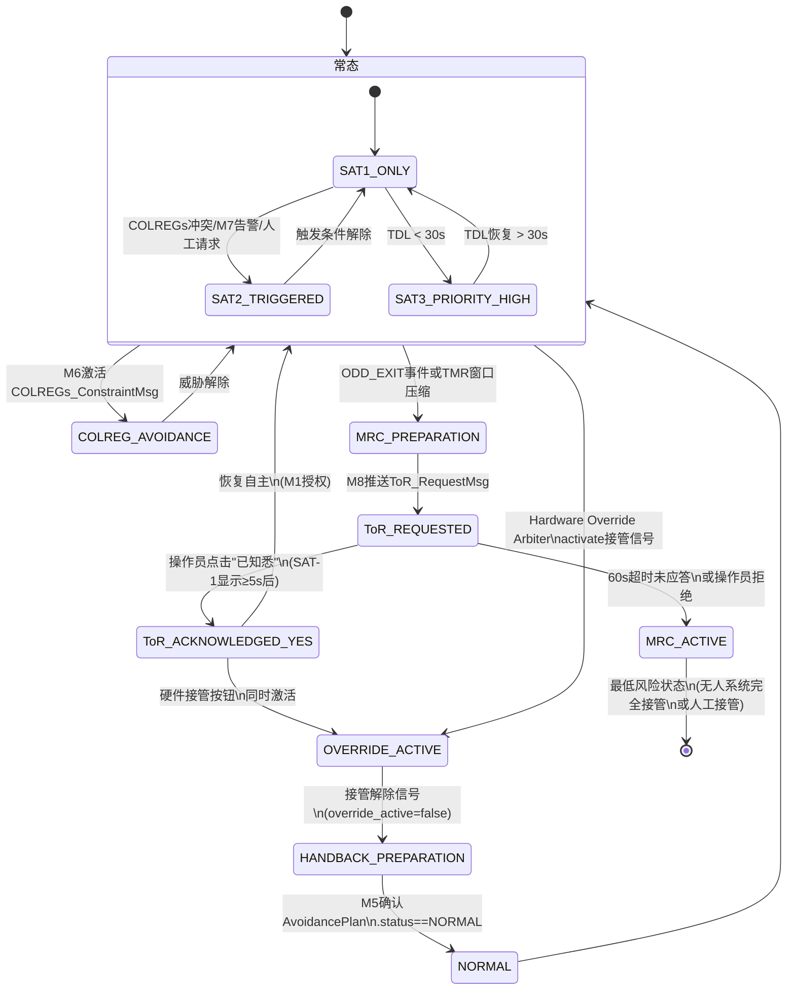

# M8 HMI/Transparency Bridge 详细功能设计

| 属性 | 值 |
|---|---|
| 文档编号 | SANGO-ADAS-L3-DD-M8-001 |
| 版本 | v1.0 |
| 日期 | 2026-05-05 |
| 状态 | 草稿（第一版） |
| 架构基线 | v1.1.1（§12 M8 + §12.4.1 ToR / §11.9 接管 / §15 接口） |
| 上游依赖 | M1 ODD_StateMsg、M2 World_StateMsg、M4 Behavior_PlanMsg、M6 COLREGs_ConstraintMsg、M7 Safety_AlertMsg @ 10 Hz |
| 下游接口 | ROC/Captain UI_StateMsg @ 50 Hz、ToR_RequestMsg、ASDR_RecordMsg |

---

## 1. 模块职责（Responsibility）

**M8 HMI/Transparency Bridge** 是系统中唯一对 ROC（Remote Operation Centre）操作员和船上船长说话的权威实体。核心职责分三层：

1. **SAT 三层透明性聚合与自适应触发**（v1.1.1 §12.2）：
   - SAT-1（现状/What）：全时展示当前自主等级、ODD 子域、威胁列表、执行行为
   - SAT-2（推理/Why）：按需触发（COLREGs 冲突、M7 告警、人工请求时）展示决策理由
   - SAT-3（预测/What Next）：基线显示，当 TDL < 30 s 时自动优先推送 + 加粗显示

2. **责任移交协议（Transfer of Responsibility, ToR）实现**（v1.1.1 §12.4 + §12.4.1）：
   - 当系统 TDL 触发或人工请求时，推送 60 秒时窗（[R4] Veitch 2024 实证基线）的接管请求
   - 实现"已知悉 SAT-1"交互验证机制（操作员主动点击按钮），满足 IMO MASS Code "有意味的人为干预" 法律要求（F-NEW-004 关闭）
   - 完整 ASDR 记录包括按钮点击时间戳、显示时长、关键字段可见性

3. **接管期间与回切 UI 状态机**（v1.1.1 §11.9 + §11.9.1 + §11.9.2）：
   - 接管期间：实时显示 M7 降级告警（< 100 ms 时延）、通信链路状态、新威胁告警
   - 回切顺序：显示 M7 启动 → 100 ms → M5 启动的顺序化回切步骤，防止监控真空

4. **差异化视图**（v1.1.1 §12.3）：
   - 角色轴：ROC 操作员（数字量化、完整规则链）vs 船上船长（直觉可视化、摘要）
   - 场景轴：常态 Transit（简化）vs 冲突 COLREGs_Avoidance（SAT-2 展开）vs MRC（SAT-3 最高优先）

**设计哲学**：确保"谁在控制"的答案在任何时刻都是唯一且可审计的。

---

## 2. 输入接口（Input Interfaces）

### 2.1 消息列表

| 消息 | 来源 | 频率 | 必备字段 | 容错处理 |
|---|---|---|---|---|
| **SAT_DataMsg** | M1, M2, M4, M6, M7 | 10 Hz | stamp, source_module, sat1/sat2/sat3 | 消息丢失 ≥ 3 帧：告警"传感数据中断" |
| **ODD_StateMsg** | M1 | 1 Hz + 事件 | stamp, current_zone, auto_level, conformance_score, tmr_s, tdl_s | ODD_EDGE → OUT 变化立即补发；状态快照 ≥ 1 帧 |
| **Safety_AlertMsg** | M7 | 事件 | stamp, type, severity, recommended_mrm | 告警丢失触发 ASDR 标记为异常 |
| **ToR 触发信号** | M1 / 外部人工请求 | 事件 | TDL ≤ TMR 或 Manual_Request 事件 | 触发请求失败重试最多 3 次 |
| **OverrideActiveSignal** | Hardware Override Arbiter | 事件 | stamp, override_active, activation_source | 信号丢失 ≥ 100 ms 触发告警 |

### 2.2 输入数据校验

**时间戳一致性**：所有来自 M1–M7 的消息须包含 ROS2 / DDS 标准时间戳；M8 在聚合时对比消息年龄，若某模块消息年龄 > 1 秒，标记为"陈旧"并在 UI 中灰显

**置信度阈值**：
- SAT-1 威胁列表显示：仅包含 confidence ≥ 0.7 的目标
- SAT-2 规则依据展示：仅当 M6 confidence ≥ 0.8 时显示完整规则链，否则显示"规则推理置信度不足"

**ODD 越界检测**：M1 若报 current_zone == OUT，M8 立即切换到 MRC 视图（不等待下一帧）

**通信延迟检测**：
- M1 → M8 延迟 > 500 ms：显示"ODD 更新延迟" 橙色告警
- M2 → M8 延迟 > 1 s：显示"世界模型陈旧" 橙色告警
- M7 → M8 延迟 > 200 ms：显示"安全监控延迟" 红色告警

**缺失/超时处理**：
- 若 M7 消息连续丢失 ≥ 2 帧：假设 M7 失效，显示"安全监督失效" 红色高优先级告警，禁止 D3/D4（强制降级到 D2）
- 若 M2 消息连续丢失 ≥ 5 帧：显示"感知系统降级"，禁止新的 COLREGs 决策

---

## 3. 输出接口（Output Interfaces）

### 3.1 消息列表

| 消息 | 订阅者 | 频率 | 主要内容 | SLA |
|---|---|---|---|---|
| **UI_StateMsg** | ROC/Captain HMI 工作站 | 50 Hz | 渲染就绪的完整 UI 数据（SAT-1/2/3、警告、接管状态）| 端到端时延 ≤ 100 ms |
| **ToR_RequestMsg** | ROC 操作员（事件驱动）| 事件 | 接管请求、60 s 时窗、推荐动作、SAT-1 上下文摘要 | 首次推送 ≤ 200 ms；超时内重推最多 2 次 |
| **ASDR_RecordMsg** | ASDR（决策追溯）| 事件 + 2 Hz | ToR 事件、按钮点击、接管/回切时序、M7 降级告警、UI 状态切换 | 时间戳精度 ≤ 1 ms；SHA-256 签名 |

### 3.2 输出 SLA

**UI_StateMsg @ 50 Hz**：
- 发布周期：20 ms（来自聚合逻辑，不直接透传 10 Hz 输入）
- 消息体大小：典型 8–12 KB（JSON 序列化），支持 DDS 标准网络传输
- 数据新鲜度：M8 收到各模块 SAT_DataMsg 后，聚合至 UI_StateMsg 的时延 ≤ 50 ms（要求实现缓冲与插值）
- 可靠性：DDS RELIABLE 模式；丢包重传配置

**ToR_RequestMsg 事件**：
- 推送延迟：M1 报 TDL 触发后 ≤ 200 ms 内 M8 推送 ToR_RequestMsg
- 重推机制：若 ROC 未在 30 s 内应答，M8 自动重推一次；若 60 s 时窗到期仍未应答，自动触发 MRC 准备 + 多通道紧急告警
- 多通道冗余：ToR 同时通过主 DDS 通道 + 备用通信链路（若配置有）+ 蜂鸣 / 闪烁告警

**ASDR_RecordMsg**：
- 事件触发：ToR 推送、按钮点击、接管激活、回切开始等瞬间事件，每个事件立即发送（不等周期）
- 周期记录：每 500 ms 发送一次 UI 状态快照（用于事后 UI 行为复现）
- 签名：所有 ASDR 记录须包含 SHA-256(timestamp + source_module + decision_json)，防篡改

---

## 4. 内部状态（Internal State）

### 4.1 状态变量

```python
class M8_State:
    # 当前视图上下文
    active_role: ActiveRole = manifest.primary_role  # PRIMARY_ON_BOARD | PRIMARY_ROC | DUAL_OBSERVATION（双 ack 协议）
    # 角色切换：PRIMARY ↔ PRIMARY 单 ack；任何涉及 DUAL_OBSERVATION 的转移需两名不同操作员 ack
    # 实现：src/m8_hmi_bridge/active_role.py ActiveRoleStateMachine
    active_scenario: Enum[TRANSIT, COLREG_AVOIDANCE, MRC_PREPARATION, MRC_ACTIVE, OVERRIDE_ACTIVE] = TRANSIT
    
    # SAT 聚合缓冲
    latest_sat1_data: Dict[str, Any]  # {sat1_from_M1, sat1_from_M2, sat1_from_M4, sat1_from_M6, sat1_from_M7}
    latest_sat2_data: Dict[str, Any]  # 仅在触发条件满足时填充
    latest_sat3_data: Dict[str, Any]  # {cpa_trend, tcpa_forecast, uncertainty_dist, recovery_time_s}
    sat1_display_since_s: float       # SAT-1 面板持续显示时长（单位秒，用于 ToR 验证）
    
    # ToR 协议状态机
    tor_active: bool = False
    tor_started_time_s: float         # ToR 推送时刻（相对系统启动）
    tor_deadline_s: float = 60.0      # Veitch 2024 实证基线
    tor_acknowledgment_button_enabled: bool = False  # SAT-1 显示 ≥ 5 s 后启用
    tor_acknowledgment_clicked: bool = False
    tor_acknowledgment_time_s: Optional[float] = None
    tor_sat1_threats_visible: List[str] = []  # 点击时刻的可见威胁列表
    tor_odd_zone_at_click: str = ""   # 点击时刻的 ODD 子域
    tor_conformance_score_at_click: float = 0.0
    
    # 接管模式状态
    override_active: bool = False
    override_started_time_s: Optional[float] = None
    m7_degradation_alert: Optional[str] = None  # 接管期间 M7 监测的降级告警（< 100 ms 显示时延）
    m7_ready_signal_received: bool = False      # 用于回切顺序协调（§11.9.2）
    m5_resume_signal_sent: bool = False
    
    # 连接与健康
    module_heartbeat_age_s: Dict[str, float]  # {M1, M2, M4, M6, M7} 最后一帧接收时间
    communication_link_status: Enum[OK, DEGRADED, CRITICAL_LATENCY] = OK
    roe_workstation_connected: bool = False
```

### 4.2 状态机（如适用）

**M8 主状态机**（见下方 Mermaid 图）

**ToR 状态子机**（嵌入主机）：
- **IDLE** → **REQUESTED**（M1 触发或人工请求）
  - 推送 ToR_RequestMsg，启动 60 s 倒计时
  - 启用 SAT-1 面板 ≥ 5 s 后的"已知悉"按钮
- **REQUESTED** → **ACKNOWLEDGED**（操作员点击按钮 OR 60 s 超时）
  - 若点击：ASDR 记录 tor_acknowledgment_clicked = true，切换到 **ACCEPTED**
  - 若超时：ASDR 标记"接管确认超时"，触发 MRC 准备 + 多通道告警
- **ACCEPTED** → **IDLE** 或 **OVERRIDE_ACTIVE**
  - M1 接收到接管授权后，自动回到 IDLE（除非同时激活硬件接管）

**接管模式状态子机**：
- **NORMAL** → **OVERRIDE_REQUESTED**（Hardware Override Arbiter 发 OverrideActiveSignal { override_active=true }）
  - M5 冻结，M7 暂停主仲裁但保留降级监测（§11.9.1）
  - M8 切换到"接管模式" UI，显示 M7 降级告警 + ROC 操作员状态
- **OVERRIDE_ACTIVE** → **HANDBACK_PREPARATION**（OverrideActiveSignal { override_active=false }）
  - M1 进入"回切准备"状态，M7 启动 → 100 ms → M5 启动（§11.9.2）
  - M8 显示顺序化回切进度条：M7_READY(T+100ms) → M5_RESUME(T+110ms)
- **HANDBACK_PREPARATION** → **NORMAL**（M5 确认 AvoidancePlan.status == NORMAL）
  - ASDR 记录"override_released"事件，M8 恢复正常 UI



### 4.3 持久化（哪些状态需 ASDR 记录）

**必须 ASDR 记录的事件**：
1. **ToR 推送事件**（event_type: "tor_requested"）
   - timestamp, reason (ODD_EXIT|MANUAL_REQUEST|SAFETY_ALERT)
   - deadline_s, target_auto_level, context_summary

2. **"已知悉 SAT-1" 按钮点击**（event_type: "tor_acknowledgment_clicked"，F-NEW-004）
   - timestamp, operator_id
   - sat1_display_duration_s（SAT-1 面板实际显示时长）
   - sat1_threats_visible（点击时刻的可见威胁列表）
   - odd_zone_at_click, conformance_score_at_click

3. **接管激活与解除**（event_type: "override_activated" / "override_released"）
   - timestamp, activation_source (manual_button | automatic_trigger)
   - duration_s（若已解除）

4. **回切顺序时序**（event_type: "handback_sequence"，F-NEW-006）
   - T0_stamp (OverrideActiveSignal 接收时刻)
   - T_M7_ready (M7 READY 信号时刻)
   - T_M5_resume (M5 resume 命令时刻)
   - T_M5_normal_plan (M5 首个 NORMAL AvoidancePlan 时刻)
   - 超时保护触发标记（若 M7 未在 100 ms 内启动）

5. **M7 降级告警**（event_type: "m7_degradation_alert"，F-NEW-005）
   - timestamp, alert_type (communication_loss | sensor_degradation | new_threat | m7_fault)
   - displayed_in_override_mode (true|false)
   - alert_cleared_timestamp (若告警已清除)

6. **UI 场景切换**（event_type: "scenario_changed"）
   - timestamp, from_scenario, to_scenario
   - trigger_reason (ODD_change | threat_detection | ...）

---

## 5. 核心算法（Core Algorithm）

### 5.1 SAT 自适应触发算法

**输入**：M1/M2/M4/M6/M7 各模块的 SAT_DataMsg @ 10 Hz

**输出**：M8 聚合的 UI_StateMsg，包含自适应触发后的 SAT-1/2/3 可见性标记

```python
def sat_adaptive_trigger(sat_datamsgs: List[SAT_DataMsg], odd_state: ODD_StateMsg, m7_alert: Optional[Safety_AlertMsg]):
    """
    根据 v1.1.1 §12.2 自适应触发规则
    """
    ui_state = UI_StateMsg()
    
    # SAT-1: 全时展示，无条件刷新
    ui_state.sat1_visible = True
    ui_state.sat1_data = aggregate_sat1(sat_datamsgs)  # M1/M2/M4/M6/M7 的 sat1 合并
    ui_state.sat1_threats = [t for t in ui_state.sat1_data.threats if t.confidence >= 0.7]
    ui_state.sat1_odd_zone = odd_state.current_zone
    ui_state.sat1_conformance_score = odd_state.conformance_score
    
    # SAT-2: 按需触发
    ui_state.sat2_visible = False
    trigger_reasons = []
    
    # 触发条件 (1): COLREGs 冲突检测
    if has_colreg_conflict(sat_datamsgs):  # M6 报冲突 OR CPA 低于阈值
        ui_state.sat2_visible = True
        trigger_reasons.append("colreg_conflict")
    
    # 触发条件 (2): M7 SOTIF 警告
    if m7_alert and m7_alert.type in [SOTIF_ASSUMPTION, PERFORMANCE_DEGRADED]:
        ui_state.sat2_visible = True
        trigger_reasons.append("m7_sotif_warning")
    
    # 触发条件 (3): M7 IEC 61508 故障告警
    if m7_alert and m7_alert.type == IEC61508_FAULT:
        ui_state.sat2_visible = True
        trigger_reasons.append("m7_iec_fault")
    
    # 触发条件 (4): 操作员显式请求
    # （通过 ROC UI 前端设置标记位）
    if operator_requested_sat2():
        ui_state.sat2_visible = True
        trigger_reasons.append("operator_request")
    
    ui_state.sat2_data = aggregate_sat2(sat_datamsgs) if ui_state.sat2_visible else {}
    ui_state.sat2_trigger_reasons = trigger_reasons
    
    # SAT-3: 基线展示 + 优先级提升
    ui_state.sat3_visible = True  # 始终基线展示
    ui_state.sat3_data = aggregate_sat3(sat_datamsgs)
    
    # TDL < 30 s: 自动优先级提升
    if odd_state.tdl_s < 30.0:
        ui_state.sat3_priority_high = True  # UI 前端加粗、全屏显示
        ui_state.sat3_alert_color = "bold_red"
    else:
        ui_state.sat3_priority_high = False
        ui_state.sat3_alert_color = "normal"
    
    return ui_state
```

**关键设计点**：
- SAT-2 触发条件不是"包含关系"（满足任一即显示），避免过度信息轰炸
- 若在常态 Transit 中 SAT-2 已触发后威胁解除，SAT-2 自动隐藏（触发条件清除）
- SAT-3 优先级提升采用"阈值突跳"（TDL 30 s 是量化分界），而非平滑渐进，确保 ROC 注意力快速转移

### 5.2 数据流

```
M1 (ODD_StateMsg)  ┐
M2 (World_StateMsg) ├─→ [SAT 聚合] ──→ [自适应触发] ──→ [角色/场景] ──→ [UI 序列化] ──→ UI_StateMsg @ 50 Hz
M4 (Behavior_PlanMsg) │
M6 (COLREGs_ConstraintMsg) │
M7 (Safety_AlertMsg) ┘

ToR 触发（M1.TDL触发或人工请求）
    ↓
[ToR 时序验证] ──→ [SAT-1 显示 ≥ 5 s ?] ──→ [启用"已知悉"按钮]
                                ↓ Yes
                        [操作员点击?]  [60 s 超时?]
                           ↙  ↘
                       Yes    No → [MRC 准备]
                       ↓
                   [ASDR: tor_acknowledgment_clicked]
                       ↓
                    [M1 授权接管或MRC]

接管激活（OverrideActiveSignal { override_active=true }）
    ↓
[冻结 M5 / 暂停 M7 主仲裁]
    ↓
[M7 降级监测线程 @ 100 Hz] ──→ [< 100 ms 显示到 M8] ──→ [红色告警标志]
    ├─ 通信链路 RTT > 2 s
    ├─ 传感器 DEGRADED
    ├─ 新威胁 CPA < 阈值
    └─ M7 心跳丢失

接管解除（OverrideActiveSignal { override_active=false }）
    ↓
[回切顺序 (§11.9.2)]
    ├─ T+0 ms: M1 进入"回切准备"
    ├─ T+10 ms: M7 启动，发 M7_READY
    ├─ T+100 ms: M7 心跳确认，向 M1 发"M7_READY"
    ├─ T+110 ms: M1 向 M5 发"M5_RESUME"
    └─ T+120 ms: M5 输出 NORMAL AvoidancePlan
                   ↓
               [ASDR: handback_sequence]
               [M8 显示回切进度条]
```

### 5.3 关键参数（含 [HAZID 校准] 标注）

| 参数 | 值 | 单位 | 来源 | 备注 |
|---|---|---|---|---|
| **ToR 时间窗口** | 60.0 | s | [R4] Veitch 2024 | ROC 操作员最大反应时间实证基线 [HAZID 校准] |
| **SAT-1 最小显示时长** | 5.0 | s | v1.1.1 F-NEW-004 | 点击"已知悉"按钮前的强制等待（防止未读直接点） |
| **M7 降级告警显示延迟** | < 100 | ms | v1.1.1 F-NEW-005 | 接管期间红色告警显示到 UI 的最大时延 |
| **M7 启动确认超时** | 100 | ms | v1.1.1 §11.9.2 | 回切中 M7 未在此时间内发 READY 则触发 D2 降级 |
| **M5 恢复确认超时** | 20 | ms | v1.1.1 §11.9.2 | M5 在此时间内应输出 NORMAL status AvoidancePlan，否则触发 MRC |
| **SAT-3 优先级提升阈值** | 30.0 | s | v1.1.1 §12.2 | TDL < 此值时自动加粗、全屏 SAT-3 预测 [HAZID 校准] |
| **威胁显示置信度门槛** | 0.7 | — | 模块设计 | SAT-1 列表仅显示 confidence ≥ 此值的目标 [HAZID 校准] |
| **规则链显示置信度门槛** | 0.8 | — | 模块设计 | M6 confidence < 此值时显示"推理置信度不足" [HAZID 校准] |
| **通信延迟告警阈值** | M1: 500, M7: 200 | ms | 网络设计 | 超过此值显示橙/红色延迟警告 [HAZID 校准] |
| **M7 消息丢失告警** | 2 帧连续丢失 | — | 故障树 | ≥ 2 帧无 M7 消息则假设 M7 失效 [HAZID 校准] |
| **M2 消息丢失禁止决策** | 5 帧连续丢失 | — | 故障树 | ≥ 5 帧无 M2 消息则禁止新 COLREGs 决策 [HAZID 校准] |

### 5.4 复杂度分析（时间 + 空间）

**时间复杂度**：
- SAT 聚合：O(M) 其中 M = 模块数（5–7 个），每个模块贡献 O(1) 常数工作
- 自适应触发检查：O(4) （4 个触发条件的逻辑判断）
- 威胁列表过滤：O(N) 其中 N = 目标数（典型 ≤ 20），线性遍历置信度阈值
- **总 SAT 处理**：O(N)，< 1 ms（基于 1 GHz CPU @ 10 Hz 周期）

**空间复杂度**：
- UI_StateMsg 缓冲：O(N + M)，典型 8–12 KB
- SAT-1/2/3 聚合缓冲：O(N)，最多 3–5 KB
- ToR 状态变量：O(1)，< 100 B
- ASDR 事件队列：O(E)，其中 E = 待写入事件数（流式处理，峰值 ≤ 10 事件/秒）
- **总内存占用**：< 50 MB（单个 M8 进程，包括 ROS2/DDS 运行时开销）

**实时性保证**：
- SAT 10 Hz 聚合 + 自适应触发：< 5 ms 处理时延
- UI 序列化 @ 50 Hz：每帧 20 ms，处理 + 序列化 + 网络发送 ≤ 100 ms 端到端（包括网络传输）

---

## 6. 时序设计（Timing Design）

### 6.1 周期任务

| 任务 | 周期 | 优先级 | 触发条件 | 备注 |
|---|---|---|---|---|
| **SAT 聚合 + 自适应触发** | 10 Hz | HIGH | 任一模块发送 SAT_DataMsg | 同步订阅，收齐最新消息后立即计算 |
| **UI 序列化** | 50 Hz | MEDIUM | 定时器，每 20 ms | 使用聚合后的 SAT 数据；若聚合未更新则复用前一帧 |
| **ToR 倒计时** | 2 Hz | HIGH | ToR 激活后 | 每 500 ms 检查是否超过 60 s；超时则自动触发 MRC 准备 |
| **M7 降级监测显示** | 100 Hz | CRITICAL | 接管激活后 | 独立线程监听 Safety_AlertMsg；< 100 ms 延迟更新 UI（*不追求形式*上 100 Hz，而是确保时延 < 100 ms） |
| **ASDR 事件记录** | 事件 + 2 Hz | MEDIUM | 事件触发或周期 | 事件立即发送；周期记录为 UI 快照备份 |
| **模块健康监控** | 1 Hz | LOW | 定时器 | 检查各模块消息年龄（M1/M2/M4/M6/M7）；若 > 1 s 则标记陈旧 |

### 6.2 事件触发任务

| 事件 | 响应动作 | 最大时延 |
|---|---|---|
| **ToR 触发信号（M1 TDL ≤ TMR）** | 推送 ToR_RequestMsg + 启动 SAT-1 计时器 | ≤ 200 ms |
| **"已知悉 SAT-1" 按钮点击** | ASDR 记录 + M1 授权接管或 MRC 准备 | ≤ 500 ms |
| **60 s ToR 超时** | 自动触发 MRC 准备 + 多通道告警 | ≤ 1 s |
| **OverrideActiveSignal 接收** | 冻结 M5 / 显示接管 UI / 启动 M7 降级监测 | ≤ 100 ms |
| **M7 降级告警（接管中）** | 红色告警标志 + M7 降级监测内容 | ≤ 100 ms |
| **回切信号（override_active=false）** | 显示顺序化回切进度 + T0 时刻记录 | ≤ 50 ms |
| **M7 READY 信号（回切 T+100 ms）** | 标记"M7 已启动" + ASDR 记录 | ≤ 100 ms |
| **M5 RESUME 命令（回切 T+110 ms）** | 标记"M5 恢复中" + ASDR 记录 | ≤ 110 ms |
| **M5 首个 NORMAL AvoidancePlan（T+120 ms）** | 标记回切完成 + 恢复正常 UI | ≤ 120 ms |

### 6.3 延迟预算

**端到端路径**：M1–M7 SAT_DataMsg @ 10 Hz → M8 聚合 → UI_StateMsg @ 50 Hz → ROC HMI 渲染

```
M1–M7 发送     SAT @ 10 Hz          消息队列延迟 (DDS)    M8 聚合 + 自适应触发
     0 ms   ──→  (周期 100 ms)  ──→  (典型 20–50 ms)  ──→  (处理 < 5 ms)
                                                            ↓
                                                      UI 序列化 @ 50 Hz
                                                      (缓冲延迟 ≤ 20 ms)
                                                            ↓
                                               网络传输 + ROC HMI 接收
                                               (Ethernet RTT < 20 ms)
                                                            ↓
                                                  HMI 渲染 (< 30 ms)
                                                     ──────────────
                                                   总延迟 ≤ 100 ms
```

**ToR 推送延迟预算**：
```
M1 TDL 触发   SAT 聚合 @ 10 Hz   M8 推送 ToR_RequestMsg   网络传输
     0 ms   ──→  (最坏 100 ms)  ──→  (< 50 ms)  ────→  (< 50 ms)
                                                            ↓
                                                   ROC 接收 + 显示
                                                      最大 200 ms
```

**接管期间 M7 降级告警显示**：
```
M7 降级事件   Safety_AlertMsg      M8 接收 + 显示   M8 → UI
     0 ms   ──→  (< 10 ms)  ───→  (< 50 ms)  ──→  (< 100 ms 端到端)
```

**回切顺序时序**：
```
T0: OverrideActiveSignal { override_active=false }
T+0 ms:   M1 进入回切准备（无延迟）
T+10 ms:  M7 启动，发 M7_READY
T+100 ms: M7 心跳确认，M1 验证
T+110 ms: M1 向 M5 发 M5_RESUME 命令
T+120 ms: M5 输出首个 NORMAL AvoidancePlan
T+150 ms: ASDR 记录"override_released"事件
```

---

## 7. 降级与容错（Degradation & Fault Tolerance）

### 7.1 降级路径（DEGRADED / CRITICAL / OUT-of-ODD）

| 状态 | 触发条件 | M8 行为 | 用户 UI 变化 |
|---|---|---|---|
| **NORMAL** | 所有模块 OK，ODD 内 | SAT-1 全展示 + 自适应 SAT-2/3 | 标准界面，绿色指示 |
| **DEGRADED** | M2/M4/M6 消息 1–2 帧丢失 OR 通信延迟 > 500 ms | SAT-1 灰显陈旧标记，SAT-2/3 禁用 | 显示"世界模型/决策延迟"橙色告警 |
| **DEGRADED** | M7 消息 1 帧丢失 | 保持 SOTIF 告警显示，但禁止 SAT-2"规则链" | 显示"安全监控延迟"橙色告警 |
| **CRITICAL** | M2 消息连续 5 帧丢失 | SAT-1 显示"感知系统失效"，禁止新 COLREGs 决策 | 红色告警 + 接管建议 |
| **CRITICAL** | M7 消息连续 2 帧丢失 | 假设 M7 失效，自动切换 D2 | 红色"安全监督失效"高优先级告警 + 禁止 D3/D4 |
| **OUT-of-ODD** | M1 报 ODD_EXIT 或 Conformance_Score < 0.1 | 立即切换 MRC 视图，禁用所有自主模式 | 全屏红色 MRC 通知 + 倒计时 |

### 7.2 失效模式分析（FMEA — 与 §11 M7 对齐）

**参考架构文档 §11.3 假设违反清单**；M8 在以下失效时的行为：

| 失效模式 | 假设违反 | M8 检测 | M8 降级响应 |
|---|---|---|---|
| **M1 ODD 计算异常** | "ODD 判断总是正确" | M1 消息缺失 OR ODD_EXIT 突变 | M8 立即显示 MRC 准备视图 + 多通道告警 |
| **M2 目标追踪失败** | "World Model 中目标状态准确" | M2 消息 ≥ 5 帧丢失 OR confidence 全部 < 0.5 | "感知系统降级" + 禁止新避让决策 + 提示手动接管 |
| **M6 COLREGs 规则库错误** | "规则推理逻辑正确" | M6 输出与 M2 CPA 产生矛盾（如"船为让路船"但自身 CPA 递减）| SAT-2 显示"规则冲突"警告；建议采用保守 MPC 策略 |
| **M7 SOTIF 失效** | "M7 能检测假设违反" | M7 消息 ≥ 2 帧丢失 | 禁止 D3/D4；显示"安全监督失效"红色高优先级告警 |
| **通信链路中断** | "L3 ↔ ROC 链路可用" | RTT > 2 s 或丢包 > 50% 持续 5 s | CRITICAL：接管时窗倒计时 ≥ 30 s + 多通道告警 |
| **ROC 工作站掉线** | "操作员能接收 ToR" | 无 UI_StateMsg 确认 3 s | 多通道告警（蜂鸣 / 闪烁 / SMS 备用通道） |
| **ToR 确认超时** | "操作员 60 s 内能响应" | 60 s 窗口到期且未点击按钮 | 自动触发 MRC 准备；记录"操作员失响应"ASDR |
| **接管期间 M5 冻结失败** | "M5 在接管中停止规划" | M5 继续输出 AvoidancePlan（status != NORMAL）| M8 显示"规划模块未冻结"红色故障告警 + 禁止接管操作 |
| **回切顺序异常** | "M7 先于 M5 启动" | 回切时 M7 READY 未在 T+100 ms 收到 | 自动撤销接管 + 触发 MRC 准备 + ASDR "回切失败" |

### 7.3 心跳与监控

**M8 心跳自身**：由 M1 和 X-axis Checker 共同监控
- 应发送 UI_StateMsg @ 50 Hz；若缺失 ≥ 5 帧（100 ms），假设 M8 失效
- 若 M8 失效，ROC 工作站应收到备用通知 + 本地接管界面激活

**模块心跳监控**（M8 订阅）：
```python
module_heartbeat_age_s = {
    "M1": time.now() - last_odd_msg.stamp,
    "M2": time.now() - last_world_msg.stamp,
    "M4": time.now() - last_behavior_msg.stamp,
    "M6": time.now() - last_colreg_msg.stamp,
    "M7": time.now() - last_safety_msg.stamp,  # 若 ≥ 2 s，假设 M7 失效
}

for module, age in module_heartbeat_age_s.items():
    if age > HEARTBEAT_TIMEOUT[module]:
        trigger_degradation(module, age)
```

| 模块 | 心跳超时 | 自动响应 |
|---|---|---|
| M1 | 2 s | 冻结状态机 + "ODD 监控超时" |
| M2 | 1 s | 禁止新决策 + "感知系统超时" |
| M4 | 1 s | 使用前一行为 + "行为仲裁延迟" |
| M6 | 1 s | 禁用 COLREGs 约束 + "规则引擎超时" |
| M7 | 2 s | **必须降级到 D2** + "安全监督失效"红色告警 |

---

## 8. 与其他模块协作（Collaboration）

### 8.1 与上下游模块的握手

**M8 订阅（输入）**：
- M1：ODD_StateMsg @ 1 Hz + 事件补发；握手：M8 每 100 ms 验证接收
- M2：SAT_DataMsg（含 world state）@ 10 Hz；握手：M8 缓冲聚合
- M4/M6：SAT_DataMsg @ 10 Hz；握手：同上
- M7：Safety_AlertMsg（事件）+ SAT_DataMsg（@ 10 Hz）；握手：M8 双通道订阅

**M8 发布（输出）**：
- ROC HMI：UI_StateMsg @ 50 Hz（单向 publish-subscribe，无握手）
- 系统层 L3 → L2：通过 M3 中转（M8 不直接发往 L2）
- ASDR：ASDR_RecordMsg（事件 + 2 Hz）；握手：ASDR 发送 ACK 确认（可选，建议实现）

### 8.2 SAT-1/2/3 输出（详见 §12.2 M8）

**SAT-1（What is happening now）— 全时展示**：
```json
{
  "current_auto_level": "D3",
  "odd_zone": "ODD_B",
  "conformance_score": 0.78,
  "tmr_s": 45.2,
  "tdl_s": 120.0,
  "threats": [
    {"target_id": 42, "cpa_m": 850, "tcpa_s": 240, "aspect": "head_on", "confidence": 0.92},
    {"target_id": 57, "cpa_m": 1200, "tcpa_s": 480, "aspect": "crossing", "confidence": 0.87}
  ],
  "current_behavior": "TRANSIT",
  "timestamp": "2026-05-05T10:23:45.123Z"
}
```

**SAT-2（Why this decision）— 按需触发**：
```json
{
  "colreg_rule_active": "Rule 15 (Head-on)",
  "rule_basis": "Own ship to port, target ship to starboard, both on collision course",
  "ivp_arbiter_status": "behavior_constrained_to_starboard_avoidance",
  "mid_mpc_cost_breakdown": {
    "safety_term": 0.65,
    "efficiency_term": 0.20,
    "comfort_term": 0.15
  },
  "m7_sotif_status": "active_monitoring",
  "m7_assumption_status": [
    {"id": "comm_link_ok", "status": "satisfied"},
    {"id": "target_intent_detectable", "status": "uncertain"}
  ],
  "timestamp": "2026-05-05T10:23:45.456Z"
}
```

**SAT-3（What will happen next）— 优先级可调**：
```json
{
  "cpa_trend_5min": [850, 780, 690, 580, 420],  # m，每 60 s 采样点
  "tcpa_forecast": [240, 200, 160, 120, 60],     # s
  "recovery_time_to_safe_cpa_s": 480,
  "uncertainty_distribution": {
    "cpa_sigma_m": 120,
    "tcpa_sigma_s": 45,
    "target_intent_entropy": 0.8  # [0, 1] 越高越不确定
  },
  "tor_window_estimated_s": 45,  # 预计需要接管的剩余时间
  "priority": "high"  # SAT-3 优先级（TDL < 30 s 时为 high）
  "timestamp": "2026-05-05T10:23:45.789Z"
}
```

### 8.3 ASDR 决策追溯日志格式

完整的 ASDR_RecordMsg 样例（ToR & 按钮点击事件）：

```json
{
  "event_type": "tor_acknowledgment_clicked",
  "timestamp": "2026-05-05T10:24:32.456Z",
  "source_module": "M8_HMI_Bridge",
  "operator_id": "ROC-OP-001",
  "decision_type": "tor_acknowledgment",
  "decision_json": {
    "tor_requested_at_s": 10.123,
    "tor_reason": "ODD_EXIT",
    "tor_deadline_s": 60.0,
    "sat1_display_duration_s": 12.5,
    "sat1_threats_visible": ["target_42", "target_57"],
    "odd_zone_at_click": "ODD_B",
    "conformance_score_at_click": 0.72,
    "button_click_at_s": 22.623,
    "button_click_latency_from_tor_request_s": 12.5,
    "sat1_display_ended_at_s": 22.623
  },
  "source_module": "M8",
  "signature": "sha256_ABCD1234..."
}
```

**接管事件**：
```json
{
  "event_type": "override_activated",
  "timestamp": "2026-05-05T10:24:45.000Z",
  "source_module": "M8",
  "decision_json": {
    "activation_source": "manual_button",
    "operator_id": "ROC-OP-001",
    "m1_auto_level_at_activation": "D3",
    "m5_frozen": true,
    "m7_sotif_paused": true,
    "m7_degradation_monitoring_active": true
  },
  "signature": "sha256_EFGH5678..."
}
```

**回切事件**：
```json
{
  "event_type": "handback_sequence",
  "timestamp": "2026-05-05T10:25:00.000Z",
  "source_module": "M8",
  "decision_json": {
    "override_release_signal_received_at_s": 240.000,
    "m1_handback_prep_at_s": 240.000,
    "m7_startup_signal_at_s": 240.010,
    "m7_ready_signal_received_at_s": 240.100,
    "m7_ready_latency_ms": 90,
    "m5_resume_command_sent_at_s": 240.110,
    "m5_first_normal_plan_at_s": 240.120,
    "handback_total_duration_s": 0.120,
    "handback_status": "success",
    "asdr_record_written_at_s": 240.150
  },
  "signature": "sha256_IJKL9012..."
}
```

---

## 9. 测试策略（Test Strategy）

### 9.1 单元测试

| 被测单元 | 测试用例 | 验证条件 |
|---|---|---|
| **SAT 聚合** | 5 个模块消息缺失一个 → 聚合仍正常 | 缺失模块的 SAT 显示"陈旧"标记 |
| **自适应触发** | COLREGs 冲突检测 → SAT-2 触发 | SAT-2 visible = true |
| | M7 SOTIF 告警 → SAT-2 触发 | SAT-2 trigger_reasons 包含"m7_sotif_warning" |
| | TDL < 30 s → SAT-3 优先级提升 | SAT-3 priority_high = true, color = "bold_red" |
| | 威胁置信度 < 0.7 → 从列表删除 | sat1_threats 仅包含 confidence >= 0.7 的目标 |
| **ToR 协议** | 时间超时 60 s → MRC 准备 | tor_active = false，M1 收到 MRC 触发信号 |
| | SAT-1 显示 < 5 s → 按钮不可点 | tor_acknowledgment_button_enabled = false |
| | SAT-1 显示 ≥ 5 s → 按钮可点 | tor_acknowledgment_button_enabled = true |
| | 按钮点击 → ASDR 记录 | ASDR_RecordMsg { event_type: "tor_acknowledgment_clicked" } 发送 |
| **接管模式** | OverrideActiveSignal 接收 → UI 切换 | 显示"接管模式"面板 + M5 状态冻结标记 |
| | M7 降级告警 < 100 ms 显示 | M7 Safety_AlertMsg 到 UI 显示的延迟 ≤ 100 ms |
| | 回切序列 T+100 ms M7_READY | ASDR 记录时间戳；若 > 100 ms 触发超时 |
| | 回切序列 T+110 ms M5_RESUME | ASDR 确认 M1 向 M5 的命令发送时刻 |
| **容错** | M2 消息丢失 5 帧 → 禁止决策 | "感知系统降级"告警；SAT-2 禁用 |
| | M7 消息丢失 2 帧 → D2 降级 | 自动降级到 D2，禁止 D3/D4 |
| | 通信延迟 > 500 ms → 橙色告警 | 显示"通信延迟"橙色告警 |

### 9.2 模块集成测试

**场景 1：常态 Transit 中自适应 SAT 触发**
- 输入：M1/M2/M4/M6/M7 连续输出正常 SAT_DataMsg（10 Hz）
- 验证：
  - SAT-1 始终显示（绿色）
  - SAT-2 默认隐藏
  - SAT-3 显示但非加粗
  - UI_StateMsg @ 50 Hz 无故障

**场景 2：COLREGs 冲突中 SAT-2 按需触发**
- 输入：M6 检测到 Rule 15 冲突，confidence 0.85
- 验证：
  - SAT-2 自动触发
  - SAT-2 显示"Rule 15: Head-on"、IvP 仲裁摘要
  - 冲突解除（威胁 CPA 增加）后 SAT-2 自动隐藏

**场景 3：TDL 压缩 < 30 s，SAT-3 优先级提升**
- 输入：M1 报 tdl_s = 25.0
- 验证：
  - SAT-3 加粗、全屏显示
  - 显示 5 分钟 CPA/TCPA 趋势
  - UI 中 SAT-3 显示为红色警告级别

**场景 4：ToR 协议全流程**
- 输入序列：
  1. M1 报 TDL ≤ TMR（触发 ToR）
  2. M8 推送 ToR_RequestMsg（t=0）
  3. SAT-1 连续显示 5 s（t=0 → 5）
  4. 操作员点击按钮（t=7）
  5. 系统切换到 D2 或 MRC
- 验证：
  - t ∈ [0, 5) 时"已知悉"按钮灰显
  - t ∈ [5, 60) 时按钮蓝色可点
  - 点击 ASDR 记录含 sat1_display_duration_s = 7.0
  - 若 t=60 s 仍未点击，自动触发 MRC 准备

**场景 5：接管激活与 M7 降级告警**
- 输入：
  1. OverrideActiveSignal { override_active=true }（t=0）
  2. M7 检测到通信链路 RTT > 2 s（t=10）
- 验证：
  - t=0 时 M5 冻结标记、M7 主仲裁暂停标记出现
  - t=10 时红色"通信链路中断"告警 < 100 ms 显示
  - M7 降级监测线程继续输出，但不下发 MRM 命令

**场景 6：接管回切顺序化（F-NEW-006）**
- 输入：OverrideActiveSignal { override_active=false }（t=0）
- 时序验证：
  - t+10 ms：M7 启动，发 M7_READY（允许偏差 ±10 ms）
  - t+100 ms：M1 收到 M7_READY，发送 M5_RESUME（允许偏差 ±10 ms）
  - t+120 ms：M5 输出 NORMAL AvoidancePlan（允许偏差 ±10 ms）
  - ASDR 记录回切序列，若任一步超时 > 20 ms 标记"回切延迟"警告

### 9.3 HIL 测试场景

**场景 A：多船追踪下的避让协调**
- 初始条件：自身D3自主模式，编队中3艘目标船
- 事件序列：
  1. t=0 s：2 号船突然转向自身前方（CPA 降至 0.5 nm）
  2. t=10 s：3 号船报告通信异常（消息丢失）
  3. t=20 s：ROC 操作员请求接管
  4. t=30 s：1 号船靠近，系统优先显示 SAT-3（TDL 压缩）
  5. t=35 s：操作员点击"已知悉"，确认接管
  6. t=40 s：操作员完成手动操作，发起回切
  7. t=45 s：系统完成 M7→M5 顺序化回切
- 验证指标：
  - t ∈ [10, 20) SAT-2 持续展示（冲突 + 通信降级）
  - t ∈ [30, 40) SAT-3 全屏加粗显示
  - t=35 时 ASDR 记录点击，sat1_display_duration_s ≈ 15 s
  - 回切耗时 ≤ 150 ms，无 M5/M7 启动异常

**场景 B：接管期间通信中断与恢复**
- 初始条件：自身 D4 远程自主，ROC 操作员监控
- 事件序列：
  1. t=0 s：OverrideActiveSignal { override_active=true }（操作员接管）
  2. t=5 s：通信链路 RTT 跳升至 3 s（超过 2 s 阈值）
  3. t=10 s：M8 显示"通信链路中断"红色告警（< 100 ms 响应）
  4. t=30 s：通信恢复，RTT 降至 200 ms
  5. t=35 s：操作员操作完成，发起回切
  6. t=50 s：回切完成，系统恢复自主
- 验证指标：
  - t=5~10 s 红色告警响应时延 < 100 ms
  - t=10~30 s 告警持续显示，操作员可读取当前状态
  - t ∈ [35, 50) 回切进度按 F-NEW-006 时序显示
  - ASDR 记录 4 条事件（接管激活、告警触发、告警解除、回切完成）

**场景 C：透明度悖论验证（SAT 自适应触发）**
- 初始条件：自身 D3 自主，多个低风险目标
- 事件序列：
  1. t=0~10 s：常态 Transit，SAT-1 全展示，SAT-2 隐藏（无冲突）
  2. t=10~20 s：COLREGs 冲突出现，SAT-2 自动触发
  3. t=20~30 s：冲突解除，SAT-2 自动隐藏
  4. t=30 s：TDL 下降至 25 s，SAT-3 优先级提升（加粗）
  5. t=35 s：ToR 触发，SAT-1 必须显示 ≥ 5 s 后才允许点击
  6. t=40 s：操作员点击，接管开始
- 验证指标（人因评估视角）：
  - t ∈ [0, 10) 操作员视野清晰（仅 SAT-1），认知负荷最低
  - t ∈ [10, 20) SAT-2 触发后操作员注意力转移（预期 < 2 s）
  - t ∈ [20, 30) SAT-2 隐藏恢复简洁视图
  - t ∈ [30, 35) SAT-3 加粗不刺眼（与 SAT-1 对比度）
  - t ∈ [35, 40) "已知悉"按钮强制等待 5 s 防止误触

### 9.4 关键 KPI

| KPI | 目标 | 测试方法 |
|---|---|---|
| **SAT-1 显示刷新率** | ≥ 45 fps（50 Hz 发送，考虑网络波动） | 在 HIL 仿真中统计 UI_StateMsg 实际帧率 |
| **ToR 推送延迟** | ≤ 200 ms | M1 TDL 事件到 UI 推送时的端到端延迟测量 |
| **"已知悉"按钮响应** | ≤ 500 ms（点击到 ASDR 记录）| 单元测试 + 点击事件时间戳对比 |
| **60 s ToR 超时准确度** | 误差 ± 100 ms | 定时器精度验证 + 3 次重复测试 |
| **M7 降级告警显示时延** | < 100 ms | 接管模式下 Safety_AlertMsg 到 UI 显示的延迟 |
| **回切顺序时序偏差** | 各阶段 ± 20 ms | ASDR 时间戳对比（T+10/100/110/120 ms 各阶段） |
| **UI 端到端延迟** | ≤ 100 ms（从 M1–M7 数据到 UI 渲染） | 网络嗅探 + 性能分析工具 |
| **内存占用** | < 50 MB | 单进程内存监控（ROS2 node + DDS 运行时） |
| **CPU 占用** | < 20%（单核，1 GHz 基准） | 在覆盖所有场景下的 CPU 占用率统计 |

---

## 10. 实现约束（Implementation Constraints）

### 10.1 编程语言 / 框架

- **推荐语言**：C++（ROS2 Humble 标准）
- **通信中间件**：ROS2 DDS（Fast-RTPS 或 CycloneDDS）
- **序列化格式**：ROS2 IDL（自动生成 C++ 消息类）
- **UI 前端**（范围外）：React / Vue + WebSocket 或 ROS2 web_bridge
- **数据存储**：ASDR 事件写入本地 SQLite（便于离线分析） + 网络备份（NFS / S3）

### 10.2 实时性约束

- **SAT 聚合 @ 10 Hz**：必须在 ≤ 100 ms 内完成（来自 M1–M7 的最新消息 → M8 聚合）
- **UI 序列化 @ 50 Hz**：每帧 20 ms，处理 ≤ 5 ms，序列化 + 网络 ≤ 15 ms
- **M7 降级告警**：接管模式下需 < 100 ms 端到端显示（独立高优先级线程）
- **ToR 推送**：M1 触发后 ≤ 200 ms 推送 ToR_RequestMsg
- **ASDR 记录**：事件立即写入（不等周期），周期快照每 500 ms 一次

**实现策略**：
- 使用 `std::priority_queue` 管理事件优先级（M7 告警 > ToR > 普通事件）
- M7 降级监测独立线程 @ 100 Hz（不共享 SAT 聚合线程）
- 消息缓冲 + 环形队列（ring buffer）减少动态内存分配
- 避免锁竞争：使用无锁数据结构（lock-free queue）或 ROS2 callback-based 调度

### 10.3 SIL / DAL 等级要求

**M8 本身**：ISO 26262 ASIL B / IEC 61508 SIL 2（与 L3 整体同等级）
- **核心安全功能**：ToR 协议（60 s 时窗准确度）、"已知悉"验证（法律有效性）、M7 降级告警显示（< 100 ms）
- **形式化验证范围**：ToR 时序状态机（有限状态集合）、M7 降级监测条件（枚举式判断）
- **不适用形式化验证**：UI 序列化、网络传输（属基础设施）

**软件设计保证**：
- M8 模块代码审查：所有 ToR/接管相关分支必须 100% 代码覆盖
- 单元测试覆盖率 ≥ 95%（除 UI 渲染外）
- 集成测试覆盖所有 ToR/接管状态转移

### 10.4 第三方库约束（避免共享路径，详见决策四独立性）

**允许使用**：
- ROS2 标准库（rclcpp、std_msgs、sensor_msgs）
- Boost（仅时间处理库 boost::timer，避免复杂依赖）
- nlohmann/json（JSON 序列化，CCS 验证友好）
- spdlog（日志库，CCS i-Ship 推荐）

**禁止使用**：
- OpenCV / TensorFlow / PyTorch（属感知层，M8 应无 ML 依赖）
- 与 M1–M7 共享的操纵动力学库（如果存在）
- 内部规则引擎（M6 专属）、MPC 求解器（M5 专属）

**隔离原则**：M8 仅作为聚合与可视化中介，不实现任何算法逻辑。若发现 M8 与其他模块出现代码或库共享，视为架构违反。

---

## 11. 决策依据（References）

| 引用 | 文献 | 章节/结论 | M8 应用 |
|---|---|---|---|
| [R4] | Veitch et al.（2024） Ocean Engineering 299 | ROC 接管时窗 ≥ 60 s 实证基线；可用时间是决策效率最强因子 | ToR 时间窗口 60 s；SAT 自适应触发策略（避免信息过载） |
| [R11] | Chen et al.（ARL-TR-7180，2014） | SAT 三层透明性（What/Why/What Next）经典框架 | SAT-1/2/3 分层设计 |
| [R2] | IMO MASS Code Part 2 Chapter 1 | 系统须能识别 ODD 越界；HMI 须支持"有意味的人为干预" ToR | ODD_EXIT 立即 MRC；ToR 交互验证按钮（F-NEW-004） |
| [R23] | Veitch & Alsos（2022） NTNU Shore Control Lab | "从船长到按钮操作员"认知退化；ROC 效率依赖可用接管时间 | ToR 60 s 时窗 + SAT 优先级分级（反驳"全展示最优"的假设） |
| [R5-aug] | USAARL（2026-02）+ NTNU Handover/Takeover（2024） | 透明度悖论实证：全层同时展示 SAT-2 反而升高认知负荷 | SAT-2 按需触发（4 项条件），不全时展示 |
| v1.1.1 § 12 | 架构文档 | M8 职责、SAT 框架、ToR 协议 | 本设计的上位规范 |
| v1.1.1 § 12.4.1 | 架构文档 | "已知悉 SAT-1" 交互验证机制（F-NEW-004 关闭） | ToR 法律合规的具体实现：点击按钮 = "有意味干预" |
| v1.1.1 § 11.9 / 11.9.1 / 11.9.2 | 架构文档 | 接管期间 M7 降级告警（F-NEW-005）、回切顺序化（F-NEW-006） | 接管 UI 状态机、M7 监测显示 < 100 ms、回切 T+10/100/110/120 ms 时序 |
| v1.1.1 § 15 | 架构文档 | 接口契约总表（消息定义 + 矩阵） | 所有输入/输出消息 IDL 定义与频率 |

---

## 12. 修订记录

| 版本 | 日期 | 修订人 | 变更摘要 |
|---|---|---|---|
| v1.0 | 2026-05-05 | Claude（Agent） | 初稿：完整 12 章节详细设计；基于 v1.1.1 架构；包含 SAT 自适应触发、ToR 交互验证、接管回切时序、HI HIL 场景、测试 KPI |
| v1.0-patch1 | 2026-05-11 | Claude（Agent） | MUST-7: §4.1 active_role 改用 manifest.primary_role；三角色 Enum + 双 ack 协议；删除 ROC_OPERATOR 字面量 |

---

## 附录 A：UI 场景矩阵（角色 × 场景双轴）

| 场景 | ROC 操作员视图 | 船上船长视图 |
|---|---|---|
| **TRANSIT（常态）** | SAT-1 完整（数字）；SAT-2 隐藏；SAT-3 基线显示（非加粗） | SAT-1 简化（可视化 + 图表）；其余隐藏 |
| **COLREG_AVOIDANCE（冲突）** | SAT-1 + SAT-2 完整（规则链 + IvP 摘要）；SAT-3 基线 | SAT-1 + 高层摘要（"正在避让右前方目标"）；SAT-2/3 隐藏 |
| **MRC_PREPARATION（接管准备）** | ToR 请求 + SAT-1（强制 ≥ 5 s 显示）；"已知悉"按钮（5 s 后启用） | 一键接管 + 快速情境总结（"ODD 越界，请接管"） |
| **OVERRIDE_ACTIVE（接管中）** | M7 降级告警实时显示（< 100 ms）；ROC 操作员状态/接管时长；禁止自动命令 | 当前手动控制状态；一键回切 + 警告 |
| **HANDBACK_PREPARATION（回切中）** | 顺序化回切进度（M7_READY → M5_RESUME）；倒计时或进度条 | "系统恢复自主，请监控" + 进度条 |

---

## 附录 B：ASDR 事件类型枚举

```python
ASDR_EventType = {
    "tor_requested": "ToR 推送",
    "tor_acknowledgment_clicked": "操作员点击'已知悉 SAT-1'按钮",
    "tor_timeout": "ToR 60 s 超时，自动触发 MRC",
    "override_activated": "硬件接管按钮激活",
    "m7_degradation_alert": "接管中 M7 降级告警（通信/传感器/新威胁/M7故障）",
    "handback_preparation_started": "接管解除，回切准备开始",
    "m7_ready_received": "M7 READY 信号（T+100 ms）",
    "m5_resume_sent": "M1 发送 M5_RESUME（T+110 ms）",
    "m5_normal_plan_received": "M5 输出首个 NORMAL AvoidancePlan（T+120 ms）",
    "handback_sequence_complete": "回切完成，恢复正常 UI",
    "handback_sequence_timeout": "回切某阶段超时，触发 MRC 准备",
    "scenario_changed": "UI 场景切换（TRANSIT → COLREG → MRC 等）",
    "sat2_triggered": "SAT-2 自动触发（触发原因在 decision_json）",
    "sat3_priority_high": "SAT-3 优先级提升（TDL < 30 s）",
}
```

---

**文档完成日期**：2026-05-05  
**初版草稿发布**：用于 v1.1.1 架构评审 + HIL 集成测试准备  
**后续动作**：详细设计评审 → HAZID 校准（回填参数） → 实现阶段启动

