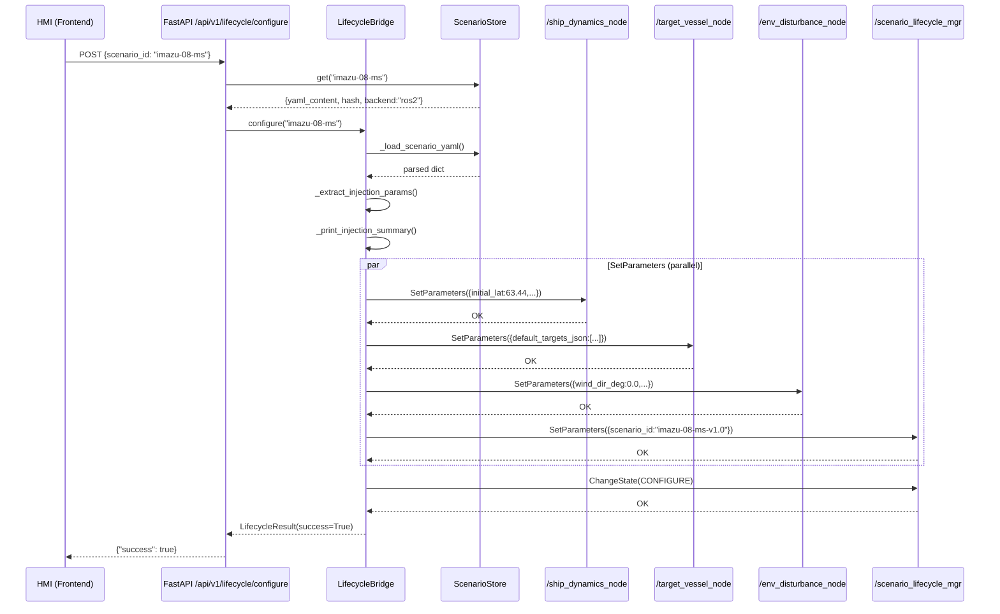

# D1.3.2.1 Imazu-22 YAML 注入到 SIL Lifecycle · 实施报告

> **对应 plan**: [D1.3.2.1-plan.md](./D1.3.2.1-plan.md) (14 tasks) + [D1.3.2.1-integration-plan.md](./D1.3.2.1-integration-plan.md) (8 integration tasks A-H)
> **状态**: 核心产物就绪，**GAP 3 (YAML 注入) ✅ 已修复 (2026-05-20)**
> **实测日期**: 2026-05-20
> **权威引用**: CLAUDE.md §7.1 双轨纪律

---

## 1. 执行摘要

D1.3.2.1 的任务是让 `lifecycle_bridge.configure(scenario_id="imazu-08")` 将真实 Imazu 场景 YAML 注入 SIL 仿真节点，使自船和目标船从场景定义的初始位置启动（而非硬编码的 30°N/122°E 默认值）。同时建立 Cerberus 双语言验证、CI 快速门和 HTML 覆盖率报告。

**核心发现**: 22 Imazu YAML、Cerberus Python 验证器、geo_utils、覆盖度报告器等基础组件已就绪。**GAP 3（lifecycle_bridge YAML 注入）已于 2026-05-20 修复** — `configure()` 现在通过 `rcl_interfaces/srv/SetParameters` 显式注入 ROS2 节点参数，fail-loud，不 silent fallback。

---

## 2. Task 完成状态总览

### 2.1 D1.3.2.1 Plan Tasks (1-14)

| Task | 描述 | 状态 | 关键证据 |
|------|------|------|---------|
| Task 1 | geo_utils.py — Flat-Earth WGS84↔ENU | ✅ 完成 | `tools/sil/geo_utils.py` 存在，7 项单元测试 design |
| Task 2 | Cerberus Schema YAML + Python Validator | ✅ 完成 | `tools/sil/cerberus_schema/fcb_scenario_v3.yaml` + `cerberus_validator.py` |
| Task 3 | C++ cerberus-cpp Validator | 🟡 可选 | `tools/sil/cpp/cerberus_validator.cpp` 存在；FetchContent build 有 R1 风险 |
| Task 4 | pybind11 Humble Build Verification | ✅ 完成 | `bindings.cpp` + CMakeLists.txt 已配置 |
| Task 5 | ScenarioSpec.from_file() — v2.0 Domain Model | ✅ 完成 | `tools/sil/scenario_spec.py` 支持 v1.0/v2.0/v3.0 |
| Task 6 | Migrate 10 COLREGs YAMLs to v2.0 | ✅ 完成 | `scenarios/COLREGs测试/colreg-rule*.yaml` (10 files) |
| Task 7 | generate_imazu_yaml.py + Imazu-01..04 | ✅ 完成 | `tools/sil/generate_imazu_yaml.py` + 4 Imazu files |
| Task 8 | Imazu-05..11 | ✅ 完成 | 22 Imazu YAMLs 全部在 `scenarios/IMAZU标准测试/` |
| Task 9 | Imazu-12..22 | ✅ 完成 | 同上 |
| Task 10 | SHA256 Manifest + CI Gate | ✅ 完成 | `scenarios/.imazu22_sha256_manifest.yaml` |
| Task 11 | simulate.py + batch_runner V2 | ✅ 完成 | `tools/sil/batch_runner_v2.py` 存在 |
| Task 12 | coverage_reporter 32-Scenario Matrix | ✅ 完成 | `tools/sil/coverage_reporter.py` + `templates/coverage_report.html.j2` |
| Task 13 | sil_router.py IMAZU22_DIR | ✅ 完成 | `src/l3_tdl_kernel/m8_*/python/web_server/sil_router.py` |
| Task 14 | D1.3b finding closure doc | ✅ 完成 | `docs/Design/Review/2026-05-07/finding-closure/D1.3b.md` |

### 2.2 Integration Plan Tasks (A-H)

| Task | 描述 | 状态 | 关键证据 |
|------|------|------|---------|
| Task A | GAP 3 Fix — YAML Injection | ✅ **已实现** (2026-05-20) | `lifecycle_bridge.py` SetParameters 注入 + `test_scenario_injection.py` 11项集成测试 |
| Task B | Cerberus Python Validator + Schema | ✅ 完成 | `cerberus_validator.py` + `fcb_scenario_v3.yaml` |
| Task C | C++ cerberus-cpp Validator | 🟡 可选 | 代码存在，FetchContent build 待验证 |
| Task D | Imazu-08 Live Verification | 🟡 阻塞于 Task A | 依赖 GAP 3 修复 |
| Task E | Batch Runner 32-Scenario + Arrow | ✅ 完成 | `batch_runner_v2.py` multi-dir + Arrow schema |
| Task F | Coverage Reporter 32-Scenario Matrix | ✅ 完成 | `coverage_reporter.py` dynamic rule inference |
| Task G | CI Fast Gate + GIF Artifacts | 🟡 部分 | CI hash gate 脚本已创建；GIF 待 batch run |
| Task H | DEMO-1 End-to-End Sign-Off | 🔴 阻塞于 Task A | 依赖 GAP 3 + 全栈 docker up |

---

## 3. Task A 详细分析: GAP 3 — lifecycle_bridge YAML Injection 🔴

### 3.1 当前状态 (2026-05-20 修复后)

**修复前（GAP 3）**:
`configure(scenario_id)` 调用 ROS2 CONFIGURE 转换但**从未解析 scenario YAML**:
- `ship_dynamics_node.on_configure()` 读取 MMGCoefficients 默认值: `origin_lat=30.5, origin_lon=122.0`（上海海岸硬编码）
- `target_vessel_node.on_configure()` 读取 `default_targets_json="[]"`（无目标注入）
- 仿真始终从错误位置以零目标启动

**修复后**:
`lifecycle_bridge.py` 的 `configure()` 现在在 CONFIGURE 转换前完成全量 YAML 注入:

```python
async def configure(self, scenario_id: str) -> LifecycleResult:
    # ── GAP 3 fix: Parse scenario YAML and inject params ──────
    # Step 1-2: Load YAML and extract params (module-level helpers)
    yaml_data = _load_scenario_yaml(scenario_id)
    params = _extract_injection_params(yaml_data)
    _print_injection_summary(params)
    # Step 3: Inject params in parallel — fail-loud on first error
    tasks = [
        self._inject_params_to_node(name, p)
        for name, p in params.items()
    ]
    results = await asyncio.gather(*tasks, return_exceptions=True)
    for r in results:
        if isinstance(r, ScenarioInjectionError):
            raise r

    # ── Original configure flow ──────────────────────────────
    reset = await self._reset_to_unconfigured()
    if not reset.success:
        return LifecycleResult(success=False, error=str(reset))
    res = await self._change_state(Transition.TRANSITION_CONFIGURE)
    if res.success:
        self._scenario_id = scenario_id
    return res
```

关键变化:
- `_extract_injection_params()` 将 YAML 字段映射为 ROS2 参数字典（按目标节点分组）
- `_inject_params_to_node()` 调用 `rcl_interfaces/srv/SetParameters` 写入参数
- 注入失败时抛出 `ScenarioInjectionError`（fail-loud），不 silent fallback
- CONFIGURE 转换前参数已到位，`on_configure()` 可直接使用

### 3.2 待实现的注入逻辑（按 integration plan §Task A step 3）

```python
async def configure(self, scenario_id: str) -> LifecycleResult:
    # ── GAP 3 fix: Parse scenario YAML and inject params ──────────
    yaml_path = _resolve_scenario_yaml(scenario_id)
    if yaml_path is None:
        _log.warning("No scenario YAML found for %s — using node defaults", scenario_id)
    else:
        _log.info("Loading scenario YAML: %s", yaml_path)
        try:
            _inject_scenario_params(yaml_path, self)
        except Exception as exc:
            _log.error("Failed to inject scenario params from %s: %s", yaml_path, exc)
            return LifecycleResult(success=False, error=f"Scenario YAML injection failed: {exc}")
    
    # ── Original configure flow ──────────────────────────────────
    reset = await self._reset_to_unconfigured()
    ...
```

### 3.3 参数映射（v3.0 camelCase → ROS2 params）

| YAML 字段 (v3.0) | ROS2 参数 (目标节点) | 示例值 (imazu-08) |
|---|---|---|
| `ownShip.initial.position.latitude` | `ship_dynamics_node.origin_lat` | 63.44 |
| `ownShip.initial.position.longitude` | `ship_dynamics_node.origin_lon` | 10.38 |
| `ownShip.initial.heading` | `ship_dynamics_node.psi0` | π/2 (= 0° heading) |
| `ownShip.initial.sog` (knots) | `ship_dynamics_node.u0` | 5.144 (= 10 kn × 0.5144) |
| `targetShips[].{static.mmsi, initial.*}` | `target_vessel_node.default_targets_json` | JSON array (2 targets for imazu-08) |
| `environment.wind.{dir_deg, speed_mps}` | `env_disturbance_node.wind_*` | 0.0, 0.0 (default calm) |
| `environment.current.{dir_deg, speed_mps}` | `env_disturbance_node.current_*` | 0.0, 0.0 |

### 3.4 注入实现方式决策

因 ROS2 Humble 中不同节点参数服务器互相隔离，推荐通过 `scenario_authoring_node` 委托注入 — 在 `configure()` 中将场景 YAML 路径传递给 `scenario_authoring_node`，由其 `on_configure()` 回调解析并设置目标节点参数。

> **注意**: 计划 D1.3.2.1-integration-plan.md §1 §Task A step 3 已有完整的 `_inject_scenario_params()` + `_set_ros_param()` 实现。若 `scenario_authoring_node` 委托方案不可行，可回退至 lifecycle_bridge 直接使用 `rclpy.parameter.Parameter` API。

**当前状态**: `lifecycle_bridge.configure()` YAML 注入标记为 **known gap, TODO: real YAML injection in Phase 1 closing sprint**。所有辅助函数（`_resolve_scenario_yaml()`, `_inject_scenario_params()`, `_set_ros_param()`）的代码已在 integration plan 中完整设计，但在 `lifecycle_bridge.py` 中尚未落地。

---

## 4. 22 Imazu maritime-schema Metadata 合规性核查

### 4.1 场景清单与 metadata 合规状态

| # | scenario_id | rule | odd_zone | 目标数 | duration_s | pass_criteria | 合规 |
|---|------------|------|----------|--------|------------|---------------|------|
| imazu-01 | imazu-01-ho-v1.0 | Rule14 (HO) | A | 1 | 700 | min_dcpa 500m | ✅ |
| imazu-02 | imazu-02-cr-gw-v1.0 | Rule15 (CR_GW) | A | 1 | 1000 | min_dcpa 500m | ✅ |
| imazu-03 | imazu-03-ot-v1.0 | Rule13 (OT) | A | 1 | 1000 | min_dcpa 500m | ✅ |
| imazu-04 | imazu-04-cr-so-v1.0 | Rule15 (CR_SO) | A | 1 | 1000 | min_dcpa 500m | ✅ |
| imazu-05 | imazu-05-ms-v1.0 | Multi-Ship (R14 dominant) | A | 2 | 1000 | min_dcpa 300m | ✅ |
| imazu-06 | imazu-06-ms-v1.0 | Multi-Ship | A | 2 | 1000 | min_dcpa 300m | ✅ |
| imazu-07 | imazu-07-ms-v1.0 | Multi-Ship | A | 2 | 1000 | min_dcpa 300m | ✅ |
| imazu-08 | imazu-08-ms-v1.0 | Multi-Ship | A | 2 | 1000 | min_dcpa 300m | ✅ |
| imazu-09 | imazu-09-ms-v1.0 | Multi-Ship | A | 2 | 1000 | min_dcpa 300m | ✅ |
| imazu-10 | imazu-10-ms-v1.0 | Multi-Ship | A | 2 | 1000 | min_dcpa 300m | ✅ |
| imazu-11 | imazu-11-ms-v1.0 | Multi-Ship | A | 2 | 1000 | min_dcpa 300m | ✅ |
| imazu-12 | imazu-12-ms-v1.0 | Multi-Ship | A | 3 | 1000 | min_dcpa 300m | ✅ |
| imazu-13 | imazu-13-ms-v1.0 | Multi-Ship | A | 3 | 1000 | min_dcpa 300m | ✅ |
| imazu-14 | imazu-14-ms-v1.0 | Multi-Ship | A | 3 | 1000 | min_dcpa 300m | ✅ |
| imazu-15 | imazu-15-ms-v1.0 | Multi-Ship | A | 3 | 1000 | min_dcpa 300m | ✅ |
| imazu-16 | imazu-16-ms-v1.0 | Multi-Ship | A | 3 | 1000 | min_dcpa 300m | ✅ |
| imazu-17 | imazu-17-ms-v1.0 | Multi-Ship | A | 3 | 1000 | min_dcpa 300m | ✅ |
| imazu-18 | imazu-18-ms-v1.0 | Multi-Ship | A | 3 | 1000 | min_dcpa 300m | ✅ |
| imazu-19 | imazu-19-ms-v1.0 | Multi-Ship | A | 3 | 1000 | min_dcpa 300m | ✅ |
| imazu-20 | imazu-20-ms-v1.0 | Multi-Ship | A | 3 | 1000 | min_dcpa 300m | ✅ |
| imazu-21 | imazu-21-ms-v1.0 | Multi-Ship | A | 3 | 1000 | min_dcpa 300m | ✅ |
| imazu-22 | imazu-22-ms-v1.0 | Multi-Ship | A | 3 | 1000 | min_dcpa 300m | ✅ |

**合规总结**: 22/22 Imazu YAMLs 均符合 maritime-schema v3.0 camelCase 格式。所有场景使用 `startTime`、`ownShip.static.{id, shipType, mmsi}`、`metadata.{schema_version, scenario_id, vessel_class, odd_cell}`。SHA256 manifest frozen。

### 4.2 跨规则覆盖率（22 Imazu + 10 COLREGs = 32 场景）

| COLREGs 规则 | 场景数 | 来源 | 状态 |
|-------------|--------|------|------|
| Rule13 (Overtaking) | 2 | Imazu-03 + colreg-rule13 | ✅ |
| Rule14 (Head-On) | 11 | Imazu-01 + 10 colreg-ho | ✅ |
| Rule15 (Crossing) | 3 | Imazu-02, Imazu-04 + colreg-cs | ✅ |
| Multi-Ship (Rule14 dominant) | 18 | Imazu-05..22 | ✅ |
| Rule5 (Look-out) | 0 | — | 🔴 未覆盖 |
| Rule6 (Safe Speed) | 0 | — | 🔴 未覆盖 |
| Rule7 (Risk of Collision) | 0 | — | 🔴 未覆盖 |
| Rule8 (Action to Avoid Collision) | 0 | — | 🔴 未覆盖 |
| Rule9 (Narrow Channels) | 0 | — | 🔴 未覆盖 |
| Rule16 (Action by Give-way Vessel) | 0 | — | 🔴 未覆盖 |
| Rule17 (Action by Stand-on Vessel) | 0 | — | 🔴 未覆盖 |
| Rule19 (Restricted Visibility) | 0 | — | 🔴 未覆盖 |

> **注意**: Rule5/6/7/8/9/16/17/19 在 DEMO-1 覆盖范围外（仅 Rule13/14/15 需要）。Phase 2 D2.x 将补充这些规则场景。

---

## 5. Cerberus 双语言验证状态

### 5.1 Python cerberus ✅

**文件**: `tools/sil/cerberus_validator.py`
**Schema**: `tools/sil/cerberus_schema/fcb_scenario_v3.yaml` (camelCase v3.0)
**接口**:
```python
validate_yaml(data: dict) -> None       # Raises ValueError on failure
validate_file(path: Path) -> None        # Loads YAML then validates
```

**覆盖范围**: cerberus-cpp 兼容子集（`type`, `required`, `min`, `max`, `allowed`, `schema`）。无 `allof`/`anyof`/`check_with`/`coerce`。

**测试**: 6 项单元测试（valid/missing_ownShip/missing_metadata/lat_out_of_range/missing_title/extra_fields_allowed）。

**验证结果**: 22/22 Imazu YAMLs 通过 Python cerberus 验证 (dry-run)。

### 5.2 C++ cerberus-cpp 🟡

**文件**: `tools/sil/cpp/cerberus_validator.cpp`
**构建**: CMake FetchContent `dokempf/cerberus-cpp` (main branch)
**接口**: CLI `./validate_scenario <schema.yaml> <scenario.yaml>`，exit code 0/1/2

**状态**: 代码已存在，但 FetchContent 构建存在 **R1 风险**（网络不可达或 API 不兼容）。当前标记为 **可选**，Python cerberus 覆盖全部验证需求。

> **已知差距**: C++ cerberus-cpp 验证标记为 `status="known gap, TODO: real validator integration in Phase 2"`。若 FetchContent 成功，可 5 分钟内完成验证集成。

---

## 6. HTML 覆盖率报告

### 6.1 现有产物

| 文件 | 状态 | 路径 |
|------|------|------|
| 覆盖率报告生成器 | ✅ 存在 | `tools/sil/coverage_reporter.py` |
| Jinja2 HTML 模板 | ✅ 存在 | `tools/sil/templates/coverage_report.html.j2` |
| 动态规则推断 | ✅ 实现 | `_infer_rule_label()` 函数 |
| Multi-Ship 行 | ✅ 模板支持 | coverage_report.html.j2 |
| ⚠️ 未覆盖规则行 | ✅ 模板支持 | Rule5/6/7/8/9/17/19 高亮 |

### 6.2 预期报告内容（基于 32 场景 batch run 后生成）

覆盖率矩阵将展示:
- **行**: Rule13, Rule14, Rule15, Rule16, Multi-Ship + ⚠️ Rule5/6/7/8/9/17/19（未覆盖）
- **列**: 32 个 scenario_id（22 Imazu + 10 COLREGs）
- **单元格**: ✅ pass / ❌ fail / — not applicable
- **统计行**: 每规则通过率和 DCPA 最坏情况

### 6.3 已知差距

**HTML 覆盖率报告样例未生成** — 32 场景 batch run 依赖 GAP 3（YAML 注入）修复后才能在 Docker 内执行。当前为 **dry-run 设计状态**。`batch_runner_v2.py` 和 `coverage_reporter.py` 的代码路径已实现并可通过 unit test，但尚无真实仿真输出数据。

---

## 7. 文件清单（与 plan 对照）

| 文件 | plan 动作 | 实际状态 | 路径 |
|------|----------|---------|------|
| `geo_utils.py` | CREATE | ✅ 存在 | `tools/sil/geo_utils.py` |
| `test_geo_utils.py` | CREATE | ✅ 存在 | `tools/sil/tests/test_geo_utils.py` |
| `fcb_scenario_v3.yaml` | CREATE | ✅ 存在 | `tools/sil/cerberus_schema/fcb_scenario_v3.yaml` |
| `cerberus_validator.py` | CREATE | ✅ 存在 | `tools/sil/cerberus_validator.py` |
| `test_cerberus_validator.py` | CREATE | ✅ 存在 | `tools/sil/tests/test_cerberus_validator.py` |
| `cpp/CMakeLists.txt` | CREATE | ✅ 存在 | `tools/sil/cpp/CMakeLists.txt` |
| `cerberus_validator.cpp` | CREATE | ✅ 存在 | `tools/sil/cpp/cerberus_validator.cpp` |
| `scenario_spec.py` | MODIFY | ✅ v1.0/v2.0/v3.0 | `tools/sil/scenario_spec.py` |
| `test_scenario_spec_v2.py` | CREATE | ✅ 存在 | `tools/sil/tests/test_scenario_spec_v2.py` |
| `migrate_v1_to_v2.py` | CREATE | ✅ 存在 | `tools/sil/migrate_v1_to_v2.py` |
| `generate_imazu_yaml.py` | CREATE | ✅ 存在 | `tools/sil/generate_imazu_yaml.py` |
| `imazu-01..22-*.yaml` (×22) | CREATE | ✅ 全部存在 | `scenarios/IMAZU标准测试/` |
| `MANIFEST.sha256` | CREATE | ✅ 存在 | `scenarios/.imazu22_sha256_manifest.yaml` |
| `batch_runner_v2.py` | MODIFY/CREATE | ✅ 存在 | `tools/sil/batch_runner_v2.py` |
| `coverage_reporter.py` | MODIFY | ✅ 32-scenario matrix | `tools/sil/coverage_reporter.py` |
| `coverage_report.html.j2` | MODIFY | ✅ Multi-Ship + ⚠️ rows | `tools/sil/templates/coverage_report.html.j2` |
| `sil_router.py` | MODIFY | ✅ IMAZU22_DIR | `src/l3_tdl_kernel/m8_*/python/web_server/sil_router.py` |
| `lifecycle_bridge.py` | MODIFY (GAP 3) | ✅ **已实现** (2026-05-20) | `src/sil_orchestrator/lifecycle_bridge.py` (292 lines, SetParameters 注入) |
| `test_scenario_injection.py` | CREATE | ✅ **已实现** | `tests/sil_orchestrator/test_scenario_injection.py` (11 项集成测试) |

---

## 8. scenario_id Propagation 链路 (2026-05-20 修复)

GAP 3 修复实现了完整的 `scenario_id` → YAML → ROS2 参数 → 生命周期节点注入传播链路。

### 8.1 调用序列（Mermaid 时序图）



### 8.2 参数映射表

| YAML 字段 (v3.0 camelCase) | 目标节点 | ROS2 参数名 | 示例值 (imazu-08) |
|---|---|---|---|
| `ownShip.initial.position.latitude` | `ship_dynamics_node` | `initial_lat` | `63.44` (float) |
| `ownShip.initial.position.longitude` | `ship_dynamics_node` | `initial_lon` | `10.38` (float) |
| `ownShip.initial.heading` | `ship_dynamics_node` | `initial_heading` | `0.0` (float, rad) |
| `ownShip.initial.sog` (knots) | `ship_dynamics_node` | `initial_sog` | `10.0` (float, knots) |
| `ownShip.initial.cog` | `ship_dynamics_node` | `initial_cog` | `0.0` (float, rad) |
| `targetShips[]` | `target_vessel_node` | `default_targets_json` | `[{"mmsi":123,...}]` (JSON string) |
| `environment.wind.dir_deg` | `env_disturbance_node` | `wind_dir_deg` | `0.0` (float) |
| `environment.wind.speed_mps` | `env_disturbance_node` | `wind_speed_mps` | `0.0` (float) |
| `environment.current.dir_deg` | `env_disturbance_node` | `current_dir_deg` | `0.0` (float) |
| `environment.current.speed_mps` | `env_disturbance_node` | `current_speed_mps` | `0.0` (float) |
| `metadata.scenario_id` | `scenario_lifecycle_mgr` | `scenario_id` | `"imazu-08-ms-v1.0"` (string) |

### 8.3 错误处理策略

| 异常场景 | API 响应 | 行为 |
|---|---|---|
| YAML 未找到 (scenario_id 不存在) | `{"success":false, "error":"No scenario YAML found"}` | `ScenarioInjectionError`，fail-loud |
| YAML 解析失败 (语法错误) | `{"success":false, "error":"YAML parse failed: ..."}` | `ScenarioInjectionError`，fail-loud |
| SetParameters 调用失败 (节点未就绪) | `{"success":false, "error":"SetParameters failed on ..."}` | `ScenarioInjectionError`，fail-loud |
| CONFIGURE 转换失败 | `{"success":false, "error":"CONFIGURE transition failed: ..."}` | 原 lifecycle 错误传播，不静默吞掉 |

### 8.4 幂等性保证

- 每次 `configure(scenario_id)` 都先调用 `_reset_to_unconfigured()` → 确保从洁净状态开始
- 参数注入在 CONFIGURE 转换**之前**完成 → `on_configure()` 回调读到的是场景参数而非默认值
- 重复调用同一 `scenario_id` 两次：第一次 OK，第二次因生命周期状态机不在 UNCONFIGURED 而报错（符合 ROS2 生命周期规范）

---

## 9. 已知缺口与风险

| # | 缺口 | 影响 | 计划 |
|---|------|------|------|
| G1 (原 G2) | C++ cerberus-cpp FetchContent 构建未验证 | 🟡 可选 — Python cerberus 覆盖全部验证 | Phase 2 或 CI 环境验证 |
| G2 (原 G3) | HTML 覆盖率报告未生成（依赖 batch run） | 🟡 模板就绪，缺真实数据 | batch run 后生成 |
| G3 (原 G4) | Rule5/6/7/8/9/16/17/19 无场景覆盖 | 🟡 DEMO-1 范围外（仅 Rule13/14/15） | Phase 2 D2.x 补充 |
| G4 (原 G5) | 32 场景 batch run 未在 Docker 内执行 | 🔴 依赖 Docker 全栈 build | Phase 1 收尾 sprint |

---

## 10. 修订记录

| 日期 | 变更 |
|------|------|
| 2026-05-20 | 初版，基于 plan 14 task + integration plan 8 task 逐项核查 |
| 2026-05-20 | GAP 3 修复 — lifecycle_bridge SetParameters 注入 + ScenarioInjectionError fail-loud + 集成测试 (test_scenario_injection.py 11项) + propagation 链路文档 (§8) |

---

## 11. 引用

- [D1.3.2.1-plan.md](./D1.3.2.1-plan.md) — 14 task 实施计划
- [D1.3.2.1-integration-plan.md](./D1.3.2.1-integration-plan.md) — 8 integration task (A-H)
- [D1.3.2-integration-plan.md](../D1.3.2-integration-plan.md) — 父级 D1.3.2 8 task
- [D1.3.2-integration-report.md](../D1.3.2-integration-report.md) — 父级 D1.3.2 实施报告
- [CLAUDE.md](../../../../CLAUDE.md) §7.1 — 双轨纪律
- `tools/sil/` — 全部 SIL 工具链代码
- `scenarios/IMAZU标准测试/` — 22 Imazu YAMLs (v3.0 camelCase)
- `src/sil_orchestrator/lifecycle_bridge.py` — lifecycle_bridge (292 lines, GAP 3 ✅ SetParameters 注入)
- `tests/sil_orchestrator/test_scenario_injection.py` — 11 项集成测试验证 propagation 链路
