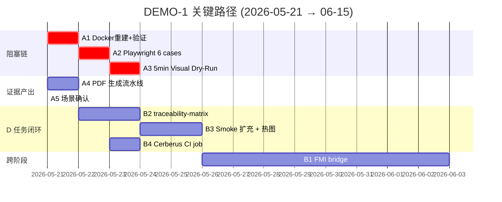

# Phase 1 剩余开发工作 — 全面盘点

> **基准日期**：2026-05-21（基于 2026-05-20 实测核查 + dry-run 报告）  
> **里程碑**：DEMO-1 Skeleton Live — **2026-06-15**（距今 ~3.5 周）  
> **数据来源**：[00-overview.md](file:///Users/marine/Code/MASS-L3-Tactical%20Layer/docs/Design/Phase%201/00-overview.md) + [DEMO-1-dry-run-2026-05-20.md](file:///Users/marine/Code/MASS-L3-Tactical%20Layer/docs/Design/Phase%201/DEMO-1-dry-run-2026-05-20.md) + 源码实查

---

## 当前 D 任务总览

| D 编号 | 主题 | 状态 | Phase 1 内需做 |
|---|---|---|---|
| D1.1 | ROS2 工作区 + IDL | ✅ | — |
| D1.2 | CI/CD 流水线 | ✅ | — |
| D1.3.1 | 4-DOF MMG 仿真器 | ✅ | — |
| D1.3.1' | Simulator Qualification | ✅ | — |
| D1.3.2.1 | YAML Imazu + Cerberus | ✅部分 | C++ cerberus 验证 / CI job 启用 |
| D1.3.2.2 | AIS-driven scenario | 🔴 推迟 Phase 4 | — |
| D1.3.2.3 | Web HMI + ENC + foxglove | ✅部分 | Playwright 通过 / 5min dry-run |
| D1.3.2-integ | SIL L3 pipeline | ✅ | — |
| D1.3.3 | FMI bridge / libcosim | 🟡 | libcosim + dds-fmu 集成 |
| D1.4 | 编码规范 | ✅ | — |
| D1.5 | V&V Plan | ✅ | — |
| D1.6 | 场景 schema | 🟡 | traceability-matrix.csv + CI 三层 |
| D1.7 | 覆盖率方法论 | 🟡 | 热图脚本 + 证据 PNG + Group A1 闭环 |
| D1.8 | cert tracking + ConOps | ✅ | — |

---

## A. 🔴 DEMO-1 关键阻塞项（必须在 6/15 前完成）

### A1. Docker `sil-nodes` 镜像重建 + E2E 验证

> [!CAUTION]
> 这是当前最大的单一阻塞项，所有 E2E 验证都依赖于此。

**现状**：Docker 镜像在 L3 kernel 代码集成前构建，仅含 11 个 SIL 节点（无 M1–M8）。重建已在 2026-05-20 ~17:55 启动，状态待确认。

**待办**：
- [ ] 确认 `docker compose build sil-nodes` 完成
- [ ] `docker compose up -d --force-recreate sil-nodes foxglove-bridge`
- [ ] 验证 16+ 节点启动（Stage 1→2→3）
- [ ] 3× 连续运行 `verify_demo1_e2e.sh` 全绿（R1a–R1f）

**工作量**：~0.5 天（重建 + 验证）

---

### A2. Playwright 6 核心测试用例通过

**现状**：6/6 测试均为 ⏳ BLOCKED（依赖 A1）。

| # | 测试 | 依赖 |
|---|---|---|
| 1 | own-ship telemetry 30s 内填充 | `/sil/own_ship_state` via WS |
| 2 | target vessel BRG/RNG 在 ArpaTargetTable | `/sil/tracked_targets` via WS |
| 3 | ModulePulseBar M1–M8 心跳 | `/sil/module_pulse`（需 M7+bridge）|
| 4 | ConningBar 7 字段 | `/sil/m8_ui_state`（需 M8）|
| 5 | ThreatRibbon CPA chips | `/sil/tracked_targets` + CPA |
| 6 | WS CONNECTED / 无 DEMO MODE badge | foxglove bridge live |

**待办**：
- [ ] Docker 重建后运行 Playwright，6/6 全绿
- [ ] 生成 HTML 报告至 `evidence/playwright-report-{timestamp}/`

**工作量**：~0.5 天（运行 + debug + 修复，依赖 A1）

---

### A3. 5 分钟视觉 Dry-Run 通过

**现状**：7/7 检查项均为 ⏳（依赖 A1）。

| t(min) | 检查 |
|---|---|
| 0 | WS CONNECTED badge 可见 + 无 DEMO MODE 红色 badge |
| 1 | own_ship 在 MapLibre 上移动 + target_ship 初始位置正确 |
| 2 | ConningBar 7 字段流动（非冻结） |
| 3 | ThreatRibbon CPA 芯片变色（绿→琥珀） |
| 4 | ModulePulseBar 8 槽全绿，M7 ≥ 5 Hz |
| 5 | 全程无 DEMO MODE 横幅 |

**待办**：
- [ ] 执行 5min 视觉 dry-run
- [ ] OBS/QuickTime 录屏至 `evidence/demo1-dryrun-{date}.mp4`

**工作量**：~0.5 天

---

### A4. PDF 生成流水线（ConOps + V&V Plan）

> [!IMPORTANT]
> DEMO-1 Charter 明确要求 "ConOps PDF + V&V Plan PDF" 现场展示，目前仅有 .md 文件，无任何 PDF 生成工具。

**现状**：
- [ConOps v0.1](file:///Users/marine/Code/MASS-L3-Tactical%20Layer/docs/Design/ConOps/01-conops-v0.1.md) — Markdown，**stub 级**（框架 + 空复选框）
- [V&V Plan v0.1](file:///Users/marine/Code/MASS-L3-Tactical%20Layer/docs/Design/Phase%201/D1.5-vv-plan-scenario-qual/V%26V_Plan/00-vv-strategy-v0.1.md) — Markdown，**完整**（439 行，10 章节）
- cert-evidence-tracking.md — stub 级

**待办**：
- [ ] 搭建 PDF 生成工具链（pandoc + LaTeX 模板 / weasyprint / md-to-pdf）
- [ ] 生成 ConOps PDF（需先充实 stub 内容或确认 stub 级可接受）
- [ ] 生成 V&V Plan PDF
- [ ] cert-evidence-tracking.md 现场展示准备

**工作量**：~1 天

---

### A5. Crossing 场景 vs Head-On 场景对齐

> [!NOTE]
> DEMO-1 Charter 写的是 "1 个 Crossing 场景脚本 live"，但 dry-run 使用的是 `imazu-08-ms`（Rule 14 Head-On）。需确认展示场景。

**待办**：
- [ ] 确认 DEMO-1 展示场景：使用 crossing（如 `imazu-02-cr-gw`）还是保持 head-on
- [ ] 如改用 crossing，更新 Playwright spec + verify 脚本参数

**工作量**：~0.25 天

---

## B. 🟡 D 任务闭环差距（Phase 1 DoD 完整性）

### B1. D1.3.3 — FMI Bridge（🟡 → ✅ 路径长，跨 Phase 1/2 边界）

**已完成**：
- ✅ Humble 容器 Dockerfile 构建通过
- ✅ `fmi_bridge_node.py` stub 注册在 `setup.py`
- ✅ 设计规格文档 3,200 字

**未完成**（DoD 2/8）：

| DoD # | 项目 | 状态 |
|---|---|---|
| 3 | libcosim C++ 编译进容器 | 🔴 |
| 4 | dds-fmu adapter 编译链接 | 🔴 |
| 5 | Own-ship 4-DOF FMU 导出 | 🔴 |
| 6 | bridge 真实 FMI 2.0 co-sim stepping | 🔴 |
| 7 | 往返延迟 ≤ 50ms 测量 | 🔴 |
| 8 | 集成测试：FMU 输出与 ship_dynamics 一致 | 🔴 |

**工作量**：~6-8 天（1.5-2 人周）  
**优先级**：⚠️ DEMO-1 Charter 不直接依赖 FMI bridge，但属于 Phase 1 DoD。计划跨至 7/15。

---

### B2. D1.6 — 场景 Schema（🟡 → ✅ 路径）

**已完成**：
- ✅ [02-scenario-schema.md](file:///Users/marine/Code/MASS-L3-Tactical%20Layer/docs/Design/Phase%201/D1.6-scenario-schema/02-scenario-schema.md) — 27K 字节，8 章节
- ✅ 22 Imazu YAML 符合 maritime-schema v3.0 camelCase
- ✅ Python cerberus 验证器 22/22 PASS

**未完成**（DoD ~2/7）：

| DoD # | 项目 | 状态 | 阻塞 |
|---|---|---|---|
| 3 | Cerberus 完整 schema（含字段类型/范围/枚举）| 🟡 Python 通过但 C++ 未验证 | D1.3.2.1 Task C |
| 5 | CI `validate-scenarios` job 启用 | 🔴 注释/跳过状态 | 依赖 DoD#3 |
| 6 | **`scenario-traceability-matrix.csv`** | 🔴 **完全缺失** | **阻塞 D1.7 热图** |
| 4 | farn v0.4.2 + 1100-cell 文件夹 dry-run | 🔴 未集成 | — |
| 7 | 闭环 finding: G P0-G-2 等 | 🔴 | — |

**工作量**：~3-5 天（1 人周）  
**关键依赖**：`traceability-matrix.csv` 是 D1.7 热图生成的前置输入

---

### B3. D1.7 — 覆盖率方法论（🟡 → ✅ 路径）

**已完成**：
- ✅ 方法论文档 6,051 字，7 章节
- ✅ 6 维度 rubric（4 级评分）
- ✅ V&V Plan 集成（§3.4 引用）
- ✅ coverage_cube.py (145 行) + scenarios_coverage.py (85 行) 工具存在
- ✅ Demo 热图证据：25/1100 cells lit（超过 10 cell 最低要求）

**未完成**（Group A1 阻塞）：

| Group A1 | 项目 | 状态 | 阻塞来源 |
|---|---|---|---|
| A1.1 | D1.6 `traceability-matrix.csv` 交付 | 🔴 | D1.6 |
| A1.2 | D1.3.2.1 Task C — 22 Imazu C++ cerberus CI 验证 | 🔴 | D1.3.2.1 |
| A1.3 | Smoke 测试套件 ≥ 10 场景 | 🟡 仅 3 个 | 需创建 7 个 |
| A1.4 | 热图脚本生成 PNG 证据 | ⚠️ 工具存在但需确认路径对齐 | — |

> [!NOTE]
> 好消息：`tools/sil/coverage_cube.py` 和 `tools/sil/scenarios_coverage.py` 已存在，demo 热图 HTML 也已产出（25 cells）。主要缺的是 `traceability-matrix.csv` 输入和 smoke 场景扩充。

**Smoke 场景路径问题**：`run_smoke_10.sh` 期望 `scenarios/imazu22/` 目录，但实际文件在 `scenarios/IMAZU标准测试/`，需要路径对齐或符号链接。

**工作量**：~2-3 天（依赖 D1.6 traceability matrix 先交付）

---

### B4. D1.3.2.1 — YAML Imazu Cerberus 验证（✅部分 → ✅）

**已完成**：Task A（22 Imazu metadata 字段）✅、Task B（Python cerberus 验证）✅

**未完成**：
- [ ] **Task C**：C++ cerberus-cpp 构建验证（FetchContent 风险 R1）— 🟡 可选
- [ ] CI 验证 job 启用
- [ ] 32 场景 Docker 全栈 batch run

**工作量**：~1-2 天  
**优先级**：C++ 验证标记为 "可选"，Python 覆盖所有需求

---

### B5. D1.3.2.3 — Web HMI（✅部分 → ✅）

**已完成**：MapLibre + ENC ✅ / ArpaTargetTable BRG/RNG ✅ / Playwright 6 cases 编写 ✅ / foxglove WS ✅ / DEMO MODE badge ✅ / ConningBar ✅ / ModulePulseBar ✅ / ThreatRibbon ✅

**未完成**（DEMO-1 范围内）：
- [ ] Playwright 6 cases 运行通过（依赖 A1 Docker 重建）
- [ ] R14 head-on 5min 录屏产出

**DEMO-2 推迟项**（SAT-2/SAT-3 双端真空）：
- 🔴 `useFoxgloveLive.ts` 缺 3 handler（SAT-2/SAT-3/SOTIF）
- 🔴 M8 未发 3 个桥接 topic
- 🔴 EngineerSAT2Panel / EngineerSAT3Panel / SOTIFMetricsWidget 壳已挂载但无数据

---

## C. DEMO-1 Charter 证据差距

DEMO-1 Charter（5 项展示）对照：

| Charter 项 | 需求 | 代码状态 | 证据状态 |
|---|---|---|---|
| **①** AIS 回放 → Mock M2 → 仿真器 | ✅ 管线存在 | ❌ E2E 未验证（Docker） |
| **②** Crossing 场景 + SAT-1 视图 | ✅ 组件就绪 | ❌ 场景选择待确认 + dry-run 待完成 |
| **③** Smoke 10 + 覆盖热图 10 cells | ✅ 工具存在 | ⚠️ 路径需对齐 + 热图已有 25 cells |
| **④** ConOps PDF + V&V PDF + cert | 🔴 无 PDF 工具 | 🔴 需搭建 PDF 生成 |
| **⑤** 仿真器参考解 + tool confidence | ✅ 完成 | ✅ TCL-3 PASS + PNG 证据 |

**证据 Artifacts 清单（待产出）**：

| Artifact | 路径 | 状态 |
|---|---|---|
| E2E verify JSON (×3) | `evidence/demo1-e2e-verification-*.json` | ⏳ |
| Playwright HTML 报告 | `evidence/playwright-report-*/` | ⏳ |
| 5min 录屏 | `evidence/demo1-dryrun-{date}.mp4` | ⏳ |
| ConOps PDF | `docs/Design/ConOps/01-conops-v0.1.pdf` | 🔴 |
| V&V Plan PDF | `docs/Design/Phase 1/D1.5-*/V&V_Plan/*.pdf` | 🔴 |
| 覆盖热图 PNG | `evidence/coverage/coverage-cube-heatmap-*.png` | ⚠️ HTML 已有 |

---

## D. 推迟项（不阻塞 DEMO-1）

| 项目 | 推迟至 | 原因 |
|---|---|---|
| D1.3.2.2 AIS-driven scenario authoring | Phase 4 | v3.2 决策 |
| SAT-2/SAT-3 双端实现（M4/M5/M8 + 前端 3 handler）| DEMO-2 (7/31) | Phase 2 D3.1/D3.2/D3.4 |
| D1.3.3 FMI bridge 完整集成 | 7/15 跨 Phase 1/2 | 工作量 1.5-2 pw |
| farn/ospx 场景生成工具集成 | Phase 2 | D1.6 stretch goal |
| C++ cerberus-cpp 验证 | Phase 2 | 可选，Python 覆盖 |

---

## E. 优先级排序 + 建议执行顺序

### 立即行动（本周）

| 优先级 | 任务 | 工作量 | 阻塞 |
|---|---|---|---|
| **P0** | A1: Docker 重建确认 + 16+ 节点验证 | 0.5d | 一切 E2E |
| **P0** | A2: Playwright 6/6 全绿 | 0.5d | A1 |
| **P0** | A4: PDF 生成工具链 | 1d | 无 |
| **P1** | A3: 5min dry-run + 录屏 | 0.5d | A1 |
| **P1** | A5: Crossing vs Head-On 场景确认 | 0.25d | 无 |
| **P1** | B2: traceability-matrix.csv 创建 | 1.5d | 无 |

### 下周

| 优先级 | 任务 | 工作量 | 阻塞 |
|---|---|---|---|
| **P1** | B3: Smoke 扩充至 10 + 路径对齐 + 热图 PNG | 1.5d | B2 |
| **P2** | B4: CI validate-scenarios job 启用 | 1d | B2 |
| **P2** | B1: FMI bridge libcosim/dds-fmu 集成 | 6-8d | 跨阶段 |

---

## F. 总工作量估算

| 分类 | 工作量 | 备注 |
|---|---|---|
| DEMO-1 阻塞项（A1-A5）| ~3 天 | Docker + Playwright + PDF + dry-run |
| D 任务闭环（B2-B5）| ~5-7 天 | traceability + smoke + Cerberus CI |
| FMI bridge（B1）| ~6-8 天 | 跨 Phase 1/2，7/15 前 |
| **Phase 1 完整关闭总计** | **~14-18 天（3-4 人周）** | 含 FMI bridge |
| **DEMO-1 最小可展示** | **~3-5 天** | 不含 FMI bridge + D 任务完整闭环 |
