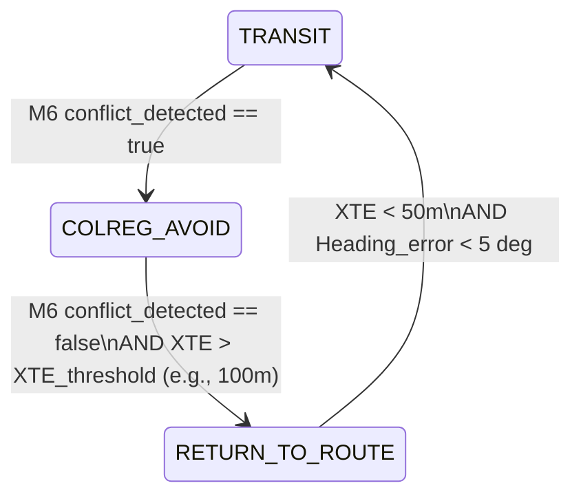

# COLREGs 探针场景与 Trace 评估器完整设计报告 (v1.0)

本报告针对评审报告中指出的系统缺陷，提出了一整套符合避碰法规（COLREGs）和良好船艺（Good Seamanship）的系统设计与改进方案。方案涵盖状态机重构、评估指标定量化、场景库扩容以及参数化 CPA 阈值模型，并逐一解答了 Spec 草案中的专家疑问。

---

## 1. 架构升级：避碰与归航闭环设计 (Closed-Loop Design)

为解决“会避碰但平行不归航”的架构缺陷，系统需引入完整的**三阶段行为控制与轨迹规划闭环**。



### 1.1 M4 Behavior Arbiter 增加回归状态 (RETURN_TO_ROUTE)
在 `behavior_definitions.yaml` 中新增第 6 种行为状态：
*   **名称**：`RETURN_TO_ROUTE` (回归航路)
*   **权重**：0.55 (介于 TRANSIT 0.3 和 AVOID 0.7 之间)
*   **激活条件**：`COLREG_AVOID` 刚结束，且船舶偏航角 $\Delta \psi > 10^\circ$ 或横向偏差 $XTE > 100\text{m}$。
*   **IvP 效用函数设计**：
    以原始航线方位角 $\psi_{nominal}$ 为中心的窄高斯分布（$\sigma = 5^\circ$），不设保底基面（基面 utility = 0.0）。这能在避碰结束后产生极强的“回拉梯度”，拉动船舶切回原始航道。

### 1.2 M5 几何回退算法生成“回归段” (Geometric Recovery Arc)
修改 `mid_mpc_node.cpp` 中的 `build_geometric_fallback_plan_()`，将生成的 10 个预测航路点（预测时域 100 秒）分为三段：
1.  **段 1 (避让弧，WP 1-3)**：根据 M4 输出的右舷避让角，生成右转圆弧。
2.  **段 2 (通过段，WP 4-6)**：在避碰角方向上保持直线航行，稳定通过相遇点。
3.  **段 3 (回归弧，WP 7-10)**：计算当前预测终点到原始规划航线上预瞄点 (Lookahead Point) 的航向。生成反向左转圆弧，引导轨迹重新切回航路。

### 1.3 M6 基于空间几何的“Past-and-Clear”判定 (消除幽灵冲突)
废除依赖时间线性衰减的 `rule14_state_`。改用严密的**空间运动几何判定**：
只有同时满足以下三个几何条件，M6 才判定冲突彻底解除 (`conflict_detected = false`)：
1.  **相对运动趋势变正**：$TCPA < 0$ 且 相对距离变化率 $v_{closing} = \frac{d(range)}{dt} > 0$（两船距离正在持续增大）。
2.  **目标处于本船身后 (Abaft)**：目标船的相对方位角 $\theta_{rel} \in [90^\circ, 270^\circ]$。对于 Overtaking 场景，该边界加严至 $[112.5^\circ, 247.5^\circ]$（Rule 13 追越船必须“最后驶过并 clear”）。
3.  **越过安全船域**：两船物理距离 $d > CPA_{safe}$。

---

## 2. 场景库升级：快速探针 v3.0 (Scenario Extensions)

为消除测试盲区，快速探针集在原有 8 个场景基础上，新增 4 个高价值专项场景，形成 **v3.0 探针套件**：

```
scenarios/COLREGs测试/
├── colreg-rule14-ho.yaml          (原有)
├── ...
├── colreg-rule09-channel.yaml     [NEW]  受限航道对遇 (测地缘避让与重规划)
├── colreg-multiship-avoid.yaml    [NEW]  多船交叉冲突 (测多威胁仲裁)
├── colreg-uncooperative-target.yaml [NEW]  不合作目标机动 (测直航17(b)与Checker veto)
└── colreg-rule19-fog.yaml         [NEW]  能见度不良对遇 (测Rule 19盲避与限速)
```

### 新增场景规格设计：
1.  **`colreg-rule09-channel`**：
    *   **设置**：在宽度 $400\text{m}$ 的限制航道内，OS 与 TS 对遇。OS 左侧为浅滩 Geofence 障碍物，右侧有少量安全转向空间。
    *   **测试目的**：测试 M5 是否能生成在不驶出航道边界（ grounding risk = 0）的前提下进行小幅度右转避碰的轨迹。
2.  **`colreg-multiship-avoid`**：
    *   **设置**：本船航向 000°，TS1（对遇）从正前方驶来，TS2（交叉）从右舷 45° 交叉驶来。
    *   **测试目的**：验证 M4 是否能在多规则冲突时，优先执行右舷交叉让路（R15）向右偏航，同时满足对遇右转（R14）的要求，不产生转向意图冲突。
3.  **`colreg-uncooperative-target`**：
    *   **设置**：Crossing 场景，本船是直航船。让路 TS（左舷来船）不主动让路，且在相遇前 60s 突然向本船方向转向。
    *   **测试目的**：测试 M6 准确触发 Rule 17(b) 独立行动，M7 Doer-Checker 在最后时刻接管并大舵角避碰。
4.  **`colreg-rule19-fog`**：
    *   **设置**：环境能见度设为 `0.5 NM`（大雾）。目标从正前方 reciprocal 方向驶来，OS 只能通过雷达/AIS 探测。
    *   **测试目的**：验证 M6 不进入让路/直航划分，双方均判断为 Rule 19 避碰，OS 减速至“安全速度”（SOG ≤ 6 kn），且避免向左转向。

---

## 3. 指标量化：时机、幅度与直航窗口 (Quantified Metrics)

测试平台评估器必须将 qualitative (定性) 的法规翻译为 quantitative (定量) 的数学公式，纳入打分判定：

### 3.1 动作时机定量化 (Timing of Action)
让路船动作时机必须满足早期性（Rule 16 / Rule 8(b)）：
$$TCPA_{action} \ge TCPA_{safe} \quad \text{AND} \quad Range_{action} \ge Range_{safe}$$
*   **开阔水域基准值**：$TCPA_{safe} = 180\text{ s}$，$Range_{safe} = 1.5\text{ NM}$。
*   **受限航道基准值**：$TCPA_{safe} = 100\text{ s}$，$Range_{safe} = 0.8\text{ NM}$。
*   **动作判定点**：转向速率 $ROT \ge 0.5^\circ/\text{s}$ 或 航向偏差 $\Delta \psi \ge 5^\circ$ 的时刻。

### 3.2 动作幅度定量化 (Magnitude of Action)
转向动作必须明显，能被对方通过雷达或肉眼轻易察觉（Rule 8(b)）：
$$\Delta \psi_{max} = \max_{t \in [t_{start}, t_{cpa}]} |\psi(t) - \psi_{nominal}| \ge \Delta \psi_{threshold}$$
*   **开阔水域**：$\Delta \psi_{threshold} = 25^\circ$。
*   **受限航道/边界**：$\Delta \psi_{threshold} = 15^\circ$。
*   **惩罚项**：禁止连续的小航向调整（例如每次转向 < 5° 并连续打舵）。若打舵阶段 $\text{steering\_reversals} > 4$，则 Layer 7 判定不通过。

### 3.3 直航船动作窗口定量化 (Rule 17 Stand-on Window)
直航船规避必须分为两个阶段独立判断：
1.  **保向保速阶段 ($t < t_{extremis}$)**：
    最大航向偏差 $\Delta \psi_{max} < 8^\circ$。严禁抢让和抢跑。
2.  **独立避让阶段 ($t \ge t_{extremis}$)**：
    直航船在让路船不作为时，必须在相撞前采取行动：
    $$TCPA_{action} \in [TCPA_{extremis\_min}, TCPA_{extremis\_max}]$$
    *   $TCPA_{extremis\_max} = 75\text{ s}$ (直航船允许采取行动的最早时机)。
    *   $TCPA_{extremis\_min} = 40\text{ s}$ (直航船必须采取紧急避让的底线)。

---

## 4. 参数化动态 CPA 阈值模型 (Parametric Domain)

为摆脱固定魔数，CPA 阈值模型必须以**本船船长 (LOA, $L$)**和**相对速度 ($v_r$)**为自变量进行动态参数化：

$$CPA_{safe}(ODD, L, v_r) = \alpha(ODD) \cdot L + \beta(ODD) \cdot v_r$$

### 4.1 动态阈值矩阵规范：
1.  **开阔水域 (Open Water Crossing)**：
    *   $\alpha = 10.0$，$\beta = 20\text{ s}$。
    *   *示例*：FCB $L=45\text{m}$，相对速度 $20\text{ kn} \approx 10\text{ m/s}$。
    *   $CPA_{safe} = 10 \times 45 + 20 \times 10 = 650\text{ m} \approx 0.35\text{ NM}$。符合开阔水域预警基线。
2.  **受限通道/边界 (Restricted / Boundary)**：
    *   $\alpha = 5.0$，$\beta = 10\text{ s}$。
    *   *示例*：相对速度 $15\text{ kn} \approx 7.7\text{ m/s}$。
    *   $CPA_{safe} = 5 \times 45 + 10 \times 7.7 = 302\text{ m}$。与工程妥协值 300m 高度契合。
3.  **紧急物理红线 (Emergency Floor)**：
    *   $\alpha = 3.0$，$\beta = 4\text{ s}$。
    *   *示例*：相对速度 $10\text{ kn} \approx 5.1\text{ m/s}$。
    *   $CPA_{floor} = 3 \times 45 + 4 \times 5.1 = 155\text{ m}$。接近 $0.1\text{ NM} \approx 185\text{ m}$，保障物理不相撞。

---

## 5. 专家 Reviewer Questions 逐一答复

### Q1: 300m 是否接受为工程折中，还是必须替换为公式：$\max(0.1\text{NM}, k \cdot LOA)$？
> [!NOTE]
> **答复**：**必须替换为公式。**
> 裸写 300m 作为魔数不具备物理泛化能力，且无法通过 CCS 验船师的参数合理性审查。应统一使用公式：
> $$CPA_{safe} = \max(0.1\text{ NM}, k \cdot L) \quad (\text{受限水域 } k = 6.0)$$
> 对 FCB 而言，$6.0 \times 45\text{m} = 270\text{m}$，安全包络取上限为 $300\text{m}$，这样既保留了 300m 的工程实践合理性，又在架构上实现了泛化（例如若换为 $15\text{m}$ 小型 USV，安全距离将自动降为 $\max(185.2\text{m}, 90\text{m}) = 185.2\text{m}$，避免过度绕行）。

### Q2: $9L=405m$ 应作为 warning domain、ideal domain，还是部分场景硬 floor？
> [!NOTE]
> **答复**：**作为 Ideal Domain（理想避碰终止线）和 Warning Domain（预警船域），不应作为硬 Floor。**
> 在交叉让路（Give-way）场景中，我们的控制目标是把 TS 挡在 $9L$ 之外。但如果场景初始距离过近，或受到航道地缘限制，系统被迫在 $6L$ 通过，这不能直接判定为 Fail（只要它大于硬 Floor 即可）。因此，$9L$ 应作为 Quality Score 的扣分起始线，而非 Hard Floor。

### Q3: $0.5NM=926m$ 是否只适用于 open-water，不能用于受限航道？
> [!NOTE]
> **答复**：**是的，0.5 NM 绝对不能用于受限航道。**
> 在受限航道（如 $400\text{m} \sim 1000\text{m}$ 宽的限制航道，L2 安全走廊半宽通常仅 $500\text{m}$），如果强行把避碰 CPA 设为 926m，本船为了绕开目标必将驶出 L2 航道边界导致搁浅。在限制航路中，避碰阈值必须降级至受限模型（$300\text{m}$ 或 $\max(0.1\text{ NM}, 6L)$）。

### Q4: Rule 17 in-extremis 用 0.1NM 是否过低，是否需加入“剩余操纵空间/时间”条件？
> [!NOTE]
> **答复**：**0.1 NM 物理距离是合理的底线，但评估中必须加入“剩余操纵空间”的动力学约束。**
> 仅靠物理距离（0.1 NM）不够。若目标船以 $30\text{ kn}$ 相对速度冲来，0.1 NM 时本船早已因水动力惯性无法转舵避让。必须补充基于**本船最大旋回角速度与制动曲线**计算的“最迟操纵点” $TCPA_{extremis\_min}$：
> $$TCPA_{extremis\_min} = \frac{\theta_{action}}{r_{max}} + T_{delay} \approx 40\text{ s}$$
> 评估器应断言：本船在 $TCPA \le 40\text{ s}$ 前如果仍未做出避碰动作，即使最终依靠目标船转向擦边通过，仍应判定本船违规失败。

### Q5: Heading-on post-pass close domain 是否只做质量扣分，不作为 collision threat fail？
> [!NOTE]
> **答复**：**接受此设定。**
> 当对遇两船已通过最接近点（TCPA < 0，且距离正在增大），即使由于避碰动作幅度受限，通过时的距离只有 $250\text{m}$（小于 $300\text{m}$ 理想值），此时碰撞物理危险已经解除。不应将其作为 collision threat fail 惩罚，而应在 Layer 6 (Good Seamanship) 的 clearance quality score 中扣分。这能有效杜绝“幽灵避碰”和回航阶段的反复转向。

### Q6: 8-probe 是否应补“no-action baseline trace”，证明每个 probe 原始冲突有效？
> [!NOTE]
> **答复**：**必须补充。**
> 作为自动化测试的严密性保证，测试套件应在 CI/CD 中针对每个 yaml 运行一次“不避碰 baseline”（即把 OS 控制器切换为纯 TRANSIT 循迹，TS 保持原轨迹）。如果 baseline 运行出的最小 CPA 大于该场景的安全 CPA 阈值，说明该场景本身没有实质冲突危险，属于无效测试用例（Layer 1 Scenario Validity 失败）。

---

*报告起草专家：Antigravity (航行避碰与海上交通安全专家)*
*报告时间：2026-06-16*
