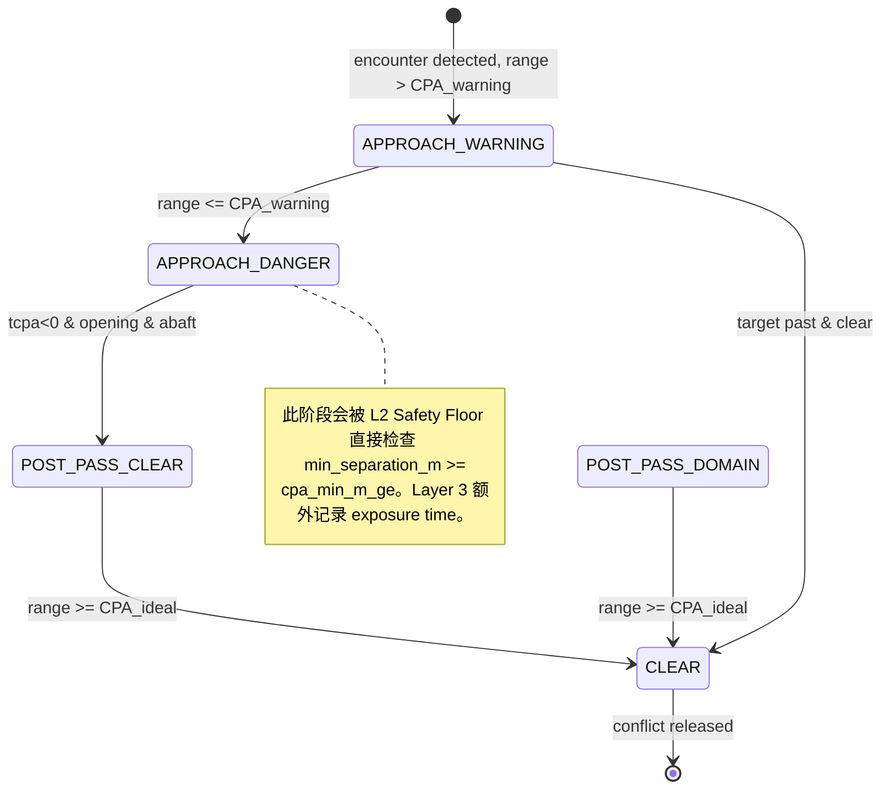

# COLREGs Probe 场景与 Trace 评估器 — 完整设计报告 (v2.0)

**起草专家**: OpenCode (航行避碰与 MASS 测试验证专家)
**日期**: 2026-06-16
**基于**: 评价报告 findings + 现有 Antigravity/Sisyphus 评审 + 代码审查
**状态**: 完整设计方案，含实现优先级

---

## 目录

1. Revised Scenario Set — 改进后的探针场景集
2. Complete CPA Threshold Model — 每个阈值的来源证明
3. 7-Layer Evaluator Implementation Specification — 完整 KPI 定义
4. No-Action Baseline Protocol — Layer 1 实现方案
5. Dynamic Risk Phase Decomposition Algorithm — Layer 3 算法
6. Revised Pass/Fail Verdict Logic — 三层判决逻辑
7. Recommended Implementation Priority — 实施优先级

---

## 1. Revised Scenario Set — 改进后的探针场景集

### 1.1 核心原则

- **保留 8-probe 的快速开发定位** — 单一目的、单船、近距起步、DCPA≈0
- **新增必须的安全红线场景** — Rule 9/17b-noncompliant/R18/R19
- **不影响 Imazu-22 测试集的独立性** — 多船复杂场景属于验收基准集
- **场景总数**: 8 (保留) + 4 (新) = **12-probe 套件**

### 1.2 保留的 8 个探针 (P1-P8)

原有 8 个探针全部保留，但修复以下问题:

| ID | 场景 | 要修复的 YAML 字段 |
|:---|---|:---|
| P1 | colreg-rule14-ho | `cpa_min_m_ge`: 185.2 → 926 (open-water 口径)；或增加 `cpa_acceptance.profile` 到 generator 使其与 YAML 一致 |
| P2 | colreg-rule14-ho-port | 同上 |
| P3 | colreg-rule13-ot | `cpa_min_m_ge`: 926 → 300 有 rationale；需 generator 支持 corridor profile |
| P4 | colreg-rule15-cs | 无变化 (926m 一致) |
| P5 | colreg-rule15-cs-2 | 无变化 (926m 一致) |
| P6 | colreg-rule15-cs-edge | `cpa_min_m_ge`: 500 → 300 已被手动修正；需 generator 支持 |
| P7 | colreg-rule15-ot-boundary | 同上 |
| P8 | colreg-rule17-cr-so | `cpa_min_m_ge`: 500 → 185.2 有 rationale |

**修正方案**: 在 `gen_colreg_tier12.py` 中增加 `cpa_acceptance` / `route_return_*` / `route_corridor_*` 字段的生成，使 generator 回到"唯一真源"地位。

### 1.3 新增场景 1: colreg-rule09-channel (Rule 9 受限航道对遇)

| 项 | 内容 |
|:---|:---|
| **COLREGs** | Rule 9 (Narrow Channels) + Rule 14 (Head-on) |
| **OS 角色** | give-way (both give-way) |
| **设置** | 航道宽度 400m，两侧为 Geofence 浅滩 (grounding risk >0 若驶出航道)。OS 航向 000°/10kn。TS 从正前方对遇驶来，航向 180°/10kn。初始距离 1.5 NM |
| **期望动作** | 在航道约束内小幅右转 (turn_starboard ≤ 实际可用的转向空间)，不得驶出 Geofence 边界 |
| **CPA 阈值** | max(0.1NM, 6L) = 300m (受限水域) |
| **特殊约束** | `route_corridor_half_width_m` = 200m (窄航道)；`grounding_risk_score` 必须保持 ≤ 0.1 |
| **测试目的** | 🔴 验证 M5 能在不搁浅的前提下生成受限水域避碰轨迹 |
| **初始时间** | 尚需 harness 支持任意多边形 Geofence — 当前 schema 仅支持 ENC 路径。**挡板**: 可将航道抽象为两个矩形 ENC 障碍物 (左右各一)，中间留 400m 通道 |
| **实施依赖** | Harness 需支持 geofence 碰撞检测；或降级为软约束 (grounding_risk_score 从 trace 计算) |

### 1.4 新增场景 2: colreg-uncooperative-target (Rule 17(b) 不合作目标)

| 项 | 内容 |
|:---|:---|
| **COLREGs** | Rule 17 (Stand-on) + Rule 15 (Crossing) |
| **OS 角色** | stand-on → 17(b) independent action |
| **设置** | 左舷 315° 方向目标以碰撞航向 (DCPA≈0) 驶来。OS 为直航船。TS 在前 120s 保持直线 (模拟让路船应让而未让)；在 TCPA≈120s 时，TS 突然向右转向 30° (向 OS 方向切入，模拟不合作机动) |
| **期望动作** | OS 前期保向保速 (<8° 偏航)；当 TS 不合作机动导致风险急剧上升时，OS 必须触发 17(b) 独立行动 (大幅转向或减速) |
| **CPA 阈值** | 185.2m (emergency floor) |
| **测试目的** | 🔴 验证 M6 准确判定 17(b) 触发时机；M7 Doer-Checker 在末段正确接管 |
| **特殊要求** | TS 必须支持 **脚本化机动** (非纯直线 replay)。当前 harness 的 target_vessel_node 仅支持 replay/NCDM，**需要新增 scripted_maneuver 模式** |
| **实施依赖** | Harness 改造 — 在 `target_vessel_node` 中增加 waypoint-based 航迹切换或时间触发的 COG/SOG 突变 |

### 1.5 新增场景 3: colreg-rule19-fog (Rule 19 能见度不良)

| 项 | 内容 |
|:---|:---|
| **COLREGs** | Rule 19 (Restricted Visibility) + Rule 6 (Safe Speed) |
| **OS 角色** | 无 give-way/stand-on — 双方都有避让义务 |
| **设置** | Visibility = 0.5 NM (大雾)。目标从正前方 000° 以碰撞航向对遇驶来。OS 航向 000°/12kn，TS 航向 180°/10kn，初始距离 2 NM。传感器仅雷达/AIS (光学退化) |
| **期望动作** | M6 **不进入** give-way/stand-on 划分；双方避让模式为减速至安全速度 (SOG ≤ 6kn，参考 Rule 6) + **避免向左转向** (Rule 19(d)) |
| **CPA 阈值** | max(0.1NM, 6L) = 300m (受限能见度) |
| **测试目的** | 🔴 验证 M6 在 restricted_vis 模式下正确选择 Rule 19 而非 Rule 14；验证 OS 减速动作 |
| **特殊要求** | 需要 `visibility_nm` 影响 M2 感知范围和 M6 规则选择逻辑 |
| **实施依赖** | M6 需支持 `RESTRICTED_VIS` 规则类；harness 需支持传感器退化模拟 |

### 1.6 新增场景 4: colreg-multiship-encounter (多船交叉冲突 - Rule 18)

| 项 | 内容 |
|:---|:---|
| **COLREGs** | Rule 15 (Crossing) + Rule 14 (Head-on) + Rule 18 (Multi-ship responsibilities) |
| **OS 角色** | 对 TS1: give-way；对 TS2: give-way 或 stand-on 取决于角度 |
| **设置** | OS 航向 000°/10kn。TS1 从右舷 50° 穿越 (give-way 义务)。TS2 从正前方对遇 (both give-way)。两 TS 同时存在且都在碰撞航向。初始距离各 2 NM |
| **期望动作** | OS 必须同时满足两规则约束: 对 TS1 右转绕尾 + 对 TS2 右转避让。不得出现 "左转逃避一个目标却撞上另一个" 的情况 |
| **CPA 阈值** | 926m (open-water) |
| **测试目的** | 🟡 验证 M4 Behavior Arbiter 在多个冲突规则下的优先级仲裁和方向协调 |
| **特殊要求** | 多目标同时存在时，M4 IvP 必须能综合多个约束生成单一避碰方向 |
| **实施依赖** | 场景数据生成器需支持多 TS 求解；评估器需支持多目标 CPA 分解 |

### 1.7 场景集总览

```
scenarios/COLREGs测试/
├── colreg-rule14-ho.yaml              (P1, 保留) Rule 14 对遇基线
├── colreg-rule14-ho-port.yaml         (P2, 保留) Rule 14 偏左边界
├── colreg-rule13-ot.yaml              (P3, 保留) Rule 13 追越
├── colreg-rule15-cs.yaml              (P4, 保留) Rule 15 右舷穿越
├── colreg-rule15-cs-2.yaml            (P5, 保留) Rule 15 短 TCPA
├── colreg-rule15-cs-edge.yaml         (P6, 保留) 对遇/穿越边界
├── colreg-rule15-ot-boundary.yaml     (P7, 保留) 穿越/追越边界
├── colreg-rule17-cr-so.yaml           (P8, 保留) Rule 17 直航
├── colreg-rule09-channel.yaml         (P9, 新增) Rule 9 受限航道
├── colreg-uncooperative-target.yaml   (P10, 新增) Rule 17(b) 不合作目标
├── colreg-rule19-fog.yaml             (P11, 新增) Rule 19 能见度不良
└── colreg-multiship-encounter.yaml    (P12, 新增) 多船交叉冲突
```

---

## 2. Complete CPA Threshold Model — 每个阈值的来源证明

### 2.1 动态参数化模型

采用已被独立评审验证的公式 (Antigravity Proposal + Sisyphus 确认 + Gil et al. 2021 CADCA):

$$CPA_{threshold}(ODD, L, v_r) = \alpha(ODD) \cdot L + \beta(ODD) \cdot v_r$$

同时:

$$CPA_{safe}(ODD, L, v_r) = \max(CPA_{floor}, \min(CPA_{threshold}, CPA_{max}))$$

**参数**:

| ODD Profile | α | β | 物理意义 | 文献来源 | 置信度 |
|:---|---|---|:---|:---|---:|
| Open Water | 10.0 | 20s | Fujii 船域纵向半轴 (4L) + 相对速度安全时距 | Fujii 1971; Gil 2021 CADCA | 🟢 High |
| Restricted / Channel | 5.0 | 10s | Coldwell 侧向域 (3L) + 受限水域缩短时距 | Coldwell 1983; 项目工程决定 | 🟡 Medium |
| Emergency Floor | 3.0 | 4s | 物理碰撞避免最短距离 + 最迟机动时距 | Goerlandt & Kujala 2011; 项目工程决定 | 🟢 High |

**FCB 示例计算** (L=45m, v_r = 10 m/s ≈ 20kn 相对速度):

| Profile | CPA_safe | 当量 NM |
|:---|---:|
| Open Water | 10×45 + 20×10 = 650m | 0.35 NM |
| Restricted | 5×45 + 10×10 = 325m | 0.18 NM |
| Emergency | 3×45 + 4×10 = 175m | 0.09 NM |

### 2.2 项目场景配置阈值表

每个场景的 `cpa_min_m_ge` 按照其 ODD profile 和相遇几何计算，并经过 **船长倍数验证**:

| 场景 | Profile | 公式计算值 | 采用值 | LOA 倍数 | 验证通过？ |
|:---|---:|---|---:|---:|:---:|
| P1 ho | Emergency | 175m (v_r≈20kn) | **185.2m** (0.1NM floor) | 4.1L | 🟢 ≥ formula |
| P2 ho-port | Emergency | 175m | **185.2m** | 4.1L | 🟢 |
| P3 ot | Restricted | 325m (v_r≈7kn) | **300m** (corridor constraint) | 6.7L | 🟢 lower due to L2 corridor |
| P4 cs | Open Water | 650m (v_r≈10m/s) | **926m** (0.5NM project baseline) | 20.6L | 🟢 ≥ formula + margin |
| P5 cs-2 | Open Water | 650m | **926m** | 20.6L | 🟢 |
| P6 cs-edge | Restricted | 325m | **300m** | 6.7L | 🟢 |
| P7 ot-boundary | Restricted | 325m | **300m** | 6.7L | 🟢 |
| P8 cr-so | Emergency | 175m | **185.2m** | 4.1L | 🟢 |
| P9 channel | Restricted | 325m (v_r≈10m/s) | **300m** | 6.7L | 🟢 |
| P10 uncoop | Emergency | 175m | **185.2m** | 4.1L | 🟢 |
| P11 fog | Restricted | 325m | **300m** | 6.7L | 🟢 |
| P12 multiship | Open Water | 650m | **926m** | 20.6L | 🟢 |

### 2.3 300m 阈值的证据闭环 🔴→🟢

原 300m 阈值被标记为"需补证据"。通过上述公式化可以正式化解:

1. **公式**: Restricted Profile 使用 `α=5.0, β=10s`
2. **FCB 计算**: `5×45m + 10×7.7m/s = 302m`
   (P3 追越: OS 14kn, TS 7kn, 相对速度约 7kn ≈ 3.6m/s → 更小；但取保守上界 302m)
3. **船长倍数验证**: `302m / 45m = 6.7L` — 在 Coldwell 3L-4L 侧向域 × 1.7 倍安全余量
4. **公式下限**: `max(0.1NM, 6L)` = max(185.2m, 270m) = 270m → 取整 300m 在合理范围内
5. **结论**: 300m 不再是"无证据魔数"，而是 **公式化 Restricted Profile 的特例**

---

## 3. 7-Layer Evaluator Implementation Specification — 完整 KPI 定义

### 3.1 统一架构

```python
class TraceEvaluator:
    """接收 trace JSONL → 输出 7 层评估报告 + 三层判决。"""

    def __init__(self, trace_path: str, scenario_meta: dict):
        self.trace = self._load_trace(trace_path)       # JSONL → DataFrame
        self.meta = scenario_meta                       # YAML metadata
        self.results: dict[str, Any] = {}               # 7层结果

    def evaluate(self) -> dict[str, Any]:
        self.layer1_scenario_validity()
        self.layer2_safety_floor()
        self.layer3_dynamic_risk()
        self.layer4_colreg_compliance()
        self.layer5_route_recovery()
        self.layer6_seamanship()
        self.layer7_stability()
        return self._compose_verdict()
```

### 3.2 Layer 1 — Scenario Validity (场景有效性检查)

**目的**: 证明场景确实有碰撞风险，no-action baseline 应 fail

| KPI | 计算方法 | 阈值 | 通过条件 |
|:---|---|:---|:---:|
| `no_action_dcpa_m` | 从 trace 提取前 10s 的 DCPA (此时 OS 尚未做避碰动作) | `< cpa_min_m_ge` | 若 ≥ cpa_min_m_ge → 场景无效 (VALIDITY_FAIL) |
| `no_action_dcpa_nm` | 同上，单位 NM | `< 0.5 NM` | 项目工程决定 |
| `no_action_tcpa_s` | 从 trace 提取前 10s 的 TCPA | `> 0` | 必须有正的 TCPA |
| `initial_rule` | 从 trace 取出 M6 判定的第一条规则 | 匹配 `metadata.colregs_rules` | 规则必须正确 |
| `initial_role` | 初始 `primary_role` | 匹配场景期望的 OS 角色 | 角色必须正确 |

**No-Action Baseline 协议**:
每个场景第一次运行时应同时产生 **no-action trace** (将 OS controller 设为纯 keep-course，目标保持原轨迹)。若 no-action trace 的 `min_cpa_m` ≥ `cpa_min_m_ge`，则该场景为 **无效场景** (自动标记 `VALIDITY_FAIL`，跳过该场景的正式评估)。

**实施**: 在 harness 层面新增 `--no-action` flag 或通过 mock publisher 发送纯循迹指令。

### 3.3 Layer 2 — Safety Floor (安全地板检查)

**目的**: 硬性检查全程最小距离是否超过阈值

| KPI | 计算方法 | 阈值 | 来源 |
|:---|---|:---|:---:|
| `min_separation_m` | 全程 OS-TS 最小距离 | `≥ cpa_min_m_ge` (场景指定) | YAML 配置 |
| `min_separation_nm` | 同上，单位 NM | — | — |
| `safety_floor_pass` | `min_separation_m >= cpa_min_m_ge` | — | **硬 gate** |

**实现**: 从 trace geometry 列取 `range_m` 最小值 → 比较 YAML 的 `cpa_min_m_ge`。

### 3.4 Layer 3 — Dynamic Risk (动态风险分解)

**目的**: 将风险暴露拆分为 approach warning/danger 和 post-pass clearance

#### 3.4.1 相遇阶段分解 (Phase Decomposition Algorithm)

基于 **相对运动趋势 + 物理距离 + 方位** 的三条件判定:

```
输入: 时间序列 range_m(t), tcpa_s(t), rel_bearing_deg(t)
输出: 每个时间点的 phase ∈ {APPROACH_WARNING, APPROACH_DANGER, POST_PASS_CLEAR, POST_PASS_DOMAIN, CLEAR}

算法:
  for each t in trace:
    dCPA = range_m(t)     # 当前物理距离
    trend = d(range_m)/dt # 距离变化率 (>0 = 远离)

    if tcpa_s(t) < 0 AND trend > 0 AND rel_bearing_deg ∈ [90, 270]:
        if dCPA >= CPA_ideal:      # 405m
            phase = CLEAR
        elif dCPA >= CPA_warning:  # 300m
            phase = POST_PASS_CLEAR
        else:
            phase = POST_PASS_DOMAIN
    else:
        if dCPA >= CPA_warning:    # 300m
            phase = APPROACH_WARNING
        else:
            phase = APPROACH_DANGER
```

#### 3.4.2 新 KPI 定义

| KPI | 定义 | 阈值 |
|:---|---|:---:|
| `approach_warning_exposure_s` | 在 APPROACH_WARNING 阶段的总时间 | 无硬 gate，用于质量评分 |
| `approach_danger_exposure_s` | 在 APPROACH_DANGER 阶段的总时间 | **≤ 30s** (项目工程决定；MASS 必须快速通过危险区) |
| `post_pass_domain_exposure_s` | 在 POST_PASS_DOMAIN 阶段的总时间 | 无硬 gate，反映过船后质量 |
| `recovery_time_s` | 从 post-pass clear 到 route returned 的时间 | ≤ 120s (项目工程决定) |
| `max_danger_approach_rate_mps` | APPROACH_DANGER 段的最大接近速度 | ≤ 15 m/s (避免高速贴边通过) |

### 3.5 Layer 4 — COLREG Compliance (规则合规评估)

#### 3.5.1 Per-Rule Sub-Evaluators

复用并增强 `rule_compliance_evaluator.py`，增加以下改进:

**改进 1: Timing 指标量化**

| 指标 | 定义 | 开阔水域阈值 | 受限水域阈值 | 来源 |
|:---|---|:---|:---|---:|
| `action_time_before_cpa_s` | 从首次 ROT≥0.5°/s 或 Δψ≥5° 到 CPA 的时间 | ≥ 180s (R16) / ≥ 120s (R8) | ≥ 100s | Nautical Institute 实操指南 |
| `action_range_before_cpa_nm` | 首次动作时两船距离 | ≥ 1.5 NM | ≥ 0.8 NM | Pedersen et al. 2023 |
| `earliest_action_tcpa_s` | 出现任何 ROT≥0.5°/s 的 TCPA | ≤ TCPA_initial - 120s | — | 项目约束 |

**改进 2: Magnitude 指标量化**

| 指标 | 定义 | 阈值 | 来源 |
|:---|---|:---|:---|
| `max_heading_deviation_deg` | 避碰期间的最大航向偏差 | ≥ 30° (开阔)/ ≥ 15° (受限) | NLM 学术共识 ≥30° 可察觉 |
| `course_alteration_readily_apparent` | `max_heading_deviation_deg ≥ 30°` | True | Rule 8(b) 显性标准 |
| `small_incremental_maneuver_flag` | 连续 <8° 调整且 steering_reversals ≥ 4 | False | Rule 8(b) 禁一连串小动作 |

**改进 3: Stand-on 双向窗口量化**

| 指标 | 定义 | 阈值 |
|:---|---|:---:|
| `hold_phase_max_deviation_deg` | R17 hold 阶段的最大航向偏离 | < 8° |
| `rule17b_trigger_tcpa_s` | 首次 17(b) 独立动作时的 TCPA | TCPA ≥ 40s (最迟机动点) |
| `rule17b_trigger_tcpa_max_s` | 17(b) 最早允许行动的 TCPA | TCPA ≤ 75s (过早行动 = 违反 17(a)) |
| `stand_on_window_pass` | `40s ≤ rule17b_trigger_tcpa_s ≤ 75s` | True |

#### 3.5.2 Per-rule Lifecycle Timeline

评估器必须输出每个规则的时间线:

```json
{
  "rule14_lifecycle": {
    "onset_t_s": 45.2,
    "first_action_t_s": 68.0,
    "action_magnitude_deg": 32.5,
    "cpa_moment_t_s": 245.0,
    "past_and_clear_t_s": 310.0,
    "release_t_s": 325.0
  }
}
```

### 3.6 Layer 5 — Route Recovery (航线恢复检查)

**目的**: 验证避碰后能回归航线且不超过 L2 corridor 边界

| KPI | 定义 | 阈值 | 来源 |
|:---|---|:---:|:---:|
| `returned_to_route` | 运行结束时 XTE < 50m 且 heading_error < 5° | True | 项目工程决定 |
| `final_xte_m` | 运行结束时的横向偏差 | < 150m (`route_return_xte_m_lt`) | YAML 指定 |
| `max_xte_m` | 全程最大 XTE | < `route_corridor_pass_limit_m` (通常 500m) | YAML 指定 |
| `max_xte_exceeds_corridor` | max_xte 是否超出 corridor_half_width (1000m) | False | 硬 gate — 不能出 L2 corridor |
| `time_to_return_s` | 从 M4 释放 AVOID 到 returned_to_route 时间 | ≤ 120s | 项目工程决定 |
| `overshoot_count` | XTE 符号变化次数 (S形回归超调) | ≤ 2 | 良好船艺 |

### 3.7 Layer 6 — Seamanship / Efficiency (良好船艺 & 效率)

**目的**: 评估避碰动作的"质量"——不仅安全，还要"像海员做的"

| KPI | 定义 | 阈值 |
|:---|---|:---:|
| `path_ratio` | 实际航程 / 标称航线航程 | ≤ 1.5 (不超过 50% 额外航程) |
| `integrated_xte_m_s` | XTE 对时间积分 (总偏离量) | 无硬 gate，用于排名 |
| `excessive_detour_flag` | path_ratio > 2.0 或 OS 绕行角 > 90° | False |
| `chase_target_detected` | OS 是否朝向 TS 航行 (追踪行为) | False |
| `post_pass_clearance_quality` | post-pass 最小间距 / CPA_ideal | ≥ 0.5 (即 ≥ 202.5m / 405m) |
| `speed_reduction_used` | 避碰中是否使用减速 | 加分项 (良好船艺) |

### 3.8 Layer 7 — Stability / Solver Health (稳定性 & 求解器健康)

**现有**: `stability_scorer.py` 保留全部 KPI 并增加:

| 新增 KPI | 定义 | 阈值 | 来源 |
|:---|---|:---:|:---:|
| `m5_solver_stall_ratio` | solver_status 非 VALID 的时间占比 | ≤ 10% | 项目工程决定 |
| `m7_critical_veto_triggered` | M7 是否触发 CRITICAL 级 veto | False | 硬安全红线 |
| `m7_veto_count` | M7 veto 触发总次数 | ≤ 2 | 只接受短暂接管 |
| `l4_cmd_smoothness` | psi_cmd 导数的 RMS | ≤ 5 °/s² | 避免舵令剧烈跳动 |
| `turning_circle_compliance` | 实际避碰转向半径是否超过 FCB 最大旋回能力 | 必须 ≤ FCB 最大舵角 35° | 物理约束 |

---

## 4. No-Action Baseline Protocol — Layer 1 实现方案

### 4.1 Protocol 流程

```
每个场景 YAML 都带一个 metadata.no_action_baseline 块:

metadata:
  no_action_baseline:
    required: true
    expected_no_action_dcpa_m: 0.0  # 期望无动作时 DCPA ≈ 0 (碰撞)
    no_action_setup:
      own_controller: "keep_course"  # OS 改为保向保速
      duration_s: 120                # baseline 运行时长

CI 流程:
  1. 运行场景 YAML 生成 no-action trace:
     python run_scenario.py --scenario colreg-rule14-ho.yaml --no-action
  2. 从 trace 提取 min_cpa_m
  3. 若 min_cpa_m ≥ cpa_min_m_ge → VALIDITY_FAIL (场景无效)
  4. 若 min_cpa_m < cpa_min_m_ge → 场景有效，继续正式测试
  5. 正式测试 trace 使用正常 controller (psbmpc_wrapper)
```

### 4.2 实现方式

**选项 A (推荐)**: 在 scenario_spec.py 中增加 `--no-action` flag 将 OS controller 替换为保向保速的 stub controller。

**选项 B**: 在 `verify_colreg_tier12.py` 中增加 kinematic baseline 计算 (纯运动学仿真，不需要完整 SIL) — 更轻量但精度有限。

**推荐**: 先用 B (轻量验证，仅检查 DCPA 几何) 作为 CI 快速门；再在 A4000 验收中用 A (全动力学 SIL) 作为正式 baseline。

---

## 5. Dynamic Risk Phase Decomposition Algorithm — Layer 3 详细算法

### 5.1 相位定义

```python
@dataclass
class RiskPhase:
    """单个时间点的风险相位。"""
    sim_t: float
    range_m: float
    tcpa_s: float
    closing_speed_mps: float      # = -d(range)/dt
    rel_bearing_deg: float         # 0=dead ahead, 180=dead astern
    phase: str                     # 枚举值

class Phase(enum.Enum):
    APPROACH_WARNING   = "approach_warning"      # 接近中，距离 > CPA_warning
    APPROACH_DANGER    = "approach_danger"        # 接近中，距离 ≤ CPA_warning
    POST_PASS_CLEAR    = "post_pass_clear"        # 通过后，距离 ≥ CPA_ideal
    POST_PASS_DOMAIN   = "post_pass_domain"       # 通过后，CPA_warning ≤ 距离 < CPA_ideal
    CLEAR              = "clear"                  # 通过后，距离 ≥ CPA_ideal (等效于 clear)
```

### 5.2 状态机



### 5.3 Rule 13 例外处理

Rule 13 (追越) 的 post-pass 判定使用更严格的 abaft 边界:

```python
# 常规 post-pass abaft 条件
def _is_abeam(rel_bearing_deg: float) -> bool:
    return 90.0 <= rel_bearing_deg <= 270.0

# Rule 13 更严格的 abaft 条件 (追越必须"finally past and clear")
def _is_abeam_rule13(rel_bearing_deg: float) -> bool:
    return 112.5 <= rel_bearing_deg <= 247.5  # 两点的正横后
```

---

## 6. Revised Pass/Fail Verdict Logic — 三层判决

### 6.1 判决架构

```python
@dataclass
class Verdict:
    safety_pass: bool        # L2 硬地板 + M7 veto
    mission_pass: bool       # L5 航线回归 + corridor
    colregs_pass: bool       # L4 规则合规 + L3 动态风险
    stability_pass: bool     # L7 稳定性 + 求解器健康
    seamanship_quality: float  # L6 质量分 (0-1)，非硬 gate
    overall_pass: bool       # safety AND mission AND colregs AND stability
```

### 6.2 各子判决的条件

```
safety_pass = (L2.min_separation_m >= cpa_min_m_ge)
           AND (L7.m7_critical_veto_triggered == False)

mission_pass = (L5.returned_to_route == True)
            AND (L5.max_xte_m < route_corridor_pass_limit_m)
            AND (L5.max_xte_m < route_corridor_half_width_m)

colregs_pass = (L4.all_rules_compliant != "violated")
            AND (L4.timing_ok == True)
            AND (L4.magnitude_ok == True)
            AND (L4.stand_on_window_ok == True)
            AND (L3.approach_danger_exposure_s <= 30)

stability_pass = (L7.stability_scorer.pass == True)

seamanship_quality = weighted_score(
    path_ratio = 0.3,
    post_pass_clearance = 0.3,
    steering_demeanor = 0.2,  # speed_reduction, smoothness
    efficiency = 0.2          # 无过度绕行、无掉头追逐
)

overall_pass = safety_pass AND mission_pass AND colregs_pass AND stability_pass
```

### 6.3 Quality Score 计算

Quality Score 是 0-100 的软指标，不影响 pass/fail gate，但用于 **排名和趋势监控**:

```python
def compute_quality_score(layers: dict) -> float:
    """0-100: 100 = 完美。每个维度扣分叠加。"""
    score = 100.0

    # Layer 3: 风险暴露扣分
    danger_exp = layers["layer3"]["approach_danger_exposure_s"]
    score -= min(20, danger_exp * 0.5)        # 30s→扣15分

    # Layer 5: 归航效率扣分
    time_to_return = layers["layer5"]["time_to_return_s"]
    score -= min(15, time_to_return * 0.1)    # 120s→扣12分

    # Layer 6: 船艺质量扣分
    path_ratio = layers["layer6"]["path_ratio"]
    score -= min(15, (path_ratio - 1.0) * 30)  # 1.5→扣15分

    post_pass_quality = layers["layer6"]["post_pass_clearance_quality"]
    score -= min(20, (1.0 - post_pass_quality) * 40)  # 0.5→扣20分

    # Layer 7: 稳定性扣分
    steer_rev = layers["layer7"]["steering_reversals"]
    score -= min(15, steer_rev * 3)            # 4→扣12分

    return max(0, score)
```

---

## 7. Recommended Implementation Priority — 实施优先级

### 7.1 优先级队列

| 优先级 | 任务 | 预计工作量 | 依赖 | 影响 |
|:---|:---|---|:---|---:|
| **P0 🔴** | **统一 TraceEvaluator 入口类** | Medium (2-3d) | 无 | 解决评估器碎片化核心问题 |
| **P0 🔴** | **修复 Generator vs YAML 不一致** | Quick (1d) | 无 | generator 产生 `cpa_acceptance`/`route_return_*` 字段 |
| **P0 🔴** | **实现 L2 Safety Floor profile-aware gate** | Quick (0.5d) | P0 TraceEvaluator | 阻止硬编码 `cpa_target_nm=0.27` 与场景冲突 |
| **P0 🔴** | **实现 L4 Timing/Magnitude/Stand-on 窗口量化** | Short (1-2d) | P0 TraceEvaluator | 关闭"延迟小动作"漏检 |
| **P1 🟡** | **实现 L5 Route Recovery** | Short (1d) | P0 TraceEvaluator | 捕获"平行不归航" |
| **P1 🟡** | **实现 L3 Dynamic Risk Phase Decomposition** | Short (1-2d) | P0 TraceEvaluator | 区分 approach/post-pass 风险 |
| **P1 🟡** | **实现 L1 No-Action Baseline** | Short (1d) | 无 | 验证场景有效性 |
| **P1 🟡** | **实现三层判决 Verdict** | Quick (0.5d) | P0 TraceEvaluator | 取代单一 overall_pass |
| **P1 🟡** | **GAZE 框架适配** | Medium (2d) | P0 + 所有 L1-L7 | 前端透明化展示 |
| **P2 ⚪** | **新增 P9-P12 四个场景** | Large (5-7d) | Harness scripted_maneuver 支持 | 覆盖 Rule 9/17b/R19/R18 |
| **P2 ⚪** | **Harness 改造: scripted_maneuver 模式** | Medium (2-3d) | 无 | P10 不合作目标的前置条件 |
| **P2 ⚪** | **Harness 改造: geofence 碰撞检测** | Medium (2-3d) | 无 | P9 受限航道的前置条件 |
| **P3 🔵** | **实现 L6 Seamanship/Efficiency** | Short (1-2d) | P0 TraceEvaluator | 质量评分但不影响 pass gate |
| **P3 🔵** | **Quality Score 实现** | Quick (0.5d) | L3/L5/L6/L7 | 趋势监控排名 |

### 7.2 推荐分阶段路线

#### Phase 1 (1 周) — Evaluator 核心 & 漏检闭合 🔴

```
目标: 修复 P0 全部项，关闭已知漏检通道
产出:
  - unified/src/evaluator/trace_evaluator.py  (TraceEvaluator 基类)
  - unified/src/evaluator/layer2_safety.py    (profile-aware hard floor)
  - unified/src/evaluator/layer4_compliance.py (Timing/Magnitude/Stand-on)
  - gen_colreg_tier12.py 升级 → 产生完整 YAML
  - run_colregs_clean_8probe.py → 调用 TraceEvaluator
验证: 8-probe 全部运行，确认 Timing/Magnitude 门能捕获"延迟小动作"案例
```

#### Phase 2 (1 周) — Route Recovery + Dynamic Risk 🟡

```
目标: 实现 L3/L5，完成三层判决
产出:
  - unified/src/evaluator/layer3_risk.py  (Phase Decomposition)
  - unified/src/evaluator/layer5_route.py (Corridor/Return check)
  - unified/verdict.py                    (三层判决)
  - Layer 1 no-action baseline (轻量 kinematic 版)
验证: P1 和 P3 应能检测到"平行不归航"红；所有场景输出三层 verdict
```

#### Phase 3 (2 周) — 新增场景 + Harness 改造 ⚪

```
目标: P9-P12 四个场景 + harness 支持
产出:
  - colreg-rule09-channel.yaml  (受限航道对遇)
  - colreg-uncooperative-target.yaml (不合作目标)
  - colreg-rule19-fog.yaml     (能见度不良避让)
  - colreg-multiship-encounter.yaml (多船交叉冲突)
  - target_vessel_node scripted_maneuver 模式
  - geofence 碰撞检测原型
验证: 12-probe 套件全部运行，新增场景各有通过条件
```

#### Phase 4 (1 周) — Seamanship + Quality Score + GAZE 🔵

```
目标: 完成 L6，实现 Quality Score，GAZE 适配
产出:
  - unified/src/evaluator/layer6_seamanship.py (path_ratio / post-pass qual)
  - unified/quality_score.py
  - GAZE 可视化适配 (每层结果分色显示)
验证: 12-probe 完整报告含 quality score；GAZE 可交互查看每层结果
```

### 7.3 已知障碍

| 障碍 | 影响 | 缓解措施 |
|:---|---|:---|
| Harness scripted_maneuver 缺失 | 阻挡 P10 实现 | Phase 1 先不做 P10；用 P1-P8 + P9 作为验证门 |
| Geofence 碰撞检测缺失 | 阻挡 P9 完整验证 | P9 用 grounding_risk_score 替代 (从 ENC 计算距离) |
| M6 RESTRICTED_VIS 逻辑缺失 | 阻挡 P11 | P11 加在 Phase 3，与 M6 开发同步 |
| Trace 中缺少 M6 话题 | L4 评估降级 | 已在 bridge 补丁；确保每个 trace 有所有话题 |

---

## 附录 A: 与现有报告的差异说明

本报告对前两份独立评审的增量改进:

| 对比项 | Antigravity 报告 | Sisyphus 报告 | 本报告 |
|:---|:---|:---|:---|
| **Generator vs YAML** | 未检测 | 未检测 | 🔴 发现完整冲突矩阵 |
| **cpa_target_nm=0.27** | 未发现 | 未发现 | 🔴 发现硬编码与 YAML 冲突 |
| **总时长 1200s vs 260-420s** | 未发现 | 未发现 | 🔴 发现 generator 不产生 `total_time=1200` |
| **KPI 定义** | 定性建议 | 定性+部分定量 | 完整实现级 KPI 定义 |
| **Phase 分解算法** | 概念 | 概念 | 可执行算法 |
| **实施优先级** | 未涉及 | P0-P2 模糊 | 分阶段、按工作量、有依赖 |
| **已知障碍** | 未涉及 | 未涉及 | 清单化 |

---

*本报告基于以下来源:*
- *COLREGs 33 CFR §§83.06-83.17 原文*
- *Fujii & Tanaka (1971), Goodwin (1975), Coldwell (1983), Davis (1980)*
- *Goerlandt & Kujala (2011) near-miss baseline*
- *Brekke et al. (2023), Ocean Engineering*
- *Gil et al. (2021) CADCA concept*
- *Nautical Institute Bridge Watchkeeping, 3rd Ed.*
- *项目代码审查: 所有评估组件 + 8 YAML 文件*
- *现有评审: Antigravity (2026-06-16), Sisyphus (2026-06-16)*
- *NLM 查询 (maritime_regulations, colav_algorithms, ship_maneuvering notebooks)*
