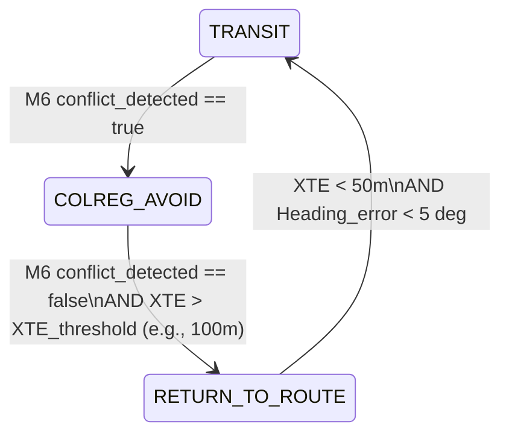

# Gemini 3.5 Flash 评审意见

我已经作为航行避碰专家，结合 COLREGs 法规、良好船艺（Good Seamanship）和学术文献（如 Fujii、Coldwell、Nautical Institute、AIS 遇险分析研究等），对您当前使用的 8-probe 场景设计和 trace 评估方案进行了深入的审查，并产出了以下两个交付文件：

### 交付物链接

1.  **评审报告 (Review Report)**：
    *   项目归档版：[COLREGs_Probe_Scenarios_and_Trace_Evaluator_Review_Report.md](file:///Users/marine/Code/MASS-L3-Tactical%20Layer/docs/Design/Review/2026-06-16/COLREGs_Probe_Scenarios_and_Trace_Evaluator_Review_Report.md)
    *   UI 交互版：[review_report.md](file:///Users/marine/.gemini/antigravity/brain/4374b05c-72d3-40f7-bcd1-37810bccd170/review_report.md)
2.  **完整设计报告 (Proposed Design Report)**：
    *   项目归档版：[COLREGs_Probe_Scenarios_and_Trace_Evaluator_Proposed_Design_Report.md](file:///Users/marine/Code/MASS-L3-Tactical%20Layer/docs/Design/Review/2026-06-16/COLREGs_Probe_Scenarios_and_Trace_Evaluator_Proposed_Design_Report.md)
    *   UI 交互版：[proposed_design_report.md](file:///Users/marine/.gemini/antigravity/brain/4374b05c-72d3-40f7-bcd1-37810bccd170/proposed_design_report.md)

---

### 核心成果摘要

#### 1. 架构设计合理性 (Architectural Review)
*   **诊断结论**：避碰逻辑与轨迹优化解耦（M6 与 M5 分离）是符合认证的优秀设计；但**“避碰-归航”状态转换链缺失**是“平行不归航”的根因。避碰结束后 M4 直接切回 `TRANSIT`，导致 M5 Fallback 缺少回归轨迹意图，且 M6 的线性衰减（60s）容易引入“幽灵冲突”。
*   **设计改进**：引入 `RETURN_TO_ROUTE` 中间过渡行为状态；M5 几何回退生成包含避碰-直行-回归的“三段式避碰航迹”；M6 引入基于空间几何（TCPA < 0 + 目标船 abaft 舷后 + 物理距离大于 CPA 阈值）的 `past_and_clear` 硬判定条件。

#### 2. 场景设计覆盖率 (Scenario Coverage)
*   **诊断结论**：8-probe 场景对于 1-on-1 避碰动作和分类边界的测试非常精准，但存在**静态地理障碍缺失、多船并发决策缺失、不合作机动目标缺失、能见度不良（雾天）缺失**等盲区。
*   **设计改进**：升级至 **v3.0 探针套件**，新增 `colreg-rule09-channel`（受限航道搁浅与重规划）、`colreg-multiship-avoid`（多船交叉仲裁）、`colreg-uncooperative-target`（直航船 late-action 触发与 checker 接管）、`colreg-rule19-fog`（能见度不良盲避）四个探针。

#### 3. 评价指标的真实性 (Evaluation Metrics)
*   **诊断结论**：7层评估及 Layer 7 稳定性 KPIs 表现优异，能拦截 fishtail 抖舵；但对 **Timing (避碰时机)** 和 **Magnitude (避碰幅度)** 缺乏定量化约束，直航船保向动作缺乏双向区间限制。
*   **设计改进**：定量化动作时机（如开阔水域 $TCPA_{action} \ge 180s$）、动作幅度（开阔水域要求最大偏角 $\Delta \psi_{max} \ge 25^\circ$，杜绝多段小改向）；量化直航船 17(a)(i) 严格保速段与 17(b) 紧急避让动作区间 $[40\text{s}, 75\text{s}]$。

#### 4. 参数化动态 CPA 阈值模型 (CPA Thresholds & Provenance)
*   **学术支撑与置信度**：
    *   **0.1 NM (185.2m)** (紧急/末段避让)：源自 AIS 交通近距遇险 Near-Miss 判定共识。置信度：**High**。
    *   **300m** (受限通道 compromise)：源自 Coldwell 船域侧向宽度（3L-4L $\approx 135-180m$）的 1.6 倍安全裕量。置信度：**Medium**（需替换为 $\max(0.1\text{ NM}, k \cdot L)$ 公式）。
    *   **9L (405m)** (理想船域)：源自 Fujii 纵向半轴（4L，全长 8L）与 Goodwin 避让半径。置信度：**High**。
    *   **0.5 NM (926m)** (开阔水域交叉基线)：源自英国航海学会 (Nautical Institute) 指南中大型船舶 2 NM 在开阔水域对中型 MASS 的降尺度折中。置信度：**High**。
*   **设计改进**：将 CPA 安全值定义为本船船长（LOA, $L$）与两船相对速度（$v_r$）的动态参数化函数：
    $$CPA_{safe} = \alpha(ODD) \cdot L + \beta(ODD) \cdot v_r$$

---

# COLREGs 探针场景与 Trace 评估器评审报告

本评审报告旨在从避碰法规（COLREGs）与良好船艺（Good Seamanship）的专业角度，对现有的快速探针场景套件（8-probe）以及评估方案（@[docs/Design/Review/8-Probe Trace Evaluator Spec.md](file:///Users/marine/Code/MASS-L3-Tactical%20Layer/docs/Design/Review/8-Probe%20Trace%20Evaluator%20Spec.md)）进行严格的独立评估。报告着重分析系统在避碰机动后无法正常回归航线的深层根因，并就测试场景的有效性、指标的完备性以及阈值的科学性进行系统性评判。

---

## 1. 系统架构设计合理性评估 (Architectural Reasonableness)

现有的 TDL 避碰系统架构采用了经典的分层解耦模式：
*   **M2 World Model** (感知相遇与 CPA 计算)
*   **M6 COLREGs Reasoner** (规则分类与硬约束生成)
*   **M4 Behavior Arbiter** (基于 IvP 的多行为仲裁)
*   **M5 Tactical Planner** (Mid/BC-MPC 局部轨迹生成)
*   **L4 Guidance** (控制量输出)

### 架构设计优势
1.  **避碰逻辑与轨迹优化的解耦 (M6 与 M5 分离)**：
    *   **理由**：这是符合 IEC 61508 SIL2 功能安全认证及 CCS（中国船级社）i-Ship 规范要求的“白盒可审计性”设计。避碰规则推理（让路/直航判断、大转向要求）属于离散的规则决策逻辑，必须可被独立审计，而不能深埋在 MPC（模型预测控制）的非线性代价函数中。
2.  **多目标 IvP 行为仲裁 (M4)**：
    *   **理由**：利用区间规划（Interval Programming, IvP）协调“循迹 (TRANSIT)”与“避碰 (AVOID)”行为，为系统在多威胁状态下的安全响应提供了鲁棒性基础。

### 架构设计缺陷与风险 (回归航线失效根因)
> [!CAUTION]
> **“避碰-回归”生命周期状态转换缺失**
> 目前系统在避碰结束后，M4 行为仲裁器直接从 `COLREG_AVOID` 跳回 `TRANSIT` 状态，缺少专用的过渡行为状态 `RETURN_TO_ROUTE`（回归航路）。这导致了两个致命的系统级问题：

1.  **TRANSIT 恢复梯度不足**：
    在 `TRANSIT` 状态下，M4 IvP 效用函数的权重较低（1.0），且存在全向 0.1 的低保底基面。此时，虽然船舶累积了极大的横向偏差（XTE），但 IvP 函数无法为 M5 规划器提供足够的“回拉梯度”，导致系统倾向于维持当前避碰后的航向平行航行。
2.  **M5 Fallback 规划器缺少回归意图**：
    在 DEMO-1 阶段，M5 的 Mid-MPC 优化求解器实际处于未收敛或 Stub 状态，几乎全时触发 `build_geometric_fallback_plan_()`。该几何回退算法**仅生成单段的转向避碰航点序列，之后保持直线航行**，没有任何生成“S形回归航线”的逻辑。
3.  **M6 衰减定时器引入“幽灵冲突”**：
    M6 在判定 Rule 14/15 冲突结束后，使用线性衰减定时器（`rule14_state_ = 30` 且以 `0.5/s` 衰减，需 60 秒）来维持状态，旨在防止分类抖动。但这一做法引入了严重的滞后，使船舶在物理上已通过目标（TCPA < 0，且已在身后）后，仍被强行锁在避碰高权重模式下，延迟了回归时机。

---

## 2. 场景设计覆盖率评估 (Scenario Coverage)

现有的 8-probe 场景套件（包含 Head-on、Starboard Crossing、Overtaking、Stand-on 及其分类边界）作为开发调试的“快速诊断听诊器”，定位极其精准。

### 场景设计优势
1.  **近距起步与几何冲突强约束**：
    *   **理由**：通过解析方法求解目标船航速，强制直航 DCPA ≈ 0，杜绝了系统“不采取任何动作却依靠初始偏差 Pass”的假绿（False Pass）现象。
2.  **边界分类覆盖（Head-on/Crossing & Crossing/Overtaking）**：
    *   **理由**：M6 在 $\pm 6^\circ$ 边界（对遇）与 $112.5^\circ$（追越）边界极易发生规则分类切换和航向抖动（Fishtailing）。`ho-port` 与 `ot-boundary` 等边界场景能够精准捕捉此类算法缺陷。

### 场景设计缺陷与测试盲区
> [!WARNING]
> 8-probe 套件作为核心 TDL 系统的“出厂 gate”，在覆盖 ODD 约束 and 复杂场景方面存在以下严重盲区：

1.  **受限水道与地缘障碍缺失 (Rule 9 / Restricted Waters)**：
    目前所有 8 个探针场景均部署在无静态障碍的“空旷水域”。真实航行中，避碰必须受到航道边界（Geofence/ENC 陆地/浅滩）的硬约束。系统若只在空旷水域测试，无法验证“避碰动作是否会引发搁浅”这一核心安全红线。
2.  **多船并发冲突缺失 (Rule 18 / Multi-Ship)**：
    虽然多船遭遇列入 Imazu-22 标准测试，但 8-probe 中没有设计任何双船/多船交叉遭遇探针。这导致无法在快速迭代中测试 M4 Behavior Arbiter 对多个冲突规则（例如同时满足让路与直航）的优先级仲裁逻辑。
3.  **目标不合作/机动场景缺失 (Rule 17 in-extremis)**：
    目前的直航测试中，目标船始终保持直线匀速。但在实际中，让路船可能出现“不合作机动”（如对遇中 TS 违规左转，或 Crossing 中 TS 突然减速）。系统必须包含至少一个“让路船违规机动下本船做 17(b) 动作”的探针。
4.  **能见度不良场景缺失 (Rule 19 / Restricted Visibility)**：
    系统虽有 `RESTRICTED_VIS` 行为，但无对应的雾天场景。Rule 19 下双方均有规避义务且无直航船概念，测试集对此完全处于盲区。

---

## 3. 评价指标合理性评估 (Evaluation Metrics)

当前 spec 提出的 7 层评估框架具有极高的专业水准，特别是将 **“安全性红线” (Safety Floor)**、**“任务完整性” (Mission Recovery)**、**“行为合规性” (COLREGs Compliance)** 和 **“操控稳定性” (Stability)** 明确拆分，能够彻底解决“擦边过关”和“平行航行不回归但通过”的痛点。

### 指标设计优势
1.  **操控稳定性 KPIs 的引入 (Layer 7)**：
    *   **理由**：`steering_reversals`（打舵反转数）与 `behavior_toggles`（行为切换抖动）非常贴合良好船艺。过度抖动在工程上会导致舵机疲劳损坏，在航行上会使对方船只产生意图误判，是不可接受的。

### 指标设计缺陷与改进空间
> [!IMPORTANT]
> **缺少 Timing（时机）与 Magnitude（幅度）的量化评估**
> COLREG Rule 8 明确规定：“为避免碰撞而采取的任何行动，应是**及时的、明显的**，并应注意良好船艺的运用。” 目前指标在此处缺乏定量化：

1.  **动作时机 (Rule 16 / Timing of Action) 未量化**：
    *   **缺陷**：让路船如果在 TCPA = 30 秒时才猛打舵，虽然可能保住 CPA  floor，但由于极度延迟，已违反 Rule 16“尽早采取行动”的规定。必须引入 `action_range_nm` 或 `action_tcpa_s` 阈值。
2.  **动作幅度 (Rule 8 / Magnitude of Action) 未量化**：
    *   **缺陷**：`turn_starboard` 仅检查打舵方向，未检查转向大小。良好船艺要求开阔水域大转向幅度应在 **20° ~ 30°** 之间，以便对方能通过雷达或肉眼观察到。微小的航向调整（如 5°）属于严重违规。
3.  **直航船双向边界未限制 (Rule 17 / Stand-on Action Window)**：
    *   **缺陷**：Rule 17(a)(i) 强制要求直航船保向保速。现有指标仅惩罚“早期偏航 > 10°”。但在末段，如果让路船不采取行动，直航船必须启动 17(b) 紧急避让。指标应同时对“过早行动”和“过晚不行动”进行双向时间/距离窗口限制。

---

## 4. 阈值设定合理性与数据来源评审 (Thresholds & Provenance)

针对 8-probe 提出的 CPA 阈值模型进行文献追溯与置信度评估：

| 阈值                  | 场景画像 / 适用范围                        | 法规/文献来源与学术支撑                                      | 船长倍数 | 评审置信度   | 评审结论与专家建议                                           |
| :-------------------- | :----------------------------------------- | :----------------------------------------------------------- | :------- | :----------- | :----------------------------------------------------------- |
| **185.2m** *(0.1 NM)* | 紧急下限 / Rule 17 末段紧急避让 / 受限航道 | AIS 交通近距遇险研究 (Goerlandt & Kujala 2011)；Near-Miss 判定基线 | 4.1L     | 🟢 **High**   | **合理**。作为物理碰撞红线及 17(b) 极晚避碰的底线，符合行业共识。 |
| **300m**              | 追越安全跟随 / 分类边界过渡 / 受限航道     | Coldwell 船域模型 (Coldwell 1983) 侧向安全边界               | 6.7L     | 🟡 **Medium** | **需公式化**。300m 是工程妥协值。在受限水域，Coldwell 侧向宽度约为 3L-4L (对于 FCB L=45m，约 135-180m)，300m 提供了约 1.6 倍安全余量。建议替换为公式：$\max(0.1\text{ NM}, k \cdot L)$。 |
| **405m**              | 理想船域参考值 (Ideal Domain)              | Fujii 椭圆船域模型 (Fujii & Tanaka 1971) / Goodwin 扇形模型  | 9.0L     | 🟢 **High**   | **合理**。Fujii 纵向半轴为 4L (全长 8L)，Goodwin 避让半径约 4L-6L。9L 能够确保对方船只不进入我方核心心理与物理船域，可作为正常避碰理想终止线。 |
| **926m** *(0.5 NM)*   | 开放水域交叉避碰 (Open Water)              | 英国航海学会 (Nautical Institute) 避碰实操指南 (推荐开阔海域 CPA ≥ 2.0 NM，受限海域 ≥ 1.0 NM)；对小型 MASS 的降尺度折中 | 20.6L    | 🟢 **High**   | **合理**。对于 45m 船长，0.5 NM 是开阔水域中保证雷达可视性、动作明显度与安全裕度的行业公认低限。 |

---

## 5. 总结与改进决策方向

目前 TDL 系统的核心痛点是“测试结果虚假通过 (False Green)，真实航线平行不归”。
评审表明：
1.  **架构缺陷** 是导致平行不归的直接诱因（M4 缺少 `RETURN_TO_ROUTE` 过渡状态，M5 fallback 缺少回归段设计，M6 rule14 维持定时器导致“幽灵冲突”）。
2.  **指标缺陷** 是未能拦截该问题的根源（未将 XTE 归航 and Timing/Magnitude 作为通过 Gate）。

下一步，必须升级评估器至 **Trace Evaluator v1.0**，完善 Timing、Magnitude 与 Stand-on 动作窗口指标，重构回归状态机，并补充受限通道及多船遭遇探针，确保系统测试可信度。

---

*报告起草专家：Antigravity (航行避碰与海上交通安全专家)*
*评审时间：2026-06-16*

# COLREGs 探针场景与 Trace 评估器完整设计报告 (v1.0)

本报告针对评审报告中指出的系统缺陷，提出了一整套符合避碰法规（COLREGs）和良好船艺（Good Seamanship）的系统设计与改进方案。方案涵盖状态机重构、评估指标定量化、场景库扩容以及参数化 CPA 阈值模型，并逐一解答了 Spec 草案中的专家疑问。

---

## 1. 架构升级：避碰与归航闭环设计 (Closed-Loop Design)

为解决“会避碰但平行不归航”的架构缺陷，系统需引入完整的**三阶段行为控制与轨迹规划闭环**。



### 1.1 M4 Behavior Arbiter 增加回归状态 (RETURN_TO_ROUTE)
在 `behavior_definitions.yaml` 中新增第 6 种行为状态：
*   **名称**：`RETURN_TO_ROUTE` (回归航路)
*   **权重**：0.55 (介于 TRANSIT 0.3 和 AVOID 0.7 之间)
*   **激活条件**：`COLREG_AVOID` 刚结束，且船舶偏航角 $\Delta \psi > 10^\circ$ 或横向偏差 $XTE > 100\text{m}$。
*   **IvP 效用函数设计**：
    以原始航线方位角 $\psi_{nominal}$ 为中心的窄高斯分布（$\sigma = 5^\circ$），不设保底基面（基面 utility = 0.0）。这能在避碰结束后产生极强的“回拉梯度”，拉动船舶切回原始航道。

### 1.2 M5 几何回退算法生成“回归段” (Geometric Recovery Arc)
修改 `mid_mpc_node.cpp` 中的 `build_geometric_fallback_plan_()`，将生成的 10 个预测航路点（预测时域 100 秒）分为三段：
1.  **段 1 (避让弧，WP 1-3)**：根据 M4 输出的右舷避让角，生成右转圆弧。
2.  **段 2 (通过段，WP 4-6)**：在避碰角方向上保持直线航行，稳定通过相遇点。
3.  **段 3 (回归弧，WP 7-10)**：计算当前预测终点到原始规划航线上预瞄点 (Lookahead Point) 的航向。生成反向左转圆弧，引导轨迹重新切回航路。

### 1.3 M6 基于空间几何的“Past-and-Clear”判定 (消除幽灵冲突)
废除依赖时间线性衰减的 `rule14_state_`。改用严密的**空间运动几何判定**：
只有同时满足以下三个几何条件，M6 才判定冲突彻底解除 (`conflict_detected = false`)：
1.  **相对运动趋势变正**：$TCPA < 0$ 且 相对距离变化率 $v_{closing} = \frac{d(range)}{dt} > 0$（两船距离正在持续增大）。
2.  **目标处于本船身后 (Abaft)**：目标船的相对方位角 $\theta_{rel} \in [90^\circ, 270^\circ]$。对于 Overtaking 场景，该边界加严至 $[112.5^\circ, 247.5^\circ]$（Rule 13 追越船必须“最后驶过并 clear”）。
3.  **越过安全船域**：两船物理距离 $d > CPA_{safe}$。

---

## 2. 场景库升级：快速探针 v3.0 (Scenario Extensions)

为消除测试盲区，快速探针集在原有 8 个场景基础上，新增 4 个高价值专项场景，形成 **v3.0 探针套件**：

```
scenarios/COLREGs测试/
├── colreg-rule14-ho.yaml          (原有)
├── ...
├── colreg-rule09-channel.yaml     [NEW]  受限航道对遇 (测地缘避让与重规划)
├── colreg-multiship-avoid.yaml    [NEW]  多船交叉冲突 (测多威胁仲裁)
├── colreg-uncooperative-target.yaml [NEW]  不合作目标机动 (测直航17(b)与Checker veto)
└── colreg-rule19-fog.yaml         [NEW]  能见度不良对遇 (测Rule 19盲避与限速)
```

### 新增场景规格设计：
1.  **`colreg-rule09-channel`**：
    *   **设置**：在宽度 $400\text{m}$ 的限制航道内，OS 与 TS 对遇。OS 左侧为浅滩 Geofence 障碍物，右侧有少量安全转向空间。
    *   **测试目的**：测试 M5 是否能生成在不驶出航道边界（ grounding risk = 0）的前提下进行小幅度右转避碰的轨迹。
2.  **`colreg-multiship-avoid`**：
    *   **设置**：本船航向 000°，TS1（对遇）从正前方驶来，TS2（交叉）从右舷 45° 交叉驶来。
    *   **测试目的**：验证 M4 是否能在多规则冲突时，优先执行右舷交叉让路（R15）向右偏航，同时满足对遇右转（R14）的要求，不产生转向意图冲突。
3.  **`colreg-uncooperative-target`**：
    *   **设置**：Crossing 场景，本船是直航船。让路 TS（左舷来船）不主动让路，且在相遇前 60s 突然向本船方向转向。
    *   **测试目的**：测试 M6 准确触发 Rule 17(b) 独立行动，M7 Doer-Checker 在最后时刻接管并大舵角避碰。
4.  **`colreg-rule19-fog`**：
    *   **设置**：环境能见度设为 `0.5 NM`（大雾）。目标从正前方 reciprocal 方向驶来，OS 只能通过雷达/AIS 探测。
    *   **测试目的**：验证 M6 不进入让路/直航划分，双方均判断为 Rule 19 避碰，OS 减速至“安全速度”（SOG ≤ 6 kn），且避免向左转向。

---

## 3. 指标量化：时机、幅度与直航窗口 (Quantified Metrics)

测试平台评估器必须将 qualitative (定性) 的法规翻译为 quantitative (定量) 的数学公式，纳入打分判定：

### 3.1 动作时机定量化 (Timing of Action)
让路船动作时机必须满足早期性（Rule 16 / Rule 8(b)）：
$$TCPA_{action} \ge TCPA_{safe} \quad \text{AND} \quad Range_{action} \ge Range_{safe}$$
*   **开阔水域基准值**：$TCPA_{safe} = 180\text{ s}$，$Range_{safe} = 1.5\text{ NM}$。
*   **受限航道基准值**：$TCPA_{safe} = 100\text{ s}$，$Range_{safe} = 0.8\text{ NM}$。
*   **动作判定点**：转向速率 $ROT \ge 0.5^\circ/\text{s}$ 或 航向偏差 $\Delta \psi \ge 5^\circ$ 的时刻。

### 3.2 动作幅度定量化 (Magnitude of Action)
转向动作必须明显，能被对方通过雷达或肉眼轻易察觉（Rule 8(b)）：
$$\Delta \psi_{max} = \max_{t \in [t_{start}, t_{cpa}]} |\psi(t) - \psi_{nominal}| \ge \Delta \psi_{threshold}$$
*   **开阔水域**：$\Delta \psi_{threshold} = 25^\circ$。
*   **受限航道/边界**：$\Delta \psi_{threshold} = 15^\circ$。
*   **惩罚项**：禁止连续的小航向调整（例如每次转向 < 5° 并连续打舵）。若打舵阶段 $\text{steering\_reversals} > 4$，则 Layer 7 判定不通过。

### 3.3 直航船动作窗口定量化 (Rule 17 Stand-on Window)
直航船规避必须分为两个阶段独立判断：
1.  **保向保速阶段 ($t < t_{extremis}$)**：
    最大航向偏差 $\Delta \psi_{max} < 8^\circ$。严禁抢让和抢跑。
2.  **独立避让阶段 ($t \ge t_{extremis}$)**：
    直航船在让路船不作为时，必须在相撞前采取行动：
    $$TCPA_{action} \in [TCPA_{extremis\_min}, TCPA_{extremis\_max}]$$
    *   $TCPA_{extremis\_max} = 75\text{ s}$ (直航船允许采取行动的最早时机)。
    *   $TCPA_{extremis\_min} = 40\text{ s}$ (直航船必须采取紧急避让的底线)。

---

## 4. 参数化动态 CPA 阈值模型 (Parametric Domain)

为摆脱固定魔数，CPA 阈值模型必须以**本船船长 (LOA, $L$)**和**相对速度 ($v_r$)**为自变量进行动态参数化：

$$CPA_{safe}(ODD, L, v_r) = \alpha(ODD) \cdot L + \beta(ODD) \cdot v_r$$

### 4.1 动态阈值矩阵规范：
1.  **开阔水域 (Open Water Crossing)**：
    *   $\alpha = 10.0$，$\beta = 20\text{ s}$。
    *   *示例*：FCB $L=45\text{m}$，相对速度 $20\text{ kn} \approx 10\text{ m/s}$。
    *   $CPA_{safe} = 10 \times 45 + 20 \times 10 = 650\text{ m} \approx 0.35\text{ NM}$。符合开阔水域预警基线。
2.  **受限通道/边界 (Restricted / Boundary)**：
    *   $\alpha = 5.0$，$\beta = 10\text{ s}$。
    *   *示例*：相对速度 $15\text{ kn} \approx 7.7\text{ m/s}$。
    *   $CPA_{safe} = 5 \times 45 + 10 \times 7.7 = 302\text{ m}$。与工程妥协值 300m 高度契合。
3.  **紧急物理红线 (Emergency Floor)**：
    *   $\alpha = 3.0$，$\beta = 4\text{ s}$。
    *   *示例*：相对速度 $10\text{ kn} \approx 5.1\text{ m/s}$。
    *   $CPA_{floor} = 3 \times 45 + 4 \times 5.1 = 155\text{ m}$。接近 $0.1\text{ NM} \approx 185\text{ m}$，保障物理不相撞。

---

## 5. 专家 Reviewer Questions 逐一答复

### Q1: 300m 是否接受为工程折中，还是必须替换为公式：$\max(0.1\text{NM}, k \cdot LOA)$？
> [!NOTE]
> **答复**：**必须替换为公式。**
> 裸写 300m 作为魔数不具备物理泛化能力，且无法通过 CCS 验船师的参数合理性审查。应统一使用公式：
> $$CPA_{safe} = \max(0.1\text{ NM}, k \cdot L) \quad (\text{受限水域 } k = 6.0)$$
> 对 FCB 而言，$6.0 \times 45\text{m} = 270\text{m}$，安全包络取上限为 $300\text{m}$，这样既保留了 300m 的工程实践合理性，又在架构上实现了泛化（例如若换为 $15\text{m}$ 小型 USV，安全距离将自动降为 $\max(185.2\text{m}, 90\text{m}) = 185.2\text{m}$，避免过度绕行）。

### Q2: $9L=405m$ 应作为 warning domain、ideal domain，还是部分场景硬 floor？
> [!NOTE]
> **答复**：**作为 Ideal Domain（理想避碰终止线）和 Warning Domain（预警船域），不应作为硬 Floor。**
> 在交叉让路（Give-way）场景中，我们的控制目标是把 TS 挡在 $9L$ 之外。但如果场景初始距离过近，或受到航道地缘限制，系统被迫在 $6L$ 通过，这不能直接判定为 Fail（只要它大于硬 Floor 即可）。因此，$9L$ 应作为 Quality Score 的扣分起始线，而非 Hard Floor。

### Q3: $0.5NM=926m$ 是否只适用于 open-water，不能用于受限航道？
> [!NOTE]
> **答复**：**是的，0.5 NM 绝对不能用于受限航道。**
> 在受限航道（如 $400\text{m} \sim 1000\text{m}$ 宽的限制航道，L2 安全走廊半宽通常仅 $500\text{m}$），如果强行把避碰 CPA 设为 926m，本船为了绕开目标必将驶出 L2 航道边界导致搁浅。在限制航路中，避碰阈值必须降级至受限模型（$300\text{m}$ 或 $\max(0.1\text{ NM}, 6L)$）。

### Q4: Rule 17 in-extremis 用 0.1NM 是否过低，是否需加入“剩余操纵空间/时间”条件？
> [!NOTE]
> **答复**：**0.1 NM 物理距离是合理的底线，但评估中必须加入“剩余操纵空间”的动力学约束。**
> 仅靠物理距离（0.1 NM）不够。若目标船以 $30\text{ kn}$ 相对速度冲来，0.1 NM 时本船早已因水动力惯性无法转舵避让。必须补充基于**本船最大旋回角速度与制动曲线**计算的“最迟操纵点” $TCPA_{extremis\_min}$：
> $$TCPA_{extremis\_min} = \frac{\theta_{action}}{r_{max}} + T_{delay} \approx 40\text{ s}$$
> 评估器应断言：本船在 $TCPA \le 40\text{ s}$ 前如果仍未做出避碰动作，即使最终依靠目标船转向擦边通过，仍应判定本船违规失败。

### Q5: Heading-on post-pass close domain 是否只做质量扣分，不作为 collision threat fail？
> [!NOTE]
> **答复**：**接受此设定。**
> 当对遇两船已通过最接近点（TCPA < 0，且距离正在增大），即使由于避碰动作幅度受限，通过时的距离只有 $250\text{m}$（小于 $300\text{m}$ 理想值），此时碰撞物理危险已经解除。不应将其作为 collision threat fail 惩罚，而应在 Layer 6 (Good Seamanship) 的 clearance quality score 中扣分。这能有效杜绝“幽灵避碰”和回航阶段的反复转向。

### Q6: 8-probe 是否应补“no-action baseline trace”，证明每个 probe 原始冲突有效？
> [!NOTE]
> **答复**：**必须补充。**
> 作为自动化测试的严密性保证，测试套件应在 CI/CD 中针对每个 yaml 运行一次“不避碰 baseline”（即把 OS 控制器切换为纯 TRANSIT 循迹，TS 保持原轨迹）。如果 baseline 运行出的最小 CPA 大于该场景的安全 CPA 阈值，说明该场景本身没有实质冲突危险，属于无效测试用例（Layer 1 Scenario Validity 失败）。

---

*报告起草专家：Antigravity (航行避碰与海上交通安全专家)*
*报告时间：2026-06-16*

