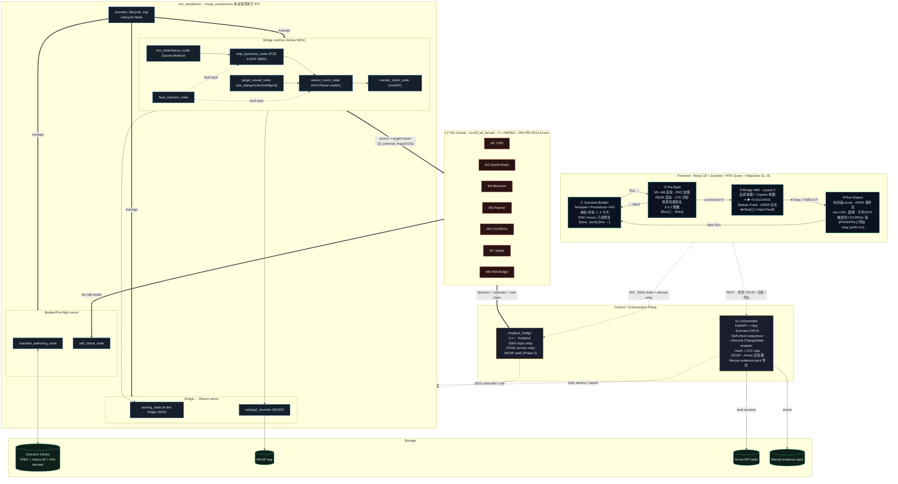

# MASS L3 TDL · SIL 架构前后端设计文档（greenfield v1.0）

| 属性 | 值 |
|---|---|
| 文档编号 | SANGO-ADAS-L3-SIL-DD-002 |
| 版本 | v1.0（greenfield 设计基线） |
| 日期 | 2026-05-12 |
| 状态 | 设计锁定（5 维度决策均 🟢 High，证据见 §11） |
| 适用 | Phase 1（5/13–6/15 → DEMO-1 Skeleton Live）+ Phase 2 增项（DEMO-2 7/31）+ Phase 3 完整化（DEMO-3 8/31）|
| 上游依据 | (a) 决策记录 `docs/Design/SIL/00-architecture-revision-decisions-2026-05-09.md` v1.0；(b) NLM Deep Research 2026-05-12（silhil_platform 笔记本，52 cited / 41 imported / 158 total sources）；(c) colav-simulator capability inventory `docs/Design/SIL/2026-05-11-colav-simulator-capability-inventory.md` |
| 用户决策日期 | 2026-05-12（布局 C + Head-on 首场景 + Captain 视图优先 + 4-screen 工作流 + greenfield 重建）|
| 关系 | **取代** 当前 `web/` 与 `src/sim_workbench/` 全部内容（用户决策 B：greenfield）。现有代码降级为 prototype，作 v0.x 归档到 `archive/sil_v0/`，DEMO-1 前以新架构替代 |
| 后续 | D2.8（7/31）合入架构报告 v1.1.3 stub 附录 F 完整化；本文档之 §3-§9 是其素材 |

---

## 0. 一句话定位

支撑 MASS L3 TDL 在 Phase 1 内**端到端跑通"场景生成 → 仿真启动 → 在线观察 → 仿真结束 → 证据导出"**完整工作流的 SIL 前后端架构，业务参照 NTNU colav-simulator 工程模式但不复制其 Python 单进程结构，技术栈对齐 v3.1 决策（ROS2 Humble + Python 3.11 + DNV maritime-schema/libcosim + MapLibre/React + foxglove_bridge），交付物对齐 CCS i-Ship/DNV-RP-0513/IEC 62288/IMO S-Mode 认证证据规范。

## 1. 系统拓扑（5 维度决策落地）



## 2. 9 节点 + 1 lifecycle mgr 责任表

| 节点 | colcon 包 | 类型 | 责任 | 关键参数 | colav-simulator 对照 |
|---|---|---|---|---|---|
| `scenario_lifecycle_mgr` | `sil_lifecycle` | `LifecycleNode` | 4-screen 状态 SSoT；Unconfigured/Inactive/Active/Deactivating/Finalized 五态机；对 9 业务节点 `change_state()` 调度 | tick_hz=50, settle_timeout_ms=2000 | `simulator.py` 内 `run()` 状态机外置 |
| `scenario_authoring_node` | `scenario_authoring` | std `Node` | YAML CRUD（FastAPI 旁路读盘）；maritime-schema + cerberus-cpp 双校验；Imazu-22 库 22 场景哈希化；AIS→encounter 5 阶段管线 | scenario_dir, imazu22_lock_hash, ais_db_dsn | `scenario_config.py` + `scenario_generator.py` |
| `self_check_node` | `sil_lifecycle` | std `Node` | 聚合 M1-M8 `/health` topic；ENC tile 加载验证；ASDR 启动确认；UTC PTP sync 检查；场景 SHA256 签名 | health_window_ms=500, ptp_drift_ms_max=10 | colav-simulator 无（greenfield 新增）|
| `ship_dynamics_node` | `fcb_simulator` | std `Node` | FCB own-ship 4-DOF MMG（Yasukawa 2015）；RK4 dt=0.02s；输入 actuator cmd；输出 own_ship_state | hull_class=SEMI_PLANING, dt=0.02 | `models.py` ViknesParams |
| `env_disturbance_node` | `env_disturbance` | std `Node` | Gauss-Markov wind + current；恒定/脉冲/Monte Carlo 三模式 | tau_wind=300s, sigma=2.0 | `stochasticity.py` |
| `target_vessel_node` | `target_vessel` | std `Node` | 3 种模式：ais_replay（D1.3b.2 必）/ncdm（D2.4）/intelligent（D3.6）；每 target 一实例 multi-spawn | mode∈{replay,ncdm,intel}, trajectory_csv | `ship.py` + `behavior_generator.py` |
| `sensor_mock_node` | `perception_mock` | std `Node` | AIS Class A/B 转发器（含 dropout 注入）；Radar 模型（max_range, clutter, detection_prob）；polar 噪声 | ais_drop_pct=0, radar_R_ne | `sensing.py` RadarParams+AISClass |
| `tracker_mock_node` | `perception_mock` | std `Node` | God tracker（perfect ground truth）/KF tracker 二选一；输出 TrackedTargetArray 给 L3 kernel M2 | tracker_type=god\|kf, P_0, q | `trackers.py` KF+GodTracker |
| `fault_injection_node` | `fault_inject` | std `Node` | ③ 屏 ⚠ 按钮入口；Phase 1 最小集：ais_dropout / radar_noise_spike / disturbance_step；发 `/fault/*` 事件给受影响节点 | fault_dict_path | colav-simulator 无（greenfield 新增）|
| `scoring_node` | `scoring` | std `Node` | 6 维评分（Hagen 2022 / Woerner 2019）：safety + rule + delay + magnitude + phase + plausibility；产 Arrow row 给 `rosbag2_recorder` 旁路通道 | weights_yaml | colav-simulator 无（外置）|
| `rosbag2_recorder` | `rosbag2` (官方) | 进程 | MCAP 格式记 `/own_ship_state` `/targets/*` `/fault/*` `/scoring/*` `/asdr/*` + L3 kernel 出口 topic；按 lifecycle Active/Inactive 启停 | storage_id=mcap, compression=zstd | `simulator.py` `save_scenario_results` |

**进程组合**：上述 9 节点 + lifecycle mgr 通过 `rclcpp_components::ComponentManager` 全部加载到**单一 OS 进程**（`component_container_mt`），使用 `IntraProcessManager` 零拷贝传递（含大消息 radar 点云免 DDS 序列化）[R-NLM:13]。`rosbag2_recorder` 独立进程因 I/O 阻塞特性单独运行。

## 3. Lifecycle 状态机 + 4-screen 映射

```
                         ┌─ FE state ─┐  ┌─ ROS2 Lifecycle ─┐  ┌─ Active nodes ──────────────────────┐
① Scenario Builder       │  IDLE       │  Unconfigured        │  scenario_authoring_node only        │
   ↓ "Run →"             │             │  ↓ configure()       │                                       │
② Pre-flight             │  ARMING     │  Inactive            │  + self_check + sensor + tracker     │
   ↓ countdown=0         │             │  ↓ activate()        │  + ship_dyn + env_dist + target +    │
③ Bridge HMI             │  RUNNING    │  Active (50Hz tick)  │    fault_inject + scoring +          │
   ↓ "⏹ Stop"            │             │  ↓ deactivate()      │    rosbag2 + L3 kernel               │
   ↓ TIMEOUT             │             │                      │                                       │
   ↓ FAULT_FATAL         │             │                      │                                       │
④ Run Report             │  REPORT     │  Inactive            │  scoring + scenario_authoring        │
   ↓ "New Run"           │             │  ↓ cleanup()         │  (MCAP→Arrow 后处理在 orchestrator)  │
   → ①                   │  IDLE       │  Unconfigured        │                                       │
```

**8 个交互动作落地**（决策记录 §9.4 + 用户 4-screen 决策）：

| # | 动作 | 触发屏 | 链路 | 后端实现 |
|---|---|---|---|---|
| 1 | Load Scenario | ① | REST `GET /scenarios/{id}` + `POST /lifecycle/configure?scenario_id=X` | orchestrator 读 YAML → 注入 lifecycle mgr 参数 → 调 `change_state(CONFIGURE)` |
| 2 | Start | ② end | ROS2 service `/lifecycle_mgr/change_state` via foxglove_bridge | `change_state(ACTIVATE)`；50Hz tick 起 |
| 3 | Pause / Resume | ③ | service `/sim_clock/set_rate?rate=0` / restore | sim_time 倍率改 0（节点不停 tick，时间冻结）；区分"暂停"（rate=0）vs "deactivate"（停 tick） |
| 4 | Speed × 0.5/1/2/4/10 | ③ | service `/sim_clock/set_rate?rate=N` | lifecycle mgr 改 `use_sim_time` + 发布 `/clock` 倍率 |
| 5 | Reset | ③/④ | service `/lifecycle_mgr/change_state` (DEACTIVATE→CLEANUP→CONFIGURE) | 重新加载场景参数；MCAP 文件保留为新文件名 |
| 6 | Inject Fault | ③ | service `/fault_inject/trigger?type=X&payload=Y` | fault_inject_node 转发 `/fault/{ais_dropout, radar_spike, dist_step}` |
| 7 | Stop | ③ | service `/lifecycle_mgr/change_state` (DEACTIVATE) | 50Hz tick 停；触发后处理 |
| 8 | Export Evidence Pack | ④ | REST `POST /export/marzip?run_id=X` | orchestrator 拉 MCAP+Arrow+YAML 打 Marzip 容器 |

## 4. Protobuf 主 IDL 策略

### 4.1 SSoT 与 3 语言生成

```
                    ┌──────────────────────────┐
                    │  /idl/proto/*.proto      │  ← 主 IDL（人工维护）
                    │  (sim_workbench/idl)     │
                    └─────────┬────────────────┘
                              │  buf generate
              ┌───────────────┼────────────────┐
              ▼               ▼                ▼
    ┌────────────────┐  ┌──────────────┐  ┌──────────────────┐
    │ proto2ros      │  │ protobuf-ts  │  │ python_protobuf  │
    │ → ROS2 .msg    │  │ → web/types/ │  │ → orchestrator   │
    │ + conversion   │  │   *.ts       │  │   pydantic-like  │
    │ stubs          │  │              │  │                  │
    └────────────────┘  └──────────────┘  └──────────────────┘
              │               │                │
              ▼               ▼                ▼
       C++ ROS2 nodes    React frontend    FastAPI orchestrator
```

**buf** 是 protoc 包装，做 `buf build` + `buf lint` + `buf breaking`（防止 IDL 变更不向后兼容）[R-NLM:27-30]。CI 强制 `buf breaking --against main`。

### 4.2 现存 37 个 ROS2 .msg 的处置

现有 `l3_msgs/`（v1.1.2 锁定 IDL）+ `l3_external_msgs/`（RFC 接口）+ `ship_sim_interfaces/` 已用 ROS2 .msg 维护，**保留作 L3 kernel 内 IDL**（属于"frozen 认证内核"），**不强制反向迁入 Protobuf**。规则：

- **L3 kernel ↔ L3 kernel**（M1-M8 之间）：继续用 ROS2 .msg（v1.1.2 锁定）
- **L3 kernel ↔ sim_workbench 边界**：继续用 ROS2 .msg（`l3_external_msgs/*`，RFC-001/002/003 锁定）
- **sim_workbench 内部 + foxglove_bridge + 前端**：用 **Protobuf**（greenfield 新增 IDL）
- **桥接**：foxglove_bridge 原生 Protobuf；ROS2 .msg → Protobuf 转换由 `proto2ros` 反向生成 stubs 一次性产出

### 4.3 Phase 1 Protobuf 主 IDL 字典

10 个核心 message + 6 个 service 定义（**MUST**）：

| Proto message | 频率 | 来源 | 消费 | 必备字段 |
|---|---|---|---|---|
| `sil.OwnShipState` | 50Hz | ship_dynamics_node | FE map + KER M2 | stamp, pose(lat,lon,heading), kinematics(sog,cog,rot,u,v,r), control_state(rudder,throttle) |
| `sil.TargetVesselState` | 10Hz | target_vessel_node | FE map + KER M2 | mmsi, stamp, pose, kinematics, ship_type, mode(replay/ncdm/intel) |
| `sil.RadarMeasurement` | 5Hz | sensor_mock_node | KER M2 + FE Phase 2 | stamp, polar_targets[range,bearing,RCS], clutter_cardinality |
| `sil.AISMessage` | 0.1Hz | sensor_mock_node | KER M2 | mmsi, sog, cog, lat, lon, heading, dropout_flag |
| `sil.EnvironmentState` | 1Hz | env_disturbance_node | KER M1 + FE Captain HUD overlay | wind(dir, mps), current(dir, mps), visibility_nm, sea_state_beaufort |
| `sil.FaultEvent` | event | fault_injection_node | 受影响节点 + FE ASDR log | stamp, fault_type, payload(json) |
| `sil.ModulePulse` | 10Hz | self_check / KER M1-M8 | FE ③ Module Pulse | module_id(M1..M8), state(GREEN/AMBER/RED), latency_ms, message_drops |
| `sil.ScoringRow` | 1Hz | scoring_node | FE ④ + Arrow KPI | stamp, safety, rule, delay, magnitude, phase, plausibility, total |
| `sil.ASDREvent` | event | KER M8 + scoring | FE ASDR log + MCAP | stamp, event_type, rule_ref, decision_id, verdict(PASS/RISK/FAIL), payload |
| `sil.LifecycleStatus` | 1Hz | scenario_lifecycle_mgr | FE 状态条 | current_state, scenario_id, scenario_hash, sim_time, wall_time, sim_rate |

| Proto service | 调用方 | 实现 |
|---|---|---|
| `sil.ScenarioCRUD` (List/Get/Create/Update/Delete/Validate) | FE ① via REST | scenario_authoring_node |
| `sil.LifecycleControl` (Configure/Activate/Deactivate/Cleanup) | FE ②③④ via REST→service relay | scenario_lifecycle_mgr |
| `sil.SimClock` (SetRate/GetTime) | FE ③ | scenario_lifecycle_mgr |
| `sil.FaultTrigger` (Trigger/List/Cancel) | FE ③ | fault_injection_node |
| `sil.SelfCheck` (Probe/Status) | FE ② | self_check_node |
| `sil.ExportEvidence` (PackMarzip/PostProcessArrow) | FE ④ via REST | sil_orchestrator |

### 4.4 Phase 2/3 LATER 字段（写入但不实现）

- `sil.GroundingHazard`（land polygon distance, D2.5）
- `sil.TrajectoryGhost`（M5 BC-MPC 候选轨迹, D3.4）
- `sil.DoerCheckerVerdict`（M7 vs Doer 仲裁, D3.4）
- `sil.ToRRequest`（Phase 3 接管请求 panel, D3.4）
- `sil.S57Feature`（ENC vector tile 元数据, Phase 2 MapLibre style 联动）

## 5. 前端架构（React + Zustand + RTK Query + MapLibre）

### 5.1 4-screen 路由 + Layout C 极简原则

```
/                   →  redirect → /builder
/builder            →  ① Scenario Builder
/preflight/:runId   →  ② Pre-flight
/bridge/:runId      →  ③ Bridge HMI · Captain 视图（默认）
/report/:runId      →  ④ Run Report
```

**Layout C 规则**（用户决策 1.1）：每屏**只显示当前任务相关信息**，不堆侧栏。
- ① Builder：左 form / 右 ENC + Imazu 几何预览 + 目标卡片 → 无 Topbar 多状态
- ② Pre-flight：居中 5 子检查 progress + 倒数 → 无地图
- ③ Bridge HMI：全屏 MapLibre + Captain HUD 浮窗 + 底部时间 + Module Pulse 16px 条 + ASDR 折叠日志（默认收起）
- ④ Report：时间轴顶 + 4 指标卡 + 折线图 + COLREGs 链 + 导出按钮

### 5.2 Zustand store 切片

```typescript
// web/src/store/index.ts (greenfield)
useTelemetryStore   // 50Hz: ownShip, targets[], environment, modulePulse — 直连 foxglove WS
useScenarioStore    // ① ② lifecycle: scenarioId, runId, hash, lifecycleState
useControlStore     // ③ runtime: simRate, isPaused, faultsActive[]
useReplayStore      // ④ Phase 2: scrubTime, mcapDuration, isScrubbing
useUIStore          // viewMode(Captain/God/ROC), panels collapsed map
```

每 store 独立 selector 订阅；MapView 内 `VesselMarker` 只订阅 `useTelemetryStore(s=>s.ownShip.pose)` 与 `s=>s.targets`，避免 50Hz 引爆 React diff [R-NLM:36,38]。

### 5.3 RTK Query（REST 数据）

```typescript
// scenarios CRUD / lifecycle status poll / self-check / export
useListScenariosQuery, useGetScenarioQuery, useValidateScenarioMutation,
useStartSelfCheckMutation, usePollHealthQuery (1Hz),
useExportMarzipMutation
```

### 5.4 Captain 视图（用户决策 1.3 默认视图）

| 元素 | 来源 | IEC 62288 SA 对应 |
|---|---|---|
| 全屏 ENC（MapLibre + S-57 MVT） | scenario_authoring_node 路径 | ECDIS S-Mode 海图层 |
| Own-ship sprite（heading-up，居中） | `sil.OwnShipState` | S-Mode 本船符号 |
| Heading vector（COG 6 min 推断） | `sil.OwnShipState.kinematics` | IEC 62288 §SA-1 |
| Target sprite（COG 矢量 + CPA ring） | `sil.TargetVesselState` | IEC 62288 §SA-2 |
| Wind/current arrow（左上角） | `sil.EnvironmentState` | S-Mode 环境信息块 |
| 距离尺 + 圆形 PPI ring | computed | IEC 62288 §SA-3 |
| 相对方位罗盘（Captain 视图特色） | computed | NTNU colav-simulator 风格 |
| 顶部信息条（CPA / TCPA / Rule / Decision 文本） | `sil.ASDREvent` + M8 | IEC 62288 §SA-4 |
| Module Pulse 16px 条（M1-M8 GREEN/AMBER/RED） | `sil.ModulePulse` | 本项目自定义 |
| ASDR 折叠日志（默认收起，点击展开） | `sil.ASDREvent` | 本项目自定义 |

视图切换 tab：Captain（默认）/ God（俯瞰全场景）/ ROC（远程操控员视图，Phase 2）

### 5.5 可点击高保真原型路径（用户优先级 2）

**原则**：
- 4 屏 React 静态 + Zustand **mock store** 先冻结视觉，再逐屏切真实 REST/WS；fixture 用 head-on R14 60s 录像 JSON
- mock store 与真实 store **共享同一 Protobuf-derived TS 类型**，切换零代码改动
- ① ② ④ 屏纯 REST，**先于** ③ 屏（依赖 ROS2 9 节点）完成
- ③ 屏 mock 阶段直读 fixture 模拟 50Hz；ROS2 + foxglove_bridge 接通后无缝切

5 周日历详见 §9.2。

## 6. Artefact 管线（CCS evidence pack）

### 6.1 三格式分工

| 格式 | 用途 | 频率 | 消费方 |
|---|---|---|---|
| **MCAP** (rosbag2) | 原始 50Hz 全 topic bag；HIL replay；开发调试 | per run | Foxglove Studio 开发员；Phase 4 HIL replay；surveyor 二次审计 |
| **Apache Arrow IPC** | KPI 列存表（scoring_node 1Hz 行 + 后处理 derived 指标） | per run | surveyor 1-click 分析；Pandas/Polars；Phase 2 dashboard |
| **maritime-schema YAML** | 场景定义 + 元数据 + 期望结果 + 哈希签名 | per run | surveyor 阅读；scenario library；CI gate |
| **CSV（旁路）** | 单 topic 表格导出按需 | per run | 论文/报告/Excel 用户 |

### 6.2 Marzip 容器（DNV 标准格式 [R-NLM:22]）

```
{run_id}_evidence.marzip （zip 容器）
├── scenario.yaml             ← maritime-schema TrafficSituation
├── scenario.sha256           ← 哈希签名（self_check_node 产）
├── results.arrow             ← KPI 列存（scoring_node + 后处理）
├── results.bag.mcap          ← 完整 50Hz 录像
├── results.bag.mcap.sha256
├── asdr_events.jsonl         ← M8 ASDR 事件流（人类可读）
├── verdict.json              ← {pass: bool, reason: str, kpis: {...}}
└── manifest.yaml             ← 版本/作者/工具链/L3 kernel git SHA/sim_workbench git SHA
```

### 6.3 1-click 导出流程

```
User clicks ④ "[导出 .bag/.yaml/.csv]"
  → POST /export/marzip?run_id=X (FastAPI)
  → orchestrator background task:
      1. read MCAP from /var/sil/runs/{run_id}/bag.mcap
      2. extract /scoring/* topics → polars DataFrame → arrow.ipc
      3. compute derived KPIs (min CPA, avg ROT, rule chain, pass/fail)
      4. read scenario.yaml + hash + manifest
      5. zip → /var/sil/runs/{run_id}/evidence.marzip
      6. return download URL
  → FE polls /export/status/{run_id} → enables download button when ready
```

异步设计避免阻塞 REST；50Hz live 仿真期间也可后处理上一 run。

## 7. colav-simulator 业务能力映射（Phase 1 完整投影）

### 7.1 MUST（DEMO-1 6/15 必有）— 17 项

| colav-simulator 能力 [E5][E19] | Phase 1 落地 | 节点 |
|---|---|---|
| ENC chart loading（seacharts） | MapLibre + S-57 MVT (Trondheim + SF Bay) | FE MapView + scenario_authoring (tile 路径) |
| Grounding hazard 检测 | 仅渲染（land polygon 高亮，无碰撞检查，Phase 2 接 M2） | FE |
| KinematicCSOG / Viknes 3-DOF | FCB 4-DOF MMG（升级，超 colav 3-DOF） | ship_dynamics_node |
| Gauss-Markov wind/current | 完整 | env_disturbance_node |
| AIS Class A/B 转发器 | 完整（含 dropout 注入） | sensor_mock_node |
| Radar sensor model（max_range, clutter, detection_prob） | 完整 | sensor_mock_node |
| KF tracker + God tracker | 两者均实 | tracker_mock_node |
| LOS guidance + FLSC controller | M5 Tactical Planner 内（kernel） | L3 kernel M5 |
| YAML 场景加载（pyyaml） | maritime-schema + cerberus | scenario_authoring_node |
| ERK4 积分 | RK4 dt=0.02s | ship_dynamics_node |
| 实时 live plot（matplotlib） | MapLibre + Captain HUD | FE ③ |
| Own-ship trajectory display | trail layer | FE MapView |
| Waypoints display | route layer | FE MapView |
| Simulation time overlay | sim clock HUD | FE ③ |
| GIF/PNG 录制 | MCAP→Puppeteer post-render（Phase 2 自动；Phase 1 手动） | FE ④ |
| CSV DataFrame 导出 | Arrow→CSV adapter | sil_orchestrator |
| AIS 历史数据导入 | 5 阶段管线（已有 D1.3b.2 test 套件） | scenario_authoring_node |

### 7.2 SHOULD（D1.3b.3 7/15 延后但 Phase 1 内）— 8 项

| 能力 | 落地 |
|---|---|
| Head-on / Crossing / Overtaking 场景生成 | Procedural tab + bearing/distance/course 参数 |
| 距离/航向范围可配置 | Builder UI form |
| 多 target 同屏（≥3） | target_vessel_node multi-spawn |
| Radar/AIS 量测层切换 | FE viewmode + sensor topic 订阅过滤 |
| Disturbance vector 显示 | FE Captain HUD overlay |
| Trajectory tracking results plot | FE ④ folded 折线图 |
| Target tracking results plot | FE ④ folded 折线图 |
| AIS bbox+时间窗 → encounter 抽取 UI | ① Builder AIS tab |

### 7.3 LATER（Phase 2 DEMO-2 7/31 + DEMO-3 8/31，**已明确目标**）— 12 项

| 能力 | 落地 D-task |
|---|---|
| Apache Arrow replay + GSAP scrubber | D2.5 |
| Puppeteer 批量 evidence GIF | D2.5 |
| 50 综合场景批量执行 + 一键 evidence pack | D2.5 |
| Monte Carlo / Sobol 10000 sample | D3.6 |
| 1000 场景覆盖立方体 | D3.6 |
| 6 维评分 Hagen 2022 完整实施 | D2.4 + D3.6 |
| ToR 倒计时 panel | D3.4 |
| 4 操作员状态联动 | D3.4 |
| Doer-Checker verdict badge | D3.4 |
| Trajectory ghosting（M5 BC-MPC 候选） | D3.4 |
| Grounding hazard 高亮（land polygon distance） | D2.5 |
| TLS/WSS 加密 + S-Mode 完整对齐 | D3.4 |

### 7.4 LATER-OPTIONAL（Phase 4 9–12 月或永不做，**仅备记**）— 8 项

| 能力 | 处置 |
|---|---|
| JPDA / MHT 多目标跟踪 | Phase 4 接入 vimmjipda 等价 C++ 实现；HMI 不直接展示 |
| KF tuning UI / clutter density panel | 不做（开发员 YAML 配置） |
| RRT-based scenario behavior generation | Phase 4 D4.6 可选 |
| Dark mode / ship coloring 主题 | 不做（统一 IEC 62288 推荐配色） |
| Gymnasium RL 环境 | D4.6 Phase 4 接入 mlfmu 边界；HMI 仅留状态 readout |
| Manual episode acceptance | 不做（CI 全自动） |
| Pickle result export | 不做（Arrow + JSON 替代） |
| Live plot dark mode | 不做 |

## 8. Phase 1 DoD 映射到 D-task

| D-task | 周期 | 本架构产物 |
|---|---|---|
| **D1.3a** 4-DOF MMG + AIS 管道 | 5/13–6/15 | `ship_dynamics_node`（FCB MMG）+ `sensor_mock_node` AIS Class A/B + `scenario_authoring_node` AIS 5 阶段管线 |
| **D1.3b.1** YAML + Imazu-22 + Cerberus | 5/13–6/9 | `scenario_authoring_node` schema + imazu22_v1.0.yaml 22 哈希化 |
| **D1.3b.2** AIS-driven scenario authoring | 5/27–7/15 | scenario_authoring_node 完整 5 阶段管线 + `target_vessel_node` ais_replay 模式 |
| **D1.3b.3** Web HMI + ENC + foxglove_bridge | 5/27–7/15 | **本文档 §1-§7 全部前端 + foxglove_bridge + sil_orchestrator + 9 节点框架 + DEMO-1 R14 head-on live** |
| **D1.3c** FMI bridge / dds-fmu | 5/27–7/15 | （本架构不重叠；FMI 边界仅供未来 ship dynamics FMU 导出，不影响 9 节点） |
| **D1.3.1** Simulator Qualification Report | 6/8–6/15 | self_check_node + manifest.yaml + DNV-RP-0513 §Model Qualification 模板填写 |

## 9. Greenfield 迁移路径

### 9.1 现有代码处置

| 现存 | 处置 | 截至 |
|---|---|---|
| `web/` (13 组件 + 4 hooks + types/) | 归档到 `archive/sil_v0/web/`；不删除直至 DEMO-1 通过 | 6/15 |
| `src/sim_workbench/sil_mock_publisher` | 归档到 `archive/sil_v0/`；DEMO-1 后退役 | 6/15 |
| `src/sim_workbench/l3_external_mock_publisher` | 同上 | 6/15 |
| `src/sim_workbench/ais_bridge` | **保留**（5 阶段 AIS 管线测试已成熟）→ 重命名/迁入 `scenario_authoring_node` 内部模块 | 5/26 |
| `src/sim_workbench/scenario_authoring` | **保留**（D1.3b.2 测试已建）→ 升级为新节点 + 加 ROS2 wrapper | 5/26 |
| `src/sim_workbench/fcb_simulator` | **保留**（D1.3a 4-DOF MMG）→ 升级为 `ship_dynamics_node` | 5/26 |
| `src/sim_workbench/fmi_bridge` | 保留作 D1.3c stub | — |
| `src/sim_workbench/ship_sim_interfaces` | **保留**（IDL）→ 不动 | — |
| `docker-compose.yml` + `scripts/orb-sil-manager.sh` | 重写：加 `sil_orchestrator` + `component_container_mt` + `rosbag2_recorder` 服务 | 5/20 |
| `L3_TDL_SIL_Interactive.html` | 已标 deprecated（决策记录 §12）；DEMO-1 后删 | 6/15 |
| `web/scripts-playwright-verify.mjs` | 重写：4-screen 工作流 e2e 验证 | 5/30 |
| `docs/Design/SIL/2026-05-11-colav-simulator-cpp-implementation.md` | 标"参考资料（软参考）"；用户决策不作硬约束 | 立即 |

### 9.2 迁移 5 周日历

```
Week 1 (5/13–5/19): FE 4-screen 静态 + Zustand mock + protobuf IDL 主表锁定
Week 2 (5/20–5/26): orchestrator scaffold + REST + lifecycle wrapper + buf CI
Week 3 (5/27–6/02): 9 节点 ROS2 wrapping + component_container 跑起 + foxglove_bridge 接通
Week 4 (6/03–6/09): R14 head-on YAML 加载 → live 50Hz HMI 通跑 + scoring 6 维 stub
Week 5 (6/10–6/15): self_check + Marzip 导出 + ④ Report + 联调 + DEMO-1 rehearsal + 现场 demo
```

### 9.3 Non-goals（明确不做）

- 不实施 colav-simulator 的 Python `simulator.py` 等价单进程编排器（被 lifecycle mgr + orchestrator 取代）
- 不实施 `seacharts` Python 库（被 MapLibre + S-57 MVT 取代）
- 不实施 matplotlib live plot（被 MapLibre + Captain HUD 取代）
- 不实施 Gymnasium RL 环境（Phase 4 D4.6 边界）
- 不在 Phase 1 实施 6 维评分的 surveyor-grade 权重校准（D2.4 / D3.6 完成；Phase 1 出 stub + 默认权重）
- 不实施 ToR / Doer-Checker badge / Trajectory ghosting（Phase 3 D3.4）
- 不实施 ECDIS 完整合规（仅 IEC 62288 SA subset + IMO S-Mode 关键元素）
- 不在 Phase 1 加 TLS/WSS（局域网 SIL 可信网；Phase 3 D3.4 加）
- 不实施 dark mode / 主题切换 / 配色自定义

## 10. 风险与降级路径

| 风险 | 触发信号 | 降级 |
|---|---|---|
| `component_container_mt` 单进程崩 = 全栈断 | runtime 30 天稳定测试 OOM/crash | 退回多进程拓扑（牺牲零拷贝换隔离）；测试 KPI 重新校准 |
| `foxglove_bridge` 50Hz 撑不住 1000+ vessel | DEMO-2 50 场景批量 GIF 阶段帧 drop | 拆 web bridge 为多 worker 端口 / 降采样到 25Hz |
| Protobuf vs ROS2 .msg 双轨复杂度爆 | proto2ros 转换 boilerplate > 节点逻辑 | sim_workbench 内退回纯 ROS2 .msg，仅 foxglove ↔ FE 用 Protobuf |
| MapLibre + S-57 MVT 管线难产 | Week 2 tile 加载 > 2s | 降级到 OpenSeaMap raster tile（牺牲矢量交互） |
| Lifecycle Node 与 component 复合活性冲突 | configure/activate 跨节点 race | 退回 stateless 单 node，状态在 orchestrator |
| Marzip 容器规范变 | DNV-RP-0513 修订 | YAML+Arrow+MCAP 三件独立产物即可；Marzip 仅打包 |
| CCS surveyor 拒 maritime-schema | D1.8 早发函未确认 | 加 CCS 中文格式导出器（schema 留作内部） |

## 11. 决策证据汇总

5 维度全 🟢 High，每维 Rank-1 推荐 + 关键源 + 否决信号已在 §0 起逐节展开。下表是浓缩版：

| 维度 | 决策 | 关键源 | 置信度 | 否决信号 |
|---|---|---|---|---|
| 1. 后端拓扑 | Per-domain micro-node + ROS2 Composition 零拷贝 IPC | [R-NLM:5,8,13,14] DNV-RP-0513 + Nav2 benchmark | 🟢 | 进程内 latency > 20ms |
| 2. 生命周期 | ROS2 Lifecycle Node + FastAPI REST 包壳 | [R-NLM:16,17,18,20] ROS2 Design + Foxglove docs | 🟢 | REST→service > 100ms |
| 3. Artefact | MCAP + Arrow + maritime-schema YAML, Marzip 封装 | [R-NLM:22,23,25,26] DNV maritime-schema + Foxglove ROS2 | 🟢 | MCAP→Arrow > sim 时长 |
| 4. IDL SSoT | Protobuf 主 + proto2ros + protobuf-ts + 可选 Zod | [R-NLM:27-33] proto2ros + protobuf-ts MANUAL | 🟢 | 转换样板 > 业务逻辑 |
| 5. 前端状态 | Zustand（50Hz 遥测） + RTK Query（REST 缓存） | [R-NLM:36-41] 多源 2025-26 比较 | 🟢 | 选择性 re-render 仍出现帧丢 |

**叠加证据**（架构 vs 工业先例）：
- MARSIM ROS-centric 效率范式 [R-NLM:12,42,43]
- OSP Maritime Toolbox FMI 互操作（D1.3c 边界承接）[R-NLM:44,45,46]
- Kongsberg K-Sim 不适合开发用（培训定位）[R-NLM:47,48,49]
- MOOS-IvP star topology 不如 DDS 灵活 [R-NLM:51,52]
- PyGemini Configuration-Driven 容器隔离 → RL 三层边界规则 [E4 from 决策记录]

## 12. 参考文献

**本文档 R-NLM:N 编号对应 NLM Deep Research 2026-05-12 报告 bibliography**（52 cited，41 imported to silhil_platform notebook）。完整源 URL 见 `/Users/marine/.claude/projects/-Users-marine-Code-MASS-L3-Tactical-Layer/92ce75f4-c471-4a15-93c3-da1a9f95bd9f/tool-results/bvl4q0nse.txt`。关键源摘录：

- [R-NLM:5] DNV. *Accuracy and assurance in co-simulations* (Modelica+FMI Conference 2025). DNV-RP-0513 模型保证规范基础。
- [R-NLM:13] Arias et al. *Impact of ROS 2 Node Composition in Robotic Systems*. arXiv:2305.09933. Nav2 benchmark CPU -28% RAM -33%。
- [R-NLM:16,17] ROS2 Design. *Managed nodes*. design.ros2.org/articles/node_lifecycle.html。
- [R-NLM:18] Foxglove. *How to Use ROS 2 Lifecycle Nodes*。
- [R-NLM:22] DNV. *maritime-schema · Open Formats for Maritime Collision Avoidance*. dnv-opensource.github.io/maritime-schema/。
- [R-NLM:23] *Apache Arrow File Anatomy: Buffers, Record Batches, Schemas, and IPC Metadata*。
- [R-NLM:25,26] Foxglove. *ROS 2 docs* + *Sim-to-Real in Practice: A Pragmatic ROS2 Architecture for Robot Learning*。
- [R-NLM:27,28,29] proto2ros. Open Robotics Discourse + ROS Docs Humble。
- [R-NLM:30] protobuf-ts MANUAL.md。
- [R-NLM:36-41] Zustand vs Redux vs Context API comparison sources (2025-26)。
- [R-NLM:42,43] Kong et al. *MARSIM: A light-weight point-realistic simulator for LiDAR-based UAVs*. arXiv:2211.10716。
- [R-NLM:44,45,46] OSP Toolbox + SINTEF blog + *Design Principles of ROS2 Based Autonomous Shipping Systems* (JYX)。
- [R-NLM:51,52] MOOS-IvP papers (OCEANS + DTIC)。

**架构决策记录引用**：见 `docs/Design/SIL/00-architecture-revision-decisions-2026-05-09.md` §1-§9 全部 [E1]–[E33] 33 源。本文档作为该记录的"具体化实施版"。

**colav-simulator 工程参照**：[E5][E19][E20][E22] NTNU 4 篇一作论文 + GitHub `NTNU-TTO/colav-simulator` 工程代码（commit 48bffa6）+ Pedersen/Glomsrud Safety Science 2020 + Hagen 2022 MS thesis + Sawada/Sato/Majima 2021 Imazu-22 canonical reference。

---

## 修订记录

- 2026-05-12 v1.0：基线建立。用户决策 2026-05-12 锁定 5 维度 + 4-screen 工作流 + Layout C + Captain 视图 + 首场景 Head-on + greenfield 重建。NLM Deep Research 2026-05-12 supply 52 cited sources。
