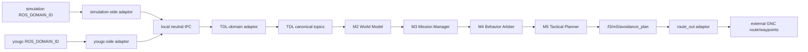

# TDL 外部模块热插拔接入 Spec

日期：2026-06-12

## 1. 背景

A4000 上已有三类外部模块：

- 水动力与 GNC/航线规划：`/home/mass/simulation/`
- 传感器融合：`/home/mass/yougc/ros2_ws`
- TDL 当前系统：本仓库 `/Users/marine/Code/MASS-L3-Tactical Layer`

后续联调需要让 TDL 与外部模块形成航行闭环：TDL 接收外部自船、目标、环境、参考航线信息，TDL 输出规避航线，外部 GNC/L4 执行。前端入口放在 Screen 02 `仿真检查`，作为集成准入与自检位置。

## 2. 目标

1. 默认 TDL/SIL 行为不变。
2. 集成测试时，通过 profile 启用外部模块 adaptor。
3. 外部模块可频繁更新，TDL 通过稳定 adaptor contract 接入。
4. 外部模块与 TDL DDS domain、workspace、消息包隔离。
5. TDL 只输出航线或 waypoint 级规避结果给外部 GNC。
6. 前端只在 Screen 02 显示 profile、adapter、topic、freshness、gate 状态。
7. A4000 部署采用 patch/scp 级别窄部署，避免破坏现有 dirty worktree。

## 3. 非目标

1. 不接入外部前端显示。
2. 不直接接入 thruster、`/cmd_tau`、actuator 级控制。
3. 不允许外部模块直接发布到 TDL 内部决策 topic。
4. 不把新决策逻辑继续加入 `docker/sil_topic_bridge.py`。
5. 不把 `simulation` 和 `yougc` 的冲突 `ship_interfaces` 放入同一 ROS domain。

## 4. 外部模块接口摘要

### 4.1 `/home/mass/simulation/`

主要功能：

- 航线规划
- 坐标转换
- Guidance
- Control
- Thrust allocation
- Ship dynamics

关键 topic：

| Topic | 外部类型 | 方向 | 说明 |
|---|---|---|---|
| `/route_planning/route_plan` | `ship_interfaces/RoutePlan` | 外部输出/输入 | 外部航线规划结果或 GNC 输入 |
| `/route_planning/gnc_route_plan` | `ship_interfaces/GncRoutePlan` | 可选外部输出 | 当前存在消息包冲突，不能直接在 TDL domain 使用 |
| `/ship/waypoints` | `nav_msgs/Path` | 外部输入/输出 | GNC 执行 waypoint path |
| `/ship/odometry` | `nav_msgs/Odometry` | 外部输出 | 水动力/运动状态 |
| `/ship/geo_position` | `ship_interfaces/GeoPosition` | 外部输出 | 经纬度位置 |
| `/control/heading_setpoint` | 控制设定 | 外部内部 | 不接 TDL |
| `/control/speed_setpoint` | 控制设定 | 外部内部 | 不接 TDL |
| `/cmd_tau` | 力/力矩 | 外部内部 | 禁止接入 |
| `/thruster/commands` | 推进命令 | 外部内部 | 禁止接入 |

### 4.2 `/home/mass/yougc/ros2_ws`

主要功能：

- AIS/Radar/Lidar/Vision/GPS/Heading 等融合
- 输出 tracked targets
- Web viewer 可忽略

关键 topic：

| Topic | 外部类型 | 方向 | 说明 |
|---|---|---|---|
| `/gps/fix` | `nmea_interfaces/Gps` | 外部输出 | 可用于 ownship adaptor |
| `/heading` | `nmea_interfaces/Heading` | 外部输出 | 可用于 ownship adaptor |
| `/ais_targets` | `nmea_interfaces/AISArray` | 外部输入/中间 | 可忽略，优先接融合结果 |
| `/radar/targets` | `nmea_interfaces/RadarTargetArray` | 外部输入/中间 | 可忽略，优先接融合结果 |
| `/fusion/tracked_targets` | `nmea_interfaces/TrackedTargetArray` | 外部输出 | 必须经 adaptor 转为 TDL canonical |
| `/fusion/results` | `nmea_interfaces/TrackedTargetArray` | 外部输出 | 可作为 fallback topic |

## 5. 已知冲突

1. `simulation` 和 `yougc` 都定义 `ship_interfaces`，但消息集合不同。
2. `yougc` 的 `/fusion/tracked_targets` 类型是 `nmea_interfaces/TrackedTargetArray`。
3. TDL canonical `/fusion/tracked_targets` 类型是 `l3_external_msgs/TrackedTargetArray`。
4. 这些 topic/type 不能直接混在一个 ROS domain。

结论：必须使用跨 domain adaptor。普通 ROS2 节点不能同时稳定 source 多个冲突 workspace 后直接桥接所有类型。

## 6. 推荐架构

采用 Profile + Cross-Domain Sidecar Adaptor：



外部 domain sidecar：

- source 外部 workspace。
- 订阅外部原始 topic。
- 转为 neutral JSON payload。
- 不 import TDL ROS message。

TDL domain sidecar：

- source TDL install。
- 接收 neutral JSON payload。
- 发布 TDL canonical topic。
- 不 import 外部冲突 message。

## 7. Integration Profiles

| Profile | 默认 | 用途 |
|---|---|---|
| `default` | 是 | 当前 TDL/SIL 路径，不启用外部 adaptor |
| `a4000_external` | 否 | A4000 外部模块联调 |
| `hybrid_debug` | 否 | 单项 adapter 调试，例如只测 target 或 route_out |

示例：

```yaml
name: a4000_external
mode: external
tdl_domain_id: 42
external_domains:
  simulation:
    domain_id: 10
    workspace_setup: /home/mass/simulation/船舶动力学/gnc_ws/install/setup.bash
  yougc:
    domain_id: 11
    workspace_setup: /home/mass/yougc/ros2_ws/install/setup.bash
adapters:
  target: enabled
  ownship: enabled
  environment: enabled
  route_in: enabled
  route_out: enabled
freshness:
  ownship_ms: 500
  targets_ms: 2000
  environment_ms: 10000
safety:
  route_out_requires_screen02_pass: true
  forbid_low_level_control: true
```

## 8. Canonical Topic Contract

| 方向 | 外部来源 | TDL canonical | 用途 |
|---|---|---|---|
| route_in | `/route_planning/route_plan` 或 `gnc_bridge_route.json` | `/l2/planned_route` | M3/M5 参考航线 |
| ownship | `/ship/odometry` + `/ship/geo_position` 或 `/gps/fix` + `/heading` | `/fusion/own_ship_state` | M2 自船状态 |
| target | `/fusion/tracked_targets` from `yougc` | `/fusion/tracked_targets` | M2 目标列表 |
| environment | `/wind` `/current` `/depth` 等 | `/fusion/environment_state` | M2 环境状态 |
| route_out | `/l3/m5/avoidance_plan` | 外部 `/route_planning/route_plan` 或 `/ship/waypoints` | 外部 GNC 执行规避航线 |

## 9. Adapter 组件

| 组件 | 职责 |
|---|---|
| `external_profile_manager` | 读取 profile，校验 domain、adapter、freshness、安全开关 |
| `external_probe_service` | 检查 workspace、package、topic、type、QoS、freshness |
| `target_adapter` | `nmea_interfaces/TrackedTargetArray` -> `l3_external_msgs/TrackedTargetArray` |
| `ownship_adapter` | GPS/heading/odometry -> `l3_external_msgs/FilteredOwnShipState` |
| `environment_adapter` | wind/current/depth -> `l3_external_msgs/EnvironmentState` |
| `route_in_adapter` | external RoutePlan/Path/file -> `l3_external_msgs/PlannedRoute` |
| `route_out_adapter` | `l3_msgs/AvoidancePlan` -> external RoutePlan/Path |
| `adapter_supervisor` | 启停、健康、stale 判定、证据记录 |

## 10. Screen 02 前端

Screen 02 `仿真检查` 增加 `ExternalIntegrationPanel`。

显示内容：

- 当前 profile
- ROS domain 可达性
- external workspace setup 路径
- topic/type 检查
- last sample age
- adapter enable/health
- route_out dry-run
- GO/NO-GO 阻断原因

行为：

1. `default` profile 下，不强制外部 gate。
2. `a4000_external` profile 下，GO 前强制通过 external gates。
3. GO 后仍进入 Screen 03 `SimulationMonitor`。
4. Screen 03 只消费 TDL canonical 数据。

## 11. External Gates

| Gate | 判定 |
|---|---|
| Profile valid | profile schema 合法，mode 明确 |
| ROS domains reachable | 指定 domain 能列出目标 topic |
| Workspace/package present | setup 脚本存在，package 可见 |
| Topic type match | topic 类型与 profile contract 一致 |
| Required data fresh | ownship/targets/environment 未 stale |
| Canonical publish verified | adaptor 能向 TDL canonical topic 发布测试样本 |
| Route output dry-run accepted | fake 或真实 GNC 能收到 route/waypoints |
| Low-level control forbidden | 未启用 `/cmd_tau`、thruster、actuator 输出 |
| M7 gate active | route_out 不绕过 TDL safety gate |

## 12. 后端 API

| API | 方法 | 用途 |
|---|---|---|
| `/api/v1/integration/profiles` | GET | 列出 profiles |
| `/api/v1/integration/profile` | GET | 返回当前 profile |
| `/api/v1/integration/profile` | POST | 选择 active profile |
| `/api/v1/integration/status` | GET | 返回 adapter/gate 状态 |
| `/api/v1/integration/probe` | POST | 执行外部探测 |
| `/api/v1/integration/route-dry-run` | POST | 检查 route_out 是否被外部 GNC 接收 |

## 13. 安全规则

1. `default` profile 不启动 external adaptor。
2. `route_out_adapter` 只发布 route/waypoints。
3. 检测到 `/cmd_tau`、`/thruster/commands`、actuator topic 输出配置时，external gate 失败。
4. external data stale 时，Screen 02 不允许 GO。
5. TDL 内部 M2/M3/M4/M5/M7 权威链路不被外部模块替代。
6. `docker/sil_topic_bridge.py` 不新增生产控制逻辑。

## 14. 验收

| 层级 | 验收标准 |
|---|---|
| Unit | converters 固定样例输入输出通过 |
| Contract | profile schema、topic type、QoS、stale timeout 通过 |
| Local integration | fake external domain -> adaptor -> TDL canonical topic 通过 |
| Route loop | TDL `AvoidancePlan` -> route_out -> fake GNC 收到 route |
| Frontend | Screen 02 external profile gate 显示、阻断、放行正确 |
| A4000 | patch/scp 部署；external gate 全绿；外部 GNC 收到 TDL 规避航线 |

## 15. 完成定义

1. `default` profile 下现有 TDL/SIL 测试通过。
2. `a4000_external` profile 下 Screen 02 能探测外部模块。
3. TDL 收到 canonical ownship、target、environment、route。
4. TDL 输出规避航线后，外部 GNC 收到 route/waypoints。
5. 没有 actuator 级输出路径。
6. A4000 部署没有 broad sync、`git pull`、`git reset`。
