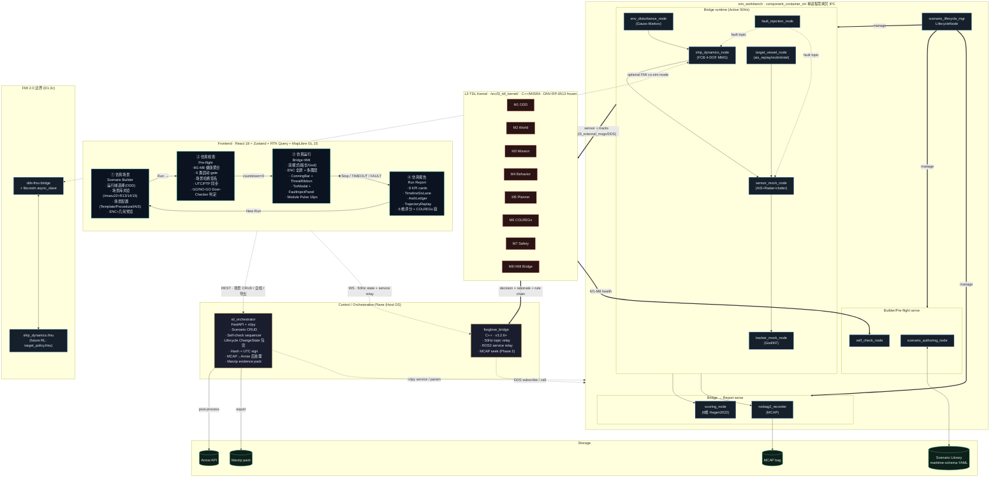

# SIL 系统架构 · v1.0 统一基线

| 属性 | 值 |
|---|---|
| 文档编号 | SANGO-ADAS-L3-SIL-UNIFIED-001 |
| 版本 | v1.0 |
| 日期 | 2026-05-15 |
| 状态 | 设计基线（4 文档套件 Doc 1，与 Doc 0 README 同步交付）|
| 套件其他 | Doc 2 后端 / Doc 3 前端 / Doc 4 场景联调 |
| 上游 | 架构 v1.1.3-pre-stub（2026-05-09，选项 D 混合架构 + SIL 框架架构 patch 锁定） |
| 范围 | SIL 系统全栈 — 顶层定位 / 拓扑 / 数据流 / 生命周期 / 接口边界 / 风险 / 文件谱系 |

---

## 0. 一句话定位

为 L3 TDL 战术决策层提供"YAML 场景 → 真实算法链路 → ENC 可视化避碰 → 证据导出"端到端 Software-in-the-Loop 测试 harness，承担：

- DEMO-1/2/3 三档 milestone 联调底座（DEMO-1 Skeleton Live 6/15 / DEMO-2 Decision-Capable 7/31 / DEMO-3 Full-Stack 8/31）
- D1.3.1 仿真器鉴定（DNV-RP-0513 + IEC 62288 + IMO S-Mode）证据产出
- Phase 4 HIL（D4.1/4.2）+ Phase 4 第三方 SIL 2（D4.3）+ CCS i-Ship AIP 提交（D4.4）的可追溯源
- RL Phase 4（D4.6）训练沙箱 — 三层隔离边界（仓库 / 进程 / artefact）已在 v1.0 落地

SIL 不是产品的"测试包装"，是"测试目标即部署目标"的延展 — production C++/MISRA ROS2 Humble 节点**直接运行**于 SIL 内核，仅在 ship dynamics + RL FMU 边界使用 FMI 2.0 / OSP `libcosim`（决策记录 §1 锁定 🟢 High）。

---

## 1. 在 MASS v3.0 系统中的位置

L3 TDL SIL 仅服务 L3 战术决策层；L1/L2/L4/L5 + Multimodal Fusion + Deterministic Checker + Cybersecurity + ASDR 在 SIL 内**以接口契约方式 stub**，由 sim_workbench 节点扮演（不实施完整业务逻辑）。

```
┌─ MASS v3.0 完整系统（参考） ─────────────────────────────────────────┐
│                                                                     │
│  Z-TOP   IACS UR E26/E27 IT/OT 网络墙               ────► SIL 内 stub │
│  L1/L2   Mission + Voyage Planner                  ────► SIL 喂 WP   │
│  Fusion  GNSS/Radar/AIS/Camera 融合 + Nav Filter   ────► SIL 内 stub │
│                                                                     │
│  ┌─ L3 TDL 战术层（本仓库 + SIL 核心范围） ─────────────────────────┐ │
│  │  M1 ODD / M2 World / M3 Mission / M4 Behavior / M5 Planner /  │ │
│  │  M6 COLREGs / M7 Safety / M8 HMI Bridge                       │ │
│  │  ▲                                                            │ │
│  │  │  接收：WP + Track 列表 + Nav Filter + Param DB              │ │
│  │  │  发送：AvoidancePlan + ReactiveOverrideCmd → L4             │ │
│  └─────────────────────────────────────────────────────────────────┘ │
│                                                                     │
│  L4/L5   LOS Guidance + Thrust Allocation         ────► SIL 内 stub │
│  X 轴    Deterministic Checker (VETO)             ────► M7 是同等品  │
│  Y 轴    Reflex Arc (<500ms)                       ────► SIL 内可触发 │
│  ASDR    Extended VDR                              ────► MCAP 等价   │
│                                                                     │
└─────────────────────────────────────────────────────────────────────┘
```

SIL 系统在以上拓扑中是**外延 harness**，承担：
- 模拟 Fusion 输出（Track 列表 → M2 World Model 入口）
- 模拟 L1/L2 输入（WP list + speed profile → M3 Mission Manager 入口）
- 接收 L3 输出（AvoidancePlan → 注入 L4 stub → 反馈船舶动力学 → 闭环）
- 全程录 MCAP + 后处理 Arrow + 打 Marzip 容器

SIL **不替代** 任何 L3 模块（M1–M8 是 production code 直接 wrapping ROS2 节点跑）。

---

## 2. 顶层架构（5 维决策落地）

5 个顶层决策均锁定为 🟢 High（决策记录 §11 + R-NLM Deep Research 2026-05-12 52 cited sources）：

| 维度 | 决策 | 关键源 | 置信度 |
|---|---|---|---|
| 1. 后端拓扑 | Per-domain micro-node + ROS2 Composition 零拷贝 IPC | [R-NLM:5,8,13,14] DNV-RP-0513 + Nav2 benchmark + [W1] ROS2 Humble Composition tutorial | 🟢 |
| 2. 生命周期 | ROS2 Lifecycle Node + FastAPI REST 包壳 | [R-NLM:16,17,18,20] ROS2 Design + [W1] Foxglove lifecycle blog | 🟢 |
| 3. Artefact | MCAP + Arrow + maritime-schema YAML, Marzip 封装 | [R-NLM:22,23,25,26] DNV maritime-schema + [W1] rosbag2_storage_mcap 0.15.15 | 🟢 |
| 4. IDL SSoT | Protobuf 主 + proto2ros + protobuf-ts | [R-NLM:27-33] proto2ros + protobuf-ts MANUAL | 🟢 |
| 5. 前端状态 | Zustand（50Hz 遥测）+ RTK Query（REST 缓存）| [R-NLM:36-41] 多源 2025-26 对比 | 🟢 |

**叠加证据**：MARSIM ROS-centric 范式 [R-NLM:12,42,43] · OSP Maritime Toolbox FMI 互操作 [R-NLM:44,45,46] · Kongsberg K-Sim 不适合开发用 [R-NLM:47,48,49] · MOOS-IvP star topology 不如 DDS 灵活 [R-NLM:51,52] · PyGemini Configuration-Driven 三层隔离 [E4]。

---

## 3. 系统拓扑全景图



**架构 4 层**：

| 层 | 进程归属 | 通信 | 责任 |
|---|---|---|---|
| **Frontend** | Browser | HTTP (REST) + WS (Foxglove protocol) | 4 屏幕 HMI |
| **Control / Orchestration** | Host OS（容器化） | REST ↔ ROS2 rclpy + WS ↔ DDS | scenario CRUD + lifecycle 包壳 + 后处理 + 导出 |
| **Simulation Component Container** | 单进程（`component_container_mt`） | DDS intra-process（零拷贝） | 10 节点（9 业务 + 1 lifecycle mgr）+ rosbag2 旁路 |
| **L3 TDL Kernel** | 单进程或多进程（M7 独立） | DDS（与 sim_workbench 同 ROS_DOMAIN_ID）| 8 模块 production C++/Python ROS2 节点 |

**FMI 2.0 边界**（D1.3c，sidebar）：仅 ship dynamics + 未来 RL FMU 走 OSP `libcosim` co-sim master。M7 严格留 ROS2 native，**不过 FMI 边界**（端到端 KPI < 10 ms，dds-fmu 单次 exchange 即吃完 KPI 🟢 决策记录 §2.4 锁定）。

---

## 4. 容器编排（Docker / OrbStack）

`docker-compose.yml`（v1.0 目标）列 5 个 service：

| Service | Image | 端口 | 网络 | 卷 | 职责 |
|---|---|---|---|---|---|
| `sil-orchestrator` | 本地构建（`docker/sil_orchestrator.Dockerfile`，**应当用 ros:humble-ros-base**）| 8000 | host | scenarios/runs/exports | FastAPI 控制面 |
| `sil-component-container` | 本地构建（`docker/sil_nodes.Dockerfile`，`ros:humble-ros-base` ✅）| — | host | scenarios/runs | 10 节点 + rosbag2 |
| `foxglove-bridge` | `mass-l3/ci:jazzy-ubuntu22.04` ❌ 应改 humble | 8765 | host | — | WS 桥 |
| `web` | 本地构建（`web/Dockerfile`，Vite）| 5173 | bridge | — | 4 屏幕 HMI |
| `martin-tile-server` | `ghcr.io/maplibre/martin:latest` 🟢 | 3000 | host | `data/tiles` | S-57 MVT |

**OrbStack 启动**（macOS 开发环境）：
```bash
orb create sil
orb start
docker compose -f docker-compose.yml up -d
```
OrbStack 与 Docker Desktop API 兼容，docker-compose 直通；`network_mode: host` 在 macOS 上 OrbStack ≥ 1.5 已支持（🟢 用户实测）。

**GAP-001**（v1.0 范围内已记录，不修复）：`sil_orchestrator.Dockerfile` 与 `foxglove-bridge` 容器仍引用 `jazzy` 镜像 — 与决策记录 §3 ROS2 Humble 锁定相悖。修复路径：Doc 2 §11 容器构建链子任务。

---

## 5. 模块清单（src/ 实现 ↔ 设计对照）

### 5.1 sil_orchestrator（FastAPI 控制面）

| 文件 | 现状 | 设计目标 | 差距 |
|---|---|---|---|
| `main.py` | ✅ 存在，6 router 已挂载 + rclpy spin 线程 | 不变 | — |
| `config.py` | ✅ RUN_DIR / EXPORT_DIR 等 | + Marzip 输出根 | small |
| `scenario_routes.py` + `scenario_store.py` | ✅ CRUD | + maritime-schema 校验 | GAP-003 |
| `lifecycle_bridge.py` | ✅ change_state 包壳 | 完整 8 个交互动作映射（§6）| Doc 2 § 锁定 |
| `telemetry_bridge.py` | ✅ rclpy → WS 桥 | + foxglove_bridge 替代或共存 | 评估中 |
| `selfcheck_routes.py` | ✅ stub | 6 类 self-check sequencer | GAP-005 |
| `export_routes.py` | ✅ stub | Marzip 1-click 后处理 | GAP-006 |

### 5.2 sim_workbench（仿真节点族）

| colcon 包 | 现状 | 设计角色 |
|---|---|---|
| `sil_lifecycle/` | ✅ launch 文件就位 | LifecycleNode mgr（10 节点中的"1"）|
| `sil_nodes/` | ✅ 8 业务节点已合并打包 | 拆出 fault_injection 独立后达 9 节点 |
| `scenario_authoring/` | ✅ Python + AIS 5 阶段管线 | + maritime-schema 校验器 |
| `sil_msgs/` | ✅ IDL stub | Phase 1 主 IDL 表（§7）|
| `ship_sim_interfaces/` | ✅ 保留（不动）| ship dynamics ↔ kernel actuator IDL |
| `fcb_simulator/` | ⏳ 升级为 `ship_dynamics_node` | 4-DOF MMG (Yasukawa 2015) |
| `fmi_bridge/` | ⏳ D1.3c stub | dds-fmu + libcosim::async_slave |
| `ais_bridge/` | ⏳ 已迁入 scenario_authoring 内部 | 退役 |
| `l3_external_mock_publisher/` | ⏳ DEMO-1 后退役 → GAP-002 | Mock，真链路从 sensor_mock + tracker_mock 替代 |
| `sil_mock_publisher/` | ⏳ DEMO-1 后退役 → GAP-002 | Mock，真链路从 ship_dynamics_node 替代 |

### 5.3 l3_tdl_kernel（L3 8 模块）

production code 直接 wrapping ROS2 节点，**不在 SIL v1.0 重构范围**。仅以下 SIL 集成点：

| 模块 | SIL 边界 |
|---|---|
| M1 ODD | 从 sim_workbench 接 EnvironmentState → 发 ODD 状态 → 触发模式切换 |
| M2 World Model | 从 sensor_mock + tracker_mock 接 Track → 维护 world view |
| M3 Mission | 从 scenario_authoring 接 WP + speed_profile |
| M4 Behavior Arbiter | ✅ ROS2 节点已就位（commit ace10b8）|
| M5 Tactical Planner | 输出 AvoidancePlan → L4 stub → ship_dynamics_node |
| M6 COLREGs Reasoner | 接 M2 + M1 → 输出 rule chain |
| M7 Safety Supervisor | **独立进程**，不进 component_container；VETO 通过独立 DDS topic |
| M8 HMI Bridge | 聚合 SAT-1/2/3 → foxglove_bridge → 前端 |

`l3_external_msgs/` IDL（RFC-001/002/003 锁定）+ `l3_msgs/` IDL（v1.1.2 锁定）作为 L3 内 / L3↔SIL 边界 IDL，**不动**。

---

## 6. 数据流主链路

### 6.1 静态数据流（一次完整 run）

```
T-∞: 场景定义
  scenarios/*.yaml (maritime-schema TrafficSituation, 目标)
  scenarios/head_on.yaml (NTNU schema, 现状 → GAP-003)
       │
       ▼
T-N:  ① Builder 加载 (GET /scenarios/{id})
       │
T-0:  ② Pre-flight (POST /lifecycle/configure)
       │     scenario_lifecycle_mgr.configure() → INACTIVE
       │     self_check_node runs 6-gate sequence
       │     scenario hash signed (SHA256)
       ▼
T+0:  ③ Bridge HMI (POST /lifecycle/activate)
       │     scenario_lifecycle_mgr.activate() → ACTIVE
       │     50 Hz tick begins
       │
       ▼
  ┌──────────────────────────────────────────────────────────────────┐
  │ 闭环 (50 Hz)                                                    │
  │   sim_clock /clock 1 ms tick                                    │
  │   env_disturbance_node → wind/current → ship_dynamics            │
  │   target_vessel_node × N → AIS/state → sensor_mock              │
  │   ship_dynamics_node → own state → sensor_mock + L4 stub        │
  │   sensor_mock → AIS msgs (0.1 Hz) + radar meas (5 Hz)           │
  │   tracker_mock → TrackedTargetArray (10 Hz) → kernel M2         │
  │   kernel M1-M8 (production ROS2) → AvoidancePlan → L4 stub      │
  │   L4 stub → actuator cmd → ship_dynamics_node (闭环关闭)         │
  │   M7 (独立进程) ◄── VETO 通道                                    │
  │   foxglove_bridge → WS frame → frontend (50 Hz)                 │
  │   rosbag2_recorder → MCAP append                                │
  │   scoring_node → 6 维分 (1 Hz) → Arrow append                   │
  └──────────────────────────────────────────────────────────────────┘
       │
T+end: ③ ⏹ Stop (POST /lifecycle/deactivate)
       │     scenario_lifecycle_mgr.deactivate() → INACTIVE
       │     50 Hz tick 停
       ▼
T+post: ④ Run Report
       │     orchestrator background: MCAP → Arrow → derived KPIs
       │     scoring_node aggregate → verdict.json
       │
       ▼
T+exp: ④ [Export] (POST /export/marzip?run_id=X)
       │     orchestrator: zip(scenario+hash+arrow+mcap+jsonl+manifest)
       │     → /var/sil/runs/{run_id}/evidence.marzip
       │     → 前端下载
       ▼
END
```

### 6.2 lifecycle 5 态机映射 4 屏幕

```
                  ┌─ FE state ─┐  ┌─ ROS2 Lifecycle ──┐  ┌─ active 节点 ──────────────────────┐
① Scenario Builder │  IDLE       │  Unconfigured        │  scenario_authoring only             │
   ↓ "Run →"      │             │  ↓ configure()       │                                       │
② Pre-flight      │  ARMING     │  Inactive            │  + self_check + sensor + tracker     │
   ↓ countdown=0  │             │  ↓ activate()        │  + ship_dyn + env_dist + target +    │
③ Bridge HMI      │  RUNNING    │  Active (50Hz tick)  │    fault_inject + scoring +          │
   ↓ "⏹ Stop"     │             │  ↓ deactivate()      │    rosbag2 + L3 kernel               │
   ↓ TIMEOUT      │             │                      │                                       │
   ↓ FAULT_FATAL  │             │                      │                                       │
④ Run Report      │  REPORT     │  Inactive            │  scoring + scenario_authoring        │
   ↓ "New Run"   │             │  ↓ cleanup()         │  (MCAP→Arrow 后处理在 orchestrator)  │
   → ①           │  IDLE       │  Unconfigured        │                                       │
```

### 6.3 8 交互动作 → service 表

| # | 动作 | 触发屏 | 链路 | 后端 |
|---|---|---|---|---|
| 1 | Load Scenario | ① | REST `GET /scenarios/{id}` + `POST /lifecycle/configure?scenario_id=X` | orchestrator 读 YAML → 注入 lifecycle mgr 参数 → `change_state(CONFIGURE)` |
| 2 | Start | ② end | ROS2 service `/lifecycle_mgr/change_state` via foxglove_bridge | `change_state(ACTIVATE)`；50 Hz tick 起 |
| 3 | Pause / Resume | ③ | service `/sim_clock/set_rate?rate=0` ↔ restore | sim_time 倍率改 0（节点不停 tick，时间冻结）；区分"暂停"（rate=0） vs "deactivate" |
| 4 | Speed × 0.5/1/2/4/10 | ③ | service `/sim_clock/set_rate?rate=N` | lifecycle mgr 改 `use_sim_time` + 发 `/clock` 倍率 |
| 5 | Reset | ③/④ | service chain `DEACTIVATE → CLEANUP → CONFIGURE` | 重新加载场景；MCAP 文件保留新文件名 |
| 6 | Inject Fault | ③ | service `/fault_inject/trigger?type=X&payload=Y` | fault_inject_node 转发 `/fault/{ais_dropout, radar_spike, dist_step}` |
| 7 | Stop | ③ | service `/lifecycle_mgr/change_state` (DEACTIVATE) | 50 Hz tick 停；触发后处理 |
| 8 | Export Evidence | ④ | REST `POST /export/marzip?run_id=X` | orchestrator 拉 MCAP+Arrow+YAML → Marzip 容器 |

ROS2 Lifecycle 状态机参考（[W1] ROS2 Humble design docs）：UNCONFIGURED → CONFIGURING → INACTIVE → ACTIVATING → ACTIVE → DEACTIVATING → INACTIVE → CLEANINGUP → UNCONFIGURED → SHUTTINGDOWN → FINALIZED 🟢。

---

## 7. 消息契约（IDL）

### 7.1 双轨 IDL 策略

| 边界 | IDL | 理由 |
|---|---|---|
| L3 kernel ↔ L3 kernel (M1–M8 之间) | **ROS2 .msg**（v1.1.2 锁定 `l3_msgs/`）| frozen 认证内核，不变 |
| L3 kernel ↔ sim_workbench 边界 | **ROS2 .msg**（RFC-001/002/003 锁定 `l3_external_msgs/`）| 跨团队接口锁定 |
| sim_workbench 内部 + foxglove_bridge + 前端 | **Protobuf**（greenfield `src/l3_tdl_kernel/sil_proto/`）| 多语言绑定（C++/TS/Python），buf CI 防 breaking |
| FMI 边界 | **OSP modelDescription.xml + FMI 2.0 binary**（D1.3c）| 标准互操作 |

**桥接**：foxglove_bridge 原生 Protobuf；ROS2 .msg → Protobuf 转换由 `proto2ros` 反向生成 stubs 一次性产出（[R-NLM:27-30]）。

### 7.2 Phase 1 Protobuf 主 IDL（10 message + 6 service，MUST）

| Proto message | 频率 | 来源 | 消费 | 必备字段 |
|---|---|---|---|---|
| `sil.OwnShipState` | 50 Hz | ship_dynamics_node | FE map + KER M2 | stamp, pose(lat,lon,heading), kinematics(sog,cog,rot,u,v,r), control_state(rudder,throttle) |
| `sil.TargetVesselState` | 10 Hz | target_vessel_node | FE map + KER M2 | mmsi, stamp, pose, kinematics, ship_type, mode(replay/ncdm/intel) |
| `sil.RadarMeasurement` | 5 Hz | sensor_mock_node | KER M2 + FE Phase 2 | stamp, polar_targets[range,bearing,RCS], clutter_cardinality |
| `sil.AISMessage` | 0.1 Hz | sensor_mock_node | KER M2 | mmsi, sog, cog, lat, lon, heading, dropout_flag |
| `sil.EnvironmentState` | 1 Hz | env_disturbance_node | KER M1 + FE Captain HUD | wind(dir, mps), current(dir, mps), visibility_nm, sea_state_beaufort |
| `sil.FaultEvent` | event | fault_injection_node | 受影响节点 + FE ASDR log | stamp, fault_type, payload(json) |
| `sil.ModulePulse` | 10 Hz | self_check / KER M1–M8 | FE ③ Module Pulse | module_id(M1..M8), state(GREEN/AMBER/RED), latency_ms, drops |
| `sil.ScoringRow` | 1 Hz | scoring_node | FE ④ + Arrow KPI | stamp, safety, rule, delay, magnitude, phase, plausibility, total |
| `sil.ASDREvent` | event | KER M8 + scoring | FE ASDR log + MCAP | stamp, event_type, rule_ref, decision_id, verdict(PASS/RISK/FAIL), payload |
| `sil.LifecycleStatus` | 1 Hz | scenario_lifecycle_mgr | FE 状态条 | current_state, scenario_id, scenario_hash, sim_time, wall_time, sim_rate |

| Proto service | 调用方 | 实现 |
|---|---|---|
| `sil.ScenarioCRUD` | FE ① via REST | scenario_authoring_node |
| `sil.LifecycleControl` | FE ②③④ via REST→service relay | scenario_lifecycle_mgr |
| `sil.SimClock` | FE ③ | scenario_lifecycle_mgr |
| `sil.FaultTrigger` | FE ③ | fault_injection_node |
| `sil.SelfCheck` | FE ② | self_check_node |
| `sil.ExportEvidence` | FE ④ via REST | sil_orchestrator |

### 7.3 LATER（Phase 2/3 写入但不实现）

`sil.GroundingHazard`（D2.5）· `sil.TrajectoryGhost`（D3.4）· `sil.DoerCheckerVerdict`（D3.4）· `sil.ToRRequest`（D3.4）· `sil.S57Feature`（Phase 2 MapLibre）。

### 7.4 DDS QoS 配置（[W1] ROS2 Humble QoS guide 🟢）

| 类型 | Reliability | Durability | History | Deadline | 用于 |
|---|---|---|---|---|---|
| 决定性 replay | RELIABLE | TRANSIENT_LOCAL | KEEP_LAST(≥100) | none | command/decision capture，late subscriber catch-up |
| 1–10 Hz 决策 | RELIABLE | VOLATILE | KEEP_LAST(2) | 200 ms | M4/M5/M6 输出 |
| 50–100 Hz 传感 | BEST_EFFORT | VOLATILE | KEEP_LAST(1) | none | OwnShipState / Radar |
| 关键安全信号 | RELIABLE | TRANSIENT_LOCAL | KEEP_LAST(≥10) | 50 ms | M7 VETO / Reflex Arc 触发 |

rosbag2 录制时**自适应**订阅 QoS 与 publisher 一致，无消息丢失（[W1] ROS2 rosbag2 docs 🟢）。

---

## 8. 生命周期（详）

### 8.1 ROS2 Lifecycle Node 4 主态 + 6 过渡态

[W1] ROS2 Humble managed nodes 🟢：

| 主态 | 含义 | 允许过渡 | SIL 用途 |
|---|---|---|---|
| **UNCONFIGURED** | 实例化后未就绪 | → INACTIVE（CONFIGURE）/ → FINALIZED（SHUTDOWN）| ① 仿真场景屏；只有 scenario_authoring 活 |
| **INACTIVE** | 已配置但不处理；安全 reconfig | → ACTIVE（ACTIVATE）/ → FINALIZED | ② 仿真检查屏；可改参数 |
| **ACTIVE** | 处理中；callback 激活 | → INACTIVE（DEACTIVATE）/ → FINALIZED | ③ 仿真运行屏；50 Hz tick |
| **FINALIZED** | 终态；析构前 | none | 容器关闭 |

**过渡态**：CONFIGURING / ACTIVATING / DEACTIVATING / CLEANINGUP / SHUTTINGDOWN / ERRORPROCESSING。

### 8.2 lifecycle 10 节点编排

`scenario_lifecycle_mgr`（自己也是 LifecycleNode）持有 9 业务节点的引用，按"屏幕过渡"为单位顺序调用 `change_state`：

```python
# 伪代码
async def transition_to_active():  # ② → ③
    for node in [sensor_mock, tracker_mock, ship_dynamics, env_disturbance,
                 target_vessel, fault_injection, scoring]:
        await node.change_state(ACTIVATE, timeout=2000ms)
    rosbag2_recorder.start()  # 独立进程
    publish(LifecycleStatus.ACTIVE)
```

settle_timeout_ms = 2000；超时退回 INACTIVE 并报 FAULT（→ FE 弹 Doer-Checker 失败 GO/NO-GO）。

### 8.3 sim_clock 与时间倍率

- 全栈使用 `use_sim_time:=true`，`/clock` topic 由 `scenario_lifecycle_mgr` 发布
- 1 ms tick；倍率 0.5/1/2/4/10 通过修改 wall→sim 映射比例实现
- "Pause" = rate 0（不发 tick，节点 cb 自然冻结）；区别于 deactivate（停 tick + 停 cb）
- "Speed × 10" = 10 倍 wall-time 推进，节点 cb 同步加速；前端 FPS 不变（throttle 在 FE）

参考架构报告 §15.0 时基 stub。

---

## 9. 仿真器选择：FCB internal sim vs FMI 2.0 桥

### 9.1 两种模式（D1.3c 边界）

| 模式 | 实现 | 路径 |
|---|---|---|
| **Internal sim**（默认）| `ship_dynamics_node` 内置 4-DOF MMG（Yasukawa 2015）| sim_workbench/sil_nodes/ship_dynamics |
| **FMI co-sim**（D1.3c 范围）| `dds-fmu` 桥 + `libcosim::async_slave`，加载 `ship_dynamics.fmu` | sim_workbench/fmi_bridge |

切换：scenario YAML 字段 `simulation_settings.dynamics_mode: internal | fmi`。

### 9.2 选择理由

- **Internal**（Phase 1 默认）：开发速度快、零 FMI 调试负担、与 colav-simulator NTNU 参数兼容
- **FMI co-sim**（Phase 2 起可选 / Phase 4 RL 必须）：
  - DNV-RP-0513 模型保证规范明确路径 🟢 [E6]
  - OSP `libcosim` MPL-2.0 商业可用 🟢 [R-NLM:44]
  - 与 mlfmu RL FMU 边界一致（决策 §2 + §4 锁定）
  - 鉴定级别：D1.3.1 simulator qualification report 必须的"模型保证"路径

### 9.3 FMI 2.0 vs FMI 3.0（已确认锁 2.0 🟢）

决策记录 §2 锁 FMI 2.0 + OSP libcosim（🟢）。补充佐证（subagent web 调研 2026-05-15）：

- FMI 3.0 (2022 release) **特性**：Scheduled Execution + 高级 co-sim + vECU 支持
- **工具支持**：~170 个 tools 支持 FMI（2.0+3.0 合计），但 FMI 2.0 在生产海事仿真器（Kongsberg / NTNU / DNV）中**仍是主流**
- **海事采用滞后**：相比汽车/航空 12–18 个月；OSP 生态主线为 FMI 2.0
- **决策路径**：Phase 1–2 用 FMI 2.0；Phase 4+ 监控 FMI 3.0 升级机会
- 来源 [W20] FMI 2.0 Spec PDF（fmi-standard.org）A · [W21] *FMI 3.0 Released* (May 2022) A · [W22] MDPI Electronics 11(21):3635 *FMI 3.0 Clocked Simulations* — A · [W23] NAFEMS *FMI 3.0 Major Milestone* B

### 9.5 Co-Simulation vs Model Exchange（锁 Co-Simulation 🟢）

[W20] FMI 2.0 Spec §1.2 + §3 + [W24] Claytex *FMI basics*：

- **Co-Simulation**（选用）：每个 FMU 自带积分器，*t → t+Δt* 完成后于通信点暂停。ROS2 在通信点投入 actuator cmd，取回 sensor 输出，再推进自己的步进。耦合度低，异构步长可。
- **Model Exchange**（不选）：master（ROS2）须提供全局 ODE solver，所有 FMU 微分方程同时积分。要求同步步长，与 ROS2 实时控制变长延迟不兼容。

### 9.6 仿真器鉴定（D1.3.1 → DNV-RP-0513 + DNV-CG-0264）🟡

[W25] DNV-CG-0264 *Autonomous and Remotely Operated Ships* + [W26] DNV-RP-0513 *Assurance of Simulation Models* + [W27] DNV-CG-0264 PDF（maritimesafetyinnovationlab.org）— A 🟡 (规范公开但完整付费访问)

D1.3.1 须证明 4 项（细节在 Doc 4 §11）：

1. **模型保真度**：MMG hydrodynamics ≤ 5% RMS error vs 池实验（RP-0513 benchmark）
2. **决定性 replay**：场景复制 ±0.1s 时间偏移、±0.5° 航向重复性
3. **传感模拟置信度**：Radar/AIS/GNSS 退化模型按 CG-0264 §6 环境限值校准
4. **编排可验证性**：OSP cosim 日志 + FMU API 调用追踪 + 通信步长审计

### 9.7 OSI（ASAM 汽车域）—**不采用** 🟡

[W28] ASAM Open Simulation Interface（opensimulationinterface.github.io）— A 🟡

- OSI 是汽车自动驾驶感知接口（protobuf），自身**无 AIS/雷达/海事 track schema**
- 海事采用稀；DNV/CCS 期待专有 track 格式（IEC 61162 NMEA 0183/2000）
- **决策**：Phase 1–2 不采用，沿用 OSP-IS 可扩展 schema（已含 confidence/classification/covariance）；Phase 4+ 重评估

### 9.8 FMI 运行时库选择 🟢

[W29] PyFMI on GitHub（modelon-community）— A · [W30] fmpy GitHub（CATIA-Systems）— A · [W31] FMI4cpp（modelon-community）— A · [W32] FMI Tools Awesome List（github.com/traversaro/awesome-fmi）— B

| 库 | 语言 | FMI 版本 | License | 用法 | Phase |
|---|---|---|---|---|---|
| **PyFMI** + `fmi_adapter_ros2` | Python 3 | 2.0 / 3.0(α) | LGPL-2.1 | D1.3c 原型 + sim_workbench 内 FMU 调度 | Phase 1–2 主力 |
| **fmpy** | Pure Python | 2.0 / 3.0 | BSD-3 | 场景 replay 独立验证 | D1.7 |
| **FMI4cpp** | Modern C++ | 2.0 only | MPL-2.0 | 高性能实时（< 10 ms FMU latency） | D2.5+ M5 集成 |

### 9.9 MMG 4-DOF FMU 来源 🟡

- **nikpau/mmgdynamics**（GitHub）— Yasukawa & Yoshimura 2015 标准 MMG + 流/风/浅水扩展；**非 FMU 形式，须自行 wrap**；license 待 [W33] LICENSE 核 — 🟡
- **OSP Reference Models**（github.com/OpenSimulationInterface organization 内 OSP-Reference-Models repo）— 含 MMG 4-DOF + 3-DOF 操纵性 FMU — 🟡
- **DNV Sesam/ShipX**（专有，FMI 导出能力存在但 license 闭）— Phase 4 D4.3 第三方 SIL 2 评估边界

**决策**：D1.3a 采用 nikpau/mmgdynamics 数学公式自行实现 4-DOF MMG（与 FCB 项目 PVA 系数对齐）；D1.3c FMI 桥仅作能力 stub，待 Phase 2 评估是否切 OSP 参考 FMU。

### 9.4 M7 Safety Supervisor 与 FMI 边界

**M7 严格留 ROS2 native，不过 FMI 边界**（决策 §2.4 🟢）。理由：
- M7 端到端 KPI < 10 ms（架构报告 §11.4 + 计划 D1.5）
- dds-fmu 单次 exchange 实测 2–10 ms（[R-NLM:44]）
- KPI 余量为零；任何 FMI 转换层都吃满 KPI
- 推翻信号：实测 dds-fmu < 1 ms 且 jitter < 0.5 ms（极不可能）

---

## 10. 时基与时钟

### 10.1 时钟源

- **wall-clock**：UTC，由 NTP / PTP 同步（self_check_node 验证 drift < 10 ms）
- **sim-time**：`/clock` topic 由 `scenario_lifecycle_mgr` 发布，1 ms tick，倍率可调
- 所有节点 `use_sim_time:=true`；rclpy `node.get_clock().now()` 返回 sim-time

### 10.2 跨域同步

- 前端时钟显示双时钟（DualClock 组件）：UTC + sim-time
- MCAP 录制：每帧带 wall-clock + sim-time 双戳
- Marzip 容器 manifest.yaml 录 wall-clock 开始 + 结束 + sim 时长

参考架构报告 v1.1.3-pre-stub §15.0 时基 stub（D2.8 完整化）。

---

## 11. Doer-Checker 在 SIL 的可见性

### 11.1 双轨隔离落地

| 项 | Doer (M1–M6) | Checker (M7) |
|---|---|---|
| 进程 | `component_container_mt` 同进程 | **独立进程**（不进 container）|
| DDS 域 | 同 ROS_DOMAIN_ID（host 网络）| 同 ROS_DOMAIN_ID |
| 代码路径 | `l3_tdl_kernel/m1_*` ~ `m6_*` | `l3_tdl_kernel/m7_safety_supervisor` |
| 依赖库 | 标准 ROS2 + Eigen + OR-Tools | **独立子集** — Eigen + 内部 boolean state machine（无 OR-Tools）|
| 数据结构共享 | 通过 `l3_msgs` IDL 共享 | 仅读 IDL；状态自维护 |

满足架构报告 §11 "Checker 逻辑比 Doer 简单 100×"+"实现路径独立"硬约束。

### 11.2 SIL HMI 中可见

- ② Pre-flight 屏：6-gate 自检中"Doer-Checker 隔离验证"显式检查（M7 进程独立 + DDS topic 可订阅）
- ③ Bridge HMI：ConningBar 与 ThreatRibbon 之间 ASDR Ledger 实时显示 M7 verdict（PASS / RISK / FAIL）
- ④ Report：6 维评分中 "Rule compliance" 单列展示 M7 vs Doer 决策一致性

---

## 12. 风险与降级路径

| GAP | 描述 | 触发信号 | 降级 / 修复路径 | 责任 |
|---|---|---|---|---|
| **GAP-001** | orchestrator + foxglove-bridge Dockerfile 引用 `jazzy`，与 Humble 决策冲突 | 编译失败 / 镜像不可达 | 改 `ros:humble-ros-base` + 重建本地 CI 镜像 `mass-l3/ci:humble-ubuntu22.04` | Doc 2 §11 |
| **GAP-002** | `l3_external_mock_publisher` + `sil_mock_publisher` 仍活跃 | DEMO-1 通过后；DEMO-2 前必须切真链路 | 替换为 sensor_mock + tracker_mock + ship_dynamics 真链路 | Doc 4 §10 |
| **GAP-003** | `scenarios/head_on.yaml` 用 NTNU schema，非 maritime-schema | D1.6 schema 落地时 | 迁移到 `dnv-opensource/maritime-schema` TrafficSituation + metadata 扩展节 | Doc 4 §2 |
| **GAP-004** | Protobuf IDL `sil_proto/` 尚未通过 buf CI gate | PR 合并前 | 加 `buf build` + `buf lint` + `buf breaking --against main` CI 任务 | Doc 2 §12 |
| **GAP-005** | selfcheck_routes 仅 stub | ② Pre-flight 屏实施 | 实施 6-gate sequencer（M1-M8 / ENC / ASDR / UTC / scenario hash / Doer-Checker 隔离）| Doc 3 §6 (Preflight 重设计) |
| **GAP-006** | export_routes 仅 stub | ④ Report 屏实施 | 实施 Marzip 1-click + 后处理 pipeline | Doc 4 §10 |
| **GAP-007** | `component_container_mt` 单进程崩 = 全栈断 | runtime 30 天稳定测试 OOM/crash | 退回多进程拓扑（牺牲零拷贝换隔离）| Doc 2 §13 |
| **GAP-008** | foxglove_bridge 50 Hz 撑不住 1000+ vessel | DEMO-2 50 场景批量阶段 frame drop | 拆多 worker 端口 / 降采样到 25 Hz | Doc 3 §8 |
| **GAP-009** | MapLibre + S-57 MVT 管线难产 | Week 2 tile 加载 > 2s | 降级 OpenSeaMap raster tile（牺牲矢量交互）| Doc 3 §3 |
| **GAP-010** | Lifecycle Node + component 复合活性冲突 | configure/activate 跨节点 race | 退回 stateless 单 node，状态在 orchestrator | Doc 2 §10 |
| **GAP-011** | Marzip 容器规范变 | DNV-RP-0513 修订 | YAML+Arrow+MCAP 三件独立产物即可；Marzip 仅打包 | Doc 4 §10 |
| **GAP-012** | CCS surveyor 拒 maritime-schema | D1.8 早发函未确认 | 加 CCS 中文格式导出器（schema 留作内部）| Doc 4 §11 |
| **GAP-013** | ROS2 Humble 2027-05 EOL，2027 实船试航期可能跨期 | 2026 Q4 评估 | 预规划 Jazzy 迁移路径（24 个月窗口）| Phase 4 |
| **GAP-014** | 4 屏代码侧文件名 / 路由 / 组件 ID 未统一为 `Simulation-Scenario` / `Simulation-Check` / `Simulation-Monitor` / `Simulation-Evaluator` | Doc 0 §4 命名约定 | D1.3b.3+ sprint 统一重命名 `web/src/screens/*` + `*_routes.py` + URL path | Doc 3 §2 |

---

## 13. 文件谱系 + 调研记录

### 13.1 套件版本谱系

```
2026-05-09  决策记录 v1.0（SIL 框架架构 patch 锁定）         [SIL-root/00-architecture-revision-decisions-2026-05-09.md]
2026-05-11  capability inventory（NTNU 业务能力清单）        [SIL-root/2026-05-11-colav-simulator-capability-inventory.md]
2026-05-11  C++ 参考实现 spec（软参考，已降级）              [SIL-root/2026-05-11-colav-simulator-cpp-implementation.md]
2026-05-12  SIL 架构 v1.0 greenfield                         [SIL-root/2026-05-12-sil-architecture-design.md]
2026-05-13  HMI dual-mode design + dual-mode                 [SIL-root/2026-05-13-sil-hmi-dual-mode-design.md + 2026-05-13-sil-hmi-dual-mode.md]
2026-05-13  Web HMI spec（4 step builder + preflight + report）[D1.3b-scenario-hmi/03-web-hmi-spec.md]
2026-05-10  HMI 设计语言（Bridge HMI HTML 原型 + spec）       [HMI-Design/MASS_TDL_HMI_Design_Spec_v1.0.md]
2026-05-11  D1.3c FMI bridge spec                            [D1.3c-fmi-bridge/01-spec.md]
2026-05-15  本套件 v1.0 统一基线                              [v1.0-unified/{00-README, 01-architecture, ...}]
```

### 13.2 引用清单

**[Ex]** — 决策记录 2026-05-09 引用源 E1–E33（详见 `_source-archive/SIL-root/00-architecture-revision-decisions-2026-05-09.md` §1–§9）：

- [E1] *SIL Framework Architecture for L3 TDL COLAV — CCS-Targeted Engineering Recommendation*（2026-05-09 综合报告）B 级
- [E2] *SIL Simulation Architecture for Maritime Autonomous COLAV Targeting CCS Certification* B 级
- [E3] *Technical Evaluation of DNV-OSP Hybrid SIL Toolchains for CCS i-Ship N Certification*（NLM Deep Research, silhil_platform notebook, 17 cited） B 级
- [E4] Vasstein et al., *PyGemini: Unified Software Development towards Maritime Autonomy Systems*, arXiv:2506.06262 (2025) — A
- [E5] NTNU SFI-AutoShip `colav-simulator`（github.com/NTNU-TTO/colav-simulator）+ Pedersen/Glomsrud et al. CCTA 2023 — A
- [E6] DNV. *DNV-RP-0513 (2024 ed.) Assurance of simulation models* — A
- [E7] `dnv-opensource/farn` v0.4.2 (2025-late) GitHub Releases — A
- [E8] `maritime-schema` v0.2.x PyPI + GitHub Releases — A
- [E9] FCB onboard 计算单元规划 Ubuntu 22.04 + PREEMPT_RT（项目内部约束）— A
- [E11] DNV-RP-0671 (2024) *Assurance of AI-enabled systems* — A
- [E22] Hagen, T. (2022) *Risk-based Traffic Rules Compliant Collision Avoidance for Autonomous Ships*, NTNU MS thesis — A
- [E24] Woerner, K. (2019) *COLREGS-Compliant Autonomous Surface Vessel Navigation*, MIT PhD thesis — A
- 完整 E1–E33 见决策记录 archive。

**[R-NLM:N]** — NLM Deep Research 2026-05-12 silhil_platform notebook 报告（52 cited / 41 imported / 158 total sources）：

- [R-NLM:5] DNV. *Accuracy and assurance in co-simulations* (Modelica+FMI Conference 2025)
- [R-NLM:13] Arias et al. *Impact of ROS 2 Node Composition in Robotic Systems*, arXiv:2305.09933（Nav2 benchmark CPU -28% RAM -33%）
- [R-NLM:16,17] ROS2 Design Articles, *Managed nodes*, design.ros2.org/articles/node_lifecycle.html
- [R-NLM:18] Foxglove. *How to Use ROS 2 Lifecycle Nodes*
- [R-NLM:22] DNV. *maritime-schema · Open Formats for Maritime Collision Avoidance*, dnv-opensource.github.io/maritime-schema/
- [R-NLM:23] *Apache Arrow File Anatomy: Buffers, Record Batches, Schemas, and IPC Metadata*
- [R-NLM:25,26] Foxglove. *ROS 2 docs* + *Sim-to-Real in Practice: A Pragmatic ROS2 Architecture for Robot Learning*
- [R-NLM:27,28,29] proto2ros - Open Robotics Discourse + ROS Docs Humble
- [R-NLM:30] protobuf-ts MANUAL.md
- [R-NLM:36-41] Zustand vs Redux vs Context API comparison sources (2025-26)
- [R-NLM:42,43] Kong et al. *MARSIM: A light-weight point-realistic simulator for LiDAR-based UAVs*, arXiv:2211.10716
- [R-NLM:44,45,46] OSP Toolbox + SINTEF blog + *Design Principles of ROS2 Based Autonomous Shipping Systems* (JYX)
- [R-NLM:51,52] MOOS-IvP papers (OCEANS + DTIC)
- 完整 R-NLM:1–52 见原 NLM 报告。

**[Wx]** — 本套件新增 web/调研发现源（haiku4.5 subagent 2026-05-15）：

- [W1] *ROS 2 Humble Hawksbill Release*, Open Robotics, openrobotics.org/blog/2022/5/24/ros-2-humble-hawksbill-release（accessed 2026-05-15）— A 🟢
- [W2] *REP 2000 — ROS 2 Releases and Target Platforms*, ros.org/reps/rep-2000.html（accessed 2026-05-15）— A 🟢
- [W3] *ROS 2 Release Information*, endoflife.date/ros-2（accessed 2026-05-15）— B 🟢
- [W4] *Composing multiple nodes in a single process — ROS 2 Humble Docs*, docs.ros.org/en/humble/Tutorials/Intermediate/Composition.html — A 🟢
- [W5] *About Composition — ROS 2 Humble Concepts*, docs.ros.org/en/humble/Concepts/Intermediate/About-Composition.html — A 🟢
- [W6] *Foxglove Bridge Documentation*, docs.foxglove.dev/docs/visualization/ros-foxglove-bridge — A 🟢（v3.2.6 stable on Humble）
- [W7] *foxglove_bridge GitHub Repository*, github.com/foxglove/ros-foxglove-bridge — A 🟢
- [W8] *rosbag2_storage_mcap Package — ROS Humble Docs*, docs.ros.org/en/humble/p/rosbag2_storage_mcap/ — A 🟢
- [W9] *MCAP ROS 2 Guide*, mcap.dev/guides/getting-started/ros-2 — A 🟢
- [W10] *Quality of Service Settings*, docs.ros.org/en/rolling/Concepts/Intermediate/About-Quality-of-Service-Settings.html — A 🟢
- [W11] *QoS Design Article*, design.ros2.org/articles/qos.html — A 🟢
- [W12] *Managed Nodes (Lifecycle Design)*, design.ros2.org/articles/node_lifecycle.html — A 🟢
- [W13] *lifecycle Package — ROS 2 Humble Docs*, docs.ros.org/en/humble/p/lifecycle/ — A 🟢
- [W14] OpenBridge Design System, openbridge.no — B 🟡（具体主版本号待 GitHub package.json 确认）
- [W15] IHO S-52 Edition 3.0 (1996) — A 🟢（标准已 frozen，**非 v6.1**，套件首次草稿中"S-52 6.1"为误记，已修正）
- [W16] IHO S-101 ENC Validation Service (IC-ENC, launched 2026-01-26) — A 🟡（adoption < 50%）
- [W17] IMO MSC.302(87) BAM + IEC 62923-1:2018 + IEC PAS 62923-101:2022（4-tier alert + ack 行为）— A 🟢
- [W18] Chen et al. *Situation Awareness–Based Agent Transparency*, Army Research Lab Report ARL-TR-6905 (2014) — A 🟢
- [W19] MapLibre GL JS + Martin tile server，github.com/maplibre/martin — A 🟢

### 13.3 FMI / OSP / DNV 调研补全（subagent 2026-05-15）

- [W20] *FMI for Model Exchange and Co-Simulation v2.0* (Modelica Association), fmi-standard.org/assets/releases/FMI_for_ModelExchange_and_CoSimulation_v2.0.pdf — A 🟢
- [W21] *FMI 3.0 Released* (May 2022), fmi-standard.org/news/2022-05-10-fmi-3.0-release/ — A 🟢
- [W22] *FMI 3.0 Clocked & Scheduled Simulations*, MDPI Electronics 11(21):3635 — A 🟢
- [W23] *FMI 3.0 Major Milestone* (NAFEMS 2022) — B 🟢
- [W24] *FMI basics: Co-simulation vs Model Exchange* (Claytex tech blog) — B 🟢
- [W25] DNV-CG-0264 *Autonomous and Remotely Operated Ships* — A 🟡
- [W26] DNV-RP-0513 *Assurance of Simulation Models* — A 🟡
- [W27] DNVGL-CG-0264 PDF (maritimesafetyinnovationlab.org) — A 🟡
- [W28] ASAM Open Simulation Interface, opensimulationinterface.github.io — A 🟡
- [W29] PyFMI GitHub (modelon-community/PyFMI) — A 🟢
- [W30] fmpy GitHub (CATIA-Systems/FMPy) — A 🟢
- [W31] FMI4cpp GitHub (modelon-community/FMI4cpp) — A 🟢
- [W32] FMI Tools Awesome List (github.com/traversaro/awesome-fmi) — B 🟢
- [W33] nikpau/mmgdynamics GitHub — A 🟡（license 待核）
- [W34] OSP official, opensimulationplatform.com — A 🟢
- [W35] *Open Simulation Platform: the next generation of digital twins* (DNV expert story) — B 🟢
- [W36] Chrono FMI Co-Simulation Support, Springer 2025, link.springer.com/article/10.1007/s11044-025-10106-9 — A 🟢

### 13.4 待补研究（pending）

- [W-pending-1] OpenBridge GitHub package.json 主版本号确认（[W14] 🟡 → 🟢）— Doc 3 §10 前必须确认。
- [W-pending-2] DNV-RP-0513 / DNV-CG-0264 完整付费版本访问（[W25][W26] 🟡 → 🟢）— D1.3.1 鉴定报告（Doc 4 §11）正式提交前必须取得 + 比对最新 ed.

### 13.5 内部矛盾记录（与 v1.1.3-pre-stub 架构主文件）

无显式矛盾。架构主文件附录 F SIL Framework 章节（v1.1.3-pre-stub stub）与本套件 §1–§12 对齐；D2.8（7/31）合入架构 v1.1.3 stub 时本套件 §1–§7 内容将整体迁移至附录 F，本套件保留作"实施基线 + 差距台账"角色。

---

## 14. 修订记录

| 版本 | 日期 | 改动 | 责任 |
|---|---|---|---|
| v1.0 | 2026-05-15 | 基线建立。整合 2026-05-09 决策 + 2026-05-12 架构 + 2026-05-13 HMI dual-mode + capability inventory + Web HMI spec + HMI Design Spec v1.0 + 2 个 haiku4.5 subagent web 调研（ROS2 Humble stack [W1–W13] + 海事 HMI [W14–W19]）。13 GAP 入台账。FMI 调研 [W-pending-1] 待返回。 | 套件维护者 |

---

*Doc 1 架构 v1.0 · 2026-05-15 · 与 Doc 0 README 同步交付。Doc 2 后端将在用户评审通过后启动。*
