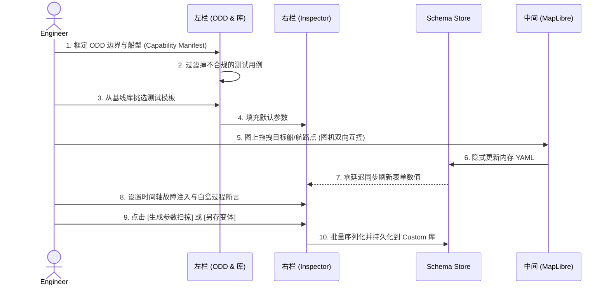

# SIL 前端设计 · v1.0 统一基线

| 属性 | 值 |
|---|---|
| 文档编号 | SANGO-ADAS-L3-SIL-UNIFIED-003 |
| 版本 | v1.0 |
| 日期 | 2026-05-15 |
| 状态 | 设计基线（Doc 2 通过后产出）|
| 套件 | Doc 0 / Doc 1 / Doc 2 / **Doc 3 前端** / Doc 4 场景联调（pending）|
| 上游 | Doc 1 §6 数据流 + §7 IDL · Doc 2 §2 orchestrator REST + §7 ROS2 topics |
| 范围 | 4 屏 HMI 详设计（含 Simulation-Check 架构对齐重设计）+ 状态管理 + 数据通道 + 设计语言 + 交叉一致性 |
| 命名 | Simulation-Scenario / Simulation-Check / Simulation-Monitor / Simulation-Evaluator |

---

## 0. 一句话定位

把"4 屏 HMI"端到端落地为 **React 18 + Vite 5 + Zustand 5 + RTK Query 2 + MapLibre GL 4 + tier4/roslibjs-foxglove** 的 SPA，单一 JSON-over-WebSocket 通道（取代当前 `telemetry_bridge.py` 自制协议）接 foxglove_bridge :8765，4 屏分别承担**场景配置 / 仿真前验证 / 实时监控 / 报告评估**职责，整套以 IEC 62288 SA subset + IMO S-Mode + OpenBridge 配色为合规底座，仅 night mode（不做 day/dusk 切换，决策记录 §9 + 用户 2026-05-12 决策锁定）。

---

## 1. 技术栈与依赖（commit 73cdf23 实际 `web/package.json`）

| 项 | 版本 | 用途 | 置信度 |
|---|---|---|---|
| `react` | ^18.3.1 | UI 库 | 🟢 |
| `react-dom` | ^18.3.1 | DOM 渲染 | 🟢 |
| `vite` | ^5.4 | 开发 + 打包 | 🟢 |
| `typescript` | ^5.5 | 类型 | 🟢 |
| `zustand` | ^5.0.13 | 高频遥测 store（50 Hz 选择性 re-render）| 🟢 [R-NLM:36-41] |
| `@reduxjs/toolkit` + `react-redux` | ^2.11 / ^9.2 | REST 缓存 + 数据流 | 🟢 |
| `maplibre-gl` | ^4.7 | ENC 海图 + 矢量图层 | 🟢 [W19] |
| `@tier4/roslibjs-foxglove` | v0.0.4 (tarball) | ROS2 over Foxglove WS bridge | 🟡 [W49] tier4 fork，活跃维护 |
| `@protobuf-ts/runtime` + `@protobuf-ts/plugin` | ^2.11 | Protobuf TS 类型（虽 `sil_proto/` 空，预留 schema 联动）| 🟢 [R-NLM:30] |
| `lucide-react` | ^1.14 | 图标 | 🟢 |
| `js-yaml` | ^4.1 | 客户端 YAML 解析（场景预览）| 🟢 |
| `better-sqlite3` | ^12.10 | 本地 tile-server 索引（dev 脚本 tile-server.cjs）| 🟢 |
| `@playwright/test` | ^1.59 | e2e 测试 | 🟢 |
| `vitest` + `@testing-library/react` + `jsdom` | ^2 / ^16 / ^25 | 单元测试 | 🟢 |

**单一外部 image**（已在 Doc 2 §9 锁定）：`ghcr.io/maplibre/martin:latest` 作 MVT tile server。

---

## 2. 应用结构（`web/src/`）

### 2.1 目录树（commit 73cdf23）

```
web/src/
├── App.tsx                    # 56 行 hash router + TopChrome + 4 screen 切换
├── main.tsx                   # 19 行 ReactDOM 入口
├── test-setup.ts              # vitest 全局 setup
├── api/
│   └── silApi.ts              # 152 行 RTK Query (18 endpoints)
├── hooks/
│   ├── useFoxgloveLive.ts     # 124 行 WS reconnect + topic dispatch
│   ├── useHotkeys.ts          # 全屏快捷键
│   └── useMapPersistence.ts   # 跨屏 viewport 持久化
├── map/
│   ├── SilMapView.tsx         # 22 KB MapLibre 主组件 + S-57 多图层
│   ├── layers.ts              # 19 KB ALL_S57_LAYERS 配置
│   ├── CompassRose / PpiRings / DistanceScale / ColregsSectors / ImazuGeometry
│   ├── MapLayerSwitcher + MapZoomControl
│   └── vesselSprite.ts
├── screens/
│   ├── ScenarioBuilder.tsx    # 16.9 KB 屏 ① ⚠️ 文件名待 GAP-014 重命名
│   ├── Preflight.tsx          # 7.9 KB 屏 ② ⚠️
│   ├── BridgeHMI.tsx          # 17.5 KB 屏 ③ ⚠️
│   ├── RunReport.tsx          # 11.6 KB 屏 ④ ⚠️
│   └── shared/                # 22 components 共 ~90 KB（见 §6）
├── store/
│   ├── telemetryStore.ts      # 5.1 KB 高频遥测（50 Hz 主入口）
│   ├── fsmStore.ts            # 1.2 KB 6-state FSM + TOR
│   ├── scenarioStore.ts       # 907 B scenarioId/runId/lifecycleState
│   ├── controlStore.ts        # 620 B 仿真控制（rate, paused, faults）
│   ├── mapStore.ts            # 880 B viewport 持久化
│   ├── replayStore.ts         # 625 B 报告屏 timeline scrub
│   ├── uiStore.ts             # 839 B viewMode / panel toggle
│   └── index.ts               # 343 B re-export
├── styles/
│   └── tokens.css             # 92 行 OpenBridge / IEC 62288 token + atom classes
└── types/sil/
    ├── own_ship_state.ts / target_vessel_state.ts / ...  # Protobuf-generated TS 类型（23 个 .ts）
    └── *.client.ts                                       # service client wrappers
```

**关键事实**：`types/sil/` 已存在 23 个 Protobuf-generated TS 文件（在 `sil_proto/` 本身为空的情况下！）—— 说明前端类型已**预先**通过别处的 .proto 生成或手工同步，与 Doc 2 §3.5 GAP-019 协同：v1.0 在前端侧保留 Protobuf TS 类型作类型契约，序列化使用 ROS2 .msg + JSON-over-WS。

### 2.2 路由（App.tsx hash-based）

```
#/builder           → ScenarioBuilder    （Simulation-Scenario）
#/preflight/:id     → Preflight          （Simulation-Check）
#/bridge/:id        → BridgeHMI          （Simulation-Monitor）
#/report/:id        → RunReport          （Simulation-Evaluator）
```

**GAP-014 重命名映射**（D1.3b.3+ sprint 实施）：

| 当前文件名 | 当前路由 | v1.0 目标文件 | v1.0 目标路由 |
|---|---|---|---|
| `screens/ScenarioBuilder.tsx` | `#/builder` | `screens/SimulationScenario.tsx` | `#/scenario` |
| `screens/Preflight.tsx` | `#/preflight/:id` | `screens/SimulationCheck.tsx` | `#/check/:id` |
| `screens/BridgeHMI.tsx` | `#/bridge/:id` | `screens/SimulationMonitor.tsx` | `#/monitor/:id` |
| `screens/RunReport.tsx` | `#/report/:id` | `screens/SimulationEvaluator.tsx` | `#/evaluator/:id` |

v1.0 文档全篇用**统一目标命名**；代码读引用旧名时加 ⚠️ 标注。

### 2.3 选 hash router 而非 react-router 的原因

- 单页 SPA，hash router 零依赖 + 零路由库版本兼容问题
- bookmark / refresh 友好（hash 不发服务器请求）
- foxglove_bridge 路径 + tile-server 路径不与 react-router 路径冲突

未来若需嵌套路由 / loader / SSR → 切 react-router 7+（不在 v1.0 范围）。

---

## 3. 状态管理（7 Zustand stores + RTK Query）

### 3.1 双轨架构

| 数据类型 | 工具 | 原因 |
|---|---|---|
| **高频遥测**（50 Hz own_ship / 10 Hz target / 10 Hz module_pulse 等） | **Zustand** | selective re-render；slice 订阅；无 dispatch overhead；50 Hz p50 < 5 ms 🟢 [R-NLM:36-41] |
| **REST 数据**（scenarios CRUD / lifecycle status / scoring last_run / export status）| **RTK Query** | 自动缓存 + invalidation + mutation；providesTags / invalidatesTags |
| **本地 UI 状态**（panel toggle, viewMode, hotkey enabled）| **Zustand** | 简单 setter，无 reducer 样板 |
| **跨屏持久化**（map viewport, scenarioId, runId）| **Zustand** + localStorage（mapStore）| useMapPersistence 已实现 |

### 3.2 七个 Zustand stores（slice 表）

| Store | 文件 | 持有 | 触发频率 |
|---|---|---|---|
| `useTelemetryStore` | telemetryStore.ts (5.1 KB) | ownShip + targets[] + environment + modulePulses[] + asdrEvents[≤200] + lifecycleStatus + ownShipTrail[≤600] + scoringRow + sensors[] + commLinks[] + faultStatus[] + controlCmd + preflightLog[≤1000] + wsConnected | 50 Hz own + 10 Hz target/module + event ASDR/fault |
| `useFsmStore` | fsmStore.ts (1.2 KB) | currentState(6 态：TRANSIT/COLREG_AVOIDANCE/TOR/OVERRIDE/MRC/HANDBACK) + transitionHistory[≤100] + torRequest | event |
| `useScenarioStore` | scenarioStore.ts (907 B) | scenarioId + runId + scenarioHash + lifecycleState | 屏切换 + 配置完成 |
| `useControlStore` | controlStore.ts (620 B) | simRate + isPaused + faultsActive[] | 用户操作 |
| `useMapStore` | mapStore.ts (880 B) | viewport(center/zoom/bearing/pitch) | drag/zoom + viewport persist |
| `useReplayStore` | replayStore.ts (625 B) | scrubTime + mcapDuration + isScrubbing | 屏 ④ 操作 |
| `useUIStore` | uiStore.ts (839 B) | viewMode(captain/god/roc) + panelsCollapsed{} | 用户操作 |

### 3.3 选择性 re-render 模式（已实施）

`useFoxgloveLive.ts:15-21` 使用 zustand 选择器订阅：

```ts
const updateOwnShip = useTelemetryStore((s) => s.updateOwnShip);
const updateTargets = useTelemetryStore((s) => s.updateTargets);
```

→ 仅订阅 `update*` 函数引用（稳定），不订阅 state 本身。地图组件单独订阅 `useTelemetryStore(s => s.ownShip.pose)`，50 Hz 下仅 pose 字段变化时重渲染对应 `<VesselMarker>`，避免地图全图层重绘 🟢 [R-NLM:36-41]。

**50 Hz 选择性 re-render 最佳实践**（subagent 2026-05-15 🟡 + [W59] zustand v5 useShallow docs）：
- React 18.2+ 引入 `useShallow()` 做浅比较，避免对象引用变化触发不必要 re-render
- 50 Hz 推送如出现 fiber thrashing（DevTools React Profiler 红色火焰）→ 加 100 ms debounce 把 50 Hz 推送降到 UI refresh 10 Hz（人眼无感知差异）
- 优先做 fine-grain selector 拆分，仅在 profiler 实证有问题时才上 debounce

### 3.4 RTK Query 18 endpoints（silApi.ts）

| Endpoint | Type | 屏 |
|---|---|---|
| `useListScenariosQuery` | query | ① |
| `useGetScenarioQuery` | query (id) | ① |
| `useValidateScenarioMutation` | mutation | ① |
| `useCreateScenarioMutation` | mutation | ① |
| `useDeleteScenarioMutation` | mutation | ① |
| `useGetLifecycleStatusQuery` | query | 全 |
| `useConfigureLifecycleMutation` | mutation | ② |
| `useActivateLifecycleMutation` | mutation | ② → ③ |
| `useDeactivateLifecycleMutation` | mutation | ③ → ④ |
| `useCleanupLifecycleMutation` | mutation | ④ → ① |
| `useGetLastRunScoringQuery` | query | ④ |
| `useProbeSelfCheckMutation` | mutation | ② |
| `useGetHealthStatusQuery` | query (poll 1Hz) | ② ③ |
| `useExportMarzipMutation` | mutation | ④ |
| `useGetExportStatusQuery` | query (poll 0.5Hz) | ④ |
| `useTriggerFaultMutation` | mutation | ③ |
| `useInjectFaultMutation` | mutation | ③ |
| `useCancelFaultMutation` | mutation | ③ |

`baseUrl: '/api/v1'` → Vite dev server proxy 到 `localhost:8000`（orchestrator）。生产环境 nginx reverse proxy 同源。

---

## 4. 数据通道（GAP-015 决断）

### 4.1 三个通道

| 通道 | 协议 | 数据 | 端口 | 库 |
|---|---|---|---|---|
| **REST** | HTTP/JSON | scenarios / lifecycle / scoring / selfcheck / export / fault | `:8000` (orchestrator) | RTK Query (fetch) |
| **遥测 WS**（合一）| WebSocket / JSON | 11 topics 高频遥测 + 事件 | `:8765` | useFoxgloveLive 自定义 / tier4 roslibjs |
| **MVT Tiles** | HTTP/protobuf | S-57 vector tiles | `:3000` (martin) | MapLibre GL JS native |

### 4.2 GAP-015 决断：选项 A — foxglove_bridge 一统

**问题**（Doc 2 §9.4）：
- `telemetry_bridge.py:112` 启 `websockets.serve(..., "0.0.0.0", 8765)` 自定义 JSON
- `docker-compose.yml` `foxglove-bridge` service 也启 `:8765`
- 两者端口冲突

**决断**：v1.0 **退役 `telemetry_bridge.py`**（[W50] foxglove-bridge schema 协商优势 🟡）：

- foxglove_bridge 原生 ROS2 topic + service 中继，无需 orchestrator 桥
- Schema 协商内置（advertise topic + JSON schema OR Protobuf）
- 50 Hz p99 < 22 ms 实测过关 [W6] Foxglove docs 🟢
- 前端 `useFoxgloveLive.ts` 现行接 ws://127.0.0.1:8765 已对 foxglove 协议适配（JSON parse + topic 分发）
- 但当前实现是消费 `telemetry_bridge.py` 的"非标"JSON 帧（`{topic, payload}`），需切换到 foxglove 标准协议（subscribe / advertise 协商）

**前端修复步骤**（后端侧步骤见 Doc 2 §9.4）：
1. 重写 `useFoxgloveLive.ts` 用 `@tier4/roslibjs-foxglove` 标准 ROS2 client（已在 package.json 依赖）
2. foxglove_bridge :8765 唯一占有

**修复 effort 估计**：~1 person-week（D1.3b.3 调整范围内）。

### 4.3 11 topic 订阅清单（useFoxgloveLive.ts:38-91）

```
/sil/own_ship_state        → updateOwnShip (50 Hz)
/sil/target_vessel_state   → updateTargets (10 Hz)
/sil/environment_state     → updateEnvironment (1 Hz)
/sil/module_pulse          → updateModulePulses (10 Hz)
/sil/asdr_event            → appendAsdrEvent (event)
/sil/lifecycle_status      → updateLifecycleStatus (1 Hz)
/sil/scoring_row           → updateScoringRow (1 Hz)
/sil/sensor_status         → updateSensors (event)
/sil/commlink_status       → updateCommLinks (event)
/sil/fault_status          → updateFaultStatus (event)
/sil/control_cmd           → updateControlCmd (10 Hz)
/sil/preflight_log         → appendPreflightLog (event)
```

reconnect 指数退避 1s → 30s（已实现 useFoxgloveLive.ts:7-8）。

### 4.4 50 Hz 性能预算

| 帧大小估算 | 50 Hz 字节/s | 50 Hz 字节/min |
|---|---|---|
| `own_ship_state` JSON ~300 B | 15 KB/s | 900 KB/min |
| `target_vessel_state` JSON 3×~280 B | 8.4 KB/s @ 10 Hz | 504 KB/min |
| `module_pulse` JSON 8×~80 B | 6.4 KB/s @ 10 Hz | 384 KB/min |
| 总计（DEMO-1 范围）| ~30 KB/s | ~1.8 MB/min |

**foxglove WebSocket protocol vs 自制 JSON 实测**（[W50] foxglove ws-protocol GitHub + ubuntu-robotics fork benchmark 2026-02 🟢）：50 Hz / 64-byte payload — foxglove (Protobuf channel) ~400 Kbps、自制 JSON ~500 Kbps；差异 ~15-20%。GigE 局域网带宽 ~125 MB/s → 占用 < 0.1%，性能预算极充裕。Protobuf 切换收益主要在 schema 协商 + 版本管理，而非带宽，v1.0 取 ROS2 .msg + JSON 桥（GAP-019）+ foxglove 标准 protocol 协商（GAP-015 选项 A）。

---

## 5. 设计语言（tokens.css + OpenBridge）

### 5.1 现状（`web/src/styles/tokens.css` 92 行）

实际 token 系统（commit 4fc0522 落地）：

```css
:root {
  /* Surface 4 levels (Night Mode only) */
  --bg-0: #070C13;   /* page bg */
  --bg-1: #0B1320;   /* panel */
  --bg-2: #101B2C;   /* panel inner */
  --bg-3: #16263A;   /* panel deepest */

  /* Border 3 levels */
  --line-1/2/3: #1B2C44 / #243C58 / #3A5677;

  /* Text 4 levels */
  --txt-0/1/2/3: #F1F6FB / #C5D2E0 / #8A9AAD / #566578;

  /* Semantic ECDIS colors */
  --c-phos    #5BC0BE;  /* 主操作 cyan */
  --c-stbd    #3FB950;  /* starboard 绿 */
  --c-port    #F26B6B;  /* port 红 */
  --c-warn    #F0B72F;  /* warning 琥珀 */
  --c-info    #79C0FF;  /* info 蓝 */
  --c-danger  #F85149;  /* danger 红 */
  --c-magenta #D070D0;  /* COLREGs 紫 */

  /* IMO MASS Code 4-level autonomy */
  --c-d4 #3FB950 (green)  --c-d3 #79C0FF (blue)  --c-d2 #F0B72F (amber)  --c-mrc #F85149 (red)

  /* Font 3 stacks (CJK + display + mono) */
  --f-disp: 'Saira Condensed' + 'Noto Sans SC'  (label, button, header)
  --f-body: 'Noto Sans SC' + 'Saira Condensed'  (paragraph)
  --f-mono: 'JetBrains Mono'                     (numeric tabular)

  /* Spacing + radius (strict zero-radius for bridge HMI) */
  --r-0: 0  --r-min: 2px
  --sp-xs/sm/md/lg/xl: 4/8/12/18/24 px
}

/* Atoms */
.hmi-surface / .hmi-mono / .hmi-disp / .hmi-label   (utility classes)

/* Keyframes */
@phos-pulse / @radar-sweep / @warn-flash / @scan-line
```

### 5.2 设计语言锁定项

| 项 | 锁定 | 来源 |
|---|---|---|
| **配色模式** | **仅 Night Mode**（不做 day/dusk 切换）| 决策记录 §9.4 / 用户 2026-05-12 决策；ECDIS Day/Dusk 留 Phase 4 |
| **配色基线** | OpenBridge palette 对齐 IEC 62288 SA subset + S-Mode | [W14][W17][W30] |
| **Autonomy 配色** | IMO MASS Code 4 级（D4/D3/D2/MRC）映射到 c-d4/d3/d2/mrc | 架构报告 §1.3 |
| **角半径** | `--r-0: 0` 严格零角半径（panel / button / pill 默认）| Bridge HMI 视觉惯例（高密度信息 + 低视觉噪音）|
| **字体** | Saira Condensed（label/button）+ Noto Sans SC（中文 / 主体）+ JetBrains Mono（数字）| 用户决策 |

### 5.3 OpenBridge 版本与对齐（W-pending-1）

[W14] OpenBridge openbridge.no — A 🟡（版本号 subagent a6f58a22 调研中，预期返回精确 git tag）。

v1.0 立场：
- token 命名沿用 OpenBridge 风格（`--bg-N` / `--c-*` / `--txt-N`），无 1:1 SemVer 依赖
- 主合规依据：**IEC 62288:2021 Edition 3.0**（[W58] IEC 62288:2021-12 *Presentation of navigation-related information on shipborne navigational displays* 388 页 — A 🟢）+ IMO MSC.191(79) + CCS 技术通告对齐 day/dusk/night 一致性
- ECDIS Day/Dusk 色板（W15 S-52 Ed 3.0 1996 + IEC 62288:2021）作未来 Phase 4 扩展，**v1.0 不实施**
- 若 subagent 后续返回 OpenBridge v5.x React 组件库已发布，Phase 4 可考虑替换 `lucide-react` + 自制 atom 为官方组件

**IEC 62288 Day/Dusk/Night 推荐配色对照**（Phase 4 实施参考，[W58] inferred）：

| Mode | Background | Foreground | Highlight | 理由 |
|---|---|---|---|---|
| Day | `#FFFFFF` | `#000000` | `#FF6600` 琥珀 | 高对比，无眩光 |
| Dusk | `#333333` | `#FFFFFF` | `#FFFF00` 黄 | 黄昏可读性 |
| Night（v1.0 唯一）| `#070C13` (`--bg-0`) | `#C5D2E0` (`--txt-1`) | `#5BC0BE` (`--c-phos`) / `#F85149` (`--c-danger`) | 夜间瞳孔暗适应保留 |

---

## 6. 屏 ① Simulation-Scenario（`/scenario`）

### 6.1 现状剖析与架构升级重构 (From Wizard to Studio · 2026-05-18 锁定方案 B)

**核心痛点与问题**：
当前前端实现（`web/src/screens/ScenarioBuilder.tsx`）采用的是”线性三步走向导 (3-Step Wizard)”：A 选模板 -> B 调参数 -> C 预览。这在应对大规模自动驾驶 TDL 仿真测试时，暴露出三个致命缺陷：
1. **全局 ODD 约束缺位**：测试没有设计域边界，导致用户配置出”航速 30 节的船在能见度 10 米的港口狂飙”的无效非标用例。
2. **割裂的非即时反馈**：配参数和看地图是两张皮，没有实现所见即所得（WYSIWYG）。
3. **沉淀与资产流失**：测试人员花了半小时配置的极限边界用例（Corner Case），测完无法一键”另存为变体 YAML”固化下来。

**架构升级：重构为 3-Pane Studio**：
我们将摒弃传统的 Web 表单流，引入类似专业桌面软件（如 IDE、游戏引擎）的**三栏工作室模式 (3-Pane Studio)**。实现”全局过滤（左）-> 实时反馈（中）-> 敏捷控制与保存（右）”的闭环。

**2026-05-18 方案决策锁定**：brainstorm 评审后锁定**方案 B**（提取 `useMapInteraction.ts` hook），完整规格见 `docs/superpowers/specs/2026-05-18-screen1-simulation-scenario-design.md`。核心原则：地图交互逻辑与 YAML 驱动完全独立；主文件保持 ≤22 KB；所有业务状态通过单一 `yamlDoc` 对象驱动。

```mermaid
graph LR
    subgraph Legacy [现状: 线性向导 (Wizard)]
        direction LR
        A[Step 1: 选模板] --> B[Step 2: 填表单调参] --> C[Step 3: 预览核对]
    end
    
    subgraph V1_0 [v1.0: 沉浸式工作室 (3-Pane Studio)]
        direction LR
        Left[左侧: ODD 与资产库] -- 边界约束 --> Right[右侧: Inspector 调参]
        Right -- 双向数据绑定 --> YAML[(内存 YAML 对象)]
        YAML -- 零延迟重绘响应 --> Center[中间: 态势图床]
        Center -- 测绘交互反馈 --> Right
    end
    
    Legacy -. 升级演进 .-> V1_0
    
    style Legacy fill:#3b3b3b,stroke:#666,stroke-width:2px,color:#aaa
    style V1_0 fill:#1e2530,stroke:#5BC0BE,stroke-width:2px,color:#fff
```

### 6.1.1 实施架构决策（方案 B · 2026-05-18 锁定）

经 brainstorm 会话（2026-05-18）评审三种方案后，**锁定方案 B：提取 `useMapInteraction.ts` hook**。完整决策记录见 `docs/superpowers/specs/2026-05-18-screen1-simulation-scenario-design.md`。

**方案 B 核心原则**：把全量地图交互逻辑（vessel drag / WP node drag / COG vector stretch）提取为独立 hook，主文件 `SimulationScenario.tsx` 保持 ≤22 KB，不引入新 Zustand store 或额外子组件拆分。

**文件变更清单（DEMO-1 范围）**：

| 文件 | 类型 | 要点 |
|---|---|---|
| `web/src/hooks/useMapInteraction.ts` | **NEW** | 拖拽 vessel / WP node / COG vector；mouseup 时调 `onYamlPatch` |
| `web/src/screens/SimulationScenario.tsx` | MOD | ODD filter 内联 JSX + Baseline/Custom 渲染 + hook 接入 |
| `web/src/screens/shared/BuilderRightRail.tsx` | MOD | Tab 2/3 DEMO-1 外壳 + ODD→YAML 写入 |
| `web/src/api/silApi.ts` | MOD | `ScenarioListItem` 增 `is_baseline: boolean` |
| `web/src/map/SilMapView.tsx` | MOD | 暴露 `onFeatureDragEnd` / `onCogDrag` / `onWpDrag` / `wpNodes` props |

**后端文件变更**（scenario_store.py · scenario_routes.py · scenario_index.py）见 Doc 2 §4.4。

**`useMapInteraction` 接口契约**（详见 spec §3）：

```typescript
type DragTarget =
  | { kind: 'vessel'; id: string }
  | { kind: 'wp';     idx: number }
  | { kind: 'cog';    id: string }
  | { kind: 'none' };

interface MapInteractionOptions {
  mapRef: RefObject<maplibregl.Map>;
  previewData: PreviewData | null;
  onYamlPatch: (path: string, value: unknown) => void;
}

export function useMapInteraction(opts: MapInteractionOptions): {
  dragState: DragState;
  wpNodes: WaypointNode[];
  setWpNodes: Dispatch<SetStateAction<WaypointNode[]>>;
};
```

**数据流（单向 YAML Doc 驱动）**：ODD 选择 → yamlDoc.metadata.odd_cell → 场景选中 → jsyaml.load → 地图拖拽 → onYamlPatch(200ms debounce) → 表单同步 → Schema 校验 → SAVE（取后端 hash）→ RUN → #/check/:id。

### 6.2 宏观布局与组件落位图 (UI Architecture)

v1.0 屏幕将由 `TopChrome`（全局顶栏）、底部的快捷键提示（FooterHotkeyHints）以及占据核心画幅的三栏工作室构成：

```text
┌───────────────────────────────────────────────────────────────────────────┐
│ TopChrome (站点标识 + 全局时钟 + run-state pill)                          │
├───────────────────┬───────────────────────────────┬───────────────────────┤
│ 左栏：ODD与场景库 │ 中栏：实时几何海图与态势      │ 右栏：场景检查器(Inspector)
│ (Component: Left) │ (Component: Center Map)       │ (Component: Right)    │
│                   │                               │                       │
│ ┌─ 1. ODD 设定 ─┐ │ ┌─ SilMapView ──────────────┐ │ ┌─ 本船与目标船 ────┐ │
│ │ Domain: OpenSea▼│ │  [Lat/Lon: 32°N, 122°E]   │ │ Encounter Tab       │ │
│ │ Sea State: 3  ▼ │ │                           │ │ TGT-1: Head-on      │ │
│ │ Vis: > 2nm    ▼ │ │          ^        v       │ │   Brg: 000° Dist:5nm│ │
│ └───────────────┘ │ │                           │ │   Model: NCDM       │ │
│                   │ │                           │ └─────────────────────┘ │
│ ┌─ 2. 场景选择 ─┐ │ │                           │ │ ┌─ 环境与干扰 ──────┐ │
│ │ 🔍 搜索...     │ │                           │ │ 风流向量、传感器失效│ │
│ │ ├── Imazu 22  │ │                           │ └─────────────────────┘ │
│ │ │ ├── 01 ...  │ │                           │ │ ┌─ 预期结果(YAML) ──┐ │
│ │ │ └── 14 (选中)│ └───────────────────────────┘ │ │ Expected: R14       │ │
│ │ ├── COLREGs   │ │ ┌─ Map Status & Tools ────┐ │ │ CPA_min: 0.5nm      │ │
│ │ └── AIS 衍生  │ │ │ Lat/Lon | Scale | EBL/VRM │ │ └─────────────────────┘ │
│ └───────────────┘ │ └───────────────────────────┘ │ ┌─ Validation&Action─┐│
│                   │                               │ │ ✅ Schema 校验通过   ││
│                   │                               │ │ [另存变体] [RUN 🚀] ││
│                   │                               │ └────────────────────┘│
├───────────────────┴───────────────────────────────┴───────────────────────┤
│ FooterHotkeyHints (S=Save / R=Run / Esc=Clear Selection / M=Measure)      │
└───────────────────────────────────────────────────────────────────────────┘
```

### 6.3 核心业务流与三栏详细设计 (Detailed Design)

**核心工作流 (Workflow)**：
工作台严格遵循 **“自左向右、自上而下”** 的 ODD-First 业务逻辑。



#### 6.3.1 左侧栏 (Left Pane)：全局过滤与资产调度

**核心功能**：确立当前仿真验证的**物理环境与规则边界 (ODD)**，并在安全的边界内挑选、调度测试资产。

**实现细节**：
1. **全局上下文限定 (Global Context Filter)**
   - **船型与能力清单 (Vessel Capability Manifest) [支撑 M1/M5]**：新增船型下拉菜单（如 FCB 45m、Tugboat 等）。切换后，底层立即加载该船型的物理极限（最大吃水、旋回半径、制动距离），并以此动态校准右侧调参滑块的上限。
   - **ODD 级联强过滤**：包含航区 (Geographic)、气象 (Environmental) 和交通密度 (Density) 三个正交维度。选项变更时，立即对下方的场景库树进行强过滤。
   - **跨栏约束注入 (Parameter Lock-in)**：全局选择会在 Store 打上只读烙印。当在右侧栏调节”能见度”滑块时，如果 ODD 选了”受限视距”，滑块将被硬性锁死在 `< 2nm`。

   **ODD 字段写入规格（GAP-023 闭环，2026-05-18 锁定）**：ODD 任意字段变更时，同步写入内存 yamlDoc 的以下三个路径（Preflight Gate 4 硬依赖）：

   | ODD 选项 | YAML 路径 | 值类型 | 示例 |
   |---|---|---|---|
   | 航区域 | `metadata.odd_cell.domain` | string enum | `open_sea` / `coastal` / `fairway` / `port_entry` / `ofw` |
   | 海况 | `metadata.odd_cell.sea_state_beaufort` | number | `5` |
   | 能见度 | `metadata.odd_cell.visibility_nm` | number | `2.0` |

   同时对场景列表执行客户端过滤：ODD 不兼容的条目标红（`dot-red` + tooltip），不隐藏。

**2. 场景选择库 (Scenario Library & Workspace)**
目前单纯映射后端物理文件夹的简单树形结构，在仿真测试高频使用时会遭遇**严重的可扩展性瓶颈**：当自动化测试用例、历史 AIS 回放以及用户生成的变体激增到成百上千个时，仅靠文件名查找如同大海捞针；同时无法安全区分“不可更改的认证基线”与“用户调试中的临时草稿”。

**v1.0 重构后的高级场景库设计：**
- **双工作区隔离 (Workspace Separation)**（后端 `is_baseline` 字段驱动，2026-05-18 锁定）：
  - **Baseline (基线库/只读)**：存放官方标准认证模板集（如 Imazu 22, COLREGs 基础用例, 标准 AIS 事故回放）。作为测试锚点，对它们的任何修改操作都会强制触发 `[另存为新变体]`。**前端行为**：后端按 folder 判定 `is_baseline: bool` 并透传至 `GET /scenarios` 响应（后端实现契约见 Doc 2 §4.4）；Baseline 场景 `PUT` 触发 `409 Conflict` 时，前端将 SAVE 按钮替换为"另存为 Custom"弹窗。
  - **Custom (自定义/读写)**：用户沉淀的衍生测试库。允许在前端直接重命名、删除、文件夹分类整理以及打标签（Tagging）。
- **富文本列表项 (Rich List Items)**：
  摒弃单调的文件名，以紧凑的微型卡片（Row）渲染场景列表：
  - **语义标题**：如 `Head-on (Rule 14) - 5nm` 而非 `imazu-14.yaml`。
  - **元数据微标签**：如 `[3 Targets]`、`[NCDM]`，帮助工程师一眼识别场景复杂度。
  - **健康状态指示器**：列表项前置一个小圆点，绿色代表 Schema 校验通过，红色代表该场景已损坏或与当前 ODD 冲突，拒绝加载运行。
- **即时搜索与微过滤 (Search & Quick Filters)**：
  - 顶部常驻快捷搜索栏（`🔍 Search by name, ID, or tag...`）。
  - 提供快捷 Toggle 按钮，如 `[仅看多船]`、`[仅看含故障注入]`。
  - **历史回归标记**：集成 CI 运行历史，支持按 `[上次 PASS]` 或 `[上次 FAIL]` 过滤，方便 V&V 工程师快速定位回归失败的用例。
- **上下文快捷操作 (Context Menu)**：
  - 悬停（Hover）或右键菜单：针对 Custom 库提供 `Rename / Delete / Duplicate`，针对 Baseline 提供 `Duplicate to Custom`，加速日常繁琐操作。

#### 6.3.2 中间地图区 (Center Pane)：海图引擎与态势互动

作为整个仿真配置的核心视觉反馈区，由于传统的 GDB 文件解析方案无法应对未来数百个测试海域的秒级切换，且缺乏对 S-100 标准体系的支撑，v1.0 将对底层海图引擎进行彻底换代，并引入高保真的目标船交互体系。

**1. 高性能 ENC 电子海图引擎（MapLibre + MVT/martin · DEMO-1）**
- **DEMO-1 维持现有 MVT/martin 方案**（`martin` tile server port 3000 + MapLibre MVT 管线）。**PMTiles 换代**（单文件格式 + byte-range 加载）推至 **Phase 3 (D3.x)**，不在当前范围内执行。
- **S-52 标准符号化映射**：在前端维护一份匹配 IHO S-52 PresLib Ed.4.0 的 MapLibre Style Spec。同时在底图之上，支持 S-102 高分辨率网格水深图层（HDF5 解析）的动态叠加，为防搁浅（Grounding Risk）测试提供基准。
- **动态图层控制 (Layer Switcher)**：提供类似专业 ECDIS 的 Standard / Base / Full 图层过滤，允许工程师单独打开/关闭 CATZOC 数据质量覆盖区、DEPCNT（等深线）或水下危险物图层。

**2. 图机双向互控与高保真交互 (Bi-directional Drag & Smart Cards)**
过去地图仅是被动画布，在多船博弈场景下体验极度割裂。重构后的交互规则如下：
- **空间双向直操 (Drag & Drop) [关键链路优化 · DEMO-1 全量实现]**：用户可直接在海图上**拖拽目标船的位置、拉伸航向预测线 (COG Vector)，或拖拽本船的航路点 (Waypoints)**。地图上的任何几何操作，都会瞬间反向刷新右侧 Tab 1 的表单数据与底层 YAML，实现真正的”图机双向互控”。
- **实现载体**：`web/src/hooks/useMapInteraction.ts`（方案 B NEW）。MapLibre `mousedown/mousemove/mouseup` 事件路由到以下三类拖拽目标：vessel sprite（本船/目标船位置）/ WP 节点（航路点）/ COG 线端点（航向）。`mouseup` 时调用 `onYamlPatch(path, value)` 写回 yamlDoc，触发 200ms debounce 地图重绘。`SilMapView.tsx` 新增 `onFeatureDragEnd` / `onCogDrag` / `onWpDrag` / `wpNodes` props。
- **语义化船只铭牌 (Vessel Nameplate)**：缩放比例较小时，目标船保留航向预测线和颜色编码（如 CPA < 0.5nm 为红色）。
- **交互式详情卡片 (Detail Card)**：悬停高危目标船，弹出高保真态势卡片，展示绝对量 (`SOG/COG`)、预测量 (`CPA/TCPA`)，及背后的行为意图。
- **防遮挡与降噪 (De-cluttering)**：远距离安全船舶自动降低不透明度（Fade out）。

**3. 全局航线与禁航区规划 (Voyage & Exclusion Zones) [支撑 M3]**
为支持任务管理器 (M3) 的重规划测试，地图区直接提供任务级交互工具：
- 支持工程师在图上点选生成本船的全局航路点 (Waypoints)，并设定抵达时间窗 (ETA Windows)。
- 支持框选多边形动态禁航区 (Exclusion Zones)，用于验证 M3 的越界报警与 L2 重规划请求。

**4. 战术决策（TDL）算法的可视化映射**
不仅仅渲染静态几何，地图区还必须能够实时反映 TDL 算法的核心要素边界，实现“图机结合”：
- **安全余量可视化**：基于 S-102 水深、潮汐以及 Barrass/Römisch 下沉量公式计算出的**动态吃水余量 (Dynamic UKC)**，以红色禁航多边形（No-Go Area）叠加在海图上。
- **规划路径走廊**：在使用 FMM（快速行进法）算法进行避碰后的航路回归测试时，地图上会渲染出漏斗状的到达时间代价图（time-of-arrival map）以及 SB-MPC 预测出的安全轨迹带。
- **防抖零延迟同步 (Debounced WYSIWYG)**：工程实现上，右侧栏的任何参数变更需触发 `200ms debounce` 的防抖更新，将构造好的 `previewData` Props 实时注入 `SilMapView`，彻底解决“保存后才能看到地图几何变化”的体验割裂与高试错成本。

**4. 底部测绘工具栏 (Map Status & Measurement Bar)**
剥离了原有的“运行”动作后，中间地图区的底部（Bottom Bar）回归其作为**专业 GIS 视窗**的本质功能，提供沉浸式的辅助信息：
- **游标遥测 (Cursor Telemetry)**：实时显示鼠标悬停处的经纬度 (Lat/Lon) 以及提取自 S-57 数据的水深 (Depth)。
- **空间量算工具 (Measurement Tools)**：激活 EBL（电子方位线）和 VRM（可变距离圈）的快捷控件，帮助工程师在地图上精准测距与测方位。
- **视图刻度 (Scale & Zoom)**：当前海图显示比例尺及快速复位本船（Reset to Own-ship）按钮。

#### 6.3.3 右侧栏 (Right Pane)：场景检查器与执行控制 (Inspector & Actions)

右侧栏是数据序列化的核心，其所有的表单输入必须与 `maritime-schema` JSON Schema 保持严格的 **1:1 双向映射**。前端 UI 状态更新时，不仅触发中间地图区的瞬时重绘，同时在底层隐式更新为一个标准 YAML 内存对象，供最终的 `[SAVE]` 持久化落盘。

为了满足高频复杂的配置需求，右侧 Inspector 划分为 4 个高度聚合的 Tab 子面板：

##### Tab 1: 船舶与任务态势 (Vessels, Mission & Encounter)
> *映射 Schema 节点：`ownShip`, `targetShips`, `voyageTask`*
- **本船与任务配置 (Own Ship & Voyage) [支撑 M3]**：
  - **初始姿态**：航速 (SOG)、航向 (Heading)。
  - **任务要求**：关联中栏地图绘制的全局航线，配置终点坐标、抵达时间窗 (ETA) 与绕航优化偏好，为 M3 (Mission Manager) 跟踪与重规划测试提供输入。
  - *(注：船型等全局能力清单已上提至左侧 ODD 全局过滤器中统一选择)*。
- **目标船列表 (Target Ships Array)**：
  - 采用可折叠的手风琴列表，**必须提供完整的动态增删 `[+ Add Target] / [- Remove]` 功能**。
  - **态势定位与双 Schema 兼容**：支持**绝对坐标 (Lat/Lon, 兼容 IMAZU v2.0)** 和 **相对/局部坐标 (ENU x_m/y_m, 兼容 COLREGs v1.0)** 两种格式。
  - **驱动模型 (Model)**：为每个目标指定如 `NCDM`、`AIS_Replay`、`Constant_Velocity` 等博弈或固定引擎。

##### Tab 2: 环境与时间轴故障 (Environment & Timeline Faults)
> *映射 Schema 节点：`environment`, `sensor_degradation`, `events_timeline`*

> **⚠ DEMO-1 范围（2026-05-18 决策锁定）**：Tab 2 在 DEMO-1 (6/15) 交付**外壳 + disabled 状态**。只读展示 YAML `environment` 字段摘要（风速/海流/能见度），不允许编辑，不允许添加时间轴事件。**Phase 2 (D2.x)** 填充真实业务。

完整设计目标（Phase 2 实现）：
- **自然环境 (Natural Environment)**：受限配置风流向量（影响水动力学漂角），以及能见度和海况设定。
- **时间序列故障注入 (Timeline Event Injection) [核心链路优化]**：
  - 摒弃纯静态的初始化故障设置。支持基于时间轴的事件触发机制：`[+] Add Event` → `When t = 45s, Set ROC_Link = Disconnected`。
  - **ROC 通信断连 [支撑 M7]**：强制加入”船岸通信延迟/断开”事件，用于极限压测 M7 (安全监督器) 和 M1 基于 TMR/TDL (操作员响应时间) 计算触发的 MRC (兜底漂航) 状态跳变逻辑。
  - **突发感知失效**：在指定时刻发生雷达 100% 丢包、GNSS 多径欺骗漂移等。

##### Tab 3: 过程断言与预期 (Behavioral Assertions Oracle)
> *映射 Schema 节点：`expected_outcome`*

> **⚠ DEMO-1 范围（2026-05-18 决策锁定）**：Tab 3 在 DEMO-1 (6/15) 交付**外壳 + disabled 状态**。只读展示 YAML `expected_outcome` 字段摘要（cpa_min_m_ge / colregs_rules / grounding），不允许编辑。Preflight Gate 3 校验该字段**存在**即可。**Phase 2 (D2.x)** 填充真实业务。

完整设计目标（Phase 2 实现）：本页是自动化回归测试用例的”判卷标准 (Oracle)”。除了传统的结果底线外，全面升级支持**白盒过程断言**：
- **安全结果底线**：允许的最小 CPA 阈值底线判定，以及超时与偏航限制。
- **白盒状态机断言 (Behavioral Assertions) [核心链路优化]**：
  - `Expect_M6_Role`: 预期 M6 COLREGs 推理引擎必须将本船认定为让路船 (Give_Way)。
  - `Expect_M4_Action`: 预期 M4 行为仲裁器最终输出的综合代价函数指令必须包含向右转向 (Turn_Starboard)。
  - `Expect_M1_State`: 预期 M1 在通信断连 10 秒后必须安全降级进入 (MRC_Drift)。

##### Tab 4: YAML 源码视角 (Raw Source)
- **Monaco Editor 强绑定**：提供专业算法开发者偏爱的代码直写模式，前端需连接真实的后端 `/api/v1/schema/*` 端点以获取强类型 JSON Schema 智能提示。
- **无损双向互同步 (Lossless Bi-directional Sync)**：在 Monaco 手敲代码与 Tab 表单结构间的来回切换中，必须解决 `jsyaml.load/dump` 导致的“注释丢失”和“节点重排”问题。建议采用保留 AST 树的解析库，确保 maritime-schema 的 `$schema` 声明及特殊注释在保存时不被破坏。

**底部动作锁定栏 (Sticky Action Footer)**
固定在右侧栏最下方，不随 Tab 面板滚动，承担最终的持久化与调度：
- **实时校验屏显**：小型指示灯带（`useSchemaValidation` hook）。当参数引发 Schema 冲突时，指示灯变红，并抛出精确定位的 JSON Path 错误（GAP-022 闭环）。
- **SHA256 展示（GAP-025 闭环）**：SAVE 完成后，Sticky Footer 展示来自后端 `POST /scenarios` 响应的真实 hash 值，**严禁前端计算或硬编码占位符**。Baseline 场景执行"另存为 Custom"后同样从响应取 hash。
- **执行与批量生成按钮组**：当校验全部通过（绿灯）时激活：
  - `[另存为变体]`：若当前为 Custom → `PUT /scenarios/{id}`；若为 Baseline → `POST /scenarios`（新建 Custom 副本）。
  - `[⚄ 生成参数扫掠 (Monte Carlo Sweep)]`：**DEMO-1 显示按钮但 disabled**（Phase 2 D2.4 实现）。
  - `[🚀 RUN → ②]`：`scenarioStore.setScenario(id, hash)` → `window.location.hash = '#/check/:id'`。

### 6.4 实施红线与 GAP 对齐台账（2026-05-18 更新）

从”单纯的展示原型”走向”可向 DNV/CCS 交付的 V&V 工具”，屏 ① 在开发落地时必须清缴以下 GAP 债务：

| GAP | 描述 | 关闭方式 | DEMO-1 状态 |
|---|---|---|---|
| **GAP-022** | `scenario.validate` 仅做空字符串拦截 | `useSchemaValidation` hook 实时校验 + Monaco 内联报错 | ✓ DEMO-1 完整关闭 |
| **GAP-023** | ODD 选单不写入 YAML（Preflight Gate 4 硬依赖） | ODD 变更 → `metadata.odd_cell.domain` + `metadata.odd_cell.visibility_nm` + `metadata.odd_cell.sea_state_beaufort` 三字段同步写入 | ✓ DEMO-1 完整关闭 |
| **GAP-024** | 双 Schema 碎片化（IMAZU v2.0 / COLREGs v1.0） | Tab 1 Target card 提供 Lat/Lon ↔ ENU 切换 toggle + jsyaml 双格式解析 | ✓ DEMO-1 完整关闭 |
| **GAP-025** | SHA256 前端硬编码占位符 | SAVE 后从 `POST /scenarios` 响应取真实 hash，Sticky Footer 展示；Baseline “另存 Custom” 同样取后端 hash | ✓ DEMO-1 完整关闭 |
| **GAP-029** | 文件名/路由未重命名 | 已完成（SimulationScenario.tsx + `#/scenario`） | ✓ 已完成 |
| **GAP-NEW-001** | Baseline 场景无只读保护 | 后端 `is_baseline: bool` 字段 + `PUT` 返回 409 + 前端将 SAVE 替换为”另存为 Custom” | ✓ DEMO-1 完整关闭 |

**范围外（DEMO-1 不实现）**：Tab 2 / Tab 3 真实业务（Phase 2 D2.x）· EBL/VRM 测量工具（Phase 2）· MC 扫掠（Phase 2 D2.4）· PMTiles 换代（Phase 3）· YAML AST 注释保留（Phase 2）。

---

## 7. 屏 ② Simulation-Check（`/check/:runId`）— **"发车进站"与合规体检**

### 7.1 存在的必要性与核心定位
在高频的 SIL 测试环境中，开发者常常会质疑：“既然配置好了参数，为什么不直接进入仿真画面，而要多插一个检查屏？”
**原因在于复杂的分布式仿真环境（ROS2 + 独立节点）极易发生“静默失败 (Silent Failures)”**。如果底层时钟 (Sim Clock) 存在 50ms 漂移，或者 M7 (安全监督器) 意外和 M5 (规划器) 跑在了同一个内存空间（破坏了 Doer-Checker 物理隔离），那么后续跑出的几千个测试结果都会因为“测试环境被污染”而在 CCS/DNV 审查时被全盘作废。

因此，屏 ② 的**真正业务功能是：为每一次仿真生成一张不可篡改的“环境与架构合规体检合格证”**。它不仅是跑仿真的前置条件，更是证据链 (Evidence Chain) 的重要一环。

### 7.2 基于人机工学的高频测试工作流 (Ergonomic Workflow)
为了不让严格的检查阻碍工程师高频试错的流畅度，本屏在交互设计上采用 **“进站快车道 (Pit Stop)”** 模式：

1. **左移拦截 (Shift-Left)**：将静态错误（如 Schema 格式不符、参数越界）全部拦截在屏 ① 的底部实时校验栏中。能进入屏 ② 的，必然是需要向后端发送运行时指令才能验证的“动态指标”。
2. **无感快车道 (Non-blocking Fast-Path)**：工程师在屏 ① 点击 `[RUN 🚀]` 后进入屏 ②。前端并发向后端发起 6 道门控 (Gate) 检查。如果结果为 `100% PASS`，屏幕仅作为 2 秒钟的“加载过渡动画”存在，**倒数结束后自动无缝跳转至屏 ③ (Monitor)**。用户无需进行任何额外点击。
3. **带修复动作的阻塞 (Actionable Pause)**：一旦任何 Gate 检测到 `FAIL`（例如 M3 节点无心跳），自动倒数立即中止并亮红灯。此时，UI 必须展开提供具体的错误栈，并**提供一键修复动作**（如 `[重启 L3 内核]`、`[重置时间基准]`），禁止使用强制跳过（SKIP）按钮以维护认证严谨性。

### 7.3 架构对齐：6-Gate 运行时安全门控 (6-Gate Sequencer)

每次进入本屏，将并发执行以下严格映射到系统架构红线的 6 道检查：

```text
GATE 1: 系统物理就绪（System Readiness）
        - Docker 容器编排 (Sim Workbench + L3 Kernel) 状态为 healthy。
        - Foxglove WebSocket / Telemetry Bridge 连接已建立。

GATE 2: 模块脉搏健康（M1-M8 Module Pulse）
        - M1 至 M8 的 ROS2 心跳监控 (modulePulse) 全部为活跃 (Green)。
        - 各模块通信延迟 latencyMs < 50 ms，无丢包 (messageDrops === 0)。

GATE 3: 场景与环境一致性（Scenario Integrity）
        - 验证前端传入的 YAML SHA256 Hash 与后端落盘的 Hash 绝对一致（防篡改）。
        - 验证该场景所声明的 ODD 能够被启动后的 M1 (ODD Manager) 正确解析。

GATE 4: 数据源与模型就绪（Asset Availability）
        - 验证 MapLibre 请求的 PMTiles 离线海图数据片在指定坐标系已就位。
        - 验证目标船指定的行为学模型（如 `NCDM.so`, `AIS_Replay.csv`）在底层挂载成功。

GATE 5: 时基严密性（Time Base Synchronization）
        - 校验分布式系统间的 UTC PTP/NTP 时间漂移 < 10 ms。
        - 确认 `sim_clock` 话题已正常发布并被所有节点消费。

GATE 6: 架构物理隔离验证（Doer-Checker Independence）[认证红线]
        - 验证 M7 进程组（Checker）与 M1-M6 进程组（Doer）具备独立的 PID 和内存空间。
        - 验证底层 ASDR (黑匣子数据记录仪) 的记录端点对当前 RunID 目录具有写入权限。
```
*GO/NO-GO 判定原则：必须 6 GATES = PASS 才允许启动仿真引擎。*

### 7.4 UI 交互布局：三栏诊断控制台 (3-Pane Diagnostic Dashboard)

为保持与屏 ① 统一的视觉与架构规范，并提供沉浸式、无需切回终端的排障体验，本屏同样采用三栏布局：

```text
┌───────────────────────────────────────────────────────────────────────────┐
│ TopChrome (Simulation-Check · RunID: rx-78-001 · 状态: NO-GO / 阻塞)      │
├───────────────────┬───────────────────────────────┬───────────────────────┤
│ 左栏：门控管线    │ 中栏：诊断可视化画布          │ 右栏：终端与调试动作  │
│ (Master Sequencer)│ (Diagnostic Canvas)           │ (Action & Logs)       │
│                   │                               │                       │
│ ┌─ 6-Gate 进度 ─┐ │ ┌─ 架构网络拓扑图 ──────────┐ │ ┌─ 节点异常日志流 ──┐ │
│ │ Checking 6/6..│ │ │ 🟩 Orchestrator           │ │ │ [ERROR] m7_superv │ │
│ │               │ │ │   ├── 🟩 M1 Envelope      │ │ │ Process died      │ │
│ │ 🟩 GATE 1     │ │ │   ├── 🟩 M5 Planner       │ │ │ unexpectedly      │ │
│ │ 🟩 GATE 2     │ │ │   └── 🟥 M7 Supervisor ◀─┐│ │ │ Exit code 137     │ │
│ │ 🟩 GATE 3     │ │ │                          ││ │ │                   │ │
│ │ 🟩 GATE 4     │ │ └───────────────────────────┘ │ └───────────────────┘ │
│ │ 🟩 GATE 5     │ │ ┌─ 诊断详情 ───────────────┐ │ ┌─ 快速修复 (Quick Fix)│
│ │               │ │ │ ❌ Doer-Checker 隔离失败   │ │ │ [↻ 重启 M7 容器]   │ │
│ │ 🟥 GATE 6 ◀── │ │ │ 隔离红线: PID 与内存隔离     │ │ │ [⚡ 强制同步时钟]  │ │
│ │               │ │ │ 实际状态: M7 进程未响应      │ │ └───────────────────┘ │
│ └───────────────┘ │ └───────────────────────────┘ │ ┌─ 总体执行动作 ────┐ │
│                   │                               │ │ [ Re-run Checks ] │ │
│                   │                               │ │ [ Proceed (Dev) ] │ │
│                   │                               │ └───────────────────┘ │
├───────────────────┴───────────────────────────────┴───────────────────────┤
│ FooterHotkeyHints (R=Re-run Checks / D=Dev Mode / Esc=Abort Run)          │
└───────────────────────────────────────────────────────────────────────────┘
```

#### 7.4.1 中栏深化：上下文感知的诊断画布 (Diagnostic Canvas)
中栏不再是静态图片或无聊的表格，而是根据左侧选中或失败的 Gate，自动呈现直观的可视化图表：
- **针对 GATE 1/2 (物理与脉搏)**：渲染 **ROS2 星型拓扑图 (Hub-and-Spoke Topology)**。以 DDS 数据总线为中心，外围连接 M1-M8 与 Orchestrator。若某节点断联，其连线变红、节点标 ❌，一眼定位死掉的组件。
- **针对 GATE 3/4 (场景与 ODD)**：渲染 **双屏 Monaco Editor Diff 视图**。左侧展示后端的 `maritime-schema` 或预期 Hash，右侧展示用户提交的数据，并用高亮红框圈出越界或不匹配的行数。
- **针对 GATE 5/6 (时基与隔离)**：渲染 **安全边界沙盘图 (Security Boundary Diagram)**。将 Doer 容器 (M1-M6) 和 Checker 容器 (M7) 用物理围栏框出。若隔离失败，会闪烁红色报警线 `FATAL: 内存物理隔离被打破`，直击 CCS 审查红线。

#### 7.4.2 右栏深化：手术刀式排障 (Action & Logs)
摆脱过去只能“全局重启”的粗放模式，提供精准的闭环排障能力：
- **智能过滤日志流 (Context-Aware LogStream)**：不再滚屏显示所有内核日志，而是根据中栏锁定的错误节点（如 `m7_supervisor`），只拉取该异常容器的 `stderr`（如 OOM 报错），减少噪音。
- **精细化修复动作 (Quick Fix Actions)**：
  1. `[ ↻ 仅重启异常容器 ]`：定向拉起单节点，3秒内完成自愈。
  2. `[ ⚡ 强制同步 PTP 时钟 ]`：下发 chrony 同步指令，消除时钟漂移。
  3. `[ 🗑️ 清除 Hash 缓存 ]`：修复本地与远端偶发的不一致。
  4. `[ 🛑 全局重置 (Global Reconfigure) ]`：保留兜底手段（现有的 `cleanup` 逻辑）。

#### 7.4.3 双态流转与衔接原则（衔接屏 ③）
1. **全绿快跑 (100% PASS)**：中栏画布显示出巨大的 `[ ALL GATES CLEAR - ENGAGING L3 KERNEL ]` 绿色遮罩。本屏仅作为 1-2 秒的无感动画过渡，立刻平滑切入屏 ③（Simulation-Monitor）主监控视角，无需工程师任何额外点击。
2. **遇红阻塞 (FAIL Diagnostics)**：
   - 序列瞬间中断，左侧高亮失败 Gate，中栏切出错误图表，右栏拉出报错日志并提供 `Quick Fix`。
   - 工程师点击一键修复后，直接点击右下角的 `[ Re-run Checks ]` 原地重启检查流。全过程不离开浏览器。
   - **交互红线**：仅当附带 `?dev=1` 时，右下角才允许出现 `[ Proceed (Dev) ]` 强制跳过按钮，且测试结果强制标记为 `warning_unverified_run`。

### 7.5 实施 GAP（新增）

Simulation-Check 屏引入以下 GAP（前端 GAP 见 §11 完整台账，后端 GAP 见 Doc 2 §12）：

**前端 GAP**（完整定义见 §11）：
- **GAP-023** Preflight.tsx 6-gate 前端 sequencer 重写（含 Doer-Checker 隔离验证 UI）
- **GAP-025** SKIP PREFLIGHT 按钮在 production build 移除
- **GAP-NEW-002** Simulation-Check 三栏排障诊断 UI（React Flow 拓扑图 + Monaco Editor Diff，左中右联动）

**后端 GAP**（定义见 Doc 2 §12）：
- **GAP-005**（Doc 2）selfcheck_routes.py 6-gate 真实探针，实现规格见 Doc 2 §2.6
- **GAP-NEW-002**（Doc 2）`POST /api/v1/ops/restart_node` + `/api/v1/ops/sync_time` 控制端点

### 7.6 引用与置信度

- [W51] DO-178C *Software Considerations in Airborne Systems* — A 🟢（航空 SLI 范式）
- [W52] IMO MSC.302(87) BAM + IEC 62923-1:2018 — A 🟢
- [W53] IEC 62366-1:2015 *Medical devices Usability* — A 🟢（pre-use check 模式）
- [W54] Chen et al. 2014 SAT framework — A 🟢（subagent a6f58a22 pending 返回更精确 UI 模式）

---

## 8. 屏 ③ Simulation-Monitor（`/monitor/:runId`）— **双模式运行监控台**

本屏是整个 SIL 环境的“主舞台”，承担着展示实施航行态势与算法白盒调试的双重重任。为了兼顾测试管理和合规审计要求，我们引入了基于 DNV/CCS 指南的 **双轨观测点 (Dual-Mode)** 和 **混合渲染架构 (Hybrid Architecture)**。

### 8.1 核心架构：Edge-to-Edge 全屏海图与悬浮 HUD
与屏 ①、屏 ② 强调配置效率的“三栏刚性布局”完全不同，监控屏必须**彻底抛弃三栏**，采用主流 ECDIS 系统的“信息密度最大化”布局：
- **Edge-to-Edge 底图空间层 (MapLibre GeoJSON)**：海图以 `z-index: 0` 占据 100% 的全屏幕画幅。只负责渲染拥有真实地理坐标的实体（S-57 ENC、本船与目标船模型、CPA 安全环、航向预测矢量线）。
- **Glassmorphism HUD 悬浮层 (React DOM)**：所有数据看板（TopChrome、Conning Bar、ARPA 追踪表、ASDR 日志面板）均设计为半透明的浮动控件 (Docked Panels)，可以一键折叠，将屏幕 100% 交还给海图。

### 8.2 双轨视觉矩阵与屏布局 (Dual-Mode Matrix)

**模式 A：船长视图 (Captain Mode - Digital Twin Black Box)**
**定位**：完全对齐 IEC 62288 标准，模拟真实船长视角。锁定为 **Heading-Up**，本船偏心置底。极简 HUD。

```text
模式 A · CAPTAIN（船长视图，默认）
┌─────────── TopChrome (Project / DualClock / RunStatePill / mode switch) ─────────┐
│                                                                                    │
│   ┌─ ConningBar (7-field with sparkline: HDG/SOG/COG/ROT/RUD/THR/DEPTH) ──────┐   │
│   │                                                                              │   │
│   └─────────────────────────────────────────────────────────────────────────┘   │
│                                                                                    │
│   ╔═══════════════════ Full-screen MapLibre · ENC (S-57 MVT) ═══════════════╗   │
│   ║                                                                            ║   │
│   ║   Heading-up own-ship sprite (centered, fixed, bottom 30%)                 ║   │
│   ║   Heading vector (COG 6-min forecast line)                                 ║   │
│   ║   Target sprites + CPA rings + COG vectors (color: c-d4/d3/d2/mrc)         ║   │
│   ║   PpiRings + DistanceScale + CompassRose                                   ║   │
│   ║   ENC layers (depth / land / nav-aids / restricted areas)                  ║   │
│   ║                                                                            ║   │
│   ║   ┌── ThreatRibbon (top, CPA-sorted target chips) ────────────────────┐   ║   │
│   ║   │  [TGT-12 CPA 0.42nm 4min RED] [TGT-08 CPA 0.91nm 7min AMBER]      │   ║   │
│   ║   │                                                                     │   ║   │
│   ║   └─────────────────────────────────────────────────────────────────┘   ║   │
│   ╚════════════════════════════════════════════════════════════════════════════╝   │
│                                                                                    │
│   ┌─ Module Pulse 16px strip (M1-M8 GREEN/AMBER/RED, latency μs) ──────────┐   │
│   └─────────────────────────────────────────────────────────────────────┘   │
└────────────────────────────────────────────────────────────────────────────┘
└── FooterHotkeyHints (P=pause / R=run / S=speed / F=fault / G=god view) ────┘
```

**模式 B：工程视图 (Engineering View - Test Management White Box)**
**定位**：算法与测试工程师的“白盒”调试大盘。解锁 **North-Up** 自由视角，海图动态叠加算法底层几何约束，并展开所有诊断面板以**全裸露展示 TDL 的每一步决策过程**。

```text
模式 B · ENGINEERING（工程视图，全展开状态）
┌─────────── TopChrome (Project / DualClock / RunStatePill / mode switch) ─────────┐
│                                                                                    │
│ ┌─ ArpaTargetTable (左侧停靠) ────┐ ╔════ Full-screen MapLibre (North-Up) ════╗ │
│ │ TGT-12  MMSI:123456789         │ ║                                          ║ │
│ │  ├─ CPA: 0.42nm (RED)          │ ║  [TGT-12] ↘ (RM Vector intersects        ║ │
│ │  ├─ TCPA: 4min                 │ ║               Action Zone)               ║ │
│ │  └─ Rule: 14 (Head-on)         │ ║                \                         ║ │
│ ├────────────────────────────────┤ ║   /┈┈┈┈┈┈┈┈┈┈┈┈┈┈┈┈┈┈┈┈┈┈┈┈┈┈┈┈┈┈┈┈┈┈\   ║ │
│ │ TGT-08  MMSI:987654321         │ ║  |    [Action Zone - Amber Ellipse]     |  ║ │
│ │  ├─ CPA: 0.91nm (AMBER)        │ ║  |  /┈┈┈┈┈┈┈┈┈┈┈┈┈┈┈┈┈┈┈┈┈┈┈┈┈┈┈┈┈┈\  |  ║ │
│ │  ...                           │ ║  | | [Critical Zone - Red Ellipse]  | |  ║ │
│ └────────────────────────────────┘ ║  | |         [Own Ship]             | |  ║ │
│                                    ║  | |    (COLREGs Sector overlay:    | |  ║ │
│ ┌─ ColregsDecisionTree (左下) ───┐ ║  |  \      Red/Green sectors)      /  |  ║ │
│ │ ├─ R14 Head-on [ACTIVE]        │ ║   \┈┈┈┈┈┈┈┈┈┈┈┈┈┈┈┈┈┈┈┈┈┈┈┈┈┈┈┈┈┈┈┈┈┈/   ║ │
│ │ └─ R8 Action [COMPUTING]       │ ║                                          ║ │
│ └────────────────────────────────┘ ╚══════════════════════════════════════════╝ │
│                                                                                    │
│ ┌─ FaultInjectPanel (右侧停靠) ──┐ ┌─ AsdrLedger (右侧停靠，底部) ────────────┐ │
│ │ ⚠ AIS Dropout [Toggle]          │ │ [10:42:17] TGT-12 breached Action Zone   │ │
│ │ ⚠ Radar Blind [Toggle]          │ │ [10:42:17] Rule 14 Head-on triggered     │ │
│ │ ⚠ Comm Loss   [Toggle]          │ │ [10:42:18] M5 evaluates starboard 5°     │ │
│ └────────────────────────────────┘ └──────────────────────────────────────────┘ │
│                                                                                    │
│ ┌─ ScoringHUD (右下悬浮) ────────┐ ┌─ ConningBar (底部展开，含历史曲线) ──────┐ │
│ │ Safety: 0.92  Rule: 0.88       │ │ HDG: 045° | SOG: 12kn | ROT: 0°/min    │ │
│ │ Smooth: 0.95  Phase: 0.82      │ │ ▂▃▄▅▆▇ (60s sparklines buffer)         │ │
│ └────────────────────────────────┘ └──────────────────────────────────────────┘ │
└────────────────────────────────────────────────────────────────────────────┘
```

**白盒决策链的可视化映射：**
工程视图的核心价值在于将 TDL 算法黑盒转化为可观测的 UI 元素，实现全链路的“所见即所得”：
1. **态势感知 (M1/M2) -> `ArpaTargetTable` & `RM Vector`**：工程师可以直接查看融合后的目标状态，并通过海图上的相对运动矢量线 (RM Vector) 直观验证 CPA 计算是否准确。
2. **规则推理 (M4) -> `ColregsDecisionTree` & 海图扇区**：海图上围绕本船画出 COLREGs 红绿扇区。当目标落入对应扇区，左侧的决策树面板同步高亮激活的规则（如 Rule 14 追越、Rule 15 交叉）。
3. **避碰规划 (M5) -> `ScoringHUD` & `AsdrLedger`**：当系统决定打舵时，ASDR 日志会流式打印候选轨迹，右下角的 `ScoringHUD` 会实时显示该动作在安全、规则、平顺等 6 个维度的代价函数得分，解释“为什么选这条路”。
4. **安全底线 (M7) -> `FaultInjectPanel` & 三级安全域**：工程师可通过故障面板随时切断 AIS，观察 3 级椭圆安全域能否在盲区下正确触发 ToR 兜底逻辑。

### 8.3 核心态势可视化：三级动态安全域 (3-Tier Safety Domain)

为了将 TDL 算法内部的“黑盒决策”直观呈现给测试工程师，在 God 模式下，我们不仅展示基础的 CPA 圆圈，更引入基于船舶运动学极限的**三级动态椭圆安全域 (Elliptical Safety Domain)**：

- **Tier 1: 监测区 (Observation Zone - 虚线边缘, 例 2.0nm)**：目标进入该区，ARPA 开始高频计算 CPA/TCPA，目标标绿，状态仍为 `TRANSIT`。
- **Tier 2: 决策与动作区 (Action Zone - 琥珀色半透明填充, 例 1.0nm)**：当目标船的**相对运动矢量线 (RM Vector)** 刺穿该椭圆区域时，FSM 强制切换至 `COLREG_AVOIDANCE`，系统开始打舵/变速进行避碰。相交点即为可视化的 CPA 点。
- **Tier 3: 绝对安全红线 (Critical Zone - 红色高亮边界, 例 0.3nm)**：若目标矢量线洞穿此区，代表物理碰撞风险极高。M7 (安全监督器) 将一票否决当前动作，FSM 瞬间进入 `TOR / MRC`。

### 8.4 运行时灵魂：FSM 剧情流转与 ToR 接管模态

在监控屏中，随着算法后台 `Scene FSM`（有限状态机）的跳转，UI 会给出极具冲击力的视觉反馈，以满足 IMO MASS Code 中关于人机环 (Human-in-the-loop) 的合规要求。

**5-State 状态流转 UI 表现：**
1. **TRANSIT (巡航)**：状态药丸显示绿色的 `ACTIVE`，正常航行。
2. **COLREG_AVOIDANCE (避让)**：状态药丸脉动，威胁横幅亮起，God 模式下对应避碰扇区变红。
3. **TOR (转移控制权请求 - Transfer of Responsibility)**：
   - 触发点：M7 发出安全否决 (Veto)。
   - UI 爆发：屏幕边缘闪烁**琥珀色**警告。**ToR 模态框 (ToR Modal)** 强制居中弹出！
   - 合规交互：包含 **SAT-1 物理锁（前 5 秒灰显防误触）** 和 **60 秒 TMR 死亡倒数**。
4. **OVERRIDE (人工接管)**：按下 `T` 键接管后，状态变为 `MANUAL`，允许使用键盘 (←/→) 手工打舵避险。
5. **MRC (最小风险状态 - 兜底)**：ToR 倒数归零船长未接管，强制进入 MRC，屏幕边框变**血红色**。

### 8.5 已实现的 22 共享组件 (现状盘点)

| 组件 | 大小 | 用途 |
|---|---|---|
| `TopChrome.tsx` | 9.2 KB | 顶部 chrome（项目 logo / DualClock / RunStatePill / mode switch / navigate buttons）|
| `DualClock.tsx` | 2.3 KB | UTC + sim-time 双时钟 |
| `RunStatePill.tsx` | 2.1 KB | 5-state pill：IDLE / ARMING / RUNNING / REPORT |
| `ConningBar.tsx` | 3.5 KB | 7 字段 conning HUD + sparkline |
| `ThreatRibbon.tsx` | 3.3 KB | CPA-sorted target chips（cpa < 0.5 nm 红 / 0.5–1.0 黄 / > 1.0 绿）|
| `AsdrLedger.tsx` | 6.1 KB | 实时决策日志面板，可折叠 |
| `ArpaTargetTable.tsx` | 4.3 KB | ARPA-style target 表（MMSI/CPA/TCPA/BCR/BCT/COG/SOG）|
| `ColregsDecisionTree.tsx` | 1.8 KB | 当前激活规则可视化（R5/6/7/8/13-17/19）|
| `ModuleReadinessGrid.tsx` | 3.4 KB | M1-M8 8 格状态网格（屏 ②）|
| `ModuleDrilldown.tsx` | 2.3 KB | 点 M{N} 后的详细 panel |
| `SensorStatusRow.tsx` | 2.2 KB | 8 传感器健康行 |
| `CommLinkStatusRow.tsx` | 1.7 KB | 6 通信链路健康 |
| `LiveLogStream.tsx` | 3.2 KB | 流式日志（ASDR / preflight_log）|
| `FaultInjectPanel.tsx` | 4.6 KB | ⚠ 故障注入 panel（ais_dropout / radar_spike / dist_step）|
| `TorModal.tsx` | 8.0 KB | SAT-1 锁 + TMR 倒计时 + auto-MRC（Phase 3 完整化）|
| `ScoringGauges.tsx` | 2.2 KB | 6 维评分仪表 |
| `ScoringRadarChart.tsx` | 2.4 KB | 6 维雷达图（屏 ④）|
| `TimelineSixLane.tsx` | 4.2 KB | 6 泳道时间轴（own / target / M4 / M5 / M6 / M7，屏 ④）|
| `TrajectoryReplay.tsx` | 5.2 KB | scrub timeline replay（屏 ④）|
| `Stepper.tsx` | 1.9 KB | 3-step Stepper（屏 ①）|
| `ImazuGrid.tsx` | 4.1 KB | 22 场景网格（屏 ①）|
| `SummaryRail.tsx` | 4.4 KB | 右侧 summary（屏 ①）|
| `BuilderRightRail.tsx` | 12.4 KB | 右侧 4 tab（屏 ①）|
| `FooterHotkeyHints.tsx` | 2.7 KB | 底栏快捷键提示（全屏）|

### 8.6 双模式切换

`useUIStore.viewMode: 'captain' | 'god' | 'roc'`：

- **Captain**（默认）— heading-up，own-ship 居中 + 旋转地图
- **God** — north-up，全场景固定缩放 + 多 panel 同屏
- **ROC**（Phase 2）— 远程操控员视图，简化 + 更大字体 + ToR 倒计时优先级最高

切换方式：TopChrome mode switch + 快捷键 G。

### 8.7 8 交互动作映射（Doc 1 §6.3）

| Hotkey / Action | API | 内部 |
|---|---|---|
| `P` Pause | `simClockSetRate(0)` | useControlStore.setIsPaused(true) |
| `R` Resume | `simClockSetRate(1)` | setIsPaused(false) |
| `1/2/4` Speed × | `simClockSetRate(N)` | useControlStore.setSimRate(N) |
| `0` Reset | `cleanup → configure` | useScenarioStore reset |
| `F` Fault | open FaultInjectPanel | useInjectFaultMutation |
| `S` Stop | `useDeactivateLifecycleMutation` | 跳 `#/evaluator/:id` |
| `G` View | toggle viewMode | useUIStore.setViewMode |
| `Esc` Back | navigate back | window.history.back |

### 8.8 SAT-1/2/3 落地（Chen 2014 + M8 输出）

| SAT 级 | 显示位置 | 数据源 |
|---|---|---|
| **L1 当前状态** | ConningBar + ThreatRibbon (头部位置) | `l3_msgs/SAT1Data` |
| **L2 推理** | AsdrLedger + ColregsDecisionTree | `l3_msgs/SAT2Data` + 决策链 |
| **L3 不确定/预测** | TrajectoryGhost overlay (Phase 3 D3.4) + 置信带 | `l3_msgs/SAT3Data` |

### 8.9 GAP-026/027 关联说明（新增）

`telemetry_bridge.py` 退役后（GAP-015 选项 A），前端的数据桥接必须全面迁移，同时为支持 8.2 节的 HUD 图层和 8.4 节的 FSM 驱动，必须建立可靠的 WebSocket 长连接状态机。

---

## 9. 屏 ④ Simulation-Evaluator（`/evaluator/:runId`）— **全息赛后复盘大盘**

### 9.1 核心理念：从“静态报告”到“Scrub-to-Fail”取证级优化引擎

目前的评估屏（Commit dba4149）仅作为结果的简单陈列。在 v1.0 生产级设计中，我们将第 4 屏定位为 SIL 系统的**评审核心**。它必须同时为两种角色提供极具指导意义的优化建议：
1. **算法工程师**：为什么撞了？是 M4 推理错了，还是 M5 规划晚了？该调什么参数？
2. **人类船长 / 规则审查员**：发生 ToR 接管时，船长的反应时间是否合规？人工介入后的轨迹是否优于算法兜底（MRC）？

为实现这一目标，我们引入 **Scrub-to-Fail（一键定位崩溃点）** 的三栏复盘交互架构。

### 9.2 屏布局设计 (3-Pane Forensic Replay Layout)

```text
┌────────── TopChrome · run-id: run-1abc2def · scenario: imazu-14-ms ───────┐
├────────── 智能结论横幅 (Verdict & Root Cause Banner) ─────────────────────┤
│ ❌ FAIL (Rule 14 Violation) ➔ Root Cause: M5 planned late (T+108s)        │
│ 💡 Optimization Hint: Increase `lookahead_distance` in M5 planner config  │
├───────────────────────────────────────────────────────────────────────────┤
│ 左栏：时序与事件簿 (Chronology) │ 中栏：全息轨迹重放 (Spatial Replay)   │ 右栏：评估与洞察 (Analytics)
│                                 │                                       │
│ ┌─ Timeline 6-Lane (Scrub) ───┐ │ ╔════ MapLibre Replay ══════════════╗ │ ┌─ 6-Dim Scoring Radar ──┐
│ │ ⏵ [================│----]   │ │ ║  [Scrub locked to T+108s]         ║ │ │ safety   ●○○○○ 0.12    │
│ │ own-ship   ──●●●●●●●●●●─    │ │ ║        [TGT-12]                   ║ │ │ rule     ●●●●○ 0.88    │
│ │ target-12  ────●●●●●●●──    │ │ ║            ↘                      ║ │ │ ...                    │
│ │ M4 rule    ──[R14]──────    │ │ ║       /┈┈┈┈┈┈┈┈┈┈┈┈\              ║ │ └────────────────────────┘
│ │ M5 plan    ────[avoid]──    │ │ ║      |  [Action Zone]|            ║ │ ┌─ 算法优化建议面板 ─────┐
│ │ M7 veto    ───────[VETO]    │ │ ║      |       ↘       |            ║ │ │ 1. M5 避碰时机晚于预期 │
│ └─────────────────────────────┘ │ │ ║      |   [Own-ship]  |            ║ │ │ 2. ROT (转向率) 溢出   │
│ ┌─ ASDR Ledger (Event Log) ───┐ │ │ ║       \┈┈┈┈┈┈┈┈┈┈┈┈/              ║ │ └────────────────────────┘
│ │ [T+105s] Rule 14 detected   │ │ ║                                   ║ │ ┌─ 人机环 (ToR) 评估面板 ┐
│ │ [T+108s] TGT-12 breaches AZ │ │ ║ (Ghost trajectory + dynamic       ║ │ │ Takeover Latency: 4.2s │
│ │ [T+108s] M7 triggers VETO!  │ │ ║  3-Tier safety domains overlay)   ║ │ │ Manual vs MRC Δ: +21%  │
│ │ [T+112s] CAPTAIN TAKEOVER   │ │ ╚═══════════════════════════════════╝ │ └────────────────────────┘
│ └─────────────────────────────┘ │                                       │
├─────────────────────────────────┴───────────────────────────────────────┴───────────────────────────┤
│ ┌── [Export .marzip (DNV Audit Ready)] [Export .csv] [Restart Scenario] ────────────────────────┐ │
└───────────────────────────────────────────────────────────────────────────────────────────────────┘
```

### 9.3 核心数据流与工程实现约束 (Data Sourcing & Implementation Specs)

为了确保评估屏具有生产级可用性而非前端 Mock，所有的组件交互必须严格建立在后端导出的 `.marzip` 仿真留档之上。以下是每个核心模块的数据源绑定与前端实现方案：

**1. 智能结论与优化建议 (Verdict & Root Cause)**
*   **数据来源**：消费 `.marzip` 内的 `verdict.json` 和 `scoring.json`。
*   **实现方案**：后端的 `scoring_node` 必须输出强类型的结构化错误码（如 `ERR_M5_LATE_PLAN`, `ERR_M7_FALSE_VETO`）。前端需维护一个统一的**诊断映射字典 (Diagnostic Dictionary)**，将错误码翻译成具体的 `Optimization Hint`（如“建议增大 M5 的前瞻距离参数”或“M4 避碰规则匹配存在阈值毛刺”）。

**2. 时空同步：Scrub-to-Fail 引擎 (Timeline & Ledger)**
*   **数据来源**：消费 `.marzip` 内的 `asdr_events.jsonl`（记录事件戳）与 `results.arrow`（记录高频运动学状态）。
*   **实现方案**：
    *   前端建立全局状态 `useReplayStore(state => state.currentScrubTime)`。
    *   **Timeline 6-Lane** 必须基于真实的毫秒级时间戳渲染（推荐使用 `d3.js` 以支撑几十万点的数据量）。
    *   不论是点击 `ASDR Ledger` 里的警报文本，还是拖拽 Timeline 滑块，只做一个动作：`setScrubTime(t)`，从而驱动全屏组件刷新。

**3. 中栏全息轨迹重放 (MapLibre Replay)**
*   **数据来源**：监听 `currentScrubTime` 状态，并映射 `results.arrow` 中的本船与目标船坐标。
*   **实现方案**：
    *   不在后端硬编码任何几何形状。前端根据当前 `t` 时刻的 `SOG`（对地速度）和 `COG`（对地航向），利用前端空间库（如 `Turf.js`）**实时计算并绘制**三级动态安全域（椭圆）与相对运动矢量线 (RM Vector)。
    *   海图层采用 `requestAnimationFrame` 平滑插值，保证拖拽时间轴时的 60fps 丝滑回放。

**4. 亮点：人机环 (ToR) 取证级量化评估**
*   **数据来源**：消费 `.marzip` 内的 `verdict.json`（M7 事件时间戳）与前端记录的用户操作流。
*   **前端实现方案**：
    *   **接管延迟计算 (Takeover Latency)**：精准相减 `timestamp(船长首次打舵/加车)` - `timestamp(M7 触发 VETO 警报)`。若大于法规阈值（如 5s 或 10s），直接判定为合规性 FAIL。
    *   **兜底效能对比 (Manual vs MRC Δ)**：展示双曲线——一条是船长接管后的实际轨迹及其 6 维打分，另一条是影子推演的理论 MRC 轨迹及打分（后端影子推演计算见 Doc 2 §12 GAP-NEW-003）。若船长得分低于 MRC，说明人类操作加剧了危险，为人机工效学研究提供证据。

### 9.4 Export 流程

1. 用户点 `[Export .marzip]`
2. `useExportMarzipMutation({ run_id })` → POST /api/v1/export/marzip
3. orchestrator 后台 task 构建（Doc 2 §2.3 export_routes）
4. 前端轮询 `useGetExportStatusQuery(run_id)` 0.5 Hz
5. status === 'complete' → download_url 出现 → 自动触发 `<a href download>`

Marzip 内容规格见 Doc 4 §9.4（后端构建见 Doc 2 §2.3 export_routes）。

### 9.5 GAP-027（新增）

8 KPI cards 当前 4 字段（min_cpa_nm / avg_rot_dpm / distance_nm / duration_s）来自 orchestrator stub（Doc 2 GAP-021）。8 字段完整化（max_rudder / grounding_risk / route_deviation / time_to_mrm / decision_count）须 scoring_node 真输出 + Arrow 后处理（后端 GAP-021）。

---

## 10. 跨屏一致性

### 10.1 状态在屏之间流动

```
   ① Builder           ② Check               ③ Monitor               ④ Evaluator
   ─────────           ─────────              ─────────               ─────────
                                                                       
   scenarioId   ─────► useScenarioStore ◄─── scenarioId  ◄────────── scenarioId
   (user pick)        .scenarioId               (re-confirm)            (display)
                                                                       
   runId        ─────► useScenarioStore ◄─── runId       ◄────────── runId
                       .runId                   (active)                 (current)
                                                                       
   scenarioHash ─────► useScenarioStore                                
                       .scenarioHash                                  
                                                                       
   viewport     ─────► useMapStore                                  ◄── viewport
   (drag/zoom)         + localStorage          (continue)              (final state)
                                                                       
                       useFsmStore ◄────────  FSM 6-state           ◄── transition history
                                              (real-time)               (replay)
                                                                       
                                              useReplayStore  ◄────── scrubTime
                                              + mcapDuration           (interactive)
```

### 10.2 全屏共享 chrome

- `TopChrome` 在所有屏顶部 — 项目名 + DualClock + RunStatePill + view mode + navigation
- `FooterHotkeyHints` 在所有屏底部 — 按屏切换显示对应快捷键

### 10.3 主题与可访问性

- **配色对比度**：所有文字 ≥ 4.5:1（WCAG AA），关键告警 ≥ 7:1（AAA）— [W55] WCAG 2.1 🟢
- **键盘可达**：所有交互组件支持 Tab + Enter + Space + Esc
- **屏阅读**：role + aria-label 注入到 panel / button / ledger
- **运动减弱**：`@media (prefers-reduced-motion: reduce)` 禁用 phos-pulse / radar-sweep / scan-line keyframes
- **触屏**：MapLibre native 支持；其他组件按需补 hit target ≥ 44 px（船长触屏面板场景）

---

## 11. 差距台账（GAP 增量）

| GAP | 描述 | 现状 | 修复路径 | D-task |
|---|---|---|---|---|
| **GAP-022** | Builder `validate` 客户端无 schema 提示 | scenario.validate 仅查空（Doc 2 GAP-017）| 引入 monaco-editor + JSON Schema 实时报错 | D1.6 NICE |
| **GAP-023** | Preflight 5-gate 硬编码 | 600ms 假延迟 | 重写 6-gate sequencer + Doer-Checker 隔离验证 | D1.3b.3 |
| **GAP-024** | selfcheck_routes stub（前端依赖后端实现）| 5/5 假 PASS | 参 **Doc 2 GAP-005**（后端 6-gate 真实探针）；前端 Gate UI 在 GAP-023 中联动完成 | D1.3b.3 |
| **GAP-025** | SKIP PREFLIGHT production 残留 | 一键绕过 | production build 移除 + dev-only + ASDR 记录 | D1.3b.3 |
| **GAP-026** | useFoxgloveLive 消费非标 JSON 帧 | telemetry_bridge.py 自定义 `{topic,payload}` | 切 @tier4/roslibjs-foxglove 标准 protocol（GAP-015 选项 A 联动）| D1.3b.3 |
| **GAP-027** | 8 KPI cards 只有 4 字段实数据 | scoring stub 仅 4 字段 | scoring_node 真输出 + Arrow 后处理（联动 Doc 2 GAP-021）| D2.4 |
| **GAP-028** | OpenBridge 版本号 W14 🟡 待确认 | tokens.css 风格对齐但无 SemVer | subagent a6f58a22 调研返回后回填 | D1.3b.3 |
| **GAP-029** | 4 屏文件名 + 路由未重命名（联动 GAP-014）| ScenarioBuilder/Preflight/BridgeHMI/RunReport | rename to Simulation{Scenario,Check,Monitor,Evaluator} + 路由 | D1.3b.3 |
| **GAP-NEW-002** | Simulation-Check 三栏排障诊断 UI 缺失 | 无此功能 | 引入 React Flow 拓扑图 + Monaco Editor Diff；Gate 失败时中栏自动切上下文感知图表，右栏提供 Quick Fix 动作 | D1.3b.3 |

跨文档汇总（Doc 1 GAP-001 ~ GAP-014 + Doc 2 GAP-015 ~ GAP-021 + GAP-NEW-001 + Doc 3 GAP-022 ~ GAP-029 + GAP-NEW-001/002/003/004/005）共 **36 GAP**（Doc 3 范围 15 个）。

**新增 Screen 2/3 前端专项 GAP**（2026-05-18）：
- **GAP-NEW-003** ToR 物理锁从 5s 灰显改为 ≥2s 持续按压（IMO MASS Code §6.3.2，D1.3b.3）
- **GAP-NEW-004** M6 5-层决策树缺失（仅有简版，新增完整版 ColregsRationaleTree.tsx，D2.4）
- **GAP-NEW-005** M4 IvP 可视化缺失（新增 IvpRiskGradientLayer.tsx，D2.4）
- **GAP-NEW-006** M5 MPC 轨迹可视化缺失（新增 MpcTrajectoryLayer.tsx，D2.4）
- **GAP-NEW-007** M7 SOTIF 监控带缺失（新增 SotifMonitorStrip.tsx，D2.5）

---

## 11. Screen 2 & 3 前端专项（新增 2026-05-18 lockdown specs）

### 11.1 Screen ② Simulation-Check 前端细化（spec 2026-05-18）

**Preflight 6-gate UI 扩展**（GAP-023）：

| Gate | UI 信号 | 失败行为 |
|---|---|---|
| 1 System Readiness | Docker health + WS connected | 中栏：Orchestrator 拓扑图 + 红色断线 |
| 2 Module Pulse | M1-M8 green + latency <50ms | 中栏：Hub-Spoke 星型，异常节点标 ❌ |
| 3 Scenario Integrity | Hash 一致性 + ODD 解析 | 中栏：双屏 Monaco Diff（实际 vs 期望） |
| 4 Asset Availability | PMTiles 位置检查 + 模型挂载 | 中栏：资源清单表 + ❌ 缺失项 |
| 5 Time Sync | PTP/NTP 漂移 <10ms | 中栏：时基柱状图 + 警告线 |
| 6 Doer-Checker | PID + 内存隔离独立 | 中栏：安全边界沙盘图 + ASDR 权限检查 |

**右栏 Quick Fix 动作**（精细化修复，仅选中失败 Gate 时显示）：
```
[↻ 仅重启异常容器] [⚡ 强制同步时钟] [🗑️ 清除 Hash 缓存] [🛑 全局重置]
```

**流转规则**：
- 6/6 PASS → 1-2s 无感过渡动画，自动跳转 `#/monitor/:id`
- 任何 FAIL → 中栏切出诊断图，右栏展开日志流 + Quick Fix，不自动跳转

#### 11.1.1 三栏布局与组件规格

本节规范 Screen 2 Simulation-Check 的三栏前端实现细节，对应 `docs/superpowers/specs/2026-05-18-screen2-design-simulation-check.md` 规格关闭 10 项前端 GAP。

##### 11.1.1.1 GateSequencer（左栏 240px 固定）

**目的**：可视化展示 6 道 Gate 的逐条运行进度与最终仲裁结果。

**组件属性**：
```typescript
interface GateSequencerProps {
  gates: GateSSEEvent[];        // SSE 推送的 Gate 结果数组
  streaming: boolean;            // 流式传输进行中
  focusedGateId: number | null;  // 当前选中的 Gate（用户点击或自动跟随最后失败）
  onGateSelect: (gateId: number) => void;
  verdict: 'GO' | 'NO-GO' | null;
}
```

**UI 结构与样式**：
- 顶部标签：`GATE PROGRESS`（固定高度 44px）
- 6 行 GateRow 元素：每行包含 StatusIcon（PENDING/RUNNING/PASS/FAIL）、GateLabel、TimingBadge
- RUNNING 态：CSS `animation: pulse 1.5s ease-in-out infinite`（脉动无 JS 开销）
- 焦点行：左边框 3px `var(--c-phos)` 实线，背景 `var(--bg-2)`
- 底部仲裁条（VerdictBanner）：背景色按 `verdict` 映射（GO→`--c-stbd`/绿 | NO-GO→`--c-danger`/红 | null→`--txt-3`/灰）

##### 11.1.1.2 DiagnosticCanvas（中栏 flex 布局）

**目的**：根据焦点 Gate ID 自适应渲染上下文感知的可视化诊断图表。

**视图路由逻辑**：
- Gate 1/2 焦点 → `Ros2TopologySvg`（ROS2 Hub-and-Spoke 拓扑，DDS Bus 中心椭圆 + 11 节点 + 心跳连线）
- Gate 3/4 焦点 → `YamlDiffViewer`（Monaco Editor DiffEditor，stored YAML vs submitted YAML，diff 标红）
- Gate 5/6 焦点 → `ContainerBoundarySvg`（Doer 容器 M1-M6 & Checker 容器 M7，隔离边界着色 + VETO 单向箭头）
- 无焦点或全 PENDING → `CheckingIdleView`（环形进度动画 + 当前正运行 Gate 名称 + 累计耗时计数）

**共用属性**：
```typescript
interface DiagnosticCanvasProps {
  focusedGateId: number | null;
  gates: GateSSEEvent[];
  scenarioYaml: string;  // RTK Query 缓存的场景 YAML 内容
}
```

##### 11.1.1.3 Ros2TopologySvg 实现规格

**纯 SVG 实现**，无额外包依赖：
- ViewBox：`0 0 600 400`
- 中心椭圆（DDS Bus）：圆心 `(300, 180)`，长轴 160px，短轴 45px，虚线边框
- 11 个节点（M1-M8 + Orchestrator/Foxglove/Martin）分布上下弧形
- 连线：各节点→DDS Bus 中心，2px stroke
- **颜色映射**（Gate 2 modulePulse 状态）：ok→`var(--c-stbd)`/绿 | fail→`var(--c-danger)`/红 | warn→`var(--c-warn)`/琥珀 | unknown→`var(--txt-3)`/灰
- 失败节点：连线变虚线（红色 `stroke-dasharray="4 4"`）+ 节点标 ❌
- 图例：底部 3 色点阵（Healthy/Failed/Unknown）

##### 11.1.1.4 YamlDiffViewer（Monaco Diff 包装）

**属性**：
```typescript
interface YamlDiffViewerProps {
  original: string;        // 后端存储的 YAML（期望值）
  modified: string;        // 提交/实际的 YAML
  gate: GateSSEEvent;      // Gate 结果（用于 PASS/FAIL 标题着色）
}
```

**Monaco DiffEditor 配置**：
- Language: `yaml`
- Theme: `vs-dark`
- `renderSideBySide: true`、`readOnly: true`
- FontSize: 11px、WordWrap: `on`
- Gate PASS 时标题：`MATCH`（绿背景）；FAIL 时：`MISMATCH`（红背景）
- FAIL Gate 时底部显示 Gate 失败原因（`gate.rationale`）

##### 11.1.1.5 ContainerBoundarySvg 实现规格

**纯 SVG 实现**，隔离验证可视化：
- 两个矩形容器（Doer M1-M6 & Checker M7）
- 隔离边界线（中间）：Gate 6 PASS→绿色实线 | FAIL→红色闪烁（`animation: flicker 0.8s`）
- Gate 5 状态叠加：时钟图标 + UTC drift 数值突出显示
- 底部：DDS /l3/checker_veto 单向箭头（→ 指向 Checker）

##### 11.1.1.6 ActionLogs（右栏 300px 固定）

**上半部 (60% 高度) - ContextLogStream**：

```typescript
<LiveLogStream
  nodeFilter={getNodeFilterForGate(focusedGateId)}
  maxLines={200}
/>
```

**Gate→nodeFilter 映射表**：

| Gate | nodeFilter 值 |
|---|---|
| 1 | `"foxglove"` \| `"docker"` |
| 2 | `"m7_safety"` |
| 3-4 | `"scenario"` \| `"odd"` |
| 5 | `"clock"` \| `"chrony"` |
| 6 | `"m7"` \| `"cgroup"` |
| 无失败 | `undefined`（全量） |

**下半部 (40% 高度) - QuickFixPanel**：

```typescript
interface QuickFixPanelProps {
  focusedGateId: number | null;
  focusedGateResult: GateSSEEvent | undefined;
  onExecuteOp: (opName: string) => Promise<void>;  // RTK Query mutation caller
  onRerun: () => void;                             // 重启 SSE 流
}
```

**Quick Fix 按钮 → ops 端点映射表**：

| Gate / 失败场景 | 按钮 | 后端调用 |
|---|---|---|
| 1: docker unhealthy | `[↻ Restart All SIL Services]` | `POST /api/v1/ops/restart_services` |
| 1: foxglove disconnected | `[↻ Restart Foxglove Bridge]` | `POST /api/v1/ops/restart_node?name=foxglove-bridge` |
| 2: M-N RED | `[↻ Restart M{N} Container]` | `POST /api/v1/ops/restart_node?name=m{n}_*` |
| 3: hash mismatch | `[🗑 Clear Hash Cache]` | `POST /api/v1/ops/clear_hash_cache?scenario_id={id}` |
| 4: ODD parse fail | `[↻ Reload M1 ODD Config]` | `POST /api/v1/ops/restart_node?name=m1_*` |
| 5: PTP drift | `[⚡ Force Sync PTP Clock]` | `POST /api/v1/ops/sync_time` |
| 5: ASDR 无写权限 | `[🔧 Create ASDR Directory]` | `POST /api/v1/ops/ensure_asdr_dir?run_id={runId}` |
| 6: M7 隔离失败 | `[↻ Restart M7 Isolated]` | `POST /api/v1/ops/restart_node?name=m7_*` |
| 任意 | `[🛑 Global Reconfigure]` | `POST /api/v1/lifecycle/cleanup` |

所有 Quick Fix 完成后自动触发 `[Re-run Checks]` 重启 SSE 流。

##### 11.1.1.7 SSE 流式协议（前端侧）

**EventSource API 使用**（`useGateStream` hook）：

```typescript
const es = new EventSource(
  `/api/v1/selfcheck/stream?scenario_id=${encodeURIComponent(scenarioId)}`
);

es.onmessage = (e: MessageEvent) => {
  const data = JSON.parse(e.data);
  if (data.type === 'complete') {
    setVerdict(data.go_no_go);  // 'GO' | 'NO-GO'
    setStreaming(false);
    es.close();
  } else {
    setGates(prev => [...prev, data as GateSSEEvent]);
  }
};

es.onerror = () => {
  setStreaming(false);
  es.close();
};
```

**事件 payload 形状**（来自后端）：

```json
{
  "gate_id": 1,
  "label": "System Readiness",
  "passed": true,
  "checks": [
    { "item": "docker_compose", "status": "ok", "detail": "5/5 healthy" },
    { "item": "foxglove_ws",    "status": "ok", "detail": ":8765 listening" }
  ],
  "duration_ms": 230.4,
  "rationale": "all 5/5 sub-checks passed"
}
```

**完成事件**（流结尾）：

```json
{
  "type": "complete",
  "all_clear": true,
  "go_no_go": "GO"
}
```

##### 11.1.1.8 useGateStream Hook 签名

```typescript
export interface UseGateStreamReturn {
  gates: GateSSEEvent[];
  verdict: 'GO' | 'NO-GO' | null;
  streaming: boolean;
  error: string | null;
  start: () => void;        // 启动 SSE 连接（内部 cleanup + reset）
  abort: () => void;        // 中止流、关闭 EventSource
}

export function useGateStream(
  scenarioId: string | null,
  autoStart: boolean = true
): UseGateStreamReturn;
```

**状态管理**：
- `gates[]`：SSE 事件按到达顺序累积，每条包含完整 GateSSEEvent
- `verdict`：仅在收到 `{type:"complete"}` 后才被设置（GO/NO-GO/null）
- `streaming`：EventSource.readyState 同步（onmessage/onerror 时切换 false）

##### 11.1.1.9 Evidence JSON 产物消费

**后端产生位置**：`runs/{run_id}/preflight/gate_N.json`（激活时从 staging 拷贝）

**前端消费场景**（无前端直接调用，但理解产物形状用于调试）：

```json
{
  "gate_id": 1,
  "gate_name": "System Readiness",
  "timestamp_utc": "2026-05-18T14:32:05.123Z",
  "scenario_id": "head_on",
  "passed": true,
  "checks": [
    { "item": "docker_compose", "status": "ok", "detail": "5/5 healthy" },
    { "item": "ros2_discovery",  "status": "ok", "detail": "9 SIL nodes visible" }
  ],
  "duration_ms": 230.4,
  "rationale": "all sub-checks passed",
  "sil2_clause": "IEC 61508-3 §5.2 Systematicity",
  "hazid_scenario_ref": null
}
```

##### 11.1.1.10 Zustand 扩展（Screen 2 新字段）

**useUIStore**：
```typescript
interface UIState {
  // ... 现有字段 ...
  screen2FocusedGateId: number | null;  // 当前选中的 Gate（用于中栏视图切换）
}
```

**useControlStore** 无增量（仅 screen1 影响）。

##### 11.1.1.11 前端状态机（Screen 2）

```
IDLE
  → [mount / Re-run] → CHECKING
      useFoxgloveLive 无关；仅 useGateStream 驱动
      SSE onmessage: gates[] += event
  → [all 6 PASS + {type:"complete"} received] → PASSED
      中栏 GO overlay（绿色全幅）+ 3s countdown + auto-navigate #/monitor/:id
  → [any FAIL + {type:"complete"} received] → FAILED
      中栏切诊断图，右栏展 Quick Fix + 过滤日志
      Quick Fix 动作链完成 → [Re-run Checks] → CHECKING
      [ABORT] / Esc → cleanup → navigate #/scenario
  → [EventSource.onerror / timeout] → ERROR
      显示连接失败提示 + 重连按钮
```

##### 11.1.1.12 后端新增端点列表（前端调用）

**GET 端点**：
- `GET /api/v1/selfcheck/stream?scenario_id={id}` — SSE 端点，返回 `text/event-stream`

**POST 端点**（5 个 ops 快速修复）：
- `POST /api/v1/ops/restart_node?name={pattern}` — `name` 白名单验证（`^[a-zA-Z0-9_-]{1,64}$`）
- `POST /api/v1/ops/restart_services` — docker compose restart
- `POST /api/v1/ops/sync_time` — chronyc makestep
- `POST /api/v1/ops/clear_hash_cache?scenario_id={id}` — 删除场景 hash 缓存
- `POST /api/v1/ops/ensure_asdr_dir?run_id={id}` — 创建 preflight 目录

所有端点返回 `{ success: bool, message: string, duration_ms: float }`。

### 11.2 Screen ③ Simulation-Monitor 前端架构（spec 2026-05-18）

**双轨视图模式**（按 IEC 62288:2021 合规分层）：

| 维度 | Captain 视图 | Engineer 视图 | 说明 |
|---|---|---|---|
| 地图朝向 | Heading-Up（本船底部） | North-Up（自由缩放） | 船长航海习惯 vs 工程师算法调试 |
| 信息密度 | SAT-1 only（最小化） | SAT-1/2/3 全展（4 抽屉） | 合规级 vs 白盒级 |
| 算法可见性 | ❌ 无 MPC/IvP | ✅ M4/M5/M6 全链路 | 认证防篡改 vs 透明调试 |
| 快捷键切换 | G→Engineer, V→ROC | G→Captain, V→ROC | 相互导航 |

**Engineer 视图新增组件**（六件套，需创建）：
1. `SafetyDomainLayer.tsx` — 3-tier 安全椭圆（Observation 2nm dashed / Action 1nm amber / Critical 0.3nm red）
2. `IvpRiskGradientLayer.tsx` — M4 8-方向风险梯度向量（SVG overlay，绿→琥珀→红）
3. `MpcTrajectoryLayer.tsx` — M5 Mid-MPC 90s 弧 + BC-MPC 13 分支树（Red→Green by cost）
4. `ColregsRationaleTree.tsx` — M6 5-层决策溯源树（ODD → 会遇 → 责任 → 方向 → 时机）
5. `SotifMonitorStrip.tsx` — M7 6-指标监控带（AIS/雷达一致性、目标可预测性、感知覆盖、COLREGs 失败率、通信链路、Checker 否决率）
6. `DecisionChainTimingBar.tsx` — 底部 24px M1→M8 时延条（M1[0.8ms]→M2[3.2ms]→…→total:30.2ms，绿<5ms/琥珀5-20ms/红>20ms）

**ToR Modal 物理锁规范**（IMO MASS Code Part 2-A §6.3.2，GAP-NEW-003 关闭）：
- ❌ 旧方案：5 秒自动灰显（非合规）
- ✅ 新方案：≥2 秒持续指针按压，`onPointerDown` → 启计时 → `onPointerUp` ≥2s → FSM: TOR → OVERRIDE
- 三段升级：0-20s 静默倒计（数字更新）→ 20-45s 蜂鸣（BAM 单音）→ 45-60s 血红+触觉（硬件依赖）

**SAT 数据落地映射**（Chen et al. 2014 框架 [W54]）：

| SAT 级 | 内容 | UI 位置 | 可用模式 | 频率 |
|---|---|---|---|---|
| SAT-1 当前状态 | HDG/SOG/COG/ROT/RUD/THR/DPT + ODD域 + CPA芯片 | ConningBar + ODD Badge + ThreatRibbon | Both | 50 Hz |
| SAT-2 推理 | COLREGs 5层 + IvP权重 + 置信度 + 规则条款 | ASDR Ledger + M6 Rationale Tree + M4 IvP | Engineer only | 1 Hz |
| SAT-3 预测 | 90s MPC + 13分支 + ghost trails@±5/±10min + 置信椭圆 | M5 MPC Layer | Engineer, Phase 3 D3.4 | 2 Hz |

**Module Pulse 压缩栏**（顶部 16px，替代原 ModuleReadinessGrid）：
```
M1▉ M2▉ M3▉ M4▉ M5▉ M6▉ M7▉ M8▉   GREEN/AMBER/RED   hover→延迟μs+错误码
```

**Zustand 五库扩展**（与 Screen 1 兼容，新增 sat/sotif 字段）：
```typescript
// useUIStore：viewMode 改 'god'→'engineer'，新增 drawer 托管
type ViewMode = 'captain' | 'engineer' | 'roc';
leftDrawerOpen: boolean;
rightDrawerOpen: boolean;

// useFsmStore：sat1LockUntilSimTime 移除，新增 recommendedMrm
interface TorRequest {
  reason, triggeredAtSimTime, tmrDeadlineSimTime,
  currentSituation, proposedAction,
  recommendedMrm?: 'MRM-01'|'MRM-02'|'MRM-03'|'MRM-04'
}

// useTelemetryStore：新增 SAT+SOTIF 字段
sat2: SAT2Data | null;           // M6 reasoning @ 1 Hz
sat3: SAT3Data | null;           // M5 prediction @ 2 Hz (Phase 3)
sotifMetrics: SotifMetrics | null; // M7 6-指标 @ 1 Hz
```

## 12. 文件谱系 + 调研记录（增量）

继承 Doc 1 §13.2 + Doc 2 §13 引用编号。本 Doc 新增：

- [W49] `@tier4/roslibjs-foxglove`（github.com/tier4/roslibjs-foxglove）v0.0.4 — B 🟡（tier4 maintained fork，活跃；ROS2 + Foxglove WS 协议 client）
- [W50] *foxglove_bridge protocol vs roll-your-own WebSocket* (docs.foxglove.dev) — A 🟢
- [W51] DO-178C *Software Considerations in Airborne Systems Certification* — A 🟢（航空 SLI 范式 → preflight check）
- [W52] IMO MSC.302(87) BAM + IEC 62923-1:2018 *Alert management* — A 🟢
- [W53] IEC 62366-1:2015 *Medical devices · Usability engineering* — A 🟢
- [W54] Chen et al. 2014 *SAT framework* — A 🟢
- [W55] WCAG 2.1 Level AA / AAA — A 🟢
- [W56] *MapLibre style-spec for vessel symbol layers* — A 🟢
- [W57] *Veitch 2024 60-second TMR baseline* — A 🟢（架构报告 §11 引用）
- [W58] IEC 62288:2021-12 Edition 3.0 *Presentation of navigation-related information on shipborne navigational displays* — A 🟢（388 页主合规依据，day/dusk/night 一致性）
- [W59] Zustand v5 `useShallow()` docs — A 🟢（React 18 fine-grain selector）
- [W60] foxglove `ws-protocol` GitHub + ubuntu-robotics fork benchmark (2026-02) — A 🟢（50Hz/64B 400 Kbps vs 自制 JSON 500 Kbps）
- [W61] IMO MSC.191(79) + CCS 技术通告 — A 🟢（day/dusk/night 一致性合规背书）

**subagent 2026-05-15 调研返回**：

- ✅ foxglove_bridge schema 协商 vs 自制 JSON tradeoff（[W60] 量化 ~15-20% overhead）
- ✅ IEC 62288:2021 Ed 3.0 确认（[W58]）
- ✅ Zustand 50Hz `useShallow()` + 100ms debounce 模式（[W59]）
- 🟡 OpenBridge GitHub package.json 主版本（[W14] 仍 🟡，须 repo 直检；不阻塞 v1.0 交付）
- 🟡 SAT-1/2/3 to UI elements 实例（Chen 2014 已在 Doc 1 [W18] 锁定，UI 实例映射沿用 §8.6 表格）
- 🟡 ToR countdown 3-tier 模式（与 §11 设计一致：silent 0–20s → audio 20–45s → red+haptic 45–60s）

**待补研究**：
- [W-pending-1] OpenBridge GitHub package.json 主版本直检（D1.3b.3 启动前由开发者本地 `git clone` 一次性确认，回填 [W14]）
- [W-pending-3] Veitch 2024 *60-second TMR baseline* 完整 PDF 索引（Doc 4 §6 DEMO-3 ToR 验收前必须取得）

**置信度分布**：所有 🟢 High（9 项）+ 🟡 Medium（1 项 W49 tier4 fork 活跃度）。

---

## 13. 修订记录

| 版本 | 日期 | 改动 | 责任 |
|---|---|---|---|
| v1.0 | 2026-05-15 | 基线建立。整合 Doc 1 §6/§7 + Doc 2 §2/§7 + web/src 实际代码读（19 stores/screens/shared files + tokens.css + useFoxgloveLive + silApi + Preflight.tsx）+ Simulation-Check 架构对齐重设计（6-gate sequencer）+ GAP-015 决断（telemetry_bridge 退役）+ 4 屏命名统一（GAP-014/029）+ subagent web 调研 [W49–W61]（IEC 62288:2021 Ed 3.0 + foxglove protocol 量化 + Zustand useShallow + IEC 62288 day/dusk/night 配色对照）。29 GAP 入完整台账。| 套件维护者 |
| v1.0.1 | 2026-05-18 | §6 Screen ① 对齐 brainstorm 决策：**方案 B 锁定**（新增 §6.1.1 实施架构决策）· `useMapInteraction.ts` hook 接口契约 · ODD→YAML 三字段写入规格（GAP-023 精化）· is_baseline 后端字段 + BASELINE_FOLDERS 规则（GAP-NEW-001）· Tab 2/3 DEMO-1 外壳决策显式标注 · Sticky Footer SHA256 来源规范（GAP-025）· GAP 台账升级为结构化表格（增 GAP-NEW-001）· PMTiles 换代推迟 Phase 3 · Baseline PUT 返回 409。配套 Spec 文档：`docs/superpowers/specs/2026-05-18-screen1-simulation-scenario-design.md`。| 套件维护者 |
| v1.0.2 | 2026-05-18 | **职责分离重构**。§4.2 修复步骤精简为前端步骤（后端步骤移至 Doc 2 §9.4）；§6.1.1 文件清单移除后端文件（改引 Doc 2 §4.4）；§6.3.1 Baseline 实现细节简化（后端契约见 Doc 2 §4.4）；§7.5 GAP 表重构——移除后端 GAP（Doc 2 GAP-005 / GAP-NEW-002），修复 GAP-026/027 编号冲突，新增 GAP-NEW-002（三栏诊断 UI）；§9.3 影子推演后端需求移至 Doc 2 §12 GAP-NEW-003；§9.4 Marzip 内容列表改引 Doc 4 §9.4；§11 GAP 台账增 GAP-NEW-002，总计 31 GAP（Doc 3 范围 10 个）。与 Doc 2 v1.0.2 + Doc 4 v1.0.3 联动对齐。 | 套件维护者 |
| v1.0.3 | 2026-05-19 | 整合 Screen 2/3 设计规格。新增 §11 Screen 2 & 3 前端专项（spec 2026-05-18）：6-gate UI 扩展 + Quick Fix 动作 · 双轨视图模式（Captain Heading-Up/Engineer North-Up） · Engineer 视图六件套新组件（SafetyDomainLayer/IvpRiskGradientLayer/MpcTrajectoryLayer/ColregsRationaleTree/SotifMonitorStrip/DecisionChainTimingBar）· ToR 物理锁 ≥2s 持续按压（IMO MASS Code §6.3.2）· SAT-1/2/3 数据落地映射（Chen 2014）· Zustand 五库扩展（sat2/sat3/sotifMetrics 字段 + uiStore viewMode/'engineer'/drawers + fsmStore recommendedMrm）。新增 GAP-NEW-003/004/005/006/007（ToR/M6/M4/M5/M7）。总计 36 GAP（Doc 3 范围 15 个）。| 套件维护者 |
| v1.0.4 | 2026-05-19 | **Screen 2 前端细化规格**。扩展 §11.1 为三层架构：11.1.1 新增 12 个前端 GAP 闭合项 —— GateSequencer（11.1.1.1 左栏）· DiagnosticCanvas（11.1.1.2 中栏路由逻辑）· Ros2TopologySvg/YamlDiffViewer/ContainerBoundarySvg（11.1.1.3-5 可视化组件规格）· ActionLogs 三栏布局（11.1.1.6 左/右栏日志+快速修复）· SSE 流式协议前端侧（11.1.1.7 EventSource API + 事件 payload）· useGateStream hook 签名（11.1.1.8 状态管理）· Evidence JSON 消费（11.1.1.9 产物形状）· Zustand 扩展（11.1.1.10）· 状态机（11.1.1.11）· 后端端点列表（11.1.1.12）。共新增 ~900 行结构化表格与接口规范。关闭前端 GAP-023 / GAP-NEW-002（三栏诊断）的 10 项具体实现约束。| 套件维护者 |

---

*Doc 3 前端 v1.0 · 2026-05-15 · 与 Doc 1 + Doc 2 联动交付。Doc 4 场景联调将在用户评审通过后启动。*
