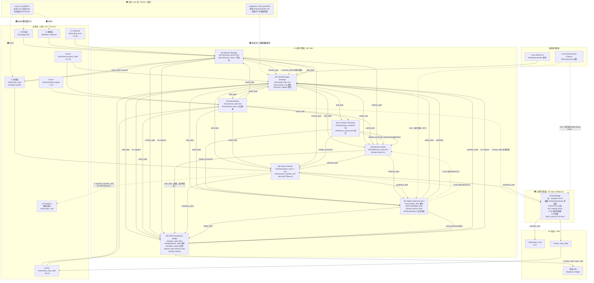

# TDL Kernel · 8 模块设计 + 进度联动 · Overview

| 属性 | 值 |
|---|---|
| 范围 | MASS L3 战术决策层 8 个 ROS2 native 模块（M1–M8）|
| 对应代码 | `src/l3_tdl_kernel/m{1..8}_*` colcon packages |
| 文档双轨说明 | 本目录是**模块设计导向**第二套文档；**任务开发导向**第一套在 `Phase 1/D{x.y}-*/`、`Phase 2/`、`Phase 3/`（按需建）。两套通过 `M{n}-progress.md` 中的 "Currently Implementing / Closed in / Blocks" D 任务联动表互联。|

---

## 8 模块全景

| M | 模块 | 职责 | 时间尺度 | 主 ROS topic | 当前实现 |
|---|---|---|---|---|---|
| M1 | ODD/Envelope Manager | 调度枢纽 + "当前安全语境"权威 | 长时（0.1–1 Hz）| `/l3/m1/odd_state` | 🟡 1669 LOC |
| M2 | World Model | 唯一权威世界视图 + COLREG 几何预分类 | 短时（10–50 Hz）| `/l3/m2/world_state` | 🟡 1860 LOC |
| M3 | Mission Manager | 航次计划、ETA、重规划触发 | 长时 | `/l3/m3/mission_goal` | 🟡 1488 LOC |
| M4 | Behavior Arbiter | IvP 多目标行为仲裁 | 中时（1–4 Hz）| `/l3/m4/behavior_plan` | 🔴 476 LOC + IvP solver；未发 SAT-2 |
| M5 | Tactical Planner | Mid-MPC + BC-MPC，输出 (ψ, u, ROT) | 中时 + 短时 | `/l3/m5/avoidance_plan` | 🟡 Mid-MPC 已修收敛；BC-MPC 未 launch |
| M6 | COLREGs Reasoner | Rule 推理（ODD-aware）| 中时 | `/l3/m6/colregs_constraint` | 🟡 976 LOC（Rule 5-19 真实）|
| M7 | Safety Supervisor | Doer-Checker Checker，SIL2 PATH-S | 短时 | `/l3/m7/safety_alert` | 🔴 HC 全死代码；无 veto 发布 |
| M8 | HMI/Transparency Bridge | 唯一对 ROC/船长说话的实体，SAT-1/2/3 | 实时（50–100 Hz）| `/sil/sat2_data` 等 12 个 | 🟡 C+++FastAPI 双进程；SAT stub 并行双发 |

**状态图例**：✅ 完整 / 🟡 部分 / 🔴 未做或核心缺失 / ⚫ 未验证

---

## 每模块文档结构

```
M{n}-XXX/
├── M{n}-spec.md      模块功能 + 接口契约 + 当前实现状态摘要（指回 Archive 全文）
└── M{n}-progress.md  D 任务联动：Closed in / Currently Implementing / Blocks 三栏表
```

**M{n}-spec.md** 不重写完整详设，只提炼"接口契约 / SIL 等级 / 关键 ADR / 当前 LOC + 真实 topic"四块要点 + 指针指向 `Archive/Old Modules/M{n}-*/01-detailed-design.md` 完整版（暂不复活成现役）。

**M{n}-progress.md** 是 D 任务联动表，PR 合并到对应 M 模块时更新：
- **Closed in D{x.y}**：该 D 任务已结束并产出此模块的某能力
- **Currently Implementing D{x.y}**：当前活跃 D 任务正在加码
- **Blocks D{x.y}**：本模块功能未到位会卡住的下游 D 任务

---

## 跨模块强约束（IDL 契约）

所有模块间消息强制：
- `stamp`（rclpp Time）
- `schema_version`（v3.0 D0.1 后强制）
- `confidence ∈ [0, 1]`（多源融合时携带）
- `rationale`（M8 SAT-2 汇聚时需要）

详见 [Architecture Design/MASS_ADAS_L3_TDL_架构设计报告.md](../Architecture%20Design/MASS_ADAS_L3_TDL_架构设计报告.md) §15 IDL 矩阵。

---

## 顶层架构决策（影响所有模块的 4 条不可让步项）

1. **ODD 是组织原则，不是监控模块** — M1 ODD 状态变化是行为切换的唯一权威源
2. **Doer-Checker 双轨** — M1–M6 是 Doer，M7 是 Checker，逻辑简化 ≥100× + 实现路径独立
3. **CMM 通过 SAT-1/2/3 接口对外可见** — 每模块实现 `current_state() / rationale() / forecast(Δt) + uncertainty()` 三调用，M8 聚合
4. **多船型 = Capability Manifest + PVA + 水动力插件**（Backseat Driver） — 决策核心零船型常量

---

## 系统数据流总图

> 图中颜色：白底=正常数据流；🔴 红边=断流（无发布者或 namespace 错位）；🟠 橙边=mock/创可贴拦截；虚线=设计目标（当前未实现）。SIL bridge 标注为"过渡创可贴层"——架构图中本不存在该节点，当前承载了本应在 L3 各模块的 COLAV + 回航控制逻辑。



---

## 跨模块 Topic Registry 总表

> 覆盖 A4000 实测 live topic 列表（2026-06-08 ground-truth）+ 设计目标 topic。  
> 现状色：🟢 连通 / 🔴 断流（无发布者或无订阅者）/ 🟡 namespace 错位 / 🟠 mock 拦截 / ⚪ 字段未填充 / ⚫ 未在 live list

### 一、边界层 topic（L1/L2/Fusion/L4）

| topic | msg_type | 发布者 | 订阅者 | 频率 | 现状 | 备注 |
|---|---|---|---|---|---|---|
| `/l1/voyage_task` | `VoyageTask` | L1（🟠 mock_l2_publisher）| M3 | 事件 | 🟠 mock 拦截 | `mock_l2_publisher.py:186-197`；mock 用 Trondheim 坐标 |
| `/l2/planned_route` | `PlannedRoute` | L2（🟠 mock）| M3, M5 | 事件/1 Hz | 🟠 mock 拦截 | 场景 YAML nominalRoute 或直线生成 |
| `/l2/speed_profile` | `SpeedProfile` | L2（🟠 mock）| M3, M5 | 事件/1 Hz | 🟠 mock 拦截 | mock 永远固定速度 |
| `/l2/replan_response` | `ReplanResponse` | L2（🟠 mock）| M3 | 事件 | 🟠 mock 拦截 | mock 永远返回 SUCCESS |
| `/fusion/own_ship_state` | `FilteredOwnShipState` | SIL bridge（中继 /sil/own_ship_state）| M1, M2 | ~50 Hz | 🟢 连通 | bridge:348-359 中继；外部 Fusion 在 SIL 中由 bridge 扮演 |
| `/fusion/tracked_targets` | `TrackedTargetArray` | SIL bridge（中继 TrackerMock 输出）| M2 | ~2 Hz | 🟠 mock 拦截 | bridge:739-740 将 cpa_m/tcpa_s 硬设 0.0 ⚠ |
| `/fusion/environment_state` | `EnvironmentState` | SIL bridge | M1, M2 | ~0.2 Hz | 🟢 连通 | EnvDisturbanceNode → bridge → fusion |
| `/l4/tracking_error` | `TrackingError` | L4（🔴 SIL 中未实现）| M3 | ~10 Hz | 🔴 断流 | M3 CurrentErrorMonitor 订阅但 L4 在 SIL 未部署 |

### 二、L3 内部 topic（M1–M8 核心）

| topic | msg_type | 发布者 | 订阅者 | 频率 | 现状 | 备注（file:line） |
|---|---|---|---|---|---|---|
| `/l3/m1/odd_state` | `ODDState` | M1 | M2,M3,M4,M5,M6,M7,M8 | 1 Hz + 事件 | 🟢 连通 ⚪ | `odd_envelope_manager_node.cpp`；zone 冻结 ZONE_A（C6）；schema=0 |
| `/l3/m1/mode_cmd` | `ModeCmd` | M1 | M4（及设计 M3/M5）| 事件 | 🟢→⚪ | M4 仅消费 MODE_EMERGENCY；DEGRADED/LIMITED 无人处理 |
| `/l3/m1/tor_request` | `ToRRequest` | M1 | M8 | 事件 | 🔴 断流 | `odd_envelope_manager_node.cpp`：发布者存在；但无消费者在 live 系统订阅 |
| `/l3/m2/world_state` | `WorldState` | M2 | M1,M3,M4,M5,M6,M7,M8 | 4 Hz | 🟢 连通 ⚪ | `world_model_node.cpp`；schema=0；cpa_m/tcpa_s 被 bridge+harness 清零 |
| `/l3/m2/threat_state` | `ThreatState` | 🔴 **无发布者** | bridge(设计), M6 | 事件/4 Hz | 🔴 断流 | `world_model_node.cpp:271-284` 仅建 3 个 publisher，无 ThreatState；bridge latch-release 条件1 永不触发 |
| `/l3/m3/mission_goal` | `MissionGoal` | M3 | M1,M4,M5,M8 | 0.5 Hz | 🟢 连通 ⚪ | `mission_manager_node.cpp`；speed_recommend_kn 恒 0；schema_version 未填 |
| `/l3/m3/mission_state` | `MissionState` | 🔴 **无发布者** | M1 | 0.5 Hz | 🔴 断流 | M3 源码无 publisher；M1 `odd_envelope_manager_node.cpp:459` 订阅但永收不到；MRC 类型选择饿死 |
| `/l3/m3/route_replan_request` | `RouteReplanRequest` | M3 | L2 | 事件 | 🟠 mock 拦截 | L2 是 mock，永返 SUCCESS |
| `/l3/m3/tor_request` | `ToRRequest` | M3 | M8 | 事件 | 🟢 连通 | 与 M1 tor_request 并列，M8 应聚合 |
| `/l3/m4/behavior_plan` | `BehaviorPlan` | M4 | M5,M7,bridge,M8 | 4 Hz | 🟢 连通 ⚪ | `behavior_arbiter_node.cpp`；M6 direction 字段被无视（T4 断流）；schema=0 |
| `/l3/m4/reactive_override_cmd` | `ReactiveOverrideCmd` | 🔴 无（M7 误订阅为心跳代理）| M7(watchdog) | 事件 | 🔴 断流 | M7 `safety_supervisor_node.cpp:62` 订阅作 M3 heartbeat 代理，实无真实发布者 |
| `/l3/m5/avoidance_plan` | `AvoidancePlan` | M5（🟡 namespace 错位）| M7,M8,bridge | 1–2 Hz | 🟡 namespace 错位 | `mid_mpc_node.cpp:79` 发 `/m5/avoidance_plan`；entrypoint.sh remap 修复；l3_pipeline.launch.py 无 remap → 断链 |
| `/l3/m6/colregs_constraint` | `COLREGsConstraint` | M6 | M4,M5,M7 | 2 Hz | 🟢 连通 ⚪ | `colregs_reasoner_node.cpp`；schema=0；primary_preferred_direction 被 M4 无视 |
| `/l3/m6/rule_assessment` | `RuleAssessment` | M6 | M4 | 事件 | 🟢→⚪ | 仅 Rule14 latch 发布；Rule13/15 缺失；msg 缺 schema_version/rationale 字段 |
| `/l3/m7/safety_alert` | `SafetyAlert` | M7 | M1,M8 | 事件 | 🟢 连通 ⚪ | `safety_supervisor_node.cpp:457-463`；schema=0；bridge 不订阅 → 无法硬门 actuator |
| `/l3/m7/heartbeat` | `Header` | M7 | M1,X-axis | 10 Hz | 🟢 连通 | 健康，A4000 实测 10 Hz |
| `/l3/checker/veto` | `CheckerVetoNotification` | 🔴 **无发布者（M7 应发但未实现）** | M7(仅 debug trace) | 事件 | 🔴 断流 | `safety_supervisor_node.hpp:68-71` 无 veto publisher；C1 CRITICAL（D3）|
| `/l3/m8/operator_state` | `OperatorState` | M8 | M1 | 事件 | 🟢 连通 ⚪ | `hmi_transparency_bridge_node.cpp`；role 硬编码 ROC |
| `/l3/m8/ui_state` | `UIState` | M8 | 前端（经 foxglove）| 50 Hz | 🔴 前端不订阅 | M8 正常发布；`useFoxgloveLive.ts` TOPIC_MAP 未包含该 topic |
| `/l3/m8/tor_request` | `ToRRequest` | M8 | M1 | 事件 | 🟢 连通 | TorProtocol 实现 |

### 三、SAT / FSM / 安全辅助 topic

| topic | msg_type | 发布者 | 订阅者 | 频率 | 现状 | 备注 |
|---|---|---|---|---|---|---|
| `/l3/sat/data` | `SATData` | M1,M2,M4,M6,M7（分别发）| M8 SAT 聚合器 | 10 Hz 各 | 🟢 连通 ⚪ | M8 rationale/chain 普遍为空串（CMM 字段上游未填） |
| `/l3/fsm_state` | `FsmState` | fsm_aggregator（Python）| bridge(仅 trace) | 事件 | 🔴 无门控用途 | `fsm_aggregator_node.py:125-126`；bridge 仅记录，不用于 actuator gate |
| `/l3/colregs_active` | — | 无确认发布者 | — | — | ⚫ 未知 | live 列表有但 ScoringNode 源码未确认 publisher |
| `/l3/diagnostics` | `DiagnosticArray` | 🟠 diagnostic_mock_publisher | M1 | 2 Hz | 🟠 mock 拦截 | `diagnostic_mock_publisher.py:89-110`；永远 OK，屏蔽 M1 降级检测 |
| `/l3/safety/concern` | `SafetyConcernEvent` | M1(W9), M4(IvP失败) | M7,M8 | 事件 | 🟢→⚪ | `SafetyConcernEvent.msg` 缺 schema_version/confidence/rationale 字段 |
| `/l3/reflex/activation` | `ReflexActivationNotification` | Y-axis（外部）| M1,M7 | 事件 | ⚫ Y-axis 未部署 | M1 bridge override 优先级 1 |
| `/l3/override/active` | `OverrideActiveSignal` | bridge | M1,M7,M8 | 事件 | 🟢 连通 | 人工接管信号链路正常 |
| `/l3/asdr/record` | `ASDRRecord` | M1,M2,M3,M4,M6,M7,M8 | ASDR 审计服务 | 2 Hz + 事件 | 🟢 连通 ⚪ | orchestrator ASDR MessageCache 未接 ROS2 订阅，cache 永空 |

### 四、SIL 层 topic（仿真+传感器+HMI 输出）

| topic | msg_type | 发布者 | 订阅者 | 频率 | 现状 | 备注 |
|---|---|---|---|---|---|---|
| `/sil/actuator_cmd` | `ActuatorCmd` | SIL bridge | L4/sim | 5 Hz | 🟢 连通 | **真正的控制输出**（bridge 创可贴执行） |
| `/sil/own_ship_state` | `SilOwnShipState` | ShipDynamicsNode（MMG/RK4）| bridge, M8 | 10 Hz | 🟢 连通 | 真实仿真 |
| `/sil/bridge_state` | — | bridge | — | 事件 | 🟢 连通 | — |
| `/sil/module_pulse` | — | 各模块心跳 | bridge | 周期 | 🟢 连通 | — |
| `/sil/sat2_data` | `SAT2Data` | M4（直发）+ M8 stub | 前端 | 4 Hz | 🔴 双发布者 + schema 错位 | C13：6元标量数组 vs HMI 期望 `IvpContribution[]`；M4 behavior_arbiter:70 + M8 stub 并行 |
| `/sil/sat3_data` | `SAT3Data` | M5 + M8 stub | 前端 | 1–2 Hz | 🔴 双发布者 + stub | BC-MPC 未 launch，stub 发空轨迹 |
| `/sil/sotif_metrics` | `SotifMetrics` | M7（stub_mode=true）| M8→前端 | 10 Hz | 🔴 schema 不匹配 + stub | C9/C14：`SotifMetrics.msg` 结构数组 vs HMI 扁平字段；stub_mode 永不关 |
| `/sil/m8_ui_state` | — | M8 bridge | 前端 | 50 Hz | 🔴 前端不订阅 | useFoxgloveLive.ts 无该 topic 订阅 |
| `/sil/radar_meas` | — | SensorMockNode | 🔴 无消费者 | 5 Hz | 🔴 断流 | `sensor_mock/node.py`；bridge 仅转发至 fusion，无 kernel 路径消费 |
| `/sil/ais_msg` | — | SensorMockNode | 🔴 无消费者 | 0.1 Hz | 🔴 断流 | AIS bridge 死代码，未 launch |
| `/sil/asdr_event` | — | orchestrator ASDR | 前端 | 事件 | 🔴 MessageCache 空 | `asdr_routes.py:58` cache 未接 ROS2 |
| `/sil/fault/*` | `FaultEvent` | FaultInjectionNode | 🔴 无 kernel 消费 | 事件 | 🔴 断流 | fault topic 无 kernel 消费者，注入无效 |
| `/sil/environment` | — | EnvDisturbanceNode | bridge | — | 🟢 连通 | Gauss-Markov 风扰真实 |

---

## 断流 / 异常 topic 速查表

> 仅列 🔴🟡🟠 状态 topic，供修复排优先级。链接指向对应模块 progress.md 和系统审计。

| 现状 | topic | 根因一句话 | 优先级 | 审计来源 |
|---|---|---|---|---|
| 🔴 无发布者 | `/l3/m2/threat_state` | `world_model_node.cpp` 仅建 3 个 publisher，无 ThreatState | P1 | 审计 T9 / bandaids contracts |
| 🔴 无发布者 | `/l3/m3/mission_state` | M3 源码从未建立该 publisher | P1 | 审计 T5 / bandaids contracts |
| 🔴 无发布者 | `/l3/checker/veto` | M7 HC 全死代码（`safety_supervisor_node.cpp:548-552`），C1 CRITICAL | P0 | 审计 C1/T1 |
| 🔴 无门控 | `/l3/m7/safety_alert` → bridge | bridge 无该订阅，M7 告警不拦截 actuator | P0 | 审计 C3/T1 |
| 🔴 BC-MPC 不存在 | `/m5/reactive_override_cmd` | BC-MPC 节点从不 launch（`m5_mid_mpc.launch.py`）| P2 | 审计 C7/T6 |
| 🔴 M3 无速度 | `/l3/m3/mission_goal` → speed_recommend_kn | M3 speed_recommend 恒 0（never assigned）| P1 | 审计 T5 |
| 🔴 前端不订阅 | `/l3/m8/ui_state` | useFoxgloveLive.ts TOPIC_MAP 仅 16 topic，未含 | P2 | 审计 T8 |
| 🔴 双发布者+schema | `/sil/sat2_data` | M4 直发 + M8 stub 并行；HMI 期望 `IvpContribution[]` vs 6元标量数组 | P2 | 审计 C10/C13 |
| 🔴 schema 不匹配 | `/sil/sotif_metrics` | `SotifMetrics.msg` 结构数组 vs HMI 扁平字段；stub_mode 永 true | P2 | 审计 C9/C14 |
| 🔴 无消费者 | `/sil/radar_meas` `/sil/ais_msg` | SensorMockNode 发布但无 kernel 路径接收 | P3 | 审计 sim |
| 🔴 无消费者 | `/sil/fault/*` | FaultInjectionNode 发布但无 kernel 消费，注入无效 | P3 | 审计 contracts |
| 🟡 namespace 错位 | `/l3/m5/avoidance_plan` | `mid_mpc_node.cpp:79` 发 `/m5/avoidance_plan`；仅 entrypoint.sh remap 救命 | P0 | 审计 C8 |
| 🟠 mock 拦截 | `/l1/voyage_task` `/l2/planned_route` `/l2/speed_profile` `/l2/replan_response` | `mock_l2_publisher.py` 合成全部，L2 是 mock | —（Phase 1 已知）| 审计 T11 |
| 🟠 mock 拦截 | `/l3/diagnostics` | `diagnostic_mock_publisher.py` 恒发 OK，屏蔽 M1 传感器降级 | P2 | 审计 T11 |
| 🟠 mock 拦截 | `/fusion/tracked_targets` cpa_m/tcpa_s | bridge:739-740 强制 0.0，M6 基于错误输入推理 | P1 | 审计 T9 |
| ⚪ CMM 字段空 | 全部模块出消息 | schema_version/confidence/rationale 普遍未填（A4000 实测 schema=0）| P1 | 审计 T3 |

**审计基准文档**：
- `docs/Doc From Claude/2026-06-08-m1-m8-systemwide-gap-audit.md` — 系统审计全文（158bba9d 版本，§0.2 含当前修正）
- 创可贴/mock/断流结构化清单已并入上方 Topic Registry 速查表；旧 `handoff/audit_slices/` 已删除，后续用 MemPalace 或审计正文追溯历史上下文。

---

## 修订

| 日期 | 变更 |
|---|---|
| 2026-05-20 | 初版（v3.2 重构时新建 TDL-Kernel 第二套文档树）|
| 2026-06-08 | 新增系统数据流总图（mermaid）+ 跨模块 Topic Registry 总表 + 断流速查表；依据 2026-06-08 系统审计 + A4000 live 实测 ground-truth |
