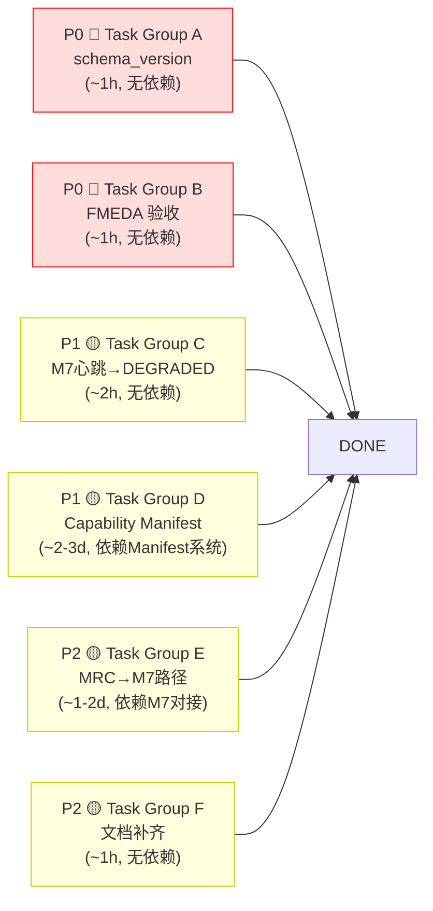

# M1 ODD/Envelope Manager — GAP 修复实施计划

> **For agentic workers:** REQUIRED SUB-SKILL: Use superpowers:subagent-driven-development (recommended) or superpowers:executing-plans to implement this plan task-by-task. Steps use checkbox (`- [ ]`) syntax for tracking.

**Goal:** 解决 M1 ODD/Envelope Manager 代码实现与设计规范之间的 6 项已知 GAP，按优先级分组实施

**架构方案：** P0 为阻塞级修复（代码改动小、可立即执行），P1/P2 涉及外部依赖或功能扩展

**代码路径：** `src/l3_tdl_kernel/m1_odd_envelope_manager/`
**消息路径：** `src/l3_tdl_kernel/l3_msgs/msg/`

---

## 文件结构

| 文件 | 操作 | 职责 |
|------|------|------|
| `src/l3_tdl_kernel/m1_odd_envelope_manager/src/odd_envelope_manager_node.cpp` | 修改 | schema_version 设置 + M7 心跳→状态转换 + MRC 路径发布 |
| `src/l3_tdl_kernel/m1_odd_envelope_manager/include/m1_odd_envelope_manager/odd_envelope_manager_node.hpp` | 修改 | 新增 MRC 请求发布器声明 |
| `src/l3_tdl_kernel/m1_odd_envelope_manager/src/parameter_loader.cpp` | 修改 | Capability Manifest 话题订阅 + 参数热替换 |
| `src/l3_tdl_kernel/m1_odd_envelope_manager/include/m1_odd_envelope_manager/parameter_loader.hpp` | 修改 | Manifest 订阅回调声明 |
| `src/l3_tdl_kernel/m1_odd_envelope_manager/config/m1_params.yaml` | 修改 | 添加 manifest_topic 配置项 |
| `src/l3_tdl_kernel/m1_odd_envelope_manager/src/mrc_trigger_logic.cpp` | 修改 | MRC 选择后增加发布调用 |
| `src/l3_tdl_kernel/m1_odd_envelope_manager/include/m1_odd_envelope_manager/mrc_trigger_logic.hpp` | 修改 | MRC 发布接口声明 |
| `docs/Design/Safety/FMEDA/M1-FMEDA-v0.1.md` | 检查 | D2.7 交付物验收（安全工程师外包） |
| `docs/Design/TDL-Kernel/M1-ODD-Envelope-Manager/M1-spec.md` | 修改 | GAP 状态更新 |

---

## 任务分解

---

## P0 🔴 — Task Group A：schema_version 修复（~1 小时，可立即执行）

### Task A-1: odd_state 和 mode_cmd 输出中设置 schema_version

**Files:**
- Modify: `src/l3_tdl_kernel/m1_odd_envelope_manager/src/odd_envelope_manager_node.cpp`

- [ ] **Step 1: 在 `on_odd_state_publish_tick()` 中设置 schema_version**

定位到 `on_odd_state_publish_tick()` 方法，在消息构造完成、publish 之前追加：

```cpp
// 在 publish 前设置 schema_version（GAP-2 修复）
msg.schema_version = 121;  // v1.2.1
```

**代码定位参考**：查找 `world_state_pub_->publish(msg)` 或 `odd_state_pub_->publish(msg)` 附近的代码块，找到 `l3_msgs::msg::ODDState msg;` 创建位置，在字段赋值块末尾添加。

- [ ] **Step 2: 在 `publish_mode_cmd()` 中设置 schema_version**

```cpp
// 在 publish 前设置 schema_version（GAP-2 修复）
msg.schema_version = 121;  // v1.2.1
```

- [ ] **Step 3: 编译验证**

```bash
cd /workspace && colcon build --packages-select m1_odd_envelope_manager --event-handlers console_direct+ 2>&1 | tail -20
```
Expected: "Summary: 1 package finished"

- [ ] **Step 4: 提交**

```bash
git add src/l3_tdl_kernel/m1_odd_envelope_manager/src/odd_envelope_manager_node.cpp
git commit -m "fix(m1): set schema_version=121 in odd_state and mode_cmd — closes GAP-2"
```

---

## P0 🔴 — Task Group B：FMEDA 表状态确认（~1 小时，验收性检查）

### Task B-1: FMEDA M1 v0.1 验收

**Files:**
- Check: `docs/Design/Safety/FMEDA/M1-FMEDA-v0.1.md`
- Check: `docs/Design/Safety/FMEDA/M1-fmeda-v1.0.md`

- [ ] **Step 1: 检查现有 FMEDA 文件**

```bash
ls -la docs/Design/Safety/FMEDA/M1*
cat docs/Design/Safety/FMEDA/M1-fmeda-v1.0.md | head -30
```

Expected: 至少 ≥11 条失效模式（D2.1 最低要求）

- [ ] **Step 2: 对比 D2.7 要求**

| 要求 | D2.1 交付 (v0.1) | D2.7 目标 (v1.0) |
|------|-------------------|------------------|
| 最小失效模式数 | 11 | 20 |
| 分类框架 | 4 类基础 | 4 类 + CCF + SPF/Latent |
| 子模块覆盖 | M1 5 个子模块 | 每子模块 ≥2 条 SPF |

- [ ] **Step 3: 如缺失则激活 D2.7**

如果当前 FMEDA 文件不存在或不满足 ≥20 条，联系安全工程师外包启动 D2.7。

```bash
# 在 D2.7 目录创建状态标记
echo "BLOCKED: awaiting D2.7 activation (safety engineer, outsourced)" > docs/Design/Phase\ 2/D2.7-hara-fmeda-m1/STATUS.md
```

- [ ] **Step 4: 提交状态更新**

```bash
git add docs/Design/Phase\ 2/D2.7-hara-fmeda-m1/STATUS.md
git commit -m "docs(m1): FMEDA D2.7 status — awaiting outsourced engineer — GAP-3 tracked"
```

---

## P1 🟡 — Task Group C：M7 心跳丢失 → 自动 DEGRADED 状态（~2 小时，可独立执行）

### Task C-1: 主循环添加 M7 超时 → health 状态转换

**Files:**
- Modify: `src/l3_tdl_kernel/m1_odd_envelope_manager/src/odd_envelope_manager_node.cpp`

- [ ] **Step 1: 定位主循环回调**

找到 `on_main_loop_tick()` 或类似的主循环函数（约 4 Hz），在其中 M7 心跳检测代码附近追加状态转换逻辑。

当前实现（在 `conformance_score_calculator.cpp` 中处理 M7 超时，仅做 score factor 0.7）：

```cpp
// 当前: M7 超时 → 仅 score factor = 0.7
// 改为: M7 超时 → score factor + health 状态转换
if (m7_heartbeat_timed_out()) {
    params_.timer_state.health = SystemHealth::DEGRADED;
    // 保留现有 score degradation logic
}
```

**代码定位参考**：搜索 `kM7AlertTimeoutS` 或 `M7` 在 `odd_envelope_manager_node.cpp` 中的使用位置。

- [ ] **Step 2: 编译验证**

```bash
cd /workspace && colcon build --packages-select m1_odd_envelope_manager --event-handlers console_direct+ 2>&1 | tail -20
```
Expected: "Summary: 1 package finished"

- [ ] **Step 3: 运行回归测试**

```bash
cd /workspace && colcon test --packages-select m1_odd_envelope_manager --event-handlers console_direct+ 2>&1 | tail -30
```
Expected: 全部 104 个测试 PASS（无 regression）

- [ ] **Step 4: 提交**

```bash
git add src/l3_tdl_kernel/m1_odd_envelope_manager/src/odd_envelope_manager_node.cpp
git commit -m "fix(m1): M7 heartbeat loss now sets health=DEGRADED — closes GAP-5"
```

---

## P1 🟡 — Task Group D：Capability Manifest 话题订阅（2–3 天，依赖 Manifest 系统就绪）

### Task D-1: ParameterLoader 扩展——添加 ROS2 话题订阅

**Files:**
- Modify: `src/l3_tdl_kernel/m1_odd_envelope_manager/include/m1_odd_envelope_manager/parameter_loader.hpp`
- Modify: `src/l3_tdl_kernel/m1_odd_envelope_manager/src/parameter_loader.cpp`

- [ ] **Step 1: 修改 header——添加 Manifest 订阅器声明**

在 `parameter_loader.hpp` 中添加：

```cpp
#include "l3_external_msgs/msg/capability_manifest.hpp"
#include "rclcpp/rclcpp.hpp"

class ParameterLoader {
public:
    // ... existing methods ...
    
    /// Manifest 更新回调
    void on_capability_manifest(
        const l3_external_msgs::msg::CapabilityManifest::SharedPtr msg);

    /// 检查 Manifest 是否已加载
    bool manifest_loaded() const { return manifest_loaded_; }

private:
    rclcpp::Subscription<l3_external_msgs::msg::CapabilityManifest>::SharedPtr manifest_sub_;
    bool manifest_loaded_ = false;
};
```

- [ ] **Step 2: 实现 Manifest 订阅回调**

在 `parameter_loader.cpp` 中：

```cpp
// 在构造函数或初始化函数中创建订阅
manifest_sub_ = node_->create_subscription<l3_external_msgs::msg::CapabilityManifest>(
    "/l3/manifest/capability",
    rclcpp::QoS(rclcpp::KeepLast(1)).transient_local(),
    std::bind(&ParameterLoader::on_capability_manifest, this, std::placeholders::_1));

void ParameterLoader::on_capability_manifest(
    const l3_external_msgs::msg::CapabilityManifest::SharedPtr msg) {
    RCLCPP_INFO(node_->get_logger(), "Capability Manifest received, reloading parameters");
    
    // 验证 Manifest 签名（存根）
    // TODO: D2.7 加入 CCS 签名验证
    
    // 更新 ParameterSet 中的 ROT_max 曲线
    params_.rot_max_curve.clear();
    for (const auto& point : msg->rot_max_curve) {
        params_.rot_max_curve.push_back({point.speed_kn, point.rot_max_deg_s});
    }
    
    // 更新 max_speed_kn
    params_.max_speed_kn = msg->max_speed_kn;
    
    manifest_loaded_ = true;
    RCLCPP_INFO(node_->get_logger(), 
        "Manifest: ROT_max_curve loaded (%zu points), max_speed=%.1f kn",
        params_.rot_max_curve.size(), params_.max_speed_kn);
}
```

- [ ] **Step 3: 编译验证**

```bash
cd /workspace && colcon build --packages-select m1_odd_envelope_manager --event-handlers console_direct+ 2>&1 | tail -30
```
Expected: "Summary: 1 package finished"

- [ ] **Step 4: 运行回归测试**

```bash
cd /workspace && colcon test --packages-select m1_odd_envelope_manager --event-handlers console_direct+ 2>&1 | tail -30
```
Expected: 全部 PASS

- [ ] **Step 5: 提交**

```bash
git add src/l3_tdl_kernel/m1_odd_envelope_manager/include/m1_odd_envelope_manager/parameter_loader.hpp
git add src/l3_tdl_kernel/m1_odd_envelope_manager/src/parameter_loader.cpp
git commit -m "feat(m1): Capability Manifest ROS2 topic subscription — closes GAP-1"
```

---

## P2 🟡 — Task Group E：MRC 路径经 M7 发布（1–2 天，依赖 M7 对接）

### Task E-1: 新增 mrc_request 话题发布

**Files:**
- Modify: `src/l3_tdl_kernel/m1_odd_envelope_manager/include/m1_odd_envelope_manager/mrc_trigger_logic.hpp`
- Modify: `src/l3_tdl_kernel/m1_odd_envelope_manager/src/mrc_trigger_logic.cpp`
- Modify: `src/l3_tdl_kernel/m1_odd_envelope_manager/include/m1_odd_envelope_manager/odd_envelope_manager_node.hpp`
- Modify: `src/l3_tdl_kernel/m1_odd_envelope_manager/src/odd_envelope_manager_node.cpp`

- [ ] **Step 1: 确定消息类型**

使用已有 `l3_msgs::msg::ModeCmd` 或已有 MRC 请求消息。推荐使用 `l3_msgs::msg::SafetyConcernEvent` 或新建简单的 MRC 请求字段。

- [ ] **Step 2: 在 node header 中声明发布器**

```cpp
// 在 odd_envelope_manager_node.hpp 中
rclcpp::Publisher<l3_msgs::msg::ModeCmd>::SharedPtr mrc_request_pub_;
```

- [ ] **Step 3: 在 setup_publishers() 中初始化**

```cpp
// 在 setup_publishers() 中
mrc_request_pub_ = create_publisher<l3_msgs::msg::ModeCmd>(
    "/l3/m1/mrc_request",
    rclcpp::QoS(rclcpp::KeepLast(5)).reliable().transient_local());
```

- [ ] **Step 4: 在 MRC 选择后发布**

在 `mrc_trigger_logic.cpp` 的 `execute_mrc()` 或 `select_mrc_type()` 被调用处：

```cpp
// MRC 类型选择后，发布到 M7
l3_msgs::msg::ModeCmd mrc_msg;
mrc_msg.stamp = this->now();
mrc_msg.schema_version = 121;
mrc_msg.mode = static_cast<uint8_t>(selected_mrc_type);  // MOORED=0, ANCHOR=1, etc.
mrc_msg.trigger_reason = "MRC triggered by " + trigger_reason;
mrc_msg.confidence = 1.0f;
mrc_msg.rationale = "MRC via M7 path per ADR #2";
mrc_request_pub_->publish(mrc_msg);
```

- [ ] **Step 5: 编译验证 + 回归测试**

```bash
cd /workspace && colcon build --packages-select m1_odd_envelope_manager --event-handlers console_direct+ 2>&1 | tail -30
cd /workspace && colcon test --packages-select m1_odd_envelope_manager --event-handlers console_direct+ 2>&1 | tail -30
```
Expected: 全部 PASS

- [ ] **Step 6: 提交**

```bash
git add src/l3_tdl_kernel/m1_odd_envelope_manager/src/odd_envelope_manager_node.cpp
git add src/l3_tdl_kernel/m1_odd_envelope_manager/include/m1_odd_envelope_manager/odd_envelope_manager_node.hpp
git add src/l3_tdl_kernel/m1_odd_envelope_manager/src/mrc_trigger_logic.cpp
git add src/l3_tdl_kernel/m1_odd_envelope_manager/include/m1_odd_envelope_manager/mrc_trigger_logic.hpp
git commit -m "feat(m1): publish mrc_request topic for M7 execution path — closes GAP-4"
```

---

## P2 🟡 — Task Group F：文档外话题清单补齐（~1 小时，文档修订）

### Task F-1: M1-spec.md 接口表补齐

**Files:**
- Modify: `docs/Design/TDL-Kernel/M1-ODD-Envelope-Manager/M1-spec.md`

- [ ] **Step 1: 在 M1-spec.md §2.1 上游订阅表中追加**

| 新编号 | 话题 | 来源 | 类型 | 频率 | 说明 |
|--------|------|------|------|------|------|
| S8 | `/l3/diagnostics` | 诊断系统 | `diagnostic_msgs::DiagnosticArray` | 1 Hz | 额外健康信息 |
| S9 | `/l3/m3/mission_state` | M3 Mission Manager | `l3_msgs::MissionState` | 事件 | 任务阶段变化 |
| S10 | `/override/active_signal` | L2/外部 | `l3_external_msgs::OverrideActiveSignal` | 事件 | Override 信号 |
| S11 | `/reflex/activation_notification` | Y-axis Reflex Arc | `l3_external_msgs::ReflexActivationNotification` | 事件 | Reflex 激活通知 |

- [ ] **Step 2: 提交**

```bash
git add docs/Design/TDL-Kernel/M1-ODD-Envelope-Manager/M1-spec.md
git commit -m "docs(m1): add undocumented subscription topics to interface table — GAP-6"
```

---

## 测试要求汇总

### 回归测试（M1 现有 7 个测试文件，104 个测试用例）

| 测试文件 | 已有测试数 | 预期 |
|----------|-----------|------|
| `test_odd_state_machine.cpp` | ~35 | 全部 PASS |
| `test_conformance_score.cpp` | ~19 | 全部 PASS |
| `test_tmr_tdl_estimator.cpp` | ~24 | 全部 PASS |
| `test_mrc_trigger_logic.cpp` | ~8 | 全部 PASS |
| `test_scoring_inputs_degraded.cpp` | ~6 | 全部 PASS |
| `test_m3_active_watchdog.cpp` | ~6 | 全部 PASS |
| `test_node_integration.cpp` | ~6 | 全部 PASS |

### 新增测试

| GAP | 新增测试 | 测试内容 | 通过标准 |
|-----|----------|----------|---------|
| GAP-2 | 无（现有集成测试自动覆盖） | schema_version 在输出消息中 ≠ 0 | 集成测试断言 |
| GAP-1 | +2 (集成) | Manifest 接收到 → 参数热替换 | 参数值更新确认 |
| GAP-5 | +2 (单元) | M7 超时 → health==DEGRADED | 状态测试 |
| GAP-4 | +2 (单元) | MRC 选择后 mrc_request 发布 | 消息字段断言 |

### 最终验收检查

```
□ 全部 104 个已有单元测试回归通过
□ schema_version=121 在 odd_state 和 mode_cmd 中确认
□ M7 心跳超时 → health 状态变更为 DEGRADED 验证
□ Capability Manifest 话题订阅端到端验证（如 Manifest 系统可用）
□ MRC 请求发布到 /l3/m1/mrc_request 验证
□ colcon build 无新增 warning
□ M1-spec.md 接口表已补齐所有订阅话题
```

---

## 执行顺序建议



**推荐优先执行**：
- **立即**：Task A (schema_version) + Task C (心跳→DEGRADED) — 代码改动小，验证明确，无外部依赖
- **本周**：Task D (Manifest 订阅) — 依赖 Manifest 系统就绪，可提前准备代码
- **规划中**：Task E (MRC→M7) — 需要 M7 端配合
- **穿插**：Task B (FMEDA 验收) + Task F (文档补齐)

---

## 修订记录

| 版本 | 日期 | 变更 |
|------|------|------|
| v1.0 | 2026-06-08 | 初版：对应 M1-spec.md v2.0 §7-8 全部 GAP 修复计划 |
