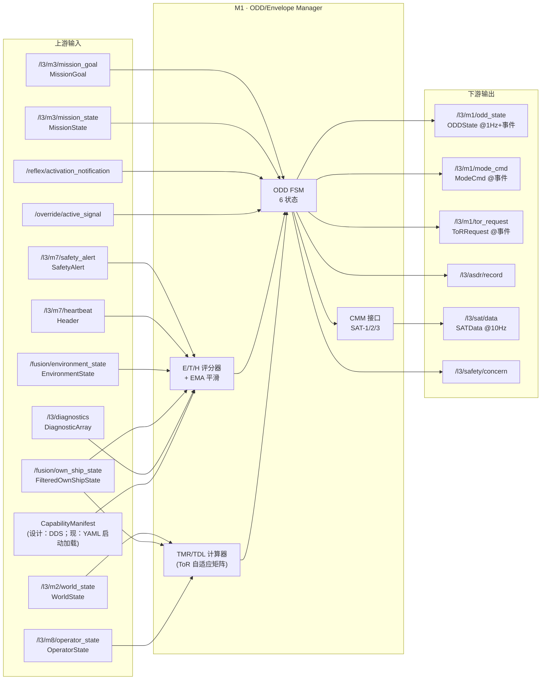
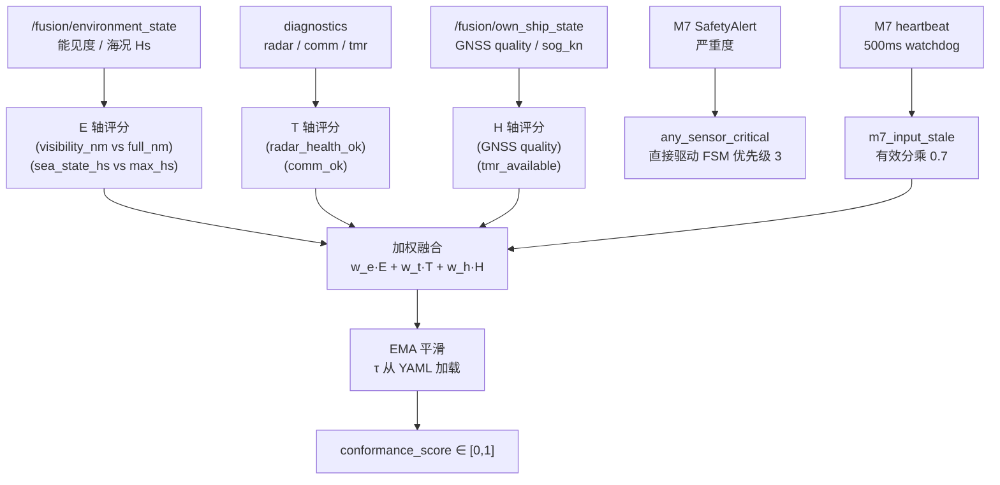
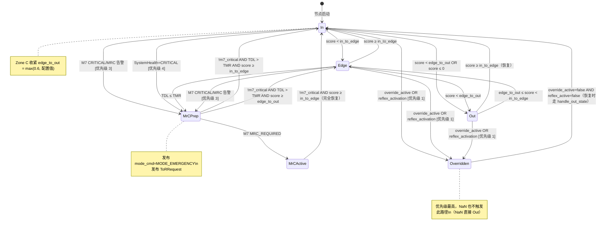

# M1 · ODD / Envelope Manager · Spec

> **定位声明**：本文是 M1 的**权威设计目标**，依据架构报告 §5（第五章）。描述应然的系统流程 / 功能 / 数据交互；**不含 SIL bridge 等过渡创可贴**（那些是实现层的临时偏离，记在 progress.md）。当前实现现状与偏离见同目录 [M1-progress.md](M1-progress.md)。

---

## 1. 模块身份

| 属性 | 值 |
|---|---|
| 模块代号 | **M1** |
| 职责一句话 | TDL 调度枢纽——唯一的"当前安全语境"权威，驱动所有下游模块行为切换 |
| 时间尺度 | 0.1–1 Hz（周期评估）；边界穿越时触发事件型发布 |
| SIL 等级 | SIL 2 / PATH-S |
| 实现路径分类 | PATH-S（严格路径，与 M7 代码独立，不共享头文件） |
| colcon 包 | `src/l3_tdl_kernel/m1_odd_envelope_manager` |
| 节点入口文件 | `src/l3_tdl_kernel/m1_odd_envelope_manager/src/odd_envelope_manager_node.cpp` |
| 架构报告章节 | §5（第五章）|

---

## 2. 职责与边界

### 2.1 本模块拥有的职责

- **ODD 包络权威**：唯一持续判断"当前所在 ODD 子域（A/B/C/D）"和"系统是否在包络内"的模块（ADR-1）
- **三轴 E/T/H 评分**：融合环境轴（能见度、海况）、技术轴（雷达/GNSS/通信健康度）、人因轴（TMR 可用性、ROC 状态）得出 conformance_score，EMA 平滑
- **六状态 FSM 驱动**：维护 In→Edge→Out/MrCPrep→MrCActive/Overridden 状态机；状态机是系统行为切换的唯一触发器
- **ToR 自适应矩阵**：根据运营商状态（桥楼当班/远程 ROC/餐厅/睡舱）动态计算 TMR，判断 TDL ≤ TMR 时发布 ToRRequest
- **MRC 控制**：触发最小风险操纵（Drift / Anchor / Heave-to）并向 M8 通知
- **CMM 三接口**：向 M8 提供 current_state()（SAT-1）/ rationale()（SAT-2）/ forecast(Δt)+uncertainty()（SAT-3）
- **ASDR 记录**：每次状态转移、周期性健康 tick 向决策日志发布记录

### 2.2 本模块**不负责**的职责（防越界）

| 不归 M1 的职责 | 正确归属 | 相关 ADR |
|---|---|---|
| CPA/TCPA 几何计算 | M2 World Model（唯一权威世界视图） | ADR-1 |
| 避碰 latch / arm / teardown 状态机 | M4 Behavior Arbiter + M5 Tactical Planner | ADR-1 |
| 60° 航向 clamp（避碰幅度约束） | M6 COLREGs Reasoner 或 M5 NLP 边界 | ADR-1 |
| 回航 XTE 控制器 | M5 BC-MPC 或 M3/M4 transit behavior | ADR-1 |
| 航向 PD / 速度 PI 控制 | L4 Guidance（L3 不输出控制信号） | 系统分层 |
| 船型常量硬编（LOA / 舵角极限等） | 从 Capability Manifest 读取，严禁硬编 | ADR-4 |

---

## 3. 接口契约（数据交互）

### 3.1 上游订阅

| topic | msg_type | 来源模块 | 期望频率 | 用途 |
|---|---|---|---|---|
| `/l3/m7/safety_alert` | `l3_msgs/SafetyAlert` | M7 Safety Supervisor | 事件 | severity 字段驱动 m7_critical / m7_mrc_required 标志 → FSM 优先级 3 |
| `/l3/m7/heartbeat` | `std_msgs/Header` | M7 Safety Supervisor | 10 Hz | M7 在线监控；500ms 超时设 m7_input_stale → 评分乘 0.7 |
| `/l3/m2/world_state` | `l3_msgs/WorldState` | M2 World Model | 10–50 Hz | 提取 target CPA/TCPA 用于 TmrTdlInputs（tcpa_min_s） |
| `/fusion/environment_state` | `l3_external_msgs/EnvironmentState` | 传感器融合 | ≥1 Hz | visibility_range_nm + wave_height_m → E 轴评分 |
| `/fusion/own_ship_state` | `l3_external_msgs/FilteredOwnShipState` | 传感器融合 | 10 Hz | GNSS quality（H 轴）+ sog_kn（ROT_max 插值） |
| `/l3/m8/operator_state` | `l3_msgs/OperatorState` | M8 HMI Bridge | 事件 | assumed_operator_state → ToR 矩阵 TMR 查表 |
| `/l3/m3/mission_goal` | `l3_msgs/MissionGoal` | M3 Mission Manager | ≥1 Hz | M3 ACTIVE + NOT_VALID 超时 watchdog → SafetyConcernEvent |
| `/l3/m3/mission_state` | `l3_msgs/MissionState` | M3 Mission Manager | ≥1 Hz | water_depth_m / in_anchorage_zone / is_moored → MRC 类型选择 |
| `/l3/diagnostics` | `diagnostic_msgs/DiagnosticArray` | ROS diagnostics | 2 Hz | 解析 radar / comm / tmr 状态 → T/H 轴评分 |
| `/reflex/activation_notification` | `l3_external_msgs/ReflexActivationNotification` | Y-axis Reflex Arc | 事件 | 设 reflex_active_ → FSM 优先级 1 → Overridden |
| `/override/active_signal` | `l3_external_msgs/OverrideActiveSignal` | Bridge override | 事件 | 设 override_active_ → FSM 优先级 1 → Overridden |
| CapabilityManifest（设计）| `l3_external_msgs/CapabilityManifest` | Parameter Database | 事件/启动 | ROT_max 曲线 / ODD 子域参数（当前由 YAML 替代）|

### 3.2 下游发布

| topic | msg_type | 消费模块 | 频率 | 关键字段 |
|---|---|---|---|---|
| `/l3/m1/odd_state` | `l3_msgs/ODDState` | M2–M8 全体 | 1 Hz + 事件型 | current_zone / auto_level / health / envelope_state / conformance_score / tmr_s / tdl_s / rot_max_current / allowed_zones / rationale / confidence |
| `/l3/m1/mode_cmd` | `l3_msgs/ModeCmd` | M4（及设计要求 M3/M5/M6）| 事件（状态转移时）| mode（NORMAL/DEGRADED/LIMITED/EMERGENCY）/ behavior_constraint / assumed_operator_state / confidence / rationale |
| `/l3/m1/tor_request` | `l3_msgs/ToRRequest` | M8（→ ROC/船长）| 事件（TDL≤TMR 时）| schema_version=121 / deadline_s / tdl_s / assumed_operator_state / reason / target_level / confidence / rationale / recommended_action |
| `/l3/asdr/record` | `l3_msgs/AsdrRecord` | ASDR 审计日志 | 0.5 Hz + 事件 | source_module / decision_type / decision_json |
| `/l3/sat/data` | `l3_msgs/SATData` | M8 HMI Bridge | 10 Hz | sat1（当前状态摘要）/ sat2（推理链+confidence）/ sat3（30s 预测+TDL/TMR+uncertainty） |
| `/l3/safety/concern` | `l3_msgs/SafetyConcernEvent` | M8 / 下游消费者 | 事件 | concern_type / severity / suggested_action（M3 stale watchdog 触发）|

### 3.3 CMM 契约

每条出消息必须包含以下四字段（ADR-3）：

| 消息 | stamp | schema_version | confidence ∈ [0,1] | rationale |
|---|---|---|---|---|
| ODDState | ROS 时钟，每 tick 更新 | 121（= v1.1）| 1.0（基线），评分低时应降级 | 当前 FSM 状态 + 分值原因字符串 |
| ModeCmd | 状态转移时刻 | 121 | 1.0 | FSM rationale() 字符串 |
| ToRRequest | TDL≤TMR 触发时刻 | 121 | 1.0 | "TDL(Xs) ≤ TMR(Ys) — …" |
| SATData | 10 Hz tick | 121 | 对应 sat1/sat2/sat3 各子字段 | 推理链字符串（sat2）|

---

### 3.4 IO 数据流图



---

## 4. 内部系统流程（功能实现）

### 4.1 子能力分解

1. **Capability Manifest 加载**：启动时从船型 YAML（设计目标：DDS 订阅）读取 ROT_max 曲线、ODD 子域速度上限、CPA 参数、停船距离等
2. **三轴评分（E/T/H）**：每 250ms 主循环计算 E-score、T-score、H-score，加权融合为 conformance_score，EMA 平滑抑制噪声抖动
3. **TMR/TDL 计算**：根据最近 TCPA（来自 M2 world_state）和运营商状态，从 ToR 自适应矩阵查 TMR；TDL 为当前距 ODD 失效的时间余量
4. **ODD FSM 步进**：每 250ms 调用 step()，综合 conformance_score / TDL / TMR / EventFlags / Zone×Health 输入，输出新状态
5. **状态转移动作**：状态变化时触发 publish_mode_cmd + publish_odd_state_event + publish_asdr_record
6. **ToR 触发**：TDL ≤ TMR 时强制 FSM→MrCPrep，发布 ToRRequest
7. **M3 Stale Watchdog**：M3 ACTIVE 且 task_validity ≠ VALID 超过阈值，发布 SafetyConcernEvent
8. **CMM 三接口输出**：10 Hz 发布 SATData（sat1=当前状态/sat2=推理链/sat3=30s 预测）

### 4.2 E/T/H 评分流水线



### 4.3 ODD FSM 状态机



**阈值说明**：
- `in_to_edge`：默认从 YAML 加载（例：0.7）
- `edge_to_out`：默认从 YAML 加载（例：0.4）；Zone C 下自动收紧至 0.6
- `stale_degradation_factor`：M2 stale 或 SystemHealth::Degraded 时乘此系数（例：0.8）

---

## 5. 关键算法 / 数据结构（设计层面）

### 5.1 三轴评分权重

```
conformance_score = w_e · E_score + w_t · T_score + w_h · H_score
```
权重 (w_e, w_t, w_h) 从 `l3_params.yaml` 加载，sum = 1.0，HAZID RUN-001 后校准（132 项 `[TBD-HAZID]`）。

### 5.2 ToR 自适应矩阵

| 运营商状态（assumed_operator_state）| TMR（s）|
|---|---|
| Bridge_OnDuty（桥楼当班）| 60 |
| ROC_Seated（ROC 已坐席）| 30 |
| Mess（餐厅）| 90 |
| Cabin（睡舱）| 120 |

（v3.0 设计值；HAZID RUN-001 后由 D2.1 回填）

### 5.3 ROT_max 插值

从 Capability Manifest 的 `rot_max_curve`（speed_kn → rot_max_deg_s 折线）插值得到当前 sog_kn 对应的 ROT 约束，写入 ODDState.rot_max_current。**严禁硬编 FCB 常量**（ADR-4）。

### 5.4 M3 Stale Watchdog 阈值

M3 ACTIVE 且 task_validity ≠ VALID 超过 `m3_route_stale_threshold_s`（YAML）时触发 SafetyConcernEvent，severity=0.6，concern_type=CONCERN_ODD_DEGRADED。

---

## 6. 降级路径

| 状态 | 应然行为 |
|---|---|
| DEGRADED（conformance_score 降）| FSM 仍在 In/Edge 区间，但 mode_cmd=MODE_DEGRADED 告知下游降格运行；M5 应收紧 CPA 阈值 |
| CRITICAL（SystemHealth::Critical）| 直接 FSM→MrCPrep；mode_cmd=MODE_EMERGENCY；发布 ToRRequest |
| OUT_of_ODD（FSM=Out）| 发布 mode_cmd=MODE_EMERGENCY；触发 MRC 流程（via M7 路径）；在 SafetyConcernEvent 中通知 M8 |
| MrCPrep | FSM 持续监控恢复条件；发布 ToRRequest；等待 M7 确认 MRC 类型 |
| MrCActive | 最小风险操纵执行中；仅在 !m7_critical 且 score ≥ in_to_edge 才恢复 In |
| Overridden | 完全退出，reflex/override 结束后恢复；期间所有评分循环仍在运行 |
| M7 心跳超时（>500ms）| m7_input_stale=true → effective_score × 0.7；RCLCPP_WARN 节流输出 |
| NaN score | 立即 FSM→Out；IEC 61508-3 Table C.1 守护 |

---

## 7. 顶层约束

| 约束 | 内容 | 来源 |
|---|---|---|
| ADR-1 | ODD 状态是**唯一**的行为切换权威源；M1 不得与 M7 共享头文件（PATH-S 代码独立性）| ADR-001 |
| ADR-2 | Doer-Checker 双轨：M7（Checker）逻辑须 ≤ Doer 1/100 复杂度；M1 VETO 路径须为硬门控 | ADR-002 |
| ADR-3 | CMM 三接口：M1 必须输出 current_state() / rationale() / forecast(Δt)+uncertainty() | ADR-003 |
| ADR-4 | Backseat Driver：决策核心零船型常量；ROT_max 等参数必须从 Capability Manifest 读取 | ADR-004 |
| RFC-001 | M5 N=18 时间步（TMR ≥ 60s Veitch 2024 要求）| RFC-001 |
| IMO MASS Code [R2] | 系统须能识别船舶是否在 OE 之外（MSC 110 §15）| [R2] |
| Rødseth 2022 [R8] | E/T/H 三轴 + TMR/TDL 量化框架 | [R8] |

---

## 8. 关联 D 任务

详见 [M1-progress.md](M1-progress.md) D 任务联动表。活跃任务：D2.7（FMEDA M1 ≥20 失效模式）；依赖 M1 完整化的：D3.5（ODD 4 子域热加载，132 `[TBD-HAZID]` 回填）。

---

## 9. 修订

| 日期 | 变更 |
|---|---|
| 2026-05-20 | 初版 spec stub（v3.2 重构时新建）|
| 2026-06-08 | 依架构报告 §5 + 系统审计（2026-06-08）重写 spec：剔除创可贴，补全 IO 数据流图 / FSM 状态机 / E/T/H 流水线 / 接口契约表 / CMM 四字段 / 降级路径 / 顶层约束 |
