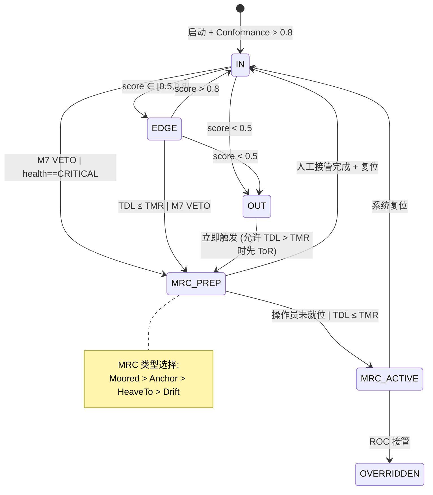

# M1 · ODD / Envelope Manager · 设计规范 + 实现现状

| 属性 | 值 |
|------|-----|
| 模块代号 | M1 |
| 文档版本 | v2.0 |
| 日期 | 2026-06-08 |
| 状态 | 设计规范 ✅ 实现现状分析中 🟡 |
| 架构基线 | 架构设计报告 v1.1.3-pre-stub §5 + §15.1 |
| 代码路径 | `src/l3_tdl_kernel/m1_odd_envelope_manager` |
| 消息定义 | `src/l3_tdl_kernel/l3_msgs/msg/` |
| SIL 等级 | **SIL 2**（核心安全功能：模式仲裁、ToR 触发） |
| 前版参考 | `M1-spec.md` v1.0 (2026-05-20) |

---

## 上篇：设计规范（Design Specification）

*本节为正式技术规范，供团队同事、CCS 审核使用。描述 M1 ODD/Envelope Manager 应当遵守的接口契约、内部架构和认证要求。*

---

### 1. 模块定位

#### 1.1 职责

M1 ODD/Envelope Manager 是 TDL 的**调度枢纽**和**"当前安全语境"的唯一权威**（ADR #1）。它负责：

1. **ODD 状态监控与判定** — 通过三轴（环境E/任务T/人员H）融合的 Conformance_Score 连续评估船舶是否在 Operational Envelope 内
2. **模式状态机** — 维护 IN / EDGE / OUT / MRC_PREP / MRC_ACTIVE / OVERRIDDEN 六态转换
3. **TMR/TDL 计算** — 实时计算最大操作员响应时间和系统自动化响应时间
4. **ToR/MRC 触发** — 当 TDL ≤ TMR 或 Conformance_Score < 0.5 时触发接管请求和 MRC 序列
5. **M7 VETO 仲裁** — Checker 权威高于 Doer，M7 可直接强制 M1 进入 MRC

**核心原则**（架构报告 §2.2 决策一）：
> "ODD 状态变化是驱动系统行为切换的唯一权威来源。任何单个模块的假设失效都能通过 M1 统一触发降级，避免级联失效。"

#### 1.2 子模块构成

```
M1 ODD/Envelope Manager
├── OddStateMachine          — 6 态 FSM：In/Edge/Out/MrcPrep/MrcActive/Overridden
├── ConformanceScoreCalculator — 三轴 E/T/H → 单值加权 + EMA 平滑 (τ=5s)
├── TmrTdlEstimator          — TMR 查表 + TDL 计算 (TCPA×0.6, comm, health)
├── MrcTriggerLogic          — MRC 类型选择 (Moored > Anchor > HeaveTo > Drift)
├── ParameterLoader          — Capability Manifest + YAML 参数加载
└── Main Node                — 定时器驱动, 4 Hz 主循环, 1 Hz ODD publish
```

#### 1.3 SIL 等级

| 路径 | SIL 等级 | 依据 |
|------|----------|------|
| ODD 模式仲裁 + MRC 触发 | **SIL 2** | IEC 61508 Route 1H, HFT=1 建议（M7 作为独立 Checker 通道）|
| Conformance_Score 计算 | SIL 2 | 决策依赖路径 |
| TMR/TDL 计算 | SIL 1 | 辅助计算，非安全关键 |
| Parameter Loading | SIL 1 | 启动时一次性加载 |

---

### 2. 接口契约

#### 2.1 上游订阅（输入）

| # | 话题 | 来源 | 类型 | 频率 | QoS | 内容 |
|---|------|------|------|------|-----|------|
| S1 | `/fusion/own_ship_state` | Multimodal Fusion NavFilter | `l3_external_msgs::FilteredOwnShipState` | 50 Hz | SensorDataQoS keep_last(2) | 本船位置·SOG·COG·speed→用于 TDL 安全边界估算 |
| S2 | `/l3/m2/world_state` | M2 World Model | `l3_msgs::WorldState` | 4–10 Hz | reliable keep_last(5) | TCPA_min → TDL 计算; 置信度 → 降级感知 |
| S3 | `/fusion/environment_state` | Multimodal Fusion | `l3_external_msgs::EnvironmentState` | 0.2 Hz | reliable transient_local keep_last(5) | visibility_nm, wave_height_m → E_score |
| S4 | `/l3/m7/safety_alert` | M7 Safety Supervisor | `l3_msgs::SafetyAlert` | 事件 | reliable keep_last(5) | M7 VETO → M1 强制 MrcPrep |
| S5 | `/l3/m8/operator_state` | M8 HMI Bridge | `l3_msgs::OperatorState` | 1 Hz | reliable keep_last(2) | assumed_operator_state → TMR 查表 |
| S6 | `/l3/m3/mission_goal` | M3 Mission Manager | `l3_msgs::MissionGoal` | 0.5 Hz | reliable keep_last(5) | 当前任务状态 → T_score 输入 |
| S7 | Parameter Database | Capability Manifest | `l3_external_msgs::CapabilityManifest` | 启动+变更 | reliable transient_local | ROT_max(u) 曲线, max_speed_kn |

¹ S7 频率为当前设计预期，外部 Manifest 系统对接时需最终确认。

**关键约束**：
- 所有输入消息必须携带 `stamp`（采样时间）、`confidence ∈ [0,1]`
- S1/S2 超时 > kWorldStateTimeoutS(5.0s) → TDL 乘 stale_degradation_factor
- S4 到达优先于任何 FSM 内部判断
- S5 空或超时 → TMR 回退到 `Bridge_Nearby` (60s)

#### 2.2 下游发布（输出）

| # | 话题 | → 目标 | 类型 | 频率 | QoS | 内容 |
|---|------|--------|------|------|-----|------|
| P1 | `/l3/m1/odd_state` | M2, M3, M4, M5, M6, M7, M8 | `l3_msgs::ODDState` | 1 Hz | reliable transient_local keep_last(10) | ODD 子域·健康·自主等级·conformance_score·TMR·TDL·schema_version·confidence·rationale |
| P2 | `/l3/m1/mode_cmd` | M4 Behavior Arbiter | `l3_msgs::ModeCmd` | 事件 | reliable keep_last(5) | 行为集约束·schema_version·confidence·rationale |
| P3 | `/l3/m1/tor_request` | M8 HMI Bridge | `l3_msgs::ToRRequest` | 事件 | reliable transient_local keep_last(5) | tor_deadline_s·operator_state·tdl_s·rationale |
| P4 | `/l3/sat/data` | M8 HMI Bridge | `l3_msgs::SATData` | 10 Hz | reliable keep_last(5) | SAT-1/2/3 透明性数据 |
| P5 | `/l3/asdr/record` | ASDR 黑匣子 | `l3_msgs::ASDRRecord` | event + 定期 | reliable transient_local keep_last(50) | 状态快照·异常事件 |

#### 2.3 P1 ODDState 消息结构

```idl
# ODDState.msg
# Per Architecture Report §15.2 ODD_StateMsg
uint16 schema_version  # 121 = v1.2.1 (D2.1)
builtin_interfaces/Time stamp

uint8 current_zone        # ODD_A=0|ODD_B=1|ODD_C=2|ODD_D=3
uint8 auto_level          # D2=0|D3=1|D4=2
uint8 envelope_state      # IN=0|EDGE=1|OUT=2|MRC_PREP=3|MRC_ACTIVE=4|OVERRIDDEN=5
uint8 health              # FULL=0|DEGRADED=1|CRITICAL=2

float32 conformance_score   # [0, 1]
float32 tmr_s               # 最大操作员响应时间（秒）
float32 tdl_s               # 系统自动化响应时间（秒）

float32 rot_max_current     # 当前速度下的最大转艏率（度/秒）
float32 confidence
string rationale

ODD_Zone[] allowed_zones   # 当前健康状态下允许的 ODD 子域
```

#### 2.4 P2 ModeCmd 消息结构

```idl
# ModeCmd.msg
uint16 schema_version
builtin_interfaces/Time stamp
uint8 mode                    # NORMAL=0|LIMITED=1|DEGRADED=2|EMERGENCY=3
string trigger_reason
float32 confidence
string rationale
```

#### 2.5 P3 ToRRequest 消息结构

```idl
# ToRRequest.msg
uint16 schema_version
builtin_interfaces/Time stamp
uint8 reason                  # ODD_EXIT=0|MANUAL_REQUEST=1|SAFETY_ALERT=2
float32 deadline_s            # 接管时间窗口（秒）
string operator_state         # "Bridge_OnDuty"|"Bridge_Nearby"|"ROC_Attended"|"Mess_Rest"|"Cabin_Sleep"
float32 tdl_s
string context_summary
float32 confidence
string rationale
```

---

### 3. 内部架构

#### 3.1 核心算法

##### 3.1.1 Conformance_Score 三轴融合

```
Conformance_Score(t) = w_E × E_score(t) + w_T × T_score(t) + w_H × H_score(t)

权重（初始值，待 HAZID 校准）:
  w_E = 0.4  — 环境条件最难干预
  w_T = 0.3  — 任务条件可通过减速/停航干预
  w_H = 0.3  — 人机责任可通过通信恢复改善

各轴评分:
  E_score: visibility_nm, sea_state_hs → 双线性插值 → [0,1]
  T_score: GNSS/Radar/Comm 健康状态 → 全绿=1.0 / 部分降质=0.6 / 关键=0.3
  H_score: tmr_available, comm_ok → 可用=1.0 / 不可用=0.5

EMA 平滑: score_filtered(t) = α × raw(t) + (1-α) × filtered(t-1)
  α = Δt / τ, τ = 5s [TBD-HAZID]

阈值:
  > 0.8 → IN
  0.5–0.8 → EDGE (预警)
  < 0.5 → OUT → MRC 序列
```

##### 3.1.2 TMR/TDL 实时计算

```
TMR = lookup_tor_matrix(assumed_operator_state)
  矩阵（YAML 可加载）:
    Bridge_OnDuty  → 30s
    Bridge_Nearby  → 60s
    ROC_Attended   → 60s
    Mess_Rest      → 90s
    Cabin_Sleep    → 120s

TDL = min(TCPA_min × 0.6, T_comm_ok, T_sys_health)

安全约束: TDL > TMR 必须在所有非 MRC 状态下成立
TDL ≤ TMR → 立即触发 tor_request + MRC 准备
```

##### 3.1.3 六态 FSM



#### 3.2 ODD 子域 × 健康状态合法组合

| AutoLevel | OddZone | SystemHealth | 许可 |
|-----------|---------|-------------|------|
| D4 | ODD_A only | Full only | ✅ |
| D3 | A, B, D | Full / Degraded | ✅ |
| D2 | ALL | ALL | ✅ |
| 任何 | 任何 | Critical | → MrcPrep 强制 |

---

### 4. 多船型参数化（Capability Manifest）

M1 通过 Capability Manifest 获取船型特定参数，禁止硬编码。

| 参数 | 用途 | Manifest 路径 |
|------|------|--------------|
| `rot_max_curve[]` | ROT_max(u) 速度-转艏率曲线 | `hydrodynamics.turning_radius_m` 等 |
| `max_speed_kn` | 速度上限 → TDL 安全边界 | `envelope.ood_a.max_speed_kn` |
| `tor_matrix` | TMR 自适应矩阵值（5 场景） | YAML 可加载参数，非 Manifest 强制 |

**约束**：
- Manifest 缺失时 M1 启动失败，不进 IN 状态（但当前实现允许 YAML fallback）
- ROT_max 严禁 hardcode（当前实现从 YAML 静态读取，待升级到真实 Manifest 订阅）

---

### 5. 降级行为

| 降级状态 | 触发条件 | M1 行为 |
|----------|----------|---------|
| **DEGRADED** | 任一传感器降质，Conformance_Score ∈ [0.5,0.8] | odd_state.health=DEGRADED；score × stale_factor；不触发 MRC |
| **CRITICAL** | 关键传感器失效 / M7 VETO 到达 | 直接 MrcPrep；odd_state.health=CRITICAL |
| **OUT_of_ODD** | Conformance_Score < 0.5 | TDL > TMR → 先 ToR → MrcPrep；TDL ≤ TMR → 直接 MrcActive |
| **Manifest 缺失** | Capability Manifest 未加载 | 应用 YAML fallback 参数（FCB 默认值）；不进 IN 状态 |
| **M7 VETO 到达** | SafetyAlert severity=CRITICAL | 立即 MrcPrep，不经过 FSM 判断 |
| **M7 心跳丢失** | >500ms 无 M7 heartbeat | score degradation factor 0.7；不自动进入 DEGRADED |
| **M2 输入 stale** | WorldState >5s 未更新 | Conformance_Score × stale_degradation_factor |
| **EV 输入 stale** | OwnShipState >2s 未更新 | T_score 下调 |

---

### 6. CCS 入级映射

| M1 子能力 | DNV-CG-0264 子功能 | 证据类型 |
|-----------|-------------------|----------|
| ODD 状态监控 + 模式切换 | **§4.6** Status and mode management | FSM 状态机测试报告 |
| 传感器健康聚合（T_score） | **§4.7** Sensor quality monitoring | 三轴评分测试 |
| ToR 请求 + MRC 触发 | **§4.8** Alarm management | ToR 序列测试 |
| 通信质量监控（H_score） | **§4.10** Communication management | 通信健康测试 |
| M7 VETO 仲裁 | **§2.5** Doer-Checker 双轨 | M7 心跳/告警集成测试 |

---

---

## 下篇：实现现状 + GAP 分析

*本节记录代码实际状态与设计规范的差距，供开发排期参考。*

---

### 7. 实现状态总览

| 子能力 | 设计要求 | 代码实际 (2026-06-08) | 状态 |
|--------|----------|----------------------|------|
| ROS2 节点 + 主循环 | 4 Hz 主循环, 1 Hz ODD publish | 4 Hz main loop, 1 Hz odd_state, 10 Hz SAT | ✅ |
| 六态 FSM | IN/Edge/Out/MrcPrep/MrcActive/Overridden | 已实现, 35 测试覆盖 | ✅ |
| Conformance_Score 三轴 | E/T/H 加权 + EMA (τ=5s) | 已实现, 19 测试, 含 NaN 保护 | ✅ |
| TMR/TDL 计算 | TCPA×0.6 + comm + health 取 min | 已实现, 24 测试 | ✅ |
| ToR 自适应矩阵 | 5 场景 (30/60/60/90/120s) | 已实现, YAML 可加载 | ✅ |
| M7 VETO 集成 | Safety_Alert → 强制 MrcPrep | 已实现, 优先于 FSM 判断 | ✅ |
| M7 心跳监控 | >500ms 超时 → 自动 DEGRADED | 实现 score factor 0.7, **非**状态转换 | 🟡 |
| MRC 类型选择 | Moored > Anchor > HeaveTo > Drift | 已实现, M7 可覆盖 | ✅ |
| TDL ≤ TMR → ToR + MRC | 安全约束触发 | 已实现, tor_request 发出 | ✅ |
| Schema_version | 强制 v1.2.1 | **代码未设置（始终为 0）** | 🔴 |
| Capability Manifest | ROS2 话题订阅, CCS 签名 | **YAML 静态加载**, 非 ROS2 话题订阅 | 🔴 |
| Manifest 缺失 → 不进 IN | 启动失败 | **YAML fallback, 不阻挠启动** | 🟡 |
| OUT→MRC 经 M7 路径 | MRC 通知 M7 执行 | **MRC 选择/记录但无发布到 M7** | 🟡 |
| FMEDA M1 表 | ≥20 失效模式 | **零证据** | 🔴 |
| tor_request topic | D2.1 新增 | 已实现 | ✅ |
| operator_state 订阅 | 来自 M8 | 已实现 | ✅ |
| 额外订阅(非设计) | /l3/diagnostics 等 | 存在非标准话题 | 🟢 |
| 104 个测试用例 | 覆盖 FSM/Score/TMR/MRC/集成 | 全部 PASS | ✅ |

**图例**：✅ 已实现 / 🟡 部分 / 🔴 未做或缺失 / ⚫ 未验证

---

### 8. 关键 GAP 详细分析

#### GAP-1 🔴 Capability Manifest 未通过 ROS2 话题订阅

| 方面 | 设计 | 现状 |
|------|------|------|
| Manifest 来源 | `l3_external_msgs::CapabilityManifest` 话题订阅（CCS 签名） | `m1_params.yaml` 静态 YAML 文件加载 |
| ROT_max 读取 | 船型可替换，Manifest 驱动 | 从 YAML 读 `rot_max_curve` 数组 |
| Manifest 缺失行为 | M1 启动失败，不进 IN | 正常启动，用 YAML fallback |

**影响**：无法实现"换船型换 Manifest"的多船型设计原则。YAML 可被任意修改，缺乏 CCS 签名验证链路。

**修复意见**：
1. 在 `parameter_loader.cpp` 中添加 `l3_external_msgs::CapabilityManifest` 话题订阅
2. 实现 Manifest 接收回调 → `ParameterSet` 热替换
3. Manifest 缺失 → M1 不进 IN 状态（需与启动流程协调）

#### GAP-2 🔴 schema_version 全链路为 0

**代码**：`odd_envelope_manager_node.cpp` 中 `on_odd_state_publish_tick()` 和 `publish_mode_cmd()` 未设置 `msg.schema_version`

**影响**：下游 M2/M4/M5/M6/M7/M8 无法做版本兼容检查。

**修复意见**：
```cpp
// 在 on_odd_state_publish_tick(): 设置 odd_state.schema_version
msg.schema_version = 121;  // v1.2.1

// 在 publish_mode_cmd(): 设置 mode_cmd.schema_version
msg.schema_version = 121;
```

#### GAP-3 🔴 FMEDA M1 安全表未实现

**设计要求**：D2.1 spec + M1-spec.md 要求 ≥20 失效模式，4 类基础（λSD/λSU/λDD/λDU）+ CCF 条目

**现状**：`docs/Design/Safety/FMEDA/` 目录下存在 `M1-fmeda-v1.0.md` 但仅有 11 个失效模式（D2.1 的 FMEDA v0.1），远未达 M1-spec.md 要求的 ≥20。

**影响**：CCS 中期意见会议（7/31）前须闭环。D2.7 由安全工程师外包但未启动。

**修复意见**：激活 D2.7（安全工程师外包），目标 DEMO-2 前完成。

#### GAP-4 🟡 OUT→MRC 未经 M7 路径

**设计要求**：架构报告 §5 + ADR #2 要求 MRC 执行须经过 M7 独立路径（M1 决定 "做什么"，M7 决定 "怎么做"）

**现状**：`mrc_trigger_logic.cpp` 中 MRC 类型被选择和日志记录，但**没有发布到 M7**。M7 不知道 M1 选择了哪个 MRC 类型。

**代码位置**：检查 `mrc_trigger_logic.cpp` 中 `select_mrc_type()` 的返回值——仅记录到 ASDR，不发布到 M7。

**修复意见**：
1. 新增 `/l3/m1/mrc_request` 话题（`l3_msgs::MRCRequest` 或复用 `l3_msgs::ModeCmd`）
2. 在 MRC 类型选择后 publish

#### GAP-5 🟡 M7 心跳丢失 → 应自动 DEGRADED 状态

**设计要求**：M7 心跳 >500ms 丢失 → M1 自动进入 DEGRADED 状态

**现状**：`conformance_score_calculator.cpp` 中 M7 心跳超时使用 score factor 0.7（乘法降级），而非 FSM 状态转换。状态机 `envelope_state` 不会自动变为 EDGE/DEGRADED。

**影响**：M7 丢失时下游 M4/M5/M6 不会收到 health_state 变化，仍按 FULL 状态运行。

**修复意见**：在 `odd_envelope_manager_node.cpp` 主循环中，M7 超时 → `set_health(SystemHealth::DEGRADED)` 而非仅调整 score。

#### GAP-6 🟡 未计划 / 文档外话题

| 话题 | 方向 | 设计文档中？ | 影响 |
|------|------|-------------|------|
| `/l3/diagnostics` | 发布 | 无 | 🟢 诊断信息，无直接影响 |
| `/l3/m3/mission_state` | 订阅 | 无 (有 mission_goal) | 🟢 额外信息源 |
| `/override/active_signal` | 订阅 | 架构报告 §5 提但未在 M1-spec.md | 🟢 已在代码中处理 |
| `/reflex/activation_notification` | 订阅 | 架构报告 §5 提但未在 M1-spec.md | 🟢 已在代码中处理 |

#### GAP-7 🟢 正面超额：测试覆盖率好

M1 有 104 个测试用例（7 个测试文件），覆盖了 FSM、Conformance_Score、TMR/TDL、MRC、watchdog、节点集成。这优于 M2 的测试覆盖率，属于正面超额。

---

### 9. 修复优先级总结

| 优先级 | GAP | 工作项 | 预计工作量 | 依赖 |
|--------|-----|--------|-----------|------|
| P0 🔴 | GAP-2: schema_version=0 | 2 处代码修复 | ~1h | 无 |
| P0 🔴 | GAP-3: FMEDA 表 | 激活 D2.7 安全工程师任务 | 外包 | 外部资源 |
| P1 🟡 | GAP-1: Capability Manifest | 添加 ROS2 话题订阅 + 回调 + 参数热替换 | 2–3d | Manifest 系统就绪 |
| P1 🟡 | GAP-5: M7 心跳 → 状态转换 | 主循环添加 set_health(DEGRADED) | ~2h | 无 |
| P2 🟡 | GAP-4: MRC 路径经 M7 | 新增 mrc_request topic + publish | 1–2d | M7 对接 |
| P2 🟡 | GAP-6: 文档外话题 | 更新 M1-spec.md 接口表 | ~1h | 文档修订 |

---

### 10. 修订记录

| 版本 | 日期 | 变更 |
|------|------|------|
| v1.0 | 2026-05-20 | 初版 spec stub |
| v2.0 | 2026-06-08 | 完整重写：上篇设计规范 + 下篇实现现状/GAP 分析 |
