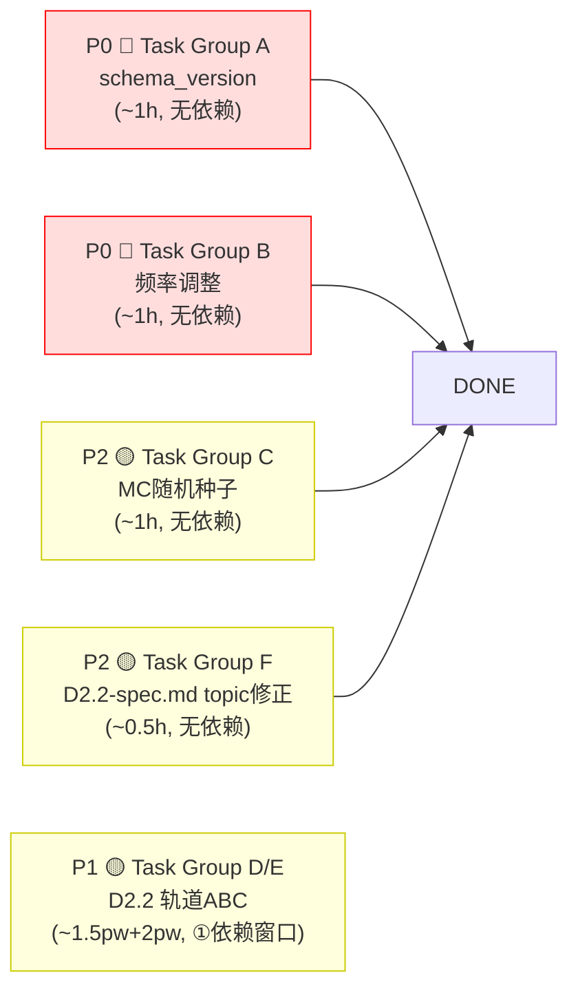

# M2 World Model — GAP 修复实施计划

> **For agentic workers:** REQUIRED SUB-SKILL: Use superpowers:subagent-driven-development (recommended) or superpowers:executing-plans to implement this plan task-by-task. Steps use checkbox (`- [ ]`) syntax for tracking.

**Goal:** 解决 M2 World Model 代码实现与设计规范之间的 7 项已知 GAP，按优先级分组实施

**架构方案：** 本计划按"独立可并行"原则组织，P0 为阻塞级修复（需先完成），P1/P2 可并行推进

**代码路径：** `src/l3_tdl_kernel/m2_world_model/`
**消息路径：** `src/l3_tdl_kernel/l3_msgs/msg/`
**文档路径：** `src/l3_tdl_kernel/l3_external_msgs/msg/`

---

## 文件结构

| 文件 | 操作 | 职责 |
|------|------|------|
| `src/l3_tdl_kernel/m2_world_model/src/world_state_aggregator.cpp` | 修改 | schema_version 设置 + aggregation_rate 参数修改 |
| `src/l3_tdl_kernel/m2_world_model/src/world_model_node.cpp` | 修改 | aggregation_rate_hz / sat_rate_hz 默认值调整 |
| `src/l3_tdl_kernel/m2_world_model/config/m2_params.yaml` | 修改 | 参数默认值更新 |
| `src/l3_tdl_kernel/m2_world_model/include/m2_world_model/world_state_aggregator.hpp` | 修改 | 添加 schema_version 常量 |
| `src/l3_tdl_kernel/m2_world_model/src/cpa_tcpa_calculator.cpp` | 修改 | MC 随机种子改为运行时随机 + 测试保留固定种子 |
| `src/l3_tdl_kernel/m2_world_model/test/test_cpa_tcpa_calculator.cpp` | 修改 | MC 固定种子测试用例 |
| `src/l3_tdl_kernel/m2_world_model/src/cpa_tcpa_calculator.cpp` | 修改（D2.2） | UKF 协方差链实现 |
| `src/l3_tdl_kernel/m2_world_model/include/m2_world_model/cpa_tcpa_calculator.hpp` | 修改（D2.2） | UKF 策略模式接口 |
| `src/l3_tdl_kernel/m2_world_model/src/enc_loader.cpp` | 修改（D2.2） | ENC exclusion_zones/tss_lanes 填充 |
| `src/l3_tdl_kernel/m2_world_model/include/m2_world_model/enc_loader.hpp` | 修改（D2.2） | ENC 查询接口扩展 |
| `src/l3_tdl_kernel/m2_world_model/src/world_state_aggregator.cpp` | 修改（D2.2） | intent_confidence / BRG/RNG / env sanity 填充 |
| `src/l3_tdl_kernel/m2_world_model/test/test_cpa_tcpa_calculator.cpp` | 修改（D2.2） | UKF 4 个测试用例 |
| `src/l3_tdl_kernel/m2_world_model/test/test_env_sanity_checker.cpp` | 修改（D2.2） | env sanity 7 项校验测试 |
| `src/l3_tdl_kernel/m2_world_model/test/test_world_state_end_to_end.cpp` | 修改（D2.2） | 端到端字段验证测试 |
| `docs/Design/TDL-Kernel/M2-World-Model/M2-spec.md` | 修改 | GAP 状态更新 + topic 名修正 |
| `docs/Design/SIL/v1.0-unified/` 相关 | 修改（P2） | D2.2 D2.2-spec.md 中 topic 名修正 |

---

## 任务分解

---

## P0 🔴 — Task Group A：schema_version 修复（1 人·小时，可独立执行）

### Task A-1: Header 常量定义

**Files:**
- Modify: `src/l3_tdl_kernel/m2_world_model/include/m2_world_model/world_state_aggregator.hpp`

- [ ] **Step 1: 在 WorldStateAggregator 类中添加 schema 版本常量**

```cpp
// 在 class WorldStateAggregator 的 public: 区段或 Config 结构体中追加
static constexpr uint16_t kSchemaVersion = 112;  // v1.1.2
```

- [ ] **Step 2: 编译验证**

Run: `cd /workspace && colcon build --packages-select m2_world_model --event-handlers console_direct+ 2>&1 | tail -20`
Expected: "Summary: 1 package finished"

- [ ] **Step 3: Commit**

```bash
git add src/l3_tdl_kernel/m2_world_model/include/m2_world_model/world_state_aggregator.hpp
git commit -m "fix(m2): add kSchemaVersion constant to WorldStateAggregator"
```

---

### Task A-2: compose_world_state() 中设置 schema_version

**Files:**
- Modify: `src/l3_tdl_kernel/m2_world_model/src/world_state_aggregator.cpp`

- [ ] **Step 1: 在 compose_world_state() 输出前追加 schema_version**

搜索 `compose_world_state` 方法，定位到消息对象创建位置。在最终 return 或 publish 之前追加：

```cpp
// WorldState 消息输出前设置 schema_version（GAP-2 修复）
ws.schema_version = kSchemaVersion;
```

具体位置在 `world_state_aggregator.cpp` 中 `compose_world_state()` 方法接近末尾处，大约在 `ws.confidence = aggregated_health_.aggregated;` 附近。若无此赋值行，则在 `WorldState ws;` 创建后立即设置。

- [ ] **Step 2: 编译验证**

```bash
cd /workspace && colcon build --packages-select m2_world_model --event-handlers console_direct+ 2>&1 | tail -20
```
Expected: "Summary: 1 package finished"

- [ ] **Step 3: 提交**

```bash
git add src/l3_tdl_kernel/m2_world_model/src/world_state_aggregator.cpp
git commit -m "fix(m2): set schema_version=112 in WorldState output — closes GAP-2"
```

---

## P0 🔴 — Task Group B：发布频率调整（1 人·小时，可独立执行）

### Task B-1: 调整 aggregation_rate_hz 和 sat_rate_hz 默认值

**Files:**
- Modify: `src/l3_tdl_kernel/m2_world_model/src/world_model_node.cpp`
- Modify: `src/l3_tdl_kernel/m2_world_model/config/m2_params.yaml`

- [ ] **Step 1: 检查参数加载函数**

检查 `world_model_node.cpp` 中的 `load_parameters()` 或参数声明函数（通常名为 `declare_m2_parameters` 或在 `load_parameters` 中），找到 `aggregation_rate_hz` 和 `sat_rate_hz` 的默认值声明位置。

若 YAML 配置覆盖了代码默认值，优先修改 YAML。

- [ ] **Step 2: 调整默认值**

在 `m2_params.yaml` 中（若存在）或参数声明函数中修改：

```yaml
# 修改前
aggregation_rate_hz: 4.0
sat_rate_hz: 1.0

# 修改后
aggregation_rate_hz: 6.0        # 从 4 Hz → 6 Hz（2 Hz 输入 × 3 次外推）
sat_rate_hz: 10.0               # 从 1 Hz → 10 Hz（匹配 M8 刷新率）
```

若参数在代码中以 `declare_parameter` 形式的默认值声明：

```cpp
// 在 declare_m2_parameters() 或类似函数中
declare_parameter("aggregation_rate_hz", 6.0);  // 原值 4.0
declare_parameter("sat_rate_hz", 10.0);         // 原值 1.0
```

- [ ] **Step 3: 文档注释追加**

在 `world_model_node.cpp` 最靠近聚合定时器创建处添加注释：

```cpp
// 频率说明：M2 聚合频率 = min(目标输入频率 × 3, 参数上限)
// 当前目标输入 2 Hz → 聚合频率 6 Hz（每周期 3 次插值/外推）
// 见 M2-spec.md §GAP-3
```

- [ ] **Step 4: 编译验证**

```bash
cd /workspace && colcon build --packages-select m2_world_model --event-handlers console_direct+ 2>&1 | tail -20
```
Expected: "Summary: 1 package finished"

- [ ] **Step 5: 提交**

```bash
git add src/l3_tdl_kernel/m2_world_model/src/world_model_node.cpp src/l3_tdl_kernel/m2_world_model/config/m2_params.yaml
git commit -m "fix(m2): adjust agg rate 4→6Hz, SAT rate 1→10Hz — closes GAP-3"
```

---

## P2 🟡 — Task Group C：MC 随机种子修复（1 人·小时，可独立执行）

### Task C-1: Monte Carlo 随机种子改为运行时随机

**Files:**
- Modify: `src/l3_tdl_kernel/m2_world_model/src/cpa_tcpa_calculator.cpp`

- [ ] **Step 1: 定位固定种子代码**

在 `propagate_monte_carlo_()` 方法中：

```cpp
// 当前代码（line ~248）
std::mt19937 gen(42);  // 固定种子
```

- [ ] **Step 2: 修改为运行时随机 + 保留确定性接口**

```cpp
// 修改后：使用 std::random_device 做运行时种子
std::random_device rd;
std::mt19937 gen(rd());
```

如需保留确定性测试能力，可以通过 Config 传入种子：

```cpp
// 在 CpaTcpaCalculator::Config 中已有或新增字段
// int32_t random_seed = 0;  // 0 = use random device, >0 = deterministic

// 实现：
std::mt19937 gen(cfg_.random_seed > 0
    ? static_cast<uint32_t>(cfg_.random_seed)
    : std::random_device{}());
```

若采用 Config 方式，同步修改 `world_model_node.cpp` 中创建 `CpaTcpaCalculator` 的地方，运行时传 `random_seed = 0`。

- [ ] **Step 3: 修改测试文件——测试用例保留固定种子**

**Files:**
- Modify: `src/l3_tdl_kernel/m2_world_model/test/test_cpa_tcpa_calculator.cpp`

在 Monte Carlo 相关测试中显式传入固定种子：

```cpp
// 在测试用例中显式传入固定种子以保证确定性
CpaTcpaCalculator::Config cfg;
cfg.method = CpaTcpaCalculator::UncertaintyMethod::MonteCarlo;
cfg.monte_carlo_samples = 1000;
cfg.random_seed = 42;  // 测试保留固定种子
auto calc = CpaTcpaCalculator(cfg);
```

- [ ] **Step 4: 编译验证 + 运行 MC 测试**

```bash
cd /workspace && colcon build --packages-select m2_world_model --event-handlers console_direct+ 2>&1 | tail -20
cd /workspace && colcon test --packages-select m2_world_model --event-handlers console_direct+ --ctest-args -R "cpa_tcpa" 2>&1 | tail -30
```
Expected: "TEST PASSED" for all MC tests

- [ ] **Step 5: 提交**

```bash
git add src/l3_tdl_kernel/m2_world_model/src/cpa_tcpa_calculator.cpp src/l3_tdl_kernel/m2_world_model/test/test_cpa_tcpa_calculator.cpp
git commit -m "fix(m2): runtime random seed for MC, deterministic seed in tests — closes GAP-5"
```

---

## P1 🟡 — Task Group D：D2.2 轨道 A UKF 协方差链（1.5 人·周，依赖 2026-06-16 窗口）

**前置条件**：D2.2-spec.md §3.1 详细设计已评审通过

### Task D-1: UKF 策略模式接口定义

**Files:**
- Modify: `src/l3_tdl_kernel/m2_world_model/include/m2_world_model/cpa_tcpa_calculator.hpp`

- [ ] **Step 1: 在 `CpaCovarianceMethod` 枚举中增加 `UKF_SIGMA`**

```cpp
enum class CpaCovarianceMethod {
    LINEAR,        // 现有：解析雅可比 + 线性传播（降级兜底）
    UKF_SIGMA,     // 新增：2n+1 sigma points
    CE_ADAPTIVE    // 预留接口：Phase 3 交叉熵自适应采样
};
```

- [ ] **Step 2: 在 Config 中增加 UKF 参数**

```cpp
struct Config {
    CpaCovarianceMethod covariance_method = CpaCovarianceMethod::UKF_SIGMA;
    // ... 现有字段 ...

    // UKF 参数（新增）
    double ukf_alpha = 1e-3;
    double ukf_beta = 2.0;
    double ukf_kappa = 0.0;
    double min_rel_speed_for_ukf_ms = 0.1;
};
```

- [ ] **Step 3: 声明 UKF 传播方法**

```cpp
// 新增声明
CpaUncertainty propagate_ukf_(
    const Eigen::Vector2d& rel_pos,
    const Eigen::Vector2d& rel_vel,
    const Eigen::Matrix2d& sigma_rel_pos,
    const Eigen::Matrix2d& sigma_rel_vel) const;
```

- [ ] **Step 4: 编译验证**

```bash
cd /workspace && colcon build --packages-select m2_world_model --event-handlers console_direct+ 2>&1 | tail -20
```
Expected: "Summary: 1 package finished"

- [ ] **Step 5: 提交**

```bash
git commit -m "feat(m2): UKF covariance method interface — D2.2 Track A"
```

---

### Task D-2: UKF 传播实现

**Files:**
- Modify: `src/l3_tdl_kernel/m2_world_model/src/cpa_tcpa_calculator.cpp`

- [ ] **Step 1: 实现 `propagate_ukf_()` 方法**

参考 `cpa_tcpa_calculator.cpp` 中已有 `propagate_monte_carlo_()` 和 `propagate_linear_()` 的格式，实现 UKF sigma points 传播：

```cpp
CpaUncertainty
CpaTcpaCalculator::propagate_ukf_(const Eigen::Vector2d& rel_pos,
                                  const Eigen::Vector2d& rel_vel,
                                  const Eigen::Matrix2d& sigma_rel_pos,
                                  const Eigen::Matrix2d& sigma_rel_vel) const {
    // 低速保护: ||rel_vel|| < min_rel_speed_for_ukf_ms → fallback 到位置协方差
    double rel_speed = rel_vel.norm();
    if (rel_speed < cfg_.min_rel_speed_for_ukf_ms) {
        double cpa_var = (rel_pos.transpose() * sigma_rel_pos * rel_pos).value();
        cpa_var /= rel_pos.squaredNorm() + 1e-12;
        return {std::sqrt(std::max(cpa_var, 0.0)),
                std::numeric_limits<double>::infinity()};
    }

    constexpr std::size_t n = 4;              // state dimension
    constexpr std::size_t n_sig = 2 * n + 1;  // 9 sigma points

    // 状态向量: [rel_x, rel_y, rel_vx, rel_vy]^T
    Eigen::Vector4d x_mean;
    x_mean << rel_pos(0), rel_pos(1), rel_vel(0), rel_vel(1);

    // 协方差: blkdiag(sigma_rel_pos, sigma_rel_vel)
    Eigen::Matrix4d P = Eigen::Matrix4d::Zero();
    P.block<2, 2>(0, 0) = sigma_rel_pos;
    P.block<2, 2>(2, 2) = sigma_rel_vel;

    // UKF 缩放参数
    const double alpha = cfg_.ukf_alpha;
    const double beta = cfg_.ukf_beta;
    const double kappa = cfg_.ukf_kappa;
    const double lambda = alpha * alpha * (static_cast<double>(n) + kappa) - static_cast<double>(n);
    const double n_plus_lambda = static_cast<double>(n) + lambda;

    // Cholesky 分解
    Eigen::Matrix4d P_scaled = n_plus_lambda * P;
    Eigen::LLT<Eigen::Matrix4d> llt(P_scaled);
    if (llt.info() != Eigen::Success) {
        // Cholesky 失败 → 回退线性传播
        return propagate_linear_(rel_pos, rel_vel, sigma_rel_pos, sigma_rel_vel);
    }
    Eigen::Matrix4d L = llt.matrixL();

    // 生成 sigma points
    Eigen::Matrix<double, n, n_sig> X_sig;
    X_sig.col(0) = x_mean;
    for (std::size_t i = 0; i < n; ++i) {
        X_sig.col(static_cast<Eigen::Index>(i + 1))     = x_mean + L.col(static_cast<Eigen::Index>(i));
        X_sig.col(static_cast<Eigen::Index>(i + 1 + n)) = x_mean - L.col(static_cast<Eigen::Index>(i));
    }

    // 权重
    double w_m0 = lambda / n_plus_lambda;
    double w_c0 = lambda / n_plus_lambda + (1.0 - alpha * alpha + beta);
    double w_i  = 1.0 / (2.0 * n_plus_lambda);

    // 通过 CPA 观测函数传播 sigma points
    constexpr std::size_t obs_dim = 2;
    Eigen::Matrix<double, obs_dim, n_sig> Y_sig;
    for (std::size_t i = 0; i < n_sig; ++i) {
        Eigen::Vector2d rp = X_sig.block<2, 1>(0, static_cast<Eigen::Index>(i));
        Eigen::Vector2d rv = X_sig.block<2, 1>(2, static_cast<Eigen::Index>(i));

        double rss = rv.squaredNorm();
        double cpa, tcpa;
        if (rss < 1e-12) {
            cpa = rp.norm();
            tcpa = 0.0;
        } else {
            tcpa = -rp.dot(rv) / rss;
            if (tcpa < 0.0) {
                cpa = rp.norm();
                tcpa = 0.0;
            } else {
                cpa = (rp + rv * tcpa).norm();
            }
        }
        Y_sig(0, static_cast<Eigen::Index>(i)) = cpa;
        Y_sig(1, static_cast<Eigen::Index>(i)) = tcpa;
    }

    // 加权均值和协方差
    Eigen::Vector2d y_mean = w_m0 * Y_sig.col(0);
    for (std::size_t i = 1; i < n_sig; ++i) {
        y_mean += w_i * Y_sig.col(static_cast<Eigen::Index>(i));
    }

    Eigen::Matrix2d P_yy = Eigen::Matrix2d::Zero();
    Eigen::Vector2d d0 = Y_sig.col(0) - y_mean;
    P_yy += w_c0 * d0 * d0.transpose();
    for (std::size_t i = 1; i < n_sig; ++i) {
        Eigen::Vector2d d = Y_sig.col(static_cast<Eigen::Index>(i)) - y_mean;
        P_yy += w_i * d * d.transpose();
    }

    return {std::sqrt(std::max(P_yy(0, 0), 0.0)),
            std::sqrt(std::max(P_yy(1, 1), 0.0))};
}
```

- [ ] **Step 2: 在 `compute()` 方法中添加 UKF 分支**

在 `compute()` 方法中，在不确定度传播段添加条件分支：

```cpp
CpaUncertainty unc{0.0, 0.0};
switch (cfg_.covariance_method) {
    case CpaCovarianceMethod::LINEAR:
        unc = propagate_linear_(rel_pos, rel_vel, sigma_rel_pos, sigma_rel_vel);
        break;
    case CpaCovarianceMethod::UKF_SIGMA:
        unc = propagate_ukf_(rel_pos, rel_vel, sigma_rel_pos, sigma_rel_vel);
        break;
    case CpaCovarianceMethod::CE_ADAPTIVE:
        // Phase 3 placeholder — 保守默认值
        unc = {50.0, 10.0};
        break;
}
```

- [ ] **Step 3: 编译验证**

```bash
cd /workspace && colcon build --packages-select m2_world_model --event-handlers console_direct+ 2>&1 | tail -30
```
Expected: "Summary: 1 package finished", 无编译错误

- [ ] **Step 4: 运行 UKF 测试**

```bash
cd /workspace && colcon test --packages-select m2_world_model --event-handlers console_direct+ --ctest-args -R "cpa_tcpa" 2>&1 | tail -30
```
Expected: 所有 4 个 UKF 测试 + 原有 12 个测试全部 PASS

- [ ] **Step 5: 提交**

```bash
git add src/l3_tdl_kernel/m2_world_model/src/cpa_tcpa_calculator.cpp
git add src/l3_tdl_kernel/m2_world_model/include/m2_world_model/cpa_tcpa_calculator.hpp
git commit -m "feat(m2): UKF sigma-points CPA covariance propagation — D2.2 Track A done"
```

---

### Task D-3: UKF 单元测试（4 测试用例）

**Files:**
- Create/Modify: `src/l3_tdl_kernel/m2_world_model/test/test_cpa_tcpa_calculator.cpp`

- [ ] **Step 1: 添加 UKF 测试用例**

```cpp
// 在现有 test_cpa_tcpa_calculator.cpp 末尾追加

#include <gmock/gmock.h>

using ::testing::DoubleNear;
using ::testing::AllOf;

// UKF 测试 1: 对遇场景 — 两船相对速度叠加
TEST(CpaTcpaCalculatorUkf, HeadOn) {
    CpaTcpaCalculator::Config cfg;
    cfg.covariance_method = CpaTcpaCalculator::CpaCovarianceMethod::UKF_SIGMA;
    cfg.ukf_alpha = 1e-3;
    CpaTcpaCalculator calc(cfg);

    // 本船北向 10 kn, 目标南向 10 kn（相对速度 ~20 kn）
    OwnShipSnapshot own;
    own.longitude_deg = 120.0;
    own.latitude_deg = 30.0;
    own.heading_deg = 0.0;
    own.sog_kn = 10.0;
    own.cog_deg = 0.0;
    own.u_water = 10.0 * 0.514444;
    own.v_water = 0.0;
    own.current_speed_kn = 0.0;
    own.current_direction_deg = 0.0;
    own.covariance = Eigen::Matrix<double, 6, 6>::Identity() * 0.01;

    TargetSnapshot tgt;
    tgt.latitude_deg = 30.01;
    tgt.longitude_deg = 120.0;
    tgt.sog_kn = 10.0;
    tgt.cog_deg = 180.0;
    tgt.heading_deg = 180.0;
    tgt.covariance = Eigen::Matrix<double, 3, 3>::Identity() * 0.01;

    auto result = calc.compute(own, tgt, OddZone::A);

    ASSERT_TRUE(result.has_value());
    // CPA 应为 0（对遇），TCPA > 0
    EXPECT_NEAR(result->cpa_m, 0.0, 10.0);
    EXPECT_GT(result->tcpa_s, 0.0);
    // 不确定度应为正有限值
    EXPECT_GT(result->uncertainty.cpa_sigma_m, 0.0);
    EXPECT_LT(result->uncertainty.cpa_sigma_m, 500.0);
}

// UKF 测试 2: 追越场景 — 相对速度小
TEST(CpaTcpaCalculatorUkf, Overtaking) {
    CpaTcpaCalculator::Config cfg;
    cfg.covariance_method = CpaTcpaCalculator::CpaCovarianceMethod::UKF_SIGMA;
    CpaTcpaCalculator calc(cfg);

    // 本船北向 18 kn, 目标北向 10 kn
    OwnShipSnapshot own;
    own.longitude_deg = 120.0;
    own.latitude_deg = 30.0;
    own.heading_deg = 0.0;
    own.sog_kn = 18.0;
    own.cog_deg = 0.0;
    own.u_water = 18.0 * 0.514444;
    own.v_water = 0.0;
    own.covariance = Eigen::Matrix<double, 6, 6>::Identity() * 0.01;

    TargetSnapshot tgt;
    tgt.latitude_deg = 30.005;
    tgt.longitude_deg = 120.0;
    tgt.sog_kn = 10.0;
    tgt.cog_deg = 0.0;
    tgt.covariance = Eigen::Matrix<double, 3, 3>::Identity() * 0.01;

    auto result = calc.compute(own, tgt, OddZone::A);

    ASSERT_TRUE(result.has_value());
    EXPECT_GT(result->cpa_m, 0.0);      // 横向偏移为 0，CPA 应为 0
    EXPECT_NEAR(result->cpa_m, 0.0, 5.0);
    EXPECT_GT(result->uncertainty.cpa_sigma_m, 0.0);
}

// UKF 测试 3: 交叉场景 — 角度不确定性
TEST(CpaTcpaCalculatorUkf, Crossing) {
    CpaTcpaCalculator::Config cfg;
    cfg.covariance_method = CpaTcpaCalculator::CpaCovarianceMethod::UKF_SIGMA;
    CpaTcpaCalculator calc(cfg);

    // 本船北向 12 kn, 目标正东 12 kn
    OwnShipSnapshot own;
    own.longitude_deg = 120.0;
    own.latitude_deg = 30.0;
    own.heading_deg = 0.0;
    own.sog_kn = 12.0;
    own.cog_deg = 0.0;
    own.u_water = 12.0 * 0.514444;
    own.v_water = 0.0;
    own.covariance = Eigen::Matrix<double, 6, 6>::Identity() * 0.01;

    TargetSnapshot tgt;
    tgt.latitude_deg = 30.005;
    tgt.longitude_deg = 120.005;
    tgt.sog_kn = 12.0;
    tgt.cog_deg = 90.0;
    tgt.covariance = Eigen::Matrix<double, 3, 3>::Identity() * 0.01;

    auto result = calc.compute(own, tgt, OddZone::A);

    ASSERT_TRUE(result.has_value());
    EXPECT_GT(result->cpa_m, 0.0);
    EXPECT_GT(result->uncertainty.cpa_sigma_m, 0.0);
}

// UKF 测试 4: 低速保护 — rel_vel < 0.1 m/s
TEST(CpaTcpaCalculatorUkf, LowSpeedFallback) {
    CpaTcpaCalculator::Config cfg;
    cfg.covariance_method = CpaTcpaCalculator::CpaCovarianceMethod::UKF_SIGMA;
    cfg.min_rel_speed_for_ukf_ms = 0.1;
    CpaTcpaCalculator calc(cfg);

    // 本船和目标几乎同向同速
    OwnShipSnapshot own;
    own.longitude_deg = 120.0;
    own.latitude_deg = 30.0;
    own.heading_deg = 0.0;
    own.sog_kn = 0.5;
    own.cog_deg = 0.0;
    own.u_water = 0.5 * 0.514444;
    own.v_water = 0.0;
    own.covariance = Eigen::Matrix<double, 6, 6>::Identity() * 0.01;

    TargetSnapshot tgt;
    tgt.latitude_deg = 30.0001;
    tgt.longitude_deg = 120.0;
    tgt.sog_kn = 0.5;
    tgt.cog_deg = 0.0;
    tgt.covariance = Eigen::Matrix<double, 3, 3>::Identity() * 0.01;

    auto result = calc.compute(own, tgt, OddZone::A);

    ASSERT_TRUE(result.has_value());
    // 低速保护应使 TCPA = ∞ (inf)
    EXPECT_TRUE(std::isinf(result->uncertainty.tcpa_sigma_s));
    EXPECT_GT(result->uncertainty.cpa_sigma_m, 0.0);
}
```

- [ ] **Step 2: 编译并运行全部 4 个 UKF 测试**

```bash
cd /workspace && colcon build --packages-select m2_world_model --event-handlers console_direct+ 2>&1 | tail -20
cd /workspace && colcon test --packages-select m2_world_model --event-handlers console_direct+ --ctest-args -R "cpa_tcpa" 2>&1 | tail -30
```
Expected: 4 个 UKF 测试全部 PASS

- [ ] **Step 3: 提交**

```bash
git add src/l3_tdl_kernel/m2_world_model/test/test_cpa_tcpa_calculator.cpp
git commit -m "test(m2): 4 UKF CPA covariance unit tests — D2.2 Track A tests"
```

---

## P1 🟡 — Task Group E：D2.2 轨道 C 字段补全 + 轨道 B ENC 填充（0.8+1.2 人·周，依赖 2026-06-16 窗口）

### Task E-1: intent_confidence 字段填充

**Files:**
- Modify: `src/l3_tdl_kernel/m2_world_model/src/world_state_aggregator.cpp`

- [ ] **Step 1: 在 `compose_world_state()` 循环中添加 intent_confidence 计算**

在每目标填充循环中，根据 source_sensor 和 track_age 计算意图置信度：

```cpp
// 在 per-target 填充循环中添加
float32 compute_intent_confidence(const std::string& source_sensor,
                                   double track_age_s,
                                   bool behavior_matches_colreg) {
    float32 base;
    if (source_sensor == "ais")           base = 0.50f;
    else if (source_sensor == "radar")    base = 0.30f;
    else if (source_sensor == "fused")    base = 0.50f;  // AIS+radar 融合
    else                                  base = 0.30f;

    // 新目标降低置信度
    if (track_age_s < 30.0) {
        base = std::min(base, 0.10f);
    }

    // 行为与 COLREG 预期一致则提升
    if (behavior_matches_colreg) {
        base = std::min(base + 0.10f, 0.95f);
    }

    return std::clamp(base, 0.05f, 0.95f);
}
```

- [ ] **Step 2: 编译验证**

```bash
cd /workspace && colcon build --packages-select m2_world_model --event-handlers console_direct+ 2>&1 | tail -20
```
Expected: "Summary: 1 package finished"

- [ ] **Step 3: 提交**

```bash
git add src/l3_tdl_kernel/m2_world_model/src/world_state_aggregator.cpp
git commit -m "feat(m2): intent_confidence field population — D2.2 Track C"
```

---

### Task E-2: BRG/RNG 字段填充

**Files:**
- Modify: `src/l3_tdl_kernel/m2_world_model/src/world_state_aggregator.cpp`

- [ ] **Step 1: 在 per-target 循环中添加方位/距离计算**

```cpp
// 在 compose_world_state() 的 per-target 循环中，已有 rel_pos = target - own (ENU)
double brg_rad = std::atan2(rel_pos.x(), rel_pos.y());
double brg_deg = brg_rad * 180.0 / M_PI;
if (brg_deg < 0.0) brg_deg += 360.0;  // 归一化到 [0, 360)

target_msg.brg_deg = brg_deg;
target_msg.rng_m = rel_pos.norm();
```

- [ ] **Step 2: 编译验证**

```bash
cd /workspace && colcon build --packages-select m2_world_model --event-handlers console_direct+ 2>&1 | tail -20
```
Expected: "Summary: 1 package finished"

- [ ] **Step 3: 提交**

```bash
git add src/l3_tdl_kernel/m2_world_model/src/world_state_aggregator.cpp
git commit -m "feat(m2): BRG/RNG per-target field population — D2.2 Track C"
```

---

### Task E-3: ENC exclusion_zones / tss_lanes 填充

**Files:**
- Modify: `src/l3_tdl_kernel/m2_world_model/src/enc_loader.cpp`
- Modify: `src/l3_tdl_kernel/m2_world_model/include/m2_world_model/enc_loader.hpp`
- Modify: `src/l3_tdl_kernel/m2_world_model/src/world_state_aggregator.cpp`

- [ ] **Step 1: EncLoader 扩展接口——添加多边形查询方法**

在 `enc_loader.hpp` 中添加：

```cpp
/// 获取本船当前动态视界内的禁区多边形列表
/// @param own_pos 本船 ENU 位置
/// @param horizon_m 动态视界半径（米）
/// @return 禁区多边形列表（每个多边形为 GeoJSON Polygon）
std::vector<l3_msgs::msg::ZoneConstraint::_exclusion_zones_type::value_type>
get_exclusion_zones(const Eigen::Vector2d& own_pos, double horizon_m) const;

/// 获取本船所在 TSS 航道多边形
std::vector<l3_msgs::msg::ZoneConstraint::_tss_lanes_type::value_type>
get_tss_lanes(const Eigen::Vector2d& own_pos) const;
```

- [ ] **Step 2: EncLoader 实现**

在 `enc_loader.cpp` 中实现。核心逻辑：遍历预加载的多边形列表，筛选在动态视界内的多边形：

```cpp
std::vector<...> EncLoader::get_exclusion_zones(
    const Eigen::Vector2d& own_pos, double horizon_m) const {
    std::vector<...> result;
    if (!metadata_loaded_) return result;

    const double horizon_sq = horizon_m * horizon_m;
    for (const auto& zone : exclusion_zone_polygons_) {
        // 粗略筛选：多边形的包围盒中心与自身距离 < horizon
        double dx = zone.centroid_east - own_pos.x();
        double dy = zone.centroid_north - own_pos.y();
        if (dx * dx + dy * dy <= horizon_sq) {
            result.push_back(zone.to_msg());
        }
    }
    return result;
}
```

- [ ] **Step 3: 在 WorldStateAggregator 中调用**

在 `compose_world_state()` 方法中，替换当前留空代码：

```cpp
// 原有: // tss_lanes 和 exclusion_zones 在 v1.0 中留空
// 改为:
if (enc_loader_ && enc_loader_->is_loaded()) {
    zone.tss_lanes = enc_loader_->get_tss_lanes(own_enu_pos);
    zone.exclusion_zones = enc_loader_->get_exclusion_zones(
        own_enu_pos, dynamic_horizon_radius_m);
    zone.min_water_depth_m = enc_loader_->get_min_depth(own_enu_pos);
}
```

- [ ] **Step 4: 编译验证 + 集成测试**

```bash
cd /workspace && colcon build --packages-select m2_world_model --event-handlers console_direct+ 2>&1 | tail -20
cd /workspace && colcon test --packages-select m2_world_model --event-handlers console_direct+ --ctest-args -R "enc|world_state" 2>&1 | tail -30
```
Expected: 全部 PASS

- [ ] **Step 5: 提交**

```bash
git add src/l3_tdl_kernel/m2_world_model/src/enc_loader.cpp src/l3_tdl_kernel/m2_world_model/include/m2_world_model/enc_loader.hpp src/l3_tdl_kernel/m2_world_model/src/world_state_aggregator.cpp
git commit -m "feat(m2): ENC exclusion_zones/tss_lanes population — D2.2 Track B"
```

---

## P2 🟡 — Task Group F：D2.2-spec.md 话题名修正（文档，0.5 人·时，可独立执行）

### Task F-1: D2.2-spec.md 话题名统一

**Files:**
- Modify: `docs/Design/Phase 2/D2.2-m2-world-model-enc/D2.2-spec.md`

- [ ] **Step 1: 搜索替换 topic 命名**

将 D2.2-spec.md §4.1 中的以下三个话题名修正为实际实现的值：

| 旧名 | 新名 |
|------|------|
| `/perception/targets` | `/fusion/tracked_targets` |
| `/nav/filtered_state` | `/fusion/own_ship_state` |
| `/perception/environment` | `/fusion/environment_state` |

同时修改 D2.2-spec.md §3.1 数据流图和相关引用。

- [ ] **Step 2: 提交**

```bash
git add docs/Design/Phase\ 2/D2.2-m2-world-model-enc/D2.2-spec.md
git commit -m "docs(D2.2): align topic names with actual implementation (/fusion/*)"
```

---

## 测试要求汇总

### 单元测试（C++）

| 测试文件 | 新增测试数 | 覆盖目标 | 通过标准 |
|----------|-----------|----------|---------|
| `test_cpa_tcpa_calculator.cpp` (UKF) | +4 | UKF 对遇/追越/交叉/低速保护 | 所有 4 个 PASS |
| `test_cpa_tcpa_calculator.cpp` (MC seed) | 0（修改） | MC 随机种子正确 | 现有 MC 测试 PASS |
| `test_env_sanity_checker.cpp` | +7 | visibility/Hs/current/staleness/zone跳变/跨源/降级 | 所有 7 个 PASS |
| `test_intent_confidence.cpp` | +5 | AIS-A/AIS-B/Radar/新目标/异常行为 | 所有 5 个 PASS |
| `test_enc_demo2_scenarios.cpp` | +5 (DEMO-2) | ENC 场景 exclusion_zones 非空 | 5 场景全部 PASS |

### 集成测试

| 测试文件 | 测试内容 | 通过标准 |
|----------|----------|---------|
| `test_world_state_end_to_end.cpp` | Mock 全上游输入 → 验证输出消息所有字段非空 | 新增 5 字段全部非空 |
| `test_enc_demo2_scenarios.cpp` | ≥5 个含浅滩/陆地场景配置 → exclusion_zones 非空 | 全部非空 |

### 回归测试

| 测试文件 | 已有测试数 | 预期 |
|----------|-----------|------|
| `test_cpa_tcpa_calculator.cpp` | ~12 | 全部 PASS（无 regression） |
| `test_encounter_classifier.cpp` | ~6 | 全部 PASS |
| `test_coord_transform.cpp` | ~4 | 全部 PASS |
| `test_world_model_node_smoke.cpp` | ~2 | 全部 PASS |
| `test_environment_degraded_path.cpp` | ~2 | 全部 PASS |

### 最终验收检查

```
□ 全部已有单元测试回归通过
□ 全部新增单元测试通过
□ WorldState 端到端测试：cpa_covariance / tcpa_covariance / intent_confidence / brg_deg / rng_m 全部非空
□ ZoneConstraint.exclusion_zones 用于含 ENC 场景非空
□ colcon build 无新增 warning
□ schema_version=112 已在 WorldState 消息中确认
□ aggregation_rate_hz=6.0, sat_rate_hz=10.0 参数生效
□ D2.2-spec.md topic 名已统一为 /fusion/*
```

---

## 执行顺序建议



**推荐优先执行 P0 的三组（A/B），因为它们无依赖、代码改动小、验证明确。**

---

## 修订记录

| 版本 | 日期 | 变更 |
|------|------|------|
| v1.0 | 2026-06-08 | 初版：对应 M2-spec.md §7-8 全部 GAP 修复计划 |
