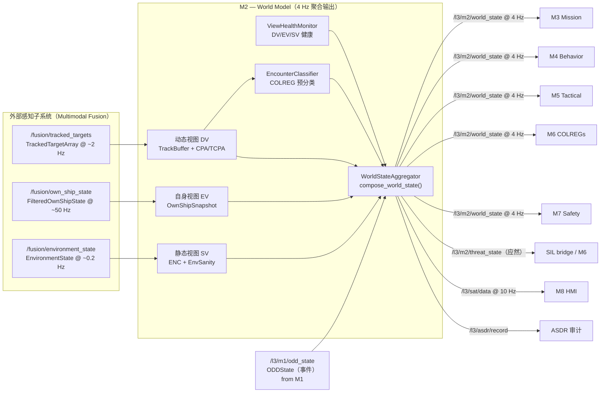
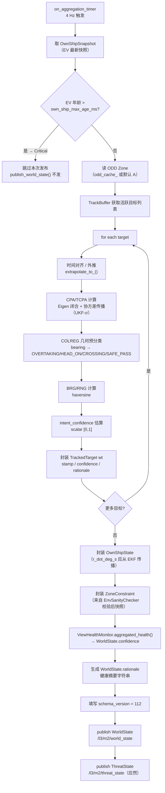
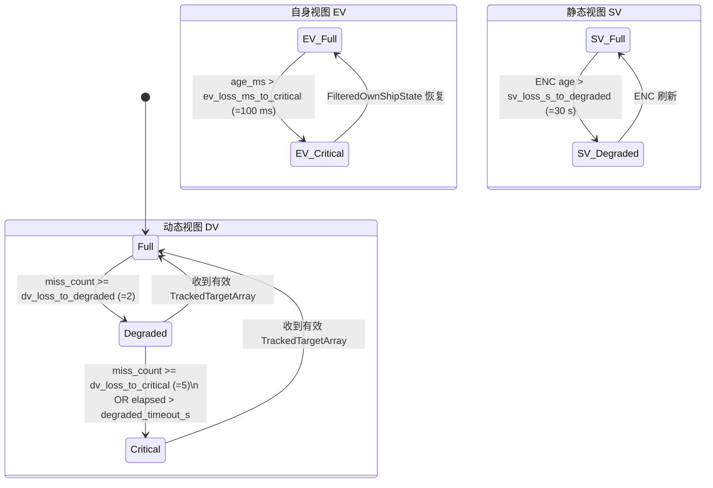

# M2 · World Model · 设计规格（Spec）

> **定位声明**：本文是 M2 的**权威设计目标**，依据架构报告 §6（`MASS_ADAS_L3_TDL_架构设计报告.md`）。
> 描述应然的系统流程 / 功能实现 / 数据交互；**不含 SIL bridge 等过渡创可贴**（那些是实现层的临时偏离，记在 progress.md）。
> 当前实现现状与偏离见同目录 `M2-progress.md`。

---

## 1. 模块身份

| 属性 | 值 |
|---|---|
| 模块代号 | M2 |
| 职责一句话 | L3 唯一权威世界视图：聚合 Nav Filter + Fusion 输出，计算 CPA/TCPA，执行 COLREG 几何预分类，向 M3/M4/M5/M6/M7 提供统一世界状态 |
| 时间尺度 | 短时，4 Hz 输出（内部 2 Hz 目标聚合 + 插值/外推）|
| SIL 等级 | PATH-D（感知融合，关键路径非核心安全功能）|
| 实现路径 | PATH-D |
| colcon 包 | `src/l3_tdl_kernel/m2_world_model` |
| 架构报告章节 | §6（第六章 M2 — World Model）|
| 节点入口文件 | `src/world_model_node.cpp`，类 `WorldModelNode`（`mass_l3::m2` 命名空间）|

---

## 2. 职责与边界

### 2.1 本模块拥有的职责

- **唯一世界视图发布者**：整合外部感知（TrackedTargetArray）、自船导航滤波（FilteredOwnShipState）、环境感知（EnvironmentState）三路输入为统一 `WorldState`，是 M3/M4/M5/M6/M7 的唯一世界知识来源
- **三视图维护**：
  - **动态视图（DV）**：目标跟踪列表，含 AIS/雷达融合，按 ODD 感知范围过滤
  - **自身视图（EV）**：自船位姿 / 速度 / 姿态，从 FilteredOwnShipState 高频快照获取
  - **静态视图（SV）**：ENC 图层约束（浅水区 / 禁区 / TSS / 窄水道）
- **CPA/TCPA 权威计算**：对每个跟踪目标用 C++ Eigen 计算闭合形式 CPA/TCPA，附协方差传播（UKF σ-点法），是系统中 CPA/TCPA 的唯一计算源
- **COLREG 几何预分类**：按架构报告 §6.3.1 的方位扇区规则，对每个目标分类为 OVERTAKING / HEAD_ON / CROSSING / SAFE_PASS（M6 基于此做最终规则推理）
- **ODD 感知阈值选择**：消费 M1 ODDState，按区域（A/B/C/D）选择 CPA 安全距离阈值
- **环境完整性校验（EnvSanity）**：对 EnvironmentState 字段做物理合理性 + 陈旧性检验，产出健康置信度乘数
- **三视图健康监控（ViewHealthMonitor）**：独立追踪 DV / EV / SV 的数据新鲜度与缺失情况，驱动 WorldState.confidence 字段
- **CMM 接口**（架构 ADR-3 强制）：
  - `current_state()` → WorldState.confidence + WorldState.rationale
  - `rationale()` → SAT 数据（/l3/sat/data），含 sat1 状态摘要 / sat2 推理链 / sat2.system_confidence
  - `forecast(Δt)+uncertainty()` → SAT3 预测（compute_sat3_forecast）
- **ASDR 记录**：向 /l3/asdr/record 发布周期性 + 事件性决策溯源记录
- **ThreatState 发布**（应然，当前缺失）：M2 应向 `/l3/m2/threat_state` 发布 ThreatState（含 cpa_status / target_relative_position / confidence / rationale），供 bridge / M6 的避碰解锁判断使用

### 2.2 明确不负责的（防越界）

| 不属于 M2 的职责 | 正确归属 | 相关 ADR |
|---|---|---|
| 避碰臂 / 锁存 / 解锁状态机 | M4/M5，通过 behavior_plan + avoidance_plan 控制 | ADR-1 |
| 航向 PD / 速度 PI 控制 | M5 BC-MPC → L4，或 L5 直接执行 | ADR-4 |
| 60° 航向偏差硬限幅 | M6 COLREGs 约束生成器 或 M5 NLP 边界 | ADR-4 |
| 回航 XTE 控制器 | M5 BC-MPC 或 M4 TRANSIT 行为 | ADR-4 |
| 避碰行为决策（是否需要转向） | M4 Behavior Arbiter（IvP 多目标仲裁）| ADR-1 |
| COLREGs 规则最终推理（Rn 适用） | M6 COLREGs Reasoner | — |
| 航次任务跟踪 / ETA 投影 | M3 Mission Manager | — |
| 安全性仲裁 / VETO | M7 Safety Supervisor | ADR-2 |
| ODD 包络管理 / 模式切换 | M1 ODD Manager（唯一权威，ADR-1）| ADR-1 |
| 船型常量（ADR-4 Backseat Driver 零常量原则）| 所有决策模块均从 Manifest / ODD 参数读取，M2 不例外 | ADR-4 |

> **创可贴归位说明**（正确归属，vs 当前偏离记录在 progress.md）：
> - CPA/TCPA 重复计算目前存在于 `sil_topic_bridge._compute_dcpa_tcpa()` → 应由 M2 ThreatState 统一输出后消除
> - `SHIP_LENGTH_M=46.0` / `CPA_SAFE_M=1000.0` 等硬编码常量在 bridge 中 → ADR-4 违规，应回收进 M6/M5 参数化配置
> - `nav_mode='OPTIMAL'` 硬编码 → 应从 M1 ODDState 派生

---

## 3. 接口契约（数据交互）

### 3.1 上游订阅

| topic | msg_type | 来源模块 | 频率 | QoS | 用途 |
|---|---|---|---|---|---|
| `/fusion/own_ship_state` | `l3_external_msgs/FilteredOwnShipState` | 外部 Nav Filter（Multimodal Fusion） | ~50 Hz | SensorDataQoS keep_last(2)，reentrant cbg | 自船位置 / SOG / COG / heading / 对水速度 u/v / 海流 / 协方差 → EV |
| `/fusion/tracked_targets` | `l3_external_msgs/TrackedTargetArray` | 外部 Multimodal Fusion | ~2 Hz | Reliable keep_last(5) | 目标跟踪列表（含协方差）→ DV，CPA 计算输入 |
| `/fusion/environment_state` | `l3_external_msgs/EnvironmentState` | 外部环境传感器 | ~0.2 Hz | Reliable transient_local | 能见度 / 海况 / 交通密度 / zone_type / in_tss / in_narrow_channel → SV + EnvSanity |
| `/l3/m1/odd_state` | `l3_msgs/ODDState` | M1 ODD Manager | 事件驱动 | Reliable transient_local | ODD 区域（A/B/C/D）→ CPA 阈值选择 + 世界视图降级判断 |

### 3.2 下游发布

| topic | msg_type | 消费模块 | 频率 | 关键字段 |
|---|---|---|---|---|
| `/l3/m2/world_state` | `l3_msgs/WorldState` | M3, M4, M5, M6, M7 | 4 Hz | targets[].cpa_m / tcpa_s / encounter / confidence；own_ship；zone；confidence；rationale；schema_version=112 |
| `/l3/m2/threat_state` | `l3_msgs/ThreatState` | bridge（过渡）, M6 | 事件 / 4 Hz | cpa_status（"active" / "cleared"）；target_relative_position（"ahead" / "astern" / "beam"）；confidence；rationale |
| `/l3/sat/data` | `l3_msgs/SATData` | M8, ASDR | 10 Hz | sat1.state_summary；sat2.reasoning_chain / system_confidence；sat3 预测（compute_sat3_forecast）|
| `/l3/asdr/record` | `l3_msgs/ASDRRecord` | ASDR 审计层 | 2 Hz + 事件 | decision_type；decision_json；stamp；source_module="m2_world_model" |

### 3.3 CMM 契约

每条出消息必须携带以下 4 字段（架构 ADR-3 §15 强制）：

| 消息 | stamp 语义 | schema_version | confidence | rationale |
|---|---|---|---|---|
| WorldState | ROS2 时钟，发布时刻 | 112（= v1.1.2）| 三视图 min(dv_conf, ev_conf, sv_conf) ∈ [0,1] | 健康摘要（"DV=Full/EV=Full/SV=Full conf=X.XX"）|
| TrackedTarget（WorldState.targets[i]）| 跟踪起始时间 | 112 | 单目标跟踪置信度 ∈ [0,1] | 目标跟踪推理摘要 |
| ThreatState | 发布时刻 | 112 | 威胁评估置信度 | CPA 状态变化原因 |
| SATData | 发布时刻 | — | sat2.system_confidence | sat2.reasoning_chain |

### 3.4 IO 数据流图



---

## 4. 内部系统流程（功能实现）

### 4.1 子能力分解

| 子能力 | 组件 | 触发方式 |
|---|---|---|
| 自船状态快照 | `WorldStateAggregator::update_own_ship()` | on_own_ship_state 订阅回调（~50 Hz）|
| 目标入库与缓冲 | `TrackBuffer` | on_tracked_targets 订阅回调（~2 Hz）|
| 目标几何 / SOG 外推 | `CpaTcpaCalculator::extrapolate_to_()` | compose_world_state() 调用 |
| CPA/TCPA 计算 | `CpaTcpaCalculator::compute()` | compose_world_state()，per target |
| COLREG 几何预分类 | `EncounterClassifier::classify()` | compose_world_state()，per target |
| 目标置信度 + intent_confidence | `WorldStateAggregator::compute_intent_confidence_()` | compose_world_state()，per target |
| BRG/RNG 计算（ARPA 表）| `WorldStateAggregator`（haversine）| compose_world_state()，per target |
| 环境完整性校验 | `EnvSanityChecker::validate()` | on_environment_state → update_env() |
| 三视图健康监控 | `ViewHealthMonitor` | on_aggregation_timer + 各输入回调 |
| WorldState 发布 | `WorldModelNode::publish_world_state()` | on_aggregation_timer（4 Hz）|
| ThreatState 发布（应然）| [TBD-D2.x：ThreatState publisher 待实现] | compose_world_state() 同步发布 |
| SAT 数据发布 | `WorldModelNode::publish_sat_data()` | on_sat_timer（10 Hz）|
| ASDR 记录 | `WorldModelNode::publish_asdr_record()` | on_asdr_periodic_timer（2 Hz）+ 事件 |

### 4.2 4 Hz 聚合处理流水线



### 4.3 三视图健康状态机



> WorldState.confidence = min(DV.confidence, EV.confidence, SV.confidence)。EV Critical → 本次 4 Hz 跳过发布。

---

## 5. 关键算法 / 数据结构

### 5.1 CPA/TCPA 计算（Eigen，架构报告 §6.3.1）

设本船位置为原点，目标外推至本船时刻后：

```
rel_pos = tgt_pos_enu - own_pos_enu   ≈ tgt_pos_enu
rel_vel = tgt_vel_enu - own_vel_total
TCPA = -dot(rel_pos, rel_vel) / |rel_vel|²   (若 <0 则取 0)
CPA  = |rel_pos + rel_vel × TCPA|
```

- 本船速度使用对水速度 (u_water, v_water) + 海流向量叠加（精确于纯 SOG/COG 方案）
- 静态目标（SOG < static_target_speed_mps）：CPA = 当前距离，TCPA = 0
- 协方差传播：Linear / Monte Carlo / UKF-σ 三种方法，由 `m2_params.yaml cpa_covariance.method` 配置
- ODD-D 区域乘以 `odd_d_multiplier` 放大安全裕度
- CPA 方差钳位：[0, 2500] m²；TCPA 方差钳位：[0, 100] s²

### 5.2 COLREG 几何预分类（参数化，MUST-1 对齐）

```
bearing_i = 目标相对本船方位（0° = 正北，顺时针）

if TCPA > 0:
    if 112.5 ≤ bearing_i ≤ 247.5:    → OVERTAKING   (本船艉端 ±67.5°)
    elif bearing_i ∈ [355°,360°]∪[0°,5°] and heading_diff > 170°:
                                        → HEAD_ON
    else:                               → CROSSING
else:
    → SAFE_PASS
```

参数从 `m2_params.yaml` 读取（overtaking_bearing_min/max_deg，head_on_heading_diff_tol_deg），严禁硬编码（ADR-4）。

### 5.3 主要内部数据结构

| 结构 | 字段要点 |
|---|---|
| `OwnShipSnapshot` | lat/lon / sog_kn / cog_deg / heading_deg / u_water / v_water / current_speed_kn / current_direction_deg / stamp |
| `TargetSnapshot` | target_id / lat/lon / sog_kn / cog_deg / heading_deg / covariance / stamp |
| `ZoneSnapshot` | zone_type / in_tss / in_narrow_channel / current_speed_kn（部分字段）|
| `OddSnapshot` | zone（OddZone::A/B/C/D）|
| `AggregatedHealth` | dv_confidence / ev_confidence / sv_confidence / dv_health / ev_health / sv_health / aggregated |
| `CpaResult` | cpa_m / tcpa_s / CpaUncertainty{cpa_covariance_m2, tcpa_covariance_s2} |

---

## 6. 降级路径

| 触发条件 | M2 应然行为 |
|---|---|
| EV Critical（自船数据超龄 >100 ms）| 跳过本次 WorldState 发布；ViewHealthMonitor 记录 confidence=0 |
| DV Degraded（目标数据丢失 2 帧）| 发布空目标列表或外推；confidence 降至 `confidence_floor_dv_degraded` |
| DV Critical（目标数据丢失 5 帧 或超时）| confidence=0；M7 watchdog 应在 2 s 内检测到 M2 心跳异常 |
| SV Degraded（ENC 数据 >30 s）| zone_constraint 使用最后有效快照发布，confidence 0.5 |
| EnvSanity 校验失败 | 使用上一有效 ZoneSnapshot（fallback_snapshot_）发布；confidence 乘以校验器 confidence_multiplier |
| ODD zone 未收到（odd_cache_ 空）| 使用 OddZone::A 保守默认（1852 m CPA 阈值）|
| ENC 刷新失败 | SV 按 sv_loss_s_to_degraded 计时降级，不阻塞 DV/EV 发布 |
| OUT-of-ODD（M1 发布 CRITICAL）| M2 照常发布 WorldState（M1 是唯一模式切换权威，M2 不自行停止）|

---

## 7. 顶层约束

### ADR 映射

| ADR | 对 M2 的约束 |
|---|---|
| ADR-1：ODD = 唯一权威 | M2 消费 M1 ODDState 作为 CPA 阈值选择依据，不自行维护"是否安全"判断 |
| ADR-2：Doer-Checker 双轨 | M2 的世界视图逻辑是 Doer 路径，M7 独立验证（不共享代码/数据结构）|
| ADR-3：CMM 三接口 | 所有出消息须填写 stamp + schema_version(112) + confidence∈[0,1] + rationale |
| ADR-4：Backseat Driver 范式 | CPA 阈值 / 扇区参数全部来自 yaml，无船型硬编码；SOG 上限来自 Manifest |

### RFC / MUST 锁定项

| 条款 | 内容 |
|---|---|
| MUST-1 | OVERTAKING 扇区 [112.5°, 247.5°] 参数化，有 4 边界单元测试 |
| MUST-6 | SOG 校验上限 = `Manifest.max_speed × 1.2`（**当前 production 代码未实现，见 progress.md**）|
| F-P1-D4-019 | CPA/TCPA 由 M2 内部计算（Fusion 不提供）|
| F-P1-D4-031 | M2 订阅 Fusion 子系统三路独立话题 |

---

## 8. 关联 D 任务

详见同目录 `M2-progress.md` D 任务联动表。

| D 任务 | 关系 | 简述 |
|---|---|---|
| D0.1 | Closed（部分存疑）| MUST-1 OVERTAKING 扇区修订；MUST-6 SOG 校验（test-only，production 待修）|
| D1.3.2.3 | Closed | Web HMI CPA/TCPA 显示链路 |
| D1.4 | Closed | 编码规范 v1.2 适用 |
| D2.2 | Closed（部分存疑）| v3.0 修订化：UKF 协方差 / BRG-RNG / intent_confidence / EnvSanity（3/7 检查）|
| D2.5 | Blocks | SIL 集成依赖 M2 50 Hz 真实输出 + intent_distribution（缺）|
| [TBD-future] | Open | ThreatState publisher 实现；MUST-6 production 修复；EnvSanity 剩余 4 检查 |

---

## 9. 修订

| 日期 | 变更 |
|---|---|
| 2026-05-20 | 初版 spec stub |
| 2026-06-08 | 依架构报告 §6 + 系统审计（2026-06-08）重写 spec：补全三视图架构 / 接口契约表 / CMM 契约 / 内部流水线 mermaid / 降级路径 / ADR 映射；剔除创可贴描述（移入 progress.md）；正确标注 ThreatState 应然缺失 |
