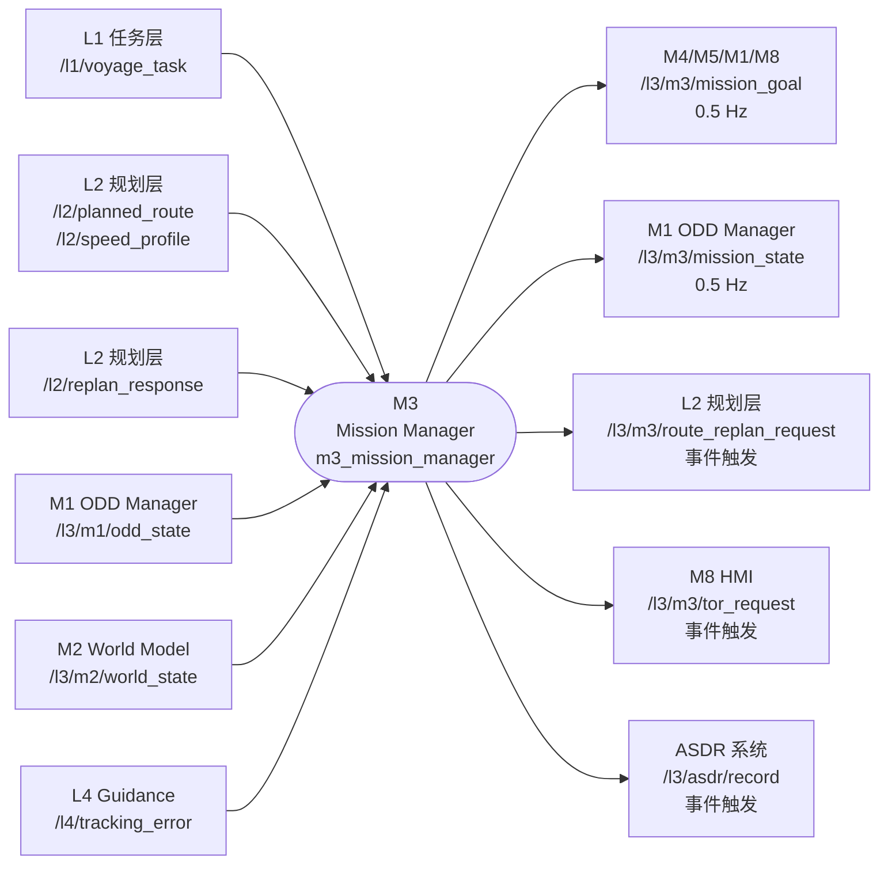
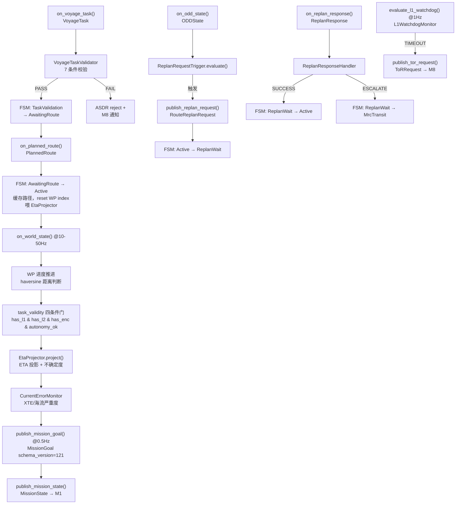
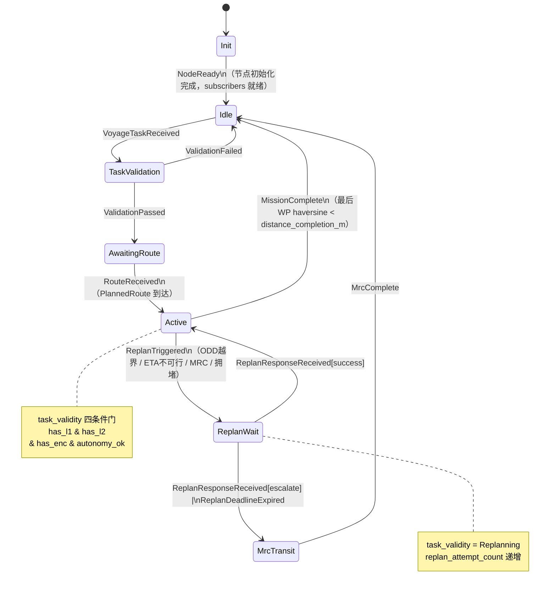
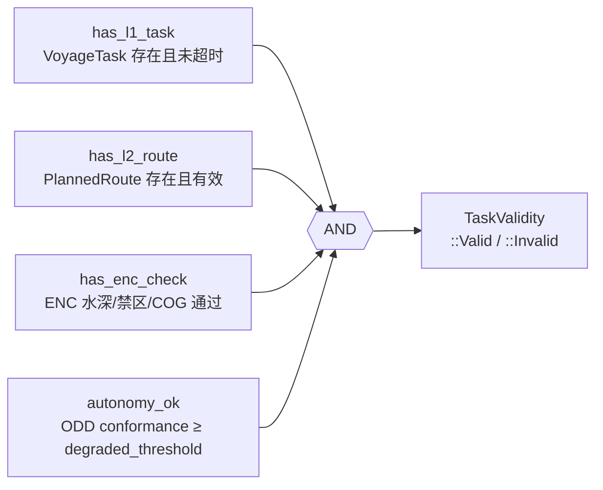

# M3 · Mission Manager · Spec

> **定位声明**：本文是 M3 的**权威设计目标**，依据架构报告 §7（第七章 M3 — Mission Manager）。描述应然的系统流程 / 功能 / 数据交互；**不含 SIL bridge 等过渡创可贴**（那些是实现层的临时偏离，记在同目录 progress.md）。当前实现现状与偏离见同目录 M3-progress.md。

---

## 1. 模块身份

| 属性 | 值 |
|---|---|
| 模块代号 | M3 |
| 职责一句话 | L3 内部本地任务跟踪器：VoyageTask 有效性看门人 + ETA 投影器 + 重规划请求触发器 |
| 时间尺度 | 长时（0.5 Hz 周期发布，事件触发快速响应）|
| SIL 等级 | PATH-D（非 SIL 认证路径）|
| colcon 包 | `src/l3_tdl_kernel/m3_mission_manager` |
| 架构报告章节 | §7（第七章 M3 — Mission Manager，v1.1.3-pre-stub）|
| 节点入口文件 | `src/l3_tdl_kernel/m3_mission_manager/src/mission_manager_node.cpp` |

---

## 2. 职责与边界

### 2.1 本模块拥有的职责

- **VoyageTask 有效性看门人**：接收 L1 下发的 VoyageTask，通过 VoyageTaskValidator 做 7 项可行性校验（出发距离、ETA 窗口、航点间距、排他区缓冲等），不合法则拒绝并通过 ASDR 记录
- **L2 路径 ENC 复核**：对 L2 PlannedRoute 中的航点序列做水深 / 禁区 / COG 合规 ENC 校验，形成 `has_enc_check` 条件门
- **任务令有效性四条件门（task_validity）**：在 FSM Active 态实时评估 `has_l1_task && has_l2_route && has_enc_check && autonomy_ok`，门输出直接作用于下游 M4/M5 的 task_validity 字段
- **航次 FSM 生命周期管理**：维护 7 态 FSM（Init → Idle → TaskValidation → AwaitingRoute → Active → ReplanWait → MrcTransit），是 L3 内部任务状态的唯一权威
- **ETA 投影**：基于 PlannedRoute + SpeedProfile + WorldState（当前位置、SOG、海流）投影剩余 ETA，计算 ETA 偏差，生成速度建议 `speed_recommend_kn`
- **WP 进度推进**：在 on_world_state 回调中用 haversine 判断当前 WP 是否已通过，更新 `current_wp_index_`
- **RouteReplanRequest 触发**：当 ODD 越界 / ETA 不可行 / MRC 触发 / 拥堵时，向 L2 发起重规划请求（M3 不本地重规划）[F-P1-D4-035]
- **L1 看门狗监控**：通过 L1WatchdogMonitor 检测 VoyageTask 丢失超时，触发置信度衰减和 ToR 请求
- **CurrentError 告警链**：通过 CurrentErrorMonitor 聚合 L4 XTE + M2 海流速度，输出三级严重度（NORMAL / MEDIUM / HIGH）
- **MissionState 发布**：向 M1 提供实时任务上下文（水深、锚泊区、系泊状态），支持 M1 MRC 类型选择
- **ASDR 审计流**：对 VoyageTask 接收、重规划触发、任务完成等关键事件发布 ASDRRecord

### 2.2 明确不负责的边界（防越界）

- **不做避碰决策**（M4/M5 职责）——任何避碰 arm/latch/teardown 逻辑不属于 M3
- **不做航次规划**（L1 Mission Layer 职责）——M3 只接收 L1 下发的 VoyageTask，不生成航线
- **不做回航 XTE 控制**（应归 M5 BC-MPC 或 M4 Transit IvP）——当前 bridge 的 XTE 比例控制器是临时创可贴，设计目标是 M5/M4 内部实现
- **不维护 CPA/TCPA 几何**（M2 职责）——ADR-4 Backseat Driver：决策核心零船型常量，M3 不得硬编码 SHIP_LENGTH_M 等参数
- **不持有 DCPA/TCPA 判断**（M2/M6 职责）——M3 的 WorldState 订阅仅用于位置 / 进度 / 海流更新
- **不管理 ODD Zone**（M1 唯一权威，ADR-1）——M3 不自行判断"是否在 ODD 内"，仅消费 M1 发布的 ODDState

---

## 3. 接口契约（数据交互）

### 3.1 上游订阅

| topic | msg_type | 来源模块 | 频率 | 用途 |
|---|---|---|---|---|
| `/l1/voyage_task` | `l3_external_msgs/VoyageTask` | L1 任务层 | 事件触发 | 触发 FSM TaskValidation；VoyageTaskValidator 7 项校验 |
| `/l2/planned_route` | `l3_external_msgs/PlannedRoute` | L2 航路规划 | 事件 / 1 Hz | 缓存路径；FSM AwaitingRoute→Active；喂 EtaProjector |
| `/l2/speed_profile` | `l3_external_msgs/SpeedProfile` | L2 航路规划 | 事件 / 1 Hz | 喂 EtaProjector.update_speed_profile() |
| `/l2/replan_response` | `l3_external_msgs/ReplanResponse` | L2 航路规划 | 事件触发 | ReplanResponseHandler 判断 → FSM ReplanWait→Active/MrcTransit |
| `/l3/m1/odd_state` | `l3_msgs/ODDState` | M1 ODD Manager | 0.1–1 Hz | ODD zone 变化监听；触发 RouteReplanRequest |
| `/l3/m2/world_state` | `l3_msgs/WorldState` | M2 World Model | 10–50 Hz | 当前位置、SOG、海流；WP 进度推进；task_validity 评估 |
| `/l4/tracking_error` | `l3_external_msgs/TrackingError` | L4 Guidance | ~10 Hz | CurrentErrorMonitor：XTE / 海流严重度计算 |

### 3.2 下游发布

| topic | msg_type | 消费模块 | 频率 | 关键字段 |
|---|---|---|---|---|
| `/l3/m3/mission_goal` | `l3_msgs/MissionGoal` | M4 Behavior Arbiter, M5 Tactical Planner, M1, M8 | 0.5 Hz（+ 事件触发） | `current_target_wp`, `eta_to_target_s`, `speed_recommend_kn`, `task_validity`, `fsm_state`, `confidence`, `rationale` |
| `/l3/m3/mission_state` | `l3_msgs/MissionState` | M1 ODD Manager | 0.5 Hz | `water_depth_m`, `in_anchorage_zone`, `is_moored`, `confidence` |
| `/l3/m3/route_replan_request` | `l3_msgs/RouteReplanRequest` | L2 航路规划 | 事件触发 | `reason`, `deadline_s`, `exclusion_zones`, `confidence`, `rationale` |
| `/l3/m3/tor_request` | `l3_msgs/ToRRequest` | M8 HMI（应聚合至 `/l3/m8/tor_request`）| 事件触发 | `reason`, `deadline_s`, `confidence`, `rationale` |
| `/l3/asdr/record` | `l3_msgs/ASDRRecord` | ASDR 审计系统 | 事件触发 | 各类任务事件 JSON payload |

### 3.3 CMM 契约

每条出消息必须携带四字段（架构报告 §15 CMM 接口要求）：

| 消息 | stamp 语义 | schema_version | confidence 语义 | rationale 语义 |
|---|---|---|---|---|
| MissionGoal | ROS2 now()，发布时刻 | 121（v1.2.1）| 0.4–1.0，综合 L1WatchdogFactor × ODD conformance | FSM 态 + task_validity 原因 + ETA 偏差摘要 |
| MissionState | ROS2 now() | 120（v1.2.0）| 0.0–1.0，来源数据可信度 | water_depth 来源说明（ENC / WorldState / 默认）|
| RouteReplanRequest | ROS2 now() | 120（v1.2.0）| 基于触发原因动态计算（见 §5）| 重规划触发原因 + ETA 偏差 + ODD zone |
| ToRRequest | ROS2 now() | 121 | L1WatchdogMonitor.confidence_factor | L1 超时时长 + 建议 MRC 类型 |
| ASDRRecord | ROS2 now() | 应与触发消息一致 | 同发布时 MissionGoal.confidence | 事件类型 + payload 摘要 |

### 3.4 数据流图

---

## 4. 内部系统流程（功能实现）

### 4.1 子能力分解

| 子能力 | 实现组件 | 触发方式 |
|---|---|---|
| VoyageTask 校验 | VoyageTaskValidator（7 条件）| on_voyage_task() |
| ENC 路径复核 | EncRouteValidator（水深 / 禁区 / COG）| on_world_state() 内评估 |
| ETA 投影 | EtaProjector | on_planned_route() + on_speed_profile() + on_world_state() |
| 速度建议计算 | EtaProjector.compute_speed_recommendation() | publish_mission_goal() |
| 重规划触发决策 | ReplanRequestTrigger.evaluate() | on_odd_state() + check_replan_deadline() |
| 重规划响应处理 | ReplanResponseHandler | on_replan_response() |
| L1 看门狗 | L1WatchdogMonitor | evaluate_l1_watchdog() @1 Hz |
| 横迹 / 海流告警 | CurrentErrorMonitor | on_tracking_error() + on_world_state() |
| FSM 状态驱动 | MissionStateMachine | 各回调注入事件 |
| task_validity 四条件门 | MissionStateMachine.update_task_validity() | on_world_state() |
| WP 进度推进 | haversine 距离判断 | on_world_state() |

### 4.2 处理流水线

### 4.3 Mission FSM 状态机

### 4.4 task_validity 四条件门

---

## 5. 关键算法 / 数据结构

### 5.1 ETA 投影（EtaProjector）

- 输入：remaining WP 序列、SpeedProfile、WorldState（SOG、当前位置、sea_current）
- 算法：对每个航段 haversine 距离 / 计划速度 = 分段 ETA；Gauss-Markov 海流不确定度叠加 `uncertainty_s`
- 速度建议：`delta_s = current_eta_s - planned_eta_s`；若 `delta_s > infeasible_margin_s` → 建议提速（上限 ODD 速度限制 × L1WatchdogFactor）

### 5.2 重规划触发（ReplanRequestTrigger）

评估优先级（由高到低）：

| 触发原因 | 条件 | deadline_s |
|---|---|---|
| MRC_REQUIRED | ODD critical 进入 | 30 s |
| ODD_EXIT_CRITICAL | ODD conformance < critical_threshold | 60 s |
| ODD_EXIT_DEGRADED | ODD conformance < degraded_threshold | 120 s |
| MISSION_INFEASIBLE | current_eta_s > planned_eta_s + infeasible_margin_s | 120 s |
| CONGESTION | 拥堵判断（[TBD-HAZID] 条件待 HAZID RUN-001 校准）| 300 s |

冷却时间（cooldown）：`replan_cooldown_s`（默认 10 s），防止重复触发。

### 5.3 RouteReplanRequest.confidence 动态计算

| 触发原因 | confidence 公式 |
|---|---|
| MRC_REQUIRED | 0.95 |
| ODD_EXIT | 1.0 − ODD.conformance_score |
| MISSION_INFEASIBLE | max(0, 1.0 − (current_eta / planned_eta − 1.0)) |
| CONGESTION | 1.0 / replan_attempt_count |

### 5.4 L1WatchdogMonitor

- warning_s（默认 60 s）：VoyageTask 丢失超时 → confidence_factor = confidence_warning（0.6）
- timeout_s（默认 120 s）：→ confidence_factor = confidence_timeout（0.4）+ 触发 ToR

---

## 6. 降级路径

| 场景 | 应然行为 |
|---|---|
| DEGRADED（ODD conformance 低）| task_validity 保持 Valid；ETA confidence 下调；MissionGoal confidence 降低；触发 ODD_EXIT_DEGRADED 重规划（deadline 120s）|
| CRITICAL（ODD conformance 极低）| task_validity → Invalid（autonomy_ok=false）；立即触发 ODD_EXIT_CRITICAL 重规划（deadline 60s）；MissionGoal.confidence < 0.4 |
| OUT-of-ODD / MRC 触发 | FSM 进入 ReplanWait → MrcTransit；MissionGoal.task_validity = REPLANNING；ToR 请求发出 |
| ENC 校验失败 | has_enc_check = false → task_validity = Invalid；ASDR 记录 enc_check_failed；ENC 不可用时降级为 fallback=true（Pending，仍允许执行）|
| L2 重规划失败（超次数）| replan_attempt_count ≥ attempt_max_count → ReplanResponseHandler 输出 escalate_to_mrc=true → FSM MrcTransit |
| L1 VoyageTask 超时 | L1WatchdogMonitor WARNING → confidence 衰减；TIMEOUT → publish_tor_request() |
| WorldState 过期（> timeout.world_state_s）| EtaProjector 返回 uncertainty 增大；MissionGoal.confidence 降低；ASDR 记录 world_state_stale |

---

## 7. 顶层约束

| 约束 | 适用范围 | 说明 |
|---|---|---|
| **ADR-1 ODD 唯一权威** | M3 不自判 ODD 合规性 | M3 只消费 M1 的 ODDState，不自行维护"是否在 ODD 内" |
| **ADR-4 零船型常量** | M3 不持有 SHIP_LENGTH_M 等常数 | 速度建议 / ETA 算法使用 SpeedProfile 和 ODD 速度限制，不硬编码船型参数 |
| **CMM 三接口** | 所有出消息 | stamp + schema_version + confidence + rationale 必须全填（见 §3.3）|
| **RFC-006** | RouteReplanRequest.exclusion_zones | GeoJSON Polygon 格式已锁定，M3 须填充此字段（当前实现未填，见 progress.md）|
| **RFC-004** | MissionGoal / RouteReplanRequest ASDR 行 | 两者均须入 ASDR 审计流 |
| **[TBD-HAZID]** | distance_completion_m, ODD 阈值, ENC 水深参数 | 待 HAZID RUN-001（计划 8/19）校准后回填 v1.1.3 |

---

## 8. 关联 D 任务

详见同目录 [M3-progress.md](M3-progress.md)，D 任务联动表记录每项任务的真实状态与偏差。主要关联任务：

- **D1.4**（已合并）：M3 基础框架 + 接口
- **D2.3**（已合并）：CurrentErrorMonitor + L1WatchdogMonitor + IDL v1.2.1
- **D2.8 / D2.9 / D2.10**（来自 M3-gap-fix-plan.md）：ENC 校验 / speed_recommend / confidence 动态计算（未启动）

---

## 9. 修订

| 日期 | 变更 |
|---|---|
| 2026-05-20 | 初版 spec stub |
| 2026-06-08 | 依架构报告 §7 + 系统审计重写 spec（补全流程/接口/状态机/数据流图；剔除创可贴；新增 task_validity 四条件门图、Mission FSM 状态机、降级路径、CMM 契约表）|
