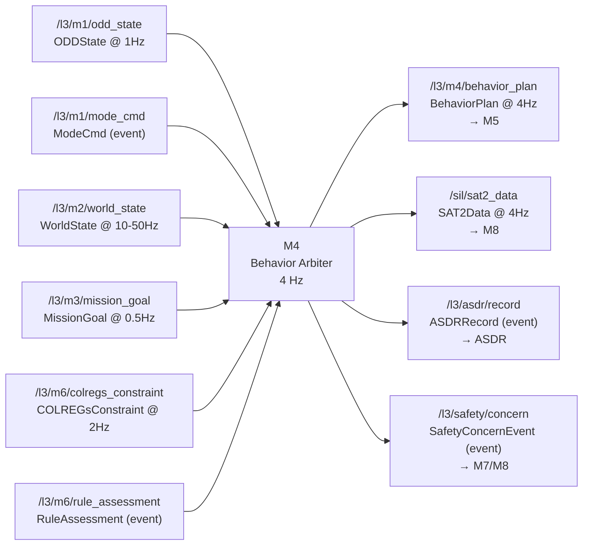
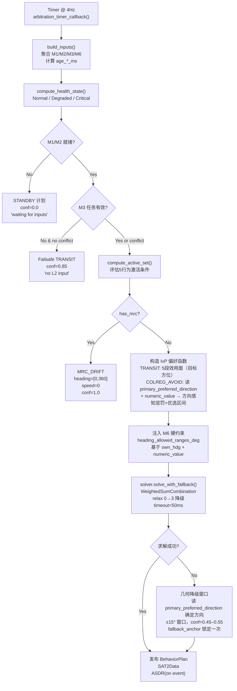
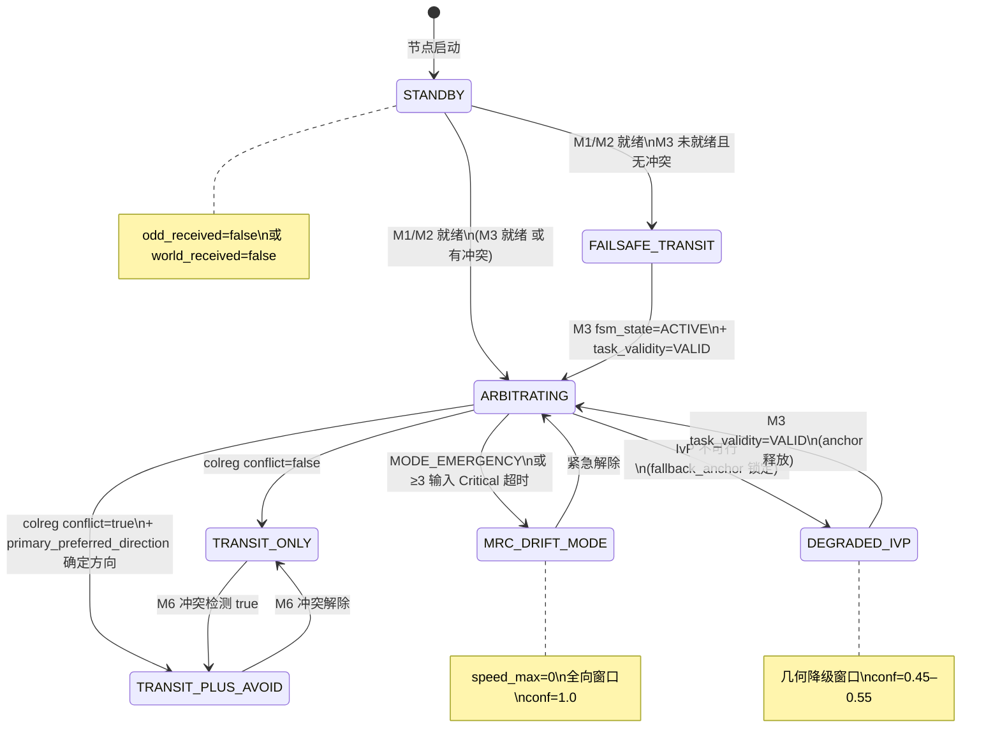

# M4 · Behavior Arbiter · 设计规格

> **定位声明**：本文是 M4 的**权威设计目标**，依据架构报告 §8（第八章 M4 — Behavior Arbiter）。描述应然的系统流程、功能与数据交互。**不含 SIL bridge 等过渡创可贴**（那些是实现层的临时偏离，记在 progress.md）。当前实现现状与偏离见同目录 `M4-progress.md`。

---

## 1. 模块身份

| 属性 | 值 |
|---|---|
| 模块代号 | M4 |
| 职责一句话 | 维护 ODD-aware 行为字典，运行 IvP 多目标仲裁（heading × speed 网格求解），向 M5 输出胜出行为及可行航向/速度窗口 |
| 时间尺度 | 中时，1–4 Hz（默认 4 Hz） |
| SIL 等级 | SIL 1（PATH-D） |
| 实现路径（PATH） | PATH-D：工程实现，无形式化验证要求 |
| colcon 包 | `src/l3_tdl_kernel/m4_behavior_arbiter` |
| 架构报告章节 | §8（第八章）|
| 节点入口文件 | `src/l3_tdl_kernel/m4_behavior_arbiter/src/behavior_arbiter_node.cpp` |

---

## 2. 职责与边界

### 2a. 本模块**拥有**的职责

- **行为字典管理**：从 YAML 加载行为描述符；维护每个行为的名称、适用 ODD 子域、触发条件与优先权重
- **ODD-aware 行为激活**：基于 M1 ODD 区域、M3 任务状态、M6 冲突信号，决定哪些行为当前活跃
- **IvP 多目标函数构造**：为每个活跃行为建立 interval 偏好函数（heading × speed 分段效用面）
- **IvP 联合求解**：调用 WeightedSumCombination 策略，在 heading × speed 网格上寻找所有活跃行为偏好函数的联合最优解（胜出航向/速度窗口）
- **M6 方向指令消费**：读取 COLREGsConstraint 的 `primary_preferred_direction`（STARBOARD / PORT / REDUCE_SPEED / HOLD），依此决定 IvP 避碰函数的惩罚-优选方向配置；**禁止硬编码右转**
- **求解失败降级**：IvP 不可行时输出几何保守窗口；附 confidence 字段指示降级程度
- **CMM 3 接口**（ADR-3）：暴露 `current_state()` / `rationale()` / `forecast(Δt)+uncertainty()` 服务，供 M8 聚合用于 SAT-2 透明性
- **ASDR 审计发布**：行为切换、ODD 转换、IvP 不可行、输入超时等决策事件写入 `/l3/asdr/record`
- **SAT-2 贡献向量**：计算 8 方向（0/45/90/135/180/225/270/315°）IvP 效用梯度，以 `SAT2Data` 发布到 `/sil/sat2_data`

### 2b. 明确**不负责**的（防越界）

- **避碰 arm/latch/teardown 状态机**：当前由 bridge 持有（创可贴），应然归属 M5（BC-MPC 层）或 M4 teardown 触发信号（ADR 待明确）。M4 只负责仲裁结果，**不直接操作执行器 latch**
- **60° 航向 clamp**：当前在 bridge，应然在 M6（COLREGs 约束生成器 — 最小大幅转向上限）或 M5（NLP bounds）；M4 不设最大偏差硬切断
- **回航 XTE 控制**：当前在 bridge，应然在 M5（BC-MPC transit 段）
- **DCPA/TCPA 几何计算**：由 M2 提供，M4 消费 M2 WorldState 中的目标数据；M4 **不独立计算 CPA 几何**（ADR-4：Backseat Driver，决策核心零船型常量，违反该原则的 atan2(L,R) 计算不属于 M4）
- **COLREGs 规则推理**（哪条规则、什么角色）：M6 职责；M4 消费 M6 输出的约束与方向指令
- **全局 ODD 状态维护**：M1 职责；M4 只读取，不写入（ADR-1）
- **感知降质检测**：M7/M2 职责（ADR-2 Doer-Checker）
- **航次计划管理**：M3 职责

---

## 3. 接口契约（数据交互）

### 3.1 上游订阅

| topic | msg_type | 来源模块 | 频率 | 用途 |
|---|---|---|---|---|
| `/l3/m1/odd_state` | `l3_msgs/ODDState` | M1 | ~1 Hz | ODD 区域（odd_zone）→ 行为激活过滤 |
| `/l3/m1/mode_cmd` | `l3_msgs/ModeCmd` | M1 | 事件驱动 | MODE_EMERGENCY → MRC_DRIFT 优先覆盖 |
| `/l3/m2/world_state` | `l3_msgs/WorldState` | M2 | 10–50 Hz | 本船位置/航速/目标列表 → TRANSIT 目标方位 + IvP 几何计算 |
| `/l3/m3/mission_goal` | `l3_msgs/MissionGoal` | M3 | ~0.5 Hz | 任务状态（fsm_state / task_validity）+ 当前目标航路点 |
| `/l3/m6/colregs_constraint` | `l3_msgs/COLREGsConstraint` | M6 | 2 Hz | `conflict_detected` + `primary_preferred_direction` + `constraints[].numeric_value` → IvP 避碰函数 + 硬约束 |
| `/l3/m6/rule_assessment` | `l3_msgs/RuleAssessment` | M6 | 事件驱动 | 当前触发规则 → 辅助权重调整（应然：经 M1 ODD 参数化，见 §7） |

### 3.2 下游发布

| topic | msg_type | 消费模块 | 频率 | 关键字段 |
|---|---|---|---|---|
| `/l3/m4/behavior_plan` | `l3_msgs/BehaviorPlan` | M5 | 4 Hz | `behavior`, `heading_min/max_deg`, `speed_min/max_kn`, `confidence`, `rationale` |
| `/sil/sat2_data` | `l3_msgs/SAT2Data` | M8（SAT-2 透明性） | 4 Hz | `ivp_contributions[8]`, `ivp_labels[8]`, `colregs_chain`, `confidence`, `rationale` |
| `/l3/asdr/record` | `l3_msgs/ASDRRecord` | ASDR | 事件驱动 | `decision_type`, `decision_json`, `source_module`, `stamp` |
| `/l3/safety/concern` | `l3_msgs/SafetyConcernEvent` | M7/M8 | 事件驱动（IvP 不可行时） | `concern_type`, `anchor_hdg`, `severity`, `suggested_action` |

### 3.3 CMM 契约

架构 ADR-3 要求每个模块暴露三接口，供 M8 按需查询：

| 接口 | 语义 | 输出内容 |
|---|---|---|
| `current_state()` | 当前仲裁状态快照 | 活跃行为集、胜出行为、ODD 区域、confidence、输入新鲜度 |
| `rationale()` | 最近一次仲裁的决策理由 | IvP 求解摘要、所有行为权重、降级标志（rationale 字段语义与 BehaviorPlan.rationale 一致但通过 CMM 服务可查询历史） |
| `forecast(Δt)+uncertainty()` | 未来 Δt 内行为预测 | 预测胜出行为 + confidence 区间（基于当前 COLREGs 阶段和目标动态估计） |

出消息 CMM 字段映射：

| 消息 | stamp | schema_version | confidence | rationale |
|---|---|---|---|---|
| `BehaviorPlan` | `plan.stamp = now()` | 113 | IvP relaxation_level=0→0.95；>0→0.75；fallback→0.30–0.55；MRC→1.0 | IvP 求解摘要或降级原因 |
| `SAT2Data` | `sat2.stamp = now()` | 113 | 与 BehaviorPlan.confidence 一致 | 同 BehaviorPlan.rationale |
| `ASDRRecord` | `stamp = now()` | 113 | — | `decision_json` 内含推理链 |

### 3.4 数据流图



---

## 4. 内部系统流程（功能实现）

### 4.1 子能力分解

| 子能力 | 说明 |
|---|---|
| 输入聚合与新鲜度跟踪 | 接收各订阅最新消息，计算各输入时效（age_*_ms），超时降级 |
| 任务状态守卫 | M3 `fsm_state=ACTIVE` + `task_validity=VALID` 才允许完整 IvP 仲裁；否则输出保守 TRANSIT |
| 行为激活条件评估 | 按 ODD zone、任务状态、COLREGs 冲突信号判定活跃行为集 |
| MRC_DRIFT 快速路径 | 检测 MRC 触发时短路至最高优先级漂浮，不进 IvP 求解 |
| IvP 函数构造 | 为 TRANSIT / COLREG_AVOID（及未来其他行为）构造分段效用面 |
| M6 方向消费 | 读取 `primary_preferred_direction`，决定避碰 IvP 函数的优选区间方向 |
| IvP 联合求解 | WeightedSumCombination + 硬约束注入，timeout=50ms，3 级 relax 降级 |
| 降级路径输出 | IvP 不可行时输出几何保守窗口；confidence 显式降低 |
| CMM / ASDR / SAT-2 输出 | 每周期并行发布三路下游 |

### 4.2 仲裁流水线



### 4.3 行为激活状态机



---

## 5. 关键算法 / 数据结构（设计层面）

### 5.1 IvP 多目标方法（架构报告 §8.2，[R3]）

每个活跃行为对 heading × speed 解空间贡献一个 **interval function**（分段效用面）。最终解是所有行为 **weighted_fns** 的 WeightedSum 联合最优：

```
maximize Σ_b  w_b · f_b(heading, speed)
subject to  heading ∈ allowed_ranges
            speed ∈ [s_min, s_max]
```

- **分辨率**：heading 1°，speed 0.5 kn（`m4_params.yaml`）
- **超时**：50 ms（`m4.arbitration.ivp_timeout_ms`）
- **降级**：relax 0→3 依次放宽硬约束，relax>0 时 confidence 降至 0.75

### 5.2 方向感知避碰函数（M6 消费，应然设计）

读取 `COLREGsConstraint.primary_preferred_direction`：

| primary_preferred_direction | IvP 避碰函数配置 |
|---|---|
| `STARBOARD` | 惩罚区间 = [nominal - 180°, nominal + colregs_dev)；优选区间 = [nominal + colregs_dev, nominal + comfort_upper] |
| `PORT` | 惩罚区间 = [nominal - colregs_dev, nominal + 180°)（镜像）；优选区间 = [nominal - comfort_upper, nominal - colregs_dev] |
| `REDUCE_SPEED` | 仅构造速度惩罚段（高速区效用低）；heading 不施加方向偏置 |
| `HOLD` | 当前航向/速度维持段效用最高；heading 惩罚较小偏差区间以外 |

`comfort_upper` 由几何推导（arcsin(cpa_safe / rng) × boldness_factor，Rule 8 大幅转向，[R3]）与 `colregs_dev` 取较大值后加 15° 余量。

### 5.3 行为字典

`BehaviorDescriptor` 字段：`type`（BehaviorType 枚举）、`name`、`priority_weight`（IvP 加权系数）、`activation_rule`、`ivp_function_type`。字典从 `config/behavior_definitions.yaml` 加载；运行时 `set_priority_weight()` 更新权重。

权重设计基准（架构报告 §8.3）：

| 行为 | 设计权重 | 备注 |
|---|---|---|
| Transit | 0.3 | 航次跟踪，基础 |
| COLREGs_Avoidance | 0.7（Rule 14：0.85） | M6 rule_assessment 触发权重调整 |
| Restricted_Visibility | 0.6 | ODD-D + 能见度 < 2nm |
| Channel_Following | 0.5 | ODD-B + VTS 区 |
| DP_Hold | 0.8 | ODD-C 靠泊 |
| MRC_Drift | 1.0（最高）| 全覆盖，短路 IvP |

### 5.4 新鲜度跟踪

`ArbitrationInputs.age_*_ms` 驱动健康判定：
- `age > timeout_degraded_ms`（默认 500 ms）→ HealthState::Degraded
- `≥3 个输入 age > timeout_critical_ms`（默认 2000 ms）→ HealthState::Critical → MRC_DRIFT 激活

---

## 6. 降级路径

| 场景 | 应然行为 |
|---|---|
| M1/M2 缺席（standby） | 输出 TRANSIT，confidence=0.0，`rationale="Standby: waiting for inputs"` |
| M3 未就绪且无冲突 | Failsafe TRANSIT，confidence=0.85，航向窗口 ±5° 当前航向 |
| MODE_EMERGENCY 或 Critical 健康 | MRC_DRIFT，speed_max=0，全向窗口，confidence=1.0 |
| IvP 不可行（有 M6 方向） | 几何降级窗口：方向由 `primary_preferred_direction` 确定（禁止硬编码右转），±15° 窗口，confidence=0.45–0.55；fallback_anchor 锁定防漂移 |
| IvP 不可行（无冲突） | ±90° 对称窗口，confidence=0.30 |
| 活跃行为集为空 | TRANSIT，confidence=0.60，`rationale="No active behaviors; default Transit"` |
| OUT-of-ODD（odd_zone 超出已知值） | 行为激活条件全部评估为 false → 回退 MRC_DRIFT（is_mrc_drift 的 Critical 路径触发） |

降级时 `/l3/safety/concern` 发布 `CONCERN_IVP_INFEASIBLE`（仅 IvP 不可行路径），`/l3/asdr/record` 发布 `ivp_infeasible` 事件（带约束数量、fallback 类型 JSON）。

---

## 7. 顶层约束

| 约束 | 在 M4 的映射 |
|---|---|
| **ADR-1**：M1 ODD 是行为切换唯一权威 | M4 行为激活条件以 `odd_zone` 为主开关；**禁止** M6 rule_assessment 直接旁路 M1 修改权重——应通过 M1 将规则触发的 ODD 参数化后传递（[TBD-ADR1-ruleassessment：M6→M1 参数化路径待架构设计，当前直接消费为偏离，记 progress]） |
| **ADR-2**：Doer-Checker，M7 有否决权 | M4 在发布 behavior_plan 前须检查 M7 VETO 信号（当前 gap，记 progress）；Checker 逻辑须比 M4 Doer 简单 100× |
| **ADR-3**：CMM 三接口 | M4 须实现 `current_state()` / `rationale()` / `forecast(Δt)` ROS2 服务 |
| **ADR-4**：Backseat Driver，零船型常量 | M4 决策逻辑**禁止** `if vessel==FCB`；IvP 几何计算**禁止**嵌入 SHIP_LENGTH 等常量 |
| **RFC-009**：IvP 自实现（D0.2 决议） | 不引入 libIvP（GPL/LGPL）；IvP solver 为项目自有实现 |

---

## 8. 关联 D 任务

详见 `M4-progress.md` D 任务联动表。

- **D0.2**（RFC-009 IvP 路径决议）→ 已关闭，锁定自实现
- **D3.1**（M4 IvP 完整实现）→ 已关闭，但存在已知偏离（见 progress）
- **D2.5**（SIL SAT-2 集成）→ 部分完成（SAT2Data 存在 6/8 截断 gap）

---

## 9. 修订

| 日期 | 变更 |
|---|---|
| 2026-05-20 | 初版 spec stub |
| 2026-06-08 | 依架构报告 §8 + 系统审计重写 spec（剔除创可贴，补全流程/接口/数据）；方向感知避碰函数、CMM 契约、降级路径全部重写；确立 ADR-1/2/3/4 映射 |
