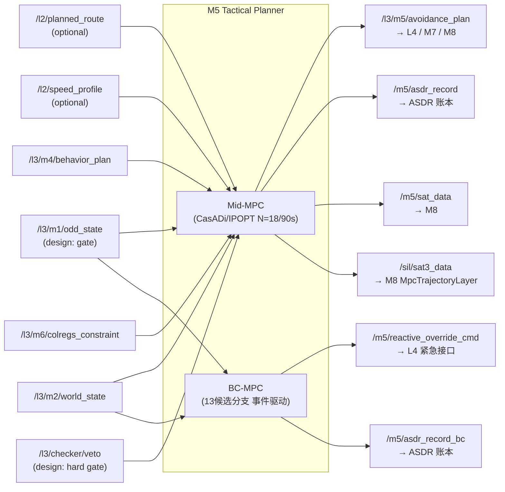
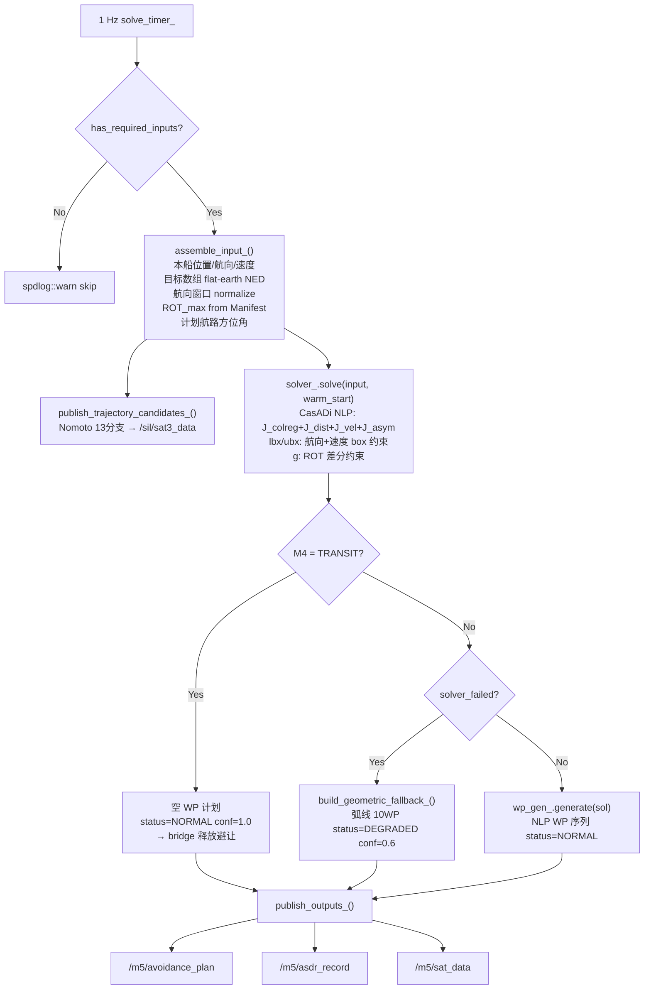
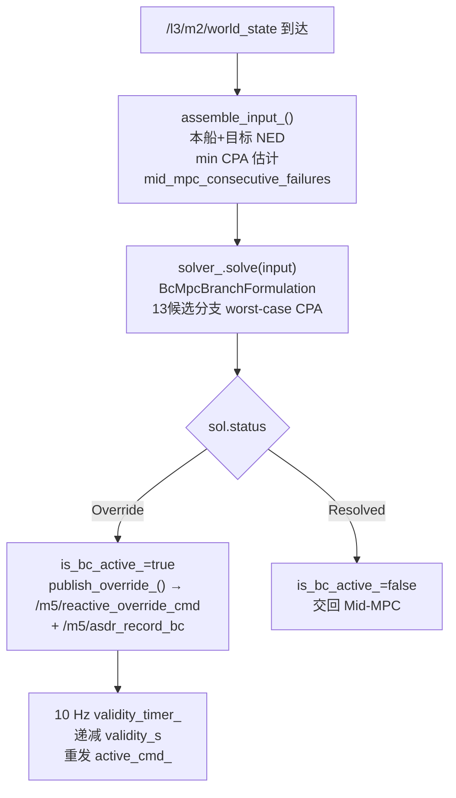
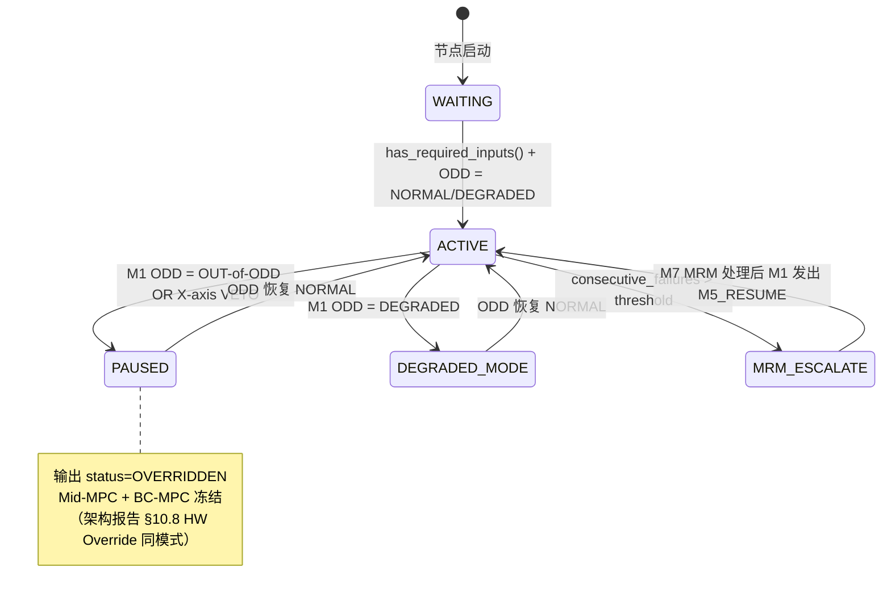

# M5 · Tactical Planner · Spec

> **定位声明**：本文是 M5 的**权威设计目标**，依据架构报告第十章（§10）。描述应然的系统流程 / 功能 / 数据交互；**不含 SIL bridge 等过渡创可贴**（那些是实现层的临时偏离，记在 progress.md）。当前实现现状与偏离见同目录 [M5-progress.md](M5-progress.md)。

---

## 1. 模块身份

| 属性 | 值 |
|---|---|
| 模块代号 | M5 |
| 职责一句话 | Mid-MPC（N=18 / 90 s，CasADi/IPOPT）输出 AvoidancePlan（WP 序列）至 L4；BC-MPC（13 候选分支，事件驱动）输出 ReactiveOverrideCmd（ψ, u, ROT）至 L4 紧急覆盖接口 |
| 时间尺度 | Mid-MPC 1–2 Hz；BC-MPC 事件驱动 / 上限 10 Hz |
| SIL 等级 | SIL 1（执行路径；PATH-D；轨迹安全校验由 M7 独立覆盖）|
| 实现路径 | PATH-D |
| colcon 包 | `src/l3_tdl_kernel/m5_tactical_planner` |
| 架构报告章节 | 第十章 §10.1–§10.9 |
| 节点入口文件（Mid-MPC）| `src/mid_mpc/main_mid_mpc.cpp` / `mid_mpc_node.cpp` |
| 节点入口文件（BC-MPC）| `src/bc_mpc/main_bc_mpc.cpp` / `bc_mpc_node.cpp` |

---

## 2. 职责与边界

### 2.1 本模块拥有的职责

- **Mid-MPC 优化**：基于 M4 行为窗口 + M6 COLREGs 约束，以 IPOPT/CasADi 求解 N=18、步长 5 s（总时域 90 s）的有限时域规划，目标函数包含 COLREGs 合规代价（J_colreg）、航路偏差代价（J_dist）、速度效率代价（J_vel）及右转不对称代价（J_asym）
- **BC-MPC 短程分支**：在 Mid-MPC 兜不住短时危险时（CPA 急剧恶化），枚举 13 条候选航向，选择最坏情况 CPA 最大的分支，以 ReactiveOverrideCmd（事件驱动，上限 10 Hz）通知 L4 紧急覆盖
- **Capability Manifest 驱动**：ROT_max 曲线、停止距离、速度范围从 `fcb_vessel_capability.yaml` 动态读取，**禁止** 在代码中硬编船型常量（ADR-4）
- **几何降级兜底**：NLP 求解失败时启用基于弧线几何的降级计划（status=DEGRADED, confidence=0.6），标记为非最优，等待下一周期重试
- **M4 TRANSIT 释放**：M4 行为 = TRANSIT 时主动输出空 WP 计划（status=NORMAL），通知 L4/bridge 释放避让模式，回归航路跟踪
- **MRM 上报**：连续求解失败超过阈值（[TBD-HAZID] kConsecutiveFailureEscalation）时，向 M7 发布 safety_concern_event，触发 MRM-02 响应链；**M5 不直接执行 MRM 命令**（Doer-Checker 指挥链，架构报告 §11.6）
- **CMM 三接口**：每条输出消息携带 `stamp` + `schema_version` + `confidence∈[0,1]` + `rationale`，供 M8 聚合（架构报告 §3 ADR-3）
- **ASDR 记录**：每次决策输出附 ASDRRecord（decision_json + sha256 签名）至 `/m5/asdr_record`

### 2.2 明确不负责的职责

| 不负责 | 归属方 | 依据 |
|---|---|---|
| 避让航向执行（PD 控制 / 舵角）| L4 Guidance Layer | 架构报告 §10.3 接口设计：L4 始终是 (ψ,u,ROT) 最终生成者 |
| 避让 latch / teardown 状态机 | M4（COLREG_AVOID 行为边界）| ADR-1：M4 是行为切换权威；latch 逻辑不应驻留 bridge |
| 60° 航向 clamp | M6（最小偏转约束）+ M5 NLP bounds | ADR-4；clamp 在 bridge 是越界逻辑（创可贴）|
| 回航 XTE 控制器 | M5 BC-MPC 或 M4 TRANSIT IvP | 回航应由 M4 transit 行为 + M5 WP 序列引导，不在 bridge |
| DCPA / TCPA 几何计算 | M2 World Model | M2 = 唯一权威世界视图（ADR-1）；bridge 不应重复 |
| ODD 边界判断 | M1 ODD Envelope Manager | ADR-1：M1 ODD 状态是行为切换唯一来源 |
| 安全告警 / SOTIF 监控 | M7 Safety Supervisor | Doer-Checker 独立性（ADR-2）；M7 逻辑须比 Doer 简单 100× |
| COLREGs 规则推理 | M6 COLREGs Reasoner | 职责分层，M5 消费 M6 结论而非重新推理 |
| 船型特定参数（Kp、速度等）直接硬编 | 全部须走 Capability Manifest | ADR-4 Backseat Driver — 决策核心零船型常量 |

---

## 3. 接口契约（数据交互）

### 3.1 上游订阅

| topic | msg_type | 来源模块 | 设计频率 | 用途 |
|---|---|---|---|---|
| `/l3/m2/world_state` | `l3_msgs/WorldState` | M2 World Model | 10–50 Hz | 本船状态（位置/航速/航向）+ 目标船数组（CPA/TCPA/COG/SOG）|
| `/l3/m4/behavior_plan` | `l3_msgs/BehaviorPlan` | M4 Behavior Arbiter | 1–4 Hz | 行为类型（TRANSIT/COLREG_AVOID）+ 允许航向窗口 + 速度窗口 |
| `/l3/m6/colregs_constraint` | `l3_msgs/COLREGsConstraint` | M6 COLREGs Reasoner | 2 Hz | 规则链（active_rules）+ 主目标 ID + 角色 / 阶段标记 |
| `/l2/planned_route` | `l3_external_msgs/PlannedRoute` | L2 Voyage Planner | 低频（更新触发）| 航路方位角（用于 J_dist 代价基准 + 几何降级目标航向）|
| `/l2/speed_profile` | `l3_external_msgs/SpeedProfile` | L2 Voyage Planner | 低频（更新触发）| 计划速度（用于 J_vel 代价基准）|
| `/l3/m1/odd_state` | `l3_msgs/ODDState` | M1 ODD Envelope Manager | 0.1–1 Hz | **[设计目标]** ODD 状态门控（NORMAL/DEGRADED/CRITICAL/OUT-of-ODD）；当前实现 MISSING（见 progress.md）|
| `/l3/checker/veto` | `l3_external_msgs/CheckerVetoNotification` | X-axis Checker | 事件 | **[设计目标]** X-axis VETO 硬门控，接收后抑制当前周期输出；当前实现 MISSING |

> `/l2/planned_route` 和 `/l2/speed_profile` 为 optional（不影响 `has_required_inputs_()` 判断）；缺失时使用内部默认值。

### 3.2 下游发布

| topic | msg_type | 消费模块 | 设计频率 | 关键字段 |
|---|---|---|---|---|
| `/l3/m5/avoidance_plan` | `l3_msgs/AvoidancePlan` | L4 Guidance Layer / M7 Safety Supervisor / M8 HMI | 1–2 Hz | waypoints[]（WGS84 位置 + turn_radius_m + target_speed_kn）/ status / confidence / rationale |
| `/m5/reactive_override_cmd` | `l3_msgs/ReactiveOverrideCmd` | L4 Guidance Layer（紧急接口）| 事件 / 上限 10 Hz | heading_cmd_deg / speed_cmd_kn / validity_s |
| `/m5/asdr_record` | `l3_msgs/ASDRRecord` | ASDR 决策账本 | 与 avoidance_plan 同步 | decision_type="avoid_wp" / decision_json / sha256 |
| `/m5/asdr_record_bc` | `l3_msgs/ASDRRecord` | ASDR 决策账本 | 与 reactive_override_cmd 同步 | decision_type="reactive_override" / decision_json / sha256 |
| `/m5/sat_data` | `l3_msgs/SATData` | M8 HMI Transparency | 与 avoidance_plan 同步 | sat2.trigger_reason / sat2.reasoning_chain / sat2.system_confidence |
| `/sil/sat3_data` | `l3_msgs/SAT3Data` | M8 HMI / MpcTrajectoryLayer | 1–2 Hz | trajectory_candidates[]（13 分支轨迹）/ primary_trajectory_idx |

### 3.3 CMM 契约

架构报告 ADR-3 要求每条出消息携带四字段：

| 消息 | stamp | schema_version | confidence∈[0,1] | rationale |
|---|---|---|---|---|
| AvoidancePlan（计划级）| 每周期设 `get_clock()->now()` | 112 | NLP converged=1.0 / DEGRADED=0.6 / TRANSIT=1.0 | 含 solver 状态 + turn_radius + 目标航向 |
| AvoidancePlan 每个 Waypoint | 应与计划同步 | 112 | 与计划 confidence 一致 | "M5 NLP path" 或 "M5 geometric starboard fallback" |
| ReactiveOverrideCmd | 每次发布时设 | 112 | BC-MPC CPA 质量派生 | 含 worst_case_cpa_m |
| SATData | 每周期设 | — | plan.confidence 传递 | plan.rationale 传递 |
| SAT3Data | 每周期设 | 112 | 各分支 CPA 质量派生（非硬编 1.0）| 含 rule_compliant 真实评估 |

### 3.4 数据流图



---

## 4. 内部系统流程（功能实现）

### 4.1 子能力分解

| 子能力 | 负责节点 | 触发方式 |
|---|---|---|
| 参数组装（本船状态 + 目标数组 + 约束）| Mid-MPC | 1 Hz 定时器 |
| NLP 求解（IPOPT/CasADi）| Mid-MPC | 每周期 |
| 几何降级计划生成 | Mid-MPC | NLP 失败 / M4 几何信号时 |
| TRANSIT 空计划输出 | Mid-MPC | M4 行为 = TRANSIT |
| SAT-3 轨迹候选发布（Nomoto）| Mid-MPC | 每周期（与 NLP 并行）|
| BC-MPC 紧急覆盖 | BC-MPC | M2 world_state 到达时触发 |
| BC-MPC 有效期维持（validity republish）| BC-MPC | 10 Hz validity_timer_ |
| ASDR 记录 | Mid + BC-MPC | 每次 publish_outputs_ |
| MRM 上报 | Mid-MPC solver | 连续失败 > kConsecutiveFailureEscalation |

### 4.2 Mid-MPC 处理流水线



### 4.3 BC-MPC 处理流水线



### 4.4 ODD 门控逻辑（设计目标）



---

## 5. 关键算法 / 数据结构

### 5.1 Mid-MPC 目标函数（架构报告 §10.4）

```
min  w_col × J_colreg + w_dist × J_dist + w_vel × J_vel + w_asym × J_asym
     Δψ_sequence (x = [psi_0..psi_N, u_0..u_N])

J_colreg  : 平滑 CPA 排斥势 —— sum_k sum_j exp(-CPA(ψ_k, target_j) / σ)
            动态权重：M6 primary target ID 命中时该目标权重上调
J_dist    : (ψ_k - planned_route_bearing)² — 航路偏差
J_vel     : (u_k - planned_speed)²         — 速度效率
J_asym    : 右转不对称代价                 — 鼓励右转符合 COLREGs Rule 8/16

约束（lbx/ubx per-variable box）：
  psi[k] ∈ [heading_min_rad, heading_max_rad]   # M4 IvP 窗口
  u[k]   ∈ [speed_min_mps, speed_max_mps]       # M4 速度窗口

约束（g ≥ 0 一般约束）：
  |psi[k+1] - psi[k]| ≤ ROT_max × dt           # 转艏率物理约束（差分平滑替代 abs()）

RFC-001 锁定：N=18, dt=5s → 90s 时域
```

### 5.2 BC-MPC 分支树（架构报告 §10.5）

参考 Eriksen et al. (2020) [R20]：
- `k=13` 候选航向，`δψ=10°`（±60° 范围）
- 对每分支枚举目标意图不确定性集合，取 min CPA
- 选择 `argmax min CPA` 分支作为 ReactiveOverrideCmd

### 5.3 Capability Manifest（ADR-4 Backseat Driver）

- 文件：`config/fcb_vessel_capability.yaml`（colcon 安装到 share/）
- 字段：ROT_max@18kn / low/high speed factor / rough_sea_factor_per_hs / Nomoto T,K / 停止距离 / 速度范围
- `VesselDynamicsModel::rot_max_rad_s(u_mps, hs_m)` 在运行时动态查表

### 5.4 几何降级计划

- 圆弧积分：xN(t) = R·[sin(ψ₀+ωt) − sin(ψ₀)]，xE(t) = R·[−cos(ψ₀+ωt) + cos(ψ₀)]
- R = u / ROT_max（从 Manifest 派生）
- 转向完毕后直线延伸；总 10 WP，步长 10 s

---

## 6. 降级路径

| 场景 | 应然行为 | 输出 |
|---|---|---|
| NLP 求解失败（单次）| 启用几何降级计划 | status="DEGRADED", confidence=0.6 |
| NLP 连续失败 > kConsecutiveFailureEscalation | 几何降级 + 向 M7 发布 safety_concern_event（MRM-02 触发链）| safety_concern_event 到 M7 |
| M4 TRANSIT | 输出空 WP 计划 | status="NORMAL", waypoints=[] |
| M1 ODD = DEGRADED | 降级参数：CPA_safe 切换至 CPA_safe(ODD-B)=0.3 nm；ROT_max 保守值 | plan 带 DEGRADED 标记 |
| M1 ODD = OUT-of-ODD | 冻结双层 MPC；输出 status="OVERRIDDEN" | 不发新 AvoidancePlan |
| X-axis VETO 到达 | 抑制当前周期 avoidance_plan 发布；记录 ASDR VETO 事件 | 无 plan 发出 / ASDR 记录 |
| HW Override（M1 通知）| 冻结 Mid + BC-MPC；输出 status="OVERRIDDEN"（架构报告 §10.8）| 停止发新计划 |
| 回切（M7 READY → M1 → M5_RESUME）| 重读当前状态 + 重启 Mid-MPC（积分项重置）+ BC-MPC（积分项重置）| 第一个输出 status="NORMAL" |

---

## 7. 顶层约束

| 约束 | 内容 | 来源 |
|---|---|---|
| ADR-1 | M1 ODD 状态是行为切换唯一来源；M5 须订阅 `/l3/m1/odd_state` 做门控 | 架构报告 §2.1 |
| ADR-2 | M7 Checker 逻辑须比 M5 Doer 简单 100×；M5 不得与 M7 共享代码/库/数据结构 | 架构报告 §2.2 |
| ADR-3 | 每条出消息携带 stamp + schema_version + confidence + rationale | 架构报告 §2.3 |
| ADR-4 | 决策核心零船型常量；所有参数走 Capability Manifest | 架构报告 §2.4 |
| RFC-001（锁定）| Mid-MPC N=18 / dt=5s / 总时域 90s — 不接受 HAZID 调整 | 架构报告 §10.4 + RFC-001 |
| MUST-5 | FM-4 硬编 fallback 已删除；ROT_max 须从 Manifest 读取 | D0.1 |
| MUST-9 | MRM 走 M7 路径；M5 发 safety_concern_event，不直接下 MRM 命令 | D0.1 + 架构报告 §11.6 |
| [TBD-HAZID] | kConsecutiveFailureEscalation=5 待 HAZID RUN-001 WP-04 FM-2 校准 | 架构报告 §10 |
| [TBD-HAZID] | cpa_safe_m(ODD-B)=0.3 nm 待 HAZID 校准 | 架构报告 §10.4 |
| [TBD-HAZID] | hs_m 海况输入待 M2 EnvironmentState 接入 | mid_mpc_node.cpp:208 |

---

## 8. 关联 D 任务

详见 [M5-progress.md](M5-progress.md) D 任务联动表。

- **J_colreg 重设计**（fix/m5-nlp-convergence）：Restoration_Failed 50→0，ROT 约束改平滑 lbx/ubx，J 含真 colreg + asym — **✅ 已合入（待 merge）**
- **D0.1**（MUST-2/5/9 surgical）：✅ 已关闭
- **D3.2**（M5 双 MPC 完整 src）：✅ 已完成（代码存在；BC-MPC 集成待 D4.x）
- **BC-MPC 集成**（launch / namespace / bridge 消费）：🔴 开放 — BC-MPC 整层在生产系统中为死代码（见 progress.md §5）
- **ODD gate 集成**：🔴 开放 — `/l3/m1/odd_state` 订阅缺失（ADR-1 违反）
- **waypoint CMM 字段填充**（NLP path）：🔴 开放
- **M7 MRM 发布接线**（MUST-9 真实实现）：🔴 开放

---

## 9. 修订

| 日期 | 变更 |
|---|---|
| 2026-05-20 | 初版 spec stub |
| 2026-06-08 | 依架构报告第十章 + 系统审计重写 spec（剔除创可贴，补全流程 / 接口 / 数据 / 降级路径 / 关键算法；反映 J_colreg 重设计已修状态；标注仍开放的 ADR-1 gap 和 BC-MPC 死代码）|
