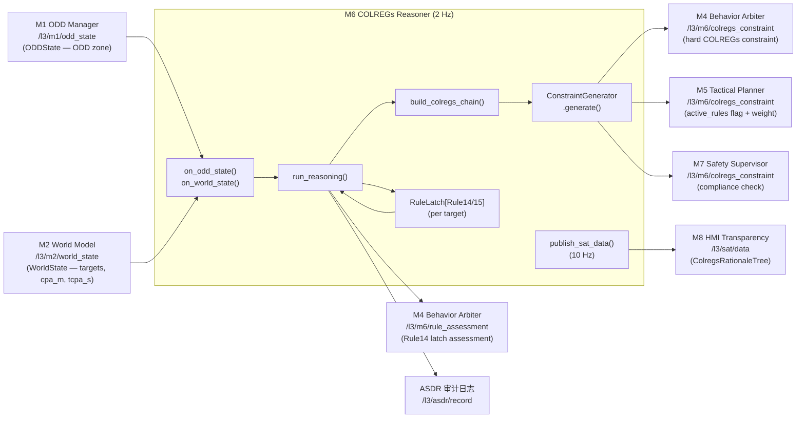
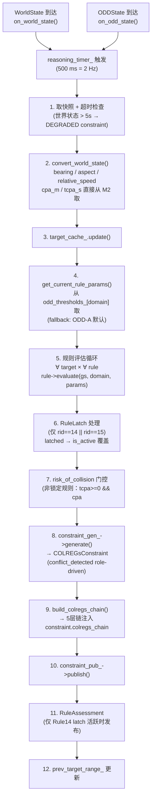
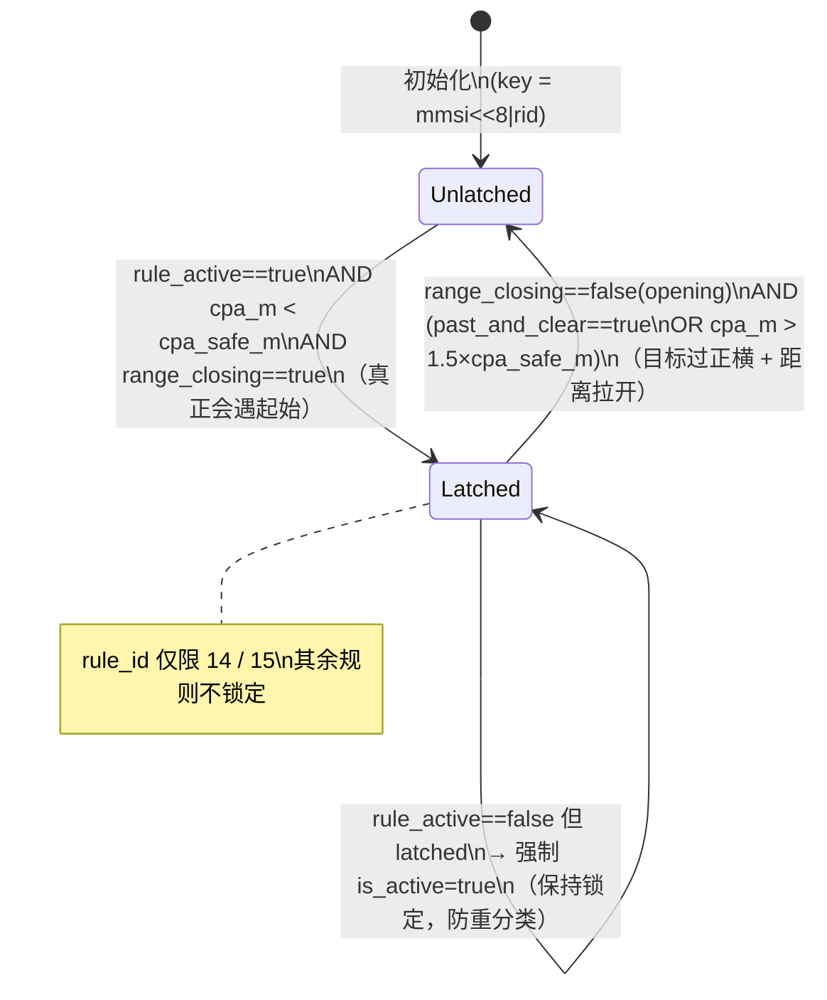

# M6 · COLREGs Reasoner · Spec（权威设计目标）

> **定位声明**：本文是 M6 的**权威设计目标**，依据架构报告 §9（第九章 M6 — COLREGs Reasoner）。描述应然的系统流程 / 功能 / 数据交互；**不含 SIL bridge 等过渡创可贴**（那些是实现层的临时偏离，记在 progress.md）。当前实现现状与偏离见同目录 M6-progress.md。

---

## 1. 模块身份

| 属性 | 值 |
|---|---|
| 模块代号 | M6 |
| 职责一句话 | ODD-aware COLREGs 规则推理（Rule 5–19）+ 5 层决策溯源链生成，输出责任角色/方向/时机约束供 M4/M5 消费 |
| 时间尺度 | 中时（设计目标 1 Hz；当前实现 2 Hz） |
| SIL 等级 | SIL-1（PATH-D）|
| 实现路径 | PATH-D（可分性 + 独立可验证） |
| colcon 包 | `src/l3_tdl_kernel/m6_colregs_reasoner` |
| 架构报告章节 | §9（第九章） |
| 节点入口文件 | `src/l3_tdl_kernel/m6_colregs_reasoner/src/colregs_reasoner_node.cpp` |

---

## 2. 职责与边界

### 2.1 本模块拥有的职责

- **ODD-aware 规则集选择**：从 M1 ODD_STATE 取当前域（ODD-A/B/C/D），选取适用规则集和阈值参数集（`t_standOn_s`、`t_act_s`、`t_emergency_s`、`cpa_safe_m`、`min_alteration_deg`）
- **会遇分类**（第 2 层）：按 IMO COLREGs 几何扇区判定 Rule 13 追越 / Rule 14 对遇 / Rule 15 交叉 / Rule 19 能见度不良；ODD-D 时 Rule 19 覆盖 Rule 13–17
- **责任分配**（第 3 层）：确定本船角色：GIVE_WAY / STAND_ON / BOTH_GIVE_WAY / FREE；Rule 18 船型优先序
- **行动方向生成**（第 4 层）：Rule 8 "大幅早行动"——首选大幅右转（≥ min_alteration_deg），减速次之；输出 `primary_preferred_direction` 和 `numeric_value`（最小转向幅度/度）
- **时机判定**（第 5 层）：Rule 17 直航船三阶段（STAGE_1 保向 / STAGE_2 发声警告 / STAGE_3 独立避让），由 TCPA 与 `t_standOn_s`、`t_act_s` 阈值决定
- **5 层溯源链构建**：`build_colregs_chain()` 生成 `ColregsChainLayer[5]`，附 confidence / rationale，注入 `COLREGsConstraint.colregs_chain`
- **RuleLatch 滞后（Rule 13(d)）**：Rule 14 / Rule 15 会遇一旦锁定，避让机动中不重新分类；释放条件：目标过正横 + 距离拉开，或 CPA > 1.5×cpa_safe
- **risk_of_collision 门控**：非锁定规则仅在 `tcpa_s ≥ 0 && cpa_m < cpa_safe_m` 时激活，防止已通过目标持续触发 conflict_detected
- **conflict_detected 派生**（交由 ConstraintGenerator）：role == GIVE_WAY || BOTH_GIVE_WAY || (STAND_ON && CRITICAL_PHASE) → 角色驱动，不依赖规则 ID 过滤（ADR-1 合规）
- **CMM 三接口输出**：`current_state()`（SAT-1 摘要）/ `rationale()`（每条约束 rationale 字段）/ `forecast(Δt)+uncertainty()`（SAT-3，应然：依活跃相位和 TCPA 动态计算）
- **ASDR 记录**：每次推理快照、世界状态超时降级事件均写入 `/l3/asdr/record`

### 2.2 明确不负责的

- **航向/速度指令生成**：属于 M5 Tactical Planner（MPC 优化）和 L4 Guidance Layer。M6 只提供方向性约束和角色判定，不计算具体控制量（ADR-3）
- **IvP 行为仲裁**：属于 M4 Behavior Arbiter；M4 将 M6 约束作为硬约束注入 IvP 求解器
- **CPA/TCPA 几何计算**：属于 M2 World Model（M6 直接读取 `TrackedTarget.cpa_m`、`tcpa_s`，不应自行计算）[TBD-HAZID：当前 cpa_m/tcpa_s 由 SIL bridge 置零，M2 未推算，M6 收到的值为 0.0，Rule 推理基于错误输入]
- **硬性航向 clamp（60° 上限）**：应属 M6 ConstraintGenerator（作为 `numeric_value` 上限）或 M5 MPC 状态约束；**当前错误地在 SIL bridge 实现**（bridge:653-660）——该逻辑应归位 M6/M5
- **ODD 包络状态仲裁**：属于 M1 ODD Envelope Manager
- **船型常量（如 SHIP_LENGTH_M）**：ADR-4 Backseat Driver 要求决策核心零船型常量；M6 通过 CapabilityManifest 读取，禁止硬编码

---

## 3. 接口契约（数据交互）

### 3.1 上游订阅

| topic | msg_type | 来源模块 | 频率 | 用途 |
|---|---|---|---|---|
| `/l3/m1/odd_state` | `l3_msgs/ODDState` | M1 ODD Manager | 事件驱动（ODD 转变时） | 取 `current_zone` → ODD 域 → 激活规则集 + 阈值参数集 |
| `/l3/m2/world_state` | `l3_msgs/WorldState` | M2 World Model | 10 Hz | 取每个目标的 `bearing_deg`、`cpa_m`、`tcpa_s`、`rng_m`、`heading_deg`、`sog_kn`、`classification` 驱动推理 |

### 3.2 下游发布

| topic | msg_type | 消费模块 | 频率 | 关键字段 |
|---|---|---|---|---|
| `/l3/m6/colregs_constraint` | `l3_msgs/COLREGsConstraint` | M4 Behavior Arbiter（硬约束）、M5 Tactical Planner（约束+权重）、M7 Safety Supervisor（合规核查）| 1 Hz（设计）/ 2 Hz（当前）| `phase`、`primary_role`、`conflict_detected`、`primary_preferred_direction`、`active_rules[]`、`constraints[]{numeric_value,unit}`、`colregs_chain[5]`、`confidence`、`rationale` |
| `/l3/m6/rule_assessment` | `l3_msgs/RuleAssessment` | M4（存储 `latest_rule_assessment_`） | 事件驱动（锁定周期内每推理帧） | `applicable_rule`、`expected_action`、`confidence`、`trigger_conditions[]`、`target_mmsi` |
| `/l3/sat/data` | `l3_msgs/SATData` | M8 HMI（ColregsRationaleTree 透明度层）| 10 Hz | `sat1.state_summary`、`sat2.reasoning_chain`、`sat2.colregs_chain[5]`（DEMO-2 P0 缺失）、`sat3.predicted_state`、`sat3.tmr_s` |
| `/l3/asdr/record` | `l3_msgs/ASDRRecord` | ASDR 审计日志 | 2 Hz 快照 + 事件 | `source_module`、`decision_type`、`decision_json`、`stamp` |

### 3.3 CMM 契约

每条出消息须带 `stamp` + `schema_version` + `confidence∈[0,1]` + `rationale`：

| 出消息 | stamp | schema_version | confidence | rationale |
|---|---|---|---|---|
| `COLREGsConstraint` | `constraint.stamp = now()` | 应为 114（架构报告 §15.1）；**当前恒 0** | `ws_confidence` 透传 | 最高紧迫度规则 rationale |
| `RuleAssessment` | `assessment.stamp = now()` | **RuleAssessment.msg 缺 schema_version 字段** [TBD-HAZID：msg 待补] | 0.91f（hardcoded） | trigger_conditions 字符串列表 |
| `SATData` | `msg.stamp = now()` | **未填，恒 0** | `ws_confidence`（sat2）/ 0.5（sat3 hardcoded）| sat2.reasoning_chain（当前空串）|
| `ASDRRecord` | `msg.stamp = now()` | N/A（ASDRRecord 无此字段）| N/A | `decision_json` | 

### 3.4 数据流图（IO）

---

## 4. 内部系统流程（功能实现）

### 4.1 子能力分解

| 子能力 | 主要组件 | 输入 | 输出 |
|---|---|---|---|
| ODD-aware 参数加载 | `load_odd_thresholds()` + `odd_aware_thresholds.yaml` | ODD 域 | `RuleParameters`（t_standOn_s / t_act_s / cpa_safe_m / min_alteration_deg）|
| 目标几何状态转换 | `convert_world_state()` | `WorldState.targets[]` | `TargetGeometricState[]`（bearing、aspect、relative_speed、cpa_m、tcpa_s）|
| 目标缓存管理 | `TargetStateCache.update()` | `TargetGeometricState[]` | 缓存滑动窗口（max 50 目标） |
| 规则评估循环 | 每条 `ColregsRuleBase.evaluate()` × 每个目标 | `TargetGeometricState` + ODD 域 + `RuleParameters` | `RuleEvaluation`（is_active / role / phase / encounter_type / min_alteration_deg）|
| RuleLatch 滞后 | `RuleLatch.update()`（Rule14 / Rule15 per-target per-rule key） | CPA、range_closing、past_and_clear | latched 布尔 → 覆盖 eval.is_active |
| risk_of_collision 门控 | run_reasoning:571–575 | tcpa_s、cpa_m、cpa_safe_m | 非锁定规则失活 |
| 约束生成 | `ConstraintGenerator.generate()` | `RuleEvaluation[]` + `RuleParameters` + ws_confidence | `COLREGsConstraint` |
| 5 层链构建 | `build_colregs_chain()` | `RuleEvaluation[]` + ODD 域 + params + targets | `ColregsChainLayer[5]` |
| RuleAssessment 发布 | run_reasoning:608–624 | Rule14 latch state + primary target MMSI | `RuleAssessment`（仅 Rule14 锁定时）|
| SAT 数据发布 | `publish_sat_data()` | target_cache.size()、ws_confidence、ODD 域 | `SATData`（sat1 / sat2 / sat3）|
| 健康检查 | `check_health()` | ODD stamp age、WorldState stamp age | ASDR health_degraded 记录 |
| ASDR 快照 | `publish_asdr_snapshot()` | target_count、odd_domain、rules.size() | `ASDRRecord` snapshot |

### 4.2 推理流水线

### 4.3 RuleLatch 状态机

---

## 5. 关键算法 / 数据结构（设计层面）

### 5.1 5 层决策链（架构报告 §9.2）

| 层 | 标签 | 判定内容 | 关键输入 |
|---|---|---|---|
| 1 | `rule_identification` | 适用规则 + ODD 域 | encounter_type、odd_domain |
| 2 | `geometric_classification` | 几何分类（HEAD-ON / CROSSING / OVERTAKING 等）+ geometry_clarity | relative_bearing_deg、aspect_deg、cpa_m、tcpa_s |
| 3 | `action_determination` | 本船角色（GIVE-WAY / STAND-ON 等）+ 规则编号 | role、rule_id |
| 4 | `priority_resolution` | 多规则优先序解析（单一或 Rule 链）| active_rule_count |
| 5 | `compliance_check` | 合规判定 + 升级标志（INDEPENDENT_ACTION / CRITICAL_ACTION）| cpa_m vs cpa_safe_m、TimingPhase |

### 5.2 ODD-aware 参数量化（架构报告 §9.3）

| 参数 | ODD-A | ODD-B | ODD-D | 备注 |
|---|---|---|---|---|
| `t_standOn_s` | 480 s（8 min）| 360 s（6 min）| 600 s（10 min）| Wang et al. 2021 [R17] |
| `t_act_s` | 240 s（4 min）| 180 s（3 min）| 300 s（5 min）| Wang et al. 2021 [R17] |
| `t_emergency_s` | 60 s | 45 s | 90 s | 保守估计 |
| `min_alteration_deg` | 30° | 20° | 30° | Rule 8 "大幅"工业实操 |
| `cpa_safe_m` | 1 852 m（1 nm）| 556 m（0.3 nm）| — | ODD-B 狭水道 |
| Rule 19 触发阈值 | — | — | 1 852 m（1.0 nm）| COLREG Rule 19(b) 字面值（固定）|

[TBD-HAZID]：以上参数在 HAZID RUN-001（2026-08-19）以 FCB 实测数据校准后回填 v1.1.3。

### 5.3 encounter_type 几何扇区

| 规则 | 扇区（相对舷角） | 条件 |
|---|---|---|
| Rule 14 HEAD-ON | 舷角 < 22.5° 且 对方航向差 170–190° | 双方均应右转 |
| Rule 13 OVERTAKING | 目标相对本船尾弧：112.5°–247.5° | 本船追越，让路 |
| Rule 15 CROSSING | 其余（含模糊区） | 左舷来船通常有优先权 |
| Rule 19 | ODD-D 且 vis < 1 nm | 覆盖 Rule 13–17 |

### 5.4 ConstraintGenerator conflict_detected 逻辑

`requires_action()` 条件（`colregs_constraint_generator.cpp:30–35`）：
- `role == GIVE_WAY`
- `role == BOTH_GIVE_WAY`
- `role == STAND_ON && phase == CRITICAL_ACTION`

纯角色驱动，无规则 ID 过滤（D5 修复 d8b0c608，已固化）。

---

## 6. 降级路径

| 情景 | 应然行为 |
|---|---|
| 世界状态超时（> 5 s） | 发布 `phase="DEGRADED"` 约束，confidence=0.5，附 stale age；写 ASDR `world_state_stale` 记录；不推理 |
| ODD 状态超时（> 10 s）| 回退 ODD-A 参数集推理；写 ASDR `health_degraded` 记录 |
| ODD 域 = ODD-D（能见度不良）| Rule 19 激活并覆盖 Rule 13–17；t_standOn_s / t_act_s 加严 |
| M2 CPA/TCPA 全零（当前 SIL 问题）| [TBD-impl]：规则评估以 CPA=0 执行，全部目标均触发 risk_of_collision，conflict_detected 恒 true；应然：M2 须提供真实 CPA/TCPA，bridge 创可贴修复后此降级自动消除 |
| 规则库加载失败 | `RCLCPP_FATAL` + `throw std::runtime_error`；节点不启动 |
| 目标缓存满（> max_targets=50） | 最老目标淘汰（LRU）|

---

## 7. 顶层约束

| 约束来源 | 适用条目 |
|---|---|
| ADR-1 ODD 唯一权威 | M1 ODD_STATE 是规则集选择和阈值参数的唯一来源；M6 不得自维护"是否安全"的 ODD 判断 |
| ADR-3 CMM 三接口 | 每条出消息须带 stamp + schema_version + confidence + rationale；`/l3/sat/data` SAT-3 须计算真实 forecast，不得硬编码 "nominal" |
| ADR-4 Backseat Driver | 决策核心零船型常量；`min_alteration_deg`、`cpa_safe_m` 等参数从 YAML + ODD zone 读取，禁止 `if vessel_class == FCB` 分支 |
| IMO COLREGs [R18] | Rule 5–19 按 IMO 1972（现行版）实现；Rule 13(d) 锁定语义由 RuleLatch 保证 |
| RFC-001（M5 N=18 锁定）| M6 推理频率 / 时间窗口应与 M5 MPC 90 s 时域对齐 |
| 架构报告 §9.3 文献基线 | t_standOn_s / t_act_s 来源 Wang et al. 2021 [R17]；Rule 19 阈值 1.0 nm 固定不接受 HAZID 调整 |

---

## 8. 关联 D 任务

详见 [M6-progress.md](M6-progress.md) D 任务联动表。

- **D1.4**：M6 基础推理引擎上线（已关闭 2026-05-20）
- **D2.4**：Rule 5–19 完整推理 + SAT-2 colregs_chain 序列化输出（当前分支）
- **D2.5**：前端 ColregsRationaleTree（依赖 D2.4 SAT-2 序列化）
- **D1.7**：6 维度评分 rubric（M6 rule chain 覆盖率）

---

## 9. 修订

| 日期 | 变更 |
|---|---|
| 2026-05-20 | 初版 spec stub |
| 2026-06-08 | 依架构报告 §9 + 系统审计重写 spec（剔除创可贴，补全流程 / 接口 / 数据 / 降级路径；增加 4 张 mermaid 图）|
