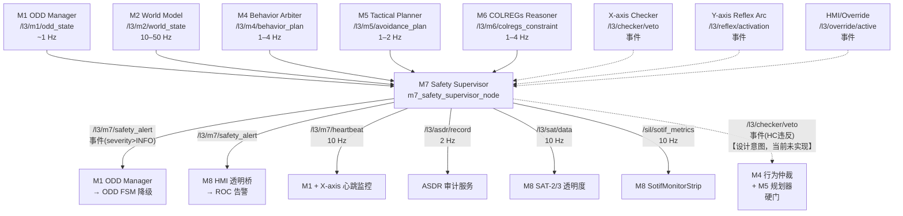
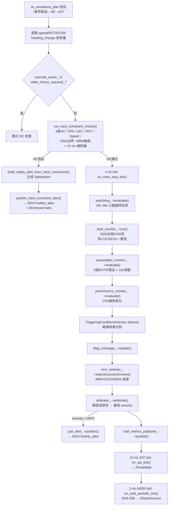
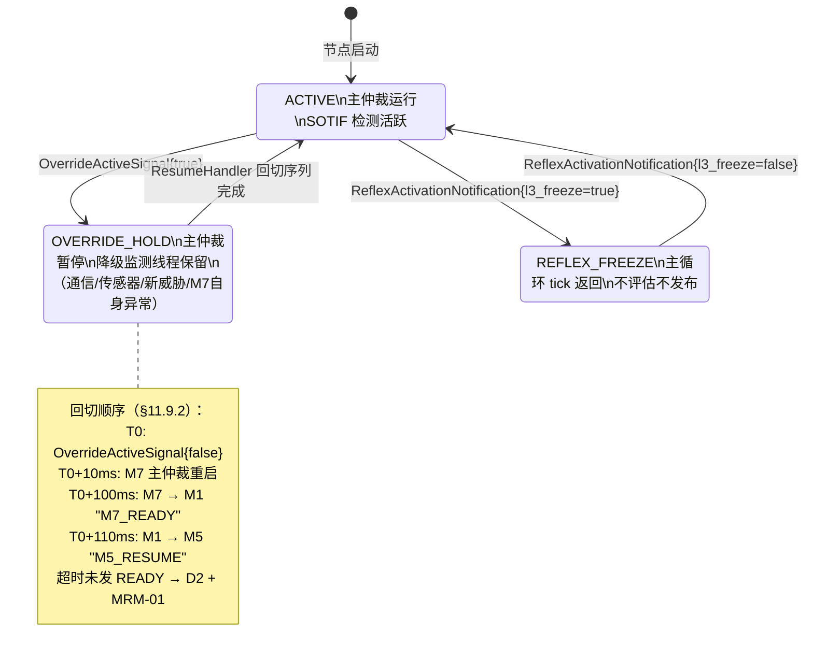

# M7 · Safety Supervisor · Spec

> **定位声明**：本文是 M7 的**权威设计目标**，依据架构报告 §11（第十一章 M7 — Safety Supervisor，v1.1.3-pre-stub）。描述应然的系统流程、功能与数据交互。**不含 SIL bridge 等过渡创可贴**（那些是实现层临时偏离，记在 M7-progress.md）。**不含 CCS 认证映射、FMEDA 表、IEC 61508 SIL 认证审计**（用户指示暂停认证内容）。当前实现现状与偏离见同目录 M7-progress.md。

---

## 1. 模块身份

| 属性 | 值 |
|---|---|
| 模块代号 | M7 |
| 职责一句话 | Doer-Checker 中的 Checker 角色：对 M1–M6 输出进行独立安全监督，实施 6 类硬约束检查 + IEC 61508 双轨监控 + SOTIF 假设违反检测，触发 MRM 预定义命令集 |
| 时间尺度 | 短时（主循环 4 Hz；HC 检查事件触发 < 10 ms 端到端；SAT/heartbeat 10 Hz；ASDR 2 Hz）|
| SIL 等级 | **SIL 2**（PATH-S 严格路径）|
| 实现路径 | **PATH-S**（与 M1 并列；实现路径独立于 M1–M6，不共享代码/库/数据结构）|
| colcon 包 | `src/l3_tdl_kernel/m7_safety_supervisor` |
| 架构报告章节 | §11（第十一章），v1.1.3-pre-stub |
| 节点入口文件 | `src/l3_tdl_kernel/m7_safety_supervisor/src/safety_supervisor_node.cpp` |

---

## 2. 职责与边界

### 2.1 本模块拥有的职责

- **Doer 输出独立校验**：订阅 M1–M6 输出，独立重新评估安全约束（不复用 Doer 代码路径）
- **6 类硬约束（HC）检查**（见 §4）：每当 M5 AvoidancePlan 到达时触发，< 10 ms 内完成
- **IEC 61508 看门狗**：检测 M1–M6 心跳超时（tolerance × 1.5 周期），产生 SEVERITY_CRITICAL 告警
- **IEC 61508 故障监控（FaultMonitor）**：校验 ODDState 合规分数域值、CPA 符号一致性、COLREGs/目标匹配一致性
- **SOTIF 假设违反检测（AssumptionMonitor）**：6 类假设，15 s 滑窗（RFC-003）
- **SOTIF 性能退化检测（PerformanceMonitor）**：CPA 趋势恶化
- **SOTIF 触发条件识别（TriggeringConditionDetector）**：极端场景识别
- **MRM 仲裁与触发**：SafetyArbitrator 聚合所有告警候选后选最高优先级，发布 SafetyAlert（含 recommended_mrm 索引），**不直接注入轨迹**
- **ASDR 审计轨迹**：SHA-256 签名记录，2 Hz 持续发布
- **SAT-2/3 透明度数据**：向 M8 提供安全仲裁决策透明性（10 Hz）
- **接管协议（ResumeHandler）**：接管期间暂停主仲裁但保留降级监测；回切时 M7 先于 M5 启动（≥ 100 ms 间隔，§11.9.2）
- **X-axis Checker 协调**：接收 CheckerVetoNotification，统计否决率（100 周期滑窗），纳入 SOTIF 假设 #6

### 2.2 明确不负责的事项

- **不做规划与轨迹生成**：M7 仅触发 MRM 预定义命令集索引（ADR-001；架构报告 §11.2/§11.6）。"安全轨迹注入"属 v1.0 废弃设计
- **不持有船型常量**：M7 不内嵌 FCB SHIP_LENGTH / Kp / MAX_RUDDER 等参数（ADR-4 Backseat Driver；这些参数由 M5 从 Capability Manifest 读取）
- **不做控制输出**：ψ_cmd / u_cmd / ROT 归 M5（ADR-3 CMM 接口）
- **不做避碰 latch/航向 clamp/回航 XTE 控制**：这些应在 M4（行为切换）、M5（NLP bounds）、M6（最小转向幅度）；当前越界逻辑在 sil_topic_bridge.py（记录于 M7-progress.md §5，**归属错误**）
- **不做 COLREGs 规则推理**：规则推理归 M6（ADR-1 ODD 唯一权威 + M6 职责边界）
- **不直接驱动 M4/M5 停止**：M7 → M1 发 SafetyAlert，由 M1 仲裁后经 ODD 状态机间接影响 M4/M5（ADR-1；M1 是唯一行为切换权威）

---

## 3. 接口契约（数据交互）

### 3.1 上游订阅

| topic | msg_type | 来源模块 | 频率 | 用途 |
|---|---|---|---|---|
| `/l3/m1/odd_state` | `l3_msgs/ODDState` | M1 ODD Manager | ~1 Hz | 存入 `last_odd_`；喂 watchdog kM1 + AssumptionMonitor + MrmSelector |
| `/l3/m2/world_state` | `l3_msgs/WorldState` | M2 World Model | 10–50 Hz | 存入 `last_world_`；喂 watchdog kM2 + FaultMonitor + PerformanceMonitor + AssumptionMonitor |
| `/l3/m4/behavior_plan` | `l3_msgs/BehaviorPlan` | M4 Behavior Arbiter | 1–4 Hz | watchdog kM4 心跳；**M4 plan 内容应检查速度/ROT/行为约束违反（当前未实现）** |
| `/l3/m5/avoidance_plan` | `l3_msgs/AvoidancePlan` | M5 Tactical Planner | 1–2 Hz | 存入 `last_avoidance_`；触发 `run_hard_constraint_checks()`（应从 plan 提取速度/ROT/DCPA/航向变化量）；watchdog kM5 |
| `/l3/m6/colregs_constraint` | `l3_msgs/COLREGsConstraint` | M6 COLREGs Reasoner | 1–4 Hz | 存入 `last_colregs_`；rule_id 映射为 `ColregsRule` enum；喂 AssumptionMonitor（HC-2 COLREGs 几何校验）；watchdog kM6 |
| `/l3/checker/veto` | `l3_external_msgs/CheckerVetoNotification` | X-axis Deterministic Checker（系统级外部）| 事件 | 否决计数 CheckerVetoCounter；纳入 SOTIF 假设 #6 否决率 |
| `/l3/m4/reactive_override_cmd` | `l3_msgs/ReactiveOverrideCmd` | M4 | 事件 | watchdog kM3 心跳（代理 M3 消息到达） |
| `/l3/reflex/activation` | `l3_external_msgs/ReflexActivationNotification` | Y-axis Reflex Arc | 事件 | 设置 `reflex_freeze_required_` 标志；冻结主循环评估 |
| `/l3/override/active` | `l3_external_msgs/OverrideActiveSignal` | HMI/Hardware Override | 事件 | 设置 `override_active_`；触发 ResumeHandler |
| `/l3/safety/concern` | `l3_msgs/SafetyConcernEvent` | M1（W9 watchdog）| 事件 | 接收 M5 发给 M7 的功能不足事件（Doer→Checker 报告协议，§11.6 指挥链）|

### 3.2 下游发布

| topic | msg_type | 消费模块 | 频率 | 关键字段 |
|---|---|---|---|---|
| `/l3/m7/safety_alert` | `l3_msgs/SafetyAlert` | M1（ODD FSM 降级）、M8（HMI 告警）| 事件（severity > INFO 时）| stamp, severity, confidence, rationale, description, recommended_mrm；**schema_version 必须填充**（设计要求；当前实现缺失）|
| `/l3/m7/heartbeat` | `std_msgs/Header` | M1、X-axis Checker（系统级监控）| 10 Hz | stamp, frame_id |
| `/l3/asdr/record` | `l3_msgs/ASDRRecord` | ASDR 审计服务 | 2 Hz | SHA-256 签名 decision_json |
| `/l3/sat/data` | `l3_msgs/SATData` | M8 HMI 透明桥 | 10 Hz | sat2（IvP 贡献权重）、sat3（预测轨迹）、SAT-2 reasoning_chain |
| `/sil/sotif_metrics` | `SotifMetrics` | M8 HMI（SotifMonitorStrip）| 10 Hz | 6 × `SotifMetricEntry`（assumption_id, violation_score, window_count, is_violated, raw_value）|
| `/l3/checker/veto` | `l3_external_msgs/CheckerVetoNotification` | M4、M5（硬门设计意图）| 事件（HC 违反时）| veto_reason_class（enum）、veto_reason_detail（ASDR 用，M7 不解析）|

> **注**：`/l3/checker/veto` 的**发布方**在设计上应为 M7（HC 违反 → VETO），当前实现中 M7 仅订阅该 topic（见 M7-progress.md §4 CRITICAL 缺陷）。

### 3.3 CMM 契约

架构报告 §3 要求所有出消息携带 `stamp + schema_version + confidence∈[0,1] + rationale`：

| 出消息 topic | stamp | schema_version | confidence | rationale |
|---|---|---|---|---|
| `/l3/m7/safety_alert` | ROS2 时戳，build_ros_stamp() 填充 | **应填充**（当前实现永久为 0，见 progress §4）| AlertCandidate.confidence（从 SafetyArbitrator 传入）| AlertCandidate.rationale（静态字面量，供 ASDR 审计）|
| `/l3/asdr/record` | 2 Hz 定时生成 | 应填充 | N/A（审计记录无置信度语义）| SHA-256 decision_json |
| `/l3/sat/data` | 10 Hz 定时生成 | 应填充 | sat2/sat3 各自置信度 | reasoning_chain（当前仅周期 tick 时为空）|
| `/sil/sotif_metrics` | SotifMetricsPublisher 内生成 | 应填充（`schema_version=113` 已在 stub 分支中设置）| is_violated 布尔 | 6 × assumption_id 标识语义 |

### 3.4 IO 数据流图

---

## 4. 内部系统流程（功能实现）

### 4.1 子能力分解

| 子系统 | 类/文件 | 触发方式 |
|---|---|---|
| HC 硬约束校验 | `core/hard_constraint_*.cpp` | on_avoidance_plan 到达（事件驱动）|
| IEC 61508 看门狗 | `iec61508/watchdog_monitor.cpp` | 每条订阅回调更新；4 Hz tick 评估 |
| IEC 61508 故障监控 | `iec61508/fault_monitor.cpp` | 4 Hz 主循环 |
| SOTIF 假设违反检测 | `sotif/assumption_monitor.cpp` | 4 Hz 主循环（15 s 滑窗）|
| SOTIF 性能退化 | `sotif/performance_monitor.cpp` | 4 Hz 主循环 |
| SOTIF 触发条件识别 | `sotif/triggering_condition_detector.cpp` | 4 Hz 主循环 |
| MRM 选择 | `mrm/mrm_selector.cpp` | 4 Hz 主循环，依赖 ScenarioContext |
| 安全仲裁 | `arbitrator/safety_arbitrator.cpp` | 4 Hz 主循环，聚合所有候选 |
| HC Veto 发布 | `setup_publishers()` 中声明 pub_veto_ | HC 违反时同步发布（**设计应然**）|
| CheckerVeto 统计 | `sotif/checker_veto_counter.cpp` | veto 事件到达 + 4 Hz 滑窗 tick |
| ResumeHandler | `core/resume_handler.cpp` | override_signal 事件 |
| ASDR 签名 | `common/sha256.cpp` + `alert_generator.cpp` | 2 Hz 定时 |
| SAT 发布 | `alert_generator.cpp` 构建 | 10 Hz 定时 |
| SOTIF metrics 发布 | `sotif/sotif_metrics_publisher.cpp` | 10 Hz 定时（4 Hz 主循环喂数据）|

### 4.2 主循环处理流水线

### 4.3 HC 检查六类约束

| HC 编号 | 约束内容 | 检查函数 | 数据来源 | 响应 |
|---|---|---|---|---|
| HC-1 | CPA 最小距离 | `check_cpa_consistency()` | M5 AvoidancePlan.dcpa | SEVERITY_MRC_REQUIRED + MRM-01/03 |
| HC-2 | UKC（under-keel clearance）| [TBD-HAZID-UKC：HC-2 实现文件缺失] | M2 WorldState（水深字段）+ AvoidancePlan draft | SEVERITY_CRITICAL + MRM-01 |
| HC-3 | ROT 上限 | `check_rot_limit()` | M5 AvoidancePlan.rot | SEVERITY_HIGH + MRM-01 |
| HC-4 | 速度上限 | `check_speed_limit()` | M5 AvoidancePlan.speed | SEVERITY_HIGH + MRM-01 |
| HC-5 | ODD 边界 | [TBD-HAZID-ODD-HC：M7 独立 ODD 边界检查缺失] | M1 ODDState.conformance_score | SEVERITY_MRC_REQUIRED + MRM-02 |
| HC-6 | MRM 触发条件 | `mrm_selector_->select()` | ScenarioContext（综合 SOTIF + 看门狗）| 对应 MRM 命令集 |

> **注**：HC 检查必须使用**独立路径**——不复用 M6 COLREGs 推理代码，不复用 M2 CPA 计算代码（ADR-2 Doer-Checker 实现路径独立）。

### 4.4 SOTIF 假设违反检测（6 类，15 s 滑窗）

| # | 假设 | 监控指标 | 违反阈值 | MRM 响应 |
|---|---|---|---|---|
| 1 | AIS/雷达一致性 | WorldState.confidence 持续低 | < fusion_confidence_low 持续 ≥ ais_radar_duration_threshold | MRM-01 降速 |
| 2 | 目标运动可预测性 | WorldState.confidence 代理（[TBD-HAZID-SOTIF-002]：待 M2 暴露预测 RMSE 字段）| < 0.4 持续 ≥ motion_window | CPA 安全边距 × 1.3 |
| 3 | 感知覆盖充分性 | unknown 目标比例（[TBD-HAZID-SOTIF-003]：待 M2 暴露 blind_zone_fraction 字段）| > max_blind_zone_fraction | D4/D3 允许等级降级 |
| 4 | COLREGs 可解析性 | colregs.confidence 连续低次数 | 连续 ≥ colregs_consecutive_failure_count | MRM-01 + ROC 告警 |
| 5 | 通信链路可用性 | CommLinkState.rtt_s / packet_loss_pct | RTT > 2 s 或丢包 > 20%（[TBD-comm-monitor]：当前无发布方）| TMR 窗口收窄；D4 不允许 |
| 6 | X-axis Checker 否决率 | CheckerVetoCounter（100 周期 = 15 s 滑窗，RFC-003 锁定）| > 20 次/100 周期 | SOTIF 升级告警 + D2 降级评估 |

### 4.5 MRM 命令集（4 预定义，§11.6）

| 索引 | 命令 | 触发场景 | 参数（初始设计值，HAZID 校准）|
|---|---|---|---|
| MRM-01 | 减速至安全速度维持航向 | 一般 PERF 退化 / SOTIF 告警 | 目标 4 kn，减速 ≤ 30 s |
| MRM-02 | 停车（速度 → 0）| 连续假设违反 / Checker 多次否决 | 推力归零，漂航 |
| MRM-03 | 紧急转向 | CPA 急剧恶化（PERF 紧急级）| ±60°，ROT = 0.8 × ROT_max |
| MRM-04 | 抛锚序列 | 港内/近岸 + 系统失能 | 水深 ≤ 30 m + 船速 ≤ 4 kn |

### 4.6 接管（Override）状态机

---

## 5. 关键算法与数据结构（设计层面）

- **SafetyArbitrator**：固定大小候选池（kMaxAlertCandidates=8），插入排序（无堆分配，4 Hz 实时路径安全）；最高 severity 候选胜出
- **WatchdogMonitor**：per-module `last_received_` 时间点数组；超时 = 期望周期 × 1.5；容忍计数 3（M3 为 2）；tolerance 连续溢出 → CRITICAL
- **CheckerVetoCounter**：100 元素滑窗（bool 队列）；current_rate() = 窗口内 true 数量；RFC-003 锁定 15 s = 100 周期（M7 @ ~6.7 Hz 周期）
- **AssumptionMonitor**：per-assumption 状态跟踪（onset 时间戳 + tracking 布尔 + 计数器）；evaluate() 返回 AssumptionStatus（6×violation_active + 6×violation_metric + total_violation_count）
- **SHA-256（ASDR）**：common/sha256.cpp 独立实现；alert_generator.cpp:44-47 对 decision_json 计算摘要；不依赖 OpenSSL（PATH-S SBOM 独立性约束）
- **MrmSelector**：输入 ScenarioContext{AssumptionStatus, WatchdogResult, PerfStatus} + ODDState + WorldState；四种 MrmId 枚举输出
- **Doer-Checker 三量化矩阵**（设计约束）：LOC 比 ≥ 50:1、圈复杂度比 ≥ 30:1、SBOM ∩ = ∅（no OR-Tools in M7）

---

## 6. 降级路径

| 场景 | M7 行为 |
|---|---|
| **正常（ACTIVE）** | 4 Hz 主循环运行；HC 事件检查；alert 仅在 severity > INFO 时发布；heartbeat 10 Hz |
| **某 Doer 心跳超时（watchdog）** | 发布 SEVERITY_CRITICAL SafetyAlert → M1 ODD FSM 降级；recommended_mrm=MRM-01 |
| **多 Doer 超时或 HC 连续违反** | recommended_mrm=MRM-02（停车）|
| **CPA 急剧恶化** | recommended_mrm=MRM-03（紧急转向）|
| **港内失能** | recommended_mrm=MRM-04（抛锚序列）|
| **接管（OVERRIDE）** | 主仲裁暂停；降级监测线程持续（通信/传感器/新威胁/M7心跳）；回切后 M7 先于 M5 启动 |
| **Reflex Arc 激活** | `reflex_freeze_required_=true`；主循环 tick 立即返回；不干预 Y-axis 直连 L5 路径 |
| **M7 自身失效（Fail-Safe）** | 强制触发保守 MRM-01；**禁止 Fail-Silent**；M1 超时未收到 M7_READY → D2 降级（§11.9.2）|
| **OUT-of-ODD** | HC-5 ODD 边界违反 → SEVERITY_MRC_REQUIRED；M7 不判断"是否在 ODD"（判断权归 M1，HC-5 是独立二次校验）|

---

## 7. 顶层约束（ADR 映射）

| 约束 | ADR/RFC | M7 体现 |
|---|---|---|
| ODD = 唯一权威 | ADR-1 | M7 不直接改变行为模式，仅向 M1 报告 SafetyAlert；M1 仲裁后变更 ODD 状态 |
| Doer-Checker 双轨 | ADR-2 | M7 是 Checker；LOC/CC/SBOM 三量化矩阵；实现路径独立；M7 持 VETO 权（发布 CheckerVetoNotification）|
| CMM 三接口 | ADR-3 | M7 通过 /l3/sat/data 提供 rationale()；forecast() 字段 [TBD-SAT3-forecast]；current_state() 通过 SafetyAlert 隐式表达 |
| Backseat Driver | ADR-4 | M7 不持有船型常量；MRM 参数从 Capability Manifest 读取（M5 执行层）|
| M7 监控窗口 = 15 s | RFC-003 | CheckerVetoCounter 100 周期 = 15 s 滑窗（M7 @ ~6.7 Hz）|
| CheckerVetoNotification veto_reason_class = enum | F-NEW-002 | M7 只做 enum 计数聚合，不解析 veto_reason_detail 自由文本 |
| M7 端到端 KPI < 10 ms | 架构报告 §11.2 | HC 检查路径（on_avoidance_plan 触发）必须在 10 ms 内完成 |
| 回切 M7 先于 M5 | F-NEW-006 | ResumeHandler 实施；M7_READY 信号后 M1 才发 M5_RESUME |

---

## 8. 关联 D 任务

详见 M7-progress.md §7 D 任务联动表。

- **D3.3a**（M7-core）：6 HC 实装 + ASDR + ResumeHandler + MRM chain —— **progress 声称 ✅ 但 HC 全为死代码，见 progress §6**
- **D3.3b**（M7-sotif）：SOTIF 假设违反检测 + SotifMetricsPublisher —— **progress 声称 ✅ 但 stub_mode=true 永久，见 progress §6**
- **D2.5**（依赖 M7 sotif_metrics topic）：受 stub_mode 阻塞

---

## 9. 修订

| 日期 | 变更 |
|---|---|
| 2026-05-20 | 初版 spec stub |
| 2026-06-08 | 依架构报告 §11（v1.1.3-pre-stub）+ 系统审计 + codegraph 核查重写 spec（剔除创可贴，补全流程/接口/数据流图/状态机；不含认证/FMEDA 章节）|
