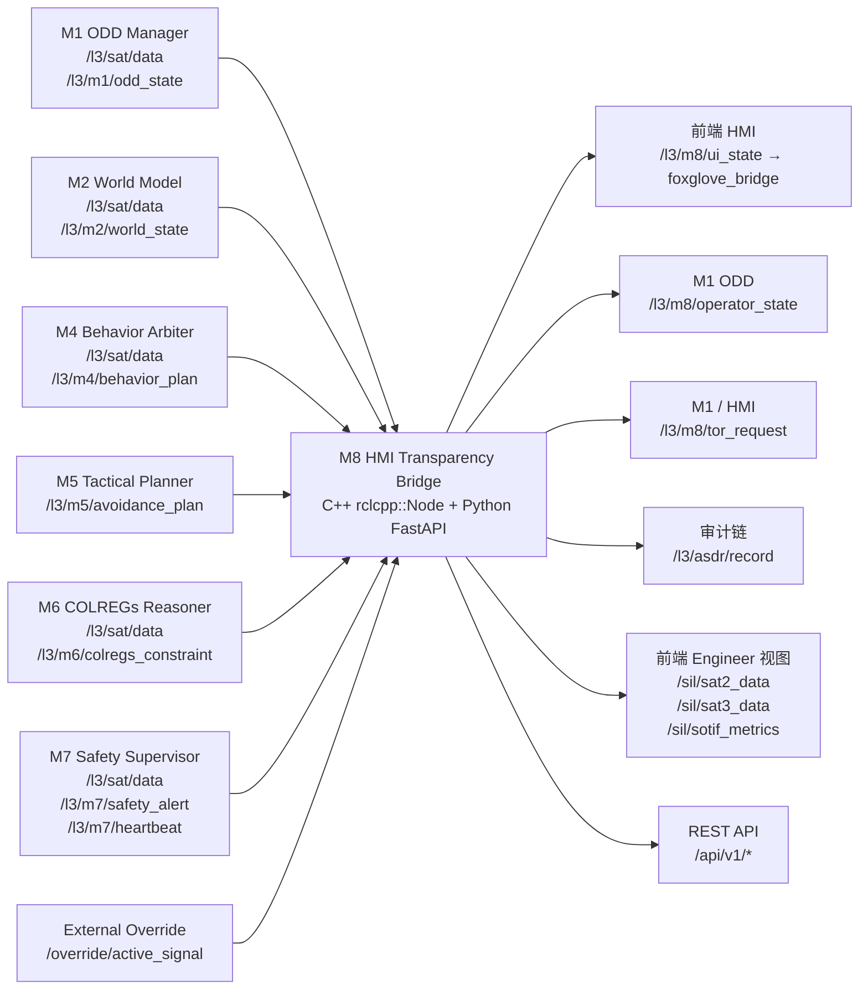
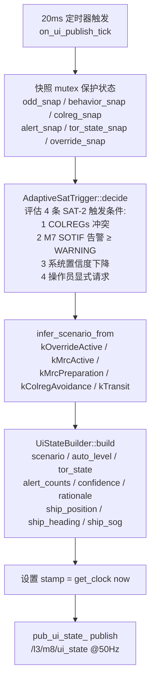
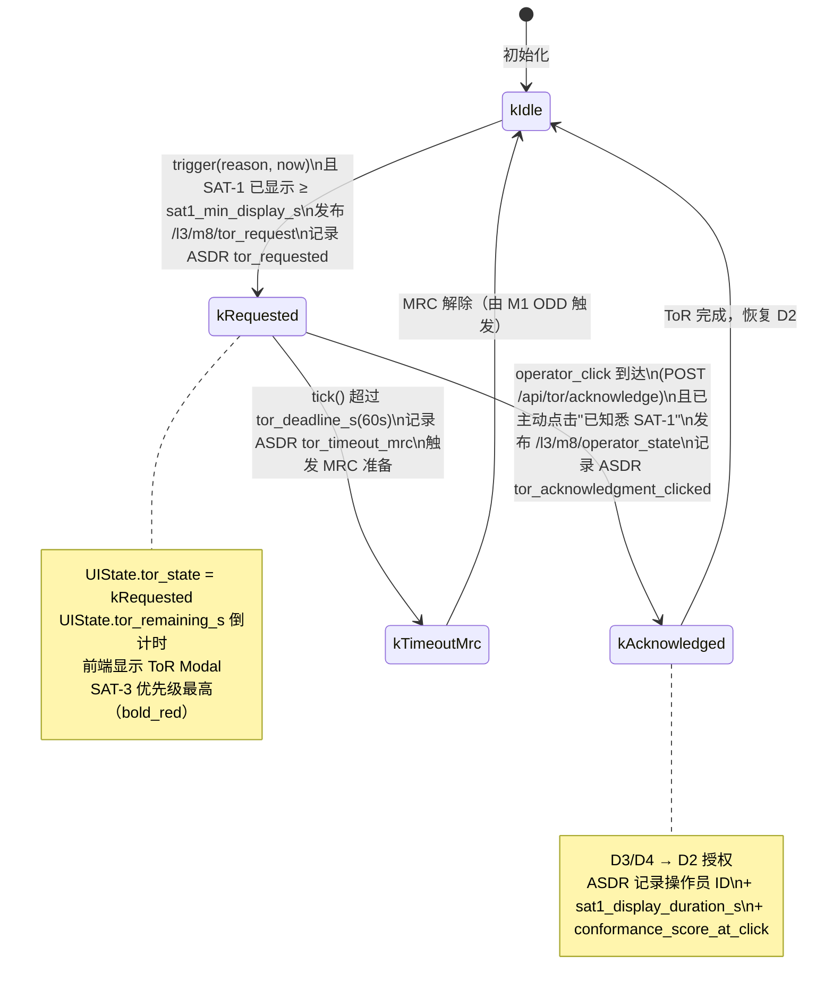

# M8 · HMI / Transparency Bridge · 权威设计目标

> **定位声明**：本文是 M8 的**权威设计目标**，依据架构报告 §12（第十二章）。描述应然的系统流程 / 功能 / 数据交互；**不含 SIL bridge 等过渡创可贴**（那些是实现层的临时偏离，记在 progress.md）。当前实现现状与偏离见同目录 M8-progress.md。

---

## 1. 模块身份

| 属性 | 值 |
|---|---|
| 模块代号 | M8 |
| 职责一句话 | 唯一对 ROC/船长说话的实体：聚合 M1–M7 CMM triplet → SAT-1/2/3 透明性 → ToR 协议 → UIState + ASDR 审计链 |
| 时间尺度 | 50 Hz（UIState 推送）/ 2 Hz（ToR 轮询）/ 事件驱动（告警 burst） |
| SIL 等级 | SIL 1（PATH-S 标签；唯一外向 HMI 接口，非 IEC 61508 核心路径）|
| 实现路径 | C++ `rclcpp::Node`（核心循环 + ToR + ASDR）+ Python FastAPI（REST / WebSocket web 后端）双进程 |
| colcon 包 | `src/l3_tdl_kernel/m8_hmi_transparency_bridge` |
| 架构报告章节 | 第十二章 §12.1–12.6 |
| 节点入口文件 | `src/hmi_transparency_bridge_node.cpp` / `python/web_server/app.py` |

---

## 2. 职责与边界

### 2a. 本模块拥有的职责

- **SAT 聚合器**：以 `/l3/sat/data` SATData 消息为统一入口，按来源模块（M1/M2/M4/M6/M7）缓存 SAT-1/SAT-2/SAT-3 三层 CMM triplet（current_state / rationale / forecast）。
- **自适应 SAT 触发**：依据 §12.2 触发规则决定 SAT-2/SAT-3 是否推送展开（透明度悖论缓解策略 [R5-aug]）。
- **UIState 构建与发布**：50 Hz 周期，构建 `l3_msgs/UIState`（含场景、自主等级、ToR 状态、告警数量、SAT 决策标志），发布至 `/l3/m8/ui_state`。
- **Operator State 发布**：实时发布 `/l3/m8/operator_state`，让 M1（ODD TMR 计算）知晓当前操作员在岗状态。
- **ToR 协议执行**：60 s 截止窗口；SAT-1 最短显示 5 s 后操作员按钮才解锁（交互验证，§12.4.1）；超时触发 MRC 准备。
- **ToR 请求发布**：在 ToR 激活时发布 `/l3/m8/tor_request`，通知 M1/M4/M7 执行行为切换约束。
- **ASDR 事件审计**：对所有决策关键事件（ToR 触发、操作员点击、MRC 超时、快照）签名并发布 `/l3/asdr/record`。
- **模块健康监测**：通过 M7 心跳和 SAT 数据时间戳检测上游模块失联，触发降级行为。
- **Web 后端双通道**：
  - WebSocket：经 `foxglove_bridge` 将 ROS2 topic 推送至前端（`useFoxgloveLive.ts`）。
  - REST：FastAPI `/api/v1/*` 处理生命周期、场景切换、故障注入等操作请求；`/api/tor/acknowledge` 接收操作员点击并转发至 C++ TorProtocol。
- **双角色（Dual-Role）管理**：`ActiveRoleStateMachine`（PRIMARY_ON_BOARD / PRIMARY_ROC / DUAL_OBSERVATION）驱动 UIState 角色字段并在角色切换时发布 `/l3/m8/operator_state`。

### 2b. 明确不负责的（防越界）

| 不负责的能力 | 正确归属模块 | 相关 ADR |
|---|---|---|
| 航向 PD 控制器 / 速度 PI 控制器（当前在 sil_topic_bridge.py）| L4 Guidance | ADR-4 Backseat Driver |
| 避碰 arm/latch/teardown 状态机（当前在 sil_topic_bridge.py）| M4 Behavior Arbiter + M5 | ADR-1 ODD 唯一权威 |
| 60° 航向偏差 clamp（当前在 sil_topic_bridge.py）| M6 COLREGs 约束生成器 / M5 NLP bounds | ADR-4 |
| DCPA/TCPA 几何计算（当前在 sil_topic_bridge.py）| M2 World Model | ADR-4 |
| Cross-track error 回航控制器（当前在 sil_topic_bridge.py）| M5 BC-MPC / M4 Transit 行为 | — |
| 故障注入服务（M7 看门狗）| M7 Safety Supervisor | — |
| COLREGs 规则推理 | M6 COLREGs Reasoner | — |
| 世界模型维护（目标 CPA/TCPA）| M2 World Model | ADR-1 |

> **创可贴正确归属**（现在错误地在 docker/sil_topic_bridge.py 中，应迁移至相应模块）：autopilot、avoidance latch state machine、60° clamp、DCPA/TCPA solver、XTE route-return controller。这些逻辑不是 M8 的设计职责，属于历史遗留的实现越界。

---

## 3. 接口契约（数据交互）

### 3.1 上游订阅

| topic | msg_type | 来源模块 | 频率 | 用途 |
|---|---|---|---|---|
| `/l3/sat/data` | `l3_msgs/SATData` | M1/M2/M4/M6/M7 | 10 Hz | SAT 聚合器入口（所有模块统一经此发布 CMM triplet）|
| `/l3/m1/odd_state` | `l3_msgs/ODDState` | M1 | 1 Hz（transient_local）| ODD zone / Conformance_Score / TDL / 接管需求状态 |
| `/l3/m2/world_state` | `l3_msgs/WorldState` | M2 | 20 Hz | 目标威胁列表、own-ship 导航状态（位置/航向/SOG）|
| `/l3/m3/mission_goal` | `l3_msgs/MissionGoal` | M3 | 事件驱动 | 当前任务目标 / 航次计划摘要（用于 SAT-1 场景推断）|
| `/l3/m4/behavior_plan` | `l3_msgs/BehaviorPlan` | M4 | 20 Hz | 当前行为模式 / IvP 仲裁结果（SAT-2 推理依据）|
| `/l3/m5/avoidance_plan` | `l3_msgs/AvoidancePlan` | M5 | 5 Hz | 避碰轨迹候选 / TDL/TMR（SAT-3 预测依据）|
| `/l3/m6/colregs_constraint` | `l3_msgs/COLREGsConstraint` | M6 | 10 Hz | COLREGs 冲突检测 / 规则链（SAT-2 触发条件之一）|
| `/l3/m7/safety_alert` | `l3_msgs/SafetyAlert` | M7 | 事件驱动 | SOTIF 告警（SAT-2 触发条件之一；告警计数进 UIState）|
| `/l3/m7/heartbeat` | `std_msgs/Header` | M7 | 10 Hz | M7 存活监测（失联 → M8 激活 SOTIF 降级 stub）|
| `/override/active_signal` | `l3_external_msgs/OverrideActiveSignal` | 外部 | 事件驱动 | 人工 override 状态（进 UIState 场景字段）|

### 3.2 下游发布

| topic | msg_type | 消费模块 | 频率 | 关键字段 |
|---|---|---|---|---|
| `/l3/m8/ui_state` | `l3_msgs/UIState` | 前端（经 foxglove_bridge）| 50 Hz | scenario / auto_level / tor_state / tor_remaining_s / sat_decision / alert_counts / ship_position / ship_heading / ship_sog / schema_version / confidence / rationale |
| `/l3/m8/operator_state` | `l3_msgs/OperatorState` | M1（TMR 计算）| 事件驱动 | operator_status（Bridge_OnDuty / Primary_ROC / Primary_OnBoard）/ timestamp / operator_id |
| `/l3/m8/tor_request` | `l3_msgs/ToRRequest` | M1 / HMI | 事件驱动 | reason / context_summary / deadline_s / recommended_action / stamp / schema_version / confidence / rationale |
| `/l3/asdr/record` | `l3_msgs/ASDRRecord` | 审计链 | 2 Hz + 事件 | event_type / decision_json / sha256_signature / stamp / schema_version |
| `/sil/sat2_data` | `l3_msgs/SAT2Data` | 前端 Engineer 视图 | 20 Hz（源自 M4）| ivp_contributions[6] / colregs_chain[5] / system_confidence / rationale / schema_version |
| `/sil/sat3_data` | `l3_msgs/SAT3Data` | 前端 Engineer 视图 | 5 Hz（源自 M5）| trajectory_candidates[] / tdl_s / tmr_s / uncertainty_bands / schema_version |
| `/sil/sotif_metrics` | `l3_msgs/SotifMetrics` | 前端 Engineer 视图 | 4 Hz（源自 M7）| metrics[6]（violation_score / window_count）/ active_violation_count / schema_version |

> **SAT 数据路由设计意图**：M8 是上述三个 `/sil/` SIL 前端 topic 的**唯一负责桥接方**。M4/M5/M7 应将真实内容发布至 `/l3/sat/data`（统一 CMM 入口），由 M8 SAT 聚合器消化后再转发至 `/sil/sat2_data` / `/sil/sat3_data` / `/sil/sotif_metrics`。M4/M5/M7 不应直接发布 `/sil/` 命名空间 topic（当前实际拓扑存在绕路直发，属于偏离，见 progress.md）。

### 3.3 CMM 契约

每条 M8 发出的消息必须满足：

| 消息 | stamp 来源 | schema_version | confidence 语义 | rationale 语义 |
|---|---|---|---|---|
| `/l3/m8/ui_state` | `get_clock()->now()` | `uint32`（当前应填 115 或以上）| 综合 SAT 聚合器各源的最低 confidence | 场景字符串（`scenario=X tor=Y override=Z m7=...`）|
| `/l3/m8/operator_state` | `get_clock()->now()` | 固定版本号 | 1.0（操作员状态为确定性读取）| 角色切换原因（"dual_ack" / "tor_initiated" 等）|
| `/l3/m8/tor_request` | `get_clock()->now()` | 固定版本号 | 1.0（强制触发）| TorProtocol::Reason 枚举字符串 + ODD zone 摘要 |
| `/l3/asdr/record` | `get_clock()->now()` | 固定版本号 | N/A（审计记录不含置信度）| event_type 枚举字符串 + decision JSON |

### 3.4 数据流图

---

## 4. 内部系统流程（功能实现）

### 4.1 子能力分解

| 子能力 | 主责组件 | 频率 |
|---|---|---|
| SAT 多源聚合 | `SatAggregator` | 随上游 SATData 到达 |
| 自适应 SAT 触发决策 | `AdaptiveSatTrigger::decide()` | 50 Hz（随 UIState tick）|
| UIState 构建 | `UiStateBuilder::build()` | 50 Hz |
| ToR 协议状态机 | `TorProtocol::tick()` / `trigger()` | 2 Hz 轮询 + 事件触发 |
| ToR 请求生成 | `ToRRequestGenerator::generate()` | 事件触发 |
| ASDR 签名审计 | `AsdrLogger::build_record()` + SHA-256 | 2 Hz 周期快照 + 事件 |
| 模块健康监测 | `ModuleHealthMonitor::is_m7_timed_out()` | 1 Hz |
| SIL 前端桥接（/sil/ topic）| `pub_sil_sat2_` / `pub_sil_sat3_` / `pub_sil_sotif_` | 从 SAT 聚合器推送 |
| Web REST + WS 后端 | FastAPI `app.py` + `ros_bridge.py` | 异步事件驱动 |
| 双角色管理 | `ActiveRoleStateMachine`（Python）| 事件驱动（HTTP 请求）|

### 4.2 UIState 构建流水线

### 4.3 ToR 协议状态机

### 4.4 SAT 自适应触发规则（§12.2）

| SAT 层 | 触发策略 |
|---|---|
| **SAT-1（现状）** | 全时展示 — `sat1_visible` 恒 true |
| **SAT-2（推理）** | 按需触发：(1) COLREGs 冲突检测；(2) M7 SOTIF 告警 ≥ WARNING；(3) 系统置信度 < 0.6（`[TBD-HAZID]`）；(4) 操作员显式请求 |
| **SAT-3（预测）** | 基线展示 + 优先级提升：TDL < 30 s（`[TBD-HAZID]`）时 `sat3_priority_high = true` → 前端加粗/全屏 |

### 4.5 差异化视图（§12.3）

- **ROC 操作员**：完整 SAT-1/2/3 + 数字量化 + 完整规则链 + 不确定性分布
- **船上船长**：简化 SAT-1（直觉可视化）+ 高层 SAT-2 摘要 + 关键时间节点 SAT-3 + 一键接管

---

## 5. 关键算法 / 数据结构（设计层）

### SatAggregator

- `std::map<SourceModule, PerSourceCache>` 按 kM1/kM2/kM4/kM6/kM7 存储五路独立缓存。
- 每条 `SATData` 通过 `source_module` 字段路由。`from_string()` 解析来源名称。
- 提供 `is_stale()` 检查超时（默认 2 s），stale 的缓存在置信度评估中跳过。

### AdaptiveSatTrigger

- 4 个独立布尔条件 OR 触发 SAT-2；TDL 压缩条件同时提升 SAT-3 优先级。
- `[TBD-HAZID]` 参数：`sat3_priority_high_tdl_s=30.0` / `sat2_system_confidence_threshold=0.6` / `threat_confidence_threshold=0.7`（待 HAZID RUN-001 校准）。

### TorProtocol

- 参数化 `Config{tor_deadline_s_, sat1_min_display_s_, 30.0, 1}`（当前值：60 s / 5 s）。
- `trigger()` 在 SAT-1 已显示 ≥ `sat1_min_display_s_` 时才接受激活，防止操作员未阅 SAT-1 即应答。
- `tick()` 2 Hz 推进状态机，返回 `just_timed_out` 标志。

### ASDR 审计

- `AsdrLogger::build_record()` 生成带 SHA-256 签名的 `ASDRRecord`，字段含 `event_type` / `decision_json` / `operator_id` / `sat1_display_duration_s`（§12.4.1）。

---

## 6. 降级路径

| 状态 | 触发条件 | M8 应然行为 |
|---|---|---|
| **DEGRADED** | M7 心跳超时（`is_m7_timed_out()`）| 激活本地 SOTIF metrics 占位，向前端发送 `degradation_alert=true`；在 UIState `auto_level_text` 中标记 "M7_TIMEOUT" |
| **DEGRADED** | 上游 SAT 来源 stale > 2 s | `AdaptiveSatTrigger` 跳过 stale 来源的置信度计算；UIState 中 `confidence` 降至可用来源最低值 |
| **CRITICAL / ToR 超时** | `tor_protocol_` 返回 `just_timed_out=true` | 记录 ASDR `tor_timeout_mrc` → 发布 `/l3/m8/tor_request`（reason=MRC_REQUIRED）→ UIState scenario=kMrcActive → 前端全屏紧急提示 |
| **OUT-of-ODD** | M1 ODD zone = ZONE_OUT | UIState scenario 字段优先设为 kOddOut；ToR 自动触发（不等操作员请求）|
| **Override 激活** | `/override/active_signal` = true | UIState scenario = kOverrideActive；ToR 协议暂停；ASDR 记录 override_start 事件 |

---

## 7. 顶层约束

| ADR / RFC | M8 的适用映射 |
|---|---|
| **ADR-1** ODD 唯一权威 | M8 不自行维护"当前是否安全"判断；所有场景字段均从 M1 ODDState 派生；M8 发布 `/l3/m8/operator_state` 给 M1，不直接改变行为 |
| **ADR-3** CMM 三接口 | M8 是 CMM 的**唯一消费聚合方**；每条 M8 发出的消息必须携带 stamp / schema_version / confidence / rationale |
| **ADR-4** Backseat Driver 零船型常量 | M8 代码中禁止出现 `SHIP_LENGTH_M` / `Kp` / `MAX_RUDDER_DEG` 等船型常量；这些值仅存在于 Capability Manifest，通过 L4 接口传递 |
| **RFC-006（假设）** ToR 60 s 窗口 | `TorProtocol::Config.tor_deadline_s_` = 60 s（Veitch 2024 [R4] 实证基线），不可低于此值 |

---

## 8. 关联 D 任务

详见同目录 [M8-progress.md](M8-progress.md)。

| D 任务 | 关系 | 简述 |
|---|---|---|
| D0.1 | Closed in | active_role 双角色机制 stub |
| D1.3.2.3 | Closed in | Web HMI 基础框架 + foxglove + ToR ≥2s |
| D3.4 | Partially closed | M8 完整实装；SAT-2/3/SOTIF 桥接任务尚存偏离（见 progress.md）|
| D2.5 | Blocks | SIL 集成验证依赖 M8 topic 正确发布 |
| D2.6 | 联动 | 船长 HF 访谈结果 → §12.3 视图细节输入（[TBD-D2.6]）|

---

## 9. 修订

| 日期 | 变更 |
|---|---|
| 2026-05-20 | 初版 spec stub |
| 2026-06-08 | 依架构报告 §12 + 系统审计重写 spec（剔除创可贴，补全流程 / 接口 / 数据 / 状态机 mermaid 图；纠正 LifecycleNode 误标；明确 SAT 路由设计意图；增加降级路径 + ADR 映射表）|
