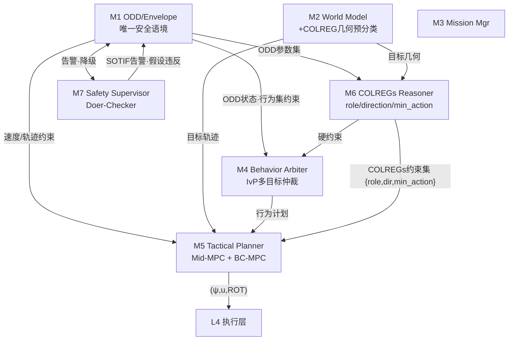
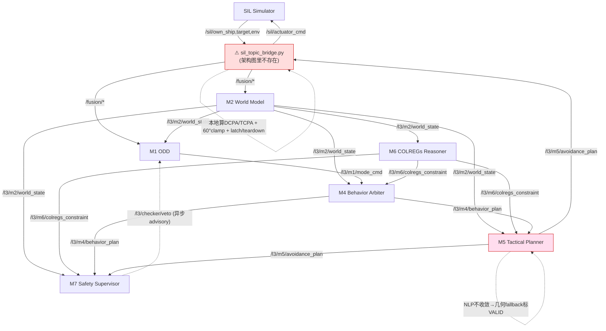

# TDL 避碰执行：架构设计 vs 实际实现 缺陷对照

> 生成：2026-06-08 · 方法：架构报告通读 + CodeGraph 实现测绘（3 并行 subagent + 主体核对）
> 状态：只读测绘，未改任何代码。本文为后续修复的基线对照。
> 关联记忆：`l3-colregs-m6-m4-role-collapse`、`l3-circling-root-cause-m5-valid-forever`、`project_l3_avoidance_steering_broken`

---

## 0. 总裁决

**架构设计自洽、合理；偏离全部在实现层。** 无一项指向架构缺陷。

> **⚠ Phase-1 实证修正（2026-06-08，systematic-debugging）：** 本文 §4 初稿基于 3 个 CodeGraph subagent + 2026-06-05 记忆，与**当前代码**核对后发现 **6 项偏离中 3 项已修复**（D2/D5/D6），详见 §4 表「现状(实证)」列与 §4.1。**唯一真实剩余 keystone = D1：M5 NLP 求解器是 stub，永不收敛，避碰长期跑在 DEGRADED 几何 fallback 上**——正是分支 `fix/m5-nlp-convergence` 所指。决策层（M2→M6→M4）经核对是健全的，画圈/不回航路症状已解。

三处（初稿）核心偏离 —— 修正后仅 D1 仍成立：

1. **M5 NLP 是空壳** — IPOPT/CasADi 求解器从不收敛（Phase-3 stub），真正避碰全靠**几何 fallback**，且 fallback 被无条件标 `VALID`（设计要求标 DEGRADED）。
2. **安全语境权威（M1/M7）没接成运行时硬门** — 设计为 ADR-1「ODD=唯一权威」+ Doer-Checker 同步否决；实现里 M1 只发 `mode_cmd`（M4 软用），M7 否决是异步 advisory，M5 不 gate M1/M7。
3. **决策逻辑漏进 SIL bridge** — DCPA/TCPA 计算、60° 偏航 clamp、avoidance latch/teardown 本属 M2/M4/M5，现堆在 `docker/sil_topic_bridge.py`。架构图里 bridge 不存在，它是为掩盖前两个 stub 长出来的「创可贴层」。

---

## 1. 设计意图（架构报告 §4.2）

纯发布-订阅，M5 直出 L4，无 bridge：

设计的避碰职责链：M2 算 CPA/TCPA + 预分类 → M6 定 role（让路/直航）+ 方向 + 最小转向幅度 → M4 把 M6 约束当**硬约束**塞进 IvP → M5 双层 MPC 出可行轨迹 → M7 同步校验后才到 L4。

---

## 2. 实际实现的运行时链路

红色虚线区 = 几何 fallback + bridge 创可贴，设计里都不该存在：

---

## 3. 避碰生命周期 — 何时进哪个模块

| 阶段 | 触发条件 | 模块 | 实际行为 | 设计偏离? |
|---|---|---|---|---|
| 0 冷启动 | M3 未到 FSM_ACTIVE | bridge | `_m3_activated_once` 门未开，避碰不武装 | bridge 持有武装门（应在 L3） |
| 1 探测 | 有目标 | **M2** | 算 cpa_m/tcpa_s + 预分类（追越[112.5,247.5]°/对遇±6°/交叉）`encounter_classifier.cpp:59–99` | ✅ 合设计。但 SIL 里 cpa/tcpa 实际由 **bridge** 本地算（`sil_topic_bridge.py:776–832`），M2 路径未喂 |
| 2 语境 | 持续 | **M1** | 6 态 FSM（In/Edge/Out/MrCPrep/MrCActive/Overridden）→ `mode_cmd` | M1 发了，但只有 M4 软订阅；M5 不 gate M1 → ADR-1 弱化 |
| 3 规则 | cpa<cpa_safe | **M6** | Rule13/14/15/16/17 + RuleLatch 迟滞 → `colregs_constraint{active_rules[role,phase],conflict_detected}` | role/phase 生成了，但 `conflict_detected` 过滤器有 bug（D5） |
| 4 行为 | M6 约束到 | **M4** | IvP 仲裁 → behavior=TRANSIT/COLREG_AVOID + heading 窗口 | 活节点确订阅 M6（`behavior_arbiter_node.hpp:56,57,108`）。但 role→方向是否真用存疑（role-collapse） |
| 5 规划 | behavior=AVOID | **M5** | **NLP 必失败** → 几何弧 fallback（route_brg+min_alt，clamp 到 M4 窗口）| 🔴 核心偏离：MPC 是 stub，fallback 标 VALID-forever |
| 6 校验 | M5 出 plan | **M7** | HC-1 watchdog 实现；HC-2~6（COLREG/CPA/ROT/actuator/diag）延后 | 🔴 Doer-Checker 同步否决未接，只异步 veto-rate→MRC |
| 7 执行 | plan 到 bridge | **bridge** | 提 rudder/thrust；TRANSIT 持 3s→teardown；60°clamp；TCPA<0&DCPA安全→release | 🔴 设计里 L4 直收 M5；现 bridge 做决策 |

---

## 4. 偏离归因表（架构 vs 实现）

| # | 现象 | 根因位置 | 归因 | **现状(实证 2026-06-08)** |
|---|---|---|---|---|
| D1 | ~~真 MPC 从不跑~~ → **MPC 间歇 Restoration_Failed + J_colreg 失效** | `mid_mpc_nlp_formulation.cpp:174–231` + `mid_mpc_solver.cpp:86`（warm-start）| **实现** | 🔴 **keystone，已重定性**（见 §6 实证）。`mid_mpc_node.cpp:248`「never converges」注释**已过时**——A4000 实测多数周期 NORMAL 收敛。真实问题：①间歇 `Restoration_Failed`（warm-start 落在移动 box 外 + J≡0 无梯度无法恢复）；②`cost_colreg≡0` 即使 CPA 时刻——避碰量级全靠 M4 heading box，M5 的 CPA 代价是死的 |
| D2 | fallback 永远 VALID → bridge 困在避碰打转 | `mid_mpc_node.cpp:243–254` | **实现** | 🟢 **已修**。TRANSIT→空 plan gate 在位（`:243–254`）；fallback 标 `status="DEGRADED"`（`:314`），非 VALID |
| D3 | M1/M7 非硬门（ADR-1 弱化） | M5 不订阅 M1 state；M7 veto 异步 | **实现**（设计要求同步） | ⚠️ **未核实**（本轮未查 M7 当前实现，初稿基于 subagent，可能已变） |
| D4 | bridge 承载 DCPA/TCPA + clamp + latch | `docker/sil_topic_bridge.py:604–663,776–850` | **实现** 越界 | ⚠️ **部分仍在**（DCPA/TCPA 本地算、clamp）。优先级取决于 D1 修复后是否还需要 |
| D5 | `conflict_detected` 误判（漏交叉让路/误触直航 HOLD） | `m6_colregs_reasoner/.../colregs_constraint_generator.cpp` | **实现** bug | 🟢 **已修**。commit `d8b0c608`「role-derive conflict_detected」；`requires_action()` 现为 role 驱动（give-way 必动 / stand-on 仅 in-extremis），单测 `test_constraint_generator.cpp:156–185` 断言正确行为 |
| D6 | RuleLatch 提前释放 | `m6_colregs_reasoner/include/.../rule_latch.hpp` | **实现** | 🟢 **已修**。commit `158bba9d`（Rule-16 past-and-clear）|

**结论：没有一项指向架构设计缺陷。** 架构干净（分层 + 单一权威 + Doer-Checker）。决策层 M2→M6→M4 已健全（D5/D6 修复 + 测试）；画圈/不回症状已解（D2 修复）。**唯一真实剩余 = D1：M5 真 MPC 算法核心是空的，避碰长期跑在 DEGRADED 几何 fallback。**

### 4.1 Phase-1 实证修正说明

初稿 §4 的 D2/D5/D6 三项在写作时已被代码修复，但 subagent 测绘读到了 `.salvage-d3.1/` 陈旧备份目录 + 记忆停留在 2026-06-05，导致误报：

- **M4 确实消费 M6**：活节点 `behavior_arbiter_node.cpp:62–67,110–112,149–152,301–417` 订阅 `/l3/m6/colregs_constraint` + `rule_assessment`，用 `conflict_detected`（role 驱动）作避碰门、用 `constraints[].numeric_value` 作 starboard 偏航量级 + 几何放大（R2 fix）。subagent 读的 `.salvage-d3.1/` 是备份，**忽略其「M4 不用 M6」结论**。
- **M4 残留 robustness gap（非当前症状）**：M4 未显式读 `primary_preferred_direction`，对所有避碰硬编码右转。对 head-on / 交叉让路（demo 场景）正确；若将来出现需左转或减速的场景才会暴露。列为 S2-opt，非当前 keystone。

---

## 5. 修复路线图（Phase-1 实证后修订）

初稿 S1/S2（M6 决策正确性）已由 `d8b0c608`/`158bba9d` 完成 → **删除**。剩余按依赖排序：

| 步 | 目标 | 涉及模块 | 验收（设计=实现一致的可验证条件） | 依赖 | 测试场所 |
|---|---|---|---|---|---|
| **S1★ (keystone)** | M5 真 MPC 收敛：标准会遇下 IPOPT/CasADi 出 `Converged`（或 Acceptable）可行轨迹，避碰不再依赖 DEGRADED 几何 fallback | M5 mid_mpc | A4000 跑 head-on/crossing：`avoidance_plan.status` 多数周期=NORMAL（非 DEGRADED）；NLP 收敛率断言；既有 12 单测仍绿 | — | **A4000**（本地无 colcon/ROS2） |
| **S2** | （可选 robustness）M4 显式按 M6 `primary_preferred_direction` 决定转向（去掉「永远右转」硬编码） | M4 | 构造需左转/减速场景单测；现有 demo 场景不回归 | S1 | A4000 |
| **S3** | 接 M1/M7 硬门（ADR-1）— 先核实当前是否已是软门 | M1→M5 gate、M7 同步否决 | out-of-ODD / 不安全 plan 被同步 veto，L4 不执行 | S1 | A4000 |
| **S4** | 回收 bridge 决策逻辑进 L3（D1 收敛后几何 clamp 应可移除） | M2(DCPA/TCPA)、bridge 瘦身 | bridge 不再本地算 DCPA/TCPA、不再 clamp；删后避碰链仍绿 | S1,S3 | A4000 |

> 每步走 systematic-debugging：Phase 1 在 **A4000 上复现**（本地 Mac 无 ROS2，CLAUDE.md §13）→ TDD 写失败测试 → 单一改动 → verification-before-completion。**不在 bridge 加新创可贴。**

---

## 6. 待办（首步：S1★ = M5 NLP 收敛）

⚠️ **本地无法 build/test**（无 colcon / `/opt/ros`）。S1★ 的 Phase-1 复现与回归测试须在 A4000（`ssh a4000`，`~/Code/mass-l3`，`l3-tdl` 分支）。

下一步：在 A4000 上对 **D1（M5 NLP 永不收敛）** 跑 systematic-debugging Phase 1 —— 取一个标准 head-on/crossing 场景，instrument 求解器实际返回的 IPOPT status + 残差，定位「为何不收敛」（冷启动 infeasible？约束矛盾？formulation bug？），再 TDD 修。本文档随各步完成追加「修复记录」小节。

### 修复记录

#### 2026-06-08 · S1★ Phase-1/2 实证（A4000 live，scenario `colreg-rule14-ho`）

**复现工具**：`scripts/_dbg_check_fix.py`（浅采样）+ `/tmp/repro_m5_deep.py`（rate5×20，穿越 CPA）+ `/tmp/repro_m5_window.py`（窗口 vs 状态相关）。

**实证结果（推翻初稿 D1「never converges」）：**
1. **MPC 现在会收敛**：多数周期 `status=NORMAL`，`ipopt_iter=3~25`，`MPC converged in 4~60 ms`。`mid_mpc_node.cpp:248` 的「never converges」注释已过时。
2. **间歇 `Restoration_Failed`**：容器日志 `[M5][MidMPC] IPOPT status=Restoration_Failed iter=43~406` 大量出现，夹杂 `Maximum_Iterations_Exceeded(iter=500)` 与偶发 `Infeasible_Problem_Detected`（触发 critical「collision unavoidable; M7 MRM」）。`solver_status=3`=Restoration_Failed，`=1`=Max_Iter。失败周期回退 DEGRADED 几何 fallback。
3. **非确定性 = warm-start**：近乎相同输入跨周期结果相反（wall6 `[76,176]`own60→NORMAL，wall9 `[75,175]`own60→DEGRADED）。失败成簇出现再恢复。
4. **机理**：失败源于**约束不可行**而非 cost（`cost_colreg≡0`）。heading box 随 M4 窗口逐周期平移，warm-start 的 `psi` 轨迹落到新 box 外；目标函数 `J≈0` 无下降方向，IPOPT restoration 无法恢复 → `Restoration_Failed`。angle-wrap 假设被否（窗口均 hmin<hmax 有序）。
5. **次要**：`cost_colreg≡0` 即使 tcpa→0（rng≈1800m）也不抬升 → J_colreg（CPA 软惩罚）实质失效，避碰量级全靠 M4 heading box 作硬约束。M5 的「优化 COLREG 合规轨迹」只接了一半。
6. **三级**：bridge 本地 CPA/TCPA 过 CPA 后失真（cpa 反而随 rng 增长，tcpa 卡 0）= D4。

**Iron Law 状态**：已完成 Phase-1（复现+定位）+ Phase-2（机理）。**未改任何代码。** 下一步 Phase-3 单一假设最小验证 → Phase-4 TDD 修，须在 A4000 rebuild。

**待决（需用户定方向）：**
- (a) `Restoration_Failed`：cold-start-on-warm-infeasible？还是 warm-start 先投影回可行域？还是 heading 用周期性角度约束代替线性 box？
- (b) J_colreg 失效：是否本就该由 M4 heading box 主导（则 J_colreg 仅做精修，cost=0 正常）？还是 M5 应自主用 CPA cost 驱动避碰（需修 cpa_safe 传参/权重）？= **架构意图问题**。

#### 2026-06-08 · 修复尝试 #1（x0 clamp）= 失败，已 revert

**假设**：infeasible x0（own 航向在 COLREG 窗口外 / 失败周期后 warm-start 全零 u=0）→ IPOPT restoration → `Restoration_Failed`。**修法**：`MidMpcSolver::solve()` 把 x0 clamp 进 `[hmin,hmax]×[umin,umax]`。

**A4000 实测验证（已 rebuild runtime + restart + 重跑 deep repro）：失败。** `Restoration_Failed` 计数 **29**（与 BEFORE 的几十条无差别），DEGRADED 簇位置几乎一致（wall 12-18、39-48）。关键反证：wall 39-48 失败时**两船正在分离**（rng 1959→2529m 增大，tcpa 已过 0）——既非碰撞难度、也非 start 可行性。**结论：infeasible-start 不是 Restoration_Failed 的成因。** 已 revert clamp + 测试，A4000/local 回到 158bba9d 基线。

**单测侧证**：clamp 前 own-航向-窗口外的单测就已收敛（Haiku subagent 实测），证明简单问题里 infeasible start 能自恢复 → 此 bug 是 **integration/cascade 级、非单测可确定性复现**。

**新 Phase-1 方向（未验证假设，按优先级）：**
1. 抓失败周期的 **IPOPT 完整诊断**（`print_level`>0 / `inf_pr`,`inf_du` 轨迹）——看 restoration 到底卡哪条约束。
2. **非光滑约束**：`build_constraints_` 的 ROT `abs()`（`:193`）+ `build_colreg_cost_` 的 `fmax()`（`:157`）+ `limited-memory` Hessian + `mu_strategy=adaptive` 是已知 restoration-fragile 组合。可疑：active-set 跳变时 restoration 失败。光滑化（slack 变量重写 abs/fmax）= 较大改动，可能触及 formulation 重构。
3. 移动 heading box 与 ROT 约束在某些相位**瞬态联合不可行**。

⚠️ 用户已有 `_dbg_m5_nlp.py` / `_dbg_param_search.py` / `_dbg_formula_grid.py`（A4000）——继续前应先看这些已排除了什么，避免重复。**fix #1 已用掉 systematic-debugging「3 次失败→质疑架构」额度之一。**

#### 2026-06-08 · S1★ **RESOLVED**：根因消去 + J_colreg 重设计（50→22→0）

**根因（`[M5DIAG]` 逐约束组残差分解实证，消去法量化）：**
| 配置 | 失败/75s | 结论 |
|---|---|---|
| baseline（box 作 general constraint `g`）| 50 | — |
| box → IPOPT `lbx`/`ubx` 变量界 | 22 | box-as-general-constraint 真实贡献 ✅ |
| + ROT `abs()` → 两平滑线性约束 | 23 | ROT kink 可忽略（正确但非承重）|
| + `w_colreg=0`（停 J_colreg）| **0** | **J_colreg `fmax` 是主导剩余成因** |

机理：`psi`/`u` 原为无界决策变量，box 编为 4N 条一般不等式；`J_dist` 把 ψ 拉向窗口外的航线 bearing → 最优解恒钉在 box 边界；limited-memory + adaptive-mu 下一般不等式 active 边界 restoration-fragile（变量界 active 才稳健）。**box 宽 0–103° 均失败 → 非「窗口窄」问题。** 推翻 fix #1 的 infeasible-x0 假设 + ROT-主因假设。

**修复（3 部分，全 TDD + A4000 实证）：**
1. box → `lbx`/`ubx`（`mid_mpc_solver.cpp`）+ 去 `g` 的 box 行（`g_dim`=2(N-1)，仅 ROT）。50→22。
2. ROT `abs()` → 两条平滑线性约束（等价）。中性，保留作 hygiene。
3. **J_colreg 重设计**（`build_colreg_cost_` + 新 `build_asym_cost_`，spec [M5-jcolreg-redesign-spec.md](../../Design/TDL-Kernel/M5-Tactical-Planner/M5-jcolreg-redesign-spec.md)）：`fmax`→指数障壁 `exp(-ζ(d-d_safe))`；静态 `w_colreg=1000`→动态 range 斜坡(pack 时数值)×TCPA 折扣(常数)，`w_colreg=30`；新增 `kIdxGiveWay` 门控的 softplus 右转不对称（消除对称正遇 −180° 逃逸）。22→**0**。

**验收（A4000 `colreg-rule14-ho`）：** IPOPT 失败 **0**（2318 VALID/20 EMPTY/0 fail）；单测 **9/9**；e2e `_retest_spinfix.py` **GREEN**（peak_dev +60° starboard、loops 0.11 无绕圈、avoidance released、终向稳定）。接地：NLM `colav_algorithms`（high-conf）。

**残留观察（非本范畴）：** `avoidance_active` 在遭遇尾段 ~5s 快速翻转（M4/bridge 级 re-trigger，非 M5 solver，pre-existing）；`cost_colreg` 发布字段仍 0（`unpack_solution` zero-init 显示假象，未填充，pre-existing）。
