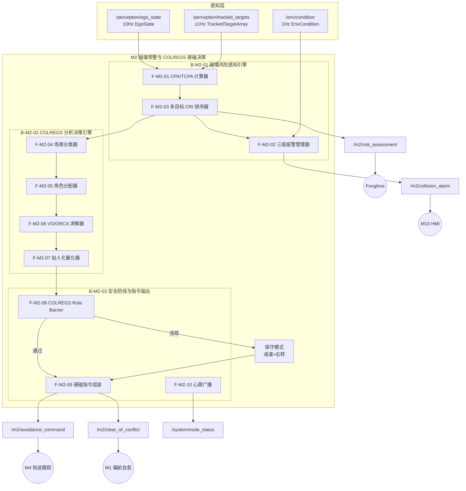
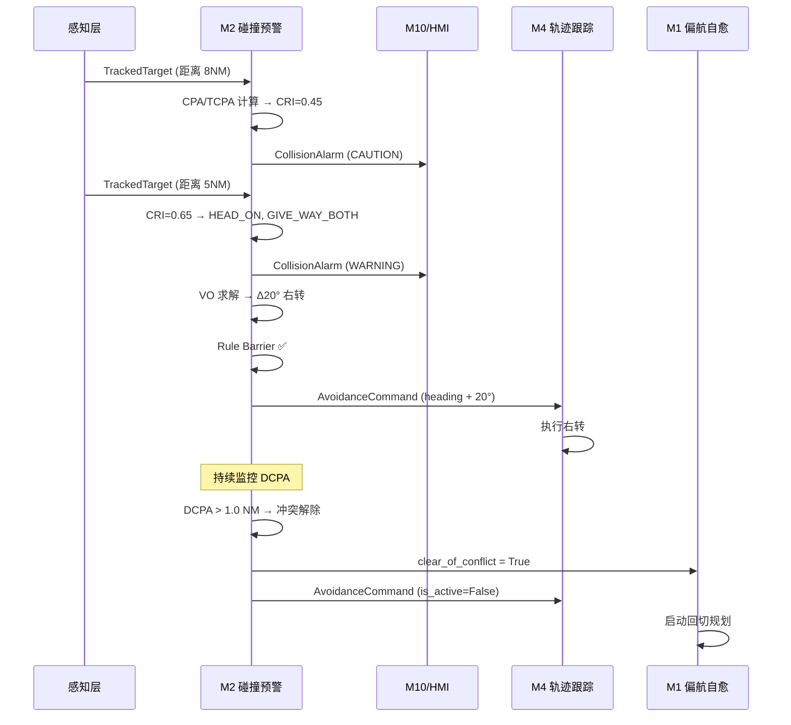
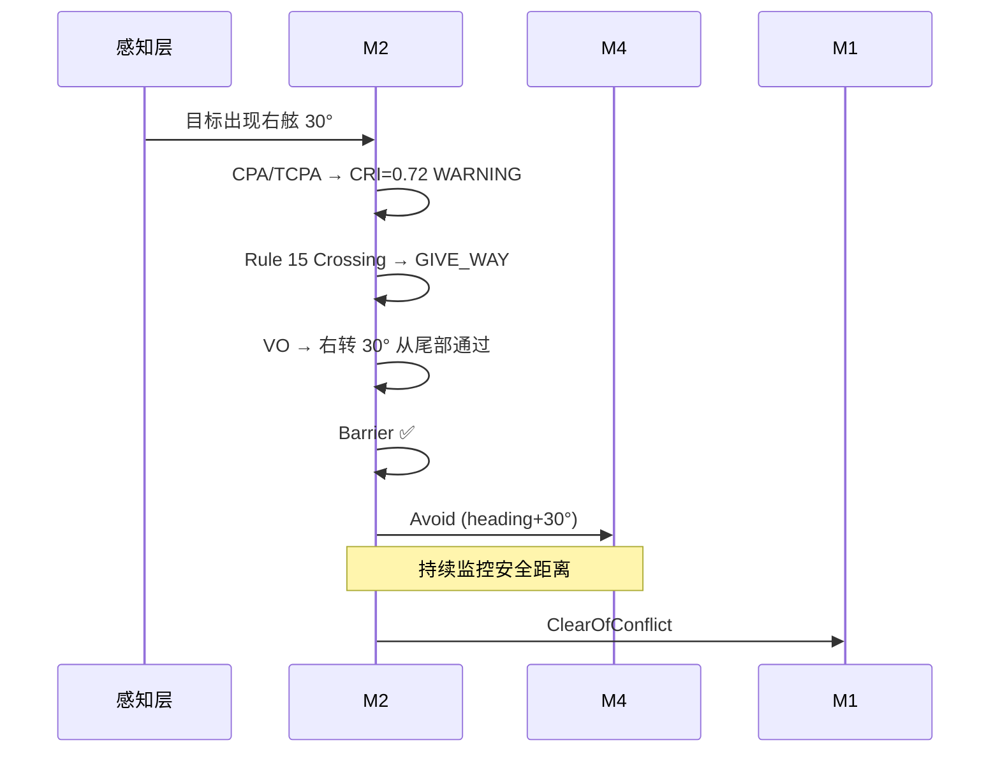
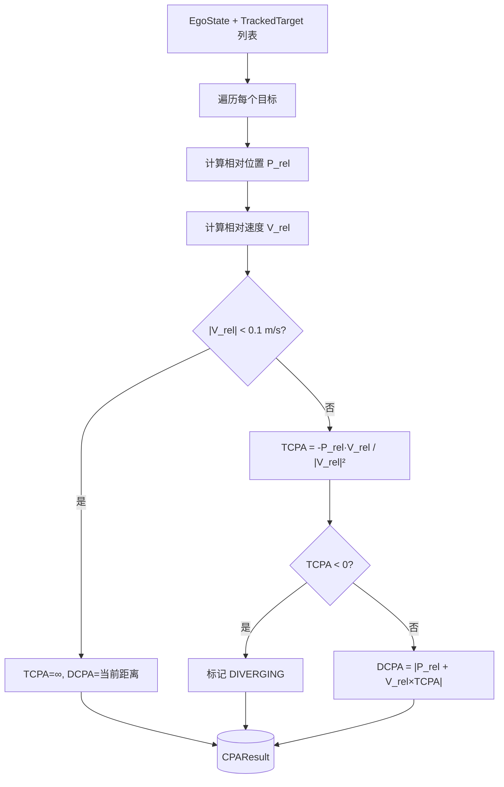
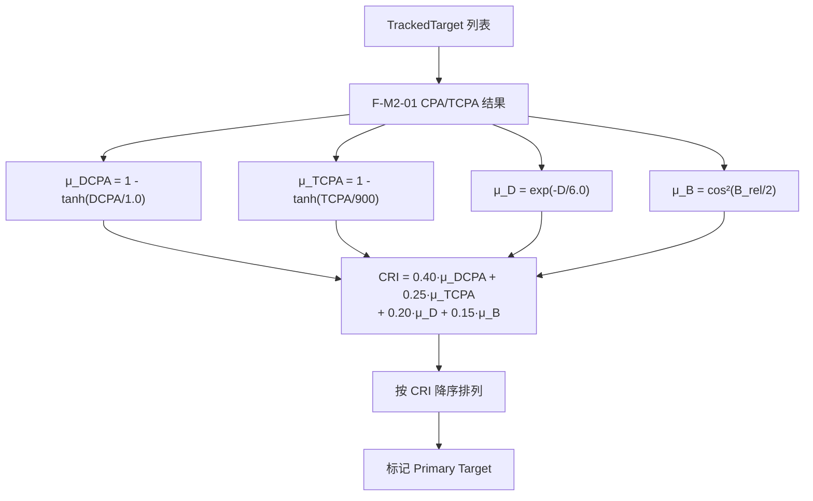
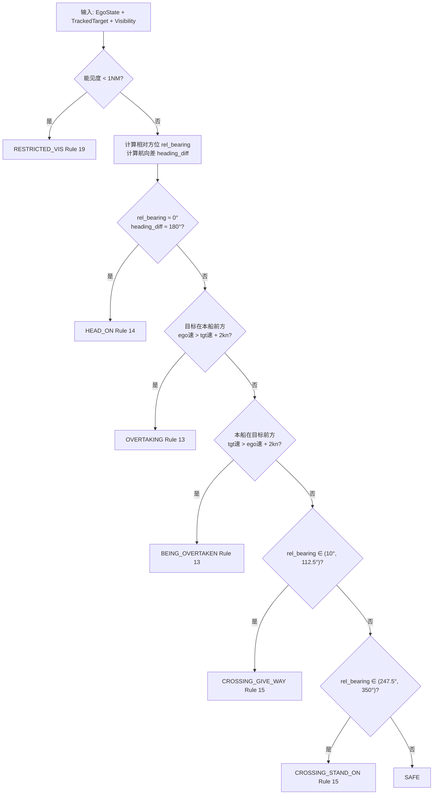
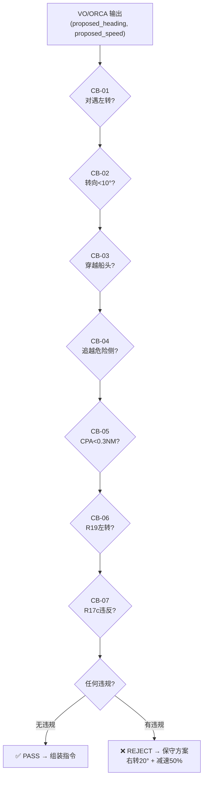
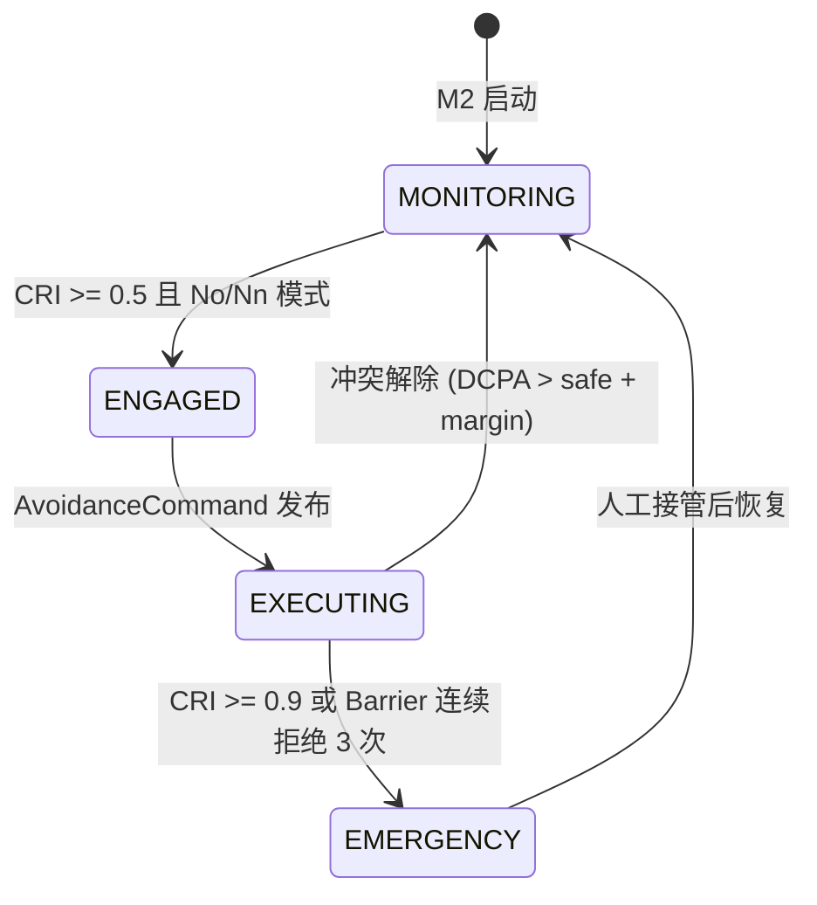
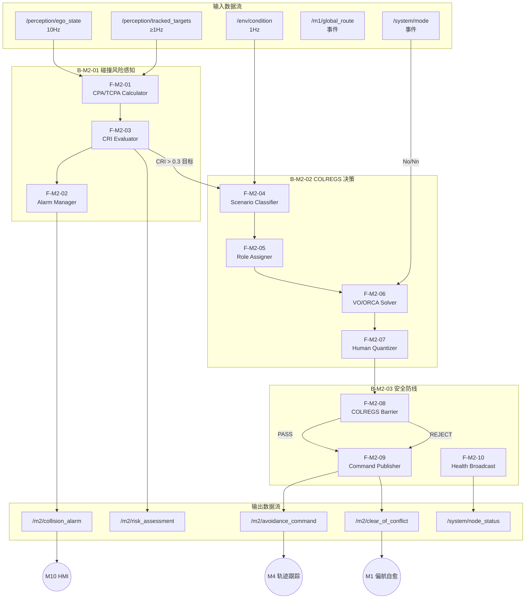

# M2 — 碰撞预警与 COLREGS 避碰决策 开发文档

> **模块归属**：AVDS 航行决策层 · 第二功能模块  
> **认证等级**：N（预警辅助）/ No（开阔水域自主避碰）/ Nn（全航程自主避碰）  
> **依据规范**：CCS《智能船舶规范》2025（R012-2025）§2.3.3, §2.4.1.3, §2.4.2.3；DNV GL CG-0264 Section 4  
> **上游模块**：M1 航线设计与优化（提供 GlobalRoute）、感知层（提供 TrackedTargetArray / EgoState）  
> **下游模块**：M4 轨迹跟踪控制（执行避让航向/速度指令）、M1 偏航自愈（避让结束后回切主线）  
> **文件版本**：v1.0 · 2026-04-XX  

---

## 一、系统需求层级分析

### 1.1 业务需求 (Business Requirement)

| 维度 | 描述 |
|:---|:---|
| **业务目标** | 在任何航行场景下，实时评估周围船舶与障碍物的碰撞风险，N 级提供声光报警辅助船长决策，No/Nn 级自动生成并执行符合 COLREGS 的避让指令，保障航行安全。 |
| **法规驱动** | CCS §2.3.3 碰撞预警（N 级必备）；CCS §2.4.1.3 开阔水域 COLREGS 自主避碰（No 级）；CCS §2.4.2.3 全航程 COLREGS 自主避碰（Nn 级）；COLREGS 1972 Rules 5-18；DNV CG-0264 §4 Navigation Functions。 |
| **安全底线** | 任何 AI 算法输出必须通过独立的 COLREGS Rule Barrier 确定性校验，违规时强制回退保守操作模式。 |
| **验证航线** | 加尔各答 → 岘港（~2500 NM），涵盖孟加拉湾密集渔区、马六甲海峡高密度交汇区、南海开阔水域。 |

### 1.2 核心功能需求 (Functional Requirements)

> 需求编号采用 `M2-Rxx` 系列，与总体设计文档保持一致。

#### M2-A 碰撞预警（N / No / Nn）

| 编号 | 需求 | 规范条款 | 优先级 |
|:---|:---|:---|:---|
| **M2-R01** | 对每个追踪目标实时计算 DCPA/TCPA，综合本船操纵性能生成碰撞危险度评分 (CRI) | CCS §2.3.3.1 | P0 |
| **M2-R02** | 三级声光报警：预警→警告→紧急，紧急时 No/Nn 触发自动介入 | CCS §2.3.3.2 | P0 |
| **M2-R03** | 报警提示危险物相对位置；驾驶员应答后即时消除，保留视觉指示 | CCS §2.3.3.2 | P0 |
| **M2-R04** | 多目标优先级评估：模糊逻辑综合 DCPA/TCPA/距离/相对方位计算 CRI，识别"重点船" | 调研报告 | P1 |

#### M2-B COLREGS 自主避碰决策（No / Nn）

| 编号 | 需求 | 规范条款 | 优先级 |
|:---|:---|:---|:---|
| **M2-R05** | 场景自动识别：根据相对方位和速度矢量，判定交叉/追越/对遇/能见度不良局面，确定让路/直航角色 | CCS §2.4.1.3, COLREGS 13-17 | P0 |
| **M2-R06** | VO/ORCA 求解：速度障碍法计算无碰撞速度集合，叠加 COLREGS 规则约束 | CCS §2.4.1.3 | P0 |
| **M2-R07** | COLREGS Rule Barrier：AI 输出前必须通过独立规则校验器，违规强制回退保守模式 | 调研报告 | P0 |
| **M2-R08** | 拟人化避让：转向角度以 10°/20°/30° 整数刻度输出，大幅度早期避让 | COLREGS Rule 8 | P1 |
| **M2-R09** | 多船场景（≥3 船）ORCA 锁定解，无死循环/无解状态 | CCS §2.4.1.3 | P1 |

### 1.3 层级边界分析

M2 采用**纯船端实时处理**架构，不涉及岸端支持中心（碰撞避让具有强实时性要求，不允许 VSAT 通信延迟干扰决策）。

| 层级 | 职责 | M2 相关性 |
|:---|:---|:---|
| **感知层（上游输入）** | AIS+雷达ARPA 融合目标列表、本船状态 | 提供 `TrackedTargetArray` 和 `EgoState` |
| **M2 碰撞预警与避碰决策（本模块）** | CPA/TCPA 计算、CRI 评估、COLREGS 分类、VO/ORCA 求解、Rule Barrier 校验 | 核心处理 |
| **M1 航线模块（协同）** | 避让偏航后的自愈回切 | M2 发出 `ClearOfConflict` 后 M1 启动回切 |
| **M4 轨迹跟踪（下游执行）** | 按 M2 输出的避让航向/速度跟踪执行 | 接收 `AvoidanceCommand` |
| **M10 系统管理（监督）** | 模式切换、报警管理、数据记录 | M2 上报报警与事件日志 |

### 1.4 COLREGS 规则数字化映射

> 本节为 CCS 审图所需的《COLREGS 规则数字化映射说明》基础。

| COLREGS 条款 | 规则名称 | 数字化映射 | 实现方式 |
|:---|:---|:---|:---|
| **Rule 5** | 瞭望 | 360° 全方位目标检测，≥2 NM 预警范围 | 感知层交付（M2 校验覆盖率） |
| **Rule 6** | 安全航速 | 能见度不良时自动降速至 ≤ 安全航速阈值 | M2 联合 EnvCondition 判定 |
| **Rule 7** | 碰撞危险 | DCPA/TCPA + CRI 模糊逻辑评估 | F-M2-01/04 |
| **Rule 8** | 避免碰撞的行动 | 大幅度、早期、明显的避让动作；转向量化 ≥10° | F-M2-07 拟人化输出 |
| **Rule 13** | 追越 | 目标从 22.5°abaft beam 以后方向接近→追越船让路 | F-M2-04 场景分类器 |
| **Rule 14** | 对遇 | 相对方位 ~0°，航向差 ~180°→双方右转 | F-M2-04 + VO 禁止左转约束 |
| **Rule 15** | 交叉相遇 | 他船在本船右舷→本船让路（右舷让路原则）| F-M2-04 角色分配 |
| **Rule 16** | 让路船的行动 | 尽早、大幅度避让 | F-M2-06 VO 输出 + F-M2-07 量化 |
| **Rule 17** | 直航船的行动 | 保持航向航速；当让路船未行动时可采取独自避让 | F-M2-05 直航船激进模式 |
| **Rule 18** | 船舶之间的责任 | 等级：机动船 < 受限船 < 操纵能力受限船 < 失控船 | F-M2-04 vessel_type 映射 |
| **Rule 19** | 能见度不良 | 禁止向左转避让正横以前的船舶 | F-M2-08 Rule Barrier 约束 |

---

## 二、M2 船端系统架构

### 2.1 模块分解

M2 采用 **三级流水线架构**：感知融合 → 风险评估 → 避碰决策 → 安全校验 → 指令输出。全部功能在船端实时执行，无岸端依赖。

```
┌─────────────────────────────────────────────────────────────────┐
│                M2 碰撞预警与 COLREGS 避碰决策                      │
│                                                                   │
│  ┌───────────────────────────────────────────────────────────┐   │
│  │  B-M2-01: 碰撞风险感知引擎 (Risk Perception Engine)       │   │
│  │  F-M2-01 CPA/TCPA 计算器                                  │   │
│  │  F-M2-02 三级报警管理器                                    │   │
│  │  F-M2-03 多目标 CRI 排序器                                 │   │
│  └───────────────────────────────────────────────────────────┘   │
│                          ↓ 风险清单                               │
│  ┌───────────────────────────────────────────────────────────┐   │
│  │  B-M2-02: COLREGS 分析决策引擎 (COLREGS Decision Engine)  │   │
│  │  F-M2-04 COLREGS 场景分类器                                │   │
│  │  F-M2-05 让路/直航角色分配器                               │   │
│  │  F-M2-06 VO/ORCA 避碰求解器                                │   │
│  │  F-M2-07 拟人化输出量化器                                  │   │
│  └───────────────────────────────────────────────────────────┘   │
│                          ↓ 候选避让方案                           │
│  ┌───────────────────────────────────────────────────────────┐   │
│  │  B-M2-03: 安全防线与指令输出 (Barrier & Command Output)    │   │
│  │  F-M2-08 COLREGS Rule Barrier                              │   │
│  │  F-M2-09 避碰指令组装与下发                                │   │
│  │  F-M2-10 Lifecycle 心跳广播                                │   │
│  └───────────────────────────────────────────────────────────┘   │
└─────────────────────────────────────────────────────────────────┘
```

### 2.2 ROS 2 话题与接口设计

#### 2.2.1 输入接口

| 话题名 | 消息类型 | 频率 | 来源 | 说明 |
|:---|:---|:---|:---|:---|
| `/perception/ego_state` | `avds_interfaces/EgoState` | 10 Hz | 感知层 | 本船位置、航向、速度 |
| `/perception/tracked_targets` | `avds_interfaces/TrackedTargetArray` | ≥1 Hz | 感知层 | AIS+ARPA 融合目标列表 |
| `/m1/global_route` | `avds_interfaces/GlobalRoute` | 事件驱动 | M1 航线模块 | 当前全局航线（用于偏航判断） |
| `/env/condition` | `avds_interfaces/EnvCondition` | 1 Hz | M1/感知层 | 能见度、风浪等环境条件 |
| `/system/mode` | `std_msgs/String` | 事件驱动 | M10 | 当前运行模式 N/No/Nn |

#### 2.2.2 输出接口

| 话题名 | 消息类型 | 频率 | 下游 | 说明 |
|:---|:---|:---|:---|:---|
| `/m2/collision_alarm` | `avds_interfaces/CollisionAlarm` (新增) | 事件驱动 | M10/HMI | 三级碰撞报警 |
| `/m2/risk_assessment` | `avds_interfaces/RiskAssessment` (新增) | 1 Hz | M10/HMI/Foxglove | 各目标 CRI 评估结果 |
| `/m2/avoidance_command` | `avds_interfaces/AvoidanceCommand` (新增) | 事件驱动 | M4 | 避让航向/航速指令 |
| `/m2/clear_of_conflict` | `std_msgs/Bool` | 事件驱动 | M1 | 避让结束信号，触发 M1 回切 |
| `/system/node_status` | `avds_interfaces/NodeStatus` | 1 Hz | M10 | M2 节点心跳 |

#### 2.2.3 新增消息定义

**CollisionAlarm.msg**
```
std_msgs/Header header
uint32 target_mmsi                  # 报警对象 MMSI
uint8 LEVEL_CAUTION=0               # 预警（视觉提示）
uint8 LEVEL_WARNING=1               # 警告（声光）
uint8 LEVEL_EMERGENCY=2             # 紧急（声光 + 自动介入）
uint8 alarm_level                   # 报警等级
float64 dcpa_nm                     # DCPA (海里)
float64 tcpa_s                      # TCPA (秒)
float64 cri                         # 碰撞危险度指数 [0,1]
float64 target_bearing_deg          # 目标相对方位 (deg)
float64 target_distance_nm          # 目标当前距离 (海里)
string colregs_scenario             # COLREGS 场景类型
bool acknowledged                   # 驾驶员是否已应答
```

**RiskAssessment.msg**
```
std_msgs/Header header
TrackedTarget[] assessed_targets    # 带 CRI 评分的目标列表
uint32 primary_target_mmsi          # 重点船 MMSI
float64 primary_cri                 # 重点船 CRI
string situation_summary            # 态势摘要文本
```

**AvoidanceCommand.msg**
```
std_msgs/Header header
uint8 ACTION_NONE=0                 # 无需避让
uint8 ACTION_ALTER_COURSE=1         # 改变航向
uint8 ACTION_ALTER_SPEED=2          # 改变航速
uint8 ACTION_ALTER_BOTH=3           # 同时改变航向和航速
uint8 ACTION_EMERGENCY_STOP=4       # 紧急停车
uint8 action_type                   # 避让动作类型
float64 desired_heading_deg         # 目标航向 [0, 360) (deg)
float64 desired_sog_kn              # 目标对地航速 (kn)
float64 turn_angle_deg              # 转向角度（拟人化量化后）(deg)
string colregs_basis                # COLREGS 依据（如 "Rule 15 Crossing: Give-way"）
float64 estimated_duration_s        # 预计避让持续时间 (s)
bool is_active                      # 避让是否激活中
```

### 2.3 数据流全景图



---

## 三、典型场景分析

### 3.1 场景一：对遇局面 — 双方右转避让 (Rule 14)

**场景描述**：本船沿既定航线向北航行，一艘货船从正北方向以相似航向迎面驶来。相对方位角 ~0°，航向差 ~180°，构成典型 Head-on 局面。

**前置条件**：
- 系统运行模式：No（开阔水域自主），M2 节点处于 Active 状态
- 目标距离 > 6 NM，TCPA > 900s
- 能见度良好 (> 3 NM)

**处理流程**：

| 步骤 | 触发条件 | 处理动作 | 输出 |
|:---|:---|:---|:---|
| 1. 目标检测 | 感知层推送 TrackedTarget | F-M2-01 计算 CPA=0.2NM, TCPA=1200s | CPA/TCPA 数据进入 CRI 评估 |
| 2. CRI 评估 | TCPA < 1500s | F-M2-03 计算 CRI=0.45 → CAUTION 级 | 发布 `/m2/collision_alarm` LEVEL_CAUTION |
| 3. 场景分类 | CRI > 0.3 | F-M2-04 判定 Head-on (Rule 14) | 场景='HEAD_ON' |
| 4. 角色分配 | Head-on | F-M2-05 双方均为让路船 → 右转义务 | role='GIVE_WAY_BOTH' |
| 5. CRI 升级 | TCPA < 900s, CRI=0.65 | F-M2-02 升级为 WARNING | `/m2/collision_alarm` LEVEL_WARNING |
| 6. VO 求解 | No 模式 + WARNING | F-M2-06 VO 计算，COLREGS 约束禁止左转 | 避让速度候选集 |
| 7. 拟人化输出 | VO 输出 Δθ=17° | F-M2-07 量化为 20° 右转 | desired_heading = heading + 20° |
| 8. Barrier 校验 | 避让方案就绪 | F-M2-08 校验: ✅右转, ✅转向角≥10°, ✅不侵入他船CPA安全域 | PASS |
| 9. 指令下发 | Barrier PASS | F-M2-09 发布 `AvoidanceCommand` | M4 执行右转 20° |
| 10. 冲突解除 | DCPA > 1.0 NM | F-M2-09 发布 `clear_of_conflict=True` | M1 启动回切 |



**SIL 验证点**：
1. CPA/TCPA 计算误差 < 5%（相对真值）
2. Head-on 场景识别准确率 100%
3. 避让方向必须为右转
4. 量化转向角 ≥ 10°（整数刻度）
5. `clear_of_conflict` 发出时 DCPA > 安全阈值

---

### 3.2 场景二：交叉相遇 — 右舷让路 (Rule 15)

**场景描述**：本船东行，目标船从正北向南航行，本船右舷出现目标。本船为让路船，需大幅度右转从目标船尾部通过。

**前置条件**：
- 系统运行模式：No，能见度良好
- 目标相对方位 ~30°（右舷），航向差 ~90°

**处理流程**：

| 步骤 | 触发条件 | 处理动作 | 输出 |
|:---|:---|:---|:---|
| 1. CRI 评估 | TrackedTarget 进入监控范围 | F-M2-01 CPA=0.4NM, TCPA=600s, CRI=0.72 | WARNING |
| 2. 场景分类 | 相对方位 10°~112.5°, 非追越 | F-M2-04 判定 CROSSING_FROM_STARBOARD | Rule 15 |
| 3. 角色分配 | 他船在右舷 | F-M2-05 → 本船 GIVE_WAY | 让路义务 |
| 4. VO 求解 | 让路 + COLREGS 右转约束 | F-M2-06 → Δ30° 右转，从目标船尾通过 | 安全速度 |
| 5. Barrier | 右转 30°, 从尾部通过 ✅ | F-M2-08 → PASS | |
| 6. 指令下发 | — | AvoidanceCommand (turn_angle=30°) | M4 执行 |
| 7. 回切 | DCPA > 1.5 NM | clear_of_conflict | M1 回切 |



**SIL 验证点**：
1. 右舷交叉场景正确判定为 Rule 15
2. 本船正确分配为 GIVE_WAY
3. 避让方向为右转（不得左转穿越目标船头）
4. 通过目标船尾部，而非船头

---

### 3.3 场景三：追越局面 (Rule 13)

**场景描述**：本船高速航行，前方慢速船被追上至 22.5° abaft beam 以内。本船为追越船，有让路义务。

**处理流程**：

| 步骤 | 处理动作 |
|:---|:---|
| 1 | F-M2-04 判定 OVERTAKING（目标在本船正前方 ±22.5° 且本船速度 > 目标速度 + 2kn） |
| 2 | F-M2-05 → 本船 GIVE_WAY（追越船无条件让路） |
| 3 | F-M2-06 VO 求解：优先从目标左舷通过（若安全），保持 1.0NM 安全距离 |
| 4 | F-M2-08 Barrier: 不从危险侧（右舷紧贴）靠拢，保持安全横距 |
| 5 | 通过后 `ClearOfConflict`，回归原航线 |

**SIL 验证点**：
1. 追越场景正确判定（Rule 13 条件）
2. 追越船始终保持让路义务直到完全通过
3. 安全横距 ≥ 1.0 NM

---

### 3.4 场景四：多船交汇 — ORCA 多船避让 (≥3 船)

**场景描述**：马六甲海峡密集交汇区，本船同时面对 3-5 艘目标船的复合威胁。需要 ORCA 多船扩展保证全局无碰撞。

**处理流程**：

| 步骤 | 处理动作 |
|:---|:---|
| 1 | F-M2-03 对所有目标计算 CRI 并排序，识别 primary target |
| 2 | F-M2-04 对每对船舶独立分类 COLREGS 场景 |
| 3 | F-M2-06 构建 ORCA(N) 半平面集合，求解满足所有约束的安全速度 |
| 4 | F-M2-07 量化输出：若无解则 escalate 至保守模式（减速+右转） |
| 5 | F-M2-08 Barrier 逐条校验全部 COLREGS 约束 |
| 6 | 若 Barrier 拒绝率 > 50% → 触发 M7 MRC 降级 |

**SIL 验证点**：
1. 所有目标的 CPA 均 > 安全阈值
2. 无死锁（ORCA 保证收敛性）
3. 保守模式兜底有效

---

### 3.5 场景五：能见度不良 (Rule 19)

**场景描述**：浓雾天气，能见度 < 1 NM，仅依靠雷达/AIS 感知目标。Rule 19 替代 Rule 13-15 的右转优先规则。

**处理流程**：

| 步骤 | 处理动作 |
|:---|:---|
| 1 | EnvCondition.visibility_nm < 1.0 → 激活 Rule 19 模式 |
| 2 | M2 自动降速至安全航速（Rule 6）：`safe_speed = f(visibility, traffic_density)` |
| 3 | F-M2-04 场景分类切换至 RESTRICTED_VISIBILITY 模式 |
| 4 | F-M2-08 Barrier 追加约束：**禁止向左转避让正横以前的目标** |
| 5 | VO 求解时安全域半径放大 50%（保守裕度乘数 1.5×） |
| 6 | 若所有避让方案均被 Barrier 拒绝 → 紧急停车请求人工接管 |

**SIL 验证点**：
1. 能见度 < 1NM 时正确激活 Rule 19
2. 禁止对正横前目标左转
3. 安全域半径正确放大

---

### 3.6 场景六：直航船 — 让路船未行动时独自避让 (Rule 17)

**场景描述**：本船为直航船（交叉相遇，他船在左舷），但对方让路船未采取行动，TCPA 持续缩短。

**处理流程**：

| 步骤 | 处理动作 |
|:---|:---|
| 1 | F-M2-05 分配 STAND_ON 角色，M2 初始保持航向航速 |
| 2 | 监控让路船行为：若 TCPA < 阈值 且对方航向无明显变化 → 判定"让路船未行动" |
| 3 | 激活 Rule 17(b)：本船可独自采取避让行动 |
| 4 | F-M2-06 VO 约束放宽至双向，优先右转（仍遵守 Rule 17(c) 不向左转向左舷来船） |
| 5 | Barrier 校验确保不违反 Rule 17(c) |
| 6 | EMERGENCY 报警 + 指令下发 |

**SIL 验证点**：
1. 直航船正确保持航向航速至合理时限
2. Rule 17(b) 激活时机正确（让路船确实未行动）
3. Rule 17(c) 约束不违反

---

## 四、需求追溯矩阵

### 4.1 需求→功能项映射

| 需求编号 | 功能项 | 所属模块 | 技术实现 |
|:---|:---|:---|:---|
| M2-R01 | F-M2-01 CPA/TCPA 计算器 | B-M2-01 | 相对运动法 + ENU 向量化 |
| M2-R02 | F-M2-02 三级报警管理器 | B-M2-01 | CRI 阈值触发 + 驾驶员应答 FSM |
| M2-R03 | F-M2-02 三级报警管理器 | B-M2-01 | 视觉保留 + 应答消除逻辑 |
| M2-R04 | F-M2-03 多目标 CRI 排序器 | B-M2-01 | 模糊逻辑 4 因素 CRI |
| M2-R05 | F-M2-04 COLREGS 场景分类器 + F-M2-05 角色分配器 | B-M2-02 | 相对方位 + 航向差几何判定 |
| M2-R06 | F-M2-06 VO/ORCA 避碰求解器 | B-M2-02 | VO 锥构造 + COLREGS 半平面约束 |
| M2-R07 | F-M2-08 COLREGS Rule Barrier | B-M2-03 | 独立确定性规则链 |
| M2-R08 | F-M2-07 拟人化输出量化器 | B-M2-02 | 10°/20°/30° 整数刻度 snap |
| M2-R09 | F-M2-06 VO/ORCA 避碰求解器 (ORCA 扩展) | B-M2-02 | ORCA(N) 半平面交集 |

### 4.2 规范→需求追溯

| 规范条款 | 需求编号 | 验证方式 |
|:---|:---|:---|
| CCS §2.3.3.1 | M2-R01 | 单元测试 + SIL 仿真 |
| CCS §2.3.3.2 | M2-R02, M2-R03 | HMI 集成测试 |
| CCS §2.4.1.3 | M2-R05, M2-R06, M2-R09 | 6 场景 SIL + HIL |
| COLREGS Rule 8 | M2-R08 | 转向角度统计审计 |
| COLREGS Rule 13-18 | M2-R05, M2-R07 | Rule Barrier 白盒用例 |
| COLREGS Rule 19 | M2-R07 (Barrier 约束扩展) | 能见度不良场景 SIL |
| DNV CG-0264 §4 | M2-R01~R09 | 全量功能 + 性能测试 |

### 4.3 需求满足链示例

以 **M2-R05 场景自动识别** 为例：

```
CCS §2.4.1.3 "按 COLREGS 要求实施避碰决策和操作"
    └── M2-R05 "场景自动识别，判定交叉/追越/对遇/能见度不良"
        ├── F-M2-04 COLREGS 场景分类器
        │   ├── 输入: EgoState + TrackedTarget 相对方位/航向/速度
        │   ├── 算法: 几何判定 (Rule 13/14/15/19 条件)
        │   └── 输出: ColregsScenario 枚举
        └── F-M2-05 让路/直航角色分配器
            ├── 输入: ColregsScenario + vessel_type
            ├── 算法: 规则映射 (Rule 15/17/18)
            └── 输出: Role 枚举 {GIVE_WAY, STAND_ON, GIVE_WAY_BOTH}
```

以 **M2-R06 VO/ORCA 求解** 为例：

```
CCS §2.4.1.3 "按 COLREGS 要求实施避碰决策"
    └── M2-R06 "VO/ORCA 求解，叠加 COLREGS 规则约束"
        └── F-M2-06 VO/ORCA 避碰求解器
            ├── 输入: EgoState + 所有 CRI>0.3 的 TrackedTarget
            ├── 算法:
            │   ├── 单目标: VO 锥 + COLREGS 半平面约束
            │   └── 多目标: ORCA(N) 半平面交集
            ├── 约束: COLREGS 方向约束 (禁止对遇左转等)
            └── 输出: (desired_heading_deg, desired_sog_kn)
```

---

## 五、功能设计详解

### 5.1 工程目录结构

M2 遵循 AVDS 双层范式：`core/`（纯 Python，禁 `import rclpy`）+ `ros_wrapper/`（ROS 2 封装）。

```
avds_m2_colregs/
├── avds_m2_colregs/
│   ├── __init__.py
│   ├── core/
│   │   ├── __init__.py
│   │   ├── cpa_tcpa_calculator.py     # F-M2-01 CPA/TCPA 计算器
│   │   ├── alarm_manager.py           # F-M2-02 三级报警管理器
│   │   ├── cri_evaluator.py           # F-M2-03 多目标 CRI 排序器
│   │   ├── colregs_classifier.py      # F-M2-04 场景分类器
│   │   ├── role_assigner.py           # F-M2-05 角色分配器
│   │   ├── vo_orca_solver.py          # F-M2-06 VO/ORCA 求解器
│   │   ├── humanlike_quantizer.py     # F-M2-07 拟人化量化器
│   │   ├── colregs_rule_barrier.py    # F-M2-08 COLREGS Rule Barrier
│   │   └── avoidance_assembler.py     # F-M2-09 避碰指令组装
│   └── ros_wrapper/
│       ├── __init__.py
│       ├── m2_collision_node.py        # 主节点 LifecycleNode
│       └── m2_health_node.py           # 心跳广播 F-M2-10
├── config/
│   └── m2_params.yaml                  # 参数外化
├── launch/
│   └── m2_bringup.launch.py
├── test/
│   ├── test_cpa_tcpa.py
│   ├── test_cri_evaluator.py
│   ├── test_colregs_classifier.py
│   ├── test_vo_orca_solver.py
│   ├── test_colregs_barrier.py
│   └── test_m2_integration.py
├── package.xml
├── setup.py
├── setup.cfg
└── CMakeLists.txt
```

### 5.2 各模块功能项详细设计

---

#### 5.2.1 B-M2-01: 碰撞风险感知引擎 (Risk Perception Engine)

**模块职责**：对感知层交付的融合目标列表，实时计算碰撞风险指标，驱动报警系统。

---

##### 5.2.1.1 功能项 F-M2-01: CPA/TCPA 实时计算器

*   **技术方案**：采用**相对运动法（Relative Motion Method）**，在 ENU 坐标系中计算所有追踪目标与本船的 CPA 和 TCPA。

*   **数学模型**：

    设本船状态 $(P_e, V_e)$，目标状态 $(P_t, V_t)$，均在 ENU 坐标系中：

    $$\vec{P}_{rel} = \vec{P}_t - \vec{P}_e, \quad \vec{V}_{rel} = \vec{V}_t - \vec{V}_e$$

    $$TCPA = -\frac{\vec{P}_{rel} \cdot \vec{V}_{rel}}{|\vec{V}_{rel}|^2}$$

    $$DCPA = |\vec{P}_{rel} + \vec{V}_{rel} \cdot TCPA|$$

    特殊处理：
    - 当 $|V_{rel}| < 0.1$ m/s → 目标近似静止相对于本船，TCPA = ∞，DCPA = 当前距离
    - 当 TCPA < 0 → 已过最近点，标记为 DIVERGING 状态

*   **输入/输出规约**：

    | 项 | 说明 |
    |:---|:---|
    | 输入 | `EgoState`（本船 x, y, sog_ms, heading_rad）<br>`TrackedTarget`（目标 x_enu, y_enu, sog_kn, cog_deg） |
    | 输出 | `CPAResult(dcpa_nm, tcpa_s, distance_nm, bearing_deg, is_diverging)` |
    | 频率 | 与 TrackedTargetArray 同频（≥1 Hz） |
    | 性能 | 单目标 < 10μs，100 目标 < 1ms |

*   **伪代码**：

```python
@dataclass
class CPAResult:
    dcpa_nm: float       # CPA 距离 (海里)
    tcpa_s: float        # CPA 时间 (秒)
    distance_nm: float   # 当前距离 (海里)
    bearing_deg: float   # 相对方位 [0, 360) (度)
    is_diverging: bool   # 是否正在远离

class CPATCPACalculator:
    """纯 Python CPA/TCPA 计算器，禁止 import rclpy"""

    MIN_VREL = 0.1       # m/s, 低于此视为静止

    def compute(self, ego: EgoState, target: TrackedTarget) -> CPAResult:
        # 相对位置 (ENU, meters)
        dx = target.x_enu - ego.x
        dy = target.y_enu - ego.y

        # 相对速度 (ENU, m/s)
        ego_vx = ego.sog_ms * math.sin(ego.heading_rad)
        ego_vy = ego.sog_ms * math.cos(ego.heading_rad)
        tgt_vx = target.sog_kn * 0.5144 * math.sin(math.radians(target.cog_deg))
        tgt_vy = target.sog_kn * 0.5144 * math.cos(math.radians(target.cog_deg))

        dvx = tgt_vx - ego_vx
        dvy = tgt_vy - ego_vy

        v_rel_sq = dvx**2 + dvy**2
        if v_rel_sq < self.MIN_VREL**2:
            dist = math.hypot(dx, dy)
            bearing = self._compute_bearing(dx, dy)
            return CPAResult(dist / 1852, float('inf'), dist / 1852, bearing, False)

        tcpa = -(dx * dvx + dy * dvy) / v_rel_sq
        is_diverging = tcpa < 0

        # CPA 位置
        cpa_x = dx + dvx * max(tcpa, 0)
        cpa_y = dy + dvy * max(tcpa, 0)
        dcpa = math.hypot(cpa_x, cpa_y) / 1852  # meters -> NM

        dist = math.hypot(dx, dy) / 1852
        bearing = self._compute_bearing(dx, dy)

        return CPAResult(dcpa, max(tcpa, 0), dist, bearing, is_diverging)
```



---

##### 5.2.1.2 功能项 F-M2-02: 三级报警管理器 (Alarm Manager)

*   **技术方案**：基于 CRI 值和 TCPA 阈值触发三级声光报警，遵循 CCS §2.3.3.2 报警管理规范及 IMO MSC.302(87) BAM/CAM 框架。

*   **报警等级定义**：

| 等级 | 名称 | CRI 阈值 | TCPA 阈值 | 触发行为 |
|:---|:---|:---|:---|:---|
| **CAUTION** | 预警 | CRI ≥ 0.3 | TCPA < 25 min | 视觉提示（HMI 目标高亮黄色） |
| **WARNING** | 警告 | CRI ≥ 0.5 | TCPA < 15 min | 声光报警（蜂鸣器 + 红框闪烁） |
| **EMERGENCY** | 紧急 | CRI ≥ 0.7 | TCPA < 8 min | 声光 + No/Nn 模式自动介入避碰 |

*   **报警状态机**：

```mermaid
stateDiagram-v2
    [*] --> SAFE: 目标进入监测范围
    SAFE --> CAUTION: CRI ≥ 0.3 或 TCPA < 25min
    CAUTION --> WARNING: CRI ≥ 0.5 或 TCPA < 15min
    WARNING --> EMERGENCY: CRI ≥ 0.7 或 TCPA < 8min
    
    CAUTION --> SAFE: CRI < 0.2 持续 60s
    WARNING --> CAUTION: CRI < 0.4 持续 30s
    EMERGENCY --> WARNING: CRI < 0.6 持续 30s
    
    CAUTION --> ACKNOWLEDGED: 驾驶员应答
    WARNING --> ACKNOWLEDGED: 驾驶员应答
    ACKNOWLEDGED --> SAFE: CRI < 0.2 持续 60s
    
    Note left of ACKNOWLEDGED: 声音消除\n保留视觉指示
```



*   **抗抖动设计**：
    - 升级：连续 3 个周期（3s）满足升级条件才触发
    - 降级：需持续满足降级条件一定时长（防止目标瞬间远离又折返）
    - 防漏报：TCPA 满足条件时直接升级，不受 CRI 抖动影响

*   **驾驶员应答接口**：
    - 订阅 `/m2/alarm_ack` 话题（`std_msgs/UInt32` = target MMSI）
    - 应答后：声音报警消除，视觉指示保留（黄色边框变为灰色虚线）
    - 若报警等级再次升级，重新触发声光报警

---

##### 5.2.1.3 功能项 F-M2-03: 多目标 CRI 排序器 (Multi-Target CRI Evaluator)

*   **技术方案**：采用**模糊逻辑推理（Fuzzy Logic）**综合 4 个因素计算碰撞危险度指数 CRI ∈ [0, 1]。

*   **CRI 计算模型**：

    $$CRI = w_1 \cdot \mu_{DCPA} + w_2 \cdot \mu_{TCPA} + w_3 \cdot \mu_D + w_4 \cdot \mu_B$$

    其中：
    - $\mu_{DCPA}$：DCPA 模糊隶属度，$\mu_{DCPA} = 1 - \tanh(DCPA / D_{safe})$，$D_{safe} = 1.0$ NM
    - $\mu_{TCPA}$：TCPA 模糊隶属度，$\mu_{TCPA} = 1 - \tanh(TCPA / T_{safe})$，$T_{safe} = 900$ s
    - $\mu_D$：当前距离隶属度，$\mu_D = \exp(-D / D_{range})$，$D_{range} = 6.0$ NM
    - $\mu_B$：相对方位隶属度，正前方风险最高：$\mu_B = \cos^2(B_{rel} / 2)$
    - 权重（经验值）：$w_1 = 0.40, \; w_2 = 0.25, \; w_3 = 0.20, \; w_4 = 0.15$

*   **多目标排序与重点船识别**：
    - 所有 CRI > 0.3 的目标进入"关注列表"
    - CRI 最高者标记为 **Primary Target**（重点船）
    - 当多个目标 CRI 差值 < 0.05 时，优先选择 **TCPA 更小者** 作为 Primary

*   **输出**：按 CRI 降序排列的目标列表（`RiskAssessment.msg`），每秒发布一次



---

#### 5.2.2 B-M2-02: COLREGS 分析决策引擎 (COLREGS Decision Engine)

**模块职责**：当 CRI 超过 WARNING 阈值且系统处于 No/Nn 模式时，进行 COLREGS 场景分类、角色分配、VO/ORCA 避碰求解和拟人化输出。

---

##### 5.2.2.1 功能项 F-M2-04: COLREGS 场景分类器 (Scenario Classifier)

*   **技术方案**：基于**相对方位角**和**航向差**的几何判定逻辑，将每对船舶交互分类为标准 COLREGS 场景。

*   **分类判定树**：

```python
from enum import Enum

class ColregsScenario(Enum):
    SAFE = "SAFE"                        # 无碰撞风险
    HEAD_ON = "HEAD_ON"                  # Rule 14 对遇
    CROSSING_GIVE_WAY = "CROSSING_GW"    # Rule 15 交叉-让路
    CROSSING_STAND_ON = "CROSSING_SO"    # Rule 15 交叉-直航
    OVERTAKING = "OVERTAKING"            # Rule 13 追越（本船追越他船）
    BEING_OVERTAKEN = "BEING_OVERTAKEN"  # Rule 13 被追越
    RESTRICTED_VIS = "RESTRICTED_VIS"    # Rule 19 能见度不良

class ColregsClassifier:
    """COLREGS 场景分类器 — 纯确定性几何判定"""

    # 判定阈值
    HEAD_ON_BEARING_TOL = 6.0     # 对遇方位容差 (deg)
    HEAD_ON_HEADING_TOL = 10.0    # 对遇航向差容差 (deg, 与 180° 的偏差)
    OVERTAKING_SECTOR = 112.5     # 追越扇区半角 (deg, from stern)
    MIN_OVERTAKING_SPEED_DIFF = 2.0  # 追越最小速差 (kn)
    RESTRICTED_VIS_THRESHOLD = 1.0   # 能见度不良阈值 (NM)

    def classify(self, ego: EgoState, target: TrackedTarget,
                 visibility_nm: float) -> ColregsScenario:
        # Step 0: 能见度不良覆盖
        if visibility_nm < self.RESTRICTED_VIS_THRESHOLD:
            return ColregsScenario.RESTRICTED_VIS

        # 相对方位 (本船看目标的方位, 相对于本船艏向)
        rel_bearing = self._relative_bearing(ego, target)  # [0, 360)

        # 目标看本船的方位 (对方视角)
        rev_bearing = self._reverse_bearing(ego, target)

        # 航向差
        heading_diff = abs(self._normalize_angle(
            target.heading_deg - ego.heading_deg))

        # Step 1: 对遇判定 (Rule 14)
        if (rel_bearing < self.HEAD_ON_BEARING_TOL or
            rel_bearing > 360 - self.HEAD_ON_BEARING_TOL):
            if abs(heading_diff - 180) < self.HEAD_ON_HEADING_TOL:
                return ColregsScenario.HEAD_ON

        # Step 2: 追越判定 (Rule 13)
        # 目标从本船正后方 ±67.5° 扇区内被追上
        if (rev_bearing > 180 - (180 - self.OVERTAKING_SECTOR) and
            rev_bearing < 180 + (180 - self.OVERTAKING_SECTOR)):
            # 本船从目标后方接近
            if ego.sog_kn > target.sog_kn + self.MIN_OVERTAKING_SPEED_DIFF:
                return ColregsScenario.OVERTAKING
        # 被追越
        if (rel_bearing > 180 - (180 - self.OVERTAKING_SECTOR) and
            rel_bearing < 180 + (180 - self.OVERTAKING_SECTOR)):
            if target.sog_kn > ego.sog_kn + self.MIN_OVERTAKING_SPEED_DIFF:
                return ColregsScenario.BEING_OVERTAKEN

        # Step 3: 交叉相遇判定 (Rule 15)
        if 10 < rel_bearing < self.OVERTAKING_SECTOR:
            # 目标在本船右舷 → 本船让路
            return ColregsScenario.CROSSING_GIVE_WAY
        elif 360 - self.OVERTAKING_SECTOR < rel_bearing < 350:
            # 目标在本船左舷 → 本船直航
            return ColregsScenario.CROSSING_STAND_ON

        return ColregsScenario.SAFE
```



---

##### 5.2.2.2 功能项 F-M2-05: 让路/直航角色分配器 (Role Assigner)

*   **技术方案**：根据 COLREGS 场景分类和船舶类型（Rule 18），确定本船的行动义务。

*   **角色定义**：

```python
class AvoidanceRole(Enum):
    NO_ACTION = "NO_ACTION"              # 无需行动
    GIVE_WAY = "GIVE_WAY"               # 让路船
    STAND_ON = "STAND_ON"               # 直航船
    GIVE_WAY_BOTH = "GIVE_WAY_BOTH"     # 双方让路 (对遇)
    STAND_ON_AGGRESSIVE = "STAND_ON_AGG" # 直航船激进模式 (Rule 17b)
```

*   **角色分配规则**：

| COLREGS 场景 | 本船角色 | 行动义务 |
|:---|:---|:---|
| HEAD_ON | GIVE_WAY_BOTH | 双方右转 |
| CROSSING_GIVE_WAY | GIVE_WAY | 大幅度右转，从目标尾部通过 |
| CROSSING_STAND_ON | STAND_ON | 保持航向航速 |
| OVERTAKING | GIVE_WAY | 追越船无条件让路 |
| BEING_OVERTAKEN | STAND_ON | 保持航向航速 |
| RESTRICTED_VIS | GIVE_WAY（保守） | 减速 + 安全域扩大 |
| SAFE | NO_ACTION | — |

*   **Rule 17(b) 激进模式触发**：

```python
def check_standon_escalation(self, role: AvoidanceRole,
                              tcpa_s: float, 
                              target_heading_change: float) -> AvoidanceRole:
    """
    Rule 17(b): 当直航船发现让路船未采取适当避让行动时，
    直航船可独自采取行动避免碰撞。
    """
    if role != AvoidanceRole.STAND_ON:
        return role
    
    # 触发条件：TCPA < 5min 且对方航向变化 < 5° (未行动)
    if tcpa_s < 300 and abs(target_heading_change) < 5.0:
        return AvoidanceRole.STAND_ON_AGGRESSIVE
    
    return role
```

*   **Rule 18 船舶类型优先级**：

| 类型代码 | 船舶类型 | 等级（越高越优先） |
|:---|:---|:---|
| 0 | 机动船（动力船） | 1（最低） |
| 1 | 帆船 | 2 |
| 2 | 从事捕鱼的船舶 | 3 |
| 3 | 操纵能力受限的船舶 | 4 |
| 4 | 失控船 | 5（最高） |

当两船类型等级不同时，等级低的为让路船。

---

##### 5.2.2.3 功能项 F-M2-06: VO/ORCA 避碰求解器 (Velocity Obstacle Solver)

*   **技术方案选型**：

| 方案 | 优势 | 劣势 | 适用场景 |
|:---|:---|:---|:---|
| **VO (Velocity Obstacle)** | 几何直观，实现简单，易叠加 COLREGS 约束 | 单目标最优，多目标可能振荡 | 1-2 船 |
| **ORCA (Optimal Reciprocal Collision Avoidance)** | 多船保证无死锁，线性规划求解快速 | 假设目标合作，需修改以适应非合作目标 | ≥3 船 |
| **A* / RRT / 全局搜索** | 全局最优 | 计算量大，实时性差 | 离线规划 |

**最终选择**：单目标用 **VO + COLREGS 方向约束**；多目标（≥3）用 **ORCA(N) + COLREGS 半平面修正**。

*   **VO 圆锥构造（单目标）**：

    给定本船位置 $P_e$，目标位置 $P_t$，安全半径 $r_{safe}$（默认 0.5 NM = 926 m）：

    $$VO_t = \{ V_e \mid \exists \tau > 0, |P_e + V_e \cdot \tau - (P_t + V_t \cdot \tau)| < r_{safe} \}$$

    即本船速度 $V_e$ 落在 VO 锥内将导致碰撞。**安全速度** = 当前速度空间中 VO 锥外部区域。

*   **COLREGS 方向约束叠加**：

    在速度空间中划定**禁区半平面**，强制 VO 求解只选择合规方向：

    | COLREGS 场景 | 禁区约束 | 效果 |
    |:---|:---|:---|
    | HEAD_ON | 禁止左转区域 (Δθ < 0) | 强制右转 |
    | CROSSING_GIVE_WAY | 禁止从目标船头通过 | 强制从尾部绕行 |
    | OVERTAKING | 禁止从危险侧靠拢 | 保持安全横距 |
    | RESTRICTED_VIS | 禁止向左转避让正横前目标 | Rule 19 |

*   **ORCA(N) 多船扩展**：

    对 $N$ 个目标构建 $N$ 个半平面 $ORCA_{t_i}$，安全速度为所有半平面的交集：

    $$V_{safe} = \bigcap_{i=1}^{N} ORCA_{t_i}$$

    当交集为空（无解）时，采用**最小侵入策略**：求离所有半平面边界最近的点（线性规划松弛）。

*   **求解算法**：

```python
class VOORCASolver:
    """VO/ORCA 避碰求解器"""

    def __init__(self, params: dict):
        self.safe_radius_m = params.get('safe_radius_nm', 0.5) * 1852
        self.max_speed_ms = params.get('max_speed_kn', 15.0) * 0.5144
        self.heading_samples = params.get('heading_samples', 72)  # 5° 步长
        self.speed_samples = params.get('speed_samples', 10)

    def solve_single(self, ego: EgoState, target: TrackedTarget,
                     scenario: ColregsScenario, role: AvoidanceRole
                     ) -> tuple[float, float]:
        """
        单目标 VO 求解 + COLREGS 约束
        返回 (desired_heading_deg, desired_sog_kn)
        """
        # 1. 构造 VO 锥
        vo_cone = self._build_vo_cone(ego, target)

        # 2. COLREGS 方向约束
        forbidden_zone = self._colregs_forbidden_zone(ego, scenario)

        # 3. 在速度空间采样，选择最优安全速度
        best_v = None
        best_cost = float('inf')

        for h_idx in range(self.heading_samples):
            heading = h_idx * (360.0 / self.heading_samples)
            if self._in_forbidden_zone(heading, ego.heading_deg, forbidden_zone):
                continue

            for s_idx in range(self.speed_samples):
                speed = (s_idx + 1) * self.max_speed_ms / self.speed_samples
                vx = speed * math.sin(math.radians(heading))
                vy = speed * math.cos(math.radians(heading))

                if self._in_vo_cone(vx, vy, vo_cone):
                    continue  # 在 VO 锥内，不安全

                # 代价函数: 偏离原航向的惩罚 + 减速惩罚
                cost = self._avoidance_cost(heading, speed, ego)
                if cost < best_cost:
                    best_cost = cost
                    best_v = (heading, speed / 0.5144)  # 转换为 kn

        if best_v is None:
            # 无安全解 → 保守模式 (减速 + 右转 20°)
            return ((ego.heading_deg + 20) % 360, ego.sog_kn * 0.5)

        return best_v

    def solve_multi(self, ego: EgoState, targets: list[TrackedTarget],
                    scenarios: list[ColregsScenario]) -> tuple[float, float]:
        """
        多目标 ORCA(N) 求解
        """
        orca_planes = []
        for target, scenario in zip(targets, scenarios):
            plane = self._build_orca_halfplane(ego, target, scenario)
            orca_planes.append(plane)

        # 线性规划求解: 最小偏离当前航向, 满足所有半平面约束
        return self._solve_linear_program(ego, orca_planes)
```

```mermaid
flowchart TD
    subgraph Single [单目标 VO 求解]
        VOCone["构造 VO 锥\nVO_t = {V_e | 碰撞}"]
        Forbidden["COLREGS 禁区\n(如: 对遇禁左转)"]
        Sample["速度空间 72×10 采样"]
        Filter["过滤: 不在 VO ∩ 不在禁区"]
        Cost["代价函数: min(航向偏离 + 减速)"]
        BestV["最优安全速度"]
    end

    subgraph Multi [多目标 ORCA(N)]
        HalfPlanes["为每个目标构建 ORCA 半平面"]
        Intersection["半平面交集 ∩ ORCA_i"]
        LP["线性规划求解"]
        Relax{"交集非空?"}
        RelaxLP["松弛: 最小侵入策略"]
    end

    VOCone --> Sample
    Forbidden --> Sample
    Sample --> Filter --> Cost --> BestV

    HalfPlanes --> Intersection --> Relax
    Relax -->|是| LP
    Relax -->|否| RelaxLP
```

---

##### 5.2.2.4 功能项 F-M2-07: 拟人化输出量化器 (Human-Like Quantizer)

*   **技术方案**：遵循 COLREGS Rule 8 "行动应大幅度、及早、明显"原则，对 VO/ORCA 求解输出进行量化处理。

*   **量化规则**：

    1. **航向量化**：将连续转向角 $\Delta\theta$ snap 至最近的 10° 刻度，且最小避让幅度 ≥ 10°

       $$\Delta\theta_{out} = \max\left(10°, \; \text{round}\left(\frac{\Delta\theta}{10}\right) \times 10\right)$$

    2. **航速量化**：减速幅度以 1.0 kn 为步长

       $$\Delta V_{out} = \text{round}(\Delta V / 1.0) \times 1.0$$

    3. **边界约束**：
       - 最大单次转向 ≤ 60°（超过则建议紧急停车 + 转向）
       - 最小航速 ≥ 2.0 kn（保持舵效）
       - 连续两次指令间隔 ≥ 30s（避免频繁调整）

*   **实现**：

```python
class HumanLikeQuantizer:
    """拟人化输出量化器 — COLREGS Rule 8 合规"""

    HEADING_STEP = 10.0    # 航向量化步长 (deg)
    SPEED_STEP = 1.0       # 航速量化步长 (kn)
    MIN_TURN = 10.0        # 最小转向角 (deg)
    MAX_TURN = 60.0        # 最大单次转向角 (deg)
    MIN_SPEED = 2.0        # 最小航速 (kn, 舵效边界)
    MIN_INTERVAL_S = 30.0  # 最小指令间隔 (s)

    def quantize(self, current_heading: float, desired_heading: float,
                 current_speed: float, desired_speed: float) -> tuple[float, float]:
        # 航向量化
        delta_h = self._normalize_angle(desired_heading - current_heading)
        if abs(delta_h) < self.MIN_TURN:
            delta_h = math.copysign(self.MIN_TURN, delta_h) if abs(delta_h) > 3.0 else 0
        else:
            delta_h = round(delta_h / self.HEADING_STEP) * self.HEADING_STEP
            delta_h = math.copysign(min(abs(delta_h), self.MAX_TURN), delta_h)

        # 航速量化
        delta_v = desired_speed - current_speed
        delta_v = round(delta_v / self.SPEED_STEP) * self.SPEED_STEP
        new_speed = max(current_speed + delta_v, self.MIN_SPEED)

        new_heading = (current_heading + delta_h) % 360
        return new_heading, new_speed
```

---

#### 5.2.3 B-M2-03: 安全防线与指令输出 (Barrier & Command Output)

**模块职责**：M2 系统的"最后一道闸门"。所有 VO/ORCA 输出必须通过此模块的 COLREGS Rule Barrier 确定性校验后，方可组装为 `AvoidanceCommand` 下发至 M4。

---

##### 5.2.3.1 功能项 F-M2-08: COLREGS Rule Barrier

*   **技术方案**：与 M1 的 Rule Barrier（BR-01~BR-06 航线级）不同，M2 的 Rule Barrier 专注于**避碰决策的 COLREGS 合规性**。实现为独立的确定性规则链，不依赖任何 AI 算法。

*   **COLREGS 避碰规则集**：

| 规则 ID | 规则名称 | 校验内容 | 违规处理 |
|:---|:---|:---|:---|
| **CB-01** | 对遇左转禁令 | Head-on 场景下，Δθ < 0（左转）→ 拒绝 | 强制右转 20° |
| **CB-02** | 最小转向幅度 | 避让转向角 < 10° → 拒绝（Rule 8 "大幅度"） | 最小 snap 至 10° |
| **CB-03** | 交叉穿越船头禁令 | Crossing Give-way 时，不得从目标船头通过 | 强制从尾部绕行 |
| **CB-04** | 追越危险侧禁令 | 追越时从目标近侧通过且横距 < 0.5NM → 拒绝 | 扩大横距至 1.0NM |
| **CB-05** | CPA 安全底线 | 避让执行后 预计 CPA 仍 < 0.3NM → 拒绝 | 减速 + 右转保守方案 |
| **CB-06** | Rule 19 左转禁令 | 能见度不良时，对正横前目标左转 → 拒绝 | 禁止左转 |
| **CB-07** | Rule 17(c) 约束 | 直航船独自避让时向左转向左舷来船 → 拒绝 | 禁止该方向 |

*   **执行逻辑**：

```python
class ColregsRuleBarrier:
    """
    COLREGS 避碰 Rule Barrier — 独立确定性校验
    任何 AI 输出在此被拦截则回退至保守方案
    """

    def check(self, ego: EgoState, target: TrackedTarget,
              scenario: ColregsScenario, role: AvoidanceRole,
              proposed_heading: float, proposed_speed: float,
              visibility_nm: float) -> BarrierResult:
        violations = []

        delta_h = self._normalize(proposed_heading - ego.heading_deg)

        # CB-01: 对遇禁止左转
        if scenario == ColregsScenario.HEAD_ON and delta_h < 0:
            violations.append(BarrierViolation("CB-01", "Head-on 左转"))

        # CB-02: 最小转向幅度
        if abs(delta_h) > 0 and abs(delta_h) < 10.0:
            violations.append(BarrierViolation("CB-02", f"转向角{delta_h:.0f}°不足10°"))

        # CB-03: 交叉穿越船头
        if scenario == ColregsScenario.CROSSING_GIVE_WAY:
            if self._crosses_bow(ego, target, proposed_heading):
                violations.append(BarrierViolation("CB-03", "穿越目标船头"))

        # CB-04: 追越危险侧
        if scenario == ColregsScenario.OVERTAKING:
            lat_dist = self._lateral_distance(ego, target, proposed_heading)
            if lat_dist < 926:  # 0.5 NM
                violations.append(BarrierViolation("CB-04", f"追越横距{lat_dist:.0f}m不足"))

        # CB-05: CPA 安全底线
        predicted_cpa = self._predict_cpa(ego, target, proposed_heading, proposed_speed)
        if predicted_cpa < 0.3:
            violations.append(BarrierViolation("CB-05", f"预测CPA={predicted_cpa:.2f}NM<0.3"))

        # CB-06: Rule 19 左转禁令
        if visibility_nm < 1.0:
            bearing = self._relative_bearing(ego, target)
            if bearing < 90 and delta_h < 0:
                violations.append(BarrierViolation("CB-06", "能见度不良时左转避正横前目标"))

        # CB-07: Rule 17(c)
        if role == AvoidanceRole.STAND_ON_AGGRESSIVE:
            bearing = self._relative_bearing(ego, target)
            if bearing > 180 and delta_h < 0:
                violations.append(BarrierViolation("CB-07", "直航船向左转向左舷来船"))

        return BarrierResult(
            passed=(len(violations) == 0),
            violations=violations,
            fallback=self._generate_fallback(ego) if violations else None
        )

    def _generate_fallback(self, ego: EgoState) -> tuple[float, float]:
        """保守回退方案: 右转 20° + 减速 50%"""
        return ((ego.heading_deg + 20) % 360, max(ego.sog_kn * 0.5, 2.0))
```



---

##### 5.2.3.2 功能项 F-M2-09: 避碰指令组装与下发 (Avoidance Command Publisher)

*   **技术方案**：将通过 Rule Barrier 的避让方案组装为标准 `AvoidanceCommand` 消息，并管理避让生命周期（激活→执行→解除）。

*   **避让生命周期状态机**：



*   **冲突解除判定**：
    - 条件 1: 所有目标 DCPA > 安全阈值 × 1.5（裕度因子）
    - 条件 2: 所有目标 TCPA < 0（已过最近点） OR CRI < 0.2
    - 条件 3: 持续满足 60s（防止抖动误判）
    - 满足全部 3 个条件 → 发布 `clear_of_conflict = True`

*   **QoS 配置**：
    - `/m2/avoidance_command`: `Reliable + Volatile`（实时指令，不缓存旧指令）
    - `/m2/collision_alarm`: `Reliable + Transient Local`（确保后启动订阅者收到最新报警）
    - `/m2/clear_of_conflict`: `Reliable + Transient Local`

---

##### 5.2.3.3 功能项 F-M2-10: ROS 2 Lifecycle 心跳广播

*   **技术方案**：与 M1 F-B03-05 一致，遵循 `avds-ros2-node` SKILL 强制要求。

*   **心跳健康判定**：

| 条件 | status_code | fault_description |
|:---|:---|:---|
| 正常运行 | `STATUS_OK (0)` | — |
| CRI 计算延迟 > 2s | `STATUS_WARNING (1)` | "CRI computation delayed" |
| VO 求解无解连续 5 次 | `STATUS_WARNING (1)` | "VO solver no solution" |
| Rule Barrier 内部异常 | `STATUS_ERROR (2)` | "Barrier engine exception" |
| 节点无响应 | `STATUS_FATAL (3)` | "M2 node unresponsive" |

---

### 5.3 参数外化配置

**`config/m2_params.yaml`**：

```yaml
# M2 碰撞预警与 COLREGS 避碰决策 参数配置
m2_collision_node:
  ros__parameters:
    # === CPA/TCPA 计算 ===
    cpa_min_vrel_ms: 0.1            # 最小相对速度阈值 (m/s)

    # === CRI 模糊逻辑权重 ===
    cri_weight_dcpa: 0.40
    cri_weight_tcpa: 0.25
    cri_weight_distance: 0.20
    cri_weight_bearing: 0.15
    cri_d_safe_nm: 1.0              # DCPA 安全距离 (NM)
    cri_t_safe_s: 900.0             # TCPA 安全时间 (s)
    cri_d_range_nm: 6.0             # 距离衰减范围 (NM)

    # === 三级报警阈值 ===
    alarm_caution_cri: 0.3
    alarm_caution_tcpa_s: 1500.0    # 25 min
    alarm_warning_cri: 0.5
    alarm_warning_tcpa_s: 900.0     # 15 min
    alarm_emergency_cri: 0.7
    alarm_emergency_tcpa_s: 480.0   # 8 min
    alarm_debounce_cycles: 3        # 升级抗抖动周期数

    # === COLREGS 分类器 ===
    headon_bearing_tol_deg: 6.0
    headon_heading_tol_deg: 10.0
    overtaking_sector_deg: 112.5
    min_overtaking_speed_diff_kn: 2.0
    restricted_vis_threshold_nm: 1.0

    # === VO/ORCA 求解器 ===
    safe_radius_nm: 0.5             # 安全域半径 (NM)
    safe_radius_restricted_mult: 1.5  # 能见度不良时安全域放大系数
    max_speed_kn: 15.0
    heading_samples: 72             # 航向采样数 (5° 步长)
    speed_samples: 10               # 速度采样数

    # === 拟人化输出 ===
    heading_step_deg: 10.0
    speed_step_kn: 1.0
    min_turn_deg: 10.0
    max_turn_deg: 60.0
    min_speed_kn: 2.0
    min_command_interval_s: 30.0

    # === Rule Barrier ===
    barrier_min_cpa_nm: 0.3         # CPA 安全底线
    barrier_min_lateral_m: 926.0    # 追越最小横距 (0.5 NM)
    barrier_fallback_turn_deg: 20.0 # 保守回退转向角
    barrier_fallback_speed_ratio: 0.5  # 保守回退减速比

    # === 避让生命周期 ===
    clear_margin_multiplier: 1.5    # 冲突解除裕度因子
    clear_sustain_s: 60.0           # 冲突解除持续确认时间 (s)
    standon_escalation_tcpa_s: 300.0  # Rule 17b 触发 TCPA 阈值 (s)
    standon_heading_change_tol_deg: 5.0  # 让路船"未行动"航向变化阈值

    # === 节点参数 ===
    loop_rate_hz: 2.0               # 主循环频率 (Hz)
    health_rate_hz: 1.0             # 心跳频率 (Hz)
```

### 5.4 模块间数据流全景图



### 5.5 功能项索引总表

| 功能项编号 | 功能名称 | 所属模块 | 响应需求 | 关键技术 | 状态 |
|:---|:---|:---|:---|:---|:---|
| F-M2-01 | CPA/TCPA 实时计算器 | B-M2-01 | M2-R01 | 相对运动法 + ENU 向量化 | 待开发 |
| F-M2-02 | 三级报警管理器 | B-M2-01 | M2-R02, M2-R03 | CRI 阈值 FSM + BAM/CAM | 待开发 |
| F-M2-03 | 多目标 CRI 排序器 | B-M2-01 | M2-R04 | 模糊逻辑 4 因素加权 | 待开发 |
| F-M2-04 | COLREGS 场景分类器 | B-M2-02 | M2-R05 | 几何判定 Rule 13/14/15/19 | 待开发 |
| F-M2-05 | 让路/直航角色分配器 | B-M2-02 | M2-R05 | 规则映射 + Rule 17b/18 | 待开发 |
| F-M2-06 | VO/ORCA 避碰求解器 | B-M2-02 | M2-R06, M2-R09 | VO 锥 + ORCA(N) LP | 待开发 |
| F-M2-07 | 拟人化输出量化器 | B-M2-02 | M2-R08 | 10° snap + Rule 8 | 待开发 |
| F-M2-08 | COLREGS Rule Barrier | B-M2-03 | M2-R07 | 独立规则链 CB-01~07 | 待开发 |
| F-M2-09 | 避碰指令组装与下发 | B-M2-03 | M2-R06, M2-R07 | AvoidanceCommand + 生命周期 FSM | 待开发 |
| F-M2-10 | Lifecycle 心跳广播 | B-M2-03 | CCS §2.4.1.5 | LifecycleNode + HealthMonitor | 待开发 |

---

## 六、测试策略

### 6.1 单元测试

| 测试集 | 覆盖功能项 | 用例数（预估） | 验证要点 |
|:---|:---|:---|:---|
| `test_cpa_tcpa.py` | F-M2-01 | 20+ | 对遇/交叉/追越/静止/远离 等典型几何构型 |
| `test_cri_evaluator.py` | F-M2-03 | 15+ | CRI 边界值、多目标排序、Primary 选择 |
| `test_alarm_manager.py` | F-M2-02 | 15+ | 三级升级/降级、抗抖动、驾驶员应答 |
| `test_colregs_classifier.py` | F-M2-04 | 20+ | 6 种场景 × 正例/边界/负例 |
| `test_role_assigner.py` | F-M2-05 | 12+ | 角色分配 + Rule 17b 触发 + Rule 18 |
| `test_vo_orca_solver.py` | F-M2-06 | 25+ | 单目标 VO、3-5 船 ORCA、无解退化 |
| `test_humanlike_quantizer.py` | F-M2-07 | 10+ | 量化步长、最小转向、最大限制 |
| `test_colregs_barrier.py` | F-M2-08 | 25+ | CB-01~07 每条规则独立 + 组合校验 |
| `test_avoidance_assembler.py` | F-M2-09 | 10+ | 生命周期 FSM + 冲突解除判定 |
| **合计** | — | **~150+ 用例** | — |

### 6.2 场景集成测试 (SIL)

| 场景 | 目标船数 | 验证 COLREGS 规则 | 预期行为 |
|:---|:---|:---|:---|
| Head-on 对遇 | 1 | Rule 14 | 双方右转，通过间距 > 0.5NM |
| Crossing 左舷来船 | 1 | Rule 15 (Stand-on) | 保持航向航速 |
| Crossing 右舷来船 | 1 | Rule 15 (Give-way) | 右转从尾部通过 |
| Overtaking 慢船 | 1 | Rule 13 | 从目标左舷安全通过 |
| 多船密集交汇 | 3-5 | ORCA(N) | 所有目标 CPA > 0.3NM |
| 能见度不良 | 2 | Rule 19 | 降速 + 禁止对正横前左转 |
| 让路船未行动 | 1 | Rule 17b | 直航船激进模式触发 |
| 保守模式兜底 | 3 | Barrier 全拒绝 | 减速 50% + 右转 20° |

### 6.3 HIL 硬件在环测试

按总体开发计划 W22 节点，M2 纳入 HIL 验证：
- 与 M4 轨迹跟踪联调：`AvoidanceCommand` → 舵角/转速执行
- 与 M1 回切联调：`ClearOfConflict` → 自愈重规划
- 与感知层联调：真实 AIS/ARPA 数据 → M2 决策链

---

## 七、开发计划

| 周次 | 任务 | 交付物 | 关联需求 |
|:---|:---|:---|:---|
| **W13** | B-M2-01 碰撞风险感知引擎 + B-M2-02 COLREGS 场景分类 | F-M2-01~05 + 单元测试 | M2-R01~R05 |
| **W14** | B-M2-02 VO/ORCA 求解 + B-M2-03 安全防线 | F-M2-06~10 + 集成测试 | M2-R06~R09 |
| **W22** | HIL 硬件在环集成验证 | HIL 测试报告 | 全量 M2-R01~R09 |

---

## 附录 A：与 M1 模块协同接口

M2 与 M1 的协同遵循**事件驱动异步通信**模式：

| 事件 | 发送方 | 接收方 | 话题 | 行为 |
|:---|:---|:---|:---|:---|
| M2 触发避让 | M2 | M4 | `/m2/avoidance_command` | M4 切换至避让航向跟踪 |
| M2 避让结束 | M2 | M1 | `/m2/clear_of_conflict` | M1 F-B03-03 偏航自愈回切启动 |
| M1 回切完成 | M1 | M2 | `/m1/global_route` (更新) | M2 基于新航线重新评估 CRI |
| M1 重规划请求 | M1 | M2 (查询) | — | M1 回切前确认 M2 已 ClearOfConflict |

## 附录 B：DNV CG-0264 §4 合规映射

| DNV 要求 | 对应功能项 | 实现方式 |
|:---|:---|:---|
| Object detection (§4.1) | 感知层 → F-M2-01 | AIS+ARPA → CPA/TCPA |
| Condition detection (§4.2) | F-M2-02 | 三级报警 |
| Condition analysis (§4.3) | F-M2-03, F-M2-04 | CRI + COLREGS 分类 |
| Collision avoidance COLREG (§4.4) | F-M2-05~08 | VO/ORCA + Barrier |
| Safe speed (§4.5) | F-M2-04 (RESTRICTED_VIS) | 能见度联动降速 |
| Alert management (§4.6) | F-M2-02 | BAM/CAM 框架 |
| Contingency plan (§4.7) | F-M2-08 fallback | 保守方案 + M7 MRC |
| Deviation from planned route (§4.8) | M1 F-B03-03 + M2 | 避让偏航 → 回切 |

## 附录 C：参考文献

| 编号 | 文献 |
|:---|:---|
| [1] | CCS《智能船舶规范》2025（R012-2025），中国船级社 |
| [2] | DNV GL CG-0264，Autonomous and Remotely Operated Ships |
| [3] | COLREGS 1972，International Regulations for Preventing Collisions at Sea |
| [4] | Fossen, T.I. (2021), Handbook of Marine Craft Hydrodynamics and Motion Control, 2nd Ed. |
| [5] | van den Berg, J. et al. (2011), Reciprocal n-body Collision Avoidance, ISRR |
| [6] | Szlapczynski, R. & Szlapczynska, J. (2017), Review of ship collision avoidance methods |
| [7] | IMO MSC.302(87), Performance Standards for Bridge Alert Management |
| [8] | Kuwata, Y. et al. (2014), Safe Maritime Autonomous Navigation with COLREGS |

---

## 附录 D：修订记录 (Revision History)

| 版本 | 修订日期 | 修订人 | 修订摘要 |
|:---|:---|:---|:---|
| **v1.0** | 2026-04-XX | AVDS Team | 初始版本。完成需求分析（M2-R01~R09）、三级流水线架构设计、6 典型场景分析、10 功能项详细设计（F-M2-01~10）、COLREGS Rule Barrier 7 条确定性规则（CB-01~07）、VO/ORCA 求解方案选型、测试策略、开发计划。 |
