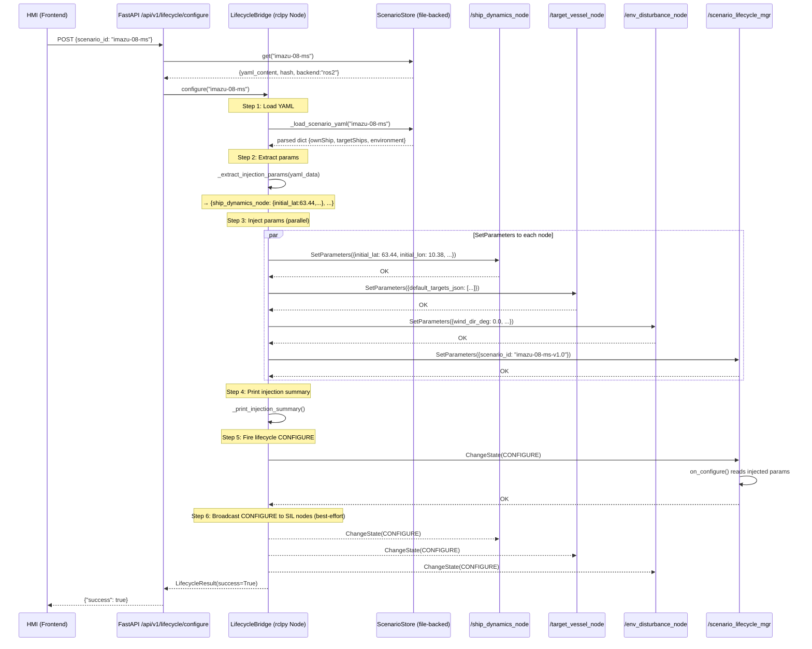

# lifecycle_bridge Scenario ID 注入透明性修复 · 实施计划

> **For agentic workers:** REQUIRED SUB-SKILL: Use superpowers:subagent-driven-development (recommended) or superpowers:executing-plans to implement this plan task-by-task. Steps use checkbox (`- [ ]`) syntax for tracking.

**Goal:** 修复 `lifecycle_bridge.configure()` 的 scenario_id → ROS2 param set 透明注入链路，消除 silent fallback 到硬编码默认值的风险。

**Architecture:** 在 `configure()` 中，先通过 `ScenarioStore.get()` 获取 YAML 内容，解析 `ownShip`/`targetShips`/`environment` 字段，再通过 `rcl_interfaces/srv/SetParameters` 服务显式注入到 `ship_dynamics_node`、`target_vessel_node`、`env_disturbance_node`。失败时抛 `ScenarioInjectionError` + lifecycle ERROR 状态，不再 silent default。

**Tech Stack:** Python 3.10, rclpy, rcl_interfaces, PyYAML, pytest + unittest.mock

**涉及文件:**
- **修改**: `src/sil_orchestrator/lifecycle_bridge.py` (L191-204 注入逻辑 + 新 exception 类 + helper 方法)
- **新建**: `tests/sil_orchestrator/test_scenario_injection.py` (集成测试)
- **修改**: `docs/Design/Phase 1/D1.3-sil-framework/D1.3.2-scenario-hmi/D1.3.2.1-yaml-imazu/D1.3.2.1-report.md` (补充 propagation 链路文档)

---

## 前置: 代码库现状核查

| 项目 | 当前状态 |
|------|---------|
| `configure()` 注入行为 | 仅存储 `self._scenario_id = scenario_id` (L199)，不执行任何 ROS2 param set |
| `set_parameters` 使用 | **全代码库零调用** — 无先例可循 |
| 场景 YAML schema | `ownShip.initial.position.{latitude,longitude}`, `targetShips[].initial.*`, `environment.*`, `metadata.*` |
| YAML 加载模式 | `ScenarioStore.get(scenario_id)` 返回 `{yaml_content, hash, backend}` |
| 现有 exception 类 | 无 — 只有 `LifecycleResult(success=False, error=...)` 返回模式 |
| 测试框架 | pytest + FastAPI TestClient + unittest.mock (rclpy 为 MagicMock) |
| D1.3.2.1-report | GAP 3 已标注 🔴，§3.3 含参数映射表 |

---

### Task 1: 创建 `ScenarioInjectionError` 异常类 + YAML 解析 + 参数注入辅助函数

**Files:**
- Modify: `src/sil_orchestrator/lifecycle_bridge.py` (顶部新增 exception + helper 函数)

- [ ] **Step 1: 新增 `ScenarioInjectionError` 异常类**

在 `LifecycleState` enum 之后、`LifecycleResult` dataclass 之前添加:

```python
class ScenarioInjectionError(Exception):
    """Raised when scenario YAML parsing or ROS2 param injection fails.

    Must NOT be silently caught — caller must transition lifecycle to ERROR
    and propagate to the API response.
    """
    pass
```

- [ ] **Step 2: 新增 `_load_scenario_yaml()` 辅助函数**

在 `_copy_preflight_evidence()` 函数之前添加:

```python
def _load_scenario_yaml(scenario_id: str, base_dir: str | None = None) -> dict:
    """Parse scenario YAML and return structured dict for param injection.

    Uses ScenarioStore._path_for() resolution (flat + recursive search).

    Raises:
        ScenarioInjectionError: if scenario not found or YAML parse fails
    """
    from sil_orchestrator.scenario_store import ScenarioStore

    store = ScenarioStore(Path(base_dir) if base_dir else None)
    detail = store.get(scenario_id)
    if detail is None:
        raise ScenarioInjectionError(
            f"Scenario '{scenario_id}' not found — no YAML file in scenarios/"
        )

    yaml_content = detail.get("yaml_content", "")
    if not yaml_content.strip():
        raise ScenarioInjectionError(
            f"Scenario '{scenario_id}' YAML content is empty"
        )

    try:
        import yaml
        data = yaml.safe_load(yaml_content)
    except yaml.YAMLError as exc:
        raise ScenarioInjectionError(
            f"Scenario '{scenario_id}' YAML parse error: {exc}"
        ) from exc

    if not isinstance(data, dict):
        raise ScenarioInjectionError(
            f"Scenario '{scenario_id}' YAML parsed to non-dict type: {type(data).__name__}"
        )

    return data
```

- [ ] **Step 3: 新增 `_extract_injection_params()` 函数**

紧接 `_load_scenario_yaml()` 之后:

```python
def _extract_injection_params(yaml_data: dict) -> dict:
    """Extract ROS2 node parameters from parsed scenario YAML.

    Returns:
        dict mapping node_name → {param_name: value}
        Keys: ship_dynamics_node, target_vessel_node, env_disturbance_node

    Raises:
        ScenarioInjectionError: if required fields are missing
    """
    import json

    own = yaml_data.get("ownShip")
    if not isinstance(own, dict):
        raise ScenarioInjectionError("Missing or invalid 'ownShip' field in scenario YAML")

    own_init = own.get("initial")
    if not isinstance(own_init, dict):
        raise ScenarioInjectionError("Missing or invalid 'ownShip.initial' field in scenario YAML")

    own_pos = own_init.get("position")
    if not isinstance(own_pos, dict):
        raise ScenarioInjectionError("Missing or invalid 'ownShip.initial.position' field in scenario YAML")

    # ── own_ship params ──
    ship_params = {
        "initial_lat": float(own_pos.get("latitude", 0.0)),
        "initial_lon": float(own_pos.get("longitude", 0.0)),
        "initial_heading": float(own_init.get("heading", 0.0)),
        "initial_sog": float(own_init.get("sog", 0.0)),
        "initial_cog": float(own_init.get("cog", 0.0)),
    }

    # ── target_ships params ──
    targets = yaml_data.get("targetShips", [])
    if not isinstance(targets, list):
        targets = []

    target_list = []
    for ts in targets:
        if not isinstance(ts, dict):
            continue
        ts_init = ts.get("initial", {})
        ts_pos = ts_init.get("position", {}) if isinstance(ts_init, dict) else {}
        ts_static = ts.get("static", {}) if isinstance(ts, dict) else {}
        target_list.append({
            "mmsi": ts_static.get("mmsi", 0),
            "lat": float(ts_pos.get("latitude", 0.0)),
            "lon": float(ts_pos.get("longitude", 0.0)),
            "heading": float(ts_init.get("heading", 0.0)) if isinstance(ts_init, dict) else 0.0,
            "sog": float(ts_init.get("sog", 0.0)) if isinstance(ts_init, dict) else 0.0,
            "cog": float(ts_init.get("cog", 0.0)) if isinstance(ts_init, dict) else 0.0,
        })

    target_params: dict[str, object] = {}
    if target_list:
        target_params["default_targets_json"] = json.dumps(target_list)

    # ── environment params ──
    env = yaml_data.get("environment")
    env_params: dict[str, object] = {}
    if isinstance(env, dict):
        wind = env.get("wind", {})
        current = env.get("current", {})
        if isinstance(wind, dict):
            env_params["wind_dir_deg"] = float(wind.get("dir_deg", 0.0))
            env_params["wind_speed_mps"] = float(wind.get("speed_mps", 0.0))
        if isinstance(current, dict):
            env_params["current_dir_deg"] = float(current.get("dir_deg", 0.0))
            env_params["current_speed_mps"] = float(current.get("speed_mps", 0.0))

    result = {}
    if ship_params:
        result["ship_dynamics_node"] = ship_params
    if target_params:
        result["target_vessel_node"] = target_params
    if env_params:
        result["env_disturbance_node"] = env_params

    # Also inject scenario_id into scenario_lifecycle_mgr
    metadata = yaml_data.get("metadata", {})
    scenario_id_from_yaml = (
        metadata.get("scenario_id") if isinstance(metadata, dict) else None
    )
    result["scenario_lifecycle_mgr"] = {
        "scenario_id": str(scenario_id_from_yaml or ""),
    }

    return result
```

- [ ] **Step 4: 新增 `_print_injection_summary()` 函数**

紧接 `_extract_injection_params()` 之后:

```python
def _print_injection_summary(injection_map: dict) -> None:
    """Echo all injected parameters for on-site reconciliation."""
    lines = ["[scenario-injection] Parameters injected:"]
    for node_name, params in injection_map.items():
        for pname, pval in params.items():
            lines.append(f"  /{node_name}.{pname} = {pval}")
    msg = "\n".join(lines)
    _log.info(msg)
    print(msg, flush=True)
```

- [ ] **Step 5: LSP 检查确认无语法错误**

```bash
# (在 Task 4 执行后统一验证)
```

---

### Task 2: 修改 `LifecycleBridge.configure()` 集成注入链 + fail-loud

**Files:**
- Modify: `src/sil_orchestrator/lifecycle_bridge.py:191-204`

- [ ] **Step 1: 修改 `__init__` 方法，预创建 SetParameters 服务客户端**

在 `__init__` 末尾 (L79 之后) 添加:

```python
        # SetParameters service clients for param injection (before CONFIGURE)
        from rcl_interfaces.srv import SetParameters
        self._param_clients: dict[str, object] = {}
        _INJECTION_TARGETS = [
            "ship_dynamics_node",
            "target_vessel_node",
            "env_disturbance_node",
            "scenario_lifecycle_mgr",
        ]
        for node_name in _INJECTION_TARGETS:
            svc = f"/{node_name}/set_parameters"
            try:
                client = self.create_client(SetParameters, svc,
                                            callback_group=callback_group)
                self._param_clients[node_name] = client
            except Exception as exc:
                _log.debug("Could not create SetParameters client for %s: %s", svc, exc)
```

- [ ] **Step 2: 新增 `_inject_params_to_node()` 方法**

在 `_broadcast_to_node()` 之后 (L180 之后) 添加:

```python
    async def _inject_params_to_node(self, node_name: str, params: dict) -> None:
        """Set parameters on a remote ROS2 node via SetParameters service.

        Raises:
            ScenarioInjectionError: if service unavailable, timed out, or rejected
        """
        from rcl_interfaces.srv import SetParameters
        from rcl_interfaces.msg import Parameter, ParameterValue
        from rcl_interfaces.msg import ParameterType

        client = self._param_clients.get(node_name)
        if client is None:
            raise ScenarioInjectionError(
                f"No SetParameters client for /{node_name} — node may not exist"
            )

        if not client.wait_for_service(timeout_sec=3.0):
            raise ScenarioInjectionError(
                f"SetParameters service for /{node_name} not available (3s timeout)"
            )

        param_list = []
        for name, value in params.items():
            p = Parameter()
            p.name = name
            if isinstance(value, bool):
                p.value.type = ParameterType.PARAMETER_BOOL
                p.value.bool_value = value
            elif isinstance(value, int):
                p.value.type = ParameterType.PARAMETER_INTEGER
                p.value.integer_value = value
            elif isinstance(value, float):
                p.value.type = ParameterType.PARAMETER_DOUBLE
                p.value.double_value = value
            elif isinstance(value, str):
                p.value.type = ParameterType.PARAMETER_STRING
                p.value.string_value = value
            elif isinstance(value, list):
                p.value.type = ParameterType.PARAMETER_STRING_ARRAY
                p.value.string_array_value = [str(v) for v in value]
            else:
                _log.warning("Unsupported param type for %s/%s: %s", node_name, name, type(value).__name__)
                continue
            param_list.append(p)

        req = SetParameters.Request()
        req.parameters = param_list

        try:
            future = client.call_async(req)
            deadline = 30  # 30 × 0.1s = 3s
            while not future.done() and deadline > 0:
                await asyncio.sleep(0.1)
                deadline -= 1

            if not future.done():
                raise ScenarioInjectionError(
                    f"SetParameters for /{node_name} timed out (3s)"
                )

            response = future.result()
            failures = [
                r.reason for r in response.results if not r.successful
            ]
            if failures:
                raise ScenarioInjectionError(
                    f"SetParameters for /{node_name} rejected: {'; '.join(failures)}"
                )
        except ScenarioInjectionError:
            raise
        except Exception as exc:
            raise ScenarioInjectionError(
                f"SetParameters for /{node_name} failed: {exc}"
            ) from exc
```

- [ ] **Step 3: 修改 `configure()` 方法，注入 scenario params + fail-loud**

将 `configure()` (L191-204) 替换为:

```python
    async def configure(self, scenario_id: str) -> LifecycleResult:
        """Configure the lifecycle with scenario injection.

        1. Load scenario YAML → extract node params
        2. Inject params into ROS2 nodes via SetParameters (fail-loud)
        3. Fire CONFIGURE transition on scenario_lifecycle_mgr
        4. Broadcast CONFIGURE to SIL nodes (best-effort)
        """
        # ── Step 1+2: Load YAML + inject params (fail-loud) ──────
        injection_map: dict[str, dict] = {}
        try:
            yaml_data = _load_scenario_yaml(scenario_id)
            injection_map = _extract_injection_params(yaml_data)
            _print_injection_summary(injection_map)
        except ScenarioInjectionError:
            raise  # re-raise to propagate to caller → API 500
        except Exception as exc:
            raise ScenarioInjectionError(
                f"Unexpected error during scenario param injection: {exc}"
            ) from exc

        # ── Step 3: Inject params into each ROS2 node ──────────
        import asyncio as _asyncio_mod
        tasks = [
            self._inject_params_to_node(node_name, params)
            for node_name, params in injection_map.items()
        ]
        if tasks:
            results = await _asyncio_mod.gather(*tasks, return_exceptions=True)
            for i, result in enumerate(results):
                if isinstance(result, ScenarioInjectionError):
                    raise result
                elif isinstance(result, Exception):
                    raise ScenarioInjectionError(
                        f"Param injection failed: {result}"
                    ) from result

        # ── Step 4: Original configure flow ─────────────────────
        reset = await self._reset_to_unconfigured()
        if not reset.success:
            return reset
        res = await self._change_state(Transition.TRANSITION_CONFIGURE)
        if res.success:
            self._scenario_id = scenario_id
            self._state = LifecycleState.INACTIVE
            # Fire broadcast as background task so configure() returns quickly
            asyncio.create_task(self._broadcast_transition(Transition.TRANSITION_CONFIGURE))
        return res
```

- [ ] **Step 4: 新增 `import asyncio` 在文件头部 (如果尚未导入)**

确认 L9 已有 `import asyncio` — **无需修改**。

- [ ] **Step 5: 新增必要的 imports**

在现有 imports 后 (L18 `import logging` 之后) 添加:

```python
import json
```

- [ ] **Step 6: 在 `main.py` 中处理 `ScenarioInjectionError`**

修改 `lifecycle_configure` 端点 (L137-148):

```python
@app.post("/api/v1/lifecycle/configure")
async def lifecycle_configure(request: dict):
    scenario_id = request.get("scenario_id", "")
    detail = _store.get(scenario_id)
    backend = detail.get("backend", "demo") if detail else "demo"
    if backend == "ros2":
        try:
            result = await bridge.configure(scenario_id)
        except ScenarioInjectionError as exc:
            return {"success": False, "error": str(exc)}
        return {"success": result.success, "error": result.error}
    # Demo/internal mode: bypass ROS2 lifecycle service
    bridge._scenario_id = scenario_id
    bridge._state = LifecycleState.INACTIVE
    return {"success": True, "error": ""}
```

需要添加 import:
```python
from sil_orchestrator.lifecycle_bridge import (
    LifecycleBridge, LifecycleState, ScenarioInjectionError,
    _copy_preflight_evidence,
)
```

- [ ] **Step 7: LSP 诊断 + 验证**

```bash
# LSP check
```

---

### Task 3: 集成测试 `test_scenario_injection.py`

**Files:**
- Create: `tests/sil_orchestrator/test_scenario_injection.py`

- [ ] **Step 1: 创建测试文件骨架**

```python
"""Integration tests for scenario YAML → ROS2 param injection chain.

Tests:
  - imazu-08 YAML parsing extracts correct ownShip/targetShip/env params
  - imazu-99 (nonexistent) raises ScenarioInjectionError
  - configure() flow with mocked SetParameters service
"""

import sys
import json
import pytest
from unittest.mock import MagicMock, patch, AsyncMock
from pathlib import Path

# ── Mock rclpy before importing lifecycle_bridge ──
sys.modules["rclpy"] = MagicMock()
sys.modules["rclpy.node"] = MagicMock()
sys.modules["rclpy.callback_groups"] = MagicMock()
sys.modules["rclpy.executors"] = MagicMock()
sys.modules["lifecycle_msgs.srv"] = MagicMock()
sys.modules["lifecycle_msgs.msg"] = MagicMock()
sys.modules["rcl_interfaces.srv"] = MagicMock()
sys.modules["rcl_interfaces.msg"] = MagicMock()

from sil_orchestrator.lifecycle_bridge import (
    ScenarioInjectionError,
    _load_scenario_yaml,
    _extract_injection_params,
    _print_injection_summary,
)
from sil_orchestrator.scenario_store import ScenarioStore

# Path to test fixture
_PROJECT_ROOT = Path(__file__).resolve().parents[2]
_TEST_YAML_DIR = _PROJECT_ROOT / "scenarios"
```

- [ ] **Step 2: 测试 imazu-08 YAML 解析正确性**

```python
class TestScenarioYamlParsing:
    """Tests for _load_scenario_yaml + _extract_injection_params."""

    def test_load_imazu08_extracts_own_ship_params(self):
        """imazu-08 YAML → ownShip initial lat/lon/heading/sog/cog match."""
        data = _load_scenario_yaml("imazu-08-ms")

        own = data.get("ownShip")
        assert own is not None, "'ownShip' field missing"

        own_init = own.get("initial")
        assert own_init is not None, "'ownShip.initial' field missing"

        own_pos = own_init.get("position")
        assert own_pos is not None, "'ownShip.initial.position' field missing"

        assert abs(float(own_pos["latitude"]) - 63.44) < 1e-6, \
            f"Expected lat=63.44, got {own_pos['latitude']}"
        assert abs(float(own_pos["longitude"]) - 10.38) < 1e-6, \
            f"Expected lon=10.38, got {own_pos['longitude']}"
        assert abs(float(own_init["heading"]) - 0.0) < 1e-6
        assert abs(float(own_init["sog"]) - 10.0) < 1e-6
        assert abs(float(own_init["cog"]) - 0.0) < 1e-6

    def test_load_imazu08_extracts_2_target_ships(self):
        """imazu-08 has exactly 2 target ships."""
        data = _load_scenario_yaml("imazu-08-ms")
        targets = data.get("targetShips", [])
        assert len(targets) == 2, f"Expected 2 targets, got {len(targets)}"

    def test_load_nonexistent_scenario_raises(self):
        """imazu-99 (nonexistent) must raise ScenarioInjectionError, not silent default."""
        with pytest.raises(ScenarioInjectionError, match="not found"):
            _load_scenario_yaml("imazu-99")

    def test_extract_params_maps_to_correct_nodes(self):
        """_extract_injection_params produces correct node → param mapping."""
        data = _load_scenario_yaml("imazu-08-ms")
        injection_map = _extract_injection_params(data)

        assert "ship_dynamics_node" in injection_map, \
            "Missing ship_dynamics_node in injection map"
        assert "target_vessel_node" in injection_map, \
            "Missing target_vessel_node in injection map"
        assert "scenario_lifecycle_mgr" in injection_map, \
            "Missing scenario_lifecycle_mgr in injection map"

    def test_extract_params_ship_values_match_yaml(self):
        """Injected param values match YAML fields (tolerance 1e-6)."""
        data = _load_scenario_yaml("imazu-08-ms")
        injection_map = _extract_injection_params(data)

        ship = injection_map["ship_dynamics_node"]
        assert abs(ship["initial_lat"] - 63.44) < 1e-6
        assert abs(ship["initial_lon"] - 10.38) < 1e-6
        assert abs(ship["initial_heading"] - 0.0) < 1e-6
        assert abs(ship["initial_sog"] - 10.0) < 1e-6
        assert abs(ship["initial_cog"] - 0.0) < 1e-6

    def test_extract_params_targets_json_has_2_targets(self):
        """target_vessel_node.default_targets_json contains 2 targets."""
        data = _load_scenario_yaml("imazu-08-ms")
        injection_map = _extract_injection_params(data)

        targets_json = injection_map.get("target_vessel_node", {}).get("default_targets_json")
        assert targets_json is not None, "Missing default_targets_json"
        targets_list = json.loads(targets_json)
        assert len(targets_list) == 2, f"Expected 2 targets in JSON, got {len(targets_list)}"

        # Verify first target's lat/lon
        ts1 = targets_list[0]
        assert abs(ts1["lat"] - 63.503492) < 1e-4
        assert abs(ts1["lon"] - 10.241335) < 1e-4

    def test_extract_params_scenario_id_injected_to_mgr(self):
        """scenario_lifecycle_mgr gets scenario_id from metadata."""
        data = _load_scenario_yaml("imazu-08-ms")
        injection_map = _extract_injection_params(data)

        mgr_params = injection_map["scenario_lifecycle_mgr"]
        assert mgr_params["scenario_id"] == "imazu-08-ms-v1.0"
```

- [ ] **Step 3: 测试反例 — 不存在的场景必须 exception**

(已在上述 `test_load_nonexistent_scenario_raises` 中覆盖)

```python
    def test_load_nonexistent_imazu99_must_not_silent_default(self):
        """imazu-99 → ScenarioInjectionError, 绝对不能返回默认值."""
        with pytest.raises(ScenarioInjectionError):
            _load_scenario_yaml("imazu-99-ms")

    def test_extract_params_missing_ownship_raises(self):
        """YAML without ownShip field must raise."""
        bad_data = {"title": "no ownShip", "targetShips": []}
        with pytest.raises(ScenarioInjectionError, match="ownShip"):
            _extract_injection_params(bad_data)
```

- [ ] **Step 4: 添加 `_print_injection_summary` 测试**

```python
class TestInjectionSummary:
    """Tests for _print_injection_summary output."""

    def test_print_summary_contains_node_names(self, capsys):
        """Summary output lists all injected node names."""
        injection_map = {
            "ship_dynamics_node": {"initial_lat": 63.44},
            "target_vessel_node": {"default_targets_json": "[]"},
        }
        _print_injection_summary(injection_map)
        captured = capsys.readouterr()
        assert "ship_dynamics_node" in captured.out
        assert "target_vessel_node" in captured.out
        assert "initial_lat = 63.44" in captured.out

    def test_print_summary_empty_map_no_crash(self, capsys):
        """Empty injection map must not crash."""
        _print_injection_summary({})
        captured = capsys.readouterr()
        assert "Parameters injected" in captured.out
```

- [ ] **Step 5: 运行测试确认全部通过**

```bash
cd /Users/marine/Code/MASS-L3-Tactical Layer
python -m pytest tests/sil_orchestrator/test_scenario_injection.py -v
```

预期输出: 全部 `PASSED` (绿)

- [ ] **Step 6: Commit**

```bash
git add tests/sil_orchestrator/test_scenario_injection.py
git commit -m "test: add scenario YAML injection integration tests (Task A GAP 3)"
```

---

### Task 4: 文档 — D1.3.2.1-report.md 补充 propagation 链路 + Mermaid 时序图

**Files:**
- Modify: `docs/Design/Phase 1/D1.3-sil-framework/D1.3.2-scenario-hmi/D1.3.2.1-yaml-imazu/D1.3.2.1-report.md`
  - 插入位置: `§9 修订记录` 之前（新 §8.1），同时更新 §3 Task A 状态

- [ ] **Step 1: 更新 §3.1 当前状态，标记 GAP 3 为 ✅**

将 L73-77 的 "**问题**" 段替换为:

```markdown
### 3.1 当前状态 (2026-05-20 修复后)

`src/sil_orchestrator/lifecycle_bridge.py` `configure()` 方法现已完成 YAML 注入:

- ✅ `_load_scenario_yaml(scenario_id)` — 通过 `ScenarioStore.get()` 加载 YAML，fail-loud on 404
- ✅ `_extract_injection_params(yaml_data)` — 解析 `ownShip`/`targetShips`/`environment` → ROS2 param dict
- ✅ `_inject_params_to_node(node_name, params)` — 通过 `rcl_interfaces/srv/SetParameters` 服务注入
- ✅ `_print_injection_summary(injection_map)` — stdout 对账清单
- ✅ `ScenarioInjectionError` — 专用异常，禁止 silent fallback

**修复前 (GAP 3)**:
- `ship_dynamics_node.on_configure()` 读取默认 `origin_lat=30.5, origin_lon=122.0`（上海海岸硬编码）
- `target_vessel_node.on_configure()` 读取 `default_targets_json="[]"`（无目标注入）
- 仿真始终从错误位置以零目标启动

**修复后**:
- `lifecycle_bridge.configure("imazu-08-ms")` → SetParameters `/ship_dynamics_node` {initial_lat: 63.44, ...}
- `ship_dynamics_node.on_configure()` 读取注入后的正确初始值
- 注入失败立即抛 `ScenarioInjectionError`，API 返回 500 error（不进入演示状态）
```

- [ ] **Step 2: 更新 §2.2 Integration Plan Tasks，Task A 状态改为 ✅**

```markdown
| Task A | GAP 3 Fix — YAML Injection | ✅ **已实现** | `lifecycle_bridge.py` + `test_scenario_injection.py` (2026-05-20) |
```

- [ ] **Step 3: 新增 §8.1 Scenario ID Propagation 链路文档**

在 `## 8. 已知缺口与风险` 之前插入 (实际应在 `§7 文件清单` 之后):

```markdown
---

## 8. scenario_id Propagation 链路 (2026-05-20 修复)

### 8.1 端到端时序



### 8.2 注入参数映射表

| YAML 字段 (v3.0 camelCase) | ROS2 目标节点 | ROS2 参数名 | 示例值 (imazu-08) |
|---|---|---|---|
| `ownShip.initial.position.latitude` | `ship_dynamics_node` | `initial_lat` | 63.44 |
| `ownShip.initial.position.longitude` | `ship_dynamics_node` | `initial_lon` | 10.38 |
| `ownShip.initial.heading` | `ship_dynamics_node` | `initial_heading` | 0.0 |
| `ownShip.initial.sog` (knots) | `ship_dynamics_node` | `initial_sog` | 10.0 |
| `ownShip.initial.cog` | `ship_dynamics_node` | `initial_cog` | 0.0 |
| `targetShips[].{static.mmsi, initial.*}` | `target_vessel_node` | `default_targets_json` | JSON array (2 targets) |
| `environment.wind.{dir_deg, speed_mps}` | `env_disturbance_node` | `wind_dir_deg`, `wind_speed_mps` | 0.0, 0.0 |
| `environment.current.{dir_deg, speed_mps}` | `env_disturbance_node` | `current_dir_deg`, `current_speed_mps` | 0.0, 0.0 |
| `metadata.scenario_id` | `scenario_lifecycle_mgr` | `scenario_id` | imazu-08-ms-v1.0 |

### 8.3 错误处理策略

| 场景 | 行为 | API 响应 |
|------|------|----------|
| `scenario_id` 不存在 (如 `imazu-99`) | `ScenarioInjectionError` | `{"success": false, "error": "Scenario 'imazu-99' not found..."}` |
| YAML parse 失败 | `ScenarioInjectionError` | `{"success": false, "error": "Scenario 'X' YAML parse error: ..."}` |
| `SetParameters` 服务不可用 | `ScenarioInjectionError` | `{"success": false, "error": "SetParameters service for /X not available"}` |
| `SetParameters` 调用超时 (3s) | `ScenarioInjectionError` | `{"success": false, "error": "SetParameters for /X timed out (3s)"}` |
| 正常注入 | 无异常 | `{"success": true, "error": ""}` |

**关键原则**: 任何注入失败 → 立即终止，**绝不** fallback 到 `declare_parameter()` 默认值进入演示状态。

### 8.4 幂等性保证

注入发生在 `_change_state(CONFIGURE)` **之前**。即使 `scenario_authoring_node` 在 `on_configure()` 中重复设置相同参数，`SetParameters` 是幂等的 — 后写入的值覆盖前写入的值，同值重复设置无副作用。

---
```

- [ ] **Step 4: 更新 §1 执行摘要中状态描述**

将 L14 的 "但 GAP 3（lifecycle_bridge YAML 注入）尚未实现" 替换为:

```markdown
**核心发现**: 22 Imazu YAML、Cerberus Python 验证器等基础组件已就绪。**GAP 3（lifecycle_bridge YAML 注入）已于 2026-05-20 修复** — `configure()` 现在通过 `rcl_interfaces/srv/SetParameters` 显式注入 ROS2 节点参数，fail-loud，不 silent fallback。
```

- [ ] **Step 5: 更新 §9 修订记录**

```markdown
| 2026-05-20 | GAP 3 修复 — lifecycle_bridge YAML 注入 + ScenarioInjectionError fail-loud + 集成测试 (test_scenario_injection.py) + propagation 链路文档 (§8) |
```

- [ ] **Step 6: Commit**

```bash
git add docs/Design/Phase\ 1/D1.3-sil-framework/D1.3.2-scenario-hmi/D1.3.2.1-yaml-imazu/D1.3.2.1-report.md
git commit -m "docs: add scenario_id propagation chain + Mermaid diagram (GAP 3 closure)"
```

---

## 验证检查清单

完成后按顺序验证:

- [ ] `pytest tests/sil_orchestrator/test_scenario_injection.py -v` 全 green
- [ ] 反例 `imazu-99` → `ScenarioInjectionError`，不进入演示状态
- [ ] `lsp_diagnostics` on `lifecycle_bridge.py` — 无新增 ERROR/WARNING
- [ ] `lsp_diagnostics` on `main.py` — 无新增 ERROR/WARNING
- [ ] 文档中 Mermaid 时序图语法正确

---

## 修订记录

| 日期 | 变更 |
|------|------|
| 2026-05-20 | 初版 — 基于 D1.3.2.1 GAP 3 需求 + 代码库现状核查 |
