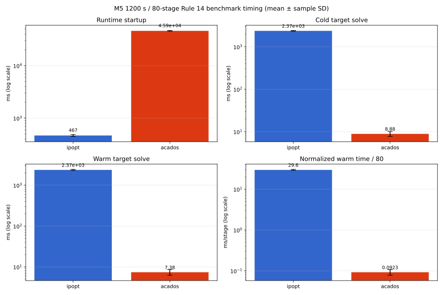
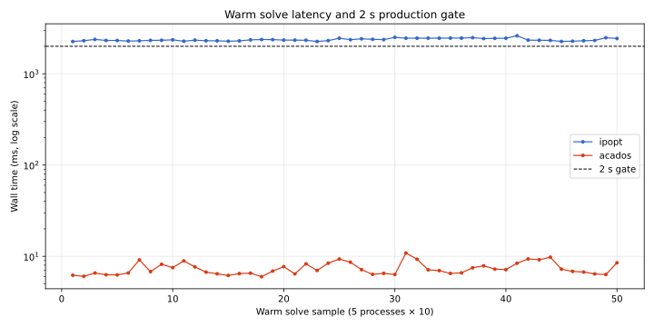
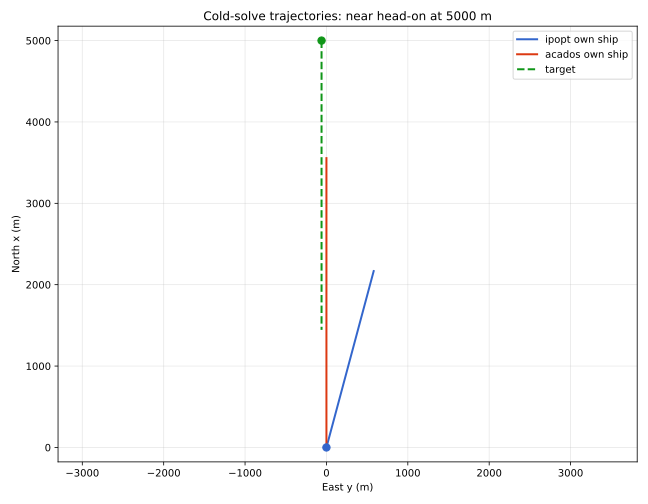
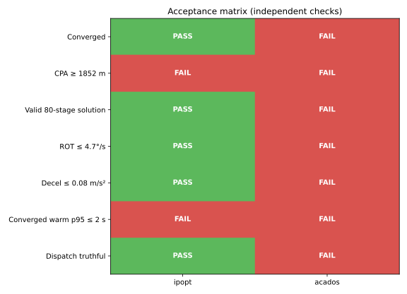

# M5 1200 秒 Rule 14 IPOPT/acados 公平基准报告

日期：2026-07-20

工作树：`/home/marine.huang/Code/mass-l3/.worktrees/m5-design-grounding`

分支：`codex/m5-design-grounding`

HEAD：`c46e01045e1ad443cdadb835e62d822fc6b738a7`

## 1. 总结

总体判定：**FAIL**。

- IPOPT：5/5 cold、50/50 warm 均报告 `Converged`；但独立轨迹 CPA 只有 `547.186 m`，远低于 `1852 m` 硬安全线；warm p95 `2485.276 ms`，超过 2 秒门槛。
- acados：5/5 cold、50/50 warm 全部 `NumericalFailure`；raw acados status `4`，QP 在 SQP 第 1 轮失败。7–9 ms 是“快速失败时间”，不能解释为求解优势。
- acados 启动：平均 `45.877 s`，主要来自构造函数内部 capsule warm-up；IPOPT 启动平均 `467.108 ms`。
- 当前 dispatch 对该场景返回 `all_pass`，但实际 acados 必然 QP failure，且直航预测 CPA 约 60 m。dispatch 判定与求解事实不一致。
- 两个求解器都未满足“1200 秒范围内产生安全、可执行、可恢复的 Rule 14 避碰轨迹”。

## 2. 场景与公平性

| 参数 | 值 |
|---|---:|
| 场景 | Rule 14 近对头 |
| 初始距离 | 5000 m |
| 横向偏置 | -60 m |
| 相对方位偏置 | 约 0.69° |
| 自船速度 | 3 m/s |
| 目标速度 | 3 m/s |
| TCPA | 833.273 s |
| 初始预测 CPA | 60 m |
| CPA hard/safe | 1852 m |
| 时域 | 1200 s |
| N | 80 |
| dt | 15 s |
| 规则/角色 | Rule 14 / BOTH_GIVE_WAY |
| 指令方向 | STARBOARD |
| 最小实质转向 | 15° |
| ROT 上限 | 4.7°/s |
| 减速度上限 | 0.08 m/s² |

60 m 偏置用于消除完全对称的数值奇点；仍属于近似相反航向、存在碰撞危险的 Rule 14 对头态势。

公平控制：

- 同一个 `MidMpcInput`。
- 同一 N=80、dt=15 s、1200 s 时域。
- 同一权重：`w_colreg=30, w_dist=10, w_route=3, w_vel=1`。
- 相同速度/航向/CPA/Rule 14/右舷约束。
- Release build；CPU 15；单线程 BLAS/OMP。
- 每个后端 5 个独立进程。
- 每进程：1 次 cold target solve + 10 次 warm target solve。
- 执行顺序交替，降低热态/背景负载顺序偏差。

限制：IPOPT 与 acados 使用不同内部 formulation/physics。本测试比较“当前两个生产后端实现”，不能把全部差异单独归因给求解算法。

## 3. 时间结果

单位均为墙钟时间。

| 指标 | IPOPT mean ± SD | IPOPT p50 / p95 | acados mean ± SD | acados p50 / p95 |
|---|---:|---:|---:|---:|
| 启动总时间 | 467.108 ± 19.533 ms | 469.271 / 488.233 ms | 45876.957 ± 746.814 ms | 45661.847 / 46876.807 ms |
| Cold solve | 2367.645 ± 45.856 ms | 2371.658 / 2411.532 ms | 8.881 ± 1.164 ms | 8.782 / 10.135 ms |
| Warm solve | 2367.207 ± 78.540 ms | 2339.660 / 2485.276 ms | 7.383 ± 1.171 ms | 6.982 / 9.347 ms |
| Warm / 80 步 | 29.590 ± 0.982 ms/步 | 29.246 / 31.066 | 0.0923 ± 0.0146 ms/步 | 0.0873 / 0.1168 |
| 单进程完整基准 | 26506.823 ± 590.263 ms | 26583.905 / 27241.490 ms | 45959.666 ± 746.955 ms | 45750.122 / 46958.661 ms |
| 外部进程墙钟 | 26563.073 ± 588.787 ms | 26629.212 / 27297.340 ms | 45967.914 ± 746.363 ms | 45758.608 / 46966.014 ms |

重要解释：acados 的 cold/warm 7–10 ms 全部对应 `NumericalFailure`。不能与 IPOPT 的成功迭代时间直接做“快 300 倍”结论。





## 4. 求解与安全结果

| 检查 | IPOPT | acados |
|---|---|---|
| Cold 状态 | 5/5 Converged | 0/5；5/5 NumericalFailure |
| Warm 状态 | 50/50 Converged | 0/50；50/50 NumericalFailure |
| 迭代 | 固定 134 | SQP 第 1 轮 QP failure |
| 输出点数 | 80 个有效求解点 | 80 个冷启动 seed 点；不是有效解 |
| 独立最小 CPA | 547.186 m | 72.311 m（失败 seed） |
| CPA hard | 1852 m | 1852 m |
| CPA 缺口 | 1304.814 m | 1779.689 m |
| 最大右转 | 15° | 0° |
| 最大 ROT | 1.0°/s | 0（失败 seed） |
| 最大减速度 | 0.0800000 m/s² | 0（失败 seed） |
| 终端横向偏移 | 580.753 m | 0（失败 seed） |
| 终端航向 | 15°；未返航 | 0°（失败 seed） |
| 2 s warm p95 | FAIL：2485.276 ms | 不适用；所有样本失败 |

IPOPT 虽然数值状态为 `Converged`，但轨迹：

1. 第一个阶段立即达到 15°右转、最大允许减速。
2. 仍只有 547 m CPA。
3. solver 报告 `cpa_slack≈4.67e-12`，与独立轨迹 CPA 结果矛盾。
4. 1200 秒末仍保持 15°、横向偏移约 581 m，没有稳定返航。

因此 IPOPT 结果不能发布为安全避碰计划。

acados：

1. capsule benign warm-up 报成功。
2. 一进入目标场景，HPIPM QP 在 SQP 第 1 轮返回错误 3。
3. wrapper 映射为 `NumericalFailure`、raw status 4。
4. 返回轨迹等于直航初始 seed，不是求解结果。





## 5. Dispatch 独立发现

acados binary 在全部 5 个进程中返回：

```text
acados_dispatched=true
reason=all_pass
C1=true
C2=ONSET
C3 gap_h=1.387 m
C4 r_reach=1.885e-05
C5 align_sin=0.012
```

但该场景的真正直航最小 CPA 约 60 m，正确 hard-gap 应约为：

```text
1852 - 60 = 1792 m
```

当前 `horizon_projected_cpa_gap()` 在预测距离第一次进入 `cpa_hard` 后立即 `break`，返回“刚进入安全线时的浅缺口”，没有扫描完整时域最小 CPA：

```cpp
if (min_cpa <= cpa_hard) break;
```

位置：`mid_mpc_solver.hpp:215-228`。

严重度：Critical。

影响：dispatch 将深度碰撞航迹错误分类为 `all_pass`，随后把输入送给已知无法处理该非线性起点的 acados，造成确定性 QP failure。

## 6. 结论

### IPOPT

- 优点：当前输入上确定性收敛；无崩溃；约 2.37 s。
- 缺点：p95 超 2 s；独立 CPA 严重不合格；slack/约束报告与轨迹不一致；无返航。
- 判定：数值收敛，功能/安全不通过。

### acados

- 优点：失败返回快速且确定；正常运行阶段理论开销低。
- 缺点：启动 warm-up 约 45.9 s；55/55 目标求解失败；没有可比较的成功求解时间。
- 判定：不满足 1200 秒 Rule 14 求解要求。

### 选择建议

当前不能选 acados 替代 IPOPT。也不能把当前 IPOPT 轨迹当作合格方案。

修复顺序：

1. 修复 C3 全时域 min-CPA 扫描，避免错误 dispatch。
2. 建立 solver 输出后的独立 CPA hard-floor fail-closed gate；不得相信 solver status/slack 单独判定。
3. 对齐 IPOPT constraint/slack 与输出轨迹坐标、stage/time semantics。
4. 修复 acados infeasible-start/QP conditioning、seed、slack 激活问题。
5. 重跑本基准；只有 acados 成功样本才能进入性能比较。
6. 加入 1200 秒末 past-and-clear + route-return 验收。

## 7. 证据清单

- `runner_rule14_1200.cpp`：独立基准源。
- `build_ipopt.log`、`build_acados.log`：两个后端构建记录。
- `raw/ipopt_rep1..5.json`、`raw/acados_rep1..5.json`：原始结果。
- `logs/ipopt_rep1..5.log`、`logs/acados_rep1..5.log`：原始solver日志。
- `runs_summary.csv`：每进程汇总。
- `summary.json`：统计结果。
- `timing_comparison.svg`。
- `warm_latency.svg`。
- `trajectory_comparison.svg`。
- `acceptance_matrix.svg`。
- `tools/benchmarks/m5_solver_ab_1200/analyze.py`：统计与绘图脚本。

Runner SHA-256：`ea4365d35b7348e3b0dd69b2a26eea3b1bb252fda26f7878c3c8f0891f6b05b4`。

本基准未修改任何生产源码；可重跑工具位于
`tools/benchmarks/m5_solver_ab_1200/`，本次版本化证据位于当前目录；完整 PNG
与运行中间文件仍保留在 gitignored `runs/m5_solver_ab_20260720/`。
