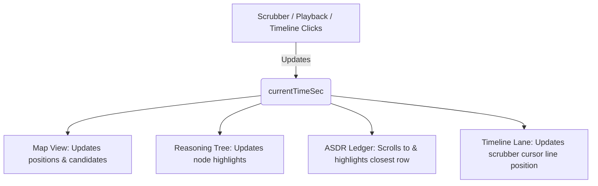

# Design Spec: Simulation Evaluator Screen Improvements (Option A)

This document specifies the design for the improvements to the Simulation Evaluator (Screen 4) of the MASS-L3-Tactical-Layer HMI.

## 1. Goal & Requirements

The Simulation Evaluator screen plays a dual role: providing intuitive, high-level feedback to operators/captains (transparency) and serving as a whitesheet analytical dashboard for V&V test engineers.

The improved screen must support:
- **Interactive Replay & Playback Controls**: Replay the full run trajectory with time-scrubbing.
- **Enlarged Map Visualization**: Highlight vessel safety domains and display M5 planner candidate trajectories overlayed on the map.
- **Bidirectionally Linked Timeline**: Link the temporal slider with map vessel positions, timeline events, and ASDR ledger log entries.
- **COLREGs Decision Tree Rendering**: Render the dynamic reasoning state tree of the COLREGs planner (M6) corresponding to the scrubbed moment.
- **Automated Boundary Diagnostics & Tuning Suggestions**: Auto-analyze the run metrics and events to identify performance breaches and suggest control/safety parameters to optimize.

---

## 2. Interface Layout & Architecture

Incorporate user feedback to **maximize map space** to ensure clear visualization of complex spatial details (safety domains, trajectory candidate lines). We use a responsive three-column dashboard layout with prioritized space allocation:

```
+-----------------------------------------------------------------------------+
|                                  TOP CHROME                                 |
+------------------------------------+--------------------+-------------------+
| COLUMN 1: SPATIAL REPLAY (40%)     | COLUMN 2: TEMPORAL | COLUMN 3: ANALY-  |
|                                    | AUDIT (30%)        | TICS & DIAG (30%) |
| +--------------------------------+ | +----------------+ | +---------------+ |
| |                                | | | Event Timeline | | | 8 KPI Cards   | |
| |          ENLARGED MAP          | | | (6-Lane Audit) | | | Row           | |
| |       (Safety Envelopes +      | | +----------------+ | +---------------+ |
| |       Candidate Routes)        | | |                | | | Automated     | |
| |                                | | | COLREGs        | | | Boundary      | |
| |                                | | | Reasoning      | | | Diagnostics   | |
| +--------------------------------+ | | Decision Tree  | | | & Suggestions | |
| | Play / Pause / Rate / Scrub    | | |                | | +---------------+ |
| +--------------------------------+ | |                    | | | ASDR Ledger | |
|                                    | +----------------+ | | Table         | |
|                                    |                    | +---------------+ |
+------------------------------------+--------------------+-------------------+
```

### Component Details:
1. **Column 1: Spatial Replay (40% width)**
   - **Enlarged Map View**: Height expanded. Shows the own ship, target ships, and their respective safety domains (observation, action, critical boundaries). Draws candidate trajectories predicted by M5.
   - **Playback Panel**: Play/pause button, playback rate selector (`0.5x`, `1x`, `2x`, `4x`, `10x`), and a horizontal time slider (Scrubber) supporting drag actions.
2. **Column 2: Temporal & Reasoning Audit (30% width)**
   - **6-Lane Timeline**: Temporal events (INIT, DETECT, CPA_WARN, SCENE_CHG, MPC_AVOID, CPA_MIN, END) mapped across 6 lanes representing components (OWN, TGT, M4, M5, M6, HUMAN). Clicking nodes updates the current time.
   - **Reasoning Tree Panel**: Visualizes M6 COLREGs decision tree in real-time. Highlights nodes depending on the active state (e.g. Head-on check -> Give-Way decision -> Starboard turn command).
3. **Column 3: Analytics & Diagnostics (30% width)**
   - **KPI Row**: Renders Verdict (PASS/FAIL) and key metrics (Min CPA, Max Rudder, Grounding Risk, Route Dev).
   - **Boundary Diagnostic Card**: High-contrast card displayed when a KPI is violated. Analyzes event triggers to suggest parameter modifications.
   - **ASDR Ledger Table**: A scrollable log list showing all ledger events, automatically highlighting and scrolling to the entry corresponding to the scrubbed time.

---

## 3. Data Flow & State Management

A single shared state variable `currentTimeSec` controls synchronization.



### API Endpoints Utilized:
- `GET /api/v1/scoring/last_run`: Fetches run metadata, KPIs, rule_chain, and total score verdicts.
- `GET /api/v1/asdr/events`: Fetches ASDR timeline events and cryptographic ledger entries.

---

## 4. Boundary Diagnostics & Tuning Algorithm

To provide actionable optimization suggestions, the system runs a rule-based diagnostic analysis of the scoring results:

1. **CPA Breach Diagnostic**:
   - *Condition*: `Min CPA < 0.27 nm` (verdict: FAIL).
   - *Analysis*: Search `events` for `CPA_PROJ` (CPA projected < 0.40 nm) time $T_{proj}$ and `MPC_BRANCH` (planner starts avoidance) time $T_{avoid}$.
   - *Formula*: Latency $\Delta T = T_{avoid} - T_{proj}$.
   - *Tuning Recommendation*: 
     - If $\Delta T > 10\text{s}$: "Avoidance planner took action late ($\Delta T = \text{X s}$). Suggest increasing `mso_cpa_threshold_nm` parameter to initiate COLREG assessment earlier."
     - If $\Delta T \le 10\text{s}$: "Avoidance planner reacted promptly, but the maneuver angle was insufficient. Suggest increasing the collision avoidance safety domain buffer `safety_domain_starboard_nm` or penalization weight inside the MPC planner."

2. **Rudder Angle Breach**:
   - *Condition*: `Max Rudder > 35.0°`.
   - *Tuning Recommendation*: "Hard rudder limit exceeded. Suggest smoothing control command filter rates or adjusting the yaw rate penalty `weight_yaw_rate` in the planner config."

---

## 5. Verification Plan

### Automated Testing
- **Unit Testing**: Add assertions in `SimulationEvaluator.test.tsx` to verify that changing the scrubber input successfully triggers state updates across the subcomponents (Map, Decision Tree, Ledger, and Timeline).
- **E2E Testing**: Add a Playwright test in `web/e2e/evaluator_scrub.spec.ts` that navigates to `#/evaluator/latest`, drags the timeline scrubber, and asserts that:
  - The map vessel position updates coordinates.
  - The active class is added to the corresponding ASDR ledger row.

### Manual Verification
- Deploy to the A4000 host, run a full scenario run, verify that clicking the stop button redirects to the evaluator, and check that the three-column layout looks visually premium and the map occupies 40% of the horizontal viewport.
