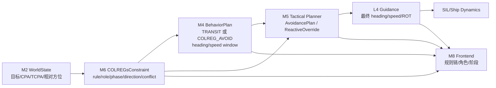

# COLREGs 快速探针场景套件

机读场景，schema `scenarios/fcb_traffic_situation.schema.json`（v3.0）。加载器
`tools/sil/scenario_spec.py`；编排器 `src/sil_orchestrator`（`ScenarioStore` 递归扫描）。

## 定位（三套测试集分工）

| 集合 | 定位 | 维护 |
|---|---|---|
| **本目录 `COLREGs测试/`** | **快速 dev 探针集** —— 近距起步（~2 NM，total_time ~4-7 min）、**单一目的**、单船、可手调。改 bug 时的"听诊器"，定位快。 | 由 `gen_colreg_tier12.py` **生成（唯一真源）**，勿手改 YAML |
| `IMAZU标准测试/` | **冻结验收基准**（Imazu-22，Sawada/Tengesdal & Johansen 2023） | 几何冻结 + sha256 哈希保护，**勿动** |
| `ais_derived/` | 真实 AIS 航迹 demo / 集成 | 后续复杂场景 |

> 多船 give-way×stand-on 冲突属 Imazu-22 的活，**本探针集只放单船单规则**，保持失败可归因。

## 探针清单（8 个，单一目的）

| scenario_id | COLREGs | OS 角色 | 期望动作 | cpa_min | 测什么 |
|---|---|---|---|---|---|
| `colreg-rule14-ho` | R14 | give-way | 右转 | `4L=180m` | 纯正遇；右转、port-to-port、最终回归中心航线 |
| `colreg-rule14-ho-port` | R14 | give-way | **右转** | `4L=180m` | 目标偏左 5°，仍须右转、port-to-port、最终回归中心航线 |
| `colreg-rule13-ot` | R13 | give-way | 右转/安全跟随 | `4L=180m` | 追越；Rule 13(d) 方位前移**不得重分类**（行为断言见 Phase B） |
| `colreg-rule15-cs` | R15/R16 | give-way | 右转 | `20L=900m` | 右舷穿越让路 |
| `colreg-rule15-cs-2` | R15/R16 | give-way | 右转 | `20L=900m` | 右舷穿越**短-TCPA**，逼早动作（Rule 8(b)） |
| `colreg-rule15-cs-edge` | R15 | give-way | 右转 | `6L=270m` | **边界**：正遇/穿越交界（rel_brg 25°） |
| `colreg-rule15-ot-boundary` | R15 | give-way | 右转 | `6L=270m` | **边界**：穿越/追越交界（rel_brg 108° ≈ 112.5° 线） |
| `colreg-rule17-cr-so` | R17/R15 | **stand-on** | 保向→末段 17(b) | `4L=180m` | 左舷目标应让不让（直线 replay）→ 触发 R17(b)；测**本船不提前避让** |

FCB 当前 `L=45m`。clean 8 CPA gate 只使用 YAML 中的 `4L/6L/20L` profile；`9L=405m` 只作为 ideal domain / 船艺质量线，不作为统一 hard floor。

CPA / XTE 参数口径：

- COLREGs 不给固定CPA数值；测试阈值按场景画像配置，不用全局硬编码。
- `open_water_crossing_20L`: FCB 开放水域 give-way 探针，使用 `20L=900m`。
- `corridor_close_start_4L`: Rule14 近距对遇且受 L2 安全航道约束，使用 `4L=180m` emergency CPA floor；route-return 仍必须回中心航线。
- `corridor_follow_or_overtake_4L`: Rule13 受限航道内接受安全跟随，不强制短时完成追越；持续义务由 Rule13(d) 和 risk/recovery trace 评价。
- `corridor_boundary_6L`: 分类边界探针使用 `6L=270m`，避免 open-water profile 掩盖边界规则行为。
- `standon_in_extremis_4L`: Rule17 late-action 使用 `4L=180m` emergency floor；直航船优先测“前期不抢让、末段才独立行动”。
- `route_corridor_half_width_m=1000` 表示L2给出的1km安全航道半宽；默认 `route_corridor_pass_limit_m=500` 是“不触发L2重规划”的最大XTE验收线；`colreg-rule14-ho` / `colreg-rule14-ho-port` 使用 `550m`、`colreg-rule15-ot-boundary` 使用 `700m` soft limit，保留近距/边界分类压力但不把仍在L2硬走廊内的回归轨迹误判为失败。

## 设计约束（"能反映真问题"）

- **近距起步 + DCPA≈0**：`solve_collision_target` 求目标航速使直线 DCPA≈0（纯正遇/追越用 `straight_target` 直接放置，避免求解退化）。无动作必碰 → 系统不避就红，杜绝假绿。
- **有效判据**：cpa_min 全部非 0、绑定船域（旧 `cs-3` 的 `cpa_min=0` 已删——CPA≥0 永真，无效）。
- **边界覆盖**：正遇/穿越（`ho-port` ↔ `cs-edge` 夹击）+ 穿越/追越（`ot-boundary`）两条扇区边界——bug 都住边界（M6 fishtail 就住正遇 ±6° 边界）。

## 本地校验（无需 A4000）

```bash
python -m tools.sil.gen_colreg_tier12      # 重生成 8 个（clean-regen：自动清残留）
python -m tools.sil.verify_colreg_tier12   # schema + loader + 真实 M2 分类 + DCPA<500
python tools/validate_scenarios.py --all   # 全仓 schema
pytest tools/sil/test_simulate.py          # kinematic 自洽（ho 可赢 ≥cpa_min）
```

## 8-probe 评价平台总览

### clean 8（passive target，测 own-ship 避碰）

| scenario_id | COLREGs | OS 角色 | give-way 主体 | target 模式 | 测什么 |
|---|---|---|---|---|---|
| `colreg-rule14-ho` | R14 | give-way | own | replay | 纯正遇右转、port-to-port、回中心航线 |
| `colreg-rule14-ho-port` | R14 | give-way | own | replay | 偏左 5° 仍右转 |
| `colreg-rule13-ot` | R13 | give-way | own | replay | 追越完成（C7 past-and-clear） |
| `colreg-rule15-cs` | R15 | give-way | own | replay | 右舷穿越让路 |
| `colreg-rule15-cs-2` | R15 | give-way | own | replay | 短-TCPA 逼早动作 |
| `colreg-rule15-cs-edge` | R15 | give-way | own | replay | 正遇/穿越边界 |
| `colreg-rule15-ot-boundary` | R15 | give-way | own | replay | 穿越/追越边界 |
| `colreg-rule17-cr-so` | R17 | stand-on | target | replay | 应让不让→末段 17(b) |

### intelligent 探针（target FSM 避碰，opt-in，不入 clean-8 批量）

| scenario_id | COLREGs | OS 角色 | target 角色 | 测什么 |
|---|---|---|---|---|
| `colreg-rule14-ho-intelligent` | R14 | stand-on | give-way (FSM) | target 对遇右转让路 |
| `colreg-rule15-cs-intelligent` | R15 | stand-on | give-way (FSM) | target 穿越让路 |
| `colreg-rule17-cr-so-target-giveway` | R17 | stand-on | give-way (FSM) | own 保向、target 让路 |
| `colreg-rule13-ot-target-giveway` | R13 | stand-on | give-way (FSM) | **target 追越让路**（H1 补洞） |

intelligent 探针需 `behavior.policy: colregs_rule_fsm`；target FSM 独立观测 `/sil/own_ship_state`，不订阅 TDL 决策。clean-8 仍只含 passive-replay 场景（评价 own-ship 避碰），intelligent 探针单独跑验证 target FSM。

### overall_pass gate 组成（8 信号 AND）

`scripts/run_6_scenarios.py::compute_overall_pass`：

```
overall_pass = cpa_ok
  ∧ stability_pass                          # 8 项稳定性 KPI（fishtail/flap 检测）
  ∧ (¬route_return_required ∨ returned_to_route)
  ∧ route_corridor_ok
  ∧ (¬overtake_required ∨ overtake_completed)
  ∧ risk_gate_ok
  ∧ seamanship_gate_ok
  ∧ phase_semantics_ok                      # C1-C8 阶段语义 gate
  ∧ (compliance_verdict ≠ "violated")       # COLREGs 合规评分 gate
```

每个 RED 都有可归因信号——无"机械右转即 PASS"漏洞。

### 已知偏离与 open items（2026-06-18 stage0/1/2 后）

| 场景 | 状态 | 归因 | 性质 |
|---|---|---|---|
| `colreg-rule15-cs` | RED | C1 rel_brg 89°（差 1° 未过 90° beam）+ route_return False（XTE 177m） | **M5 回航能力**（stage2 修复已把 release 从 19°→89°，但避让后回航时间/幅度不足） |
| `colreg-rule15-cs-2` | RED | C1 release 几何（同 cs） | 同上 |
| `colreg-rule15-ot-boundary` | RED | C1 release 几何 | 同上 |
| `colreg-rule17-cr-so` | RED | CPA ok=False（DCPA 168m<180m floor） | stand-on 紧急避让 DCPA，独立 open item |
| `colreg-rule13-ot` (cold) | RED | C7 overtake_completed=False | 追越 release 几何（own 未追上 target） |

**stage2 修复效果**：`give_way_reference_heading_release_safe` 加 past-beam guard 后，rule15-cs 的 C1 release bearing 从 19° 推迟到 89°（接近正确的 90° beam），C5 no-cross 从 False→True。剩余 RED 归因转向 M5 回航能力（避让后 XTE 不降），属独立行为层问题，非 M6 release。

**未覆盖（架构限制，暂缓）**：非合作机动目标（Tier-3）、Rule 19 受限能见度、多边形 geofence。


## 打分层（A4000 验收用，复用现有）

`src/sim_workbench/sil_nodes/scoring/`：
- `rule_compliance_evaluator.py` — R13/14/15/16/17 → full/partial/violated（查 `rudder_side`/`heading_change_deg`/`role`/`timing_stage`）。R14 左舵=violated；R17 直航船早期大转向=violated。
- `kpi_deriver.py` — `min_cpa_nm` / `max_rudder_deg` / `avg_rot_dpm`（操纵平滑度）/ `grounding_risk_score`。

### Phase B — 行为稳定性断言（已实现 2026-06-09）

`scoring/scoring/stability_scorer.py`（纯 stdlib，独立可导入，零 polars/ROS2 依赖）从单次
运行的 `runs/trace_current.jsonl`（run-records 时间序列，按 sim_t 回跳切片）派生稳定性 KPI，
逮纯 CPA 判据逮不到的 fishtail·flap 类行为 bug：

| KPI | 信号源（trace 话题） | PASS 阈值 |
|---|---|---|
| `behavior_toggles` | `/l3/m4/behavior_plan` AVOID↔TRANSIT 翻转 | ≤2（一起一落） |
| `plan_valid_segments` | `/l3/m5/avoidance_plan` solver_status VALID 段数 | ≤2 |
| `steering_reversals` | `/sil/own_ship_state` `rot_deg_s` 符号反转（死区 0.2°/s）→ rudder 没在 trace，ROT=偏航率即 fishtail 信号 | give-way ≤4 / stand-on ≤2 |
| `rot_hold_std_dps` | 保持段偏航率方差（掐头去尾 25%） | <1.5 |
| `conflict_toggles` | `/l3/m6/colregs_constraint` `conflict_detected` 翻转 | ≤2 |
| `role_onset_stable` | `primary_role` 的**本船义务类**（give_way={1,2} / stand_on={0}）在 conflict 期间不变（Rule 13(d)）；GIVE_WAY→BOTH_GIVE_WAY 细化属同义务不计 🟢 | 0 次义务翻转 |
| `turn_starboard` | give-way 净偏航必须右舷（max_stbd≥max_port 且实际转了） | give-way |
| `premature_giveway` | stand-on 保持段（前 75%）最大航向偏移 | stand-on <10° |

总裁决 `overall_pass` 是 8 信号全 AND：`cpa_ok ∧ stability_pass ∧ (¬route_return_required ∨ returned_to_route) ∧ route_corridor_ok ∧ (¬overtake_required ∨ overtake_completed) ∧ risk_gate_ok ∧ seamanship_gate_ok ∧ phase_semantics_ok ∧ (compliance_verdict ≠ "violated")`（见 `scripts/run_6_scenarios.py::compute_overall_pass`）。批量跑：

```bash
# --restart-between-runs 要求显式 --restart-container（默认空，防误重启主 stack）。
# 主 stack：mass-l3-sil-sil-nodes-1；behavior-fix stack：colregs-behavior-fix-sil-nodes-1
SIL_ORCH_BASE_URL=https://127.0.0.1:18000/api/v1 \
python3 scripts/run_colregs_clean_8probe.py --restart-between-runs \
  --restart-container mass-l3-sil-sil-nodes-1 \
  --summary-out runs/local_clean8_traceeval_$(date +%Y%m%d_%H%M%S).json \
  --trace-report-dir runs/trace_eval/$(date +%Y%m%d_%H%M%S)
```

结果落 `--summary-out`，每场景含 `stability_kpis`/`stability_checks`/`overall_pass`，
以及 `trace_evaluation_report_path` 指向 7-layer evaluator report。M6 话题需 bridge `docker/sil_topic_bridge.py` 已加 trace
（`_on_colregs_constraint`，scp+restart 生效）；M6 话题缺失时 conflict/role 两项 KPI 自动降级为 n/a。
阈值默认按角色派生，可经 scenario `metadata.expected_outcome.stability_thresholds` 覆盖（schema 已允许 additionalProperties）。
单元测试 `tests/sim_workbench/scoring/test_stability_scorer.py`（9 例，含 fishtail 回归锁 + benign 细化）。

## 前端测试对照 Runbook（8-probe）

本节用于前端/HMI 测试时人工对照：UI 展示的规则、角色、阶段、避碰轨迹、执行量必须与
M6/M4/M5/L4 链路一致。注意：前端不得把 Bridge 推断状态当成战术真相；Bridge 只能作为传输/调试层。

### 通用正常链路



### 通用前端检查点

| 层 | 前端应看到 |
|---|---|
| M6 | active rule、own role、phase、preferred direction、conflict_detected、rationale chain |
| M4 | behavior 从 `TRANSIT` 进入 `COLREG_AVOID`，再回 `TRANSIT`；不应高频抖动 |
| M5 | 有效 `AvoidancePlan`：航点、速度调整、active constraints、rationale |
| L4 | 右舵、保向、减速等执行量与 M5/M6 一致 |
| M8 | 决策树解释与实际动作一致，不用 Bridge 推断状态当真相 |

每次跑场景，前端至少记录：

```text
scenario_id
M6 active_rules
M6 primary_role
M6 primary_preferred_direction
M6 conflict_detected
M4 behavior
M4 heading_min/max
M5 plan valid/empty
M5 first waypoint / target heading if shown
L4 heading/speed/ROT/rudder
CPA min
conflict_toggles
behavior_toggles
steering_reversals
route_return_status
```

判定口径：

| 结果 | 含义 |
|---|---|
| GREEN | UI 规则、角色、动作、实际转向一致；give-way 场景早期右转，CPA 达标，之后归航；stand-on 场景前期保向，末段才 Rule17(b) 动作；toggles 在阈值内 |
| YELLOW | CPA 达标，但 UI 决策树缺 role/phase/direction；避碰正常但归航展示不清晰；plan 有效但 L4 执行量未显示 |
| RED | 左转违反 Rule14/15；提前让路违反 Rule17；M6/M4/M5 任一层高频抖动；CPA 不达标；前端显示 Bridge 推断状态而非 M6/M4/M5/L4 真链路 |

### 1. `colreg-rule14-ho`

文件：`colreg-rule14-ho.yaml`

| 项 | 期望 |
|---|---|
| 规则 | Rule 14 head-on |
| OS 角色 | give-way / both-give-way |
| 动作 | 右转，port-to-port pass |
| CPA | ≥180 m |
| XTE soft limit | ≤550 m |
| 总时长 | 1200 s |

示意：

```text
TS ↓  reciprocal, dead ahead
  |
  |
OS ↑  route north
```

正常流程：

1. M2 检出目标正前方、DCPA≈0、TCPA 接近。
2. M6 判定 Rule14，对遇；`primary_preferred_direction=STARBOARD`，`conflict_detected=true`。
3. M4 输出 `COLREG_AVOID`，heading window 偏右。
4. M5 生成右转避碰航点，不应只给小角度抖动。
5. L4 执行稳定右舵/右转。
6. 两船 port-to-port 通过，M6 保持 duty 到 past-and-clear。
7. M6 conflict false，M4 回 TRANSIT；本 close-start probe 要求保持在 L2 soft corridor 内，并最终回归 150m 中心线窗口。
8. 前端应显示 Rule14 → 右转 → 通过 → 回归中心航线。

异常信号：左转、保持直行、Rule14/Rule15 来回跳、M4 AVOID/TRANSIT 高频翻转。

### 2. `colreg-rule14-ho-port`

文件：`colreg-rule14-ho-port.yaml`

| 项 | 期望 |
|---|---|
| 规则 | Rule 14，port-biased boundary |
| OS 角色 | give-way / both-give-way |
| 动作 | 仍然右转 |
| CPA | ≥180 m |
| 总时长 | 300 s |

示意：

```text
 TS ↓  slightly port of bow
  \
   \
OS ↑
```

正常流程：

1. M6 不能把目标偏左 5°误判成“可以左转/穿越”。
2. Rule14 仍成立，direction 仍是 `STARBOARD`。
3. M4/M5/L4 动作与纯对遇一样：明确右转。
4. 该场景仍强制最终回归中心航线；L2 soft corridor 只作为最大 XTE 上限，不替代 route-return。
5. 前端决策树应显示“Rule14 head-on，port-biased but still starboard”。

异常信号：UI 显示 crossing、动作向左、M6 preferred direction 变 PORT/HOLD。

### 3. `colreg-rule13-ot`

文件：`colreg-rule13-ot.yaml`

| 项 | 期望 |
|---|---|
| 规则 | Rule 13 overtaking |
| OS 角色 | own give-way |
| 动作 | 右转追越，或受限航道内安全跟随 |
| CPA | ≥180 m |
| 总时长 | 420 s |

示意：

```text
TS ↑  slow 7 kn
OS ↑  fast 14 kn, overtaking
```

正常流程：

1. M6 判定追越，OS 是 give-way。
2. `conflict_detected=true` 后，role/direction 必须锁住。
3. OS 转右，绕开目标船；若 500m XTE 约束内无法完成追越，可减速保持安全跟随。
4. 即使相对方位前移，也不能重分类成 crossing 后释放。
5. 只有 past-and-clear 或安全跟随态解除威胁后才释放 conflict。
6. 前端应持续显示 Rule13 give-way，不能中途闪回 Tracking/TRANSIT。

异常信号：Rule13→Rule15/Free 翻转、conflict 多次跳、过早回航导致 fishtail。

### 4. `colreg-rule15-cs`

文件：`colreg-rule15-cs.yaml`

| 项 | 期望 |
|---|---|
| 规则 | Rule 15 + Rule 16 |
| OS 角色 | own give-way |
| 动作 | 右转，绕目标尾部 |
| CPA | ≥900 m |
| 总时长 | 300 s |

示意：

```text
       TS ↖ from starboard bow
          \
           \
OS ↑
```

正常流程：

1. M6 判定右舷交叉，OS give-way。
2. M6 direction=`STARBOARD`，Rule16 要求早而明显动作。
3. M4 进入 `COLREG_AVOID`。
4. M5 轨迹应从目标船尾部绕过，不应 cross ahead。
5. L4 执行右转，避让后回归航线。
6. 前端显示 Rule15：右舷目标，本船让路，策略为右转/绕尾。

异常信号：从目标船首前穿过、动作太晚、只小幅摆舵、CPA 不达标。

### 5. `colreg-rule15-cs-2`

文件：`colreg-rule15-cs-2.yaml`

| 项 | 期望 |
|---|---|
| 规则 | Rule 15 + Rule 16，短反应窗口 |
| OS 角色 | own give-way |
| 动作 | 早期、明确右转 |
| CPA | ≥900 m |
| 总时长 | 260 s |

正常流程同 Rule15 crossing，但前端重点看：

1. M6/M4 触发不能拖延。
2. M5 plan 应较早出现。
3. L4 右转应是明显动作，不是连续小修正。
4. CPA 必须仍达到 900 m。

异常信号：前半段 UI 仍显示 TRANSIT、M5 plan 延迟、最后才猛打舵。

### 6. `colreg-rule15-cs-edge`

文件：`colreg-rule15-cs-edge.yaml`

| 项 | 期望 |
|---|---|
| 规则 | Rule15，head-on/crossing 边界 |
| OS 角色 | own give-way |
| 动作 | 右转 |
| CPA | ≥270 m |
| 总时长 | 300 s |

示意：

```text
TS ↙  rel_brg ~25°, just outside head-on cone
   \
    \
OS ↑
```

正常流程：

1. M6 应稳定判为 Rule15 starboard crossing。
2. 不应在 Rule14/Rule15 间抖动。
3. 动作仍是右转。
4. 前端应显示“classification boundary，但当前规则稳定为 Rule15”。

异常信号：规则标签来回跳、direction 来回变、M4 behavior toggle >2。

### 7. `colreg-rule15-ot-boundary`

文件：`colreg-rule15-ot-boundary.yaml`

| 项 | 期望 |
|---|---|
| 规则 | Rule15，crossing/overtaking 边界 |
| OS 角色 | own give-way |
| 动作 | 右转 |
| CPA | ≥270 m |
| XTE soft limit | ≤700 m |
| 总时长 | 1200 s |

示意：

```text
        TS ↖ fast, rel_brg ~108°
      /
OS ↑
```

正常流程：

1. 初始相对方位约 108°，接近 112.5° crossing/overtaking 边界。
2. M6 应稳定保持 Rule15 give-way，不因方位漂移反复切换。
3. M4 应保持 `COLREG_AVOID`，不 AVOID/TRANSIT 抖动。
4. M5 应持续给有效右转 plan。
5. L4 不应出现左右舵来回反转。
6. 前端重点显示“Rule15 boundary stable”。

异常信号：这是当前最敏感场景。若看到 `conflict_toggles`、`behavior_toggles` 高，说明 M6/M4/M5 有一层在边界抖。

### 8. `colreg-rule17-cr-so`

文件：`colreg-rule17-cr-so.yaml`

| 项 | 期望 |
|---|---|
| 规则 | Rule17 + Rule15 |
| OS 角色 | stand-on |
| 动作 | 前期保向保速，末段 Rule17(b) 独立行动 |
| CPA | ≥180 m |
| 总时长 | 360 s |

示意：

```text
TS → from port side, target should give way but does not
      \
       \
OS ↑ stand-on
```

正常流程：

1. 前期：M6 显示 OS stand-on，preferred direction=`HOLD`。
2. M4 不应提前进入大幅 `COLREG_AVOID`。
3. M5 不应早期生成大偏航 plan。
4. L4 保向保速，前 75% 航向偏移 <10°。
5. 如果目标仍不让，M6 进入 Rule17(b) independent action。
6. M4 转 `COLREG_AVOID`，M5 给避碰 plan，L4 执行动作。
7. 前端应显示阶段变化：`Stand-on hold` → `Rule17(b) allowed action` → `Avoiding` → `Clear/Return`。

异常信号：OS 一开始就右转/左转大幅让路，或末段仍无动作。

## Tier-3 极限场景（暂缓，需 harness 改动）

1. **不合作机动目标**（对遇中目标违规左转切入）：`target_vessel_node` 仅支持直线 `replay` 与随机游走 `ncdm`，**无脚本化机动**。需新增脚本化机动目标模式或接入 `trajectory_file` 重放。
2. **受限地缘/geofence 交叉**：schema 无任意多边形 geofence 字段，静态危险仅来自 ENC（`enc_path`）。
3. **受限能见度（Rule 19）**：无 give-way/stand-on，双方都减速；需起雾 + 盲化光学传感器路径。

> 副作用利用：因目标恒为直线，"应让而不让"的直航测试（R17 末段 17(b)）无需改 harness 即成立 —— 已用于 `rule17-cr-so`。
