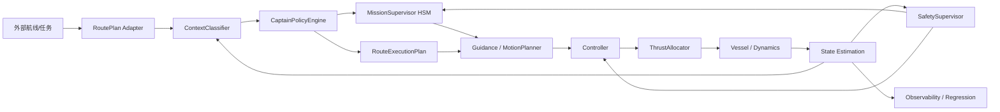

# 船长策略框架：从经验判断到可参数化代码

## 结论

不存在一组固定参数可以覆盖几乎所有航线。真实船长也不是用固定的 `XTE=35m`、`speed=8m/s`、`turn_radius=某个值` 去开所有水域。

可以通用的是一套判断流程：先识别水域、任务阶段、环境、交通、船况和权限，再选择速度、转弯、XTD/XTE、推进器使用、重规划和撤离策略。

因此代码上应采用：

```text
PassagePlan / RoutePlan
  -> ContextClassifier
  -> CaptainPolicyEngine
  -> MissionSupervisor
  -> Guidance / MotionPlanner
  -> Controller
  -> ThrustAllocator
  -> SafetySupervisor
  -> Observability / Regression
```

## 推荐采用的策略框架

建议采用 **Context-Aware Captain Policy Framework**，也就是：

```text
分层状态机 HSM
+ 船长策略引擎 CaptainPolicyEngine
+ 航线语义模型 RouteExecutionPlan
+ 安全监督器 SafetySupervisor
+ 可观测回归体系 Observability/Regression
```

这不是简单模拟船长手动操舵，而是把船长的判断顺序变成可配置、可解释、可回归测试的系统。



核心原则：

- 状态机决定现在做什么。
- 策略引擎决定当前上下文下允许怎么做。
- 制导和控制器决定如何执行。
- 安全监督器有权从任何阶段打断。
- 可观测系统记录每一次策略选择、门限、超限和状态转换。

## 船长脑中的通用经验策略

船长的通用策略不是固定数值，而是优先级和判断顺序：

1. 先保安全：人命、碰撞、搁浅、船舶和环境风险高于计划时间。
2. 再看水域：开阔水域、近岸、狭水道、港池、靠泊/作业区使用不同策略。
3. 再看阶段：巡航、减速、报告、进近、待命、靠泊/作业、撤离。
4. 再看余量：风流浪、交通、UKC、能见度、推进/舵机余量、定位可信度。
5. 再下指令：速度、转弯半径、WOP、ROT、XTD/XTE、推进器模式。
6. 偏离后分级处理：报警、减速、重入航线、待命、人工/岸基接管、撤离。

## 不能把所有航线都交给一套 controller 参数

002B 的早期验证暴露了一个典型问题：把短 S-turn 的 waypoint gate 策略放大到长 S-turn 后，控制器会在某些 apex 附近卡住或抄近路。

这说明：

- `waypoint switch gate` 是控制器切换航段的执行策略。
- `XTD/XTE corridor` 是航行安全走廊的验收策略。
- 两者不能混成一个参数。
- `rejoin strategy` 是偏离后如何回到航线的策略，不能硬编码为固定 45 度切入。

长航程船长意图航线应使用较少 captain-visible gates，规划层再生成内部采样点。可视化也必须区分这两类点。

### 002B 暴露出的具体问题

第一次长航程 002B 验证在长 S-turn 入口后出现 300m 级 XTE。日志显示系统没有进入安全故障，但 Guidance 的 `HOMING` 重入逻辑使用固定 45 度切入角，长航程中会造成过冲和反向追逐。

这不是动力学模型单独失效，而是策略层和制导层之间缺少可参数化的重入航线规则：

- 短 002 工程场景可以靠密集 waypoint 和较低速度通过。
- 长 002B 船长意图场景需要更柔和的比例重入策略。
- XTE 超限时应先减速、柔和重入，再判断是否待命或人工接管。

当前代码已将 `HOMING` 的硬编码参数变成策略参数：

```text
homing_threshold_m
homing_max_approach_angle_deg
homing_lookahead_m
```

002B 使用 C 级 mock 参数：

```text
homing_threshold_m = 80m
homing_max_approach_angle_deg = 32deg
homing_lookahead_m = 180m
```

这些值不是实船标定结果，只是用于验证接口是否能表达“船长式柔和重入航线”。

第三轮验证进一步说明：如果把长航程 002B 的 XTD 按工程短场景收得太窄，系统会长期降速重入，安全性提高但效率不足，最终无法在任务窗口内到达。002B 因此应明确为开阔/近岸长航程走廊，而不是狭水道或靠泊进近走廊。

当前 002B 的 C 级 mock 语义调整为：

```text
long planned turn XTD = 150m, about 0.08nm
rejoin trigger = 35-40m in current mock guidance
global max XTE acceptance = 150m
terminal approach XTD remains much tighter
```

这不是放松安全要求，而是把“开阔水域长航程安全走廊”和“靠泊/狭水道精确航迹”区分开。后续接真实海图、障碍物、航道边界、VTS 限制后，XTD 必须由水域和风险重新计算。

第四轮反证显示，把 rejoin trigger 放宽到 95-100m 会让 XTE 放大到 200m 级，不应采用。当前 mock 版本保留较早重入策略，用更长任务窗口吸收安全重入带来的航时成本。

第五轮又暴露了终端几何问题：最后 45m 垂直转入 final work point 太短，船在距离 final point 约 51m 时因 heading gate 未满足而没有切入 final hold，随后越过终点。因此 002B 的 final work point 已从 `[7900, 0]` 顺延到 `[8050, 0]`，让 `standby_gate -> final_work_point` 成为约 157m 的顺直低速进近线。

## 策略框架

### 1. ContextClassifier

输入：

- 水域类型：open water、coastal、narrow channel、port approach、berth/worksite。
- 任务阶段：precheck、cruise、decel、planned turn、report、approach、standby、work、abort escape。
- 环境：风、流、浪、能见度。
- 交通：CPA/TCPA、COLREG 角色、交通密度。
- 船况：吃水、稳性、乘客/甲板/吊机状态、推进器健康。
- 导航可信度：GNSS、IMU、罗经、融合状态。

输出：

- `context_label`
- `risk_level`
- `operational_design_domain_status`

### 2. CaptainPolicyEngine

根据 context 选择 profile：

- `open_water_cruise`
- `long_planned_turn`
- `engineering_s_turn_regression`
- `final_approach`
- `standby_and_work`
- `abort_escape`

每个 profile 输出：

- 速度窗口
- XTD/XTE 走廊
- WOP / wheel-over
- turn radius / ROT
- lookahead
- waypoint switch gate
- 推进器使用策略
- 降级和撤离策略

### 3. MissionSupervisor

状态机决定“现在该做什么”：

```text
PRECHECK -> CRUISE -> DECEL -> REPORT -> APPROACH -> STANDBY
         -> BERTH_OR_WORK -> COMPLETE
         -> ABORT_ESCAPE
```

每个状态都应有：

- enter
- tick
- can_exit
- abort_if

### 4. Guidance / MotionPlanner

把 RoutePlan 变成可执行轨迹：

- captain-visible gates 不应直接全部作为控制器硬追踪点。
- planner internal samples 可以密，但应默认隐藏。
- 长 S-turn 应用平滑曲线、分段 XTD、速度窗口和 WOP。
- 低速进近应切换到 final approach / DP / hold 策略。

### 5. SafetySupervisor

安全监督器不负责“开船”，它负责判断是否还能继续按当前策略开：

- `NOMINAL`
- `CAUTION`
- `DEGRADED`
- `ABORT_REQUIRED`

XTE/XTD 超限不应总是直接 emergency abort。合理顺序是：

```text
alert -> reduce speed -> rejoin corridor -> hold/manual handover -> abort escape
```

只有碰撞、搁浅、硬边界、定位失效且无备份、严重执行器故障等才进入强制撤离。

## 代码落地路径

### 第一阶段：策略配置化

新增：

- `config/policies/captain_policy_45m_crewboat_c_mock.yaml`
- `CaptainPolicyEngine`
- `/policy/selected_profile`
- `/policy/route_constraints`
- `/policy/speed_envelope`
- `/policy/propulsion_policy`

现有 scenario YAML 不再单独承担所有策略。scenario 只描述测试输入；policy 决定不同场景如何开。

### 第二阶段：RoutePlan Adapter

把外部航线转换为内部语义：

```text
RTZ / operator plan / ECDIS route
  -> captain-visible gates
  -> leg constraints
  -> turn constraints
  -> internal samples
  -> controller-ready route
```

注意：

- S-57/S-101 是 ENC/chart 数据，不是航线交换格式。
- 航线交换更接近 RTZ / IEC PAS 61174-1。
- S-100/S-101/S-102/S-104/S-111/S-124/S-129 可作为约束来源。

### 第三阶段：控制器接口化

Guidance 不应只读 `own_ship.waypoints`：

```text
RouteExecutionPlan
  - captain_gates
  - internal_samples
  - leg_xtd_limits
  - switch_gates
  - speed_profile
  - turn_profile
```

控制器只消费执行层数据，不能把 captain gate 当作每个周期必须追逐的点。

### 第四阶段：回归测试矩阵

保留：

- 001：8m/s 静水直航 golden baseline。
- 002：短 S-turn 工程回归。
- 002B：长航程船长意图航线。

新增后续：

- 002C：长航程 + 横风。
- 002D：长航程 + 横流。
- 002E：长航程 + 交通目标。
- 002F：长航程 + GNSS 降级。
- 002G：长航程 + 推进器能力下降。

每个场景必须先跑 001 和 002 回归，防止改一个场景破坏另一个场景。

## 需要对接的系统

### 航线/海图系统

- ECDIS / route planner
- RTZ route exchange
- ENC / S-57 / S-101
- S-102 bathymetry
- S-104 water level
- S-111 currents
- S-124 navigational warnings
- S-129 UKC management

### 导航和感知系统

- GNSS / RTK
- IMU
- compass / gyro
- radar / AIS / camera / lidar
- sensor fusion
- traffic risk / CPA / TCPA / COLREG reasoning

### 船舶平台系统

- propulsion / thruster allocator
- steering / rudder
- engine and actuator health
- power management
- DP / low-speed hold

### 任务和权限系统

- VTS / port clearance
- report point confirmation
- final approach clearance
- standby/work authorization
- manual or remote operator confirmation

### 可观测和审计系统

- phase transitions
- selected policy profile
- speed envelope
- route corridor margins
- XTE/XTD exceedance
- command limits
- safety state
- operator confirmations
- route changes and reason codes

## 标准依据

- IMO A.893(21)：航次计划强调 appraisal、planning、execution、monitoring，并要求考虑 berth-to-berth、船况、海图、水深、气象、交通、VTS、引航、安全航速、UKC、转向点和应急计划。
- IHO ENC/ECDIS：S-101 ENC Edition 2.0.0 于 2026-01-01 生效；S-100 体系还包括 S-102、S-104、S-111、S-124、S-129 等数据产品。
- IEC PAS 61174-1:2021：RTZ route plan exchange format 更接近航线交换，不应把 S-57/S-101 误写成航线格式本身。

## 当前项目建议

当前最合理的开发顺序：

1. 固化 001 和 002，不再用它们表达真实船长航线。
2. 完成 002B 长航程船长意图场景。
3. 把 002B 暴露出的策略问题转成 `CaptainPolicyEngine`。
4. 将可视化改为 captain gates + planner internal samples。
5. 建立 001/002/002B 三场景回归门。
6. 再进入风、流、浪、交通和故障场景。
