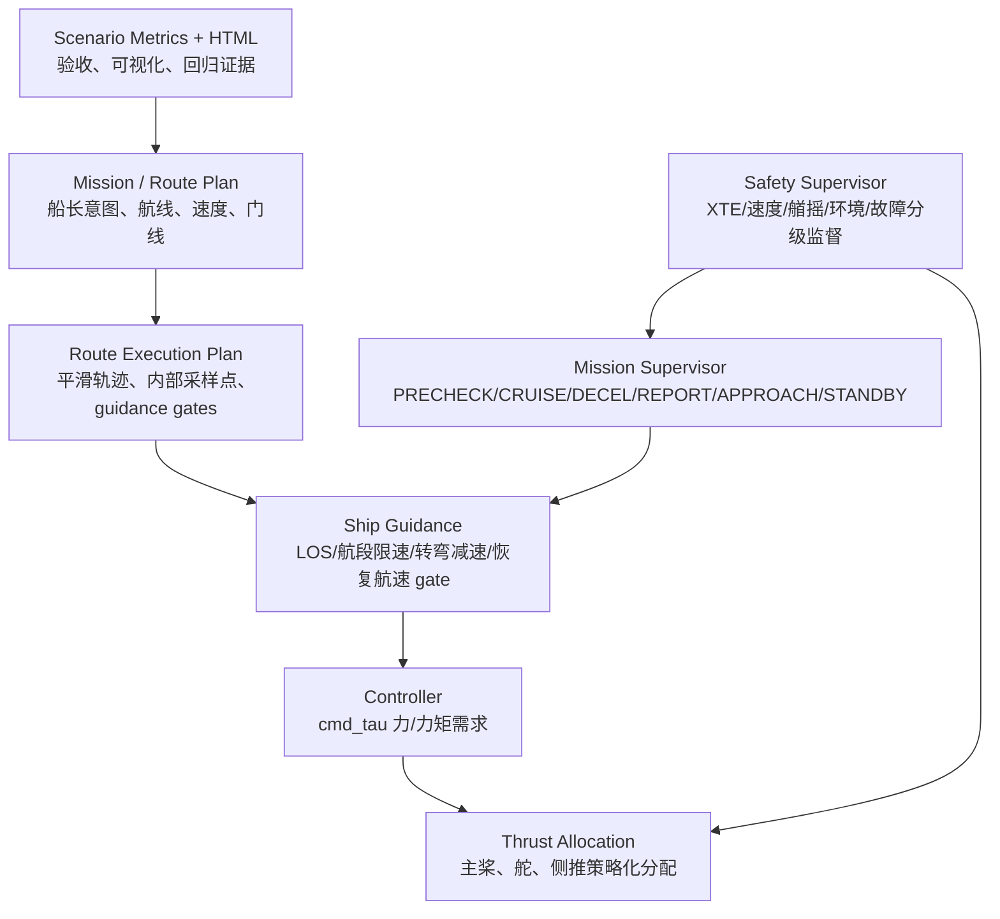

# 船长化策略与代码实现说明

更新时间：2026-05-21
适用分支：`tiger`
适用范围：45 m crewboat 辅助驾驶 mock 验证阶段
可信度声明：当前策略参数均为 C 级 mock 参数，后续需要用实船参数、海试数据、航线数据、港口/VTS 规则和操作手册重新校准。

## 1. 文档目的

本文用于帮助开发人员理解当前系统中已经落地的“船长化策略”：

- 船长意图如何从航线计划转换成可执行约束。
- 任务状态机、安全监督器、制导、推力分配各自承担什么职责。
- 哪些策略已经在代码中实现，哪些仍处于 mock 验证阶段。
- 后续接入真实数据时，哪些地方应校准，哪些接口应保持稳定。

核心原则是：

```text
状态机决定“现在该做什么”；
制导/控制器决定“怎么开过去”；
安全监督器随时评估是否还能继续；
推力分配器不能让 QP 或控制器自由乱用推进系统；
所有策略必须参数化、接口化、可观测、可回归测试。
```

## 2. 总体架构



当前代码不是简单追逐 waypoint，而是把航行拆成多层：

- 船长/任务层：少量关键 WP、报告点、进近点、待命点、终点。
- 路径规划层：转弯半径、wheel-over、XTE/XTL、速度区间、平滑内部轨迹。
- 制导层：航迹跟踪、航段限速、转弯前减速、偏航/横向误差收敛后恢复速度。
- 执行层：推力/舵/侧推分配策略，不让 QP 任意使用执行器。
- 安全层：持续评估是否警戒、降级、撤离。
- 验证层：用 YAML + CSV metrics + HTML 验证“是否按意图航行”。

## 3. 已实现的船长化策略

### 3.1 任务阶段化，而不是盲目追 WP

实现文件：

- `src/mission/mission_supervisor/mission_supervisor/mission_supervisor_node.py`
- `src/mission/mission_supervisor/config/mission_gates.yaml`

当前状态机：

```text
PRECHECK
  -> CRUISE
  -> DECEL
  -> REPORT
  -> APPROACH
  -> STANDBY
  -> COMPLETE 或 BERTH_OR_WORK

任意阶段可因安全请求进入 ABORT_ESCAPE。
```

关键逻辑：

- `PRECHECK`：必须先有最小导航观测。
- `CRUISE`：正常航行，接近终点或减速门线后进入 `DECEL`。
- `DECEL`：按距离门线转入报告/进近准备。
- `REPORT`：等待 mock VTS/泊位许可。
- `APPROACH`：要求位置和速度同时满足后进入待命。
- `STANDBY`：要求位置、速度和 dwell time 后完成。
- `ABORT_ESCAPE`：当前仍是 mock，占位为后续撤离路径。

可观测接口：

- `/mission/phase`
- `/mission/status`
- `/mission/active_gate`

当前定位：shadow-mode 状态机。它用于观测和验收任务流程，目前不直接替代底层制导/控制输出。

### 3.2 XTE/XTL 是分级约束，不是单一绝对红线

实现文件：

- `src/safety/safety_supervisor/safety_supervisor/safety_supervisor_node.py`
- `src/safety/safety_supervisor/config/safety_limits.yaml`

已经实现：

- 按 mission phase 使用不同安全限值。
- 速度、艏摇角速度、环境载荷、执行器健康状态、route corridor XTE 统一进入安全评估。
- route corridor 支持：
  - caution ratio
  - degraded ratio
  - abort ratio
  - 使用 mission status 中发布的 route XTE limit。

策略含义：

- 偏离正常航道目标，不等于立刻撤离。
- 超过警戒值，应该报警、降速、提示重规划。
- 超过降级值，系统应限制行为或请求人工关注。
- 超过撤离值，才进入 abort-required 级别。

可观测接口：

- `/safety/status`
- `/safety/abort_request`
- `/captain/alert`

### 3.3 航速是上下文策略，不是固定 8 m/s 红线

001 场景建立了静水直航 8 m/s 基线，但 8 m/s 不是所有场景都必须硬保持。

当前策略：

- 静水直航：应尽量保持 8 m/s。
- 转弯前：根据转弯角度、航段限速、wheel-over 距离提前减速。
- S-turn 或长转弯：用较低速度换取可控转弯半径、横向误差和乘客舒适性。
- 进近/待命/终点保持：必须降速。
- 外部载荷场景：后续应根据风、流、浪和航道约束动态降速。

实现文件：

- `src/gnc/ship_guidance/src/ship_guidance_node.cpp`
- `src/gnc/ship_guidance/include/ship_guidance/ship_guidance_node.hpp`

关键参数：

```text
wp_speed_limit_mps
wp_lookahead_m
wp_switch_radius_m
wp_wheel_over_distance_m
wp_rejoin_cross_track_m
wp_gate_blocked_speed_mps
wp_navigation_modes
```

这些参数由场景 YAML 的 `route_plan` 或 `route_execution` 转换后传入 guidance node。

### 3.4 转弯后恢复巡航速度必须显式 gate

这是最近新增的核心逻辑。目的不是“过了 WP 就加速”，而是更接近船长判断：

```text
先确认船已经回到航道附近；
再确认船头、艏摇、横向运动都稳定；
最后才逐步恢复巡航速度。
```

实现文件：

- `src/gnc/ship_guidance/src/ship_guidance_node.cpp`
- `src/gnc/ship_guidance/include/ship_guidance/ship_guidance_node.hpp`

主要参数：

```text
turn_recovery_gate_enabled
turn_recovery_require_cruise_mode
turn_recovery_max_xte_m
turn_recovery_max_heading_error_deg
turn_recovery_max_yaw_rate_deg_s
turn_recovery_max_cross_track_rate_mps
turn_recovery_speed_margin_mps
turn_recovery_speed_ramp_mps2
```

通过条件：

```text
abs(XTE) <= turn_recovery_max_xte_m
heading_error <= turn_recovery_max_heading_error_deg
yaw_rate <= turn_recovery_max_yaw_rate_deg_s
abs(cross_track_rate) <= turn_recovery_max_cross_track_rate_mps
not route_rejoin_required
```

行为：

- 未通过 gate：速度 cap 保持在上一航段低速。
- 通过 gate：按 `turn_recovery_speed_ramp_mps2` 逐步恢复到新航段速度。

002C 动态验证中的关键日志：

```text
[SPEED RECOVERY] gate cleared wp[3] e=29.7m/35.0m hdg=8.0/8.0deg yaw_rate=0.02/0.50deg_s e_dot=-0.15/0.30mps
[SPEED RECOVERY] ramp wp[3] cap=3.77 target=8.00 ramp=0.35mps2
```

### 3.5 船长可见 WP 与控制器内部采样点分离

早期问题是 WP 太密，看起来不像船长航线；同时控制器又需要更细的轨迹点才能平滑跟踪。

当前分层：

- `route_plan.source_waypoints`：船长可见的少量关键门点。
- `route_plan.turn_plan`：转弯半径、ROT、wheel-over、目标转弯速度。
- `route_plan.route_execution`：生成平滑轨迹和内部采样点。
- `route_execution_plan.py`：把船长意图变成 guidance 可执行的内部点。

实现文件：

- `src/simulation/mock_scenarios/mock_scenarios/route_execution_plan.py`
- `src/simulation/mock_scenarios/launch/a_to_b_validation.launch.py`
- `src/simulation/mock_scenarios/mock_scenarios/scenario_visualization.py`

关键函数：

```text
build_route_execution_plan()
_build_turn_aware_samples()
_build_guidance_gates()
guidance_waypoints_for_scenario()
```

这意味着：

- 船长不需要看到全部内部采样点。
- 控制器可以使用密集点和平滑曲线。
- HTML 可视化应同时展示 captain gates 和 route execution，避免误判。

### 3.6 推进系统不能由 QP 或控制器自由乱用

已经加入推进策略约束，避免直航时侧推无故激活、主桨不合理不对称等问题。

实现文件：

- `src/gnc/thrust_allocation/src/thrust_allocation_node.cpp`
- `src/gnc/thrust_allocation/include/thrust_allocation/thrust_allocation_node.hpp`

主要策略：

1. 直航主桨均衡
   在巡航、横向力和艏摇力矩需求很小的情况下，把主桨推力均衡化，避免 QP 局部最优导致主桨不对称。

2. 高速/中速侧推锁定或降额
   侧推在高速下效率低、风险高，因此按速度锁定或指数降额。

3. 低速机动才释放差动/侧推能力
   当船速进入低速范围，才允许更多机动能力参与。

4. 应急例外
   当艏摇需求超过阈值且速度仍在允许范围内，可以应急解锁侧推，但需要日志可观测。

关键参数：

```text
enable_straight_cruise_main_equalization
main_equalization_yaw_deadband_kNm
main_equalization_lateral_deadband_kN
side_thruster_derate_start_speed_mps
side_thruster_derate_decay_per_mps
side_thruster_lockout_speed_mps
side_thruster_emergency_unlock_max_speed_mps
side_thruster_lateral_deadband_kN
side_thruster_yaw_emergency_kNm
```

### 3.7 所有 mock 参数必须 C 级标注

实现文件：

- `src/simulation/mock_scenarios/config/validation/mock_data_contract.yaml`
- `src/mission/mission_supervisor/config/mission_gates.yaml`
- `src/safety/safety_supervisor/config/safety_limits.yaml`
- 各 `config/scenarios/*.yaml`

要求：

```text
parameter_source: mock_data
parameter_confidence: C
real_data_transition: 必须说明真实数据替换路径
```

原则：

后续接入真实数据时，应替换数据源、校准参数、扩展验证，不应重写 mission/safety/guidance/control/allocation 的核心接口。

## 4. 关键场景说明

### 4.1 001_straight_calm

作用：

- 静水直航 8 m/s 基线。
- 用于暴露基础正负号、主桨分配、直航稳定性问题。

策略含义：

- 8 m/s 是静水直航目标，不是所有场景的硬红线。

### 4.2 002_s_turn_calm

作用：

- 工程回归场景。
- 验证 S-turn、终点保持、转弯减速、route-plan XTE。

注意：

- 它是短距离工程场景，不是理想船长航线。
- WP 较密是历史调试和回归用途，不应作为真实航线设计模板。

### 4.3 002B_long_captain_intent

作用：

- 长航程船长意图场景。
- 验证 sparse visible gates + internal route execution。
- 验证 8 m/s 巡航、长 S-turn 减速、正常 XTE 目标、硬 XTL 约束、最终进近/保持。

文件：

- `src/simulation/mock_scenarios/config/scenarios/002b_long_captain_intent.yaml`

关键参数：

```text
nominal_xte_target_m: 35.0
max_normal_xte_m: 45.0
max_route_plan_xte_ratio: 0.70
turn_recovery_max_xte_m: 35.0
turn_recovery_max_heading_error_deg: 8.0
turn_recovery_max_yaw_rate_deg_s: 0.5
turn_recovery_max_cross_track_rate_mps: 0.30
```

### 4.4 002C_turn_recovery_cruise

作用：

- 专门验证“转弯后显式恢复巡航速度 gate”。

文件：

- `src/simulation/mock_scenarios/config/scenarios/002c_turn_recovery_cruise.yaml`

最新验证结果：

```text
SUMMARY: 0 failed, 18 passed, 0 pending
```

运行结果目录：

```text
D:\02-dynamics\reports\regression_002c_explicit_speed_recovery_pass3_20260521\002c_turn_recovery_cruise_20260521_085735\
```

HTML：

```text
D:\02-dynamics\reports\regression_002c_explicit_speed_recovery_pass3_20260521\002c_turn_recovery_cruise_20260521_085735\scenario_visualization.html
```

关键指标：

```text
post_turn_recovery_observed: true
min_post_turn_recovery_peak_speed_mps: observed 7.5746 >= expected 7.0
max_final_position_error_m: observed 2.4674 <= expected 25
max_final_speed_mps: observed 0.0031 <= expected 0.35
max_cross_track_error_m: observed 37.979 <= expected 120
max_route_plan_xte_excess_m: observed 0
```

## 5. 验收与可视化

实现文件：

- `src/simulation/mock_scenarios/mock_scenarios/scenario_metrics_from_csv.py`
- `src/simulation/mock_scenarios/mock_scenarios/scenario_acceptance.py`
- `src/simulation/mock_scenarios/mock_scenarios/scenario_visualization.py`

当前验收不只看是否到终点，还看：

- 峰值速度是否达到预期。
- 平均航速是否合理。
- 是否成功进入终点保持。
- 终点位置误差和终点速度。
- 最大 XTE。
- route-plan XTE 是否超限。
- 是否发生航行故障。
- 是否进入 degraded/abort。
- 是否出现硬转向。
- 转弯后恢复速度 gate 是否被观测到。

新增/重要指标：

```text
max_route_plan_xte_excess_m
max_route_plan_xte_ratio
max_route_plan_caution_excess_m
post_turn_recovery_observed
min_post_turn_recovery_peak_speed_mps
```

可视化目标：

- 显示实际轨迹与计划航线。
- 区分 captain gates 和 route execution 内部点。
- 展示速度、XTE、航向误差、艏摇角速度、终点距离和 acceptance 表。

## 6. 开发人员修改原则

### 6.1 不要把所有问题都通过放宽 XTE 解决

如果轨迹偏离过大，优先检查：

- route_plan 是否符合船长意图。
- 转弯半径是否适合 45 m crewboat。
- wheel-over 是否过早或过晚。
- 航段速度是否过高。
- lookahead 是否过大或过小。
- rejoin 和 gate_blocked_speed 是否合理。
- 推力分配是否错误使用侧推或主桨。

### 6.2 不要让恢复巡航速度绕过 gate

转弯后恢复速度必须保留以下判断：

- XTE 收敛。
- 航向误差收敛。
- 艏摇角速度收敛。
- 横向偏离变化率收敛。
- 不处于 route rejoin 状态。

否则会出现“船头看似对正，但船身仍横向漂移”的危险现象。

### 6.3 不要把 002 当成真实航线模板

002 是工程回归场景。真实船长意图场景应参考 002B/002C 的分层方式：

```text
少量船长可见 WP
+ 转弯/速度/门线策略
+ 内部 route execution samples
+ 可观测验收指标
```

### 6.4 新增场景必须同时给出策略和验收

新增 YAML 场景应至少包含：

- `data_policy`
- `validation_objective`
- `route_plan`
- `tuning`
- `expected`

如果是船长意图场景，还应包含：

- `source_waypoints`
- `turn_plan`
- `corridor_policy`
- `route_execution`
- `waypoint_gates` 或由 `route_execution` 生成的 gates
- 对应 acceptance 指标

### 6.5 接真实数据时不要重写核心逻辑

真实数据替换顺序建议：

1. 替换船舶主尺度、推进器、舵、质量、阻尼、功率限制。
2. 替换 route_plan 输入，接入 RTZ/ECDIS/航线规划系统输出。
3. 替换环境载荷来源，接真实风流浪/预报/传感器融合。
4. 替换 VTS、港口、靠泊、甲板互锁状态。
5. 用海试数据校准速度、ROT、turn radius、XTE、推力策略。
6. 保持 mission/safety/guidance/allocation 接口稳定。

## 7. 当前边界与未完成项

当前仍未完成或仅为 mock：

- `ABORT_ESCAPE` 还没有真实撤离路径。
- `BERTH_OR_WORK` 还没有真实靠泊/作业控制。
- VTS/港口许可仍是 mock permission。
- 甲板、吊机、乘客互锁尚未接入真实状态。
- 外部风流浪场景仍需继续闭环验证。
- 45 m crewboat 的操纵参数仍需实船/仿真高保真数据校准。
- ROS2/DDS 当前是工程通信链路，不应被描述为安全执行链路本身。

## 8. 常用验证命令

构建：

```bash
wsl -d Ubuntu-22.04 -- bash /mnt/d/02-dynamics/tools/wsl_ros2_build_ab_runtime.sh
```

运行 002C：

```bash
cd /d D:\02-dynamics
wsl -d Ubuntu-22.04 -- env LOG_BASE=/mnt/d/02-dynamics/reports/regression_002c_explicit_speed_recovery_pass3_20260521 REQUIRE_FINAL_REACHED=true FAIL_ON_PENDING=true bash /mnt/d/02-dynamics/tools/wsl_ros2_run_ab_validation.sh /mnt/d/02-dynamics/src/simulation/mock_scenarios/config/scenarios/002c_turn_recovery_cruise.yaml auto
```

生成 HTML：

```bash
wsl -d Ubuntu-22.04 -- bash /mnt/d/02-dynamics/tools/wsl_ros2_visualize_run.sh /mnt/d/02-dynamics/src/simulation/mock_scenarios/config/scenarios/002c_turn_recovery_cruise.yaml /mnt/d/02-dynamics/reports/regression_002c_explicit_speed_recovery_pass3_20260521/002c_turn_recovery_cruise_20260521_085735
```

检查 YAML：

```bash
wsl -d Ubuntu-22.04 -- env PYTHONPATH=/mnt/d/02-dynamics/src/simulation/mock_scenarios python3 /mnt/d/02-dynamics/src/simulation/mock_scenarios/mock_scenarios/scenario_validator.py /mnt/d/02-dynamics/src/simulation/mock_scenarios/config/scenarios/002c_turn_recovery_cruise.yaml
```

检查 mock data 合同：

```bash
wsl -d Ubuntu-22.04 -- env PYTHONPATH=/mnt/d/02-dynamics/src/simulation/mock_scenarios python3 /mnt/d/02-dynamics/src/simulation/mock_scenarios/mock_scenarios/mock_contract_check.py --contract /mnt/d/02-dynamics/src/simulation/mock_scenarios/config/validation/mock_data_contract.yaml --scenario-dir /mnt/d/02-dynamics/src/simulation/mock_scenarios/config/scenarios
```

## 9. 一句话结论

当前系统已经从“控制器追一串点”升级为：

```text
任务状态机表达船长流程；
route_plan 表达船长意图；
route_execution 生成控制器内部轨迹；
guidance 执行门线、速度、rejoin 和恢复策略；
safety supervisor 分级监督；
allocator 按推进系统经验约束执行；
metrics 和 HTML 证明是否按意图安全航行。
```

但当前仍是 C 级 mock 验证阶段，下一步重点应是接入真实船舶参数、真实航线计划接口、真实环境载荷和真实作业互锁，并继续用场景回归保证每一步不破坏既有能力。
